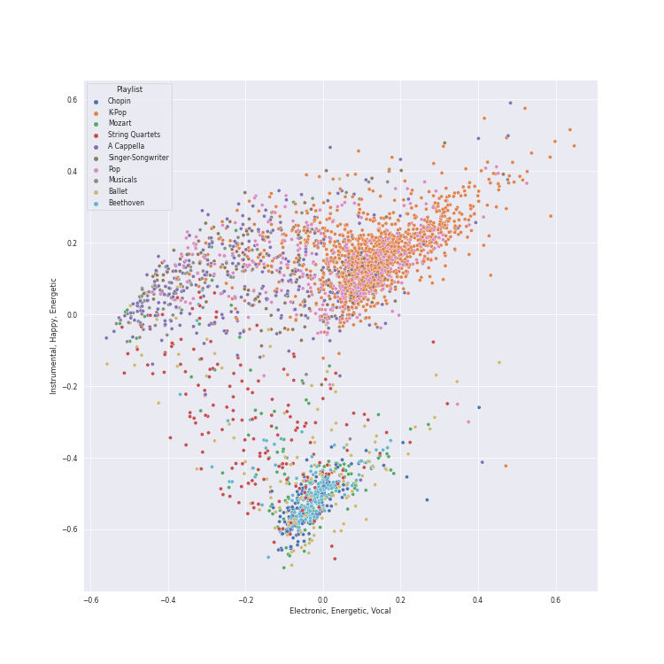
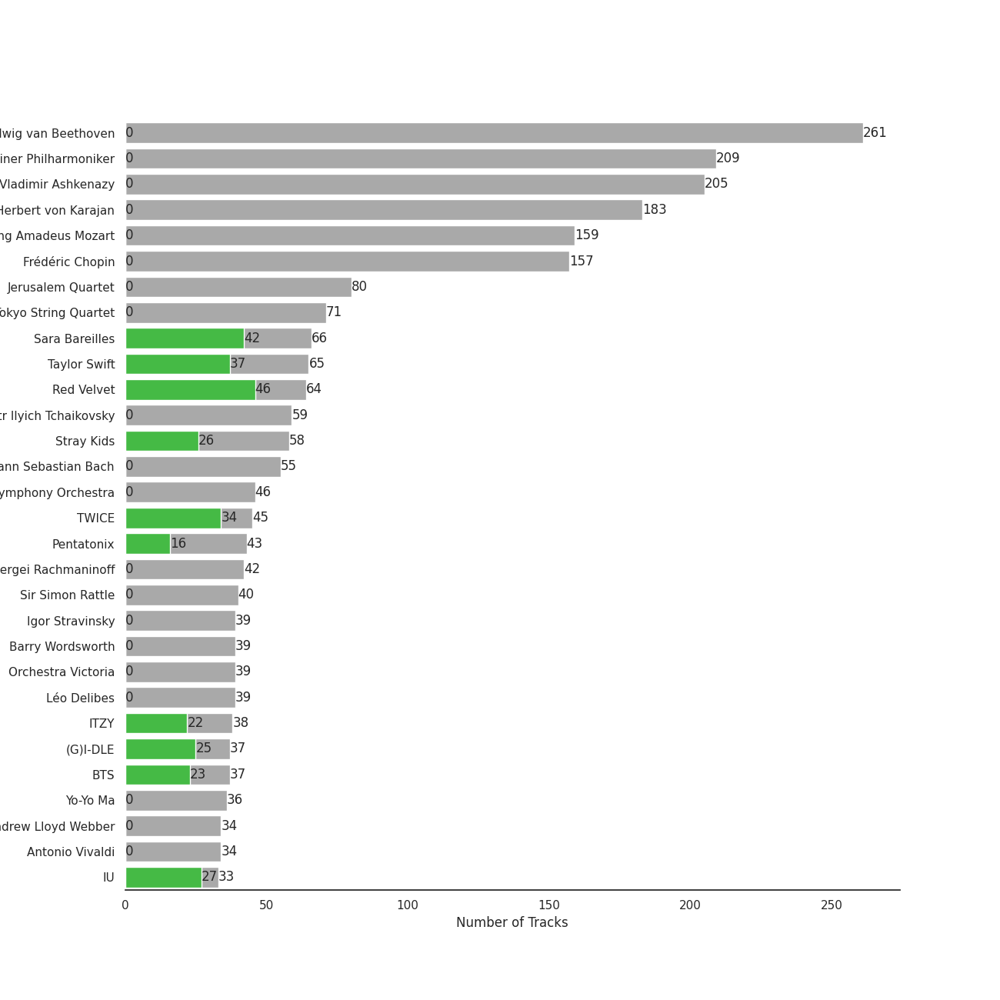
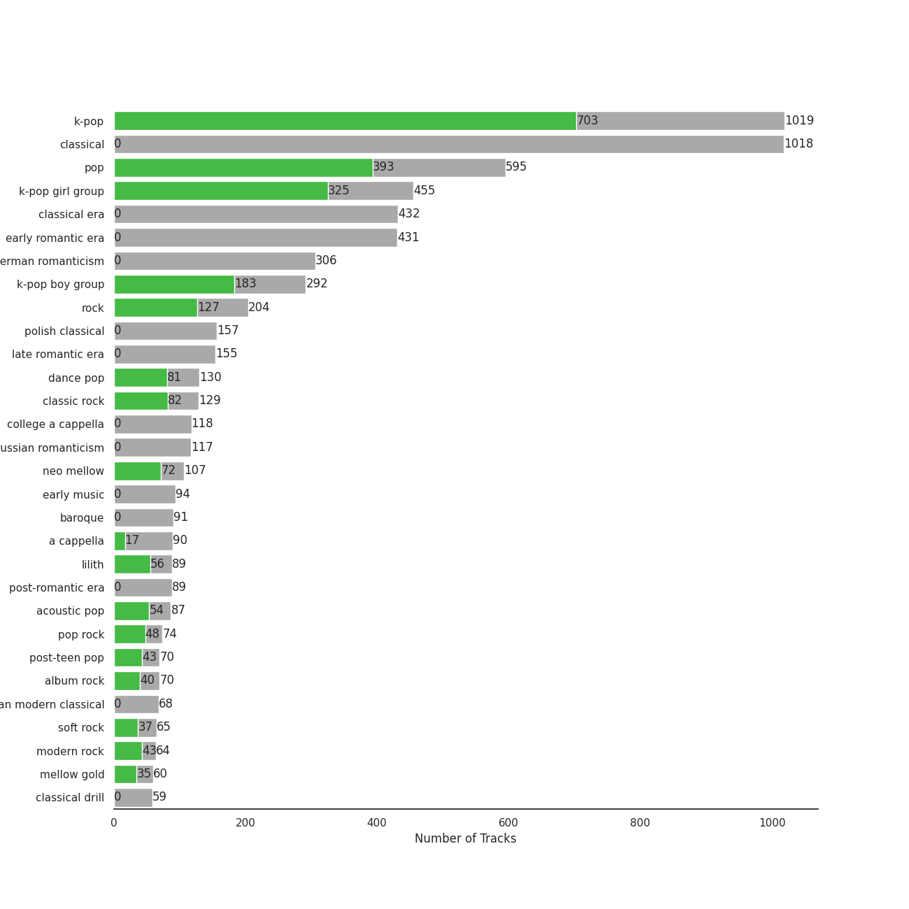
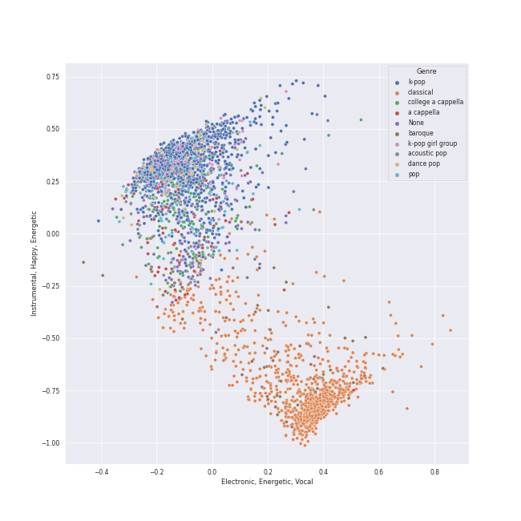
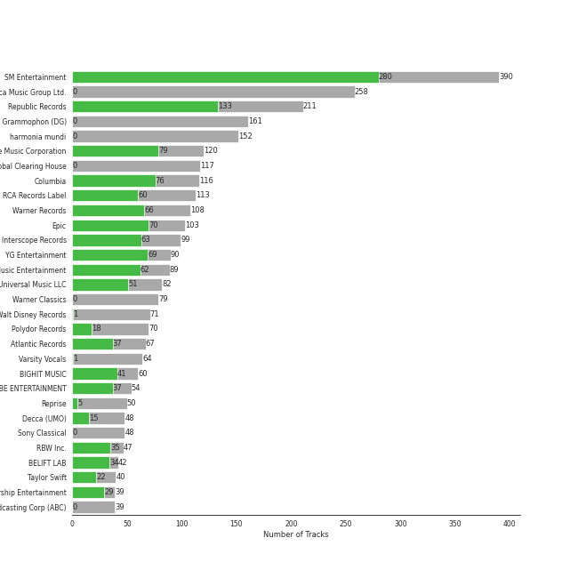
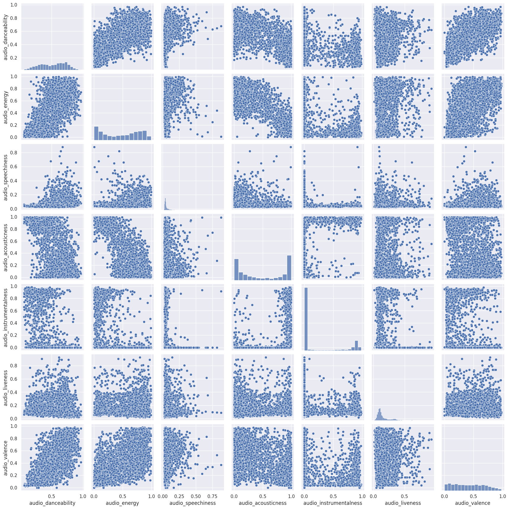

# Spotify Summary for jbrown1618

Generated by [jbrown1618/spotify-stats](https://github.com/jbrown1618/spotify-stats)

## Top Tracks

| Place | Last month | Last 6 months | All time |
|---:|:---|:---|:---|
| 1 | 
 Birthday
 | 
 Birthday
 | 
 HIP
 |
| 2 | 
 HIP
 | 
 ZOOM
 | 
 Pretty Savage
 |
| 3 | 
 Stamp On It
 | 
 On A Ride
 | 
 Maria
 |
| 4 | 
 Cheshire
 | 
 Cheshire
 | 
 DESSERT
 |
| 5 | 
 Impurities
 | 
 Birthday
 | 
 How You Like That
 |
| 6 | 
 Candy
 | 
 Shut Down
 | 
 Kill This Love
 |
| 7 | 
 HOME
 | 
 Illusion
 | 
 Crazy Over You
 |
| 8 | 
 HALAZIA
 | 
 Impurities
 | 
 I Am The Best
 |
| 9 | 
 Dead Man Runnin’
 | 
 BYE BYE
 | 
 BEAM BEAM
 |
| 10 | 
 OMG
 | 
 Snowy
 | 
 Egotistic
 |

See top 50 tracks

| Place | Last month | Last 6 months | All time |
|---:|:---|:---|:---|
| 11 | 
 Make A Wish (Birthday Song)
 | 
 ParadoXXX Invasion
 | 
 무제(無題) (Untitled, 2014)
 |
| 12 | 
 Young, Dumb, Stupid
 | 
 Stamp On It
 | 
 Gotta Go
 |
| 13 | 
 Whale
 | 
 HIP
 | 
 Dumb Dumb
 |
| 14 | 
 Hold On Tight
 | 
 Crown
 | 
 눈,코,입 (Eyes, Nose, Lips)
 |
| 15 | 
 Dumb Dumb
 | 
 HELLO
 | 
 Love Shot
 |
| 16 | 
 ANTIFRAGILE
 | 
 Nxde
 | 
 Black Mamba
 |
| 17 | 
 Fighting (Feat. Lee Young Ji)
 | 
 Time After Time
 | 
 러시안 룰렛 Russian Roulette
 |
| 18 | 
 Alter Ego
 | 
 Scent of you
 | 
 Next Level
 |
| 19 | 
 Gold Dust
 | 
 2 Baddies
 | 
 When This Rain Stops
 |
| 20 | 
 Maria
 | 
 28 Reasons
 | 
 BOOM
 |
| 21 | 
 CRAZY STUPID LOVE
 | 
 Pink Venom
 | 
 Bad Boy
 |
| 22 | 
 enchanted night ~ white night
 | 
 Animal Farm
 | 
 HELICOPTER
 |
| 23 | 
 ZOOM
 | 
 OMG
 | 
 Uh-Oh
 |
| 24 | 
 HELLO
 | 
 RING ma Bell (what a wonderful world)
 | 
 BBIBBI
 |
| 25 | 
 On A Ride
 | 
 After LIKE
 | 
 Amusement Park
 |
| 26 | 
 1,2,3 Eoi!
 | 
 Dead Man Runnin’
 | 
 LATATA
 |
| 27 | 
 RING ma Bell (what a wonderful world)
 | 
 ANTIFRAGILE
 | 
 I CAN'T STOP ME
 |
| 28 | 
 The Red Shoes
 | 
 Hype Boy
 | 
 Dream
 |
| 29 | 
 Birthday
 | 
 My sea
 | 
 WINE (Feat.Changmo) (Prod. SUGA)
 |
| 30 | 
 BYE BYE
 | 
 Forgive Me
 | 
 Run Devil Run
 |
| 31 | 
 Forgive Me
 | 
 Undo
 | 
 Dolphin
 |
| 32 | 
 Teddy Bear
 | 
 Hard to Love
 | 
 Coin
 |
| 33 | 
 SUGA's Interlude
 | 
 HALAZIA
 | 
 Heart Shaker
 |
| 34 | 
 Awadama Fever
 | 
 Change
 | 
 Left & Right
 |
| 35 | 
 Nxde
 | 
 1,2,3 Eoi!
 | 
 LILAC
 |
| 36 | 
 Outlaw
 | 
 I Got Love
 | 
 Lion Heart
 |
| 37 | 
 above the time
 | 
 MALA
 | 
 AYA
 |
| 38 | 
 Stardust love song
 | 
 LOCO
 | 
 Ice Cream Cake
 |
| 39 | 
 everybody's got a $ECRET
 | 
 Next Level
 | 
 Adrenaline
 |
| 40 | 
 My sea
 | 
 Ditto
 | 
 Savage
 |
| 41 | 
 I CAN'T STOP ME
 | 
 miss you (Hyunjin)
 | 
 HOME;RUN
 |
| 42 | 
 Voltage
 | 
 Give Me Your TMI
 | 
 HOLO
 |
| 43 | 
 Traffic light
 | 
 Alter Ego
 | 
 HOLD MY HAND
 |
| 44 | 
 Run Devil Run
 | 
 Hug Me (I.N)
 | 
 BOOMBAYAH
 |
| 45 | 
 Love Shot
 | 
 Outlaw
 | 
 The Eve
 |
| 46 | 
 I Got Love
 | 
 I GOT IT (HAN)
 | 
 Mmmh
 |
| 47 | 
 Uh-Oh
 | 
 Typa Girl
 | 
 Peek-A-Boo
 |
| 48 | 
 MALA
 | 
 Jam Jam
 | 
 DDU-DU DDU-DU
 |
| 49 | 
 RUN2U
 | 
 Priority
 | 
 PLAYING WITH FIRE
 |
| 50 | 
 RBB (Really Bad Boy)
 | 
 The Feels
 | 
 SOLO
 |

Top Artists

| Place | Last month | Last 6 months | All time |
|---:|:---|:---|:---|
| 1 | 
 Red Velvet
 | 
 Red Velvet
 | 
 Red Velvet
 |
| 2 | 
 IU
 | 
 Stray Kids
 | 
 BLACKPINK
 |
| 3 | 
 Billlie
 | 
 ITZY
 | 
 TWICE
 |
| 4 | 
 GOT the beat
 | 
 BLACKPINK
 | 
 ITZY
 |
| 5 | 
 TWICE
 | 
 IU
 | 
 BTS
 |
| 6 | 
 TAEYEON
 | 
 TWICE
 | 
 IU
 |
| 7 | 
 STAYC
 | 
 (G)I-DLE
 | 
 Stray Kids
 |
| 8 | 
 (G)I-DLE
 | 
 aespa
 | 
 (G)I-DLE
 |
| 9 | 
 ITZY
 | 
 TAEYEON
 | 
 TAEYEON
 |
| 10 | 
 Stray Kids
 | 
 ENHYPEN
 | 
 MAMAMOO
 |

See top 50 artists

| Place | Last month | Last 6 months | All time |
|---:|:---|:---|:---|
| 11 | 
 aespa
 | 
 LeeHi
 | 
 Taylor Swift
 |
| 12 | 
 ENHYPEN
 | 
 NCT 127
 | 
 aespa
 |
| 13 | 
 Girls' Generation
 | 
 NewJeans
 | 
 ENHYPEN
 |
| 14 | 
 NMIXX
 | 
 GOT the beat
 | 
 Girls' Generation
 |
| 15 | 
 BLACKPINK
 | 
 STAYC
 | 
 LeeHi
 |
| 16 | 
 HEIZE
 | 
 Billlie
 | 
 SEVENTEEN
 |
| 17 | 
 WENDY
 | 
 MAMAMOO
 | 
 CHUNG HA
 |
| 18 | 
 NewJeans
 | 
 LE SSERAFIM
 | 
 EXO
 |
| 19 | 
 MAMAMOO
 | 
 Taylor Swift
 | 
 NCT 127
 |
| 20 | 
 NCT DREAM
 | 
 SEULGI
 | 
 EVERGLOW
 |
| 21 | 
 Florence + The Machine
 | 
 NMIXX
 | 
 STAYC
 |
| 22 | 
 SEULGI
 | 
 Jackson Wang
 | 
 Sara Bareilles
 |
| 23 | 
 LE SSERAFIM
 | 
 CHUNG HA
 | 
 Pentatonix
 |
| 24 | 
 BABYMETAL
 | 
 Girls' Generation
 | 
 NCT DREAM
 |
| 25 | 
 IVE
 | 
 Sara Bareilles
 | 
 Dreamcatcher
 |
| 26 | 
 KAI
 | 
 BTS
 | 
 Billlie
 |
| 27 | 
 LeeHi
 | 
 Radiohead
 | 
 WENDY
 |
| 28 | 
 The Strokes
 | 
 SEVENTEEN
 | 
 JEON SOYEON
 |
| 29 | 
 Yuuri
 | 
 EXO
 | 
 LE SSERAFIM
 |
| 31 | 
 Billie Eilish
 | 
 Florence + The Machine
 | 
 Dua Lipa
 |
| 32 | 
 PENTAGON
 | 
 KAI
 | 
 Billie Eilish
 |
| 33 | 
 SEVENTEEN
 | 
 IVE
 | 
 Ariana Grande
 |
| 34 | 
 CHUNG HA
 | 
 NCT DREAM
 | 
 SEULGI
 |
| 35 | 
 EXO
 | 
 HEIZE
 | 
 BABYMETAL
 |
| 36 | 
 AKMU
 | 
 WENDY
 | 
 NewJeans
 |

## Playlists

| Art | Name | Tracks | 💚 | 🔗 |
|:---|:---|---:|---:|:---|
| 💚 | [Liked Tracks](playlists/_/overview.md) | 1497 | 1497 | |
|  | [K-Pop](playlists/k_pop/overview.md) | 951 | 707 | [🔗](https://open.spotify.com/playlist/0Xp2gQ9p4VMgt5HauIfIq7) |
|  | [Pop](playlists/pop/overview.md) | 373 | 275 | [🔗](https://open.spotify.com/playlist/1WZ2RqQv2SPX5uzmjWhgSh) |
|  | [K-Pop Favorites](playlists/k_pop_favorites/overview.md) | 220 | 220 | [🔗](https://open.spotify.com/playlist/1ZbxKv1noxwZ4zFgRNEFIo) |
|  | [Chill](playlists/chill/overview.md) | 209 | 177 | [🔗](https://open.spotify.com/playlist/79HDmDfCjzdHS3oWXdgHGb) |
|  | [Singer-Songwriter](playlists/singer_songwriter/overview.md) | 240 | 148 | [🔗](https://open.spotify.com/playlist/3aNr3GFiAvm1utXDyFOpAR) |
|  | [Alt-Pop](playlists/alt_pop/overview.md) | 137 | 97 | [🔗](https://open.spotify.com/playlist/4DgMab6SK9pnl6P05fw2YI) |
|  | [K-R&B](playlists/k_r_b/overview.md) | 102 | 84 | [🔗](https://open.spotify.com/playlist/5dr8e1QSb4e5pnMwT79MGd) |
|  | [Recent Comebacks](playlists/recent_comebacks/overview.md) | 82 | 74 | [🔗](https://open.spotify.com/playlist/2UAy7fw8nOjoJvFsNZtjbI) |
|  | [R&B](playlists/r_b/overview.md) | 90 | 66 | [🔗](https://open.spotify.com/playlist/1RsGeysyOdV3wZHqlto0Gb) |

View all

| Art | Name | Tracks | 💚 | 🔗 |
|:---|:---|---:|---:|:---|
|  | [Classic Rock](playlists/classic_rock/overview.md) | 92 | 60 | [🔗](https://open.spotify.com/playlist/5z6MnUYwnqrMcdd9b14Cc7) |
|  | [Karaoke](playlists/karaoke/overview.md) | 65 | 60 | [🔗](https://open.spotify.com/playlist/784bxrrG3W6L0naOkaCL5F) |
|  | [Modern Rock](playlists/modern_rock/overview.md) | 72 | 57 | [🔗](https://open.spotify.com/playlist/1PjJceUCPGCW1uMWAs5dMe) |
|  | [International Pop](playlists/international_pop/overview.md) | 100 | 49 | [🔗](https://open.spotify.com/playlist/36OHPiYrLGYMfVa0zcHgLf) |
|  | [Sharon RPD](playlists/sharon_rpd/overview.md) | 47 | 41 | [🔗](https://open.spotify.com/playlist/2WsAAjnlcRAzyPrBDvMYyy) |
|  | [K-Pop 101](playlists/k_pop_101/overview.md) | 45 | 41 | [🔗](https://open.spotify.com/playlist/1NlCn9vDmQDBF54JyVC2MC) |
|  | [Tarps](playlists/tarps/overview.md) | 58 | 39 | [🔗](https://open.spotify.com/playlist/7i18RgdYPOv5E01eGmtRCo) |
|  | [A Cappella](playlists/a_cappella/overview.md) | 296 | 37 | [🔗](https://open.spotify.com/playlist/7LQjtpZ8EZ5vWXgPoovFeC) |
|  | [Classic Pop](playlists/classic_pop/overview.md) | 57 | 32 | [🔗](https://open.spotify.com/playlist/6oXUc88JlAQTNdKvn529pD) |
|  | [Aegyo](playlists/aegyo/overview.md) | 36 | 31 | [🔗](https://open.spotify.com/playlist/6WTiB2kj3G2g3eYqornNd2) |
|  | [K-Pop-Adjacent](playlists/k_pop_adjacent/overview.md) | 44 | 30 | [🔗](https://open.spotify.com/playlist/5ELtUGtTCv5PkLW7qFcEuk) |
|  | [Country/Folk](playlists/country_folk/overview.md) | 33 | 17 | [🔗](https://open.spotify.com/playlist/6M7uIRzByJjX0q7wGcujJo) |
|  | [K-OST](playlists/k_ost/overview.md) | 21 | 17 | [🔗](https://open.spotify.com/playlist/6rOVckcfZ6oCN6seCH4GWr) |
|  | [Hip Hop](playlists/hip_hop/overview.md) | 34 | 16 | [🔗](https://open.spotify.com/playlist/7trD87dfibqZnzSIqufO75) |
|  | [Jazz](playlists/jazz/overview.md) | 56 | 10 | [🔗](https://open.spotify.com/playlist/58yLhLYn4iDQPCN53MfiDI) |
|  | [Electronic](playlists/electronic/overview.md) | 12 | 9 | [🔗](https://open.spotify.com/playlist/3cWXIQgqhOUB6slIr3oglt) |
|  | [Christmas](playlists/christmas/overview.md) | 99 | 8 | [🔗](https://open.spotify.com/playlist/7fuGiFfUaZPvDH5eSyfMr8) |
|  | [Musicals](playlists/musicals/overview.md) | 109 | 4 | [🔗](https://open.spotify.com/playlist/54LRPekls9oCtaWOnmM3N0) |
|  | [Cursed English](playlists/cursed_english/overview.md) | 27 | 1 | [🔗](https://open.spotify.com/playlist/2tPCDZMU74TGOBGdNdVDBs) |
|  | [Check Out Later](playlists/check_out_later/overview.md) | 16 | 1 | [🔗](https://open.spotify.com/playlist/2FgMW8NMJOZgvHtvDOWBCe) |
|  | [String Quartets](playlists/string_quartets/overview.md) | 179 | 0 | [🔗](https://open.spotify.com/playlist/6b3mJeJjM9S5XAIS8jcTAt) |
|  | [Chopin](playlists/chopin/overview.md) | 172 | 0 | [🔗](https://open.spotify.com/playlist/630IicjdF4RLyaOqIXm0jm) |
|  | [Beethoven](playlists/beethoven/overview.md) | 166 | 0 | [🔗](https://open.spotify.com/playlist/6Lvj5MXaiMrmyaBnvLvxAW) |
|  | [Mozart](playlists/mozart/overview.md) | 148 | 0 | [🔗](https://open.spotify.com/playlist/2MCvxVYbyzdWBgpnuRWsuM) |
|  | [Ballet](playlists/ballet/overview.md) | 138 | 0 | [🔗](https://open.spotify.com/playlist/23temGx5UrTk2wboAvEb0v) |
|  | [Choral](playlists/choral/overview.md) | 68 | 0 | [🔗](https://open.spotify.com/playlist/1PCfeawsTHOhi6DGzagL7Y) |
|  | [Bach](playlists/bach/overview.md) | 55 | 0 | [🔗](https://open.spotify.com/playlist/2fkIDMzy3H9JWLKHnULX7s) |
|  | [Disney](playlists/disney/overview.md) | 50 | 0 | [🔗](https://open.spotify.com/playlist/6OHUelObHhiWFkbH4cwFMg) |
|  | [Program Music](playlists/program_music/overview.md) | 41 | 0 | [🔗](https://open.spotify.com/playlist/1PyrZgdZpE6UzIA3lANOlR) |
|  | [Vivaldi](playlists/vivaldi/overview.md) | 34 | 0 | [🔗](https://open.spotify.com/playlist/39dOiLs9ZbssQvs9xLBRzw) |
|  | [Brahms](playlists/brahms/overview.md) | 32 | 0 | [🔗](https://open.spotify.com/playlist/7MnYdeDrgvc9PoWHqcGVeq) |
|  | [Rachmaninov](playlists/rachmaninov/overview.md) | 27 | 0 | [🔗](https://open.spotify.com/playlist/7LeSS5dq68CWVIOy81oza1) |
|  | [Debussy](playlists/debussy/overview.md) | 23 | 0 | [🔗](https://open.spotify.com/playlist/3bJkc96LYMneTHBCS80BAl) |

## Artists

| Art | Tracks | 💚 | Artist | 🔗 |
|:---|---:|---:|:---|:---|
|  | 64 | 48 | [Red Velvet](artists/red_velvet/overview.md) | [🔗](https://open.spotify.com/artist/1z4g3DjTBBZKhvAroFlhOM) |
|  | 64 | 43 | [Sara Bareilles](artists/sara_bareilles/overview.md) | [🔗](https://open.spotify.com/artist/2Sqr0DXoaYABbjBo9HaMkM) |
|  | 65 | 37 | [Taylor Swift](artists/taylor_swift/overview.md) | [🔗](https://open.spotify.com/artist/06HL4z0CvFAxyc27GXpf02) |
|  | 45 | 32 | [TWICE](artists/twice/overview.md) | [🔗](https://open.spotify.com/artist/7n2Ycct7Beij7Dj7meI4X0) |
|  | 46 | 26 | [Stray Kids](artists/stray_kids/overview.md) | [🔗](https://open.spotify.com/artist/2dIgFjalVxs4ThymZ67YCE) |
|  | 30 | 26 | [IU](artists/iu/overview.md) | [🔗](https://open.spotify.com/artist/3HqSLMAZ3g3d5poNaI7GOU) |
|  | 37 | 25 | [BTS](artists/bts/overview.md) | [🔗](https://open.spotify.com/artist/3Nrfpe0tUJi4K4DXYWgMUX) |
|  | 30 | 25 | [BLACKPINK](artists/blackpink/overview.md) | [🔗](https://open.spotify.com/artist/41MozSoPIsD1dJM0CLPjZF) |
|  | 38 | 23 | [ITZY](artists/itzy/overview.md) | [🔗](https://open.spotify.com/artist/2KC9Qb60EaY0kW4eH68vr3) |
|  | 33 | 22 | [(G)I-DLE](artists/_g_i_dle/overview.md) | [🔗](https://open.spotify.com/artist/2AfmfGFbe0A0WsTYm0SDTx) |

See top 100 artists

| Art | Tracks | 💚 | Artist | 🔗 |
|:---|---:|---:|:---|:---|
|  | 31 | 22 | [The Beatles](artists/the_beatles/overview.md) | [🔗](https://open.spotify.com/artist/3WrFJ7ztbogyGnTHbHJFl2) |
|  | 25 | 21 | [The Tarpeggios](artists/the_tarpeggios/overview.md) | [🔗](https://open.spotify.com/artist/2HXd5pFHJyaQJr5aXfErrE) |
|  | 31 | 19 | [TAEYEON](artists/taeyeon/overview.md) | [🔗](https://open.spotify.com/artist/3qNVuliS40BLgXGxhdBdqu) |
|  | 22 | 19 | [ENHYPEN](artists/enhypen/overview.md) | [🔗](https://open.spotify.com/artist/5t5FqBwTcgKTaWmfEbwQY9) |
|  | 21 | 18 | [LeeHi](artists/leehi/overview.md) | [🔗](https://open.spotify.com/artist/7cVZApDoQZpS447nHTsNqu) |
|  | 43 | 16 | [Pentatonix](artists/pentatonix/overview.md) | [🔗](https://open.spotify.com/artist/26AHtbjWKiwYzsoGoUZq53) |
|  | 28 | 16 | [Ariana Grande](artists/ariana_grande/overview.md) | [🔗](https://open.spotify.com/artist/66CXWjxzNUsdJxJ2JdwvnR) |
|  | 23 | 15 | [Billy Joel](artists/billy_joel/overview.md) | [🔗](https://open.spotify.com/artist/6zFYqv1mOsgBRQbae3JJ9e) |
|  | 19 | 15 | [MAMAMOO](artists/mamamoo/overview.md) | [🔗](https://open.spotify.com/artist/0XATRDCYuuGhk0oE7C0o5G) |
|  | 17 | 15 | [aespa](artists/aespa/overview.md) | [🔗](https://open.spotify.com/artist/6YVMFz59CuY7ngCxTxjpxE) |
|  | 17 | 15 | [Rihanna](artists/rihanna/overview.md) | [🔗](https://open.spotify.com/artist/5pKCCKE2ajJHZ9KAiaK11H) |
|  | 17 | 15 | [Florence + The Machine](artists/florence___the_machine/overview.md) | [🔗](https://open.spotify.com/artist/1moxjboGR7GNWYIMWsRjgG) |
|  | 16 | 14 | [Radiohead](artists/radiohead/overview.md) | [🔗](https://open.spotify.com/artist/4Z8W4fKeB5YxbusRsdQVPb) |
|  | 17 | 13 | [CHUNG HA](artists/chung_ha/overview.md) | [🔗](https://open.spotify.com/artist/2PSJ6YriU7JsFucxACpU7Y) |
|  | 15 | 12 | [Billlie](artists/billlie/overview.md) | [🔗](https://open.spotify.com/artist/2GQxKDojobwBjZMPf7aoh0) |
|  | 16 | 11 | [SEVENTEEN](artists/seventeen/overview.md) | [🔗](https://open.spotify.com/artist/7nqOGRxlXj7N2JYbgNEjYH) |
|  | 16 | 11 | [Girls' Generation](artists/girls__generation/overview.md) | [🔗](https://open.spotify.com/artist/0Sadg1vgvaPqGTOjxu0N6c) |
|  | 14 | 11 | [Dreamcatcher](artists/dreamcatcher/overview.md) | [🔗](https://open.spotify.com/artist/5V1qsQHdXNm4ZEZHWvFnqQ) |
|  | 14 | 11 | [Queen](artists/queen/overview.md) | [🔗](https://open.spotify.com/artist/1dfeR4HaWDbWqFHLkxsg1d) |
|  | 13 | 11 | [Billie Eilish](artists/billie_eilish/overview.md) | [🔗](https://open.spotify.com/artist/6qqNVTkY8uBg9cP3Jd7DAH) |
|  | 19 | 10 | [Lana Del Rey](artists/lana_del_rey/overview.md) | [🔗](https://open.spotify.com/artist/00FQb4jTyendYWaN8pK0wa) |
|  | 17 | 10 | [Kimbra](artists/kimbra/overview.md) | [🔗](https://open.spotify.com/artist/6hk7Yq1DU9QcCCrz9uc0Ti) |
|  | 13 | 10 | [STAYC](artists/stayc/overview.md) | [🔗](https://open.spotify.com/artist/01XYiBYaoMJcNhPokrg0l0) |
|  | 12 | 10 | [Bruno Mars](artists/bruno_mars/overview.md) | [🔗](https://open.spotify.com/artist/0du5cEVh5yTK9QJze8zA0C) |
|  | 16 | 9 | [Beyoncé](artists/beyonc_/overview.md) | [🔗](https://open.spotify.com/artist/6vWDO969PvNqNYHIOW5v0m) |
|  | 13 | 9 | [Lady Gaga](artists/lady_gaga/overview.md) | [🔗](https://open.spotify.com/artist/1HY2Jd0NmPuamShAr6KMms) |
|  | 11 | 9 | [BAEKHYUN](artists/baekhyun/overview.md) | [🔗](https://open.spotify.com/artist/4ufh0WuMZh6y4Dmdnklvdl) |
|  | 10 | 9 | [BIBI](artists/bibi/overview.md) | [🔗](https://open.spotify.com/artist/6UbmqUEgjLA6jAcXwbM1Z9) |
|  | 15 | 8 | [EXO](artists/exo/overview.md) | [🔗](https://open.spotify.com/artist/3cjEqqelV9zb4BYE3qDQ4O) |
|  | 13 | 8 | [WENDY](artists/wendy/overview.md) | [🔗](https://open.spotify.com/artist/0FRUZvZNPzM3YJMABJxf2K) |
|  | 10 | 8 | [NCT DREAM](artists/nct_dream/overview.md) | [🔗](https://open.spotify.com/artist/1gBUSTR3TyDdTVFIaQnc02) |
|  | 9 | 8 | JEON SOYEON | [🔗](https://open.spotify.com/artist/6Xg22wJOAcnvPUfk5WvODH) |
|  | 9 | 8 | SUNMI | [🔗](https://open.spotify.com/artist/6MoXcK2GyGg7FIyxPU5yW6) |
|  | 8 | 8 | Sia | [🔗](https://open.spotify.com/artist/5WUlDfRSoLAfcVSX1WnrxN) |
|  | 8 | 8 | Jason Derulo | [🔗](https://open.spotify.com/artist/07YZf4WDAMNwqr4jfgOZ8y) |
|  | 9 | 7 | Hwa Sa | [🔗](https://open.spotify.com/artist/7bmYpVgQub656uNTu6qGNQ) |
|  | 9 | 7 | Imogen Heap | [🔗](https://open.spotify.com/artist/6Xb4ezwoAQC4516kI89nWz) |
|  | 9 | 7 | BABYMETAL | [🔗](https://open.spotify.com/artist/630wzNP2OL7fl4Xl0GnMWq) |
|  | 9 | 7 | HEIZE | [🔗](https://open.spotify.com/artist/5dCvSnVduaFleCnyy98JMo) |
|  | 9 | 7 | NMIXX | [🔗](https://open.spotify.com/artist/28ot3wh4oNmoFOdVajibBl) |
|  | 8 | 7 | Camila Cabello | [🔗](https://open.spotify.com/artist/4nDoRrQiYLoBzwC5BhVJzF) |
|  | 7 | 7 | GOT the beat | [🔗](https://open.spotify.com/artist/6uNxlIP5lzPFf0BHuELOuX) |
|  | 7 | 7 | AKMU | [🔗](https://open.spotify.com/artist/6OwKE9Ez6ALxpTaKcT5ayv) |
|  | 13 | 6 | [NCT 127](artists/nct_127/overview.md) | [🔗](https://open.spotify.com/artist/7f4ignuCJhLXfZ9giKT7rH) |
|  | 12 | 6 | [Dua Lipa](artists/dua_lipa/overview.md) | [🔗](https://open.spotify.com/artist/6M2wZ9GZgrQXHCFfjv46we) |
|  | 9 | 6 | ATEEZ | [🔗](https://open.spotify.com/artist/68KmkJeZGfwe1OUaivBa2L) |
|  | 9 | 6 | TOMORROW X TOGETHER | [🔗](https://open.spotify.com/artist/0ghlgldX5Dd6720Q3qFyQB) |
|  | 8 | 6 | Joni Mitchell | [🔗](https://open.spotify.com/artist/5hW4L92KnC6dX9t7tYM4Ve) |
|  | 8 | 6 | NCT U | [🔗](https://open.spotify.com/artist/3paGCCtX1Xr4Gx53mSeZuQ) |
|  | 7 | 6 | SUPER JUNIOR | [🔗](https://open.spotify.com/artist/6gzXCdfYfFe5XKhPKkYqxV) |
|  | 7 | 6 | Daft Punk | [🔗](https://open.spotify.com/artist/4tZwfgrHOc3mvqYlEYSvVi) |
|  | 7 | 6 | EVERGLOW | [🔗](https://open.spotify.com/artist/3ZZzT0naD25RhY2uZvIKkJ) |
|  | 6 | 6 | WJSN | [🔗](https://open.spotify.com/artist/6hhqsQZhtp9hfaZhSd0VSD) |
|  | 6 | 6 | The Who | [🔗](https://open.spotify.com/artist/67ea9eGLXYMsO2eYQRui3w) |
|  | 6 | 6 | LE SSERAFIM | [🔗](https://open.spotify.com/artist/4SpbR6yFEvexJuaBpgAU5p) |
|  | 6 | 6 | OH MY GIRL | [🔗](https://open.spotify.com/artist/2019zR22qK2RBvCqtudBaI) |
|  | 6 | 6 | PENTAGON | [🔗](https://open.spotify.com/artist/1wKpMkucynaTfG8lyPprYV) |
|  | 17 | 5 | [Michael Bublé](artists/michael_bubl_/overview.md) | [🔗](https://open.spotify.com/artist/1GxkXlMwML1oSg5eLPiAz3) |
|  | 16 | 5 | [IVE](artists/ive/overview.md) | [🔗](https://open.spotify.com/artist/6RHTUrRF63xao58xh9FXYJ) |
|  | 8 | 5 | CLC | [🔗](https://open.spotify.com/artist/6QyO41KctzGc70mVaVnXQO) |
|  | 8 | 5 | NewJeans | [🔗](https://open.spotify.com/artist/6HvZYsbFfjnjFrWF950C9d) |
|  | 8 | 5 | Doja Cat | [🔗](https://open.spotify.com/artist/5cj0lLjcoR7YOSnhnX0Po5) |
|  | 8 | 5 | Michael Jackson | [🔗](https://open.spotify.com/artist/3fMbdgg4jU18AjLCKBhRSm) |
|  | 7 | 5 | Katy Perry | [🔗](https://open.spotify.com/artist/6jJ0s89eD6GaHleKKya26X) |
|  | 7 | 5 | Lindsey Stirling | [🔗](https://open.spotify.com/artist/378dH6EszOLFShpRzAQkVM) |
|  | 6 | 5 | LOONA | [🔗](https://open.spotify.com/artist/52zMTJCKluDlFwMQWmccY7) |
|  | 6 | 5 | Rilo Kiley | [🔗](https://open.spotify.com/artist/2cevwbv7ISD92VMNLYLHZA) |
|  | 6 | 5 | j-hope | [🔗](https://open.spotify.com/artist/0b1sIQumIAsNbqAoIClSpy) |
|  | 5 | 5 | Simon & Garfunkel | [🔗](https://open.spotify.com/artist/70cRZdQywnSFp9pnc2WTCE) |
|  | 5 | 5 | Janelle Monáe | [🔗](https://open.spotify.com/artist/6ueGR6SWhUJfvEhqkvMsVs) |
|  | 5 | 5 | Clean Bandit | [🔗](https://open.spotify.com/artist/6MDME20pz9RveH9rEXvrOM) |
|  | 5 | 5 | MOMOLAND | [🔗](https://open.spotify.com/artist/5RR0MLwcjc87wjSw2JYdwx) |
|  | 5 | 5 | Coldplay | [🔗](https://open.spotify.com/artist/4gzpq5DPGxSnKTe4SA8HAU) |
|  | 5 | 5 | Nicki Minaj | [🔗](https://open.spotify.com/artist/0hCNtLu0JehylgoiP8L4Gh) |
|  | 5 | 5 | Maroon 5 | [🔗](https://open.spotify.com/artist/04gDigrS5kc9YWfZHwBETP) |
|  | 12 | 4 | [SEULGI](artists/seulgi/overview.md) | [🔗](https://open.spotify.com/artist/2QM5S4yO6xHgnNvF0nbZZq) |
|  | 8 | 4 | Britney Spears | [🔗](https://open.spotify.com/artist/26dSoYclwsYLMAKD3tpOr4) |
|  | 8 | 4 | Justin Bieber | [🔗](https://open.spotify.com/artist/1uNFoZAHBGtllmzznpCI3s) |
|  | 7 | 4 | A Fine Frenzy | [🔗](https://open.spotify.com/artist/5dTYaRzOn4rXGBLH052EeQ) |
|  | 6 | 4 | Agust D | [🔗](https://open.spotify.com/artist/5RmQ8k4l3HZ8JoPb4mNsML) |
|  | 6 | 4 | TREASURE | [🔗](https://open.spotify.com/artist/3KonOYiLsU53m4yT7gNotP) |
|  | 6 | 4 | P1Harmony | [🔗](https://open.spotify.com/artist/3JjvsPeGMbDJqsphe2z8xU) |
|  | 6 | 4 | PIXY | [🔗](https://open.spotify.com/artist/0CJkEzffVZLgav03xXeC9s) |
|  | 5 | 4 | The Rose | [🔗](https://open.spotify.com/artist/5na1LmEmK2VzNLje9snJYW) |
|  | 5 | 4 | K/DA | [🔗](https://open.spotify.com/artist/4gOc8TsQed9eqnqJct2c5v) |
|  | 5 | 4 | BIGBANG | [🔗](https://open.spotify.com/artist/4Kxlr1PRlDKEB0ekOCyHgX) |
|  | 5 | 4 | League of Legends | [🔗](https://open.spotify.com/artist/47mIJdHORyRerp4os813jD) |
|  | 5 | 4 | Jackson Wang | [🔗](https://open.spotify.com/artist/1kfWoWgCugPkyxQP8lkRlY) |
|  | 5 | 4 | Muse | [🔗](https://open.spotify.com/artist/12Chz98pHFMPJEknJQMWvI) |
|  | 4 | 4 | Solar | [🔗](https://open.spotify.com/artist/5cYcI546S8Lf97m4mNdYLD) |

## Genres

| Tracks | 💚 | Genre |
|---:|---:|:---|
| 936 | 658 | [k-pop](genres/k_pop/overview.md) |
| 456 | 307 | [pop](genres/pop/overview.md) |
| 425 | 299 | [k-pop girl group](genres/k_pop_girl_group/overview.md) |
| 255 | 166 | [k-pop boy group](genres/k_pop_boy_group/overview.md) |
| 225 | 154 | [dance pop](genres/dance_pop/overview.md) |
| 173 | 120 | [rock](genres/rock/overview.md) |
| 117 | 78 | [classic rock](genres/classic_rock/overview.md) |
| 109 | 72 | [post-teen pop](genres/post_teen_pop/overview.md) |
| 91 | 60 | [neo mellow](genres/neo_mellow/overview.md) |
| 87 | 57 | [lilith](genres/lilith/overview.md) |

See top 100 genres

| Tracks | 💚 | Genre |
|---:|---:|:---|
| 85 | 55 | [acoustic pop](genres/acoustic_pop/overview.md) |
| 73 | 50 | [pop rock](genres/pop_rock/overview.md) |
| 53 | 42 | [modern rock](genres/modern_rock/overview.md) |
| 64 | 37 | [soft rock](genres/soft_rock/overview.md) |
| 61 | 37 | [album rock](genres/album_rock/overview.md) |
| 59 | 35 | [mellow gold](genres/mellow_gold/overview.md) |
| 50 | 33 | [art pop](genres/art_pop/overview.md) |
| 40 | 30 | [korean r&b](genres/korean_r_b/overview.md) |
| 39 | 30 | british invasion |
| 58 | 28 | [viral pop](genres/viral_pop/overview.md) |
| 47 | 27 | [singer-songwriter](genres/singer_songwriter/overview.md) |
| 36 | 26 | permanent wave |
| 39 | 25 | piano rock |
| 39 | 24 | heartland rock |
| 37 | 24 | electropop |
| 42 | 23 | [r&b](genres/r_b/overview.md) |
| 33 | 23 | beatlesque |
| 31 | 22 | psychedelic rock |
| 31 | 22 | merseybeat |
| 29 | 22 | korean pop |
| 35 | 20 | uk pop |
| 31 | 20 | urban contemporary |
| 29 | 19 | anime |
| 24 | 19 | alternative rock |
| 21 | 19 | melancholia |
| 30 | 18 | hard rock |
| 91 | 17 | [a cappella](genres/a_cappella/overview.md) |
| 29 | 17 | k-rap |
| 35 | 15 | soul |
| 35 | 15 | rap |
| 25 | 15 | folk rock |
| 20 | 15 | metropopolis |
| 19 | 15 | baroque pop |
| 17 | 15 | uk alternative pop |
| 25 | 14 | folk |
| 16 | 14 | oxford indie |
| 16 | 14 | art rock |
| 33 | 13 | canadian pop |
| 20 | 13 | glam rock |
| 17 | 13 | neo soul |
| 15 | 13 | indie pop |
| 14 | 13 | barbadian pop |
| 19 | 12 | nz pop |
| 18 | 12 | atl hip hop |
| 16 | 12 | indietronica |
| 12 | 12 | korean ost |
| 16 | 11 | indie rock |
| 11 | 11 | australian pop |
| 42 | 10 | [adult standards](genres/adult_standards/overview.md) |
| 37 | 9 | lounge |
| 16 | 9 | bergen indie |
| 23 | 8 | j-pop |
| 15 | 8 | pop dance |
| 12 | 8 | etherpop |
| 8 | 8 | modern alternative rock |
| 8 | 8 | australian dance |
| 18 | 7 | motown |
| 12 | 7 | latin pop |
| 12 | 7 | chamber pop |
| 12 | 7 | british soul |
| 11 | 7 | korean city pop |
| 11 | 7 | country |
| 11 | 7 | contemporary country |
| 10 | 7 | country dawn |
| 9 | 7 | kawaii metal |
| 9 | 7 | j-metal |
| 9 | 7 | idol rock |
| 9 | 7 | comic metal |
| 9 | 7 | canadian singer-songwriter |
| 9 | 7 | boy band |
| 7 | 7 | alternative r&b |
| 21 | 6 | hip hop |
| 13 | 6 | pop soul |
| 11 | 6 | talent show |
| 9 | 6 | uk dance |
| 9 | 6 | stomp and holler |
| 7 | 6 | la indie |
| 6 | 6 | filter house |
| 6 | 6 | electro |
| 29 | 5 | vocal jazz |
| 19 | 5 | pop rap |
| 16 | 5 | jazz pop |
| 10 | 5 | girl group |
| 5 | 5 | uk funky |
| 5 | 5 | afrofuturism |
| 9 | 4 | yacht rock |
| 6 | 4 | candy pop |
| 5 | 4 | new wave pop |
| 5 | 4 | korean talent show |
| 5 | 4 | k-indie |

## Record Labels

| Tracks | 💚 | Label |
|---:|---:|:---|
| 254 | 174 | [SM Entertainment](labels/sm_entertainment/overview.md) |
| 142 | 88 | [Republic Records](labels/republic_records/overview.md) |
| 92 | 61 | [Epic](labels/epic/overview.md) |
| 72 | 60 | [YG Entertainment](labels/yg_entertainment/overview.md) |
| 70 | 58 | [Interscope Records](labels/interscope_records/overview.md) |
| 89 | 55 | [Columbia](labels/columbia/overview.md) |
| 81 | 55 | [Genie Music Corporation](labels/genie_music_corporation/overview.md) |
| 67 | 51 | [Stone Music Entertainment](labels/stone_music_entertainment/overview.md) |
| 71 | 46 | [Warner Records](labels/warner_records/overview.md) |
| 88 | 43 | [RCA Records Label](labels/rca_records_label/overview.md) |

See top 100 labels

| Tracks | 💚 | Label |
|---:|---:|:---|
| 63 | 41 | [Universal Music LLC](labels/universal_music_llc/overview.md) |
| 47 | 32 | [BIGHIT MUSIC](labels/bighit_music/overview.md) |
| 34 | 27 | [RBW Inc.](labels/rbw_inc_/overview.md) |
| 80 | 26 | [Atlantic Records](labels/atlantic_records/overview.md) |
| 34 | 24 | [CUBE ENTERTAINMENT](labels/cube_entertainment/overview.md) |
| 30 | 21 | [EMI Catalogue](labels/emi_catalogue/overview.md) |
| 32 | 19 | [JYP Entertainment](labels/jyp_entertainment/overview.md) |
| 31 | 19 | [Big Machine Records](labels/big_machine_records/overview.md) |
| 33 | 18 | [Taylor Swift](labels/taylor_swift/overview.md) |
| 20 | 18 | [BELIFT LAB](labels/belift_lab/overview.md) |
| 56 | 17 | [Polydor Records](labels/polydor_records/overview.md) |
| 22 | 17 | [XL Recordings](labels/xl_recordings/overview.md) |
| 32 | 16 | [Starship Entertainment](labels/starship_entertainment/overview.md) |
| 18 | 16 | [Universal-Island Records Ltd.](labels/universal_island_records_ltd_/overview.md) |
| 25 | 14 | [Rhino](labels/rhino/overview.md) |
| 16 | 14 | [Kakao Entertainment](labels/kakao_entertainment/overview.md) |
| 23 | 13 | [Capitol Records](labels/capitol_records/overview.md) |
| 20 | 13 | [PLEDIS Entertainment](labels/pledis_entertainment/overview.md) |
| 19 | 13 | [Def Jam Recordings](labels/def_jam_recordings/overview.md) |
| 16 | 13 | [The Tarpeggios](labels/the_tarpeggios/overview.md) |
| 16 | 12 | [Jive](labels/jive/overview.md) |
| 16 | 12 | [Hollywood Records](labels/hollywood_records/overview.md) |
| 15 | 12 | [MYSTIC STORY](labels/mystic_story/overview.md) |
| 13 | 11 | [Darkroom](labels/darkroom/overview.md) |
| 12 | 11 | [SOURCE MUSIC](labels/source_music/overview.md) |
| 13 | 10 | [Syco Music](labels/syco_music/overview.md) |
| 12 | 9 | [High Up Entertainment](labels/high_up_entertainment/overview.md) |
| 11 | 8 | [FNC ENTERTAINMENT](labels/fnc_entertainment/overview.md) |
| 10 | 8 | [WM Entertainment](labels/wm_entertainment/overview.md) |
| 10 | 8 | [DREAMCATCHER COMPANY](labels/dreamcatcher_company/overview.md) |
| 9 | 8 | The Unc - Chapel Hill Tarpeggios |
| 9 | 8 | MNH ENTERTAINMENT |
| 8 | 8 | Monkey Puzzle Records |
| 16 | 7 | [WM Korea](labels/wm_korea/overview.md) |
| 15 | 7 | [MOTOWN](labels/motown/overview.md) |
| 9 | 7 | Cooking Vinyl Limited |
| 8 | 7 | 88rising Music |
| 12 | 6 | [Virgin Records](labels/virgin_records/overview.md) |
| 11 | 6 | [HYBE](labels/hybe/overview.md) |
| 10 | 6 | [UNI](labels/uni/overview.md) |
| 9 | 6 | Sire |
| 7 | 6 | EDAM Entertainment |
| 7 | 6 | Bad Boy |
| 17 | 5 | [Reprise](labels/reprise/overview.md) |
| 13 | 5 | [143](labels/143/overview.md) |
| 8 | 5 | Parkwood Entertainment |
| 8 | 5 | KQ Entertainment |
| 8 | 5 | ADOR |
| 6 | 5 | Fueled By Ramen |
| 6 | 5 | Atlantic Records UK |
| 6 | 5 | Abyss Company |
| 5 | 5 | Studio MaumC |
| 5 | 5 | Hwa&Dam pictures |
| 5 | 5 | Beluga Heights |
| 19 | 4 | [Legacy](labels/legacy/overview.md) |
| 15 | 4 | [UMC (Universal Music Catalogue)](labels/umc__universal_music_catalogue_/overview.md) |
| 9 | 4 | avex trax |
| 9 | 4 | Geffen |
| 6 | 4 | P NATION |
| 6 | 4 | Arista |
| 6 | 4 | A&M |
| 5 | 4 | Riot Games |
| 5 | 4 | Fave Entertainment |
| 5 | 4 | Elektra |
| 4 | 4 | WM Japan |
| 4 | 4 | THE BLACK LABEL |
| 4 | 4 | SWING ENTERTAINMENT |
| 4 | 4 | Daft Life Ltd. |
| 4 | 4 | BlockBerryCreative |
| 4 | 4 | ATL |
| 4 | 4 | ADA France |
| 14 | 3 | [Sony Music Labels Inc.](labels/sony_music_labels_inc_/overview.md) |
| 7 | 3 | Universal (MT) |
| 7 | 3 | Sony Music Entertainment |
| 7 | 3 | Island Records |
| 5 | 3 | Parlophone UK |
| 5 | 3 | Music World Music |
| 5 | 3 | Kemosabe Records |
| 4 | 3 | Parlophone Denmark |
| 3 | 3 | TEAM WANG records |
| 3 | 3 | Steam Powered Giraffe |
| 3 | 3 | Sony BMG Music UK |
| 3 | 3 | Parlophone Records Limited |
| 3 | 3 | Open Wide |
| 3 | 3 | Olivia Rodrigo PS |
| 3 | 3 | MRCH MUSIC |
| 3 | 3 | MLD ENTERTAINMENT |
| 3 | 3 | Lindseystomp Records |
| 3 | 3 | Island UK |
| 3 | 3 | Casablanca Records |

## Audio Features

| 10 most Danceable tracks | 10 least Danceable tracks |
|:---|:---|
| Bando (0.97) | String Quartet No. 8 in C Minor, Op. 110: V. Largo (0.0592) |
| SexyBack (feat. Timbaland) (0.967) | The Planets, Op. 32: 7. Neptune, the Mystic (0.0601) |
| Anaconda (0.964) | Ave Maria (Franz Biebl) (0.0611) |
| Cold Blooded (0.961) | Symphony No. 9 In D Minor, Op. 125 - "Choral": 3. Adagio molto e cantabile (0.062) |
| #Twenty (0.956) | String Quartet in G Minor, Op. 10: III. Andantino, doucement expressif (0.0623) |
| FACE (0.954) | La Mer, L.109: 1. From Dawn Till Noon On The Sea (De l'aube à midi sur la mer) (0.0633) |
| WAP (feat. Megan Thee Stallion) (0.935) | Vespers, Op. 37: XII. "Slava v vyshnikh Bogu" (0.0636) |
| SNEAKERS (0.935) | Die Zauberflöte, K.620 / Act 2: "O Isis und Osiris, welche Wonne!" (0.0663) |
| Idle song (0.933) | Requiem in D Minor, Op. 48: II. Offertorium. Domine Jesu Christe (0.0668) |
| Billie Jean (0.932) | Horn Concerto No. 4 in E-Flat Major, K. 495: II. Romanza. Andante (0.0683) |

| 10 most Energetic tracks | 10 least Energetic tracks |
|:---|:---|
| War of Hormone (0.993) | Le Sacre du Printemps - Revised version for Orchestra (published 1947) / Part 1: The Adoration of the Earth: The Sage (0.000239) |
| チョコレイト・ディスコ (0.99) | Préludes Book 1, L. 117: I. Des Pas sur La Neige (0.000594) |
| When Doves Cry (0.989) | Pictures at an Exhibition (Orch. Ravel): VIIIa. Catacombae (Sepulchrum Romanum) (0.000845) |
| Shanti Shanti Shanti (0.988) | Images, Set 2, L. 111: et la Lune descend sur le Temple qui fut (0.00104) |
| Rondo of Nightmare (0.987) | The Firebird (L'oiseau De Feu) - Suite (1919): Introduction (0.00108) |
| RING X RING (0.987) | Préludes Book 2, L. 123: II. Canope (0.00148) |
| Headbangeeeeerrrrr!!!!! (0.985) | Piano Sonata No. 21 in C Major, Op. 53 "Waldstein": II. Introduzione (Adagio molto) (0.00157) |
| Gimme Chocolate!! (0.985) | Piano Sonata No. 31 in A flat, Op. 110: 3. Adagio ma non troppo (0.00168) |
| Boys & Girls (0.985) | 24 Préludes, Op. 28: No. 7 in A Major (0.00168) |
| Hit That Drum (0.984) | 24 Préludes, Op. 28: No. 7 in A Major: Andantino (0.00174) |

| 10 most Speechy tracks | 10 least Speechy tracks |
|:---|:---|
| 24 Préludes, Op. 28: No. 20 in C Minor: Largo (0.879) | With (0.0228) |
| Aaron Burr, Sir (0.818) | Satellite Call (0.0241) |
| Prologue (0.748) | 情非得已 (0.0241) |
| A Midsummer Night's Dream, Incidental Music, Op. 61: No. 2, L'istesso tempo (0.676) | Breakeven (0.0242) |
| Ten Duel Commandments (0.658) | All Too Well (0.0243) |
| The World Was Wide Enough (0.648) | The Scientist (0.0243) |
| 24 Préludes, Op. 28: No. 20 in C Minor: Largo (0.592) | Lemon Love (0.0244) |
| The Adams Administration (0.544) | We Found Love (0.0244) |
| Cabinet Battle #2 (0.537) | Fields Of Gold (0.0246) |
| A Midsummer Night's Dream, Incidental Music, Op. 61: "Ay Me! For Aught That I Could Ever Read" (0.524) | Old Fashioned (0.0246) |

| 10 most Acoustic tracks | 10 least Acoustic tracks |
|:---|:---|
| Nocturne No. 11 In G Minor, Op. 37 No. 1 (0.996) | The Motherload (7.1e-06) |
| Piano Sonata No. 10 in C Major, K. 330: II. Andante cantabile (0.996) | The Phantom Of The Opera (7.33e-06) |
| Nocturne No. 12 In G, Op. 37 No. 2 (0.996) | abnormalize (7.51e-06) |
| Wiosna, B117 (arr. from Op. 74/2) (0.996) | Blood and Thunder (8.58e-06) |
| Feuille d'album in E, Op. posth. (0.995) | Kagerou (3.1e-05) |
| 24 Préludes, Op. 28: No. 13 in F-Sharp Major (0.995) | Paranoid - 2012 - Remaster (4.52e-05) |
| Piano Sonata No. 25 in G, Op. 79: 2. Andante (0.995) | End Of All Hope (6.14e-05) |
| Vespers, Op. 37: VIII. "Kvalite imya Gospodne" (0.995) | Sk8er Boi (6.79e-05) |
| Piano Sonata No. 16 in C Major, K. 545 "Sonata facile": II. Andante (0.995) | Headbangeeeeerrrrr!!!!! (7.67e-05) |
| Waltz No.9 Op.69-1 A Flat Major (0.995) | Save Tonight (9.24e-05) |

| 10 most Instrumental tracks | 10 least Instrumental tracks |
|:---|:---|
| Pictures at an Exhibition (Orch. Ravel): IV. Bydlo (0.983) | Sk8er Boi (0.0) |
| Vespers, Op. 37: XIV. "Voskrez iz groba" (0.98) | Say You're Sorry (0.0) |
| Vespers, Op. 37: VI. "Bogoroditse Devo" (0.979) | Leave The Door Open (0.0) |
| Tchaikovsky: Swan Lake, Op. 20, Act IV: No. 26, Scene. Allegro ma non troppo (0.978) | Gangnam Style (강남스타일) (0.0) |
| Prelude No.1 in C Major (0.977) | Say Something (0.0) |
| Le Sacre du Printemps - Revised version for Orchestra (published 1947) / Part 1: The Adoration of the Earth: Introduction (0.972) | Miracle (0.0) |
| Requiem in D Minor, Op. 48: VII. In Paradisum (0.971) | Traffic light (0.0) |
| String Quartet No. 14 in C-Sharp Minor, Op. 131: VI. Adagio quasi un poco andante (0.97) | No Hands (feat. Roscoe Dash & Wale) (0.0) |
| Lux Aurumque (0.964) | When Will My Life Begin? - From "Tangled" / Soundtrack Version (0.0) |
| 24 Préludes, Op. 28: No. 10 in C-Sharp Minor (0.964) | Sweet As Whole (0.0) |

| 10 most Live tracks | 10 least Live tracks |
|:---|:---|
| Brand New Jones (0.926) | Freedom At Midnight (0.0168) |
| Bel Air (0.901) | PING PONG (0.0202) |
| Folsom Prison Blues - Live at Folsom State Prison, Folsom, CA - January 1968 (0.893) | Ain't It Fun (0.021) |
| Thriller (0.89) | Finesse - Remix; feat. Cardi B (0.0215) |
| Heart Attack (0.887) | CASE 143 (0.0222) |
| XS (0.869) | SNEAKERS (0.0223) |
| Can't Tell Me Nothing (0.82) | Finesse (0.0232) |
| I Saw Mommy Kissing Santa Claus (0.817) | SNEAKERS (English Ver.) (0.0242) |
| Piano Man (0.807) | Oh My God (0.0264) |
| You Better Run (0.803) | That That (prod. & feat. SUGA of BTS) (0.0272) |

| 10 most Happy tracks | 10 least Happy tracks |
|:---|:---|
| Sour candy (0.98) | Le Sacre du Printemps - Revised version for Orchestra (published 1947) / Part 1: The Adoration of the Earth: The Sage (0.0) |
| Material Girl (0.978) | The Firebird (L'oiseau De Feu) - Suite (1919): Dance Of The Firebird (0.0) |
| Here Comes Santa Claus (Right Down Santa Claus Lane) - 1947 Version (0.976) | 24 Préludes, Op. 28: No. 7 in A Major: Andantino (0.0) |
| Big Yellow Taxi (0.97) | Lux Aurumque (0.0241) |
| Like a Virgin (0.97) | String Quartet No. 9 in E-Flat Major, Op. 117: II. Adagio (0.0251) |
| There's Nothing Holdin' Me Back (0.969) | Three Songs Of Faith: Hope Faith Life Love (0.0285) |
| Crocodile Rock (0.968) | 24 Préludes, Op. 28: No. 9 in E Major: Largo (0.0292) |
| Twenty-three (0.968) | The Planets, Op. 32: 2. Venus, the Bringer of Peace (0.0301) |
| Devil (0.968) | The Planets, Op. 32: 7. Neptune, the Mystic (0.0305) |
| Sugar, Sugar (0.967) | String Quartet No.11 in F Minor, Op. 122: VI. Elégie (Adagio) (0.0307) |

## Possible organizational errors
[Possible organizational errors](errors.md)