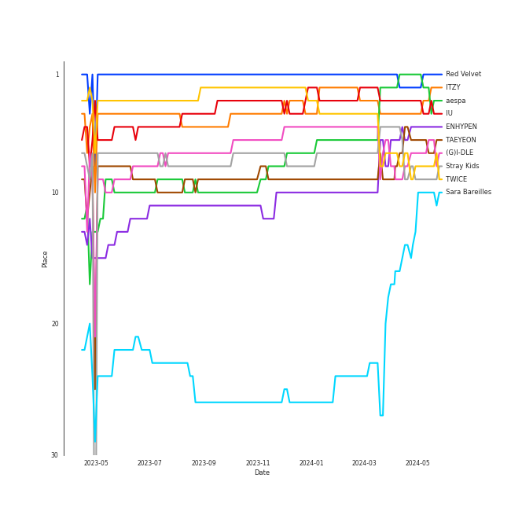
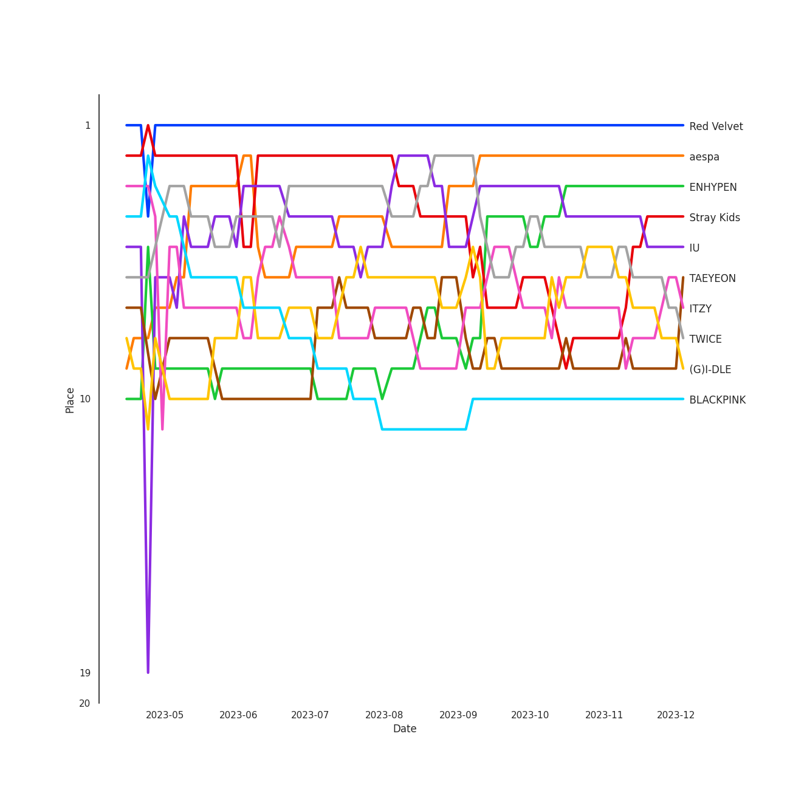
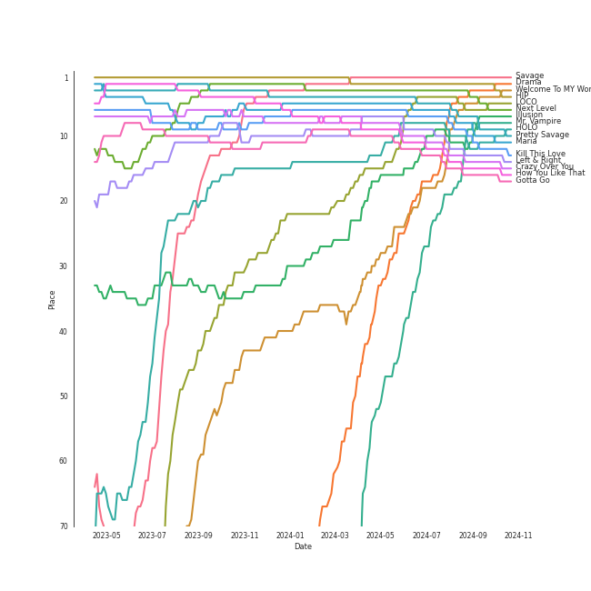
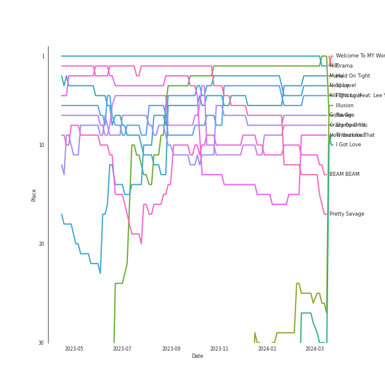
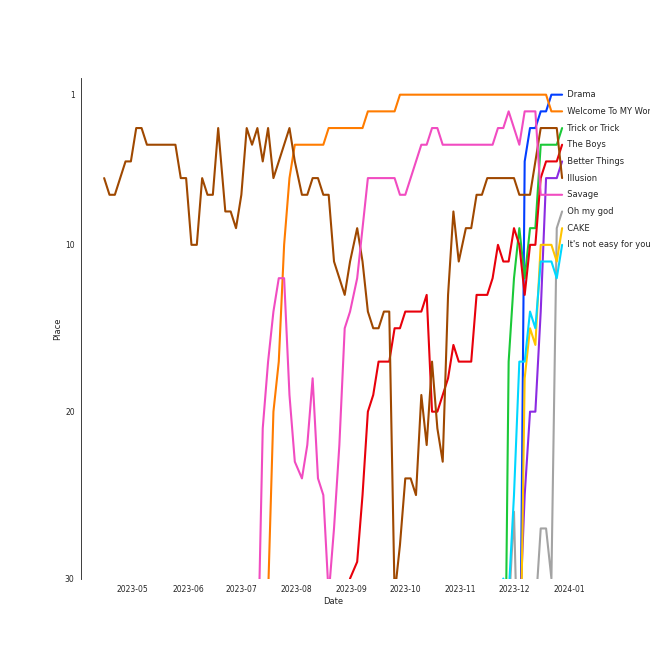
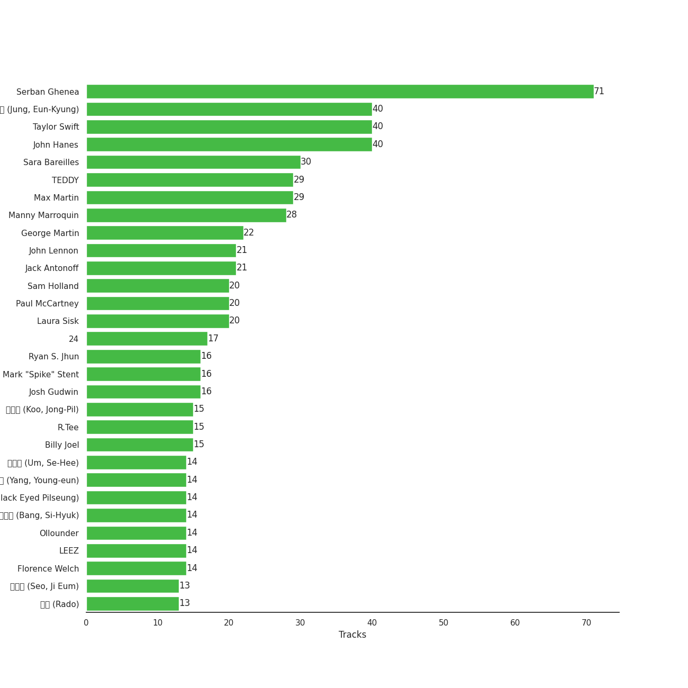

# Spotify Summary for jbrown1618

Generated by [jbrown1618/spotify-stats](https://github.com/jbrown1618/spotify-stats)

[See Track Features](audio_features.md)

[See Clusters](clusters.md)

## Playlists

| Art | Name | Tracks | 💚 | 🔗 |
|:---|:---|---:|---:|:---|
| 💚 | [Liked Tracks](playlists/liked_tracks/overview.md) | 1975 | 1975 | |
|  | [K-Pop](playlists/k-pop/overview.md) | 1316 | 963 | [🔗](https://open.spotify.com/playlist/0Xp2gQ9p4VMgt5HauIfIq7) |
|  | [Pop](playlists/pop/overview.md) | 428 | 310 | [🔗](https://open.spotify.com/playlist/1WZ2RqQv2SPX5uzmjWhgSh) |
|  | [K-Pop Favorites](playlists/k-pop_favorites/overview.md) | 296 | 296 | [🔗](https://open.spotify.com/playlist/1ZbxKv1noxwZ4zFgRNEFIo) |
|  | [Workout](playlists/workout/overview.md) | 232 | 219 | [🔗](https://open.spotify.com/playlist/3NYClOhoC6ZSipLJBTsZfO) |
|  | [Summer](playlists/summer/overview.md) | 216 | 205 | [🔗](https://open.spotify.com/playlist/0Xy9zMj8Yow1mGIrqd8nON) |
|  | [A-Pop Favorites](playlists/a-pop_favorites/overview.md) | 200 | 200 | [🔗](https://open.spotify.com/playlist/7hmRwiUOGV2mmgqXmsjqL2) |
|  | [Chill](playlists/chill/overview.md) | 234 | 189 | [🔗](https://open.spotify.com/playlist/79HDmDfCjzdHS3oWXdgHGb) |
|  | [Singer-Songwriter](playlists/singer-songwriter/overview.md) | 270 | 177 | [🔗](https://open.spotify.com/playlist/3aNr3GFiAvm1utXDyFOpAR) |
|  | [Alt-Pop](playlists/alt-pop/overview.md) | 197 | 143 | [🔗](https://open.spotify.com/playlist/4DgMab6SK9pnl6P05fw2YI) |

View all

| Art | Name | Tracks | 💚 | 🔗 |
|:---|:---|---:|---:|:---|
|  | [K-R&B](playlists/k-r_b/overview.md) | 155 | 116 | [🔗](https://open.spotify.com/playlist/5dr8e1QSb4e5pnMwT79MGd) |
|  | [Your Top Songs 2022](playlists/your_top_songs_2022/overview.md) | 101 | 100 | [🔗](https://open.spotify.com/playlist/37i9dQZF1F0sijgNaJdgit) |
|  | [Your Top Songs 2023](playlists/your_top_songs_2023/overview.md) | 100 | 98 | [🔗](https://open.spotify.com/playlist/37i9dQZF1Fa1IIVtEpGUcU) |
|  | [Halloween](playlists/halloween/overview.md) | 111 | 96 | [🔗](https://open.spotify.com/playlist/6Kh7qnaefCcgcBdJJryJKp) |
|  | [Modern Rock](playlists/modern_rock/overview.md) | 146 | 89 | [🔗](https://open.spotify.com/playlist/1PjJceUCPGCW1uMWAs5dMe) |
|  | [R&B](playlists/r_b/overview.md) | 114 | 85 | [🔗](https://open.spotify.com/playlist/1RsGeysyOdV3wZHqlto0Gb) |
|  | [Recent Comebacks](playlists/recent_comebacks/overview.md) | 88 | 75 | [🔗](https://open.spotify.com/playlist/2UAy7fw8nOjoJvFsNZtjbI) |
|  | [International Pop](playlists/international_pop/overview.md) | 133 | 74 | [🔗](https://open.spotify.com/playlist/36OHPiYrLGYMfVa0zcHgLf) |
|  | [Classic Rock](playlists/classic_rock/overview.md) | 117 | 71 | [🔗](https://open.spotify.com/playlist/5z6MnUYwnqrMcdd9b14Cc7) |
|  | [Karaoke](playlists/karaoke/overview.md) | 66 | 61 | [🔗](https://open.spotify.com/playlist/784bxrrG3W6L0naOkaCL5F) |
|  | [Sharon RPD](playlists/sharon_rpd/overview.md) | 71 | 55 | [🔗](https://open.spotify.com/playlist/2WsAAjnlcRAzyPrBDvMYyy) |
|  | [Relax](playlists/relax/overview.md) | 57 | 55 | [🔗](https://open.spotify.com/playlist/4rnlD7JdUQNdPCBhL69dCg) |
|  | [Recommendations for Jeff](playlists/recommendations_for_jeff/overview.md) | 53 | 53 | [🔗](https://open.spotify.com/playlist/5Liek0UOC5GmdOjxdWhcob) |
|  | [Tarps](playlists/tarps/overview.md) | 69 | 52 | [🔗](https://open.spotify.com/playlist/7i18RgdYPOv5E01eGmtRCo) |
|  | [K-Pop 101](playlists/k-pop_101/overview.md) | 49 | 45 | [🔗](https://open.spotify.com/playlist/1NlCn9vDmQDBF54JyVC2MC) |
|  | [Recommendations for Chris](playlists/recommendations_for_chris/overview.md) | 45 | 45 | [🔗](https://open.spotify.com/playlist/6atwS5eWP6rLUWSuDkuMd8) |
|  | [A Cappella](playlists/a_cappella/overview.md) | 303 | 39 | [🔗](https://open.spotify.com/playlist/7LQjtpZ8EZ5vWXgPoovFeC) |
|  | [K-Pop-Adjacent](playlists/k-pop-adjacent/overview.md) | 52 | 36 | [🔗](https://open.spotify.com/playlist/5ELtUGtTCv5PkLW7qFcEuk) |
|  | [Classic Pop](playlists/classic_pop/overview.md) | 62 | 35 | [🔗](https://open.spotify.com/playlist/6oXUc88JlAQTNdKvn529pD) |
|  | [Funk](playlists/funk/overview.md) | 51 | 35 | [🔗](https://open.spotify.com/playlist/0SL2KHDmNlkSmEgOBPeJCJ) |
|  | [애교！](playlists/애교！/overview.md) | 46 | 35 | [🔗](https://open.spotify.com/playlist/6WTiB2kj3G2g3eYqornNd2) |
|  | [Retro Kpop](playlists/retro_kpop/overview.md) | 32 | 31 | [🔗](https://open.spotify.com/playlist/1MW4AAPq55U0XWvSeu1jU5) |
|  | [Jazz](playlists/jazz/overview.md) | 100 | 30 | [🔗](https://open.spotify.com/playlist/58yLhLYn4iDQPCN53MfiDI) |
|  | [누구?](playlists/누구_/overview.md) | 58 | 30 | [🔗](https://open.spotify.com/playlist/4JrgU3rcLuATwzM1jVVgyC) |
|  | [On Repeat](playlists/on_repeat/overview.md) | 30 | 30 | [🔗](https://open.spotify.com/playlist/37i9dQZF1EpoN98LF1Ruyl) |
|  | [Hip Hop](playlists/hip_hop/overview.md) | 51 | 29 | [🔗](https://open.spotify.com/playlist/7trD87dfibqZnzSIqufO75) |
|  | [Repeat Rewind](playlists/repeat_rewind/overview.md) | 30 | 29 | [🔗](https://open.spotify.com/playlist/37i9dQZF1EpOIeFxMXFVG6) |
|  | [K-OST](playlists/k-ost/overview.md) | 34 | 25 | [🔗](https://open.spotify.com/playlist/6rOVckcfZ6oCN6seCH4GWr) |
|  | [K-Memes](playlists/k-memes/overview.md) | 46 | 21 | [🔗](https://open.spotify.com/playlist/3tRZYaAFqIagumJLpKXUp9) |
|  | [Country/Folk](playlists/country_folk/overview.md) | 40 | 21 | [🔗](https://open.spotify.com/playlist/6M7uIRzByJjX0q7wGcujJo) |
|  | [Classical Samples](playlists/classical_samples/overview.md) | 22 | 19 | [🔗](https://open.spotify.com/playlist/6Pp6fPWxumAQQLVE68SVtY) |
|  | [Beat Drop!](playlists/beat_drop!/overview.md) | 17 | 14 | [🔗](https://open.spotify.com/playlist/2CV3LAEvICWmWq3SEJw1my) |
|  | [Electronic](playlists/electronic/overview.md) | 16 | 11 | [🔗](https://open.spotify.com/playlist/3cWXIQgqhOUB6slIr3oglt) |
|  | [Christmas](playlists/christmas/overview.md) | 101 | 8 | [🔗](https://open.spotify.com/playlist/7fuGiFfUaZPvDH5eSyfMr8) |
|  | [Musicals](playlists/musicals/overview.md) | 116 | 5 | [🔗](https://open.spotify.com/playlist/54LRPekls9oCtaWOnmM3N0) |
|  | [Soundtracks](playlists/soundtracks/overview.md) | 83 | 5 | [🔗](https://open.spotify.com/playlist/4KUbAosEwUeOuYQ4gRIxCA) |
|  | [Cursed English](playlists/cursed_english/overview.md) | 33 | 1 | [🔗](https://open.spotify.com/playlist/2tPCDZMU74TGOBGdNdVDBs) |
|  | [String Quartets](playlists/string_quartets/overview.md) | 179 | 0 | [🔗](https://open.spotify.com/playlist/6b3mJeJjM9S5XAIS8jcTAt) |
|  | [Chopin](playlists/chopin/overview.md) | 172 | 0 | [🔗](https://open.spotify.com/playlist/630IicjdF4RLyaOqIXm0jm) |
|  | [Beethoven](playlists/beethoven/overview.md) | 166 | 0 | [🔗](https://open.spotify.com/playlist/6Lvj5MXaiMrmyaBnvLvxAW) |
|  | [Mozart](playlists/mozart/overview.md) | 148 | 0 | [🔗](https://open.spotify.com/playlist/2MCvxVYbyzdWBgpnuRWsuM) |
|  | [Ballet](playlists/ballet/overview.md) | 138 | 0 | [🔗](https://open.spotify.com/playlist/23temGx5UrTk2wboAvEb0v) |
|  | [Choral](playlists/choral/overview.md) | 69 | 0 | [🔗](https://open.spotify.com/playlist/1PCfeawsTHOhi6DGzagL7Y) |
|  | [Disney](playlists/disney/overview.md) | 68 | 0 | [🔗](https://open.spotify.com/playlist/6OHUelObHhiWFkbH4cwFMg) |
|  | [Bach](playlists/bach/overview.md) | 55 | 0 | [🔗](https://open.spotify.com/playlist/2fkIDMzy3H9JWLKHnULX7s) |
|  | [Program Music](playlists/program_music/overview.md) | 41 | 0 | [🔗](https://open.spotify.com/playlist/1PyrZgdZpE6UzIA3lANOlR) |
|  | [Vivaldi](playlists/vivaldi/overview.md) | 34 | 0 | [🔗](https://open.spotify.com/playlist/39dOiLs9ZbssQvs9xLBRzw) |
|  | [Brahms](playlists/brahms/overview.md) | 32 | 0 | [🔗](https://open.spotify.com/playlist/7MnYdeDrgvc9PoWHqcGVeq) |
|  | [Rachmaninov](playlists/rachmaninov/overview.md) | 27 | 0 | [🔗](https://open.spotify.com/playlist/7LeSS5dq68CWVIOy81oza1) |
|  | [Debussy](playlists/debussy/overview.md) | 23 | 0 | [🔗](https://open.spotify.com/playlist/3bJkc96LYMneTHBCS80BAl) |
|  | [Check Out Later](playlists/check_out_later/overview.md) | 23 | 0 | [🔗](https://open.spotify.com/playlist/2FgMW8NMJOZgvHtvDOWBCe) |

## Artists

Top artists of the last month, six months, and all time

| Place | ​ | Last month | ​​ | Last 6 months | ​​​ | All time |
|---:|:---|:---|:---|:---|:---|:---|
| 1 |  | [IVE](artists/ive/overview.md) |  | [Red Velvet](artists/red_velvet/overview.md) |  | [Red Velvet](artists/red_velvet/overview.md) |
| 2 |  | [ITZY](artists/itzy/overview.md) |  | [ITZY](artists/itzy/overview.md) |  | [ITZY](artists/itzy/overview.md) |
| 3 |  | [aespa](artists/aespa/overview.md) |  | [aespa](artists/aespa/overview.md) |  | [aespa](artists/aespa/overview.md) |
| 4 |  | [Solar](artists/solar/overview.md) |  | [(G)I-DLE](artists/(g)i-dle/overview.md) |  | [IU](artists/iu/overview.md) |
| 5 |  | [TWICE](artists/twice/overview.md) |  | [IU](artists/iu/overview.md) |  | [ENHYPEN](artists/enhypen/overview.md) |
| 6 |  | [(G)I-DLE](artists/(g)i-dle/overview.md) |  | [TAEYEON](artists/taeyeon/overview.md) |  | [TAEYEON](artists/taeyeon/overview.md) |
| 7 |  | [NMIXX](artists/nmixx/overview.md) |  | [Stray Kids](artists/stray_kids/overview.md) |  | [(G)I-DLE](artists/(g)i-dle/overview.md) |
| 8 |  | [IU](artists/iu/overview.md) |  | [TWICE](artists/twice/overview.md) |  | [Stray Kids](artists/stray_kids/overview.md) |
| 9 |  | [LE SSERAFIM](artists/le_sserafim/overview.md) |  | [Sara Bareilles](artists/sara_bareilles/overview.md) |  | [TWICE](artists/twice/overview.md) |
| 10 |  | [Billy Joel](artists/billy_joel/overview.md) |  | [Jacob Collier](artists/jacob_collier/overview.md) |  | [Sara Bareilles](artists/sara_bareilles/overview.md) |

See top 50 artists

| Place | ​ | Last month | ​​ | Last 6 months | ​​​ | All time |
|---:|:---|:---|:---|:---|:---|:---|
| 11 |  | [YUQI](artists/yuqi/overview.md) |  | [Taylor Swift](artists/taylor_swift/overview.md) |  | [BLACKPINK](artists/blackpink/overview.md) |
| 12 |  | [Red Velvet](artists/red_velvet/overview.md) |  | [LeeHi](artists/leehi/overview.md) |  | [LE SSERAFIM](artists/le_sserafim/overview.md) |
| 13 |  | [BIBI](artists/bibi/overview.md) |  | [ENHYPEN](artists/enhypen/overview.md) |  | [NMIXX](artists/nmixx/overview.md) |
| 14 |  | [Sara Bareilles](artists/sara_bareilles/overview.md) |  | [NMIXX](artists/nmixx/overview.md) |  | [Taylor Swift](artists/taylor_swift/overview.md) |
| 15 |  | [ENHYPEN](artists/enhypen/overview.md) |  | Howard Shore |  | [LeeHi](artists/leehi/overview.md) |
| 16 |  | [CHUNG HA](artists/chung_ha/overview.md) |  | [LE SSERAFIM](artists/le_sserafim/overview.md) |  | [SEVENTEEN](artists/seventeen/overview.md) |
| 17 |  | [WENDY](artists/wendy/overview.md) |  | [Ariana Grande](artists/ariana_grande/overview.md) |  | [Dreamcatcher](artists/dreamcatcher/overview.md) |
| 18 |  | [KISS OF LIFE](artists/kiss_of_life/overview.md) |  | [Queen](artists/queen/overview.md) |  | [IVE](artists/ive/overview.md) |
| 19 |  | [NCT DREAM](artists/nct_dream/overview.md) |  | [BLACKPINK](artists/blackpink/overview.md) |  | [Jacob Collier](artists/jacob_collier/overview.md) |
| 20 |  | [Stray Kids](artists/stray_kids/overview.md) |  | [PURPLE KISS](artists/purple_kiss/overview.md) |  | [CHUNG HA](artists/chung_ha/overview.md) |
| 21 |  | ILLIT |  | [STAYC](artists/stayc/overview.md) |  | [STAYC](artists/stayc/overview.md) |
| 22 |  | [TEN](artists/ten/overview.md) |  | [IVE](artists/ive/overview.md) |  | [EXO](artists/exo/overview.md) |
| 23 |  | Prince |  | [HEIZE](artists/heize/overview.md) |  | [NCT DREAM](artists/nct_dream/overview.md) |
| 24 |  | [SEVENTEEN](artists/seventeen/overview.md) |  | [Billy Joel](artists/billy_joel/overview.md) |  | Howard Shore |
| 25 |  | Stella Jang |  | [KISS OF LIFE](artists/kiss_of_life/overview.md) |  | [HEIZE](artists/heize/overview.md) |
| 26 | | |  | [WENDY](artists/wendy/overview.md) |  | [Billy Joel](artists/billy_joel/overview.md) |
| 27 | | |  | [MAMAMOO](artists/mamamoo/overview.md) |  | [WENDY](artists/wendy/overview.md) |
| 28 | | |  | [NCT DREAM](artists/nct_dream/overview.md) |  | [MAMAMOO](artists/mamamoo/overview.md) |
| 29 | | |  | [TEN](artists/ten/overview.md) |  | [Ariana Grande](artists/ariana_grande/overview.md) |
| 30 | | |  | [Dreamcatcher](artists/dreamcatcher/overview.md) |  | [Billlie](artists/billlie/overview.md) |
| 31 | | |  | [CHUNG HA](artists/chung_ha/overview.md) |  | [BoA](artists/boa/overview.md) |
| 32 | | |  | [Pentatonix](artists/pentatonix/overview.md) |  | [PURPLE KISS](artists/purple_kiss/overview.md) |
| 33 | | |  | Ciara |  | [Queen](artists/queen/overview.md) |
| 34 | | |  | [SEVENTEEN](artists/seventeen/overview.md) |  | [NCT 127](artists/nct_127/overview.md) |
| 35 | | |  | [EXO](artists/exo/overview.md) |  | [Girls' Generation](artists/girls__generation/overview.md) |
| 36 | | |  | [Radiohead](artists/radiohead/overview.md) |  | [Radiohead](artists/radiohead/overview.md) |
| 37 | | |  | [Billlie](artists/billlie/overview.md) |  | [NewJeans](artists/newjeans/overview.md) |
| 38 | | |  | [YOASOBI](artists/yoasobi/overview.md) |  | [Billie Eilish](artists/billie_eilish/overview.md) |
| 39 | | |  | [Billie Eilish](artists/billie_eilish/overview.md) |  | [KISS OF LIFE](artists/kiss_of_life/overview.md) |
| 40 | | |  | [PENTAGON](artists/pentagon/overview.md) |  | MISAMO |
| 41 | | |  | [Michael Bublé](artists/michael_bublé/overview.md) |  | [BTS](artists/bts/overview.md) |
| 42 | | |  | [BIBI](artists/bibi/overview.md) |  | [JEON SOYEON](artists/jeon_soyeon/overview.md) |
| 43 | | |  | [BTS](artists/bts/overview.md) |  | [BIBI](artists/bibi/overview.md) |
| 44 | | |  | [NewJeans](artists/newjeans/overview.md) |  | [TEN](artists/ten/overview.md) |
| 45 | | |  | [AKMU](artists/akmu/overview.md) |  | [Pentatonix](artists/pentatonix/overview.md) |
| 46 | | |  | [Janelle Monáe](artists/janelle_monáe/overview.md) |  | [SUNMI](artists/sunmi/overview.md) |
| 47 | | |  | [Solar](artists/solar/overview.md) |  | [GOT the beat](artists/got_the_beat/overview.md) |
| 48 | | |  | [BoA](artists/boa/overview.md) |  | TAEMIN |
| 49 | | |  | [JEON SOYEON](artists/jeon_soyeon/overview.md) |  | Ciara |
| 50 | | |  | PIXY |  | [PENTAGON](artists/pentagon/overview.md) |

Top artists of all time over time

Top artists of the last 6 months over time

Artists by number of liked tracks
| Art | Tracks | 💚 | Artist | 🔗 |
|:---|---:|---:|:---|:---|
|  | 80 | 60 | [Red Velvet](artists/red_velvet/overview.md) | [🔗](https://open.spotify.com/artist/1z4g3DjTBBZKhvAroFlhOM) |
|  | 66 | 44 | [Sara Bareilles](artists/sara_bareilles/overview.md) | [🔗](https://open.spotify.com/artist/2Sqr0DXoaYABbjBo9HaMkM) |
|  | 71 | 41 | [Taylor Swift](artists/taylor_swift/overview.md) | [🔗](https://open.spotify.com/artist/06HL4z0CvFAxyc27GXpf02) |
|  | 45 | 39 | [IU](artists/iu/overview.md) | [🔗](https://open.spotify.com/artist/3HqSLMAZ3g3d5poNaI7GOU) |
|  | 55 | 35 | [TWICE](artists/twice/overview.md) | [🔗](https://open.spotify.com/artist/7n2Ycct7Beij7Dj7meI4X0) |
|  | 48 | 31 | [(G)I-DLE](artists/(g)i-dle/overview.md) | [🔗](https://open.spotify.com/artist/2AfmfGFbe0A0WsTYm0SDTx) |
|  | 41 | 31 | [ENHYPEN](artists/enhypen/overview.md) | [🔗](https://open.spotify.com/artist/5t5FqBwTcgKTaWmfEbwQY9) |
|  | 52 | 30 | [ITZY](artists/itzy/overview.md) | [🔗](https://open.spotify.com/artist/2KC9Qb60EaY0kW4eH68vr3) |
|  | 40 | 30 | [aespa](artists/aespa/overview.md) | [🔗](https://open.spotify.com/artist/6YVMFz59CuY7ngCxTxjpxE) |
|  | 54 | 27 | [Stray Kids](artists/stray_kids/overview.md) | [🔗](https://open.spotify.com/artist/2dIgFjalVxs4ThymZ67YCE) |

See top 100 artists

| Art | Tracks | 💚 | Artist | 🔗 |
|:---|---:|---:|:---|:---|
|  | 41 | 26 | [TAEYEON](artists/taeyeon/overview.md) | [🔗](https://open.spotify.com/artist/3qNVuliS40BLgXGxhdBdqu) |
|  | 37 | 24 | [BTS](artists/bts/overview.md) | [🔗](https://open.spotify.com/artist/3Nrfpe0tUJi4K4DXYWgMUX) |
|  | 32 | 23 | [BLACKPINK](artists/blackpink/overview.md) | [🔗](https://open.spotify.com/artist/41MozSoPIsD1dJM0CLPjZF) |
|  | 32 | 23 | [The Beatles](artists/the_beatles/overview.md) | [🔗](https://open.spotify.com/artist/3WrFJ7ztbogyGnTHbHJFl2) |
|  | 35 | 21 | [Ariana Grande](artists/ariana_grande/overview.md) | [🔗](https://open.spotify.com/artist/66CXWjxzNUsdJxJ2JdwvnR) |
|  | 28 | 21 | [Jacob Collier](artists/jacob_collier/overview.md) | [🔗](https://open.spotify.com/artist/0QWrMNukfcVOmgEU0FEDyD) |
|  | 26 | 21 | [Billy Joel](artists/billy_joel/overview.md) | [🔗](https://open.spotify.com/artist/6zFYqv1mOsgBRQbae3JJ9e) |
|  | 47 | 20 | [The Tarpeggios](artists/the_tarpeggios/overview.md) | [🔗](https://open.spotify.com/artist/2HXd5pFHJyaQJr5aXfErrE) |
|  | 23 | 19 | [LeeHi](artists/leehi/overview.md) | [🔗](https://open.spotify.com/artist/7cVZApDoQZpS447nHTsNqu) |
|  | 43 | 16 | [Pentatonix](artists/pentatonix/overview.md) | [🔗](https://open.spotify.com/artist/26AHtbjWKiwYzsoGoUZq53) |
|  | 20 | 16 | [CHUNG HA](artists/chung_ha/overview.md) | [🔗](https://open.spotify.com/artist/2PSJ6YriU7JsFucxACpU7Y) |
|  | 19 | 15 | [MAMAMOO](artists/mamamoo/overview.md) | [🔗](https://open.spotify.com/artist/0XATRDCYuuGhk0oE7C0o5G) |
|  | 17 | 15 | [BIBI](artists/bibi/overview.md) | [🔗](https://open.spotify.com/artist/6UbmqUEgjLA6jAcXwbM1Z9) |
|  | 17 | 15 | [Radiohead](artists/radiohead/overview.md) | [🔗](https://open.spotify.com/artist/4Z8W4fKeB5YxbusRsdQVPb) |
|  | 25 | 14 | [SEVENTEEN](artists/seventeen/overview.md) | [🔗](https://open.spotify.com/artist/7nqOGRxlXj7N2JYbgNEjYH) |
|  | 19 | 14 | [LE SSERAFIM](artists/le_sserafim/overview.md) | [🔗](https://open.spotify.com/artist/4SpbR6yFEvexJuaBpgAU5p) |
|  | 18 | 14 | [Rihanna](artists/rihanna/overview.md) | [🔗](https://open.spotify.com/artist/5pKCCKE2ajJHZ9KAiaK11H) |
|  | 16 | 14 | [IVE](artists/ive/overview.md) | [🔗](https://open.spotify.com/artist/6RHTUrRF63xao58xh9FXYJ) |
|  | 16 | 14 | [Florence + The Machine](artists/florence_+_the_machine/overview.md) | [🔗](https://open.spotify.com/artist/1moxjboGR7GNWYIMWsRjgG) |
|  | 18 | 13 | [STAYC](artists/stayc/overview.md) | [🔗](https://open.spotify.com/artist/01XYiBYaoMJcNhPokrg0l0) |
|  | 15 | 13 | [Billie Eilish](artists/billie_eilish/overview.md) | [🔗](https://open.spotify.com/artist/6qqNVTkY8uBg9cP3Jd7DAH) |
|  | 20 | 12 | [Girls' Generation](artists/girls__generation/overview.md) | [🔗](https://open.spotify.com/artist/0Sadg1vgvaPqGTOjxu0N6c) |
|  | 18 | 12 | [WENDY](artists/wendy/overview.md) | [🔗](https://open.spotify.com/artist/0FRUZvZNPzM3YJMABJxf2K) |
|  | 17 | 12 | [Dreamcatcher](artists/dreamcatcher/overview.md) | [🔗](https://open.spotify.com/artist/5V1qsQHdXNm4ZEZHWvFnqQ) |
|  | 16 | 12 | [Bruno Mars](artists/bruno_mars/overview.md) | [🔗](https://open.spotify.com/artist/0du5cEVh5yTK9QJze8zA0C) |
|  | 18 | 11 | [Beyoncé](artists/beyoncé/overview.md) | [🔗](https://open.spotify.com/artist/6vWDO969PvNqNYHIOW5v0m) |
|  | 18 | 11 | [Kimbra](artists/kimbra/overview.md) | [🔗](https://open.spotify.com/artist/6hk7Yq1DU9QcCCrz9uc0Ti) |
|  | 16 | 11 | [Queen](artists/queen/overview.md) | [🔗](https://open.spotify.com/artist/1dfeR4HaWDbWqFHLkxsg1d) |
|  | 15 | 11 | [Billlie](artists/billlie/overview.md) | [🔗](https://open.spotify.com/artist/2GQxKDojobwBjZMPf7aoh0) |
|  | 19 | 10 | [Lana Del Rey](artists/lana_del_rey/overview.md) | [🔗](https://open.spotify.com/artist/00FQb4jTyendYWaN8pK0wa) |
|  | 16 | 10 | [NCT 127](artists/nct_127/overview.md) | [🔗](https://open.spotify.com/artist/7f4ignuCJhLXfZ9giKT7rH) |
|  | 14 | 10 | [NMIXX](artists/nmixx/overview.md) | [🔗](https://open.spotify.com/artist/28ot3wh4oNmoFOdVajibBl) |
|  | 14 | 10 | [NCT DREAM](artists/nct_dream/overview.md) | [🔗](https://open.spotify.com/artist/1gBUSTR3TyDdTVFIaQnc02) |
|  | 13 | 10 | [BAEKHYUN](artists/baekhyun/overview.md) | [🔗](https://open.spotify.com/artist/4ufh0WuMZh6y4Dmdnklvdl) |
|  | 11 | 10 | [SUNMI](artists/sunmi/overview.md) | [🔗](https://open.spotify.com/artist/6MoXcK2GyGg7FIyxPU5yW6) |
|  | 10 | 10 | [AKMU](artists/akmu/overview.md) | [🔗](https://open.spotify.com/artist/6OwKE9Ez6ALxpTaKcT5ayv) |
|  | 16 | 9 | [BoA](artists/boa/overview.md) | [🔗](https://open.spotify.com/artist/4muJrGMndyYWqZtfk8OWy4) |
|  | 14 | 9 | [Lady Gaga](artists/lady_gaga/overview.md) | [🔗](https://open.spotify.com/artist/1HY2Jd0NmPuamShAr6KMms) |
|  | 11 | 9 | [Doja Cat](artists/doja_cat/overview.md) | [🔗](https://open.spotify.com/artist/5cj0lLjcoR7YOSnhnX0Po5) |
|  | 11 | 9 | [Sia](artists/sia/overview.md) | [🔗](https://open.spotify.com/artist/5WUlDfRSoLAfcVSX1WnrxN) |
|  | 10 | 9 | [JEON SOYEON](artists/jeon_soyeon/overview.md) | [🔗](https://open.spotify.com/artist/6Xg22wJOAcnvPUfk5WvODH) |
|  | 14 | 8 | [Dua Lipa](artists/dua_lipa/overview.md) | [🔗](https://open.spotify.com/artist/6M2wZ9GZgrQXHCFfjv46we) |
|  | 14 | 8 | [EXO](artists/exo/overview.md) | [🔗](https://open.spotify.com/artist/3cjEqqelV9zb4BYE3qDQ4O) |
|  | 13 | 8 | [NewJeans](artists/newjeans/overview.md) | [🔗](https://open.spotify.com/artist/6HvZYsbFfjnjFrWF950C9d) |
|  | 13 | 8 | [HEIZE](artists/heize/overview.md) | [🔗](https://open.spotify.com/artist/5dCvSnVduaFleCnyy98JMo) |
|  | 11 | 8 | [Kendrick Lamar](artists/kendrick_lamar/overview.md) | [🔗](https://open.spotify.com/artist/2YZyLoL8N0Wb9xBt1NhZWg) |
|  | 11 | 8 | [PENTAGON](artists/pentagon/overview.md) | [🔗](https://open.spotify.com/artist/1wKpMkucynaTfG8lyPprYV) |
|  | 10 | 8 | [Janelle Monáe](artists/janelle_monáe/overview.md) | [🔗](https://open.spotify.com/artist/6ueGR6SWhUJfvEhqkvMsVs) |
|  | 10 | 8 | [YOASOBI](artists/yoasobi/overview.md) | [🔗](https://open.spotify.com/artist/64tJ2EAv1R6UaZqc4iOCyj) |
|  | 10 | 8 | [KISS OF LIFE](artists/kiss_of_life/overview.md) | [🔗](https://open.spotify.com/artist/4TEK9tIkcoxib4GxT3O4ky) |
|  | 10 | 8 | [NCT U](artists/nct_u/overview.md) | [🔗](https://open.spotify.com/artist/3paGCCtX1Xr4Gx53mSeZuQ) |
|  | 8 | 8 | [EVERGLOW](artists/everglow/overview.md) | [🔗](https://open.spotify.com/artist/3ZZzT0naD25RhY2uZvIKkJ) |
|  | 11 | 7 | [HWASA](artists/hwasa/overview.md) | [🔗](https://open.spotify.com/artist/7bmYpVgQub656uNTu6qGNQ) |
|  | 11 | 7 | [ATEEZ](artists/ateez/overview.md) | [🔗](https://open.spotify.com/artist/68KmkJeZGfwe1OUaivBa2L) |
|  | 11 | 7 | [TOMORROW X TOGETHER](artists/tomorrow_x_together/overview.md) | [🔗](https://open.spotify.com/artist/0ghlgldX5Dd6720Q3qFyQB) |
|  | 10 | 7 | [PURPLE KISS](artists/purple_kiss/overview.md) | [🔗](https://open.spotify.com/artist/62T5PGHWJ9sxP2SJq20IHq) |
|  | 9 | 7 | [Imogen Heap](artists/imogen_heap/overview.md) | [🔗](https://open.spotify.com/artist/6Xb4ezwoAQC4516kI89nWz) |
|  | 9 | 7 | [BABYMETAL](artists/babymetal/overview.md) | [🔗](https://open.spotify.com/artist/630wzNP2OL7fl4Xl0GnMWq) |
|  | 8 | 7 | [Camila Cabello](artists/camila_cabello/overview.md) | [🔗](https://open.spotify.com/artist/4nDoRrQiYLoBzwC5BhVJzF) |
|  | 7 | 7 | [GOT the beat](artists/got_the_beat/overview.md) | [🔗](https://open.spotify.com/artist/6uNxlIP5lzPFf0BHuELOuX) |
|  | 9 | 6 | [SHINee](artists/shinee/overview.md) | [🔗](https://open.spotify.com/artist/2hRQKC0gqlZGPrmUKbcchR) |
|  | 8 | 6 | [TVXQ!](artists/tvxq!/overview.md) | [🔗](https://open.spotify.com/artist/6nVMMEywS5Y4tsHPKx1nIo) |
|  | 8 | 6 | [Solar](artists/solar/overview.md) | [🔗](https://open.spotify.com/artist/5cYcI546S8Lf97m4mNdYLD) |
|  | 8 | 6 | [WINTER](artists/winter/overview.md) | [🔗](https://open.spotify.com/artist/3mPquBmMu97Iq9TpzQ6ayI) |
|  | 8 | 6 | [TREASURE](artists/treasure/overview.md) | [🔗](https://open.spotify.com/artist/3KonOYiLsU53m4yT7gNotP) |
|  | 8 | 6 | [P1Harmony](artists/p1harmony/overview.md) | [🔗](https://open.spotify.com/artist/3JjvsPeGMbDJqsphe2z8xU) |
|  | 8 | 6 | [OH MY GIRL](artists/oh_my_girl/overview.md) | [🔗](https://open.spotify.com/artist/2019zR22qK2RBvCqtudBaI) |
|  | 8 | 6 | [Jackson Wang](artists/jackson_wang/overview.md) | [🔗](https://open.spotify.com/artist/1kfWoWgCugPkyxQP8lkRlY) |
|  | 7 | 6 | [SUPER JUNIOR](artists/super_junior/overview.md) | [🔗](https://open.spotify.com/artist/6gzXCdfYfFe5XKhPKkYqxV) |
|  | 7 | 6 | [YUQI](artists/yuqi/overview.md) | [🔗](https://open.spotify.com/artist/22aCD8IrQZjcPgZw728QT6) |
|  | 7 | 6 | [Jason Derulo](artists/jason_derulo/overview.md) | [🔗](https://open.spotify.com/artist/07YZf4WDAMNwqr4jfgOZ8y) |
|  | 6 | 6 | [WJSN](artists/wjsn/overview.md) | [🔗](https://open.spotify.com/artist/6hhqsQZhtp9hfaZhSd0VSD) |
|  | 6 | 6 | [The Who](artists/the_who/overview.md) | [🔗](https://open.spotify.com/artist/67ea9eGLXYMsO2eYQRui3w) |
|  | 6 | 6 | [Gain](artists/gain/overview.md) | [🔗](https://open.spotify.com/artist/4R60A85t9mTZzCqJlVswuo) |
|  | 6 | 6 | [j-hope](artists/j-hope/overview.md) | [🔗](https://open.spotify.com/artist/0b1sIQumIAsNbqAoIClSpy) |
|  | 17 | 5 | [Michael Bublé](artists/michael_bublé/overview.md) | [🔗](https://open.spotify.com/artist/1GxkXlMwML1oSg5eLPiAz3) |
|  | 11 | 5 | [Coldplay](artists/coldplay/overview.md) | [🔗](https://open.spotify.com/artist/4gzpq5DPGxSnKTe4SA8HAU) |
|  | 9 | 5 | [Agust D](artists/agust_d/overview.md) | [🔗](https://open.spotify.com/artist/5RmQ8k4l3HZ8JoPb4mNsML) |
|  | 9 | 5 | [Justin Bieber](artists/justin_bieber/overview.md) | [🔗](https://open.spotify.com/artist/1uNFoZAHBGtllmzznpCI3s) |
|  | 8 | 5 | [CLC](artists/clc/overview.md) | [🔗](https://open.spotify.com/artist/6QyO41KctzGc70mVaVnXQO) |
|  | 8 | 5 | [Joni Mitchell](artists/joni_mitchell/overview.md) | [🔗](https://open.spotify.com/artist/5hW4L92KnC6dX9t7tYM4Ve) |
|  | 8 | 5 | [Adele](artists/adele/overview.md) | [🔗](https://open.spotify.com/artist/4dpARuHxo51G3z768sgnrY) |
|  | 8 | 5 | [Michael Jackson](artists/michael_jackson/overview.md) | [🔗](https://open.spotify.com/artist/3fMbdgg4jU18AjLCKBhRSm) |
|  | 8 | 5 | [Britney Spears](artists/britney_spears/overview.md) | [🔗](https://open.spotify.com/artist/26dSoYclwsYLMAKD3tpOr4) |
|  | 8 | 5 | [Maroon 5](artists/maroon_5/overview.md) | [🔗](https://open.spotify.com/artist/04gDigrS5kc9YWfZHwBETP) |
|  | 7 | 5 | [Crush](artists/crush/overview.md) | [🔗](https://open.spotify.com/artist/6aLdhHUqgdKE86xbtNmY8g) |
|  | 7 | 5 | [LOONA](artists/loona/overview.md) | [🔗](https://open.spotify.com/artist/52zMTJCKluDlFwMQWmccY7) |
|  | 7 | 5 | [Daft Punk](artists/daft_punk/overview.md) | [🔗](https://open.spotify.com/artist/4tZwfgrHOc3mvqYlEYSvVi) |
|  | 7 | 5 | [YENA](artists/yena/overview.md) | [🔗](https://open.spotify.com/artist/49muoiIu4uea4PO8vueUNN) |
|  | 7 | 5 | [Lindsey Stirling](artists/lindsey_stirling/overview.md) | [🔗](https://open.spotify.com/artist/378dH6EszOLFShpRzAQkVM) |

## Tracks

Top tracks of the last month, six months, and all time

| Place | ​ | On repeat | ​​ | Last month | ​​​ | Last 6 months | ​​​​ | All time |
|---:|:---|:---|:---|:---|:---|:---|:---|:---|
| 1 |  | [Supernova](artists/aespa/overview.md) |  | [Supernova](artists/aespa/overview.md) |  | [Drama](artists/aespa/overview.md) |  | [Drama](artists/aespa/overview.md) |
| 2 |  | [Holssi](artists/iu/overview.md) |  | [Fate](artists/(g)i-dle/overview.md) |  | [Mr. Vampire](artists/itzy/overview.md) |  | [Welcome To MY World (feat. nævis)](artists/aespa/overview.md) |
| 3 |  | [INVU](artists/taeyeon/overview.md) |  | [Super Lady](artists/(g)i-dle/overview.md) |  | [BORN TO BE](artists/itzy/overview.md) |  | [Mr. Vampire](artists/itzy/overview.md) |
| 4 |  | SPOT! |  | [Better Judgement](artists/wendy/overview.md) |  | [Holssi](artists/iu/overview.md) |  | [LOCO](artists/itzy/overview.md) |
| 5 |  | [해야 (HEYA)](artists/ive/overview.md) |  | SPOT! |  | [To. X](artists/taeyeon/overview.md) |  | [Spicy](artists/aespa/overview.md) |
| 6 |  | [Midas Touch](artists/kiss_of_life/overview.md) |  | [BORN TO BE](artists/itzy/overview.md) |  | [Sweet Venom](artists/enhypen/overview.md) |  | [Savage](artists/aespa/overview.md) |
| 7 |  | [Mr. Vampire](artists/itzy/overview.md) |  | [Honey Honey](artists/solar/overview.md) |  | [Dangerous](artists/ten/overview.md) |  | [Better Things](artists/aespa/overview.md) |
| 8 |  | [EASY](artists/le_sserafim/overview.md) |  | [Ice Queen](artists/ive/overview.md) |  | [Better Things](artists/aespa/overview.md) |  | [Oh my god](artists/(g)i-dle/overview.md) |
| 9 |  | Honeybee |  | [Blue Heart](artists/ive/overview.md) |  | [One Kiss](artists/red_velvet/overview.md) |  | [Illusion](artists/aespa/overview.md) |
| 10 |  | [Fatal Trouble](artists/enhypen/overview.md) |  | [Holssi](artists/iu/overview.md) |  | [MEGAVERSE](artists/stray_kids/overview.md) |  | [Sacrifice (Eat Me Up)](artists/enhypen/overview.md) |

See top 50 tracks

| Place | ​ | On repeat | ​​ | Last month | ​​​ | Last 6 months | ​​​​ | All time |
|---:|:---|:---|:---|:---|:---|:---|:---|:---|
| 11 |  | [No Biggie](artists/itzy/overview.md) |  | [Soñar (Breaker)](artists/nmixx/overview.md) |  | [Nobody Knows](artists/kiss_of_life/overview.md) |  | Hello |
| 12 |  | SHEESH |  | [Regret of the Times - 2024 aespa Remake Version](artists/aespa/overview.md) |  | [Super Lady](artists/(g)i-dle/overview.md) |  | [7월 7일 One Of These Nights](artists/red_velvet/overview.md) |
| 13 |  | [Blue Heart](artists/ive/overview.md) |  | [Shopper](artists/iu/overview.md) |  | [NOBODY](artists/jeon_soyeon/overview.md) |  | [BORN TO BE](artists/itzy/overview.md) |
| 14 |  | [Red Rover](artists/yuqi/overview.md) |  | SWEAT |  | [Regret of the Times - 2024 aespa Remake Version](artists/aespa/overview.md) |  | [Holssi](artists/iu/overview.md) |
| 15 |  | Officially Cool |  | [Crown On My Head (YEJI)](artists/itzy/overview.md) |  | [Swan Song](artists/le_sserafim/overview.md) |  | Fighting (Feat. Lee Young Ji) |
| 16 |  | [Vienna](artists/billy_joel/overview.md) |  | [Queen Of The Party](artists/wendy/overview.md) |  | [Soñar (Breaker)](artists/nmixx/overview.md) |  | [Thunderous](artists/stray_kids/overview.md) |
| 17 |  | [Sunny Side Up!](artists/red_velvet/overview.md) |  | [But I](artists/solar/overview.md) |  | [Nightmare](artists/red_velvet/overview.md) |  | [The Boys](artists/girls__generation/overview.md) |
| 18 |  | [Algorhythm](artists/itzy/overview.md) |  | [Blues](artists/solar/overview.md) |  | [I Want That](artists/(g)i-dle/overview.md) |  | [Trick or Trick](artists/aespa/overview.md) |
| 19 |  | [DDU-DU DDU-DU](artists/blackpink/overview.md) |  | [INVU](artists/taeyeon/overview.md) |  | DUMB DUMB |  | [ONLY](artists/leehi/overview.md) |
| 20 |  | [DASH](artists/nmixx/overview.md) |  | Love seeker |  | [DASH](artists/nmixx/overview.md) |  | [Bite Me](artists/enhypen/overview.md) |
| 21 |  | [Regret of the Times - 2024 aespa Remake Version](artists/aespa/overview.md) |  | [Cheers to youth](artists/seventeen/overview.md) |  | [Chill Kill](artists/red_velvet/overview.md) |  | [Feel My Rhythm](artists/red_velvet/overview.md) |
| 22 |  | [Never Let Me Go](artists/florence_+_the_machine/overview.md) |  | SHEESH |  | Get A Guitar |  | [One Kiss](artists/red_velvet/overview.md) |
| 23 |  | [UNTOUCHABLE](artists/itzy/overview.md) |  | Real world |  | [What Do I Call You](artists/taeyeon/overview.md) |  | [Bills](artists/enhypen/overview.md) |
| 24 |  | [Machine Gun](artists/sara_bareilles/overview.md) |  | [Accendio](artists/ive/overview.md) |  | [Bulldozer](artists/red_velvet/overview.md) |  | DUMB DUMB |
| 25 |  | [Teeth](artists/enhypen/overview.md) |  | [I GOT YOU](artists/twice/overview.md) |  | [Hot Air Balloon](artists/aespa/overview.md) |  | [HOLO](artists/leehi/overview.md) |
| 26 |  | [On Clap](artists/yuqi/overview.md) |  | [Red Rover](artists/yuqi/overview.md) |  | [Doll](artists/(g)i-dle/overview.md) |  | [Toddler](artists/taeyeon/overview.md) |
| 27 |  | [Daisy](artists/pentagon/overview.md) |  | [해야 (HEYA)](artists/ive/overview.md) |  | [Knock Knock (Who's There?)](artists/red_velvet/overview.md) |  | [To. X](artists/taeyeon/overview.md) |
| 28 |  | [Settle Down](artists/kimbra/overview.md) |  | [Sugar Rush](artists/bibi/overview.md) |  | [Burn It Down](artists/taeyeon/overview.md) |  | [HANN (Alone in winter)](artists/(g)i-dle/overview.md) |
| 29 |  | Love seeker |  | Impossible |  | [The Red Shoes](artists/iu/overview.md) |  | [Ditto](artists/newjeans/overview.md) |
| 30 |  | [One Kiss](artists/red_velvet/overview.md) |  | [Smoothie](artists/nct_dream/overview.md) |  | SHEESH |  | [Chill Kill](artists/red_velvet/overview.md) |
| 31 | | |  | [Smart](artists/le_sserafim/overview.md) |  | [UNTOUCHABLE](artists/itzy/overview.md) |  | [Stamp On It](artists/got_the_beat/overview.md) |
| 32 | | |  | [Swan Song](artists/le_sserafim/overview.md) |  | [Bubble](artists/stayc/overview.md) |  | [enchanted night ~ white night](artists/billlie/overview.md) |
| 33 | | |  | [Machine Gun](artists/sara_bareilles/overview.md) |  | [Run Away (RYUJIN)](artists/itzy/overview.md) |  | [Sweet Venom](artists/enhypen/overview.md) |
| 34 | | |  | [EENIE MEENIE (Feat. Hongjoong of ATEEZ)](artists/chung_ha/overview.md) |  | [Oh my god](artists/(g)i-dle/overview.md) |  | [SET ME FREE](artists/twice/overview.md) |
| 35 | | |  | [BLOOM](artists/twice/overview.md) |  | [FM 89.1](artists/heize/overview.md) |  | [Hold On Tight](artists/aespa/overview.md) |
| 36 | | |  | [Run Away (RYUJIN)](artists/itzy/overview.md) |  | [Rain](artists/taeyeon/overview.md) |  | [Dangerous](artists/ten/overview.md) |
| 37 | | |  | [Fatal Trouble](artists/enhypen/overview.md) |  | [Trick or Trick](artists/aespa/overview.md) |  | [MEGAVERSE](artists/stray_kids/overview.md) |
| 38 | | |  | [I'll Make You Cry](artists/aespa/overview.md) |  | [Heart Burn](artists/sunmi/overview.md) |  | [Bad Boy](artists/red_velvet/overview.md) |
| 39 | | |  | [ONE SPARK](artists/twice/overview.md) |  | Behind The Curtain |  | [The Red Shoes](artists/iu/overview.md) |
| 40 | | |  | The Night We Met |  | [Melt Away](artists/taeyeon/overview.md) |  | Behind The Curtain |
| 41 | | |  | [Midas Touch](artists/kiss_of_life/overview.md) |  | [Crown On My Head (YEJI)](artists/itzy/overview.md) |  | [DDU-DU DDU-DU](artists/blackpink/overview.md) |
| 42 | | |  | TAP |  | [7월 7일 One Of These Nights](artists/red_velvet/overview.md) |  | Low Low |
| 43 | | |  | [BBB](artists/purple_kiss/overview.md) |  | [Perhaps, Happy Ending](artists/heize/overview.md) |  | [Sweet Juice](artists/purple_kiss/overview.md) |
| 44 | | |  | [Shh.. (Feat. HYEIN, WONSUN JOE & Special Narr. Patti Kim)](artists/iu/overview.md) |  | [Shh.. (Feat. HYEIN, WONSUN JOE & Special Narr. Patti Kim)](artists/iu/overview.md) |  | [My sea](artists/iu/overview.md) |
| 45 | | |  | Tango |  | [Psycho](artists/red_velvet/overview.md) |  | [Jam Jam](artists/iu/overview.md) |
| 46 | | |  | [4 Walls](artists/f(x)/overview.md) |  | [Daisy](artists/pentagon/overview.md) |  | [Pink Venom](artists/blackpink/overview.md) |
| 47 | | |  | Wicked |  | BATTER UP |  | Killin’ Me Good |
| 48 | | |  | Hässlich |  | [Welcome To MY World (feat. nævis)](artists/aespa/overview.md) |  | [Psycho](artists/red_velvet/overview.md) |
| 49 | | |  | [BOX](artists/nct_dream/overview.md) |  | [LOCO](artists/itzy/overview.md) |  | [EUNOIA](artists/billlie/overview.md) |
| 50 | | |  | [The Longest Time](artists/billy_joel/overview.md) |  | [Social Path (Feat. LiSA) (Korean Ver.)](artists/stray_kids/overview.md) |  | [Love Me Like This](artists/nmixx/overview.md) |

Top tracks of all time over time

Top tracks of the last 6 months over time

Top tracks of the On Repeat playlist over time

Most and least listened tracks

| ​ | Most listened tracks | Rank | ​​ | Least listened tracks | Rank |
|:---|:---|---:|:---|:---|---:|
|  | [Savage](artists/aespa/overview.md) | 1 |  | Waltz No.10 Op.69-2 B Minor | nan |
|  | [HIP](artists/mamamoo/overview.md) | 2 |  | [Set Myself On Fire](artists/taeyeon/overview.md) | nan |
|  | [Next Level](artists/aespa/overview.md) | 3 |  | Mr. Brightside | nan |
|  | [Pretty Savage](artists/blackpink/overview.md) | 4 |  | [Piano Sonata No. 12 in F Major, K. 332: II. Adagio](artists/wolfgang_amadeus_mozart/overview.md) | nan |
|  | [Maria](artists/hwasa/overview.md) | 5 |  | abnormalize | nan |
|  | [Kill This Love](artists/blackpink/overview.md) | 6 |  | Papa's Got A Brand New Bag | nan |
|  | [Left & Right](artists/seventeen/overview.md) | 7 |  | We Found Love | nan |
|  | [Crazy Over You](artists/blackpink/overview.md) | 8 |  | Concerto for Violin and Strings in F Major, Op. 8, No. 3, RV 293 "L'autunno": II. Adagio molto (Ubriachi dormienti) | nan |
|  | [How You Like That](artists/blackpink/overview.md) | 9 |  | [Say You're Sorry](artists/sara_bareilles/overview.md) | nan |
|  | [HOLO](artists/leehi/overview.md) | 10 |  | [MIC Drop (Steve Aoki Remix) (Full Length Edition)](artists/bts/overview.md) | nan |

## Genres

| Tracks | 💚 | Genre |
|---:|---:|:---|
| 1167 | 800 | [k-pop](genres/k-pop/overview.md) |
| 672 | 435 | [pop](genres/pop/overview.md) |
| 610 | 418 | [k-pop girl group](genres/k-pop_girl_group/overview.md) |
| 360 | 224 | [k-pop boy group](genres/k-pop_boy_group/overview.md) |
| 232 | 143 | [rock](genres/rock/overview.md) |
| 144 | 94 | [classic rock](genres/classic_rock/overview.md) |
| 142 | 92 | [dance pop](genres/dance_pop/overview.md) |
| 111 | 74 | [neo mellow](genres/neo_mellow/overview.md) |
| 88 | 61 | [lilith](genres/lilith/overview.md) |
| 89 | 59 | [acoustic pop](genres/acoustic_pop/overview.md) |

See top 100 genres

| Tracks | 💚 | Genre |
|---:|---:|:---|
| 80 | 51 | [album rock](genres/album_rock/overview.md) |
| 79 | 49 | [pop rock](genres/pop_rock/overview.md) |
| 75 | 49 | [soft rock](genres/soft_rock/overview.md) |
| 67 | 48 | [korean r&b](genres/korean_r_b/overview.md) |
| 77 | 47 | [modern rock](genres/modern_rock/overview.md) |
| 68 | 47 | [ectofolk](genres/ectofolk/overview.md) |
| 68 | 46 | [mellow gold](genres/mellow_gold/overview.md) |
| 70 | 45 | [post-teen pop](genres/post-teen_pop/overview.md) |
| 59 | 38 | [art pop](genres/art_pop/overview.md) |
| 57 | 37 | [singer-songwriter](genres/singer-songwriter/overview.md) |
| 58 | 35 | [r&b](genres/r_b/overview.md) |
| 42 | 34 | [uk alternative pop](genres/uk_alternative_pop/overview.md) |
| 47 | 31 | [anime](genres/anime/overview.md) |
| 40 | 31 | [british invasion](genres/british_invasion/overview.md) |
| 65 | 30 | [permanent wave](genres/permanent_wave/overview.md) |
| 56 | 30 | [rap](genres/rap/overview.md) |
| 44 | 30 | [piano rock](genres/piano_rock/overview.md) |
| 42 | 28 | [korean pop](genres/korean_pop/overview.md) |
| 42 | 28 | [5th gen k-pop](genres/5th_gen_k-pop/overview.md) |
| 63 | 27 | [soul](genres/soul/overview.md) |
| 47 | 27 | [psychedelic rock](genres/psychedelic_rock/overview.md) |
| 55 | 26 | [viral pop](genres/viral_pop/overview.md) |
| 44 | 26 | [alternative rock](genres/alternative_rock/overview.md) |
| 41 | 25 | [uk pop](genres/uk_pop/overview.md) |
| 32 | 23 | merseybeat |
| 36 | 22 | [k-rap](genres/k-rap/overview.md) |
| 34 | 21 | [urban contemporary](genres/urban_contemporary/overview.md) |
| 34 | 21 | [hard rock](genres/hard_rock/overview.md) |
| 30 | 21 | [folk](genres/folk/overview.md) |
| 33 | 20 | [art rock](genres/art_rock/overview.md) |
| 22 | 20 | melancholia |
| 39 | 19 | [canadian pop](genres/canadian_pop/overview.md) |
| 36 | 19 | [hip hop](genres/hip_hop/overview.md) |
| 26 | 19 | metropopolis |
| 90 | 17 | [a cappella](genres/a_cappella/overview.md) |
| 29 | 17 | neo soul |
| 25 | 17 | atl hip hop |
| 21 | 17 | indie rock |
| 20 | 16 | indietronica |
| 32 | 15 | [j-pop](genres/j-pop/overview.md) |
| 26 | 15 | glam rock |
| 26 | 15 | folk rock |
| 26 | 15 | electropop |
| 18 | 15 | indie pop |
| 17 | 15 | oxford indie |
| 19 | 14 | baroque pop |
| 52 | 13 | [adult standards](genres/adult_standards/overview.md) |
| 13 | 13 | korean ost |
| 41 | 12 | [vocal jazz](genres/vocal_jazz/overview.md) |
| 18 | 12 | japanese teen pop |
| 15 | 12 | korean city pop |
| 14 | 12 | barbadian pop |
| 14 | 12 | australian pop |
| 26 | 11 | pop rap |
| 19 | 11 | nz pop |
| 18 | 11 | pov: indie |
| 18 | 11 | pop soul |
| 16 | 11 | chamber pop |
| 15 | 11 | alternative r&b |
| 16 | 10 | funk |
| 12 | 10 | stomp and holler |
| 37 | 9 | [lounge](genres/lounge/overview.md) |
| 24 | 9 | motown |
| 16 | 9 | funk rock |
| 16 | 9 | bergen indie |
| 14 | 9 | conscious hip hop |
| 14 | 9 | british soul |
| 14 | 9 | afrofuturism |
| 12 | 9 | country |
| 12 | 9 | contemporary country |
| 11 | 9 | country dawn |
| 9 | 9 | indie folk |
| 15 | 8 | nyc pop |
| 14 | 8 | girl group |
| 13 | 8 | talent show |
| 12 | 8 | yacht rock |
| 12 | 8 | etherpop |
| 10 | 8 | west coast rap |
| 10 | 8 | australian dance |
| 16 | 7 | progressive rock |
| 14 | 7 | disco |
| 11 | 7 | latin pop |
| 9 | 7 | kawaii metal |
| 9 | 7 | j-metal |
| 9 | 7 | idol rock |
| 9 | 7 | boy band |
| 8 | 7 | la indie |
| 8 | 7 | alt z |
| 7 | 7 | modern alternative rock |
| 11 | 6 | candy pop |

## Record Labels

| Tracks | 💚 | Label |
|---:|---:|:---|
| 356 | 255 | [SM Entertainment](labels/sm_entertainment/overview.md) |
| 196 | 126 | [Republic Records](labels/republic_records/overview.md) |
| 119 | 76 | [Genie Music Corporation](labels/genie_music_corporation/overview.md) |
| 108 | 71 | [Columbia](labels/columbia/overview.md) |
| 103 | 70 | [Epic](labels/epic/overview.md) |
| 88 | 68 | [YG Entertainment](labels/yg_entertainment/overview.md) |
| 106 | 64 | [Warner Records](labels/warner_records/overview.md) |
| 96 | 61 | [Interscope Records](labels/interscope_records/overview.md) |
| 88 | 60 | [Stone Music Entertainment](labels/stone_music_entertainment/overview.md) |
| 104 | 54 | [RCA Records Label](labels/rca_records_label/overview.md) |

See top 100 labels

| Tracks | 💚 | Label |
|---:|---:|:---|
| 80 | 49 | [Universal Music LLC](labels/universal_music_llc/overview.md) |
| 60 | 41 | [BIGHIT MUSIC](labels/bighit_music/overview.md) |
| 53 | 37 | [CUBE ENTERTAINMENT](labels/cube_entertainment/overview.md) |
| 47 | 34 | [RBW Inc.](labels/rbw_inc_/overview.md) |
| 62 | 33 | [Atlantic Records](labels/atlantic_records/overview.md) |
| 37 | 30 | [BELIFT LAB](labels/belift_lab/overview.md) |
| 39 | 29 | [Starship Entertainment](labels/starship_entertainment/overview.md) |
| 39 | 22 | [Taylor Swift](labels/taylor_swift/overview.md) |
| 31 | 22 | [EMI Catalogue](labels/emi_catalogue/overview.md) |
| 26 | 22 | [Kakao Entertainment](labels/kakao_entertainment/overview.md) |
| 31 | 19 | [Big Machine Records](labels/big_machine_records/overview.md) |
| 25 | 19 | [SOURCE MUSIC](labels/source_music/overview.md) |
| 23 | 19 | [XL Recordings](labels/xl_recordings/overview.md) |
| 70 | 18 | [Polydor Records](labels/polydor_records/overview.md) |
| 48 | 17 | [Decca (UMO)](labels/decca_(umo)/overview.md) |
| 30 | 17 | [PLEDIS Entertainment](labels/pledis_entertainment/overview.md) |
| 30 | 16 | [Rhino](labels/rhino/overview.md) |
| 18 | 16 | [Universal-Island Records Ltd.](labels/universal-island_records_ltd_/overview.md) |
| 34 | 14 | [Legacy](labels/legacy/overview.md) |
| 38 | 13 | [The Tarpeggios](labels/the_tarpeggios/overview.md) |
| 27 | 13 | [Capitol Records](labels/capitol_records/overview.md) |
| 17 | 13 | [88rising Music](labels/88rising_music/overview.md) |
| 15 | 13 | [Darkroom](labels/darkroom/overview.md) |
| 19 | 12 | [Hollywood Records](labels/hollywood_records/overview.md) |
| 19 | 12 | [Def Jam Recordings](labels/def_jam_recordings/overview.md) |
| 17 | 12 | [MYSTIC STORY](labels/mystic_story/overview.md) |
| 17 | 12 | [High Up Entertainment](labels/high_up_entertainment/overview.md) |
| 24 | 11 | [WM Korea](labels/wm_korea/overview.md) |
| 16 | 11 | [Jive](labels/jive/overview.md) |
| 16 | 11 | [DREAMCATCHER COMPANY](labels/dreamcatcher_company/overview.md) |
| 15 | 11 | [Syco Music](labels/syco_music/overview.md) |
| 14 | 11 | [FNC ENTERTAINMENT](labels/fnc_entertainment/overview.md) |
| 22 | 10 | [MOTOWN](labels/motown/overview.md) |
| 11 | 10 | [MNH ENTERTAINMENT](labels/mnh_entertainment/overview.md) |
| 11 | 10 | [EDAM Entertainment](labels/edam_entertainment/overview.md) |
| 26 | 9 | [WM Japan](labels/wm_japan/overview.md) |
| 12 | 9 | [Bad Boy](labels/bad_boy/overview.md) |
| 11 | 9 | [Aftermath](labels/aftermath/overview.md) |
| 18 | 8 | [Geffen](labels/geffen/overview.md) |
| 13 | 8 | [ADOR](labels/ador/overview.md) |
| 11 | 8 | [S2 ENTERTAINMENT INC.](labels/s2_entertainment_inc_/overview.md) |
| 10 | 8 | [YOASOBI](labels/yoasobi/overview.md) |
| 10 | 8 | [Monkey Puzzle](labels/monkey_puzzle/overview.md) |
| 13 | 7 | [WM Entertainment](labels/wm_entertainment/overview.md) |
| 9 | 7 | The Unc - Chapel Hill Tarpeggios |
| 9 | 7 | Sire |
| 9 | 7 | Cooking Vinyl Limited |
| 15 | 6 | [Virgin Records](labels/virgin_records/overview.md) |
| 15 | 6 | [JYP Entertainment](labels/jyp_entertainment/overview.md) |
| 12 | 6 | [Fueled By Ramen](labels/fueled_by_ramen/overview.md) |
| 11 | 6 | [UNI](labels/uni/overview.md) |
| 10 | 6 | [KQ Entertainment](labels/kq_entertainment/overview.md) |
| 7 | 6 | Kemosabe Records |
| 7 | 6 | Fave Entertainment |
| 6 | 6 | Abyss Company |
| 50 | 5 | [Reprise](labels/reprise/overview.md) |
| 17 | 5 | [Sony Music Labels Inc.](labels/sony_music_labels_inc_/overview.md) |
| 14 | 5 | [143](labels/143/overview.md) |
| 13 | 5 | [Parlophone UK](labels/parlophone_uk/overview.md) |
| 10 | 5 | [Nettwerk Music Group](labels/nettwerk_music_group/overview.md) |
| 8 | 5 | Parkwood Entertainment |
| 6 | 5 | Wondaland |
| 6 | 5 | Atlantic Records UK |
| 6 | 5 | Arista |
| 5 | 5 | The 8-Bit Big Band |
| 5 | 5 | Studio MaumC |
| 5 | 5 | Olivia Rodrigo PS |
| 5 | 5 | Hwa&Dam pictures |
| 17 | 4 | [UMC (Universal Music Catalogue)](labels/umc_(universal_music_catalogue)/overview.md) |
| 11 | 4 | [Island Records](labels/island_records/overview.md) |
| 10 | 4 | [avex trax](labels/avex_trax/overview.md) |
| 10 | 4 | [EMI](labels/emi/overview.md) |
| 8 | 4 | Sony Music Entertainment |
| 8 | 4 | P NATION |
| 8 | 4 | LaFace Records |
| 7 | 4 | A&M |
| 6 | 4 | XGALX |
| 5 | 4 | TEAM WANG records |
| 5 | 4 | Riot Games |
| 5 | 4 | Hajanga Records |
| 5 | 4 | Feel Ghood Music |
| 5 | 4 | Elektra |
| 5 | 4 | BlockBerryCreative |
| 5 | 4 | Beluga Heights |
| 4 | 4 | Top Dawg Entertainment |
| 4 | 4 | THE BLACK LABEL |
| 4 | 4 | SWING ENTERTAINMENT |
| 4 | 4 | MYSTIC Entertainment |
| 4 | 4 | Kakao M Corp. |
| 4 | 4 | FeelGhoodMusic |

## Top Producers

| Art | Producer | Tracks | Credit Types |
|:---|:---|---:|:---|
| | [Serban Ghenea](producers/serban_ghenea/overview.md) | 83 | Producer |
| | [정은경 (Jung, Eun-Kyung)](producers/정은경_(jung,_eun-kyung)/overview.md) | 49 | Producer, Arranger |
| | [John Hanes](producers/john_hanes/overview.md) | 43 | Producer |
|  | [Taylor Swift](artists/taylor_swift/overview.md) | 42 | Producer, Songwriter, Lyricist |
| | [Max Martin](producers/max_martin/overview.md) | 36 | Producer, Songwriter, Lyricist, Arranger |
| | [TEDDY](producers/teddy/overview.md) | 32 | Lyricist, Producer, Songwriter, Arranger |
|  | [Sara Bareilles](artists/sara_bareilles/overview.md) | 32 | Lyricist, Songwriter, Producer |
| | [Manny Marroquin](producers/manny_marroquin/overview.md) | 28 | Producer |
| | [Sam Holland](producers/sam_holland/overview.md) | 26 | Producer |
| | [George Martin](producers/george_martin/overview.md) | 23 | Producer, Arranger |

View all

| Art | Producer | Tracks | Credit Types |
|:---|:---|---:|:---|
| | [John Lennon](producers/john_lennon/overview.md) | 22 | Songwriter, Lyricist |
| | [Jack Antonoff](producers/jack_antonoff/overview.md) | 21 | Producer, Songwriter |
| | [Laura Sisk](producers/laura_sisk/overview.md) | 21 | Producer |
| | [Paul McCartney](producers/paul_mccartney/overview.md) | 21 | Songwriter |
| | [Mark "Spike" Stent](producers/mark__spike__stent/overview.md) | 20 | Producer |
| | [구종필 (Koo, Jong-Pil)](producers/구종필_(koo,_jong-pil)/overview.md) | 20 | Producer |
| | [Ryan S. Jhun](producers/ryan_s__jhun/overview.md) | 20 | Arranger, Songwriter, Lyricist, Producer |
|  | [Billy Joel](artists/billy_joel/overview.md) | 19 | Lyricist, Producer, Songwriter, Arranger |
| | [엄세희 (Um, Se-Hee)](producers/엄세희_(um,_se-hee)/overview.md) | 18 | Producer |
| | [서지음 (Seo, Ji Eum)](producers/서지음_(seo,_ji_eum)/overview.md) | 18 | Lyricist |
| | [구혜진 (Gu, Hye-jin)](producers/구혜진_(gu,_hye-jin)/overview.md) | 17 | Producer |
| | [24](producers/24/overview.md) | 17 | Arranger, Producer, Songwriter |
| | [Tony Maserati](producers/tony_maserati/overview.md) | 17 | Producer |
| | [Josh Gudwin](producers/josh_gudwin/overview.md) | 17 | Producer |
| | [유영진 (Yoo, Young-jin)](producers/유영진_(yoo,_young-jin)/overview.md) | 16 | Arranger, Lyricist, Producer, Songwriter |
|  | [Ariana Grande](artists/ariana_grande/overview.md) | 16 | Lyricist, Producer, Songwriter, Arranger |
|  | [JEON SOYEON](artists/jeon_soyeon/overview.md) | 16 | Lyricist, Arranger, Songwriter |
| | [양영은 (Yang, Young-eun)](producers/양영은_(yang,_young-eun)/overview.md) | 15 | Producer |
| | [R.Tee](producers/r_tee/overview.md) | 15 | Producer, Arranger, Songwriter, Lyricist |
| | [방시혁 (Bang, Si-Hyuk)](producers/방시혁_(bang,_si-hyuk)/overview.md) | 15 | Songwriter, Lyricist |
| | [블랙아이드필승 (Black Eyed Pilseung)](producers/블랙아이드필승_(black_eyed_pilseung)/overview.md) | 15 | Lyricist, Songwriter, Arranger, Producer |
| | [Ollounder](producers/ollounder/overview.md) | 15 | Arranger, Lyricist, Producer, Songwriter |
| | [ILYA](producers/ilya/overview.md) | 14 | Producer, Songwriter, Arranger |
| | [LEEZ](producers/leez/overview.md) | 14 | Arranger, Lyricist, Songwriter, Producer |
| | [Phil Tan](producers/phil_tan/overview.md) | 14 | Producer |
| | [이태섭 (Lee, Tae-Sub)](producers/이태섭_(lee,_tae-sub)/overview.md) | 14 | Producer |
| | [라도 (Rado)](producers/라도_(rado)/overview.md) | 14 | Arranger, Lyricist, Songwriter, Producer |
| | [김이나 (Kim, Eana)](producers/김이나_(kim,_eana)/overview.md) | 14 | Lyricist |
| | [FINNEAS](producers/finneas/overview.md) | 14 | Lyricist, Producer, Songwriter, Arranger |
| | [Thom Yorke](producers/thom_yorke/overview.md) | 13 | Lyricist, Producer, Songwriter, Arranger |
| | [조윤경 (Jo, Yoon Kyung)](producers/조윤경_(jo,_yoon_kyung)/overview.md) | 13 | Lyricist, Songwriter |
| | [Nigel Godrich](producers/nigel_godrich/overview.md) | 13 | Producer |
| | [Philip Selway](producers/philip_selway/overview.md) | 13 | Songwriter |
|  | Bekuh Boom | 13 | Lyricist, Songwriter |
| | [Ed O'Brien](producers/ed_o_brien/overview.md) | 13 | Songwriter |
|  | [Bruno Mars](artists/bruno_mars/overview.md) | 13 | Songwriter, Producer |
| | [Łukasz Gottwald (Gottwald, Łukasz)](producers/łukasz_gottwald_(gottwald,_łukasz)/overview.md) | 13 | Songwriter |
| | [Phil Ramone](producers/phil_ramone/overview.md) | 13 | Producer |
| | [Jim Boyer](producers/jim_boyer/overview.md) | 13 | Producer |
| | [Jonny Greenwood](producers/jonny_greenwood/overview.md) | 13 | Songwriter, Arranger, Producer |
| | [Shellback](producers/shellback/overview.md) | 13 | Producer, Songwriter, Lyricist |
| | [Colin Greenwood](producers/colin_greenwood/overview.md) | 13 | Songwriter |
|  | [Radiohead](artists/radiohead/overview.md) | 12 | Arranger, Producer, Lyricist, Songwriter |
| | [Florence Welch](producers/florence_welch/overview.md) | 12 | Lyricist, Songwriter |
| | [김도훈 (Kim, Do-hoon)](producers/김도훈_(kim,_do-hoon)/overview.md) | 12 | Arranger, Lyricist, Songwriter |
| | [Marcos Tovar](producers/marcos_tovar/overview.md) | 11 | Producer |
| | [Kriz](producers/kriz/overview.md) | 11 | Songwriter, Arranger |
|  | [Beyoncé](artists/beyoncé/overview.md) | 11 | Producer, Songwriter |
| | [Pdogg](producers/pdogg/overview.md) | 11 | Producer, Songwriter, Arranger |
| | [SCORE](producers/score/overview.md) | 11 | Songwriter, Arranger, Lyricist, Producer |
|  | [Queen](artists/queen/overview.md) | 11 | Producer, Arranger |
| | [이수만 (Lee, Soo-Man)](producers/이수만_(lee,_soo-man)/overview.md) | 11 | Producer |
|  | RM | 11 | Songwriter, Arranger, Producer, Lyricist |
| | [김병석 (Kim, Byung-seok)](producers/김병석_(kim,_byung-seok)/overview.md) | 11 | Songwriter, Arranger, Lyricist, Producer |
| | Tom Elmhirst | 10 | Producer |
| | [Fuxxy](producers/fuxxy/overview.md) | 10 | Lyricist, Songwriter, Arranger |
| | Kuk Harrell | 10 | Producer |
| | Geoff Emerick | 10 | Producer |
| | [전군 (Jeon Goon)](producers/전군_(jeon_goon)/overview.md) | 10 | Lyricist, Songwriter, Producer |
| | 이상엽 (Lee, Sang-yeob) | 10 | Producer |
|  | [Lady Gaga](artists/lady_gaga/overview.md) | 10 | Songwriter, Producer, Arranger |
| | Michael Ilbert | 10 | Producer |
| | 13 | 10 | Producer |
| | [Kenzie](producers/kenzie/overview.md) | 10 | Songwriter, Arranger, Lyricist, Producer |
|  | [Billie Eilish](artists/billie_eilish/overview.md) | 10 | Lyricist, Songwriter, Producer |
| | Rob Kinelski | 10 | Producer |
| | [Savan Kotecha](producers/savan_kotecha/overview.md) | 10 | Songwriter, Producer |
| | John O'Mahony | 10 | Producer |
|  | [Lana Del Rey](artists/lana_del_rey/overview.md) | 10 | Songwriter, Lyricist, Producer |
| | Dr. Luke | 10 | Producer |
| | 김석민 (Kim Seog-min) | 9 | Producer |
| | 남궁진 (Nam Goong, Jin) | 9 | Producer |
| | [Supreme Boi](producers/supreme_boi/overview.md) | 9 | Songwriter, Lyricist |
| | Philip Lawrence | 9 | Songwriter |
| | [Paul Epworth](producers/paul_epworth/overview.md) | 9 | Producer, Lyricist, Songwriter |
| | 윤원권 (Yoon, Won-kwon) | 9 | Producer |
| | [danke](producers/danke/overview.md) | 9 | Lyricist, Songwriter |
| | [Sounwave](producers/sounwave/overview.md) | 9 | Producer, Songwriter, Arranger |
| | Alawn | 9 | Producer, Arranger |
| | [Greg Kurstin](producers/greg_kurstin/overview.md) | 9 | Producer, Songwriter |
| | Glyn Johns | 9 | Producer |
|  | [Imogen Heap](artists/imogen_heap/overview.md) | 9 | Songwriter, Lyricist, Producer |
|  | benny blanco | 8 | Producer, Songwriter |
| | 최예지 (Choi, Ye-ji) | 8 | Producer |
| | Neal Avron | 8 | Arranger, Producer |
| | DRK | 8 | Producer |
| | [Brian May](producers/brian_may/overview.md) | 8 | Songwriter, Lyricist, Producer, Arranger |
| | Jaycen Joshua | 8 | Producer |
|  | [Kimbra](artists/kimbra/overview.md) | 8 | Lyricist, Producer, Songwriter |
| | 정의석 (Jung, Euisuk) | 8 | Producer |

## Possible organizational errors
[Possible organizational errors](errors.md)