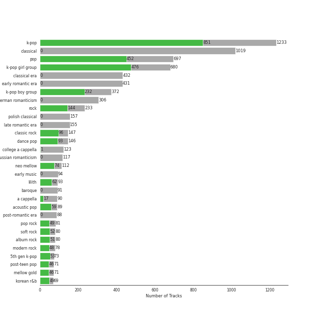

# Spotify Summary for jbrown1618

Generated by [jbrown1618/spotify-stats](https://github.com/jbrown1618/spotify-stats)

## Playlists

| Art | Name | Number of Songs | Liked Songs | 🔗 |
|:---|:---|---:|---:|:---|
| 💚 | [Liked Songs](playlists/liked_songs/overview.md) | 1495 | 1495 | |
|  | [A Cappella](playlists/a_cappella/overview.md) | 296 | 37 | [🔗](https://open.spotify.com/playlist/7LQjtpZ8EZ5vWXgPoovFeC) |
|  | [Aegyo](playlists/aegyo/overview.md) | 36 | 31 | [🔗](https://open.spotify.com/playlist/6WTiB2kj3G2g3eYqornNd2) |
|  | [Alt-Pop](playlists/alt_pop/overview.md) | 137 | 97 | [🔗](https://open.spotify.com/playlist/4DgMab6SK9pnl6P05fw2YI) |
|  | [Bach](playlists/bach/overview.md) | 55 | 0 | [🔗](https://open.spotify.com/playlist/2fkIDMzy3H9JWLKHnULX7s) |
|  | [Ballet](playlists/ballet/overview.md) | 138 | 0 | [🔗](https://open.spotify.com/playlist/23temGx5UrTk2wboAvEb0v) |
|  | [Beethoven](playlists/beethoven/overview.md) | 166 | 0 | [🔗](https://open.spotify.com/playlist/6Lvj5MXaiMrmyaBnvLvxAW) |
|  | [Brahms](playlists/brahms/overview.md) | 32 | 0 | [🔗](https://open.spotify.com/playlist/7MnYdeDrgvc9PoWHqcGVeq) |
|  | [Check Out Later](playlists/check_out_later/overview.md) | 14 | 0 | [🔗](https://open.spotify.com/playlist/2FgMW8NMJOZgvHtvDOWBCe) |
|  | [Chill](playlists/chill/overview.md) | 209 | 177 | [🔗](https://open.spotify.com/playlist/79HDmDfCjzdHS3oWXdgHGb) |
|  | [Chopin](playlists/chopin/overview.md) | 172 | 0 | [🔗](https://open.spotify.com/playlist/630IicjdF4RLyaOqIXm0jm) |
|  | [Choral](playlists/choral/overview.md) | 68 | 0 | [🔗](https://open.spotify.com/playlist/1PCfeawsTHOhi6DGzagL7Y) |
|  | [Classic Pop](playlists/classic_pop/overview.md) | 57 | 32 | [🔗](https://open.spotify.com/playlist/6oXUc88JlAQTNdKvn529pD) |
|  | [Classic Rock](playlists/classic_rock/overview.md) | 92 | 60 | [🔗](https://open.spotify.com/playlist/5z6MnUYwnqrMcdd9b14Cc7) |
|  | [Country/Folk](playlists/country_folk/overview.md) | 33 | 17 | [🔗](https://open.spotify.com/playlist/6M7uIRzByJjX0q7wGcujJo) |
|  | [Cursed English](playlists/cursed_english/overview.md) | 27 | 1 | [🔗](https://open.spotify.com/playlist/2tPCDZMU74TGOBGdNdVDBs) |
|  | [Debussy](playlists/debussy/overview.md) | 23 | 0 | [🔗](https://open.spotify.com/playlist/3bJkc96LYMneTHBCS80BAl) |
|  | [Disney](playlists/disney/overview.md) | 50 | 0 | [🔗](https://open.spotify.com/playlist/6OHUelObHhiWFkbH4cwFMg) |
|  | [Electronic](playlists/electronic/overview.md) | 12 | 9 | [🔗](https://open.spotify.com/playlist/3cWXIQgqhOUB6slIr3oglt) |
|  | [Hip Hop](playlists/hip_hop/overview.md) | 34 | 16 | [🔗](https://open.spotify.com/playlist/7trD87dfibqZnzSIqufO75) |
|  | [International Pop](playlists/international_pop/overview.md) | 100 | 49 | [🔗](https://open.spotify.com/playlist/36OHPiYrLGYMfVa0zcHgLf) |
|  | [Jazz](playlists/jazz/overview.md) | 56 | 10 | [🔗](https://open.spotify.com/playlist/58yLhLYn4iDQPCN53MfiDI) |
|  | [K-OST](playlists/k_ost/overview.md) | 21 | 17 | [🔗](https://open.spotify.com/playlist/6rOVckcfZ6oCN6seCH4GWr) |
|  | [K-Pop 101](playlists/k_pop_101/overview.md) | 45 | 41 | [🔗](https://open.spotify.com/playlist/1NlCn9vDmQDBF54JyVC2MC) |
|  | [K-Pop Favorites](playlists/k_pop_favorites/overview.md) | 219 | 219 | [🔗](https://open.spotify.com/playlist/1ZbxKv1noxwZ4zFgRNEFIo) |
|  | [K-Pop-Adjacent](playlists/k_pop_adjacent/overview.md) | 44 | 30 | [🔗](https://open.spotify.com/playlist/5ELtUGtTCv5PkLW7qFcEuk) |
|  | [K-Pop](playlists/k_pop/overview.md) | 949 | 704 | [🔗](https://open.spotify.com/playlist/0Xp2gQ9p4VMgt5HauIfIq7) |
|  | [K-R&B](playlists/k_r_b/overview.md) | 102 | 84 | [🔗](https://open.spotify.com/playlist/5dr8e1QSb4e5pnMwT79MGd) |
|  | [Karaoke](playlists/karaoke/overview.md) | 65 | 60 | [🔗](https://open.spotify.com/playlist/784bxrrG3W6L0naOkaCL5F) |
|  | [Modern Rock](playlists/modern_rock/overview.md) | 72 | 57 | [🔗](https://open.spotify.com/playlist/1PjJceUCPGCW1uMWAs5dMe) |
|  | [Mozart](playlists/mozart/overview.md) | 148 | 0 | [🔗](https://open.spotify.com/playlist/2MCvxVYbyzdWBgpnuRWsuM) |
|  | [Musicals](playlists/musicals/overview.md) | 109 | 4 | [🔗](https://open.spotify.com/playlist/54LRPekls9oCtaWOnmM3N0) |
|  | [Pop](playlists/pop/overview.md) | 373 | 275 | [🔗](https://open.spotify.com/playlist/1WZ2RqQv2SPX5uzmjWhgSh) |
|  | [Program Music](playlists/program_music/overview.md) | 41 | 0 | [🔗](https://open.spotify.com/playlist/1PyrZgdZpE6UzIA3lANOlR) |
|  | [R&B](playlists/r_b/overview.md) | 90 | 66 | [🔗](https://open.spotify.com/playlist/1RsGeysyOdV3wZHqlto0Gb) |
|  | [Rachmaninov](playlists/rachmaninov/overview.md) | 27 | 0 | [🔗](https://open.spotify.com/playlist/7LeSS5dq68CWVIOy81oza1) |
|  | [Recent Comebacks](playlists/recent_comebacks/overview.md) | 78 | 69 | [🔗](https://open.spotify.com/playlist/2UAy7fw8nOjoJvFsNZtjbI) |
|  | [Sharon RPD](playlists/sharon_rpd/overview.md) | 46 | 40 | [🔗](https://open.spotify.com/playlist/2WsAAjnlcRAzyPrBDvMYyy) |
|  | [Singer-Songwriter](playlists/singer_songwriter/overview.md) | 240 | 148 | [🔗](https://open.spotify.com/playlist/3aNr3GFiAvm1utXDyFOpAR) |
|  | [String Quartets](playlists/string_quartets/overview.md) | 179 | 0 | [🔗](https://open.spotify.com/playlist/6b3mJeJjM9S5XAIS8jcTAt) |
|  | [Tarps](playlists/tarps/overview.md) | 58 | 39 | [🔗](https://open.spotify.com/playlist/7i18RgdYPOv5E01eGmtRCo) |
|  | [Vivaldi](playlists/vivaldi/overview.md) | 34 | 0 | [🔗](https://open.spotify.com/playlist/39dOiLs9ZbssQvs9xLBRzw) |

## Artists

See top 100 artists

| Art | Tracks | 💚 | Artist | 🔗 |
|:---|---:|---:|:---|:---|
|  | 261 | 0 | Ludwig van Beethoven | [🔗](https://open.spotify.com/artist/2wOqMjp9TyABvtHdOSOTUS) |
|  | 209 | 0 | Berliner Philharmoniker | [🔗](https://open.spotify.com/artist/6uRJnvQ3f8whVnmeoecv5Z) |
|  | 205 | 0 | Vladimir Ashkenazy | [🔗](https://open.spotify.com/artist/20iZXzMb8LoWXOeca32i82) |
|  | 183 | 0 | Herbert von Karajan | [🔗](https://open.spotify.com/artist/5zCaQxjl110XTrm4LQ1CxY) |
|  | 159 | 0 | Wolfgang Amadeus Mozart | [🔗](https://open.spotify.com/artist/4NJhFmfw43RLBLjQvxDuRS) |
|  | 157 | 0 | Frédéric Chopin | [🔗](https://open.spotify.com/artist/7y97mc3bZRFXzT2szRM4L4) |
|  | 80 | 0 | Jerusalem Quartet | [🔗](https://open.spotify.com/artist/7AnE8Jpu1vxLeXcs6OKYHE) |
|  | 71 | 0 | Tokyo String Quartet | [🔗](https://open.spotify.com/artist/15G9RnBNBDCFUMANna2CvO) |
|  | 63 | 48 | [Red Velvet](artists/red_velvet) | [🔗](https://open.spotify.com/artist/1z4g3DjTBBZKhvAroFlhOM) |
|  | 63 | 43 | [Sara Bareilles](artists/sara_bareilles) | [🔗](https://open.spotify.com/artist/2Sqr0DXoaYABbjBo9HaMkM) |
|  | 63 | 37 | [Taylor Swift](artists/taylor_swift) | [🔗](https://open.spotify.com/artist/06HL4z0CvFAxyc27GXpf02) |
|  | 59 | 0 | Pyotr Ilyich Tchaikovsky | [🔗](https://open.spotify.com/artist/3MKCzCnpzw3TjUYs2v7vDA) |
|  | 55 | 0 | Johann Sebastian Bach | [🔗](https://open.spotify.com/artist/5aIqB5nVVvmFsvSdExz408) |
|  | 46 | 26 | [Stray Kids](artists/stray_kids) | [🔗](https://open.spotify.com/artist/2dIgFjalVxs4ThymZ67YCE) |
|  | 46 | 0 | London Symphony Orchestra | [🔗](https://open.spotify.com/artist/5yxyJsFanEAuwSM5kOuZKc) |
|  | 44 | 32 | [TWICE](artists/twice) | [🔗](https://open.spotify.com/artist/7n2Ycct7Beij7Dj7meI4X0) |
|  | 42 | 0 | Sergei Rachmaninoff | [🔗](https://open.spotify.com/artist/0Kekt6CKSo0m5mivKcoH51) |
|  | 40 | 0 | Sir Simon Rattle | [🔗](https://open.spotify.com/artist/4GQwgdcDQwqtcHICjUNndp) |
|  | 39 | 0 | Igor Stravinsky | [🔗](https://open.spotify.com/artist/7ie36YytMoKtPiL7tUvmoE) |
|  | 39 | 0 | Barry Wordsworth | [🔗](https://open.spotify.com/artist/5sjJnaI3YhaO8KylpJk3gN) |
|  | 39 | 0 | Orchestra Victoria | [🔗](https://open.spotify.com/artist/1bnC6eJzCumTgAB7tG1118) |
|  | 39 | 0 | Léo Delibes | [🔗](https://open.spotify.com/artist/1M9AXZkNPdOd1IPEsQsXnT) |
|  | 38 | 23 | [ITZY](artists/itzy) | [🔗](https://open.spotify.com/artist/2KC9Qb60EaY0kW4eH68vr3) |
|  | 36 | 16 | [Pentatonix](artists/pentatonix) | [🔗](https://open.spotify.com/artist/26AHtbjWKiwYzsoGoUZq53) |
|  | 36 | 0 | Yo-Yo Ma | [🔗](https://open.spotify.com/artist/5Dl3HXZjG6ZOWT5cV375lk) |
|  | 35 | 25 | [BTS](artists/bts) | [🔗](https://open.spotify.com/artist/3Nrfpe0tUJi4K4DXYWgMUX) |
|  | 34 | 0 | Antonio Vivaldi | [🔗](https://open.spotify.com/artist/2QOIawHpSlOwXDvSqQ9YJR) |
|  | 33 | 22 | [(G)I-DLE](artists/_g_i_dle) | [🔗](https://open.spotify.com/artist/2AfmfGFbe0A0WsTYm0SDTx) |
|  | 33 | 3 | [Original Broadway Cast of Hamilton](artists/original_broadway_cast_of_hamilton) | [🔗](https://open.spotify.com/artist/3UUJfRbrA2nTbcg4i0MOwu) |
|  | 32 | 0 | Peter Hollens | [🔗](https://open.spotify.com/artist/7EIbKyiLnEJ1Y074UIUyZJ) |
|  | 32 | 0 | Johannes Brahms | [🔗](https://open.spotify.com/artist/5wTAi7QkpP6kp8a54lmTOq) |
|  | 32 | 0 | Andrew Lloyd Webber | [🔗](https://open.spotify.com/artist/4aP1lp10BRYZO658B2NwkG) |
|  | 31 | 22 | [The Beatles](artists/the_beatles) | [🔗](https://open.spotify.com/artist/3WrFJ7ztbogyGnTHbHJFl2) |
|  | 31 | 0 | Martha Argerich | [🔗](https://open.spotify.com/artist/66MvLAvLznk5UOvASVGjk4) |
|  | 31 | 0 | André Previn | [🔗](https://open.spotify.com/artist/2tfWguHr2nj4e8KXLKciVq) |
|  | 31 | 0 | Wiener Philharmoniker | [🔗](https://open.spotify.com/artist/003f4bk13c6Q3gAUXv7dGJ) |
|  | 30 | 25 | [BLACKPINK](artists/blackpink) | [🔗](https://open.spotify.com/artist/41MozSoPIsD1dJM0CLPjZF) |
|  | 30 | 2 | [Lin-Manuel Miranda](artists/lin_manuel_miranda) | [🔗](https://open.spotify.com/artist/4aXXDj9aZnlshx7mzj3W1N) |
|  | 29 | 26 | [IU](artists/iu) | [🔗](https://open.spotify.com/artist/3HqSLMAZ3g3d5poNaI7GOU) |
|  | 29 | 0 | Dmitri Shostakovich | [🔗](https://open.spotify.com/artist/6s1pCNXcbdtQJlsnM1hRIA) |
|  | 27 | 19 | [TAEYEON](artists/taeyeon) | [🔗](https://open.spotify.com/artist/3qNVuliS40BLgXGxhdBdqu) |
|  | 27 | 0 | Claude Debussy | [🔗](https://open.spotify.com/artist/1Uff91EOsvd99rtAupatMP) |
|  | 25 | 21 | [The Tarpeggios](artists/the_tarpeggios) | [🔗](https://open.spotify.com/artist/2HXd5pFHJyaQJr5aXfErrE) |
|  | 25 | 16 | [Ariana Grande](artists/ariana_grande) | [🔗](https://open.spotify.com/artist/66CXWjxzNUsdJxJ2JdwvnR) |
|  | 24 | 0 | Eldar Nebolsin | [🔗](https://open.spotify.com/artist/45ts2AJTWlzJ9JrQlCGxpX) |
|  | 23 | 15 | [Billy Joel](artists/billy_joel) | [🔗](https://open.spotify.com/artist/6zFYqv1mOsgBRQbae3JJ9e) |
|  | 22 | 19 | [ENHYPEN](artists/enhypen) | [🔗](https://open.spotify.com/artist/5t5FqBwTcgKTaWmfEbwQY9) |
|  | 22 | 3 | [Leslie Odom Jr.](artists/leslie_odom_jr_) | [🔗](https://open.spotify.com/artist/3cR4rhS2hBWqI7rJEBacvN) |
|  | 21 | 0 | Phantom Of The Opera Original London Cast | [🔗](https://open.spotify.com/artist/3LfD2yRlfHAtTryX8rFp25) |
|  | 21 | 0 | David Benoit | [🔗](https://open.spotify.com/artist/1OLWM7nUNcTjZ9ct4DEPZu) |
|  | 21 | 0 | Mari Kodama | [🔗](https://open.spotify.com/artist/0s0wG03kPyu7MXERfcuxim) |
|  | 20 | 18 | [LeeHi](artists/leehi) | [🔗](https://open.spotify.com/artist/7cVZApDoQZpS447nHTsNqu) |
|  | 20 | 0 | Tar Heel Voices | [🔗](https://open.spotify.com/artist/1apO6pJsV1nwuF2K8sEsDo) |
|  | 20 | 0 | Martin Jones | [🔗](https://open.spotify.com/artist/1VzJXXVXsYbEK773GWSoND) |
|  | 19 | 15 | [MAMAMOO](artists/mamamoo) | [🔗](https://open.spotify.com/artist/0XATRDCYuuGhk0oE7C0o5G) |
|  | 19 | 10 | [Lana Del Rey](artists/lana_del_rey) | [🔗](https://open.spotify.com/artist/00FQb4jTyendYWaN8pK0wa) |
|  | 19 | 0 | Benjamin Britten | [🔗](https://open.spotify.com/artist/7MJ1pB5d6Vjmzep2zQlorn) |
|  | 19 | 0 | Disney | [🔗](https://open.spotify.com/artist/3xvaSlT4xsyk6lY1ESOspO) |
|  | 19 | 0 | Wiener Singverein | [🔗](https://open.spotify.com/artist/35QSympF887CO8h5eZHme2) |
|  | 19 | 0 | Maurizio Pollini | [🔗](https://open.spotify.com/artist/2VIdKQmRHnWofsR4odfFOh) |
|  | 19 | 0 | English Chamber Orchestra | [🔗](https://open.spotify.com/artist/2DO4p3CPDnInsJfg0jFfaF) |
|  | 18 | 0 | Mariinsky Orchestra | [🔗](https://open.spotify.com/artist/2rRUfv2w535SEUV1YO5SP6) |
|  | 18 | 0 | Simon Standage | [🔗](https://open.spotify.com/artist/2jIBkRzVUboTbp05rJnKeT) |
|  | 18 | 0 | The English Concert | [🔗](https://open.spotify.com/artist/2Oz3z7PPQUMU2KNYgcO1sA) |
|  | 18 | 0 | Valery Gergiev | [🔗](https://open.spotify.com/artist/2LxnoYPOe0FCLC82R3xgO2) |
|  | 18 | 0 | Trevor Pinnock | [🔗](https://open.spotify.com/artist/25mbgceDJKxXGP8c5FmC83) |
|  | 17 | 15 | [Rihanna](artists/rihanna) | [🔗](https://open.spotify.com/artist/5pKCCKE2ajJHZ9KAiaK11H) |
|  | 17 | 15 | [Florence + The Machine](artists/florence___the_machine) | [🔗](https://open.spotify.com/artist/1moxjboGR7GNWYIMWsRjgG) |
|  | 17 | 14 | [aespa](artists/aespa) | [🔗](https://open.spotify.com/artist/6YVMFz59CuY7ngCxTxjpxE) |
|  | 17 | 10 | [Kimbra](artists/kimbra) | [🔗](https://open.spotify.com/artist/6hk7Yq1DU9QcCCrz9uc0Ti) |
|  | 17 | 0 | Gustavo Dudamel | [🔗](https://open.spotify.com/artist/0cxXnDhpgxcMMkKddhORHY) |
|  | 16 | 14 | [Radiohead](artists/radiohead) | [🔗](https://open.spotify.com/artist/4Z8W4fKeB5YxbusRsdQVPb) |
|  | 16 | 13 | [CHUNG HA](artists/chung_ha) | [🔗](https://open.spotify.com/artist/2PSJ6YriU7JsFucxACpU7Y) |
|  | 16 | 11 | [SEVENTEEN](artists/seventeen) | [🔗](https://open.spotify.com/artist/7nqOGRxlXj7N2JYbgNEjYH) |
|  | 16 | 11 | [Girls' Generation](artists/girls__generation) | [🔗](https://open.spotify.com/artist/0Sadg1vgvaPqGTOjxu0N6c) |
|  | 16 | 9 | [Beyoncé](artists/beyonc_) | [🔗](https://open.spotify.com/artist/6vWDO969PvNqNYHIOW5v0m) |
|  | 16 | 0 | Sarah Chang | [🔗](https://open.spotify.com/artist/5duxfFAQVkDT9g261fKlMP) |
|  | 16 | 0 | Ithacappella | [🔗](https://open.spotify.com/artist/5bPTIGQvxRNjr6wl9yyAct) |
|  | 16 | 0 | Emerson String Quartet | [🔗](https://open.spotify.com/artist/4IBl8k6ZsBagsI5zRjyXH7) |
|  | 16 | 0 | Orpheus Chamber Orchestra | [🔗](https://open.spotify.com/artist/35pZsti1RSA5Zv98jAm8kX) |
|  | 16 | 0 | Modest Mussorgsky | [🔗](https://open.spotify.com/artist/284mnx33IWcymQEpMxyfHl) |
|  | 15 | 4 | [IVE](artists/ive) | [🔗](https://open.spotify.com/artist/6RHTUrRF63xao58xh9FXYJ) |
|  | 15 | 0 | Peter Schmalfuss | [🔗](https://open.spotify.com/artist/7mOe6jfxX9EILXET9l5L6H) |
|  | 15 | 0 | Nikolai Korniev | [🔗](https://open.spotify.com/artist/70hS9SnJefkZo2QJwS2VXi) |
|  | 15 | 0 | St.Petersburg Chamber Choir | [🔗](https://open.spotify.com/artist/46WjEugfIF0rKOewvFiby2) |
|  | 14 | 12 | [Billlie](artists/billlie) | [🔗](https://open.spotify.com/artist/2GQxKDojobwBjZMPf7aoh0) |
|  | 14 | 11 | [Dreamcatcher](artists/dreamcatcher) | [🔗](https://open.spotify.com/artist/5V1qsQHdXNm4ZEZHWvFnqQ) |
|  | 14 | 11 | [Queen](artists/queen) | [🔗](https://open.spotify.com/artist/1dfeR4HaWDbWqFHLkxsg1d) |
|  | 14 | 0 | Sarah Brightman | [🔗](https://open.spotify.com/artist/7Ead768rc4ShGxnqtqccU5) |
|  | 13 | 11 | [Billie Eilish](artists/billie_eilish) | [🔗](https://open.spotify.com/artist/6qqNVTkY8uBg9cP3Jd7DAH) |
|  | 13 | 10 | [STAYC](artists/stayc) | [🔗](https://open.spotify.com/artist/01XYiBYaoMJcNhPokrg0l0) |
|  | 13 | 9 | [Lady Gaga](artists/lady_gaga) | [🔗](https://open.spotify.com/artist/1HY2Jd0NmPuamShAr6KMms) |
|  | 13 | 6 | [NCT 127](artists/nct_127) | [🔗](https://open.spotify.com/artist/7f4ignuCJhLXfZ9giKT7rH) |
|  | 13 | 1 | [Daveed Diggs](artists/daveed_diggs) | [🔗](https://open.spotify.com/artist/3twuAojvYNrlWZpMkxLm3P) |
|  | 13 | 0 | Anna Tomowa-Sintow | [🔗](https://open.spotify.com/artist/6NSIW1uEq8JZmxEkHMF17c) |
|  | 13 | 0 | Felix Mendelssohn | [🔗](https://open.spotify.com/artist/6MF58APd3YV72Ln2eVg710) |
|  | 13 | 0 | John Eliot Gardiner | [🔗](https://open.spotify.com/artist/1qIRoGEKXINqrCx5N1engi) |
|  | 12 | 10 | [Bruno Mars](artists/bruno_mars) | [🔗](https://open.spotify.com/artist/0du5cEVh5yTK9QJze8zA0C) |
|  | 12 | 8 | [EXO](artists/exo) | [🔗](https://open.spotify.com/artist/3cjEqqelV9zb4BYE3qDQ4O) |
|  | 12 | 8 | [WENDY](artists/wendy) | [🔗](https://open.spotify.com/artist/0FRUZvZNPzM3YJMABJxf2K) |

## Genres

See top 100 genres

| Tracks | 💚 | Genre |
|---:|---:|:---|
| 1003 | 0 | classical |
| 904 | 656 | [k-pop](genres/k_pop) |
| 529 | 374 | [pop](genres/pop) |
| 432 | 0 | classical era |
| 431 | 0 | early romantic era |
| 419 | 297 | [k-pop girl group](genres/k_pop_girl_group) |
| 306 | 0 | german romanticism |
| 246 | 166 | [k-pop boy group](genres/k_pop_boy_group) |
| 243 | 161 | [dance pop](genres/dance_pop) |
| 197 | 17 | [a cappella](genres/a_cappella) |
| 159 | 0 | lullaby |
| 157 | 107 | [rock](genres/rock) |
| 157 | 0 | polish classical |
| 155 | 0 | late romantic era |
| 136 | 43 | [hollywood](genres/hollywood) |
| 120 | 78 | [classic rock](genres/classic_rock) |
| 118 | 0 | college a cappella |
| 117 | 0 | russian romanticism |
| 103 | 3 | [show tunes](genres/show_tunes) |
| 94 | 0 | early music |
| 93 | 59 | [lilith](genres/lilith) |
| 91 | 0 | baroque |
| 90 | 59 | [neo mellow](genres/neo_mellow) |
| 88 | 0 | post-romantic era |
| 87 | 56 | [acoustic pop](genres/acoustic_pop) |
| 79 | 54 | [pop rock](genres/pop_rock) |
| 68 | 0 | russian modern classical |
| 67 | 42 | [mellow gold](genres/mellow_gold) |
| 60 | 38 | [post-teen pop](genres/post_teen_pop) |
| 59 | 39 | [electropop](genres/electropop) |
| 59 | 2 | [broadway](genres/broadway) |
| 58 | 32 | [soft rock](genres/soft_rock) |
| 56 | 0 | neoclassicism |
| 55 | 0 | german baroque |
| 54 | 33 | [folk rock](genres/folk_rock) |
| 50 | 38 | [korean pop](genres/korean_pop) |
| 50 | 34 | [art pop](genres/art_pop) |
| 50 | 27 | [r&b](genres/r_b) |
| 49 | 19 | [adult standards](genres/adult_standards) |
| 48 | 0 | early modern classical |
| 43 | 25 | [singer-songwriter](genres/singer_songwriter) |
| 42 | 0 | ukrainian classical |
| 42 | 0 | movie tunes |
| 40 | 31 | [korean r&b](genres/korean_r_b) |
| 39 | 30 | british invasion |
| 39 | 25 | piano rock |
| 39 | 0 | french romanticism |
| 39 | 0 | french opera |
| 38 | 0 | west end |
| 37 | 28 | psychedelic rock |
| 36 | 26 | permanent wave |
| 34 | 19 | album rock |
| 34 | 0 | italian baroque |
| 33 | 23 | beatlesque |
| 33 | 21 | pop rap |
| 33 | 15 | rap |
| 33 | 11 | lounge |
| 32 | 19 | uk pop |
| 32 | 0 | fantasy |
| 31 | 22 | merseybeat |
| 31 | 20 | urban contemporary |
| 31 | 0 | impressionism |
| 30 | 18 | hard rock |
| 29 | 19 | anime |
| 29 | 0 | compositional ambient |
| 28 | 17 | k-rap |
| 28 | 17 | indie pop |
| 27 | 13 | canadian pop |
| 26 | 23 | art rock |
| 25 | 22 | modern rock |
| 23 | 12 | soul |
| 22 | 17 | alternative rock |
| 22 | 8 | j-pop |
| 22 | 8 | hip hop |
| 22 | 1 | smooth jazz |
| 21 | 19 | melancholia |
| 20 | 15 | metropopolis |
| 20 | 13 | glam rock |
| 20 | 12 | folk |
| 20 | 4 | vocal jazz |
| 19 | 15 | baroque pop |
| 19 | 12 | nz pop |
| 19 | 11 | edm |
| 18 | 12 | atl hip hop |
| 17 | 15 | uk alternative pop |
| 17 | 14 | neo soul |
| 17 | 0 | choral |
| 16 | 14 | oxford indie |
| 16 | 9 | bergen indie |
| 15 | 0 | german classical piano |
| 14 | 13 | barbadian pop |
| 14 | 11 | indie rock |
| 14 | 6 | funk |
| 13 | 7 | motown |
| 12 | 12 | korean ost |
| 12 | 12 | australian pop |
| 12 | 8 | pop dance |
| 12 | 8 | latin pop |
| 12 | 8 | etherpop |
| 12 | 7 | british soul |

## Top Record Labels

See top 100 labels

| Tracks | 💚 | Label |
|---:|---:|:---|
| 258 | 0 | [Decca Music Group Ltd.](labels/decca_music_group_ltd_) |
| 240 | 174 | [SM Entertainment](labels/sm_entertainment) |
| 161 | 0 | [Deutsche Grammophon (DG)](labels/deutsche_grammophon__dg_) |
| 152 | 0 | [harmonia mundi](labels/harmonia_mundi) |
| 141 | 88 | [Republic Records](labels/republic_records) |
| 117 | 0 | [UME - Global Clearing House](labels/ume___global_clearing_house) |
| 89 | 61 | [Epic](labels/epic) |
| 84 | 55 | [Columbia](labels/columbia) |
| 81 | 43 | [RCA Records Label](labels/rca_records_label) |
| 79 | 26 | [Atlantic Records](labels/atlantic_records) |
| 79 | 0 | [Warner Classics](labels/warner_classics) |
| 78 | 54 | [Genie Music Corporation](labels/genie_music_corporation) |
| 72 | 60 | [YG Entertainment](labels/yg_entertainment) |
| 70 | 58 | [Interscope Records](labels/interscope_records) |
| 70 | 46 | [Warner Records](labels/warner_records) |
| 64 | 50 | [Stone Music Entertainment](labels/stone_music_entertainment) |
| 61 | 42 | [Universal Music LLC](labels/universal_music_llc) |
| 59 | 0 | [Varsity Vocals](labels/varsity_vocals) |
| 56 | 17 | [Polydor Records](labels/polydor_records) |
| 49 | 0 | [Walt Disney Records](labels/walt_disney_records) |
| 45 | 32 | [BIGHIT MUSIC](labels/bighit_music) |
| 39 | 0 | [Sony Classical](labels/sony_classical) |
| 39 | 0 | [Australian Broadcasting Corp (ABC)](labels/australian_broadcasting_corp__abc_) |
| 34 | 27 | [RBW Inc.](labels/rbw_inc_) |
| 33 | 24 | [CUBE ENTERTAINMENT](labels/cube_entertainment) |
| 33 | 18 | [Taylor Swift](labels/taylor_swift) |
| 32 | 0 | [A Cappella Records](labels/a_cappella_records) |
| 31 | 19 | [JYP Entertainment](labels/jyp_entertainment) |
| 31 | 15 | [Starship Entertainment](labels/starship_entertainment) |
| 30 | 21 | [EMI Catalogue](labels/emi_catalogue) |
| 29 | 19 | [Big Machine Records](labels/big_machine_records) |
| 27 | 1 | [Decca (UMO)](labels/decca__umo_) |
| 25 | 14 | [Rhino](labels/rhino) |
| 24 | 0 | [Naxos](labels/naxos) |
| 22 | 17 | [XL Recordings](labels/xl_recordings) |
| 21 | 0 | [Warner Music Group - X5 Music Group](labels/warner_music_group___x5_music_group) |
| 21 | 0 | [PENTATONE](labels/pentatone) |
| 21 | 0 | [GRP](labels/grp) |
| 20 | 18 | [BELIFT LAB](labels/belift_lab) |
| 20 | 13 | [PLEDIS Entertainment](labels/pledis_entertainment) |
| 20 | 13 | [Capitol Records](labels/capitol_records) |
| 20 | 0 | [Verve (Adult Contemporary) MC](labels/verve__adult_contemporary__mc) |
| 20 | 0 | [Peter Hollens](labels/peter_hollens) |
| 20 | 0 | [Nimbus Records](labels/nimbus_records) |
| 19 | 13 | [Def Jam Recordings](labels/def_jam_recordings) |
| 18 | 16 | [Universal-Island Records Ltd.](labels/universal_island_records_ltd_) |
| 18 | 0 | [Mariinsky](labels/mariinsky) |
| 16 | 13 | [The Tarpeggios](labels/the_tarpeggios) |
| 16 | 12 | [Jive](labels/jive) |
| 16 | 12 | [Hollywood Records](labels/hollywood_records) |
| 16 | 4 | [Legacy](labels/legacy) |
| 16 | 0 | [Warner Classics UK](labels/warner_classics_uk) |
| 15 | 14 | [Kakao Entertainment](labels/kakao_entertainment) |
| 15 | 4 | [UMC (Universal Music Catalogue)](labels/umc__universal_music_catalogue_) |
| 15 | 0 | [The Music Factory](labels/the_music_factory) |
| 14 | 12 | [MYSTIC STORY](labels/mystic_story) |
| 14 | 7 | [WM Korea](labels/wm_korea) |
| 14 | 3 | [Sony Music Labels Inc.](labels/sony_music_labels_inc_) |
| 13 | 11 | [Darkroom](labels/darkroom) |
| 13 | 7 | [MOTOWN](labels/motown) |
| 13 | 5 | [Reprise](labels/reprise) |
| 13 | 0 | [Lso Live](labels/lso_live) |
| 12 | 11 | [SOURCE MUSIC](labels/source_music) |
| 12 | 10 | [Syco Music](labels/syco_music) |
| 12 | 9 | [High Up Entertainment](labels/high_up_entertainment) |
| 12 | 6 | [Virgin Records](labels/virgin_records) |
| 12 | 0 | [One Voice Productions](labels/one_voice_productions) |
| 12 | 0 | [Ithacappella](labels/ithacappella) |
| 12 | 0 | [Channel Classics Records](labels/channel_classics_records) |
| 11 | 8 | [FNC ENTERTAINMENT](labels/fnc_entertainment) |
| 10 | 8 | [WM Entertainment](labels/wm_entertainment) |
| 10 | 8 | [DREAMCATCHER COMPANY](labels/dreamcatcher_company) |
| 10 | 6 | [HYBE](labels/hybe) |
| 10 | 5 | [143](labels/143) |
| 9 | 8 | The Unc - Chapel Hill Tarpeggios |
| 9 | 8 | MNH ENTERTAINMENT |
| 9 | 7 | Cooking Vinyl Limited |
| 9 | 6 | Sire |
| 9 | 0 | Option C Records |
| 8 | 8 | Monkey Puzzle Records |
| 8 | 7 | 88rising Music |
| 8 | 6 | UNI |
| 8 | 5 | Parkwood Entertainment |
| 8 | 5 | KQ Entertainment |
| 8 | 4 | avex trax |
| 8 | 0 | Vanderbilt Melodores |
| 8 | 0 | UNC Achordants |
| 8 | 0 | SUPRAPHON a.s. |
| 8 | 0 | Mosaic Whispers |
| 7 | 6 | EDAM Entertainment |
| 7 | 6 | Bad Boy |
| 7 | 5 | ADOR |
| 7 | 3 | Universal (MT) |
| 7 | 3 | Island Records |
| 7 | 2 | EMI |
| 7 | 1 | Nettwerk Records |
| 6 | 5 | Fueled By Ramen |
| 6 | 5 | Atlantic Records UK |
| 6 | 4 | P NATION |
| 6 | 4 | Arista |

## Audio Features

| 10 most Danceable tracks | 10 least Danceable tracks |
|:---|:---|
| Bando (0.97) | String Quartet No. 8 in C Minor, Op. 110: V. Largo (0.0592) |
| SexyBack (feat. Timbaland) (0.967) | The Planets, Op. 32: 7. Neptune, the Mystic (0.0601) |
| Anaconda (0.964) | Ave Maria (Franz Biebl) (0.0611) |
| Cold Blooded (0.961) | Symphony No. 9 In D Minor, Op. 125 - "Choral": 3. Adagio molto e cantabile (0.062) |
| #Twenty (0.956) | String Quartet in G Minor, Op. 10: III. Andantino, doucement expressif (0.0623) |
| FACE (0.954) | La Mer, L.109: 1. From Dawn Till Noon On The Sea (De l'aube à midi sur la mer) (0.0633) |
| WAP (feat. Megan Thee Stallion) (0.935) | Vespers, Op. 37: XII. "Slava v vyshnikh Bogu" (0.0636) |
| SNEAKERS (0.935) | Die Zauberflöte, K.620 / Act 2: "O Isis und Osiris, welche Wonne!" (0.0663) |
| Idle song (0.933) | Requiem in D Minor, Op. 48: II. Offertorium. Domine Jesu Christe (0.0668) |
| Billie Jean (0.932) | Horn Concerto No. 4 in E-Flat Major, K. 495: II. Romanza. Andante (0.0683) |

| 10 most Energetic tracks | 10 least Energetic tracks |
|:---|:---|
| War of Hormone (0.993) | Le Sacre du Printemps - Revised version for Orchestra (published 1947) / Part 1: The Adoration of the Earth: The Sage (0.000239) |
| チョコレイト・ディスコ (0.99) | Préludes Book 1, L. 117: I. Des Pas sur La Neige (0.000594) |
| When Doves Cry (0.989) | Pictures at an Exhibition (Orch. Ravel): VIIIa. Catacombae (Sepulchrum Romanum) (0.000845) |
| Shanti Shanti Shanti (0.988) | Images, Set 2, L. 111: et la Lune descend sur le Temple qui fut (0.00104) |
| Rondo of Nightmare (0.987) | The Firebird (L'oiseau De Feu) - Suite (1919): Introduction (0.00108) |
| RING X RING (0.987) | Préludes Book 2, L. 123: II. Canope (0.00148) |
| Headbangeeeeerrrrr!!!!! (0.985) | Piano Sonata No. 21 in C Major, Op. 53 "Waldstein": II. Introduzione (Adagio molto) (0.00157) |
| Gimme Chocolate!! (0.985) | Piano Sonata No. 31 in A flat, Op. 110: 3. Adagio ma non troppo (0.00168) |
| Boys & Girls (0.985) | 24 Préludes, Op. 28: No. 7 in A Major (0.00168) |
| Hit That Drum (0.984) | 24 Préludes, Op. 28: No. 7 in A Major: Andantino (0.00174) |

| 10 most Speechy tracks | 10 least Speechy tracks |
|:---|:---|
| 24 Préludes, Op. 28: No. 20 in C Minor: Largo (0.879) | With (0.0228) |
| Aaron Burr, Sir (0.818) | Satellite Call (0.0241) |
| Prologue (0.748) | 情非得已 (0.0241) |
| A Midsummer Night's Dream, Incidental Music, Op. 61: No. 2, L'istesso tempo (0.676) | Breakeven (0.0242) |
| Ten Duel Commandments (0.658) | All Too Well (0.0243) |
| The World Was Wide Enough (0.648) | The Scientist (0.0243) |
| 24 Préludes, Op. 28: No. 20 in C Minor: Largo (0.592) | Lemon Love (0.0244) |
| The Adams Administration (0.544) | We Found Love (0.0244) |
| Cabinet Battle #2 (0.537) | Fields Of Gold (0.0246) |
| A Midsummer Night's Dream, Incidental Music, Op. 61: "Ay Me! For Aught That I Could Ever Read" (0.524) | Old Fashioned (0.0246) |

| 10 most Acoustic tracks | 10 least Acoustic tracks |
|:---|:---|
| Nocturne No. 11 In G Minor, Op. 37 No. 1 (0.996) | The Motherload (7.1e-06) |
| Piano Sonata No. 10 in C Major, K. 330: II. Andante cantabile (0.996) | The Phantom Of The Opera (7.33e-06) |
| Nocturne No. 12 In G, Op. 37 No. 2 (0.996) | abnormalize (7.51e-06) |
| Wiosna, B117 (arr. from Op. 74/2) (0.996) | Blood and Thunder (8.58e-06) |
| Feuille d'album in E, Op. posth. (0.995) | Kagerou (3.1e-05) |
| 24 Préludes, Op. 28: No. 13 in F-Sharp Major (0.995) | Paranoid - 2012 - Remaster (4.52e-05) |
| Piano Sonata No. 25 in G, Op. 79: 2. Andante (0.995) | End Of All Hope (6.14e-05) |
| Vespers, Op. 37: VIII. "Kvalite imya Gospodne" (0.995) | Sk8er Boi (6.79e-05) |
| Piano Sonata No. 16 in C Major, K. 545 "Sonata facile": II. Andante (0.995) | Headbangeeeeerrrrr!!!!! (7.67e-05) |
| Waltz No.9 Op.69-1 A Flat Major (0.995) | Save Tonight (9.24e-05) |

| 10 most Instrumental tracks | 10 least Instrumental tracks |
|:---|:---|
| Pictures at an Exhibition (Orch. Ravel): IV. Bydlo (0.983) | Sk8er Boi (0.0) |
| Vespers, Op. 37: XIV. "Voskrez iz groba" (0.98) | Say You're Sorry (0.0) |
| Vespers, Op. 37: VI. "Bogoroditse Devo" (0.979) | Leave The Door Open (0.0) |
| Tchaikovsky: Swan Lake, Op. 20, Act IV: No. 26, Scene. Allegro ma non troppo (0.978) | Gangnam Style (강남스타일) (0.0) |
| Prelude No.1 in C Major (0.977) | Say Something (0.0) |
| Le Sacre du Printemps - Revised version for Orchestra (published 1947) / Part 1: The Adoration of the Earth: Introduction (0.972) | Miracle (0.0) |
| Requiem in D Minor, Op. 48: VII. In Paradisum (0.971) | Traffic light (0.0) |
| String Quartet No. 14 in C-Sharp Minor, Op. 131: VI. Adagio quasi un poco andante (0.97) | No Hands (feat. Roscoe Dash & Wale) (0.0) |
| Lux Aurumque (0.964) | When Will My Life Begin? - From "Tangled" / Soundtrack Version (0.0) |
| 24 Préludes, Op. 28: No. 10 in C-Sharp Minor (0.964) | Sweet As Whole (0.0) |

| 10 most Live tracks | 10 least Live tracks |
|:---|:---|
| Brand New Jones (0.926) | Freedom At Midnight (0.0168) |
| Bel Air (0.901) | PING PONG (0.0202) |
| Folsom Prison Blues - Live at Folsom State Prison, Folsom, CA - January 1968 (0.893) | Ain't It Fun (0.021) |
| Thriller (0.89) | Finesse - Remix; feat. Cardi B (0.0215) |
| Heart Attack (0.887) | CASE 143 (0.0222) |
| XS (0.869) | SNEAKERS (0.0223) |
| Can't Tell Me Nothing (0.82) | Finesse (0.0232) |
| Piano Man (0.807) | SNEAKERS (English Ver.) (0.0242) |
| You Better Run (0.803) | Oh My God (0.0264) |
| Red Lipstick (feat. Yoonmirae) (0.792) | That That (prod. & feat. SUGA of BTS) (0.0272) |

| 10 most Happy tracks | 10 least Happy tracks |
|:---|:---|
| Sour candy (0.98) | Le Sacre du Printemps - Revised version for Orchestra (published 1947) / Part 1: The Adoration of the Earth: The Sage (0.0) |
| Material Girl (0.978) | The Firebird (L'oiseau De Feu) - Suite (1919): Dance Of The Firebird (0.0) |
| Big Yellow Taxi (0.97) | 24 Préludes, Op. 28: No. 7 in A Major: Andantino (0.0) |
| Like a Virgin (0.97) | Lux Aurumque (0.0241) |
| There's Nothing Holdin' Me Back (0.969) | String Quartet No. 9 in E-Flat Major, Op. 117: II. Adagio (0.0251) |
| Crocodile Rock (0.968) | Three Songs Of Faith: Hope Faith Life Love (0.0285) |
| Twenty-three (0.968) | 24 Préludes, Op. 28: No. 9 in E Major: Largo (0.0292) |
| Devil (0.968) | The Planets, Op. 32: 2. Venus, the Bringer of Peace (0.0301) |
| Sugar, Sugar (0.967) | The Planets, Op. 32: 7. Neptune, the Mystic (0.0305) |
| Pepe (0.966) | String Quartet No.11 in F Minor, Op. 122: VI. Elégie (Adagio) (0.0307) |

## Possible organizational errors
[Possible organizational errors](errors.md)