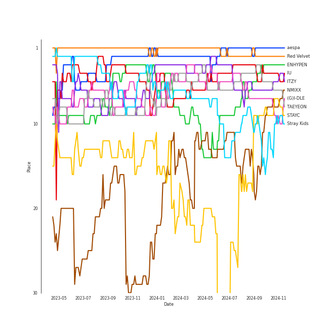
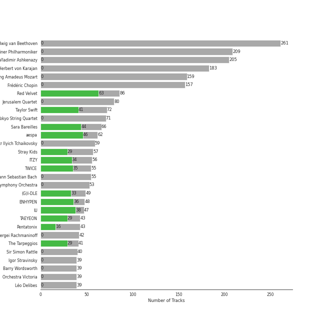
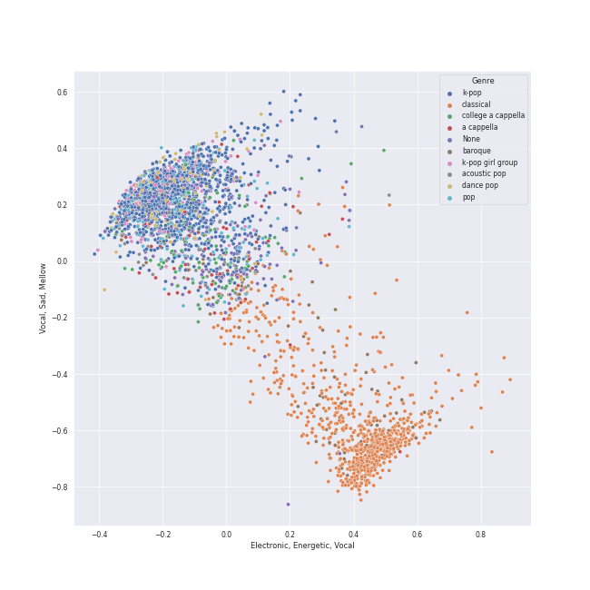

# Spotify Summary for jbrown1618

Generated by [jbrown1618/spotify-stats](https://github.com/jbrown1618/spotify-stats)

[See Track Features](audio_features.md)

[See Clusters](clusters.md)

## Playlists

| Art | Name | Tracks | 💚 | 🔗 |
|:---|:---|---:|---:|:---|
| 💚 | [Liked Tracks](playlists/liked_tracks/overview.md) | 1751 | 1751 | |
|  | [K-Pop](playlists/k-pop/overview.md) | 1204 | 878 | [🔗](https://open.spotify.com/playlist/0Xp2gQ9p4VMgt5HauIfIq7) |
|  | [Pop](playlists/pop/overview.md) | 401 | 289 | [🔗](https://open.spotify.com/playlist/1WZ2RqQv2SPX5uzmjWhgSh) |
|  | [K-Pop Favorites](playlists/k-pop_favorites/overview.md) | 287 | 287 | [🔗](https://open.spotify.com/playlist/1ZbxKv1noxwZ4zFgRNEFIo) |
|  | [Workout](playlists/workout/overview.md) | 223 | 213 | [🔗](https://open.spotify.com/playlist/3NYClOhoC6ZSipLJBTsZfO) |
|  | [Summer](playlists/summer/overview.md) | 218 | 208 | [🔗](https://open.spotify.com/playlist/0Xy9zMj8Yow1mGIrqd8nON) |
|  | [Chill](playlists/chill/overview.md) | 219 | 174 | [🔗](https://open.spotify.com/playlist/79HDmDfCjzdHS3oWXdgHGb) |
|  | [Singer-Songwriter](playlists/singer-songwriter/overview.md) | 251 | 155 | [🔗](https://open.spotify.com/playlist/3aNr3GFiAvm1utXDyFOpAR) |
|  | [K-R&B](playlists/k-r_b/overview.md) | 144 | 110 | [🔗](https://open.spotify.com/playlist/5dr8e1QSb4e5pnMwT79MGd) |
|  | [Alt-Pop](playlists/alt-pop/overview.md) | 151 | 106 | [🔗](https://open.spotify.com/playlist/4DgMab6SK9pnl6P05fw2YI) |

View all

| Art | Name | Tracks | 💚 | 🔗 |
|:---|:---|---:|---:|:---|
|  | [Halloween](playlists/halloween/overview.md) | 97 | 89 | [🔗](https://open.spotify.com/playlist/6Kh7qnaefCcgcBdJJryJKp) |
|  | [Modern Rock](playlists/modern_rock/overview.md) | 127 | 78 | [🔗](https://open.spotify.com/playlist/1PjJceUCPGCW1uMWAs5dMe) |
|  | [Recent Comebacks](playlists/recent_comebacks/overview.md) | 90 | 76 | [🔗](https://open.spotify.com/playlist/2UAy7fw8nOjoJvFsNZtjbI) |
|  | [R&B](playlists/r_b/overview.md) | 103 | 72 | [🔗](https://open.spotify.com/playlist/1RsGeysyOdV3wZHqlto0Gb) |
|  | [Classic Rock](playlists/classic_rock/overview.md) | 107 | 64 | [🔗](https://open.spotify.com/playlist/5z6MnUYwnqrMcdd9b14Cc7) |
|  | [International Pop](playlists/international_pop/overview.md) | 114 | 59 | [🔗](https://open.spotify.com/playlist/36OHPiYrLGYMfVa0zcHgLf) |
|  | [Karaoke](playlists/karaoke/overview.md) | 66 | 59 | [🔗](https://open.spotify.com/playlist/784bxrrG3W6L0naOkaCL5F) |
|  | [Recommendations for Jeff](playlists/recommendations_for_jeff/overview.md) | 52 | 52 | [🔗](https://open.spotify.com/playlist/5Liek0UOC5GmdOjxdWhcob) |
|  | [K-Pop 101](playlists/k-pop_101/overview.md) | 49 | 45 | [🔗](https://open.spotify.com/playlist/1NlCn9vDmQDBF54JyVC2MC) |
|  | [Sharon RPD](playlists/sharon_rpd/overview.md) | 54 | 43 | [🔗](https://open.spotify.com/playlist/2WsAAjnlcRAzyPrBDvMYyy) |
|  | [Tarps](playlists/tarps/overview.md) | 58 | 39 | [🔗](https://open.spotify.com/playlist/7i18RgdYPOv5E01eGmtRCo) |
|  | [A Cappella](playlists/a_cappella/overview.md) | 296 | 36 | [🔗](https://open.spotify.com/playlist/7LQjtpZ8EZ5vWXgPoovFeC) |
|  | [애교！](playlists/애교！/overview.md) | 46 | 35 | [🔗](https://open.spotify.com/playlist/6WTiB2kj3G2g3eYqornNd2) |
|  | [K-Pop-Adjacent](playlists/k-pop-adjacent/overview.md) | 51 | 33 | [🔗](https://open.spotify.com/playlist/5ELtUGtTCv5PkLW7qFcEuk) |
|  | [Classic Pop](playlists/classic_pop/overview.md) | 59 | 32 | [🔗](https://open.spotify.com/playlist/6oXUc88JlAQTNdKvn529pD) |
|  | [누구?](playlists/누구_/overview.md) | 53 | 32 | [🔗](https://open.spotify.com/playlist/4JrgU3rcLuATwzM1jVVgyC) |
|  | [Hip Hop](playlists/hip_hop/overview.md) | 44 | 24 | [🔗](https://open.spotify.com/playlist/7trD87dfibqZnzSIqufO75) |
|  | [K-OST](playlists/k-ost/overview.md) | 30 | 22 | [🔗](https://open.spotify.com/playlist/6rOVckcfZ6oCN6seCH4GWr) |
|  | [K-Memes](playlists/k-memes/overview.md) | 46 | 21 | [🔗](https://open.spotify.com/playlist/3tRZYaAFqIagumJLpKXUp9) |
|  | [Country/Folk](playlists/country_folk/overview.md) | 33 | 17 | [🔗](https://open.spotify.com/playlist/6M7uIRzByJjX0q7wGcujJo) |
|  | [Classical Samples](playlists/classical_samples/overview.md) | 17 | 15 | [🔗](https://open.spotify.com/playlist/6Pp6fPWxumAQQLVE68SVtY) |
|  | [Jazz](playlists/jazz/overview.md) | 56 | 10 | [🔗](https://open.spotify.com/playlist/58yLhLYn4iDQPCN53MfiDI) |
|  | [Electronic](playlists/electronic/overview.md) | 13 | 9 | [🔗](https://open.spotify.com/playlist/3cWXIQgqhOUB6slIr3oglt) |
|  | [Christmas](playlists/christmas/overview.md) | 102 | 7 | [🔗](https://open.spotify.com/playlist/7fuGiFfUaZPvDH5eSyfMr8) |
|  | [Musicals](playlists/musicals/overview.md) | 109 | 4 | [🔗](https://open.spotify.com/playlist/54LRPekls9oCtaWOnmM3N0) |
|  | [Cursed English](playlists/cursed_english/overview.md) | 32 | 1 | [🔗](https://open.spotify.com/playlist/2tPCDZMU74TGOBGdNdVDBs) |
|  | [String Quartets](playlists/string_quartets/overview.md) | 179 | 0 | [🔗](https://open.spotify.com/playlist/6b3mJeJjM9S5XAIS8jcTAt) |
|  | [Chopin](playlists/chopin/overview.md) | 172 | 0 | [🔗](https://open.spotify.com/playlist/630IicjdF4RLyaOqIXm0jm) |
|  | [Beethoven](playlists/beethoven/overview.md) | 166 | 0 | [🔗](https://open.spotify.com/playlist/6Lvj5MXaiMrmyaBnvLvxAW) |
|  | [Mozart](playlists/mozart/overview.md) | 148 | 0 | [🔗](https://open.spotify.com/playlist/2MCvxVYbyzdWBgpnuRWsuM) |
|  | [Ballet](playlists/ballet/overview.md) | 138 | 0 | [🔗](https://open.spotify.com/playlist/23temGx5UrTk2wboAvEb0v) |
|  | [Disney](playlists/disney/overview.md) | 68 | 0 | [🔗](https://open.spotify.com/playlist/6OHUelObHhiWFkbH4cwFMg) |
|  | [Choral](playlists/choral/overview.md) | 68 | 0 | [🔗](https://open.spotify.com/playlist/1PCfeawsTHOhi6DGzagL7Y) |
|  | [Bach](playlists/bach/overview.md) | 55 | 0 | [🔗](https://open.spotify.com/playlist/2fkIDMzy3H9JWLKHnULX7s) |
|  | [Program Music](playlists/program_music/overview.md) | 41 | 0 | [🔗](https://open.spotify.com/playlist/1PyrZgdZpE6UzIA3lANOlR) |
|  | [Vivaldi](playlists/vivaldi/overview.md) | 34 | 0 | [🔗](https://open.spotify.com/playlist/39dOiLs9ZbssQvs9xLBRzw) |
|  | [Brahms](playlists/brahms/overview.md) | 32 | 0 | [🔗](https://open.spotify.com/playlist/7MnYdeDrgvc9PoWHqcGVeq) |
|  | [Rachmaninov](playlists/rachmaninov/overview.md) | 27 | 0 | [🔗](https://open.spotify.com/playlist/7LeSS5dq68CWVIOy81oza1) |
|  | [Debussy](playlists/debussy/overview.md) | 23 | 0 | [🔗](https://open.spotify.com/playlist/3bJkc96LYMneTHBCS80BAl) |
|  | [Check Out Later](playlists/check_out_later/overview.md) | 18 | 0 | [🔗](https://open.spotify.com/playlist/2FgMW8NMJOZgvHtvDOWBCe) |

## Artists

Top artists of the last month, six months, and all time

| Place | ​ | Last month | ​​ | Last 6 months | ​​​ | All time |
|---:|:---|:---|:---|:---|:---|:---|
| 1 |  | [IU](artists/iu/overview.md) |  | [Red Velvet](artists/red_velvet/overview.md) |  | [Red Velvet](artists/red_velvet/overview.md) |
| 2 |  | [aespa](artists/aespa/overview.md) |  | [aespa](artists/aespa/overview.md) |  | [IU](artists/iu/overview.md) |
| 3 |  | [Red Velvet](artists/red_velvet/overview.md) |  | [ITZY](artists/itzy/overview.md) |  | [TWICE](artists/twice/overview.md) |
| 4 |  | [TAEYEON](artists/taeyeon/overview.md) |  | [(G)I-DLE](artists/(g)i-dle/overview.md) |  | [ITZY](artists/itzy/overview.md) |
| 5 |  | [Pentatonix](artists/pentatonix/overview.md) |  | [IU](artists/iu/overview.md) |  | [(G)I-DLE](artists/(g)i-dle/overview.md) |
| 6 |  | [LeeHi](artists/leehi/overview.md) |  | [ENHYPEN](artists/enhypen/overview.md) |  | [aespa](artists/aespa/overview.md) |
| 7 |  | [Stray Kids](artists/stray_kids/overview.md) |  | [Stray Kids](artists/stray_kids/overview.md) |  | [Stray Kids](artists/stray_kids/overview.md) |
| 8 |  | [IVE](artists/ive/overview.md) |  | [TAEYEON](artists/taeyeon/overview.md) |  | [BLACKPINK](artists/blackpink/overview.md) |
| 9 |  | [LE SSERAFIM](artists/le_sserafim/overview.md) |  | [TWICE](artists/twice/overview.md) |  | [TAEYEON](artists/taeyeon/overview.md) |
| 10 |  | [HEIZE](artists/heize/overview.md) |  | [LeeHi](artists/leehi/overview.md) |  | [ENHYPEN](artists/enhypen/overview.md) |

See top 50 artists

| Place | ​ | Last month | ​​ | Last 6 months | ​​​ | All time |
|---:|:---|:---|:---|:---|:---|:---|
| 11 |  | [ENHYPEN](artists/enhypen/overview.md) |  | [SEVENTEEN](artists/seventeen/overview.md) |  | [SEVENTEEN](artists/seventeen/overview.md) |
| 12 |  | [STAYC](artists/stayc/overview.md) |  | [IVE](artists/ive/overview.md) |  | [BTS](artists/bts/overview.md) |
| 13 |  | [(G)I-DLE](artists/(g)i-dle/overview.md) |  | [BLACKPINK](artists/blackpink/overview.md) |  | [LeeHi](artists/leehi/overview.md) |
| 14 |  | [ITZY](artists/itzy/overview.md) |  | [BoA](artists/boa/overview.md) |  | [MAMAMOO](artists/mamamoo/overview.md) |
| 15 |  | [TVXQ!](artists/tvxq!/overview.md) |  | [STAYC](artists/stayc/overview.md) |  | [Girls' Generation](artists/girls__generation/overview.md) |
| 16 |  | [Taylor Swift](artists/taylor_swift/overview.md) |  | [Taylor Swift](artists/taylor_swift/overview.md) |  | [CHUNG HA](artists/chung_ha/overview.md) |
| 17 |  | [KISS OF LIFE](artists/kiss_of_life/overview.md) |  | [LE SSERAFIM](artists/le_sserafim/overview.md) |  | [EXO](artists/exo/overview.md) |
| 18 |  | [EXO](artists/exo/overview.md) |  | [HEIZE](artists/heize/overview.md) |  | [IVE](artists/ive/overview.md) |
| 19 |  | Jung Kook |  | [Dreamcatcher](artists/dreamcatcher/overview.md) |  | [STAYC](artists/stayc/overview.md) |
| 20 |  | [Michael Bublé](artists/michael_bublé/overview.md) |  | [NCT 127](artists/nct_127/overview.md) |  | [Billlie](artists/billlie/overview.md) |
| 21 |  | [Billlie](artists/billlie/overview.md) |  | [AKMU](artists/akmu/overview.md) |  | [LE SSERAFIM](artists/le_sserafim/overview.md) |
| 22 |  | [CHUNG HA](artists/chung_ha/overview.md) |  | [NMIXX](artists/nmixx/overview.md) |  | [NCT 127](artists/nct_127/overview.md) |
| 23 |  | [Sia](artists/sia/overview.md) |  | [NewJeans](artists/newjeans/overview.md) |  | [Taylor Swift](artists/taylor_swift/overview.md) |
| 24 |  | [GOT the beat](artists/got_the_beat/overview.md) |  | [Pentatonix](artists/pentatonix/overview.md) |  | [NewJeans](artists/newjeans/overview.md) |
| 25 |  | [BTS](artists/bts/overview.md) |  | MISAMO |  | [NCT DREAM](artists/nct_dream/overview.md) |
| 26 |  | [Ariana Grande](artists/ariana_grande/overview.md) |  | [EXO](artists/exo/overview.md) |  | [Sara Bareilles](artists/sara_bareilles/overview.md) |
| 27 |  | [AKMU](artists/akmu/overview.md) |  | [Billlie](artists/billlie/overview.md) |  | [Dreamcatcher](artists/dreamcatcher/overview.md) |
| 28 |  | [Billy Joel](artists/billy_joel/overview.md) |  | [NCT DREAM](artists/nct_dream/overview.md) |  | [EVERGLOW](artists/everglow/overview.md) |
| 29 |  | JIHYO |  | TAEMIN |  | [SUNMI](artists/sunmi/overview.md) |
| 30 |  | [SEVENTEEN](artists/seventeen/overview.md) |  | [BTS](artists/bts/overview.md) |  | [BoA](artists/boa/overview.md) |
| 31 |  | THE BOYZ |  | [SUNMI](artists/sunmi/overview.md) |  | [JEON SOYEON](artists/jeon_soyeon/overview.md) |
| 32 |  | [BAEKHYUN](artists/baekhyun/overview.md) |  | [CHUNG HA](artists/chung_ha/overview.md) |  | [Pentatonix](artists/pentatonix/overview.md) |
| 33 |  | PiXXiE |  | [The Beatles](artists/the_beatles/overview.md) |  | [ATEEZ](artists/ateez/overview.md) |
| 34 |  | keshi |  | TAEYANG |  | [NMIXX](artists/nmixx/overview.md) |
| 35 |  | [BLACKPINK](artists/blackpink/overview.md) |  | [Girls' Generation](artists/girls__generation/overview.md) |  | [SEULGI](artists/seulgi/overview.md) |
| 36 |  | MONSTA X |  | [Radiohead](artists/radiohead/overview.md) |  | [BABYMETAL](artists/babymetal/overview.md) |
| 37 |  | [Dreamcatcher](artists/dreamcatcher/overview.md) |  | [Ariana Grande](artists/ariana_grande/overview.md) |  | [The Tarpeggios](artists/the_tarpeggios/overview.md) |
| 38 |  | Lawrence |  | [EVERGLOW](artists/everglow/overview.md) |  | [WENDY](artists/wendy/overview.md) |
| 39 |  | [TWICE](artists/twice/overview.md) |  | [SHINee](artists/shinee/overview.md) |  | JOY |
| 40 |  | XG |  | [Billie Eilish](artists/billie_eilish/overview.md) |  | [GOT the beat](artists/got_the_beat/overview.md) |
| 41 |  | [NMIXX](artists/nmixx/overview.md) |  | YOASOBI |  | LOONA |
| 42 |  | [BIBI](artists/bibi/overview.md) |  | [GOT the beat](artists/got_the_beat/overview.md) |  | [Agust D](artists/agust_d/overview.md) |
| 43 |  | MISAMO |  | THE BOYZ |  | Wonder Girls |
| 44 |  | Paul Pritchard |  | [MAMAMOO](artists/mamamoo/overview.md) |  | [The Beatles](artists/the_beatles/overview.md) |
| 45 |  | [BoA](artists/boa/overview.md) |  | [Michael Bublé](artists/michael_bublé/overview.md) |  | [Billie Eilish](artists/billie_eilish/overview.md) |
| 46 |  | MAX CHANGMIN |  | [Sara Bareilles](artists/sara_bareilles/overview.md) |  | [TREASURE](artists/treasure/overview.md) |
| 47 |  | [PENTAGON](artists/pentagon/overview.md) |  | [HWASA](artists/hwasa/overview.md) |  | AILEE |
| 48 | | |  | [The Tarpeggios](artists/the_tarpeggios/overview.md) |  | [CLC](artists/clc/overview.md) |
| 49 | | |  | [Billy Joel](artists/billy_joel/overview.md) |  | [Ariana Grande](artists/ariana_grande/overview.md) |
| 50 | | |  | JEON SOMI |  | [PENTAGON](artists/pentagon/overview.md) |

Top artists of all time over time

Top artists of the last 6 months over time

Artists by number of liked tracks
| Art | Tracks | 💚 | Artist | 🔗 |
|:---|---:|---:|:---|:---|
|  | 76 | 56 | [Red Velvet](artists/red_velvet/overview.md) | [🔗](https://open.spotify.com/artist/1z4g3DjTBBZKhvAroFlhOM) |
|  | 66 | 41 | [Sara Bareilles](artists/sara_bareilles/overview.md) | [🔗](https://open.spotify.com/artist/2Sqr0DXoaYABbjBo9HaMkM) |
|  | 66 | 39 | [Taylor Swift](artists/taylor_swift/overview.md) | [🔗](https://open.spotify.com/artist/06HL4z0CvFAxyc27GXpf02) |
|  | 42 | 34 | [IU](artists/iu/overview.md) | [🔗](https://open.spotify.com/artist/3HqSLMAZ3g3d5poNaI7GOU) |
|  | 45 | 33 | [TWICE](artists/twice/overview.md) | [🔗](https://open.spotify.com/artist/7n2Ycct7Beij7Dj7meI4X0) |
|  | 35 | 28 | [ENHYPEN](artists/enhypen/overview.md) | [🔗](https://open.spotify.com/artist/5t5FqBwTcgKTaWmfEbwQY9) |
|  | 53 | 27 | [Stray Kids](artists/stray_kids/overview.md) | [🔗](https://open.spotify.com/artist/2dIgFjalVxs4ThymZ67YCE) |
|  | 44 | 27 | [ITZY](artists/itzy/overview.md) | [🔗](https://open.spotify.com/artist/2KC9Qb60EaY0kW4eH68vr3) |
|  | 42 | 26 | [(G)I-DLE](artists/(g)i-dle/overview.md) | [🔗](https://open.spotify.com/artist/2AfmfGFbe0A0WsTYm0SDTx) |
|  | 40 | 25 | [TAEYEON](artists/taeyeon/overview.md) | [🔗](https://open.spotify.com/artist/3qNVuliS40BLgXGxhdBdqu) |

See top 100 artists

| Art | Tracks | 💚 | Artist | 🔗 |
|:---|---:|---:|:---|:---|
|  | 31 | 25 | [aespa](artists/aespa/overview.md) | [🔗](https://open.spotify.com/artist/6YVMFz59CuY7ngCxTxjpxE) |
|  | 38 | 23 | [BTS](artists/bts/overview.md) | [🔗](https://open.spotify.com/artist/3Nrfpe0tUJi4K4DXYWgMUX) |
|  | 31 | 23 | [BLACKPINK](artists/blackpink/overview.md) | [🔗](https://open.spotify.com/artist/41MozSoPIsD1dJM0CLPjZF) |
|  | 31 | 22 | [The Beatles](artists/the_beatles/overview.md) | [🔗](https://open.spotify.com/artist/3WrFJ7ztbogyGnTHbHJFl2) |
|  | 25 | 20 | [The Tarpeggios](artists/the_tarpeggios/overview.md) | [🔗](https://open.spotify.com/artist/2HXd5pFHJyaQJr5aXfErrE) |
|  | 23 | 20 | [LeeHi](artists/leehi/overview.md) | [🔗](https://open.spotify.com/artist/7cVZApDoQZpS447nHTsNqu) |
|  | 43 | 16 | [Pentatonix](artists/pentatonix/overview.md) | [🔗](https://open.spotify.com/artist/26AHtbjWKiwYzsoGoUZq53) |
|  | 28 | 16 | [Ariana Grande](artists/ariana_grande/overview.md) | [🔗](https://open.spotify.com/artist/66CXWjxzNUsdJxJ2JdwvnR) |
|  | 24 | 16 | [Billy Joel](artists/billy_joel/overview.md) | [🔗](https://open.spotify.com/artist/6zFYqv1mOsgBRQbae3JJ9e) |
|  | 19 | 16 | [MAMAMOO](artists/mamamoo/overview.md) | [🔗](https://open.spotify.com/artist/0XATRDCYuuGhk0oE7C0o5G) |
|  | 18 | 14 | [Rihanna](artists/rihanna/overview.md) | [🔗](https://open.spotify.com/artist/5pKCCKE2ajJHZ9KAiaK11H) |
|  | 17 | 14 | [CHUNG HA](artists/chung_ha/overview.md) | [🔗](https://open.spotify.com/artist/2PSJ6YriU7JsFucxACpU7Y) |
|  | 16 | 14 | [Radiohead](artists/radiohead/overview.md) | [🔗](https://open.spotify.com/artist/4Z8W4fKeB5YxbusRsdQVPb) |
|  | 16 | 14 | [Florence + The Machine](artists/florence_+_the_machine/overview.md) | [🔗](https://open.spotify.com/artist/1moxjboGR7GNWYIMWsRjgG) |
|  | 21 | 12 | [SEVENTEEN](artists/seventeen/overview.md) | [🔗](https://open.spotify.com/artist/7nqOGRxlXj7N2JYbgNEjYH) |
|  | 18 | 12 | [Queen](artists/queen/overview.md) | [🔗](https://open.spotify.com/artist/1dfeR4HaWDbWqFHLkxsg1d) |
|  | 18 | 12 | [STAYC](artists/stayc/overview.md) | [🔗](https://open.spotify.com/artist/01XYiBYaoMJcNhPokrg0l0) |
|  | 16 | 12 | [Dreamcatcher](artists/dreamcatcher/overview.md) | [🔗](https://open.spotify.com/artist/5V1qsQHdXNm4ZEZHWvFnqQ) |
|  | 16 | 12 | [Bruno Mars](artists/bruno_mars/overview.md) | [🔗](https://open.spotify.com/artist/0du5cEVh5yTK9QJze8zA0C) |
|  | 14 | 12 | [Billie Eilish](artists/billie_eilish/overview.md) | [🔗](https://open.spotify.com/artist/6qqNVTkY8uBg9cP3Jd7DAH) |
|  | 13 | 12 | [BIBI](artists/bibi/overview.md) | [🔗](https://open.spotify.com/artist/6UbmqUEgjLA6jAcXwbM1Z9) |
|  | 15 | 11 | [Billlie](artists/billlie/overview.md) | [🔗](https://open.spotify.com/artist/2GQxKDojobwBjZMPf7aoh0) |
|  | 13 | 11 | [LE SSERAFIM](artists/le_sserafim/overview.md) | [🔗](https://open.spotify.com/artist/4SpbR6yFEvexJuaBpgAU5p) |
|  | 19 | 10 | [Lana Del Rey](artists/lana_del_rey/overview.md) | [🔗](https://open.spotify.com/artist/00FQb4jTyendYWaN8pK0wa) |
|  | 17 | 10 | [Kimbra](artists/kimbra/overview.md) | [🔗](https://open.spotify.com/artist/6hk7Yq1DU9QcCCrz9uc0Ti) |
|  | 16 | 10 | [Girls' Generation](artists/girls__generation/overview.md) | [🔗](https://open.spotify.com/artist/0Sadg1vgvaPqGTOjxu0N6c) |
|  | 13 | 10 | [IVE](artists/ive/overview.md) | [🔗](https://open.spotify.com/artist/6RHTUrRF63xao58xh9FXYJ) |
|  | 13 | 10 | [BAEKHYUN](artists/baekhyun/overview.md) | [🔗](https://open.spotify.com/artist/4ufh0WuMZh6y4Dmdnklvdl) |
|  | 11 | 10 | [SUNMI](artists/sunmi/overview.md) | [🔗](https://open.spotify.com/artist/6MoXcK2GyGg7FIyxPU5yW6) |
|  | 10 | 10 | [AKMU](artists/akmu/overview.md) | [🔗](https://open.spotify.com/artist/6OwKE9Ez6ALxpTaKcT5ayv) |
|  | 17 | 9 | [Beyoncé](artists/beyoncé/overview.md) | [🔗](https://open.spotify.com/artist/6vWDO969PvNqNYHIOW5v0m) |
|  | 14 | 9 | [Lady Gaga](artists/lady_gaga/overview.md) | [🔗](https://open.spotify.com/artist/1HY2Jd0NmPuamShAr6KMms) |
|  | 13 | 9 | [HEIZE](artists/heize/overview.md) | [🔗](https://open.spotify.com/artist/5dCvSnVduaFleCnyy98JMo) |
|  | 12 | 9 | [NewJeans](artists/newjeans/overview.md) | [🔗](https://open.spotify.com/artist/6HvZYsbFfjnjFrWF950C9d) |
|  | 10 | 9 | [JEON SOYEON](artists/jeon_soyeon/overview.md) | [🔗](https://open.spotify.com/artist/6Xg22wJOAcnvPUfk5WvODH) |
|  | 15 | 8 | [Dua Lipa](artists/dua_lipa/overview.md) | [🔗](https://open.spotify.com/artist/6M2wZ9GZgrQXHCFfjv46we) |
|  | 15 | 8 | [EXO](artists/exo/overview.md) | [🔗](https://open.spotify.com/artist/3cjEqqelV9zb4BYE3qDQ4O) |
|  | 14 | 8 | [BoA](artists/boa/overview.md) | [🔗](https://open.spotify.com/artist/4muJrGMndyYWqZtfk8OWy4) |
|  | 13 | 8 | [WENDY](artists/wendy/overview.md) | [🔗](https://open.spotify.com/artist/0FRUZvZNPzM3YJMABJxf2K) |
|  | 12 | 8 | [NCT DREAM](artists/nct_dream/overview.md) | [🔗](https://open.spotify.com/artist/1gBUSTR3TyDdTVFIaQnc02) |
|  | 11 | 8 | [HWASA](artists/hwasa/overview.md) | [🔗](https://open.spotify.com/artist/7bmYpVgQub656uNTu6qGNQ) |
|  | 10 | 8 | [Doja Cat](artists/doja_cat/overview.md) | [🔗](https://open.spotify.com/artist/5cj0lLjcoR7YOSnhnX0Po5) |
|  | 10 | 8 | [Sia](artists/sia/overview.md) | [🔗](https://open.spotify.com/artist/5WUlDfRSoLAfcVSX1WnrxN) |
|  | 10 | 8 | [NCT U](artists/nct_u/overview.md) | [🔗](https://open.spotify.com/artist/3paGCCtX1Xr4Gx53mSeZuQ) |
|  | 14 | 7 | [NCT 127](artists/nct_127/overview.md) | [🔗](https://open.spotify.com/artist/7f4ignuCJhLXfZ9giKT7rH) |
|  | 11 | 7 | [ATEEZ](artists/ateez/overview.md) | [🔗](https://open.spotify.com/artist/68KmkJeZGfwe1OUaivBa2L) |
|  | 11 | 7 | [NMIXX](artists/nmixx/overview.md) | [🔗](https://open.spotify.com/artist/28ot3wh4oNmoFOdVajibBl) |
|  | 11 | 7 | [TOMORROW X TOGETHER](artists/tomorrow_x_together/overview.md) | [🔗](https://open.spotify.com/artist/0ghlgldX5Dd6720Q3qFyQB) |
|  | 10 | 7 | [PENTAGON](artists/pentagon/overview.md) | [🔗](https://open.spotify.com/artist/1wKpMkucynaTfG8lyPprYV) |
|  | 9 | 7 | [Imogen Heap](artists/imogen_heap/overview.md) | [🔗](https://open.spotify.com/artist/6Xb4ezwoAQC4516kI89nWz) |
|  | 9 | 7 | [BABYMETAL](artists/babymetal/overview.md) | [🔗](https://open.spotify.com/artist/630wzNP2OL7fl4Xl0GnMWq) |
|  | 8 | 7 | [Camila Cabello](artists/camila_cabello/overview.md) | [🔗](https://open.spotify.com/artist/4nDoRrQiYLoBzwC5BhVJzF) |
|  | 8 | 7 | [EVERGLOW](artists/everglow/overview.md) | [🔗](https://open.spotify.com/artist/3ZZzT0naD25RhY2uZvIKkJ) |
|  | 7 | 7 | [GOT the beat](artists/got_the_beat/overview.md) | [🔗](https://open.spotify.com/artist/6uNxlIP5lzPFf0BHuELOuX) |
|  | 8 | 6 | [TVXQ!](artists/tvxq!/overview.md) | [🔗](https://open.spotify.com/artist/6nVMMEywS5Y4tsHPKx1nIo) |
|  | 8 | 6 | [Joni Mitchell](artists/joni_mitchell/overview.md) | [🔗](https://open.spotify.com/artist/5hW4L92KnC6dX9t7tYM4Ve) |
|  | 8 | 6 | [TREASURE](artists/treasure/overview.md) | [🔗](https://open.spotify.com/artist/3KonOYiLsU53m4yT7gNotP) |
|  | 8 | 6 | [Jason Derulo](artists/jason_derulo/overview.md) | [🔗](https://open.spotify.com/artist/07YZf4WDAMNwqr4jfgOZ8y) |
|  | 7 | 6 | [SUPER JUNIOR](artists/super_junior/overview.md) | [🔗](https://open.spotify.com/artist/6gzXCdfYfFe5XKhPKkYqxV) |
|  | 7 | 6 | [OH MY GIRL](artists/oh_my_girl/overview.md) | [🔗](https://open.spotify.com/artist/2019zR22qK2RBvCqtudBaI) |
|  | 6 | 6 | [WJSN](artists/wjsn/overview.md) | [🔗](https://open.spotify.com/artist/6hhqsQZhtp9hfaZhSd0VSD) |
|  | 6 | 6 | [The Who](artists/the_who/overview.md) | [🔗](https://open.spotify.com/artist/67ea9eGLXYMsO2eYQRui3w) |
|  | 6 | 6 | [Gain](artists/gain/overview.md) | [🔗](https://open.spotify.com/artist/4R60A85t9mTZzCqJlVswuo) |
|  | 6 | 6 | [j-hope](artists/j-hope/overview.md) | [🔗](https://open.spotify.com/artist/0b1sIQumIAsNbqAoIClSpy) |
|  | 17 | 5 | [Michael Bublé](artists/michael_bublé/overview.md) | [🔗](https://open.spotify.com/artist/1GxkXlMwML1oSg5eLPiAz3) |
|  | 10 | 5 | [Coldplay](artists/coldplay/overview.md) | [🔗](https://open.spotify.com/artist/4gzpq5DPGxSnKTe4SA8HAU) |
|  | 9 | 5 | [Agust D](artists/agust_d/overview.md) | [🔗](https://open.spotify.com/artist/5RmQ8k4l3HZ8JoPb4mNsML) |
|  | 9 | 5 | [Justin Bieber](artists/justin_bieber/overview.md) | [🔗](https://open.spotify.com/artist/1uNFoZAHBGtllmzznpCI3s) |
|  | 8 | 5 | [CLC](artists/clc/overview.md) | [🔗](https://open.spotify.com/artist/6QyO41KctzGc70mVaVnXQO) |
|  | 8 | 5 | [Michael Jackson](artists/michael_jackson/overview.md) | [🔗](https://open.spotify.com/artist/3fMbdgg4jU18AjLCKBhRSm) |
|  | 8 | 5 | [SHINee](artists/shinee/overview.md) | [🔗](https://open.spotify.com/artist/2hRQKC0gqlZGPrmUKbcchR) |
|  | 8 | 5 | [Maroon 5](artists/maroon_5/overview.md) | [🔗](https://open.spotify.com/artist/04gDigrS5kc9YWfZHwBETP) |
|  | 7 | 5 | [Daft Punk](artists/daft_punk/overview.md) | [🔗](https://open.spotify.com/artist/4tZwfgrHOc3mvqYlEYSvVi) |
|  | 7 | 5 | [WINTER](artists/winter/overview.md) | [🔗](https://open.spotify.com/artist/3mPquBmMu97Iq9TpzQ6ayI) |
|  | 7 | 5 | [P1Harmony](artists/p1harmony/overview.md) | [🔗](https://open.spotify.com/artist/3JjvsPeGMbDJqsphe2z8xU) |
|  | 7 | 5 | [Lindsey Stirling](artists/lindsey_stirling/overview.md) | [🔗](https://open.spotify.com/artist/378dH6EszOLFShpRzAQkVM) |
|  | 7 | 5 | [Jackson Wang](artists/jackson_wang/overview.md) | [🔗](https://open.spotify.com/artist/1kfWoWgCugPkyxQP8lkRlY) |
|  | 6 | 5 | [Crush](artists/crush/overview.md) | [🔗](https://open.spotify.com/artist/6aLdhHUqgdKE86xbtNmY8g) |
|  | 6 | 5 | [The Rose](artists/the_rose/overview.md) | [🔗](https://open.spotify.com/artist/5na1LmEmK2VzNLje9snJYW) |
|  | 6 | 5 | [MOMOLAND](artists/momoland/overview.md) | [🔗](https://open.spotify.com/artist/5RR0MLwcjc87wjSw2JYdwx) |
|  | 6 | 5 | [KISS OF LIFE](artists/kiss_of_life/overview.md) | [🔗](https://open.spotify.com/artist/4TEK9tIkcoxib4GxT3O4ky) |
|  | 6 | 5 | [Rilo Kiley](artists/rilo_kiley/overview.md) | [🔗](https://open.spotify.com/artist/2cevwbv7ISD92VMNLYLHZA) |
|  | 5 | 5 | [Simon & Garfunkel](artists/simon___garfunkel/overview.md) | [🔗](https://open.spotify.com/artist/70cRZdQywnSFp9pnc2WTCE) |
|  | 5 | 5 | [Janelle Monáe](artists/janelle_monáe/overview.md) | [🔗](https://open.spotify.com/artist/6ueGR6SWhUJfvEhqkvMsVs) |
|  | 5 | 5 | [Clean Bandit](artists/clean_bandit/overview.md) | [🔗](https://open.spotify.com/artist/6MDME20pz9RveH9rEXvrOM) |
|  | 10 | 4 | [SEULGI](artists/seulgi/overview.md) | [🔗](https://open.spotify.com/artist/2QM5S4yO6xHgnNvF0nbZZq) |
|  | 9 | 4 | TAEMIN | [🔗](https://open.spotify.com/artist/13rF01aOogvnkuQXOlgTW8) |
|  | 8 | 4 | Adele | [🔗](https://open.spotify.com/artist/4dpARuHxo51G3z768sgnrY) |
|  | 8 | 4 | Britney Spears | [🔗](https://open.spotify.com/artist/26dSoYclwsYLMAKD3tpOr4) |
|  | 7 | 4 | Katy Perry | [🔗](https://open.spotify.com/artist/6jJ0s89eD6GaHleKKya26X) |

## Tracks

Top tracks of the last month, six months, and all time

| Place | ​ | Last month | ​​ | Last 6 months | ​​​ | All time |
|---:|:---|:---|:---|:---|:---|:---|
| 1 |  | [Jingle Bell Rock](artists/aespa/overview.md) |  | [Drama](artists/aespa/overview.md) |  | [HIP](artists/mamamoo/overview.md) |
| 2 |  | [Beautiful Christmas](artists/red_velvet/overview.md) |  | [Trick or Trick](artists/aespa/overview.md) |  | [Savage](artists/aespa/overview.md) |
| 3 |  | [Drama](artists/aespa/overview.md) |  | [Welcome To MY World (feat. nævis)](artists/aespa/overview.md) |  | [Next Level](artists/aespa/overview.md) |
| 4 |  | Blue Christmas |  | [Better Things](artists/aespa/overview.md) |  | [Kill This Love](artists/blackpink/overview.md) |
| 5 |  | [Merry & Happy](artists/twice/overview.md) |  | Killin’ Me Good |  | [Bad Boy](artists/red_velvet/overview.md) |
| 6 |  | [Winter Falls](artists/stray_kids/overview.md) |  | [CAKE](artists/itzy/overview.md) |  | [Maria](artists/hwasa/overview.md) |
| 7 |  | So What |  | It's not easy for you |  | [Pretty Savage](artists/blackpink/overview.md) |
| 8 |  | [Butter (Holiday Remix)](artists/bts/overview.md) |  | [Bubble](artists/stayc/overview.md) |  | [Gotta Go](artists/chung_ha/overview.md) |
| 9 |  | [Perfect Night (Holiday Remix)](artists/le_sserafim/overview.md) |  | [CRIMINAL LOVE](artists/enhypen/overview.md) |  | [Crazy Over You](artists/blackpink/overview.md) |
| 10 |  | The Christmas Song (Merry Christmas To You) |  | Behind The Curtain |  | [Left & Right](artists/seventeen/overview.md) |

See top 50 tracks

| Place | ​ | Last month | ​​ | Last 6 months | ​​​ | All time |
|---:|:---|:---|:---|:---|:---|:---|
| 11 |  | [THE CHRISTMAS SONG](artists/boa/overview.md) |  | [I AM](artists/ive/overview.md) |  | [BEAM BEAM](artists/jeon_soyeon/overview.md) |
| 12 |  | I Want a Hippopotamus for Christmas (Hippo the Hero) |  | [Jingle Bell Rock](artists/aespa/overview.md) |  | [BBIBBI](artists/iu/overview.md) |
| 13 |  | [Christmas EveL](artists/stray_kids/overview.md) |  | [All Night](artists/(g)i-dle/overview.md) |  | [러시안 룰렛 Russian Roulette](artists/red_velvet/overview.md) |
| 14 |  | Candles |  | [Illusion](artists/aespa/overview.md) |  | [HOLO](artists/leehi/overview.md) |
| 15 |  | [I AM](artists/ive/overview.md) |  | [Love Me Like This](artists/nmixx/overview.md) |  | [LOCO](artists/itzy/overview.md) |
| 16 |  | [Santa Baby](artists/taylor_swift/overview.md) |  | [Sweet Venom](artists/enhypen/overview.md) |  | [How You Like That](artists/blackpink/overview.md) |
| 17 |  | [For You (Holiday Remix) - Spotify Singles Holiday](artists/leehi/overview.md) |  | [Hold On Tight](artists/aespa/overview.md) |  | [LATATA](artists/(g)i-dle/overview.md) |
| 18 |  | Dear Santa |  | Monster |  | [When This Rain Stops](artists/wendy/overview.md) |
| 19 |  | Santa Claus Is Comin' to Town |  | [Chill Kill](artists/red_velvet/overview.md) |  | [I CAN'T STOP ME](artists/twice/overview.md) |
| 20 |  | [To. X](artists/taeyeon/overview.md) |  | [7월 7일 One Of These Nights](artists/red_velvet/overview.md) |  | [LILAC](artists/iu/overview.md) |
| 21 |  | [enchanted night ~ white night](artists/billlie/overview.md) |  | [One Kiss](artists/red_velvet/overview.md) |  | [BOOM](artists/nct_dream/overview.md) |
| 22 |  | [Santa's Coming for Us](artists/sia/overview.md) |  | [Kill Shot](artists/itzy/overview.md) |  | [Coin](artists/iu/overview.md) |
| 23 |  | [Sweet Venom](artists/enhypen/overview.md) |  | [I Want That](artists/(g)i-dle/overview.md) |  | 무제(無題) (Untitled, 2014) |
| 24 |  | [BREATHE](artists/leehi/overview.md) |  | [DDU-DU DDU-DU](artists/blackpink/overview.md) |  | [Black Mamba](artists/aespa/overview.md) |
| 25 |  | [Bubble](artists/stayc/overview.md) |  | [Savage](artists/aespa/overview.md) |  | [Dumb Dumb](artists/red_velvet/overview.md) |
| 26 |  | Get A Guitar |  | [Nightmare](artists/red_velvet/overview.md) |  | [My sea](artists/iu/overview.md) |
| 27 |  | [Better Things](artists/aespa/overview.md) |  | Low Low |  | [Ice Cream Cake](artists/red_velvet/overview.md) |
| 28 |  | [Oh my god](artists/(g)i-dle/overview.md) |  | VILLAIN |  | [Amusement Park](artists/baekhyun/overview.md) |
| 29 |  | Baby It's Cold Outside (with Michael Bublé) |  | [YEPPI YEPPI](artists/aespa/overview.md) |  | [Oh my god](artists/(g)i-dle/overview.md) |
| 30 |  | [For You](artists/leehi/overview.md) |  | [Monster](artists/exo/overview.md) |  | [Illusion](artists/aespa/overview.md) |
| 31 |  | All I Want for Christmas Is You |  | [Don't Blink](artists/aespa/overview.md) |  | [ParadoXXX Invasion](artists/enhypen/overview.md) |
| 32 |  | [Santa Tell Me](artists/ariana_grande/overview.md) |  | [Hot Air Balloon](artists/aespa/overview.md) |  | [Uh-Oh](artists/(g)i-dle/overview.md) |
| 33 |  | 海のまにまに |  | [Oh my god](artists/(g)i-dle/overview.md) |  | DESSERT |
| 34 |  | Christmassy! |  | [BET ON ME](artists/itzy/overview.md) |  | I Am The Best |
| 35 |  | [Funky Glitter Christmas](artists/nmixx/overview.md) |  | [ASAP](artists/newjeans/overview.md) |  | Adrenaline |
| 36 |  | [Candy Cane](artists/taeyeon/overview.md) |  | [RBB (Really Bad Boy)](artists/red_velvet/overview.md) |  | [Run Devil Run](artists/girls__generation/overview.md) |
| 37 |  | [Snowy](artists/itzy/overview.md) |  | [UNFORGIVEN (feat. Nile Rodgers)](artists/le_sserafim/overview.md) |  | [Egotistic](artists/mamamoo/overview.md) |
| 38 |  | Santa Baby |  | [YOLO](artists/aespa/overview.md) |  | [Thunderous](artists/stray_kids/overview.md) |
| 39 |  | Save Me |  | [I Got Love](artists/taeyeon/overview.md) |  | [Love Shot](artists/exo/overview.md) |
| 40 |  | Here Comes Santa Claus (Right Down Santa Claus Lane) - 1947 Version |  | [RING X RING](artists/billlie/overview.md) |  | Dream |
| 41 |  | [FM 89.1](artists/heize/overview.md) |  | [The Boys](artists/girls__generation/overview.md) |  | [DDU-DU DDU-DU](artists/blackpink/overview.md) |
| 42 |  | [Frosty the Snowman (feat. The Puppini Sisters)](artists/michael_bublé/overview.md) |  | Perfume |  | 눈,코,입 (Eyes, Nose, Lips) |
| 43 |  | [FEARLESS](artists/le_sserafim/overview.md) |  | [To. X](artists/taeyeon/overview.md) |  | [RBB (Really Bad Boy)](artists/red_velvet/overview.md) |
| 44 |  | Rockin' Around The Christmas Tree |  | [Animal Farm](artists/bibi/overview.md) |  | [HELICOPTER](artists/clc/overview.md) |
| 45 |  | [Let It Go](artists/pentatonix/overview.md) |  | [Sacrifice (Eat Me Up)](artists/enhypen/overview.md) |  | [Lion Heart](artists/girls__generation/overview.md) |
| 46 |  | [The First Snow](artists/exo/overview.md) |  | Sensitive |  | [HOME;RUN](artists/seventeen/overview.md) |
| 47 |  | [Death By A Thousand Cuts](artists/taylor_swift/overview.md) |  | Devil |  | [Just A Little Bit](artists/enhypen/overview.md) |
| 48 |  | Let It Snow! Let It Snow! Let It Snow! |  | [Gashina](artists/sunmi/overview.md) |  | Hello |
| 49 |  | [Winter Sleep](artists/iu/overview.md) |  | [YOU&I](artists/iu/overview.md) |  | [Devil](artists/super_junior/overview.md) |
| 50 |  | [YOU&I](artists/iu/overview.md) |  | The Middle |  | [The Feels](artists/twice/overview.md) |

Top tracks of all time over time

Top tracks of the last 6 months over time

## Genres

| Tracks | 💚 | Genre |
|---:|---:|:---|
| 1083 | 743 | [k-pop](genres/k-pop/overview.md) |
| 636 | 406 | [pop](genres/pop/overview.md) |
| 540 | 378 | [k-pop girl group](genres/k-pop_girl_group/overview.md) |
| 340 | 210 | [k-pop boy group](genres/k-pop_boy_group/overview.md) |
| 225 | 129 | [rock](genres/rock/overview.md) |
| 137 | 87 | [dance pop](genres/dance_pop/overview.md) |
| 134 | 83 | [classic rock](genres/classic_rock/overview.md) |
| 117 | 66 | [viral pop](genres/viral_pop/overview.md) |
| 92 | 56 | [neo mellow](genres/neo_mellow/overview.md) |
| 86 | 56 | [lilith](genres/lilith/overview.md) |

See top 100 genres

| Tracks | 💚 | Genre |
|---:|---:|:---|
| 88 | 54 | [acoustic pop](genres/acoustic_pop/overview.md) |
| 71 | 46 | [ectofolk](genres/ectofolk/overview.md) |
| 75 | 45 | [pop rock](genres/pop_rock/overview.md) |
| 84 | 43 | [modern rock](genres/modern_rock/overview.md) |
| 70 | 42 | [post-teen pop](genres/post-teen_pop/overview.md) |
| 59 | 42 | [korean r&b](genres/korean_r_b/overview.md) |
| 71 | 41 | [album rock](genres/album_rock/overview.md) |
| 65 | 37 | [soft rock](genres/soft_rock/overview.md) |
| 62 | 36 | [mellow gold](genres/mellow_gold/overview.md) |
| 51 | 33 | [art pop](genres/art_pop/overview.md) |
| 39 | 30 | [british invasion](genres/british_invasion/overview.md) |
| 49 | 29 | [singer-songwriter](genres/singer-songwriter/overview.md) |
| 41 | 28 | [anime](genres/anime/overview.md) |
| 40 | 28 | [electropop](genres/electropop/overview.md) |
| 58 | 27 | [permanent wave](genres/permanent_wave/overview.md) |
| 51 | 27 | [r&b](genres/r_b/overview.md) |
| 46 | 26 | [psychedelic rock](genres/psychedelic_rock/overview.md) |
| 42 | 26 | [heartland rock](genres/heartland_rock/overview.md) |
| 41 | 26 | [piano rock](genres/piano_rock/overview.md) |
| 42 | 25 | [alternative rock](genres/alternative_rock/overview.md) |
| 37 | 24 | [korean pop](genres/korean_pop/overview.md) |
| 37 | 24 | [k-rap](genres/k-rap/overview.md) |
| 48 | 23 | [rap](genres/rap/overview.md) |
| 40 | 22 | [uk pop](genres/uk_pop/overview.md) |
| 31 | 22 | merseybeat |
| 31 | 19 | [hard rock](genres/hard_rock/overview.md) |
| 21 | 19 | melancholia |
| 29 | 18 | urban contemporary |
| 90 | 17 | [a cappella](genres/a_cappella/overview.md) |
| 28 | 17 | art rock |
| 27 | 16 | folk |
| 22 | 16 | metropopolis |
| 35 | 15 | [soul](genres/soul/overview.md) |
| 26 | 15 | folk rock |
| 17 | 15 | uk alternative pop |
| 37 | 14 | [canadian pop](genres/canadian_pop/overview.md) |
| 24 | 14 | glam rock |
| 20 | 14 | neo soul |
| 19 | 14 | baroque pop |
| 16 | 14 | oxford indie |
| 19 | 13 | atl hip hop |
| 13 | 13 | korean ost |
| 17 | 12 | indietronica |
| 17 | 12 | indie rock |
| 14 | 12 | barbadian pop |
| 14 | 12 | australian pop |
| 28 | 11 | j-pop |
| 19 | 11 | nz pop |
| 18 | 11 | pov: indie |
| 13 | 11 | indie pop |
| 44 | 10 | [adult standards](genres/adult_standards/overview.md) |
| 26 | 10 | hip hop |
| 18 | 10 | pop soul |
| 37 | 9 | [lounge](genres/lounge/overview.md) |
| 16 | 9 | bergen indie |
| 12 | 9 | korean city pop |
| 11 | 9 | canadian indie |
| 22 | 8 | pop rap |
| 14 | 8 | japanese teen pop |
| 13 | 8 | british soul |
| 12 | 8 | etherpop |
| 12 | 8 | country |
| 12 | 8 | contemporary country |
| 11 | 8 | country dawn |
| 10 | 8 | australian dance |
| 9 | 8 | alternative r&b |
| 16 | 7 | motown |
| 12 | 7 | chamber pop |
| 11 | 7 | latin pop |
| 11 | 7 | girl group |
| 10 | 7 | j-metal |
| 10 | 7 | canadian singer-songwriter |
| 9 | 7 | kawaii metal |
| 9 | 7 | idol rock |
| 9 | 7 | boy band |
| 7 | 7 | modern alternative rock |
| 16 | 6 | progressive rock |
| 9 | 6 | uk dance |
| 9 | 6 | talent show |
| 9 | 6 | stomp and holler |
| 7 | 6 | la indie |
| 7 | 6 | electro |
| 21 | 5 | vocal jazz |
| 16 | 5 | jazz pop |
| 13 | 5 | nyc pop |
| 9 | 5 | k-indie |
| 7 | 5 | korean talent show |
| 6 | 5 | funktronica |
| 6 | 5 | filter house |
| 5 | 5 | uk funky |

## Record Labels

| Tracks | 💚 | Label |
|---:|---:|:---|
| 307 | 214 | [SM Entertainment](labels/sm_entertainment/overview.md) |
| 172 | 104 | [Republic Records](labels/republic_records/overview.md) |
| 114 | 78 | [Genie Music Corporation](labels/genie_music_corporation/overview.md) |
| 86 | 69 | [YG Entertainment](labels/yg_entertainment/overview.md) |
| 86 | 62 | [Stone Music Entertainment](labels/stone_music_entertainment/overview.md) |
| 95 | 61 | [Epic](labels/epic/overview.md) |
| 87 | 61 | [Interscope Records](labels/interscope_records/overview.md) |
| 96 | 59 | [Columbia](labels/columbia/overview.md) |
| 96 | 58 | [Warner Records](labels/warner_records/overview.md) |
| 102 | 51 | [RCA Records Label](labels/rca_records_label/overview.md) |

See top 100 labels

| Tracks | 💚 | Label |
|---:|---:|:---|
| 71 | 45 | [Universal Music LLC](labels/universal_music_llc/overview.md) |
| 59 | 40 | [BIGHIT MUSIC](labels/bighit_music/overview.md) |
| 64 | 30 | [Atlantic Records](labels/atlantic_records/overview.md) |
| 43 | 29 | [CUBE ENTERTAINMENT](labels/cube_entertainment/overview.md) |
| 37 | 28 | [RBW Inc.](labels/rbw_inc_/overview.md) |
| 29 | 26 | [BELIFT LAB](labels/belift_lab/overview.md) |
| 35 | 25 | [Starship Entertainment](labels/starship_entertainment/overview.md) |
| 30 | 21 | [EMI Catalogue](labels/emi_catalogue/overview.md) |
| 34 | 20 | [Taylor Swift](labels/taylor_swift/overview.md) |
| 25 | 20 | [Kakao Entertainment](labels/kakao_entertainment/overview.md) |
| 31 | 19 | [Big Machine Records](labels/big_machine_records/overview.md) |
| 69 | 17 | [Polydor Records](labels/polydor_records/overview.md) |
| 22 | 17 | [XL Recordings](labels/xl_recordings/overview.md) |
| 19 | 16 | [SOURCE MUSIC](labels/source_music/overview.md) |
| 18 | 16 | [Universal-Island Records Ltd.](labels/universal-island_records_ltd_/overview.md) |
| 25 | 14 | [Rhino](labels/rhino/overview.md) |
| 25 | 14 | [PLEDIS Entertainment](labels/pledis_entertainment/overview.md) |
| 27 | 13 | [Capitol Records](labels/capitol_records/overview.md) |
| 23 | 13 | [JYP Entertainment](labels/jyp_entertainment/overview.md) |
| 20 | 13 | [Hollywood Records](labels/hollywood_records/overview.md) |
| 16 | 13 | [The Tarpeggios](labels/the_tarpeggios/overview.md) |
| 19 | 12 | [Def Jam Recordings](labels/def_jam_recordings/overview.md) |
| 17 | 12 | [MYSTIC STORY](labels/mystic_story/overview.md) |
| 15 | 12 | [88rising Music](labels/88rising_music/overview.md) |
| 14 | 12 | [Darkroom](labels/darkroom/overview.md) |
| 17 | 11 | [High Up Entertainment](labels/high_up_entertainment/overview.md) |
| 16 | 11 | [Jive](labels/jive/overview.md) |
| 15 | 11 | [DREAMCATCHER COMPANY](labels/dreamcatcher_company/overview.md) |
| 13 | 10 | [Syco Music](labels/syco_music/overview.md) |
| 13 | 10 | [FNC ENTERTAINMENT](labels/fnc_entertainment/overview.md) |
| 21 | 9 | [WM Korea](labels/wm_korea/overview.md) |
| 12 | 9 | [ADOR](labels/ador/overview.md) |
| 10 | 9 | [MNH ENTERTAINMENT](labels/mnh_entertainment/overview.md) |
| 16 | 8 | [MOTOWN](labels/motown/overview.md) |
| 10 | 8 | [WM Japan](labels/wm_japan/overview.md) |
| 10 | 8 | [Monkey Puzzle Records](labels/monkey_puzzle_records/overview.md) |
| 11 | 7 | [WM Entertainment](labels/wm_entertainment/overview.md) |
| 9 | 7 | The Unc - Chapel Hill Tarpeggios |
| 9 | 7 | Cooking Vinyl Limited |
| 8 | 7 | EDAM Entertainment |
| 14 | 6 | [Virgin Records](labels/virgin_records/overview.md) |
| 12 | 6 | [Fueled By Ramen](labels/fueled_by_ramen/overview.md) |
| 10 | 6 | [UNI](labels/uni/overview.md) |
| 10 | 6 | [KQ Entertainment](labels/kq_entertainment/overview.md) |
| 9 | 6 | Sire |
| 7 | 6 | Bad Boy |
| 6 | 6 | Abyss Company |
| 20 | 5 | [Reprise](labels/reprise/overview.md) |
| 16 | 5 | [Sony Music Labels Inc.](labels/sony_music_labels_inc_/overview.md) |
| 14 | 5 | [143](labels/143/overview.md) |
| 11 | 5 | [HYBE](labels/hybe/overview.md) |
| 11 | 5 | [Geffen](labels/geffen/overview.md) |
| 10 | 5 | [Parlophone UK](labels/parlophone_uk/overview.md) |
| 8 | 5 | Parkwood Entertainment |
| 8 | 5 | P NATION |
| 7 | 5 | S2 ENTERTAINMENT INC. |
| 7 | 5 | Fave Entertainment |
| 7 | 5 | Aftermath |
| 6 | 5 | Kemosabe Records |
| 6 | 5 | Atlantic Records UK |
| 5 | 5 | Studio MaumC |
| 5 | 5 | Hwa&Dam pictures |
| 19 | 4 | [Legacy](labels/legacy/overview.md) |
| 17 | 4 | [UMC (Universal Music Catalogue)](labels/umc_(universal_music_catalogue)/overview.md) |
| 11 | 4 | [Island Records](labels/island_records/overview.md) |
| 10 | 4 | [avex trax](labels/avex_trax/overview.md) |
| 8 | 4 | Sony Music Entertainment |
| 6 | 4 | YOASOBI |
| 6 | 4 | A&M |
| 5 | 4 | XGALX |
| 5 | 4 | Top Dawg Entertainment |
| 5 | 4 | TEAM WANG records |
| 5 | 4 | Riot Games |
| 5 | 4 | Elektra |
| 5 | 4 | Beluga Heights |
| 5 | 4 | Arista |
| 4 | 4 | THE BLACK LABEL |
| 4 | 4 | Olivia Rodrigo PS |
| 4 | 4 | MYSTIC Entertainment |
| 4 | 4 | Kakao M Corp. |
| 4 | 4 | Feel Ghood Music |
| 4 | 4 | ATL |
| 9 | 3 | Pink Floyd Records |
| 7 | 3 | Universal (MT) |
| 7 | 3 | Def Jam |
| 6 | 3 | Roc Nation |
| 6 | 3 | Aftermath Entertainment |
| 5 | 3 | Music World Music |
| 5 | 3 | JELLYFISH ENTERTAINMENT |
| 5 | 3 | CJ E&M MUSIC |

## Top Producers

| Art | Producer | Tracks | Credit Types |
|:---|:---|---:|:---|
| | Serban Ghenea | 72 | Producer |
| | 정은경 (Jung, Eun-Kyung) | 43 | Producer, Arranger |
| | John Hanes | 41 | Producer |
|  | [Taylor Swift](artists/taylor_swift/overview.md) | 40 | Songwriter, Lyricist, Producer |
|  | [Sara Bareilles](artists/sara_bareilles/overview.md) | 30 | Lyricist, Songwriter, Producer |
| | TEDDY | 29 | Lyricist, Producer, Songwriter, Arranger |
| | Max Martin | 29 | Producer, Songwriter, Lyricist |
| | Manny Marroquin | 28 | Producer |
| | George Martin | 22 | Producer, Arranger |
| | John Lennon | 21 | Songwriter, Lyricist |

View all

| Art | Producer | Tracks | Credit Types |
|:---|:---|---:|:---|
| | Paul McCartney | 20 | Songwriter |
| | Jack Antonoff | 20 | Producer, Songwriter |
| | Laura Sisk | 20 | Producer |
| | Sam Holland | 20 | Producer |
| | Ryan S. Jhun | 19 | Arranger, Songwriter, Lyricist, Producer |
| | 24 | 17 | Arranger, Producer, Songwriter |
| | Josh Gudwin | 16 | Producer |
| | 구종필 (Koo, Jong-Pil) | 16 | Producer |
| | Mark "Spike" Stent | 16 | Producer |
| | 엄세희 (Um, Se-Hee) | 15 | Producer |
| | Ollounder | 15 | Arranger, Lyricist, Songwriter |
| | 양영은 (Yang, Young-eun) | 15 | Producer |
| | 서지음 (Seo, Ji Eum) | 15 | Lyricist |
| | 방시혁 (Bang, Si-Hyuk) | 15 | Songwriter, Lyricist |
|  | [Billy Joel](artists/billy_joel/overview.md) | 15 | Lyricist, Producer, Songwriter, Arranger |
| | R.Tee | 15 | Producer, Arranger, Songwriter, Lyricist |
| | LEEZ | 14 | Arranger, Lyricist, Songwriter, Producer |
| | Phil Tan | 14 | Producer |
| | 블랙아이드필승 (Black Eyed Pilseung) | 14 | Lyricist, Songwriter, Arranger, Producer |
| | Florence Welch | 13 | Songwriter, Lyricist |
| | 라도 (Rado) | 13 | Arranger, Lyricist, Songwriter, Producer |
|  | [Bruno Mars](artists/bruno_mars/overview.md) | 13 | Songwriter, Producer |
| | FINNEAS | 13 | Lyricist, Producer, Songwriter, Arranger |
|  | Bekuh Boom | 13 | Lyricist, Songwriter |
| | Łukasz Gottwald (Gottwald, Łukasz) | 13 | Songwriter |
| | Tony Maserati | 13 | Producer |
| | 유영진 (Yoo, Young-jin) | 13 | Arranger, Lyricist, Producer, Songwriter |
| | Philip Selway | 12 | Songwriter |
| | Nigel Godrich | 12 | Producer |
|  | [JEON SOYEON](artists/jeon_soyeon/overview.md) | 12 | Lyricist, Songwriter, Arranger |
|  | [Queen](artists/queen/overview.md) | 12 | Producer, Arranger |
| | Shellback | 12 | Producer, Songwriter, Lyricist |
| | Jonny Greenwood | 12 | Songwriter, Arranger, Producer |
| | Ed O'Brien | 12 | Songwriter |
| | Thom Yorke | 12 | Lyricist, Producer, Songwriter, Arranger |
| | 구혜진 (Gu, Hye-jin) | 12 | Producer |
| | Colin Greenwood | 12 | Songwriter |
| | SCORE | 11 | Songwriter, Arranger, Lyricist, Producer |
| | 김병석 (Kim, Byung-seok) | 11 | Songwriter, Arranger, Lyricist, Producer |
|  | [Ariana Grande](artists/ariana_grande/overview.md) | 11 | Songwriter, Producer, Arranger |
| | Pdogg | 11 | Producer, Songwriter, Arranger |
|  | RM | 11 | Songwriter, Arranger, Producer, Lyricist |
|  | [Radiohead](artists/radiohead/overview.md) | 11 | Arranger, Producer, Lyricist, Songwriter |
| | 조윤경 (Jo, Yoon Kyung) | 11 | Lyricist, Songwriter |
| | Marcos Tovar | 11 | Producer |
| | Dr. Luke | 10 | Producer |
| | Kuk Harrell | 10 | Producer |
| | Kriz | 10 | Songwriter, Arranger |
|  | [Lady Gaga](artists/lady_gaga/overview.md) | 10 | Songwriter, Producer, Arranger |
| | Geoff Emerick | 10 | Producer |
| | 전군 (Jeon Goon) | 10 | Lyricist, Songwriter, Producer |
| | 이수만 (Lee, Soo-Man) | 10 | Producer |
| | 13 | 10 | Producer |
|  | [Lana Del Rey](artists/lana_del_rey/overview.md) | 10 | Songwriter, Lyricist, Producer |
| | danke | 9 | Lyricist, Songwriter |
| | Savan Kotecha | 9 | Songwriter, Producer |
| | 김석민 (Kim Seog-min) | 9 | Producer |
| | Tom Elmhirst | 9 | Producer |
| | ILYA | 9 | Producer, Songwriter |
| | Glyn Johns | 9 | Producer |
| | Paul Epworth | 9 | Producer, Lyricist, Songwriter |
|  | [Billie Eilish](artists/billie_eilish/overview.md) | 9 | Lyricist, Songwriter, Producer |
| | 윤원권 (Yoon, Won-kwon) | 9 | Producer |
| | Brian May | 9 | Songwriter, Lyricist, Producer, Arranger |
| | Jim Boyer | 9 | Producer |
| | Alawn | 9 | Producer, Arranger |
| | Kenzie | 9 | Songwriter, Arranger, Lyricist, Producer |
| | Supreme Boi | 9 | Songwriter, Lyricist |
| | Rob Kinelski | 9 | Producer |
| | Phil Ramone | 9 | Producer |
| | John O'Mahony | 9 | Producer |
|  | [Imogen Heap](artists/imogen_heap/overview.md) | 9 | Songwriter, Lyricist, Producer |
| | 이태섭 (Lee, Tae-Sub) | 9 | Producer |
| | Philip Lawrence | 9 | Songwriter |
| | Greg Kurstin | 9 | Producer, Songwriter |
| | Michael Ilbert | 9 | Producer |
|  | [Beyoncé](artists/beyoncé/overview.md) | 9 | Producer, Songwriter |
| | Fuxxy | 8 | Lyricist, Songwriter, Arranger |
| | Phil McDonald | 8 | Producer |
| | 남궁진 (Nam Goong, Jin) | 8 | Producer |
|  | benny blanco | 8 | Producer, Songwriter |
| | 이상엽 (Lee, Sang-yeob) | 8 | Producer |
|  | [Doja Cat](artists/doja_cat/overview.md) | 8 | Songwriter |
| | Jaycen Joshua | 8 | Producer |
| | Neal Avron | 8 | Arranger, Producer |
| | Danny Chung | 8 | Lyricist |
| | 황민희 (Hwang, Min-hee) | 8 | Producer |
|  | [Sia](artists/sia/overview.md) | 8 | Producer, Songwriter |
|  | SUGA | 8 | Producer, Songwriter, Arranger, Lyricist |
| | Ali Tamposi | 8 | Songwriter |

## Possible organizational errors
[Possible organizational errors](errors.md)