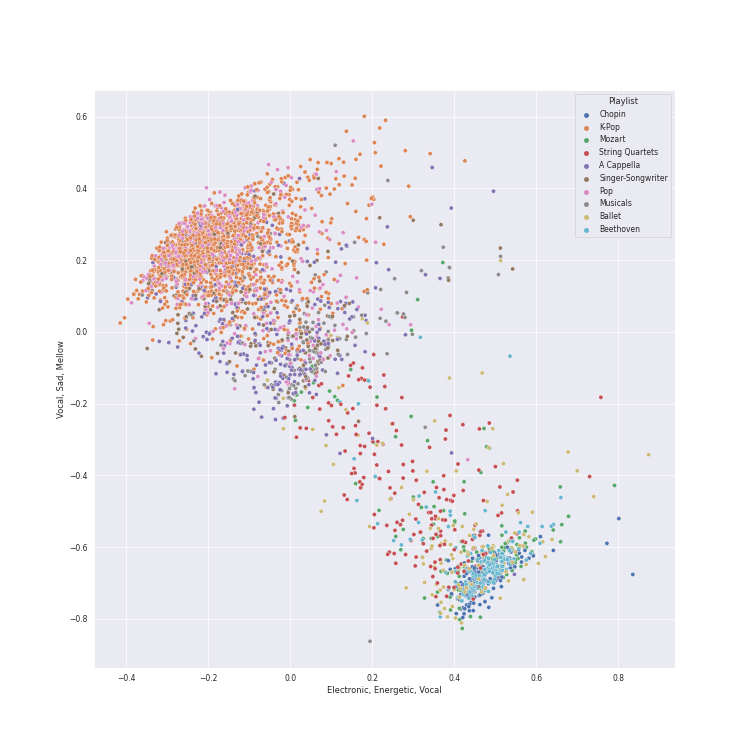
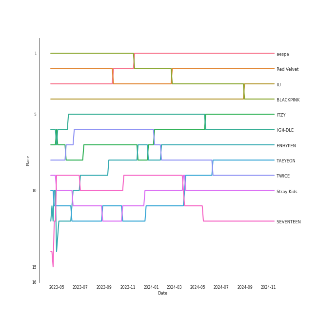
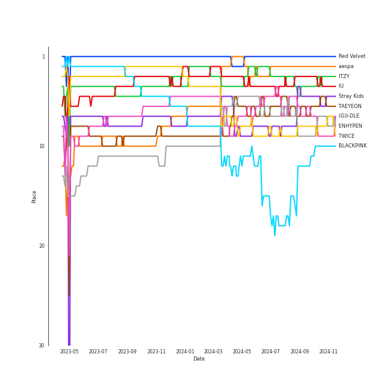
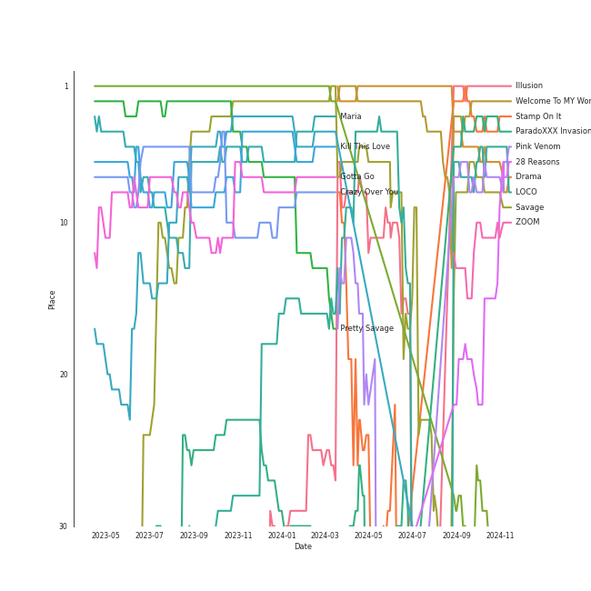

# Spotify Summary for jbrown1618

Generated by [jbrown1618/spotify-stats](https://github.com/jbrown1618/spotify-stats)

[See Track Features](audio_features.md)

[See Clusters](clusters.md)

## Playlists

| Art | Name | Tracks | 💚 | 🔗 |
|:---|:---|---:|---:|:---|
| 💚 | [Liked Tracks](playlists/liked_tracks/overview.md) | 2058 | 2058 | |
|  | [K-Pop](playlists/k-pop/overview.md) | 1377 | 1019 | [🔗](https://open.spotify.com/playlist/0Xp2gQ9p4VMgt5HauIfIq7) |
|  | [Pop](playlists/pop/overview.md) | 441 | 321 | [🔗](https://open.spotify.com/playlist/1WZ2RqQv2SPX5uzmjWhgSh) |
|  | [K-Pop Favorites](playlists/k-pop_favorites/overview.md) | 311 | 311 | [🔗](https://open.spotify.com/playlist/1ZbxKv1noxwZ4zFgRNEFIo) |
|  | [Workout](playlists/workout/overview.md) | 237 | 224 | [🔗](https://open.spotify.com/playlist/3NYClOhoC6ZSipLJBTsZfO) |
|  | [Summer](playlists/summer/overview.md) | 229 | 216 | [🔗](https://open.spotify.com/playlist/0Xy9zMj8Yow1mGIrqd8nON) |
|  | [A-Pop Favorites](playlists/a-pop_favorites/overview.md) | 205 | 205 | [🔗](https://open.spotify.com/playlist/7hmRwiUOGV2mmgqXmsjqL2) |
|  | [Chill](playlists/chill/overview.md) | 239 | 192 | [🔗](https://open.spotify.com/playlist/79HDmDfCjzdHS3oWXdgHGb) |
|  | [Singer-Songwriter](playlists/singer-songwriter/overview.md) | 272 | 179 | [🔗](https://open.spotify.com/playlist/3aNr3GFiAvm1utXDyFOpAR) |
|  | [Alt-Pop](playlists/alt-pop/overview.md) | 203 | 147 | [🔗](https://open.spotify.com/playlist/4DgMab6SK9pnl6P05fw2YI) |

View all

| Art | Name | Tracks | 💚 | 🔗 |
|:---|:---|---:|---:|:---|
|  | [K-Pop-Adjacent](playlists/k-pop-adjacent/overview.md) | 142 | 107 | [🔗](https://open.spotify.com/playlist/5dr8e1QSb4e5pnMwT79MGd) |
|  | [Halloween](playlists/halloween/overview.md) | 115 | 100 | [🔗](https://open.spotify.com/playlist/6Kh7qnaefCcgcBdJJryJKp) |
|  | [Your Top Songs 2022](playlists/your_top_songs_2022/overview.md) | 101 | 100 | [🔗](https://open.spotify.com/playlist/37i9dQZF1F0sijgNaJdgit) |
|  | [Your Top Songs 2023](playlists/your_top_songs_2023/overview.md) | 100 | 98 | [🔗](https://open.spotify.com/playlist/37i9dQZF1Fa1IIVtEpGUcU) |
|  | [Modern Rock](playlists/modern_rock/overview.md) | 146 | 89 | [🔗](https://open.spotify.com/playlist/1PjJceUCPGCW1uMWAs5dMe) |
|  | [R&B](playlists/r_b/overview.md) | 118 | 88 | [🔗](https://open.spotify.com/playlist/1RsGeysyOdV3wZHqlto0Gb) |
|  | [International Pop](playlists/international_pop/overview.md) | 139 | 79 | [🔗](https://open.spotify.com/playlist/36OHPiYrLGYMfVa0zcHgLf) |
|  | [Recent Comebacks](playlists/recent_comebacks/overview.md) | 83 | 74 | [🔗](https://open.spotify.com/playlist/2UAy7fw8nOjoJvFsNZtjbI) |
|  | [Classic Rock](playlists/classic_rock/overview.md) | 117 | 71 | [🔗](https://open.spotify.com/playlist/5z6MnUYwnqrMcdd9b14Cc7) |
|  | [Karaoke](playlists/karaoke/overview.md) | 66 | 61 | [🔗](https://open.spotify.com/playlist/784bxrrG3W6L0naOkaCL5F) |
|  | [Relax](playlists/relax/overview.md) | 60 | 58 | [🔗](https://open.spotify.com/playlist/4rnlD7JdUQNdPCBhL69dCg) |
|  | [Sharon RPD](playlists/sharon_rpd/overview.md) | 72 | 56 | [🔗](https://open.spotify.com/playlist/2WsAAjnlcRAzyPrBDvMYyy) |
|  | [Recommendations for Jeff](playlists/recommendations_for_jeff/overview.md) | 53 | 53 | [🔗](https://open.spotify.com/playlist/5Liek0UOC5GmdOjxdWhcob) |
|  | [Tarps](playlists/tarps/overview.md) | 69 | 52 | [🔗](https://open.spotify.com/playlist/7i18RgdYPOv5E01eGmtRCo) |
|  | [Recommendations for Chris](playlists/recommendations_for_chris/overview.md) | 52 | 52 | [🔗](https://open.spotify.com/playlist/6atwS5eWP6rLUWSuDkuMd8) |
|  | [A Cappella](playlists/a_cappella/overview.md) | 319 | 48 | [🔗](https://open.spotify.com/playlist/7LQjtpZ8EZ5vWXgPoovFeC) |
|  | [K-Pop 101](playlists/k-pop_101/overview.md) | 49 | 45 | [🔗](https://open.spotify.com/playlist/1NlCn9vDmQDBF54JyVC2MC) |
|  | [Not K-Pop](playlists/not_k-pop/overview.md) | 58 | 41 | [🔗](https://open.spotify.com/playlist/5ELtUGtTCv5PkLW7qFcEuk) |
|  | [Funk](playlists/funk/overview.md) | 53 | 37 | [🔗](https://open.spotify.com/playlist/0SL2KHDmNlkSmEgOBPeJCJ) |
|  | [누구?](playlists/누구_/overview.md) | 67 | 36 | [🔗](https://open.spotify.com/playlist/4JrgU3rcLuATwzM1jVVgyC) |
|  | [Classic Pop](playlists/classic_pop/overview.md) | 63 | 36 | [🔗](https://open.spotify.com/playlist/6oXUc88JlAQTNdKvn529pD) |
|  | [애교！](playlists/애교！/overview.md) | 47 | 36 | [🔗](https://open.spotify.com/playlist/6WTiB2kj3G2g3eYqornNd2) |
|  | [Retro Kpop](playlists/retro_kpop/overview.md) | 36 | 34 | [🔗](https://open.spotify.com/playlist/1MW4AAPq55U0XWvSeu1jU5) |
|  | [Jazz](playlists/jazz/overview.md) | 100 | 29 | [🔗](https://open.spotify.com/playlist/58yLhLYn4iDQPCN53MfiDI) |
|  | [Hip Hop](playlists/hip_hop/overview.md) | 51 | 29 | [🔗](https://open.spotify.com/playlist/7trD87dfibqZnzSIqufO75) |
|  | [Repeat Rewind](playlists/repeat_rewind/overview.md) | 30 | 29 | [🔗](https://open.spotify.com/playlist/37i9dQZF1EpOIeFxMXFVG6) |
|  | [On Repeat](playlists/on_repeat/overview.md) | 30 | 29 | [🔗](https://open.spotify.com/playlist/37i9dQZF1EpoN98LF1Ruyl) |
|  | [K-OST](playlists/k-ost/overview.md) | 34 | 25 | [🔗](https://open.spotify.com/playlist/6rOVckcfZ6oCN6seCH4GWr) |
|  | [Classical Samples](playlists/classical_samples/overview.md) | 27 | 23 | [🔗](https://open.spotify.com/playlist/6Pp6fPWxumAQQLVE68SVtY) |
|  | [Country/Folk](playlists/country_folk/overview.md) | 41 | 22 | [🔗](https://open.spotify.com/playlist/6M7uIRzByJjX0q7wGcujJo) |
|  | [K-Memes](playlists/k-memes/overview.md) | 46 | 21 | [🔗](https://open.spotify.com/playlist/3tRZYaAFqIagumJLpKXUp9) |
|  | [Beat Drop!](playlists/beat_drop!/overview.md) | 19 | 15 | [🔗](https://open.spotify.com/playlist/2CV3LAEvICWmWq3SEJw1my) |
|  | [Electronic](playlists/electronic/overview.md) | 16 | 11 | [🔗](https://open.spotify.com/playlist/3cWXIQgqhOUB6slIr3oglt) |
|  | [Christmas](playlists/christmas/overview.md) | 101 | 8 | [🔗](https://open.spotify.com/playlist/7fuGiFfUaZPvDH5eSyfMr8) |
|  | [Musicals](playlists/musicals/overview.md) | 121 | 5 | [🔗](https://open.spotify.com/playlist/54LRPekls9oCtaWOnmM3N0) |
|  | [Soundtracks](playlists/soundtracks/overview.md) | 83 | 5 | [🔗](https://open.spotify.com/playlist/4KUbAosEwUeOuYQ4gRIxCA) |
|  | [Disney](playlists/disney/overview.md) | 69 | 1 | [🔗](https://open.spotify.com/playlist/6OHUelObHhiWFkbH4cwFMg) |
|  | [Cursed English](playlists/cursed_english/overview.md) | 33 | 1 | [🔗](https://open.spotify.com/playlist/2tPCDZMU74TGOBGdNdVDBs) |
|  | [String Quartets](playlists/string_quartets/overview.md) | 179 | 0 | [🔗](https://open.spotify.com/playlist/6b3mJeJjM9S5XAIS8jcTAt) |
|  | [Chopin](playlists/chopin/overview.md) | 172 | 0 | [🔗](https://open.spotify.com/playlist/630IicjdF4RLyaOqIXm0jm) |
|  | [Beethoven](playlists/beethoven/overview.md) | 166 | 0 | [🔗](https://open.spotify.com/playlist/6Lvj5MXaiMrmyaBnvLvxAW) |
|  | [Mozart](playlists/mozart/overview.md) | 148 | 0 | [🔗](https://open.spotify.com/playlist/2MCvxVYbyzdWBgpnuRWsuM) |
|  | [Ballet](playlists/ballet/overview.md) | 138 | 0 | [🔗](https://open.spotify.com/playlist/23temGx5UrTk2wboAvEb0v) |
|  | [Choral](playlists/choral/overview.md) | 69 | 0 | [🔗](https://open.spotify.com/playlist/1PCfeawsTHOhi6DGzagL7Y) |
|  | [Bach](playlists/bach/overview.md) | 55 | 0 | [🔗](https://open.spotify.com/playlist/2fkIDMzy3H9JWLKHnULX7s) |
|  | [Program Music](playlists/program_music/overview.md) | 41 | 0 | [🔗](https://open.spotify.com/playlist/1PyrZgdZpE6UzIA3lANOlR) |
|  | [Vivaldi](playlists/vivaldi/overview.md) | 34 | 0 | [🔗](https://open.spotify.com/playlist/39dOiLs9ZbssQvs9xLBRzw) |
|  | [Brahms](playlists/brahms/overview.md) | 32 | 0 | [🔗](https://open.spotify.com/playlist/7MnYdeDrgvc9PoWHqcGVeq) |
|  | [Rachmaninov](playlists/rachmaninov/overview.md) | 27 | 0 | [🔗](https://open.spotify.com/playlist/7LeSS5dq68CWVIOy81oza1) |
|  | [Debussy](playlists/debussy/overview.md) | 23 | 0 | [🔗](https://open.spotify.com/playlist/3bJkc96LYMneTHBCS80BAl) |

## Artists

### Top artists of all time

| Art | Rank | Tracks | 💚 | Artist | 🔗 |
|:---|---:|---:|---:|:---|:---|
|  | 1 | 49 | 39 | [aespa](artists/aespa/overview.md) | [🔗](https://open.spotify.com/artist/6YVMFz59CuY7ngCxTxjpxE) |
|  | 2 | 83 | 64 | [Red Velvet](artists/red_velvet/overview.md) | [🔗](https://open.spotify.com/artist/1z4g3DjTBBZKhvAroFlhOM) |
|  | 3 | 32 | 23 | [BLACKPINK](artists/blackpink/overview.md) | [🔗](https://open.spotify.com/artist/41MozSoPIsD1dJM0CLPjZF) |
|  | 4 | 46 | 38 | [IU](artists/iu/overview.md) | [🔗](https://open.spotify.com/artist/3HqSLMAZ3g3d5poNaI7GOU) |
|  | 5 | 52 | 30 | [ITZY](artists/itzy/overview.md) | [🔗](https://open.spotify.com/artist/2KC9Qb60EaY0kW4eH68vr3) |
|  | 6 | 49 | 33 | [(G)I-DLE](artists/(g)i-dle/overview.md) | [🔗](https://open.spotify.com/artist/2AfmfGFbe0A0WsTYm0SDTx) |
|  | 7 | 47 | 36 | [ENHYPEN](artists/enhypen/overview.md) | [🔗](https://open.spotify.com/artist/5t5FqBwTcgKTaWmfEbwQY9) |
|  | 8 | 43 | 29 | [TAEYEON](artists/taeyeon/overview.md) | [🔗](https://open.spotify.com/artist/3qNVuliS40BLgXGxhdBdqu) |
|  | 9 | 55 | 35 | [TWICE](artists/twice/overview.md) | [🔗](https://open.spotify.com/artist/7n2Ycct7Beij7Dj7meI4X0) |
|  | 10 | 57 | 29 | [Stray Kids](artists/stray_kids/overview.md) | [🔗](https://open.spotify.com/artist/2dIgFjalVxs4ThymZ67YCE) |

See top 100 artists

| Art | Rank | Tracks | 💚 | Artist | 🔗 |
|:---|---:|---:|---:|:---|:---|
|  | 11 | 23 | 19 | [LeeHi](artists/leehi/overview.md) | [🔗](https://open.spotify.com/artist/7cVZApDoQZpS447nHTsNqu) |
|  | 12 | 24 | 14 | [SEVENTEEN](artists/seventeen/overview.md) | [🔗](https://open.spotify.com/artist/7nqOGRxlXj7N2JYbgNEjYH) |
|  | 13 | 19 | 15 | [MAMAMOO](artists/mamamoo/overview.md) | [🔗](https://open.spotify.com/artist/0XATRDCYuuGhk0oE7C0o5G) |
|  | 14 | 22 | 15 | [CHUNG HA](artists/chung_ha/overview.md) | [🔗](https://open.spotify.com/artist/2PSJ6YriU7JsFucxACpU7Y) |
|  | 15 | 19 | 14 | [LE SSERAFIM](artists/le_sserafim/overview.md) | [🔗](https://open.spotify.com/artist/4SpbR6yFEvexJuaBpgAU5p) |
|  | 16 | 22 | 16 | [STAYC](artists/stayc/overview.md) | [🔗](https://open.spotify.com/artist/01XYiBYaoMJcNhPokrg0l0) |
|  | 17 | 16 | 14 | [IVE](artists/ive/overview.md) | [🔗](https://open.spotify.com/artist/6RHTUrRF63xao58xh9FXYJ) |
|  | 18 | 22 | 13 | [Girls' Generation](artists/girls__generation/overview.md) | [🔗](https://open.spotify.com/artist/0Sadg1vgvaPqGTOjxu0N6c) |
|  | 19 | 71 | 41 | [Taylor Swift](artists/taylor_swift/overview.md) | [🔗](https://open.spotify.com/artist/06HL4z0CvFAxyc27GXpf02) |
|  | 20 | 14 | 8 | [EXO](artists/exo/overview.md) | [🔗](https://open.spotify.com/artist/3cjEqqelV9zb4BYE3qDQ4O) |
|  | 21 | 15 | 11 | [Billlie](artists/billlie/overview.md) | [🔗](https://open.spotify.com/artist/2GQxKDojobwBjZMPf7aoh0) |
|  | 22 | 15 | 11 | [NMIXX](artists/nmixx/overview.md) | [🔗](https://open.spotify.com/artist/28ot3wh4oNmoFOdVajibBl) |
|  | 23 | 16 | 13 | [NewJeans](artists/newjeans/overview.md) | [🔗](https://open.spotify.com/artist/6HvZYsbFfjnjFrWF950C9d) |
|  | 24 | 14 | 10 | [NCT DREAM](artists/nct_dream/overview.md) | [🔗](https://open.spotify.com/artist/1gBUSTR3TyDdTVFIaQnc02) |
|  | 25 | 66 | 44 | [Sara Bareilles](artists/sara_bareilles/overview.md) | [🔗](https://open.spotify.com/artist/2Sqr0DXoaYABbjBo9HaMkM) |
|  | 26 | 10 | 9 | [JEON SOYEON](artists/jeon_soyeon/overview.md) | [🔗](https://open.spotify.com/artist/6Xg22wJOAcnvPUfk5WvODH) |
|  | 27 | 37 | 24 | [BTS](artists/bts/overview.md) | [🔗](https://open.spotify.com/artist/3Nrfpe0tUJi4K4DXYWgMUX) |
|  | 28 | 19 | 13 | [WENDY](artists/wendy/overview.md) | [🔗](https://open.spotify.com/artist/0FRUZvZNPzM3YJMABJxf2K) |
|  | 29 | 18 | 13 | [Dreamcatcher](artists/dreamcatcher/overview.md) | [🔗](https://open.spotify.com/artist/5V1qsQHdXNm4ZEZHWvFnqQ) |
|  | 30 | 16 | 10 | [NCT 127](artists/nct_127/overview.md) | [🔗](https://open.spotify.com/artist/7f4ignuCJhLXfZ9giKT7rH) |
|  | 31 | 7 | 7 | [GOT the beat](artists/got_the_beat/overview.md) | [🔗](https://open.spotify.com/artist/6uNxlIP5lzPFf0BHuELOuX) |
|  | 32 | 17 | 10 | [BoA](artists/boa/overview.md) | [🔗](https://open.spotify.com/artist/4muJrGMndyYWqZtfk8OWy4) |
|  | 33 | 43 | 16 | [Pentatonix](artists/pentatonix/overview.md) | [🔗](https://open.spotify.com/artist/26AHtbjWKiwYzsoGoUZq53) |
|  | 34 | 36 | 22 | [Ariana Grande](artists/ariana_grande/overview.md) | [🔗](https://open.spotify.com/artist/66CXWjxzNUsdJxJ2JdwvnR) |
|  | 35 | 10 | 4 | [SEULGI](artists/seulgi/overview.md) | [🔗](https://open.spotify.com/artist/2QM5S4yO6xHgnNvF0nbZZq) |
|  | 36 | 13 | 8 | [HEIZE](artists/heize/overview.md) | [🔗](https://open.spotify.com/artist/5dCvSnVduaFleCnyy98JMo) |
|  | 37 | 10 | 10 | [EVERGLOW](artists/everglow/overview.md) | [🔗](https://open.spotify.com/artist/3ZZzT0naD25RhY2uZvIKkJ) |
|  | 38 | 28 | 20 | [Jacob Collier](artists/jacob_collier/overview.md) | [🔗](https://open.spotify.com/artist/0QWrMNukfcVOmgEU0FEDyD) |
|  | 39 | 4 | 4 | MISAMO | [🔗](https://open.spotify.com/artist/0IwZVmMMGE7nNXS7vN9SIo) |
|  | 40 | 12 | 11 | [SUNMI](artists/sunmi/overview.md) | [🔗](https://open.spotify.com/artist/6MoXcK2GyGg7FIyxPU5yW6) |
|  | 41 | 20 | 17 | [Billie Eilish](artists/billie_eilish/overview.md) | [🔗](https://open.spotify.com/artist/6qqNVTkY8uBg9cP3Jd7DAH) |
|  | 42 | 11 | 6 | [ATEEZ](artists/ateez/overview.md) | [🔗](https://open.spotify.com/artist/68KmkJeZGfwe1OUaivBa2L) |
|  | 43 | 41 | 29 | [The Tarpeggios](artists/the_tarpeggios/overview.md) | [🔗](https://open.spotify.com/artist/2HXd5pFHJyaQJr5aXfErrE) |
|  | 44 | 6 | 5 | [TEN](artists/ten/overview.md) | [🔗](https://open.spotify.com/artist/3Q5Qep7ytrjVleNnMnntgQ) |
|  | 45 | 11 | 7 | [HWASA](artists/hwasa/overview.md) | [🔗](https://open.spotify.com/artist/7bmYpVgQub656uNTu6qGNQ) |
|  | 46 | 28 | 0 | Howard Shore | [🔗](https://open.spotify.com/artist/0OcclcP5o8VKH2TRqSY2A7) |
|  | 47 | 11 | 8 | [KISS OF LIFE](artists/kiss_of_life/overview.md) | [🔗](https://open.spotify.com/artist/4TEK9tIkcoxib4GxT3O4ky) |
|  | 48 | 17 | 15 | [Radiohead](artists/radiohead/overview.md) | [🔗](https://open.spotify.com/artist/4Z8W4fKeB5YxbusRsdQVPb) |
|  | 49 | 2 | 1 | nævis | [🔗](https://open.spotify.com/artist/2067CjQ2nC56cRZX8goeHg) |
|  | 50 | 2 | 2 | JOY | [🔗](https://open.spotify.com/artist/0sYpJ0nCC8AlDrZFeAA7ub) |
|  | 51 | 16 | 11 | [Queen](artists/queen/overview.md) | [🔗](https://open.spotify.com/artist/1dfeR4HaWDbWqFHLkxsg1d) |
|  | 52 | 13 | 10 | [BAEKHYUN](artists/baekhyun/overview.md) | [🔗](https://open.spotify.com/artist/4ufh0WuMZh6y4Dmdnklvdl) |
|  | 53 | 26 | 21 | [Billy Joel](artists/billy_joel/overview.md) | [🔗](https://open.spotify.com/artist/6zFYqv1mOsgBRQbae3JJ9e) |
|  | 54 | 9 | 7 | [BABYMETAL](artists/babymetal/overview.md) | [🔗](https://open.spotify.com/artist/630wzNP2OL7fl4Xl0GnMWq) |
|  | 55 | 1 | 1 | Loopy | [🔗](https://open.spotify.com/artist/3l9s67pOK4Stw9yW1wr0Bg) |
|  | 56 | 7 | 3 | HYO | [🔗](https://open.spotify.com/artist/3U7bOaJLuFkrmDQ1C1OqKl) |
|  | 57 | 5 | 3 | TAEYANG | [🔗](https://open.spotify.com/artist/6udveWUgX4vu75FF0DTrXV) |
|  | 58 | 10 | 8 | [PURPLE KISS](artists/purple_kiss/overview.md) | [🔗](https://open.spotify.com/artist/62T5PGHWJ9sxP2SJq20IHq) |
|  | 59 | 3 | 2 | G-DRAGON | [🔗](https://open.spotify.com/artist/30b9WulBM8sFuBo17nNq9c) |
|  | 60 | 8 | 5 | [CLC](artists/clc/overview.md) | [🔗](https://open.spotify.com/artist/6QyO41KctzGc70mVaVnXQO) |
|  | 61 | 32 | 23 | [The Beatles](artists/the_beatles/overview.md) | [🔗](https://open.spotify.com/artist/3WrFJ7ztbogyGnTHbHJFl2) |
|  | 62 | 4 | 3 | 2NE1 | [🔗](https://open.spotify.com/artist/1l0mKo96Jh9HVYONcRl3Yp) |
|  | 63 | 1 | 1 | BSS | [🔗](https://open.spotify.com/artist/1uAT5bTSp6dWbNmixIUP5t) |
|  | 64 | 4 | 4 | Lee Young Ji | [🔗](https://open.spotify.com/artist/0Y2AcMPMpeuPXtPQGVvRBq) |
|  | 65 | 8 | 6 | [Solar](artists/solar/overview.md) | [🔗](https://open.spotify.com/artist/5cYcI546S8Lf97m4mNdYLD) |
|  | 66 | 11 | 11 | [AKMU](artists/akmu/overview.md) | [🔗](https://open.spotify.com/artist/6OwKE9Ez6ALxpTaKcT5ayv) |
|  | 67 | 11 | 8 | [PENTAGON](artists/pentagon/overview.md) | [🔗](https://open.spotify.com/artist/1wKpMkucynaTfG8lyPprYV) |
|  | 68 | 5 | 4 | JEON SOMI | [🔗](https://open.spotify.com/artist/7zYj9S9SdIunYCfSm7vzAR) |
|  | 69 | 8 | 6 | [WINTER](artists/winter/overview.md) | [🔗](https://open.spotify.com/artist/3mPquBmMu97Iq9TpzQ6ayI) |
|  | 70 | 17 | 15 | [BIBI](artists/bibi/overview.md) | [🔗](https://open.spotify.com/artist/6UbmqUEgjLA6jAcXwbM1Z9) |
|  | 71 | 5 | 4 | JIHYO | [🔗](https://open.spotify.com/artist/7F1iAHRYxR3MY7yAEuFqgL) |
|  | 72 | 8 | 6 | [TREASURE](artists/treasure/overview.md) | [🔗](https://open.spotify.com/artist/3KonOYiLsU53m4yT7gNotP) |
|  | 73 | 9 | 4 | TAEMIN | [🔗](https://open.spotify.com/artist/13rF01aOogvnkuQXOlgTW8) |
|  | 74 | 8 | 6 | [Jackson Wang](artists/jackson_wang/overview.md) | [🔗](https://open.spotify.com/artist/1kfWoWgCugPkyxQP8lkRlY) |
|  | 75 | 3 | 2 | Ciara | [🔗](https://open.spotify.com/artist/2NdeV5rLm47xAvogXrYhJX) |
|  | 76 | 1 | 1 | Suzy | [🔗](https://open.spotify.com/artist/4U80LJd8sG6U9YTFP5izka) |
|  | 77 | 11 | 9 | [YOASOBI](artists/yoasobi/overview.md) | [🔗](https://open.spotify.com/artist/64tJ2EAv1R6UaZqc4iOCyj) |
|  | 78 | 16 | 14 | [Florence + The Machine](artists/florence_+_the_machine/overview.md) | [🔗](https://open.spotify.com/artist/1moxjboGR7GNWYIMWsRjgG) |
|  | 79 | 4 | 3 | AILEE | [🔗](https://open.spotify.com/artist/3uGFTJ7JMllvhgGpumieHF) |
|  | 80 | 3 | 2 | NINGNING | [🔗](https://open.spotify.com/artist/5t1uryofgueHrjrryqX8vM) |
|  | 81 | 1 | 1 | LIZ (IVE) | [🔗](https://open.spotify.com/artist/2Cl2zS9nttS8xQeCp7zYT1) |
|  | 82 | 5 | 3 | Wonder Girls | [🔗](https://open.spotify.com/artist/3Cv2vi3WTl8VZOTdrBkKdM) |
|  | 83 | 7 | 6 | [SUPER JUNIOR](artists/super_junior/overview.md) | [🔗](https://open.spotify.com/artist/6gzXCdfYfFe5XKhPKkYqxV) |
|  | 84 | 14 | 8 | [Dua Lipa](artists/dua_lipa/overview.md) | [🔗](https://open.spotify.com/artist/6M2wZ9GZgrQXHCFfjv46we) |
|  | 85 | 3 | 3 | BABYMONSTER | [🔗](https://open.spotify.com/artist/1SIocsqdEefUTE6XKGUiVS) |
|  | 86 | 7 | 6 | [YUQI](artists/yuqi/overview.md) | [🔗](https://open.spotify.com/artist/22aCD8IrQZjcPgZw728QT6) |
|  | 87 | 9 | 5 | [Agust D](artists/agust_d/overview.md) | [🔗](https://open.spotify.com/artist/5RmQ8k4l3HZ8JoPb4mNsML) |
|  | 88 | 6 | 4 | RIIZE | [🔗](https://open.spotify.com/artist/2jOm3cYujQx6o1dxuiuqaX) |
|  | 89 | 18 | 11 | [Kimbra](artists/kimbra/overview.md) | [🔗](https://open.spotify.com/artist/6hk7Yq1DU9QcCCrz9uc0Ti) |
|  | 90 | 1 | 1 | WayV-TEN&YANGYANG | [🔗](https://open.spotify.com/artist/4wOAdZOMOVSwrZQxDYrUx3) |
|  | 91 | 8 | 6 | [OH MY GIRL](artists/oh_my_girl/overview.md) | [🔗](https://open.spotify.com/artist/2019zR22qK2RBvCqtudBaI) |
|  | 92 | 16 | 12 | [Bruno Mars](artists/bruno_mars/overview.md) | [🔗](https://open.spotify.com/artist/0du5cEVh5yTK9QJze8zA0C) |
|  | 93 | 17 | 5 | [Michael Bublé](artists/michael_bublé/overview.md) | [🔗](https://open.spotify.com/artist/1GxkXlMwML1oSg5eLPiAz3) |
|  | 94 | 3 | 3 | MAX CHANGMIN | [🔗](https://open.spotify.com/artist/7FiAkNWMb6ZBYI8tbQLuIS) |
|  | 95 | 6 | 0 | Javier Navarrete | [🔗](https://open.spotify.com/artist/6Ayc7FBYR3HjkGQb7SZrzQ) |
|  | 96 | 7 | 5 | [LOONA](artists/loona/overview.md) | [🔗](https://open.spotify.com/artist/52zMTJCKluDlFwMQWmccY7) |
|  | 97 | 1 | 1 | BANG YEDAM | [🔗](https://open.spotify.com/artist/1slszTGbkp1uNnI6G5uD0X) |
|  | 98 | 2 | 2 | Red Velvet - IRENE & SEULGI | [🔗](https://open.spotify.com/artist/6bwp9ObI8FWvMPCIWVBmhl) |
|  | 99 | 9 | 6 | [SHINee](artists/shinee/overview.md) | [🔗](https://open.spotify.com/artist/2hRQKC0gqlZGPrmUKbcchR) |
|  | 100 | 4 | 3 | Christopher | [🔗](https://open.spotify.com/artist/3zDRCqOhJXJfS2YWOEwGMC) |

Top artists of the last month, last 6 months, and last year

| Place | ​ | Last month | ​​ | Last 6 months | ​​​ | Last year |
|---:|:---|:---|:---|:---|:---|:---|
| 1 |  | [ENHYPEN](artists/enhypen/overview.md) |  | [aespa](artists/aespa/overview.md) |  | [Red Velvet](artists/red_velvet/overview.md) |
| 2 |  | [aespa](artists/aespa/overview.md) |  | [Red Velvet](artists/red_velvet/overview.md) |  | [aespa](artists/aespa/overview.md) |
| 3 |  | [Red Velvet](artists/red_velvet/overview.md) |  | [IU](artists/iu/overview.md) |  | [ITZY](artists/itzy/overview.md) |
| 4 |  | [TAEYEON](artists/taeyeon/overview.md) |  | [TAEYEON](artists/taeyeon/overview.md) |  | [IU](artists/iu/overview.md) |
| 5 |  | [ITZY](artists/itzy/overview.md) |  | [ENHYPEN](artists/enhypen/overview.md) |  | [ENHYPEN](artists/enhypen/overview.md) |
| 6 |  | [IU](artists/iu/overview.md) |  | [(G)I-DLE](artists/(g)i-dle/overview.md) |  | [TAEYEON](artists/taeyeon/overview.md) |
| 7 |  | [(G)I-DLE](artists/(g)i-dle/overview.md) |  | [TWICE](artists/twice/overview.md) |  | [(G)I-DLE](artists/(g)i-dle/overview.md) |
| 8 |  | [Stray Kids](artists/stray_kids/overview.md) |  | [ITZY](artists/itzy/overview.md) |  | [Stray Kids](artists/stray_kids/overview.md) |
| 9 |  | [CHUNG HA](artists/chung_ha/overview.md) |  | [Stray Kids](artists/stray_kids/overview.md) |  | [TWICE](artists/twice/overview.md) |
| 10 |  | [NewJeans](artists/newjeans/overview.md) |  | [Sara Bareilles](artists/sara_bareilles/overview.md) |  | [Sara Bareilles](artists/sara_bareilles/overview.md) |
| 11 |  | [TWICE](artists/twice/overview.md) |  | Howard Shore |  | [Taylor Swift](artists/taylor_swift/overview.md) |
| 12 |  | [STAYC](artists/stayc/overview.md) |  | [LE SSERAFIM](artists/le_sserafim/overview.md) |  | [STAYC](artists/stayc/overview.md) |
| 13 |  | [LE SSERAFIM](artists/le_sserafim/overview.md) |  | [IVE](artists/ive/overview.md) |  | [LeeHi](artists/leehi/overview.md) |
| 14 |  | [BLACKPINK](artists/blackpink/overview.md) |  | [NMIXX](artists/nmixx/overview.md) |  | [IVE](artists/ive/overview.md) |
| 15 |  | [MAMAMOO](artists/mamamoo/overview.md) |  | [BLACKPINK](artists/blackpink/overview.md) |  | [LE SSERAFIM](artists/le_sserafim/overview.md) |
| 16 |  | [Sara Bareilles](artists/sara_bareilles/overview.md) |  | [Ariana Grande](artists/ariana_grande/overview.md) |  | [Jacob Collier](artists/jacob_collier/overview.md) |
| 17 |  | [KISS OF LIFE](artists/kiss_of_life/overview.md) |  | [CHUNG HA](artists/chung_ha/overview.md) |  | [BLACKPINK](artists/blackpink/overview.md) |
| 18 |  | [Girls' Generation](artists/girls__generation/overview.md) |  | [STAYC](artists/stayc/overview.md) |  | [NMIXX](artists/nmixx/overview.md) |
| 19 |  | [YUQI](artists/yuqi/overview.md) |  | [KISS OF LIFE](artists/kiss_of_life/overview.md) |  | [SEVENTEEN](artists/seventeen/overview.md) |
| 20 |  | [NMIXX](artists/nmixx/overview.md) |  | [Queen](artists/queen/overview.md) |  | [Dreamcatcher](artists/dreamcatcher/overview.md) |
| 21 |  | [Dreamcatcher](artists/dreamcatcher/overview.md) |  | [WENDY](artists/wendy/overview.md) |  | [KISS OF LIFE](artists/kiss_of_life/overview.md) |
| 22 |  | [Solar](artists/solar/overview.md) |  | [NCT DREAM](artists/nct_dream/overview.md) |  | [CHUNG HA](artists/chung_ha/overview.md) |
| 23 |  | [SUNMI](artists/sunmi/overview.md) |  | [Taylor Swift](artists/taylor_swift/overview.md) |  | Howard Shore |
| 24 |  | [IVE](artists/ive/overview.md) |  | [PURPLE KISS](artists/purple_kiss/overview.md) |  | [Ariana Grande](artists/ariana_grande/overview.md) |
| 25 |  | [LeeHi](artists/leehi/overview.md) |  | [LeeHi](artists/leehi/overview.md) |  | [HEIZE](artists/heize/overview.md) |
| 26 |  | [SEVENTEEN](artists/seventeen/overview.md) |  | [Jacob Collier](artists/jacob_collier/overview.md) |  | [NewJeans](artists/newjeans/overview.md) |
| 27 |  | [Taylor Swift](artists/taylor_swift/overview.md) |  | [TEN](artists/ten/overview.md) |  | [WENDY](artists/wendy/overview.md) |
| 28 |  | [PENTAGON](artists/pentagon/overview.md) |  | [NewJeans](artists/newjeans/overview.md) |  | [NCT DREAM](artists/nct_dream/overview.md) |
| 29 |  | [TEN](artists/ten/overview.md) |  | [The Tarpeggios](artists/the_tarpeggios/overview.md) |  | [Billie Eilish](artists/billie_eilish/overview.md) |
| 30 |  | [LOONA](artists/loona/overview.md) |  | [Dreamcatcher](artists/dreamcatcher/overview.md) |  | [The Tarpeggios](artists/the_tarpeggios/overview.md) |
| 31 |  | TAEMIN |  | [Billy Joel](artists/billy_joel/overview.md) |  | [MAMAMOO](artists/mamamoo/overview.md) |
| 32 |  | [EVERGLOW](artists/everglow/overview.md) |  | [MAMAMOO](artists/mamamoo/overview.md) |  | [Queen](artists/queen/overview.md) |
| 33 |  | [Beyoncé](artists/beyoncé/overview.md) |  | [YUQI](artists/yuqi/overview.md) |  | [PURPLE KISS](artists/purple_kiss/overview.md) |
| 34 |  | [Billie Eilish](artists/billie_eilish/overview.md) |  | Ciara |  | [Billy Joel](artists/billy_joel/overview.md) |
| 35 | | |  | [SEVENTEEN](artists/seventeen/overview.md) |  | [TEN](artists/ten/overview.md) |
| 36 | | |  | [Solar](artists/solar/overview.md) |  | [EXO](artists/exo/overview.md) |
| 37 | | |  | [Girls' Generation](artists/girls__generation/overview.md) |  | [NCT 127](artists/nct_127/overview.md) |
| 38 | | |  | [Billie Eilish](artists/billie_eilish/overview.md) |  | [BoA](artists/boa/overview.md) |
| 39 | | |  | [Radiohead](artists/radiohead/overview.md) |  | [SUNMI](artists/sunmi/overview.md) |
| 40 | | |  | [YOASOBI](artists/yoasobi/overview.md) |  | [YOASOBI](artists/yoasobi/overview.md) |
| 41 | | |  | [Pentatonix](artists/pentatonix/overview.md) |  | [Girls' Generation](artists/girls__generation/overview.md) |
| 42 | | |  | [BTS](artists/bts/overview.md) |  | [Billlie](artists/billlie/overview.md) |
| 43 | | |  | [JEON SOYEON](artists/jeon_soyeon/overview.md) |  | [JEON SOYEON](artists/jeon_soyeon/overview.md) |
| 44 | | |  | RIIZE |  | [BTS](artists/bts/overview.md) |
| 45 | | |  | [EVERGLOW](artists/everglow/overview.md) |  | [PENTAGON](artists/pentagon/overview.md) |
| 46 | | |  | [GOT the beat](artists/got_the_beat/overview.md) |  | [Radiohead](artists/radiohead/overview.md) |
| 47 | | |  | [Florence + The Machine](artists/florence_+_the_machine/overview.md) |  | [Solar](artists/solar/overview.md) |
| 48 | | |  | [BIBI](artists/bibi/overview.md) |  | [YUQI](artists/yuqi/overview.md) |
| 49 | | |  | [NCT 127](artists/nct_127/overview.md) |  | [AKMU](artists/akmu/overview.md) |
| 50 | | |  | [Janelle Monáe](artists/janelle_monáe/overview.md) |  | TAEMIN |

Top artists of the last year over time

Top artists of the last 6 months over time

### Artists by number of liked tracks

## Tracks

### Top Tracks of All Time

| Art | Track | Album | Artists | Label | Rank | 💚 | 🔗 |
|:---|:---|:---|:---|:---|---:|:---|:---|
|  | Savage | Savage - The 1st Mini Album | [aespa](artists/aespa/overview.md) | [SM Entertainment](labels/sm_entertainment) | 1 | 💚 | [🔗](https://open.spotify.com/track/3dbLT62Cvs46Ju7a8gpr36) |
|  | HIP | reality in BLACK | [MAMAMOO](artists/mamamoo/overview.md) | [RBW, Inc](labels/rbw_inc_) | 2 | 💚 | [🔗](https://open.spotify.com/track/24nK8tW7Pt3Inh2utttuoG) |
|  | Next Level | Next Level | [aespa](artists/aespa/overview.md) | [SM Entertainment](labels/sm_entertainment) | 3 | 💚 | [🔗](https://open.spotify.com/track/2zrhoHlFKxFTRF5aMyxMoQ) |
|  | LOCO | CRAZY IN LOVE | [ITZY](artists/itzy/overview.md) | [Republic Records](labels/republic_records) | 4 | 💚 | [🔗](https://open.spotify.com/track/56Yxkm62GtEpnPyG7TvwLY) |
|  | Pretty Savage | THE ALBUM | [BLACKPINK](artists/blackpink/overview.md) | [Interscope Records](labels/interscope_records), [YG Entertainment](labels/yg_entertainment) | 5 | 💚 | [🔗](https://open.spotify.com/track/1XnpzbOGptRwfJhZgLbmSr) |
|  | Drama | Drama - The 4th Mini Album | [aespa](artists/aespa/overview.md) | [SM Entertainment](labels/sm_entertainment), [Warner Records](labels/warner_records) | 6 | 💚 | [🔗](https://open.spotify.com/track/5XWlyfo0kZ8LF7VSyfS4Ew) |
|  | Maria | María | [HWASA](artists/hwasa/overview.md) | [RBW, Inc](labels/rbw_inc_) | 7 | 💚 | [🔗](https://open.spotify.com/track/0ZeGfEAL5Rl4pd5LZBGuEK) |
|  | Kill This Love | KILL THIS LOVE | [BLACKPINK](artists/blackpink/overview.md) | [Interscope Records](labels/interscope_records), [YG Entertainment](labels/yg_entertainment) | 8 | 💚 | [🔗](https://open.spotify.com/track/6hvczQ05jc1yGlp9zhb95V) |
|  | Welcome To MY World (feat. nævis) | MY WORLD - The 3rd Mini Album | [aespa](artists/aespa/overview.md), nævis | [SM Entertainment](labels/sm_entertainment), [Warner Records](labels/warner_records) | 9 | 💚 | [🔗](https://open.spotify.com/track/3q5qpprtugUIEPExuI7tRD) |
|  | HOLO | HOLO | [LeeHi](artists/leehi/overview.md) | [Genie Music Corporation](labels/genie_music_corporation), [Stone Music Entertainment](labels/stone_music_entertainment) | 10 | 💚 | [🔗](https://open.spotify.com/track/4BSluGpjdLQihMmKgHXMxp) |

View top 100 tracks

| Art | Track | Album | Artists | Label | Rank | 💚 | 🔗 |
|:---|:---|:---|:---|:---|---:|:---|:---|
|  | Illusion | Girls - The 2nd Mini Album | [aespa](artists/aespa/overview.md) | [SM Entertainment](labels/sm_entertainment), [Warner Records](labels/warner_records) | 11 | 💚 | [🔗](https://open.spotify.com/track/396FqjKmViUZ92Wmm4rx3i) |
|  | Left & Right | Heng:garæ | [SEVENTEEN](artists/seventeen/overview.md) | [PLEDIS Entertainment](labels/pledis_entertainment) | 12 | 💚 | [🔗](https://open.spotify.com/track/5QGooKayQPVZMUDc8Qt3Dm) |
|  | Crazy Over You | THE ALBUM | [BLACKPINK](artists/blackpink/overview.md) | [Interscope Records](labels/interscope_records), [YG Entertainment](labels/yg_entertainment) | 13 | 💚 | [🔗](https://open.spotify.com/track/7qq0EOPW4RRlqdvMBmdd73) |
|  | How You Like That | THE ALBUM | [BLACKPINK](artists/blackpink/overview.md) | [Interscope Records](labels/interscope_records), [YG Entertainment](labels/yg_entertainment) | 14 | 💚 | [🔗](https://open.spotify.com/track/4SFknyjLcyTLJFPKD2m96o) |
|  | Gotta Go | Gotta Go | [CHUNG HA](artists/chung_ha/overview.md) | [Genie Music Corporation](labels/genie_music_corporation), [Stone Music Entertainment](labels/stone_music_entertainment) | 15 | 💚 | [🔗](https://open.spotify.com/track/1exnDFdC34GyBcaLt9ZJfX) |
|  | Bad Boy | The Perfect Red Velvet - The 2nd Album Repackage | [Red Velvet](artists/red_velvet/overview.md) | [SM Entertainment](labels/sm_entertainment) | 16 | 💚 | [🔗](https://open.spotify.com/track/5GKwq4sO5ZHKuWaDmdwMQc) |
|  | 러시안 룰렛 Russian Roulette | Russian Roulette - The 3rd Mini Album | [Red Velvet](artists/red_velvet/overview.md) | [SM Entertainment](labels/sm_entertainment) | 17 | 💚 | [🔗](https://open.spotify.com/track/5HiSc2ZCGn8L3cH3qSwzBT) |
|  | BEAM BEAM | Windy | [JEON SOYEON](artists/jeon_soyeon/overview.md) | [Universal Music LLC](labels/universal_music_llc) | 18 | 💚 | [🔗](https://open.spotify.com/track/1VjIS4qoyD6JS2rNZQgE00) |
|  | Mr. Vampire | BORN TO BE | [ITZY](artists/itzy/overview.md) | [Republic Records](labels/republic_records) | 19 | 💚 | [🔗](https://open.spotify.com/track/3uI6jqO0fFBoFryc8SJOXw) |
|  | ParadoXXX Invasion | MANIFESTO : DAY 1 | [ENHYPEN](artists/enhypen/overview.md) | [BELIFT LAB](labels/belift_lab) | 20 | 💚 | [🔗](https://open.spotify.com/track/3OC2C8IpFhbUJTeMe55QYn) |
|  | BBIBBI | BBIBBI | [IU](artists/iu/overview.md) | [Kakao Entertainment](labels/kakao_entertainment) | 21 | 💚 | [🔗](https://open.spotify.com/track/4as4XEOR03oGm1STUKl6pa) |
|  | My sea | IU 5th Album 'LILAC' | [IU](artists/iu/overview.md) | [EDAM Entertainment](labels/edam_entertainment) | 22 | 💚 | [🔗](https://open.spotify.com/track/46wDG6evLn2iPoQ0F8CUWk) |
|  | Better Things | Better Things | [aespa](artists/aespa/overview.md) | [SM Entertainment](labels/sm_entertainment), [Warner Records](labels/warner_records) | 23 | 💚 | [🔗](https://open.spotify.com/track/6zZWoHlF2zNSLUNLvx4GUl) |
|  | DESSERT | DESSERT | HYO, Loopy, [JEON SOYEON](artists/jeon_soyeon/overview.md) | [SM Entertainment](labels/sm_entertainment) | 24 | 💚 | [🔗](https://open.spotify.com/track/6u0pZe0Uv7GBR0iKptfWRf) |
|  | I CAN'T STOP ME | Eyes Wide Open | [TWICE](artists/twice/overview.md) | [Republic Records](labels/republic_records) | 25 | 💚 | [🔗](https://open.spotify.com/track/37ZtpRBkHcaq6hHy0X98zn) |
|  | Black Mamba | Black Mamba | [aespa](artists/aespa/overview.md) | [SM Entertainment](labels/sm_entertainment) | 26 | 💚 | [🔗](https://open.spotify.com/track/1t2qYCAjUAoGfeFeoBlK51) |
|  | When This Rain Stops | Like Water - The 1st Mini Album | [WENDY](artists/wendy/overview.md) | [SM Entertainment](labels/sm_entertainment) | 27 | 💚 | [🔗](https://open.spotify.com/track/6mavVLsxaa4YcPje9qZKcf) |
|  | Thunderous | NOEASY | [Stray Kids](artists/stray_kids/overview.md) | [Republic Records](labels/republic_records) | 28 | 💚 | [🔗](https://open.spotify.com/track/0nwTMzpatarzvLvtwwzdCt) |
|  | Trick or Trick | Drama - The 4th Mini Album | [aespa](artists/aespa/overview.md) | [SM Entertainment](labels/sm_entertainment), [Warner Records](labels/warner_records) | 29 | 💚 | [🔗](https://open.spotify.com/track/3EI3OLBeM89B0o0UsIGCOx) |
|  | Spicy | MY WORLD - The 3rd Mini Album | [aespa](artists/aespa/overview.md) | [SM Entertainment](labels/sm_entertainment), [Warner Records](labels/warner_records) | 30 | 💚 | [🔗](https://open.spotify.com/track/1ULdASrNy5rurl1TZfFaMP) |
|  | LATATA | I am | [(G)I-DLE](artists/(g)i-dle/overview.md) | [CUBE ENTERTAINMENT](labels/cube_entertainment) | 31 | 💚 | [🔗](https://open.spotify.com/track/2ezKXygNO30pXyDQXkm6oD) |
|  | Oh my god | I trust | [(G)I-DLE](artists/(g)i-dle/overview.md) | [Universal Music LLC](labels/universal_music_llc) | 32 | 💚 | [🔗](https://open.spotify.com/track/2DmRXiyn03tOqKgEJXlaiJ) |
|  | 무제(無題) (Untitled, 2014) | KWON JI YONG | G-DRAGON | [YG Entertainment](labels/yg_entertainment) | 33 | 💚 | [🔗](https://open.spotify.com/track/16BS342F89MDqouSxgLaUK) |
|  | Dumb Dumb | The Red - The 1st Album | [Red Velvet](artists/red_velvet/overview.md) | [SM Entertainment](labels/sm_entertainment) | 34 | 💚 | [🔗](https://open.spotify.com/track/64iDjAuWDogVhuoWhKklF9) |
|  | Holssi | The Winning | [IU](artists/iu/overview.md) | [EDAM Entertainment](labels/edam_entertainment) | 35 | 💚 | [🔗](https://open.spotify.com/track/0UTtK6hregIBOsefavRI26) |
|  | Hello | Hello - Special Album | JOY | [SM Entertainment](labels/sm_entertainment) | 36 | 💚 | [🔗](https://open.spotify.com/track/3cGp1jXxLReLKz7QgVbWZR) |
|  | Coin | IU 5th Album 'LILAC' | [IU](artists/iu/overview.md) | [EDAM Entertainment](labels/edam_entertainment) | 37 | 💚 | [🔗](https://open.spotify.com/track/7CZRguMolNqIobnXxpV735) |
|  | One Kiss | Chill Kill - The 3rd Album | [Red Velvet](artists/red_velvet/overview.md) | [SM Entertainment](labels/sm_entertainment) | 38 | 💚 | [🔗](https://open.spotify.com/track/4zIPZxvYp32y6ifjm1E30O) |
|  | BOOM | We Boom - The 3rd Mini Album | [NCT DREAM](artists/nct_dream/overview.md) | [SM Entertainment](labels/sm_entertainment) | 39 | 💚 | [🔗](https://open.spotify.com/track/6rcn967QN5JtkPOBDwYIuT) |
|  | Hold On Tight | Hold On Tight | [aespa](artists/aespa/overview.md) | [Parlophone UK](labels/parlophone_uk) | 40 | 💚 | [🔗](https://open.spotify.com/track/1o844wI52S3TjXGBwvGcc7) |
|  | Stamp On It | Stamp On It - The 1st Mini Album | [GOT the beat](artists/got_the_beat/overview.md) | [SM Entertainment](labels/sm_entertainment) | 41 | 💚 | [🔗](https://open.spotify.com/track/0mlxHb4jbPr1PUBUv0WHRS) |
|  | Love Shot | LOVE SHOT– The 5th Album Repackage | [EXO](artists/exo/overview.md) | [SM Entertainment](labels/sm_entertainment) | 42 | 💚 | [🔗](https://open.spotify.com/track/0yB4jrSwN0bFtFRDR5vyMj) |
|  | BORN TO BE | BORN TO BE | [ITZY](artists/itzy/overview.md) | [Republic Records](labels/republic_records) | 43 | 💚 | [🔗](https://open.spotify.com/track/45lXSvtDt6uKiGZIXB4LLF) |
|  | To. X | To. X - The 5th Mini Album | [TAEYEON](artists/taeyeon/overview.md) | [SM Entertainment](labels/sm_entertainment) | 44 | 💚 | [🔗](https://open.spotify.com/track/2gyCwrOcC6JBoaJ8JGJ7T8) |
|  | I Am The Best | I Am The Best | 2NE1 | Capitol Records (CAP) | 45 | 💚 | [🔗](https://open.spotify.com/track/26EM9sZnQkLLQxixGd88KE) |
|  | Fighting (Feat. Lee Young Ji) | BSS 1st Single Album 'SECOND WIND' | BSS, Lee Young Ji | [PLEDIS Entertainment](labels/pledis_entertainment) | 46 | 💚 | [🔗](https://open.spotify.com/track/7eBpUuPnDTfbeP1P4P93CS) |
|  | Sweet Venom | ORANGE BLOOD | [ENHYPEN](artists/enhypen/overview.md) | [BELIFT LAB](labels/belift_lab) | 47 | 💚 | [🔗](https://open.spotify.com/track/2YmfV4lAjrAQvuggKCUX6m) |
|  | Uh-Oh | Uh-Oh | [(G)I-DLE](artists/(g)i-dle/overview.md) | [Universal Music LLC](labels/universal_music_llc) | 48 | 💚 | [🔗](https://open.spotify.com/track/1OBb2wZMXKNmtdyyejLIyL) |
|  | Pink Venom | BORN PINK | [BLACKPINK](artists/blackpink/overview.md) | [Interscope Records](labels/interscope_records), [YG Entertainment](labels/yg_entertainment) | 49 | 💚 | [🔗](https://open.spotify.com/track/6stcJnJHPO8RrYx5LLz5OP) |
|  | Chill Kill | Chill Kill - The 3rd Album | [Red Velvet](artists/red_velvet/overview.md) | [SM Entertainment](labels/sm_entertainment) | 50 | 💚 | [🔗](https://open.spotify.com/track/68gQG2HpRMxIRom4pCugMq) |
|  | LILAC | IU 5th Album 'LILAC' | [IU](artists/iu/overview.md) | [EDAM Entertainment](labels/edam_entertainment) | 51 | 💚 | [🔗](https://open.spotify.com/track/5xrtzzzikpG3BLbo4q1Yul) |
|  | Amusement Park | Amusement Park | [BAEKHYUN](artists/baekhyun/overview.md) | [SM Entertainment](labels/sm_entertainment) | 52 | 💚 | [🔗](https://open.spotify.com/track/1TUkEXQrskATO9SoB4QMUN) |
|  | The Boys | The Boys - The 3rd Album | [Girls' Generation](artists/girls__generation/overview.md) | [SM Entertainment](labels/sm_entertainment) | 53 | 💚 | [🔗](https://open.spotify.com/track/4sRQg2aoec0VIvQ7GZPGMy) |
|  | 7월 7일 One Of These Nights | The Velvet - The 2nd Mini Album | [Red Velvet](artists/red_velvet/overview.md) | [SM Entertainment](labels/sm_entertainment) | 54 | 💚 | [🔗](https://open.spotify.com/track/6koMMQlsRWBwHZXdtWxgUk) |
|  | Ditto | Ditto | [NewJeans](artists/newjeans/overview.md) | [ADOR](labels/ador) | 56 | 💚 | [🔗](https://open.spotify.com/track/3r8RuvgbX9s7ammBn07D3W) |
|  | MEGAVERSE | ROCK-STAR | [Stray Kids](artists/stray_kids/overview.md) | [Republic Records](labels/republic_records) | 57 | 💚 | [🔗](https://open.spotify.com/track/5Q1tv4GTxP3IJeGMOKdrFO) |
|  | Sacrifice (Eat Me Up) | DARK BLOOD | [ENHYPEN](artists/enhypen/overview.md) | [BELIFT LAB](labels/belift_lab) | 58 | 💚 | [🔗](https://open.spotify.com/track/58ItBuVuKc03DvqSeZFnH1) |
|  | Ice Cream Cake | Ice Cream Cake - The 1st Mini Album | [Red Velvet](artists/red_velvet/overview.md) | [SM Entertainment](labels/sm_entertainment) | 59 | 💚 | [🔗](https://open.spotify.com/track/5vCuawHQ8Poch1odz9JDpB) |
|  | Run Devil Run | Run Devil Run - The 2nd Album Repackage | [Girls' Generation](artists/girls__generation/overview.md) | [SM Entertainment](labels/sm_entertainment) | 60 | 💚 | [🔗](https://open.spotify.com/track/0U9jNoTJeTxXToakhsb7pV) |
|  | Dangerous | TEN - The 1st Mini Album | [TEN](artists/ten/overview.md) | [SM Entertainment](labels/sm_entertainment) | 61 | 💚 | [🔗](https://open.spotify.com/track/56vA4AoGec8ae9nmdprBBI) |
|  | 눈,코,입 (Eyes, Nose, Lips) | RISE | TAEYANG | [YG Entertainment](labels/yg_entertainment) | 62 | 💚 | [🔗](https://open.spotify.com/track/0lYtIvI7bO51PZSeK22Mbz) |
|  | Nobody Knows | Born to be XX | [KISS OF LIFE](artists/kiss_of_life/overview.md) | [S2 ENTERTAINMENT INC.](labels/s2_entertainment_inc_) | 63 | 💚 | [🔗](https://open.spotify.com/track/70efTlnBNM8BvfhfPiqOBN) |
|  | ONLY | 4 ONLY | [LeeHi](artists/leehi/overview.md) | [Genie Music Corporation](labels/genie_music_corporation), [Stone Music Entertainment](labels/stone_music_entertainment) | 64 | 💚 | [🔗](https://open.spotify.com/track/6TBJkXHPhu3EsMk1bshwuI) |
|  | I Got Love | My Voice - The 1st Album | [TAEYEON](artists/taeyeon/overview.md) | [SM Entertainment](labels/sm_entertainment) | 65 | 💚 | [🔗](https://open.spotify.com/track/1IgRQvTqj7BKjNWRzjFEE0) |
|  | It's not easy for you | Masterpiece | MISAMO | [WM Japan](labels/wm_japan) | 66 | 💚 | [🔗](https://open.spotify.com/track/1qNk7XPTbyuO4bsDl0T6nN) |
|  | DUMB DUMB | DUMB DUMB | JEON SOMI | [THE BLACK LABEL/Interscope Records](labels/interscope_records) | 67 | 💚 | [🔗](https://open.spotify.com/track/0dnkOK5hGUCmIJ7FDF0yHz) |
|  | The Red Shoes | Modern Times | [IU](artists/iu/overview.md) | [Kakao Entertainment](labels/kakao_entertainment) | 68 | 💚 | [🔗](https://open.spotify.com/track/3atsk5EWI5fNxLMIJnfYfJ) |
|  | DDU-DU DDU-DU | SQUARE UP | [BLACKPINK](artists/blackpink/overview.md) | [Interscope Records](labels/interscope_records), [YG Entertainment](labels/yg_entertainment) | 69 | 💚 | [🔗](https://open.spotify.com/track/4lQsB3ERTWSNaAN1IkuNRl) |
|  | HELICOPTER | HELICOPTER | [CLC](artists/clc/overview.md) | [Universal Music LLC](labels/universal_music_llc) | 70 | 💚 | [🔗](https://open.spotify.com/track/2hJS7BdEaH9Jo8MeJujsHT) |
|  | Behind The Curtain | Masterpiece | MISAMO | [WM Japan](labels/wm_japan) | 71 | 💚 | [🔗](https://open.spotify.com/track/14nturKxV48wR3lbknehiu) |
|  | Thirsty | MY WORLD - The 3rd Mini Album | [aespa](artists/aespa/overview.md) | [SM Entertainment](labels/sm_entertainment), [Warner Records](labels/warner_records) | 72 | 💚 | [🔗](https://open.spotify.com/track/6nICBdDevG4NZysIqDFPEa) |
|  | Nightmare | Chill Kill - The 3rd Album | [Red Velvet](artists/red_velvet/overview.md) | [SM Entertainment](labels/sm_entertainment) | 73 | 💚 | [🔗](https://open.spotify.com/track/0jUDrSASok8h2xUIWe4KOG) |
|  | Dream | Dream | Suzy, [BAEKHYUN](artists/baekhyun/overview.md) | ChoongangICS, MYSTIC Entertainment, [JYP Entertainment](labels/jyp_entertainment), [SM Entertainment](labels/sm_entertainment) | 74 | 💚 | [🔗](https://open.spotify.com/track/3JBnDOUd18QKjDqSYuOfpm) |
|  | Toddler | INVU - The 3rd Album | [TAEYEON](artists/taeyeon/overview.md) | [SM Entertainment](labels/sm_entertainment) | 75 | 💚 | [🔗](https://open.spotify.com/track/73pehvxZUb87PhgyJJpTlw) |
|  | Bubble | TEENFRESH | [STAYC](artists/stayc/overview.md) | [High Up Entertainment](labels/high_up_entertainment) | 76 | 💚 | [🔗](https://open.spotify.com/track/4P5ozkI1bxiGxA5rZ27jlO) |
|  | Adrenaline | VINCENZO (Original Television Soundtrack) Pt. 3 | [Solar](artists/solar/overview.md) | [Genie Music Corporation](labels/genie_music_corporation) | 77 | 💚 | [🔗](https://open.spotify.com/track/6ZQmJVUuXk1Q27d8vkmgm8) |
|  | Jam Jam | Palette | [IU](artists/iu/overview.md) | Fave Entertainment | 78 | 💚 | [🔗](https://open.spotify.com/track/3h7WIL3B6nP3171zl6HWj8) |
|  | Killin’ Me Good | ZONE | JIHYO | Republic Records – JIHYO (TWICE) | 79 | 💚 | [🔗](https://open.spotify.com/track/4Cyf87ul1le0xTWRFBoYd7) |
|  | Armageddon | Armageddon - The 1st Album | [aespa](artists/aespa/overview.md) | [SM Entertainment](labels/sm_entertainment) | 80 | 💚 | [🔗](https://open.spotify.com/track/6i8MbzVn4nzyjUcSoVcz7B) |
|  | Hot Air Balloon | Drama - The 4th Mini Album | [aespa](artists/aespa/overview.md) | [SM Entertainment](labels/sm_entertainment), [Warner Records](labels/warner_records) | 81 | 💚 | [🔗](https://open.spotify.com/track/1mdtLny0zugh89vokWGG80) |
|  | Can't Control Myself | INVU - The 3rd Album | [TAEYEON](artists/taeyeon/overview.md) | [SM Entertainment](labels/sm_entertainment) | 82 | 💚 | [🔗](https://open.spotify.com/track/2TZTpkpnDIKUOfU6riqCfE) |
|  | DASH | Fe3O4: BREAK | [NMIXX](artists/nmixx/overview.md) | [Republic Records](labels/republic_records) | 83 | 💚 | [🔗](https://open.spotify.com/track/2RoYgkPzUY0vY7lhUuyus1) |
|  | Feel My Rhythm | ‘The ReVe Festival 2022 - Feel My Rhythm’ | [Red Velvet](artists/red_velvet/overview.md) | [SM Entertainment](labels/sm_entertainment) | 84 | 💚 | [🔗](https://open.spotify.com/track/2oBMZYteeO8DyXV9gDx6Za) |
|  | Time After Time | 2022 Winter SMTOWN : SMCU PALACE | [BoA](artists/boa/overview.md), [WENDY](artists/wendy/overview.md), NINGNING | [SM Entertainment](labels/sm_entertainment) | 85 | 💚 | [🔗](https://open.spotify.com/track/6LGcOydwjfaquaRgJwlPkK) |
|  | BYE BYE | ‘The ReVe Festival 2022 - Birthday’ | [Red Velvet](artists/red_velvet/overview.md) | [SM Entertainment](labels/sm_entertainment) | 86 | 💚 | [🔗](https://open.spotify.com/track/4OSVR8gq2l3ceJiXNR7iiM) |
|  | Lion Heart | Lion Heart - The 5th Album | [Girls' Generation](artists/girls__generation/overview.md) | [SM Entertainment](labels/sm_entertainment) | 87 | 💚 | [🔗](https://open.spotify.com/track/405SQUJdQut02dxtuQ0CZ3) |
|  | Bills | DARK BLOOD | [ENHYPEN](artists/enhypen/overview.md) | [BELIFT LAB](labels/belift_lab) | 88 | 💚 | [🔗](https://open.spotify.com/track/2nfluhFVrO5OBXPzRWlwlz) |
|  | Cheshire | CHESHIRE | [ITZY](artists/itzy/overview.md) | [Republic Records](labels/republic_records) | 89 | 💚 | [🔗](https://open.spotify.com/track/7ixVW7RobslvMrvlzHYLha) |
|  | RING X RING | the Billage of perception : chapter one | [Billlie](artists/billlie/overview.md) | [MYSTIC STORY](labels/mystic_story) | 90 | 💚 | [🔗](https://open.spotify.com/track/4hfF0FOFcaiOtwY3NP5hnv) |
|  | SET ME FREE | READY TO BE | [TWICE](artists/twice/overview.md) | [Republic Records](labels/republic_records) | 91 | 💚 | [🔗](https://open.spotify.com/track/4OtVQ2ZxS7yigIjGz5yKg1) |
|  | I Want That | HEAT | [(G)I-DLE](artists/(g)i-dle/overview.md) | [88rising Music](labels/88rising_music), [CUBE ENTERTAINMENT](labels/cube_entertainment) | 92 | 💚 | [🔗](https://open.spotify.com/track/3F2BLyGt6zYLrHYpbdTw5L) |
|  | NOBODY | NOBODY | [JEON SOYEON](artists/jeon_soyeon/overview.md), [WINTER](artists/winter/overview.md), LIZ (IVE) | Studio Beyond | 93 | 💚 | [🔗](https://open.spotify.com/track/4loUHO28CuvSbEiZXId1BD) |
|  | Bulldozer | Chill Kill - The 3rd Album | [Red Velvet](artists/red_velvet/overview.md) | [SM Entertainment](labels/sm_entertainment) | 94 | 💚 | [🔗](https://open.spotify.com/track/4Pp6Ql9wV7A6VqHrmjMFv4) |
|  | Soñar (Breaker) | Fe3O4: BREAK | [NMIXX](artists/nmixx/overview.md) | [Republic Records](labels/republic_records) | 95 | 💚 | [🔗](https://open.spotify.com/track/6UwrPxRaR5HPNLDDl7RcT9) |
|  | Super Lady | 2 | [(G)I-DLE](artists/(g)i-dle/overview.md) | [Cube Entertainment](labels/cube_entertainment) | 96 | 💚 | [🔗](https://open.spotify.com/track/5qI5EUqfDJpQ7w6sMECK7U) |
|  | CAKE | KILL MY DOUBT | [ITZY](artists/itzy/overview.md) | [Republic Records](labels/republic_records) | 97 | 💚 | [🔗](https://open.spotify.com/track/3syxwxJqX5jpgjNYmvzdW6) |
|  | Impurities | ANTIFRAGILE | [LE SSERAFIM](artists/le_sserafim/overview.md) | [SOURCE MUSIC](labels/source_music) | 98 | 💚 | [🔗](https://open.spotify.com/track/7F0MuIk5glqtowCUjbn9es) |
|  | HANN (Alone in winter) | I burn | [(G)I-DLE](artists/(g)i-dle/overview.md) | [Universal Music LLC](labels/universal_music_llc) | 99 | 💚 | [🔗](https://open.spotify.com/track/2qYdsdgdeMLFzpLcMQWG2W) |
|  | enchanted night ~ white night | the Billage of perception: chapter three | [Billlie](artists/billlie/overview.md) | [MYSTIC STORY](labels/mystic_story) | 100 | 💚 | [🔗](https://open.spotify.com/track/0rTXn4ovXalJGkJMx5hsnX) |
|  | HOME;RUN | ; [Semicolon] | [SEVENTEEN](artists/seventeen/overview.md) | [PLEDIS Entertainment](labels/pledis_entertainment) | 101 | 💚 | [🔗](https://open.spotify.com/track/2iW0q5jJJT5HKlIs25AAgv) |

Top tracks of the last month, six months, and year

| Place | ​ | On repeat | ​​ | Last month | ​​​ | Last 6 months | ​​​​ | Last year |
|---:|:---|:---|:---|:---|:---|:---|:---|:---|
| 1 |  | [Armageddon](artists/aespa/overview.md) |  | [Jam Jam](artists/iu/overview.md) |  | [Holssi](artists/iu/overview.md) |  | [Drama](artists/aespa/overview.md) |
| 2 |  | [DASH](artists/nmixx/overview.md) |  | [Stamp On It](artists/got_the_beat/overview.md) |  | [Armageddon](artists/aespa/overview.md) |  | [Mr. Vampire](artists/itzy/overview.md) |
| 3 |  | [Fatal Trouble](artists/enhypen/overview.md) |  | [SO BAD](artists/stayc/overview.md) |  | [Mr. Vampire](artists/itzy/overview.md) |  | [Holssi](artists/iu/overview.md) |
| 4 |  | [Heaven](artists/taeyeon/overview.md) |  | [LATATA](artists/(g)i-dle/overview.md) |  | [Dangerous](artists/ten/overview.md) |  | [Welcome To MY World (feat. nævis)](artists/aespa/overview.md) |
| 5 |  | [Supernova](artists/aespa/overview.md) |  | [POPPY - Japanese Ver.](artists/stayc/overview.md) |  | [Drama](artists/aespa/overview.md) |  | [Better Things](artists/aespa/overview.md) |
| 6 |  | [Cosmic](artists/red_velvet/overview.md) |  | Macarena |  | [Mine](artists/aespa/overview.md) |  | [One Kiss](artists/red_velvet/overview.md) |
| 7 |  | [Bicycle](artists/chung_ha/overview.md) |  | I Don't Need You |  | [Soñar (Breaker)](artists/nmixx/overview.md) |  | [Armageddon](artists/aespa/overview.md) |
| 8 |  | [Sweet Venom](artists/enhypen/overview.md) |  | [Hot Sauce](artists/nct_dream/overview.md) |  | [DASH](artists/nmixx/overview.md) |  | It's not easy for you |
| 9 |  | [Midas Touch](artists/kiss_of_life/overview.md) |  | [dlwlrma](artists/iu/overview.md) |  | [BORN TO BE](artists/itzy/overview.md) |  | [To. X](artists/taeyeon/overview.md) |
| 10 |  | [Blue Heart](artists/ive/overview.md) |  | Phase Me |  | [Supernova](artists/aespa/overview.md) |  | [Sweet Venom](artists/enhypen/overview.md) |
| 11 |  | [Dream of You (with R3hab)](artists/chung_ha/overview.md) |  | [Blue Heart](artists/ive/overview.md) |  | [Super Lady](artists/(g)i-dle/overview.md) |  | [BORN TO BE](artists/itzy/overview.md) |
| 12 |  | [Moonstruck](artists/enhypen/overview.md) |  | [SET ME FREE](artists/twice/overview.md) |  | SHEESH |  | [7월 7일 One Of These Nights](artists/red_velvet/overview.md) |
| 13 |  | [Mr. Vampire](artists/itzy/overview.md) |  | [Bubble Gum](artists/newjeans/overview.md) |  | [Swan Song](artists/le_sserafim/overview.md) |  | [Trick or Trick](artists/aespa/overview.md) |
| 14 |  | [Prologue](artists/aespa/overview.md) |  | [Sticker](artists/nct_127/overview.md) |  | [The Red Shoes](artists/iu/overview.md) |  | [Chill Kill](artists/red_velvet/overview.md) |
| 15 |  | [Stay Tonight](artists/chung_ha/overview.md) |  | [Bonnie & Clyde](artists/yuqi/overview.md) |  | Officially Cool |  | [Nobody Knows](artists/kiss_of_life/overview.md) |
| 16 |  | [XO (Only If You Say Yes)](artists/enhypen/overview.md) |  | [Birthday](artists/ten/overview.md) |  | [Welcome To MY World (feat. nævis)](artists/aespa/overview.md) |  | [Bulldozer](artists/red_velvet/overview.md) |
| 17 |  | [Ice Cream Cake](artists/red_velvet/overview.md) |  | [S-Class](artists/stray_kids/overview.md) |  | [HANN (Alone in winter)](artists/(g)i-dle/overview.md) |  | [Dangerous](artists/ten/overview.md) |
| 18 |  | [Set The Tone](artists/aespa/overview.md) |  | [Don't Call Me](artists/shinee/overview.md) |  | [Nobody Knows](artists/kiss_of_life/overview.md) |  | [MEGAVERSE](artists/stray_kids/overview.md) |
| 19 |  | [Black Out](artists/iu/overview.md) |  | [Bulldozer](artists/red_velvet/overview.md) |  | [To. X](artists/taeyeon/overview.md) |  | [The Red Shoes](artists/iu/overview.md) |
| 20 |  | [Hundred Broken Hearts](artists/enhypen/overview.md) |  | [Forgive Me](artists/boa/overview.md) |  | [7월 7일 One Of These Nights](artists/red_velvet/overview.md) |  | Behind The Curtain |
| 21 |  | [In the morning](artists/itzy/overview.md) |  | [RING X RING](artists/billlie/overview.md) |  | [What Do I Call You](artists/taeyeon/overview.md) |  | [DASH](artists/nmixx/overview.md) |
| 22 |  | [Hot Mess](artists/aespa/overview.md) |  | [RBB (Really Bad Boy)](artists/red_velvet/overview.md) |  | [Regret of the Times - 2024 aespa Remake Version](artists/aespa/overview.md) |  | [Bubble](artists/stayc/overview.md) |
| 23 |  | [Love Arcade](artists/red_velvet/overview.md) |  | LUNA |  | [Better Judgement](artists/wendy/overview.md) |  | [I Want That](artists/(g)i-dle/overview.md) |
| 24 |  | [INVU](artists/taeyeon/overview.md) |  | [Drama](artists/aespa/overview.md) |  | [Jam Jam](artists/iu/overview.md) |  | [Soñar (Breaker)](artists/nmixx/overview.md) |
| 25 |  | [Cheeky Icy Thang](artists/stayc/overview.md) |  | [Go Big or Go Home](artists/enhypen/overview.md) |  | [Bonnie & Clyde](artists/yuqi/overview.md) |  | [Mine](artists/aespa/overview.md) |
| 26 |  | [Long Chat (#♥)](artists/aespa/overview.md) |  | [None of My Business](artists/itzy/overview.md) |  | DUMB DUMB |  | [Super Lady](artists/(g)i-dle/overview.md) |
| 27 |  | [On Clap](artists/yuqi/overview.md) |  | [Heaven](artists/taeyeon/overview.md) |  | [INVU](artists/taeyeon/overview.md) |  | Killin’ Me Good |
| 28 |  | Officially Cool |  | [Supernova](artists/aespa/overview.md) |  | [Long Chat (#♥)](artists/aespa/overview.md) |  | [DDU-DU DDU-DU](artists/blackpink/overview.md) |
| 29 |  | [Jam Jam](artists/iu/overview.md) |  | [Moonstruck](artists/enhypen/overview.md) |  | [Shh.. (Feat. HYEIN, WONSUN JOE & Special Narr. Patti Kim)](artists/iu/overview.md) |  | [UNFORGIVEN (feat. Nile Rodgers)](artists/le_sserafim/overview.md) |
| 30 |  | [BAHAMA](artists/aespa/overview.md) |  | [XO (Only If You Say Yes)](artists/enhypen/overview.md) |  | It's not easy for you |  | DUMB DUMB |
| 31 | | |  | [Chk Chk Boom](artists/stray_kids/overview.md) |  | [BLOOM](artists/twice/overview.md) |  | [Savage](artists/aespa/overview.md) |
| 32 | | |  | [Devil](artists/clc/overview.md) |  | [ONLY](artists/leehi/overview.md) |  | [Nightmare](artists/red_velvet/overview.md) |
| 33 | | |  | WINE (Feat.Changmo) (Prod. SUGA) |  | [Blue Heart](artists/ive/overview.md) |  | [What Do I Call You](artists/taeyeon/overview.md) |
| 34 | | |  | Jopping |  | [On Clap](artists/yuqi/overview.md) |  | [ASAP](artists/newjeans/overview.md) |
| 35 | | |  | [Armageddon](artists/aespa/overview.md) |  | Get A Guitar |  | [Hot Air Balloon](artists/aespa/overview.md) |
| 36 | | |  | [Midas Touch](artists/kiss_of_life/overview.md) |  | [Sunflower](artists/red_velvet/overview.md) |  | [Jam Jam](artists/iu/overview.md) |
| 37 | | |  | [ICY](artists/itzy/overview.md) |  | [I GOT YOU](artists/twice/overview.md) |  | [ONLY](artists/leehi/overview.md) |
| 38 | | |  | [Brought The Heat Back](artists/enhypen/overview.md) |  | [Daisy](artists/pentagon/overview.md) |  | [Heart Burn](artists/sunmi/overview.md) |
| 39 | | |  | [Voltage](artists/itzy/overview.md) |  | [Nightwalker](artists/ten/overview.md) |  | [NOBODY](artists/jeon_soyeon/overview.md) |
| 40 | | |  | [No Celestial](artists/le_sserafim/overview.md) |  | [Midas Touch](artists/kiss_of_life/overview.md) |  | [SO BAD](artists/stayc/overview.md) |
| 41 | | |  | Why So Lonely |  | [Cosmic](artists/red_velvet/overview.md) |  | [CAKE](artists/itzy/overview.md) |
| 42 | | |  | [Egotistic](artists/mamamoo/overview.md) |  | [SO BAD](artists/stayc/overview.md) |  | [LOCO](artists/itzy/overview.md) |
| 43 | | |  | [Sparkling Night](artists/pentagon/overview.md) |  | [One Kiss](artists/red_velvet/overview.md) |  | [Supernova](artists/aespa/overview.md) |
| 44 | | |  | [WHISTLE](artists/blackpink/overview.md) |  | [Scream](artists/enhypen/overview.md) |  | [I AM](artists/ive/overview.md) |
| 45 | | |  | [Blues](artists/solar/overview.md) |  | [Bulldozer](artists/red_velvet/overview.md) |  | [Hold On Tight](artists/aespa/overview.md) |
| 46 | | |  | Murder On The Dance Floor |  | [Stamp On It](artists/got_the_beat/overview.md) |  | [Here I Am](artists/taeyeon/overview.md) |
| 47 | | |  | [Red Lipstick (feat. Yoonmirae)](artists/leehi/overview.md) |  | [SET ME FREE](artists/twice/overview.md) |  | [Knock Knock (Who's There?)](artists/red_velvet/overview.md) |
| 48 | | |  | [Clocks](artists/coldplay/overview.md) |  | Murder On The Dance Floor |  | [None of My Business](artists/itzy/overview.md) |
| 49 | | |  | [Run Devil Run](artists/girls__generation/overview.md) |  | [Run Devil Run](artists/girls__generation/overview.md) |  | Sensitive |
| 50 | | |  | [How People Move](artists/akmu/overview.md) |  | Low Low |  | [RBB (Really Bad Boy)](artists/red_velvet/overview.md) |

Top tracks of the last year over time

Top tracks of the last 6 months over time

Top tracks of the On Repeat playlist over time

## Albums

Top albums over time

| Art | Rank | Tracks | 💚 | Album | Release Date | 🔗 |
|:---|---:|---:|---:|:---|:---|:---|
|  | 1 | 7 | 6 | THE ALBUM | 2020-10-02 | [🔗](https://open.spotify.com/album/71O60S5gIJSIAhdnrDIh3N) |
|  | 2 | 6 | 4 | Drama - The 4th Mini Album | 2023-11-10 | [🔗](https://open.spotify.com/album/5NMtxQJy4wq3mpo3ERVnLs) |
|  | 3 | 6 | 5 | MY WORLD - The 3rd Mini Album | 2023-05-08 | [🔗](https://open.spotify.com/album/69xF8jTd0c4Zoo7DT3Rwrn) |
|  | 4 | 7 | 6 | Chill Kill - The 3rd Album | 2023-11-13 | [🔗](https://open.spotify.com/album/4UUICitfodUVCNhzmDFbrO) |
|  | 5 | 5 | 5 | IU 5th Album 'LILAC' | 2021-03-25 | [🔗](https://open.spotify.com/album/01dPJcwyht77brL4JQiR8R) |
|  | 6 | 6 | 5 | Savage - The 1st Mini Album | 2021-10-05 | [🔗](https://open.spotify.com/album/3vyyDkvYWC36DwgZCYd3Wu) |
|  | 7 | 5 | 5 | BORN TO BE | 2024-01-08 | [🔗](https://open.spotify.com/album/3cm3EkNQLpKu58btSJT7fz) |
|  | 8 | 1 | 1 | reality in BLACK | 2019-11-14 | [🔗](https://open.spotify.com/album/7CucpzwxAZ6kHmctI9eo4X) |
|  | 9 | 1 | 1 | Next Level | 2021-05-17 | [🔗](https://open.spotify.com/album/2CzbrboOLzeRoaaH1N5K0N) |
|  | 10 | 5 | 3 | CRAZY IN LOVE | 2021-09-24 | [🔗](https://open.spotify.com/album/4U7rGOkJgtxs27H9L93Xli) |

View all

| Art | Rank | Tracks | 💚 | Album | Release Date | 🔗 |
|:---|---:|---:|---:|:---|:---|:---|
|  | 11 | 1 | 1 | María | 2020-06-29 | [🔗](https://open.spotify.com/album/5YYY7QCkq3pSw4Hoc1m0D3) |
|  | 12 | 4 | 2 | KILL THIS LOVE | 2019-04-05 | [🔗](https://open.spotify.com/album/3PNxZ3BELbUXJ1XLktXiHz) |
|  | 13 | 6 | 5 | Girls - The 2nd Mini Album | 2022-07-08 | [🔗](https://open.spotify.com/album/4w1dbvUy1crv0knXQvcSeY) |
|  | 14 | 1 | 1 | HOLO | 2020-07-23 | [🔗](https://open.spotify.com/album/5xq9sm0jGMMDu5LifpBBo1) |
|  | 15 | 2 | 1 | Heng:garæ | 2020-06-22 | [🔗](https://open.spotify.com/album/3q6lN3kfsDgGaQUC7kVASH) |
|  | 16 | 1 | 1 | Gotta Go | 2019-01-02 | [🔗](https://open.spotify.com/album/3WgHekDElv10Kam9aCMwnx) |
|  | 17 | 1 | 1 | The Perfect Red Velvet - The 2nd Album Repackage | 2018-01-29 | [🔗](https://open.spotify.com/album/0OkJThJls8FO1lutMzMDJ0) |
|  | 18 | 4 | 4 | Russian Roulette - The 3rd Mini Album | 2016-09-07 | [🔗](https://open.spotify.com/album/6MNlcai3skKLKv5syzFwC3) |
|  | 19 | 5 | 5 | Windy | 2021-07-05 | [🔗](https://open.spotify.com/album/1lv92CIVZbB2BsHmIx7qJf) |
|  | 20 | 5 | 5 | Like Water - The 1st Mini Album | 2021-04-05 | [🔗](https://open.spotify.com/album/1Ao5vWPO13f4l0ldwxOKL7) |
|  | 21 | 5 | 4 | DARK BLOOD | 2023-05-22 | [🔗](https://open.spotify.com/album/7q65W5gVANjh1j1KXLeU0f) |
|  | 22 | 4 | 4 | MANIFESTO : DAY 1 | 2022-07-04 | [🔗](https://open.spotify.com/album/5J8MNLLViH5zqM6VoGErz8) |
|  | 23 | 1 | 1 | BBIBBI | 2018-10-10 | [🔗](https://open.spotify.com/album/4ghBzVOTFoeKPPmyNKjVtI) |
|  | 24 | 5 | 4 | To. X - The 5th Mini Album | 2023-11-27 | [🔗](https://open.spotify.com/album/0VciVDVU6NoqtQ0WAIlTmD) |
|  | 25 | 1 | 1 | Better Things | 2023-08-18 | [🔗](https://open.spotify.com/album/1SHLOv0DDdRecK60z86Lth) |
|  | 26 | 1 | 1 | DESSERT | 2020-07-22 | [🔗](https://open.spotify.com/album/5brSFD1knAOSM7j6083naD) |
|  | 27 | 6 | 6 | Stamp On It - The 1st Mini Album | 2023-01-16 | [🔗](https://open.spotify.com/album/2Gxd1fr4RFHVNx6IxGr9I7) |
|  | 28 | 4 | 3 | The Winning | 2024-02-20 | [🔗](https://open.spotify.com/album/08CvAj58nVMpq1Nw7T6maj) |
|  | 29 | 3 | 3 | Eyes Wide Open | 2020-10-26 | [🔗](https://open.spotify.com/album/33jypnU7WULxPaVrjj4RXH) |
|  | 30 | 1 | 1 | Black Mamba | 2020-11-17 | [🔗](https://open.spotify.com/album/3syEYrKIsgxaZMB5t1dVG7) |
|  | 31 | 6 | 4 | NOEASY | 2021-08-23 | [🔗](https://open.spotify.com/album/558tpdCejjVQNFAumRAeQj) |
|  | 32 | 4 | 4 | ‘The ReVe Festival 2022 - Birthday’ | 2022-11-28 | [🔗](https://open.spotify.com/album/58OR7UoaJkJzqeQGClHzh1) |
|  | 33 | 4 | 4 | Masterpiece | 2023-07-26 | [🔗](https://open.spotify.com/album/3qmO83vO1SsdmP1Y0ljhSQ) |
|  | 34 | 3 | 1 | I am | 2018-05-02 | [🔗](https://open.spotify.com/album/1GtPnOiHxCnoZPCiLcKj22) |
|  | 35 | 4 | 1 | I trust | 2020-04-06 | [🔗](https://open.spotify.com/album/57sl8AvqVqm4Fadre0z8FQ) |
|  | 36 | 1 | 1 | KWON JI YONG | 2017-06-08 | [🔗](https://open.spotify.com/album/2koSNfchdUxqw1rPJO87aH) |
|  | 37 | 5 | 5 | The Red - The 1st Album | 2015-09-09 | [🔗](https://open.spotify.com/album/6YL9J0E6PGtYzkhyMxnmXd) |
|  | 38 | 2 | 2 | Hello - Special Album | 2021-05-31 | [🔗](https://open.spotify.com/album/37mRfTDwQzVbHihypYY8oE) |
|  | 39 | 9 | 9 | Armageddon - The 1st Album | 2024-05-27 | [🔗](https://open.spotify.com/album/058hCti9Bupb5CJc6bd3VB) |
|  | 40 | 7 | 7 | INVU - The 3rd Album | 2022-02-14 | [🔗](https://open.spotify.com/album/7i2YLTVQ0dyngRuUqtGmr9) |
|  | 41 | 8 | 7 | BORN PINK | 2022-09-16 | [🔗](https://open.spotify.com/album/7jaSNQUBJbvfbZHLNFrV7P) |
|  | 42 | 1 | 1 | We Boom - The 3rd Mini Album | 2019-07-26 | [🔗](https://open.spotify.com/album/31ln9LpD1WyhFlOvDp9YJc) |
|  | 43 | 1 | 1 | Hold On Tight | 2023-03-30 | [🔗](https://open.spotify.com/album/4bWGRs1SqNwFXaRDXRAANN) |
|  | 44 | 2 | 1 | LOVE SHOT– The 5th Album Repackage | 2018-12-13 | [🔗](https://open.spotify.com/album/3r5m8utqRZYJnpep7xxVyq) |
|  | 45 | 1 | 1 | I Am The Best | 2014-12-09 | [🔗](https://open.spotify.com/album/7zjLDZzHo2XgvYwpuNwEvK) |
|  | 46 | 1 | 1 | BSS 1st Single Album 'SECOND WIND' | 2023-02-06 | [🔗](https://open.spotify.com/album/4dHtpne5cAAGgDYFNHu7jW) |
|  | 47 | 4 | 2 | ORANGE BLOOD | 2023-11-17 | [🔗](https://open.spotify.com/album/7dsAlxH9cMgyREm8OLdWWT) |
|  | 48 | 3 | 3 | Fe3O4: BREAK | 2024-01-15 | [🔗](https://open.spotify.com/album/5CCxLQgcI7cVwmgFDlicbP) |
|  | 49 | 1 | 1 | Uh-Oh | 2019-06-26 | [🔗](https://open.spotify.com/album/3PzrNuMGWGpp8WOfrmpkaU) |
|  | 50 | 1 | 1 | Amusement Park | 2020-12-21 | [🔗](https://open.spotify.com/album/1azcqabc4kDgRNMWFA02wZ) |
|  | 51 | 1 | 1 | The Boys - The 3rd Album | 2011-10-19 | [🔗](https://open.spotify.com/album/4vGkZl9P0sKxupLdJE7ndS) |
|  | 52 | 5 | 4 | ROCK-STAR | 2023-11-10 | [🔗](https://open.spotify.com/album/0aJnGEZWIc1VCYlZOXv05a) |
|  | 53 | 1 | 1 | The Velvet - The 2nd Mini Album | 2016-03-17 | [🔗](https://open.spotify.com/album/2qgl7dAgslqL1w2l2wQhMA) |
|  | 54 | 1 | 1 | Ditto | 2022-12-19 | [🔗](https://open.spotify.com/album/7bnqo1fdJU9nSfXQd3bSMe) |
|  | 55 | 6 | 5 | 2 | 2024-01-29 | [🔗](https://open.spotify.com/album/0mC9MXPddkzggVsOXh5gd3) |
|  | 56 | 4 | 3 | TEN - The 1st Mini Album | 2024-02-13 | [🔗](https://open.spotify.com/album/50Zo1vf3YCQtXLUZr2oBiQ) |
|  | 57 | 2 | 2 | Ice Cream Cake - The 1st Mini Album | 2015-03-17 | [🔗](https://open.spotify.com/album/27cBQ5FDqv0xLgiJ7qNpZr) |
|  | 58 | 1 | 1 | Run Devil Run - The 2nd Album Repackage | 2010-03-22 | [🔗](https://open.spotify.com/album/2b4JQKXl0gwf3bnAfhZwLA) |
|  | 59 | 4 | 3 | Born to be XX | 2023-11-08 | [🔗](https://open.spotify.com/album/6yDtQxvq1XRC7Y5qtS03Xx) |
|  | 60 | 1 | 1 | RISE | 2014-06-03 | [🔗](https://open.spotify.com/album/1Y9so4jq4t4taAHu0VdKX3) |
|  | 61 | 6 | 6 | 4 ONLY | 2021-09-09 | [🔗](https://open.spotify.com/album/1DKgZeAYrjslAPZVMe6EFt) |
|  | 62 | 3 | 1 | My Voice - The 1st Album | 2017-02-28 | [🔗](https://open.spotify.com/album/6DlCl3hBP1Gwhn0tgitGfN) |
|  | 63 | 6 | 5 | Modern Times | 2013-10-08 | [🔗](https://open.spotify.com/album/2QcuXvQBWv1ZKyQtEhLbFe) |
|  | 64 | 1 | 1 | DUMB DUMB | 2021-08-02 | [🔗](https://open.spotify.com/album/24sFioeGsPtxa5fD6VzL8b) |
|  | 65 | 7 | 5 | READY TO BE | 2023-03-10 | [🔗](https://open.spotify.com/album/7hzP5i7StxYG4StECA0rrJ) |
|  | 66 | 4 | 2 | SQUARE UP | 2018-06-15 | [🔗](https://open.spotify.com/album/0wOiWrujRbxlKEGWRQpKYc) |
|  | 67 | 4 | 3 | the Billage of perception: chapter three | 2023-03-28 | [🔗](https://open.spotify.com/album/5bt0sTLia4il2rIlpqUo5g) |
|  | 68 | 3 | 2 | CHESHIRE | 2022-11-30 | [🔗](https://open.spotify.com/album/2a1ezg7hE6Dyuymv1aCnkm) |
|  | 69 | 5 | 3 | 28 Reasons - The 1st Mini Album | 2022-10-04 | [🔗](https://open.spotify.com/album/1t5a29WYbJj83iy3RNICHw) |
|  | 70 | 5 | 3 | 2022 Winter SMTOWN : SMCU PALACE | 2022-12-26 | [🔗](https://open.spotify.com/album/1HwnXJfZx8N8qDfzwUbxcw) |
|  | 71 | 2 | 1 | HELICOPTER | 2020-09-02 | [🔗](https://open.spotify.com/album/1uwfxRAhW1hxclCVkzku8d) |
|  | 72 | 5 | 4 | KILL MY DOUBT | 2023-07-31 | [🔗](https://open.spotify.com/album/6P01cKb7sdwfnNpuMLNEik) |
|  | 73 | 3 | 3 | ANTIFRAGILE | 2022-10-17 | [🔗](https://open.spotify.com/album/3u0ggfmK0vjuHMNdUbtaa9) |
|  | 74 | 5 | 3 | TEENFRESH | 2023-08-16 | [🔗](https://open.spotify.com/album/4P5wnRQTBnnjNbjt7A6S6x) |
|  | 75 | 1 | 1 | Dream | 2016-01-07 | [🔗](https://open.spotify.com/album/7ciJtZ2tYXhKsndQ7bf7Vw) |
|  | 76 | 5 | 4 | Palette | 2017-04-21 | [🔗](https://open.spotify.com/album/5V8n6fqyAPxvFTibPhQVcp) |
|  | 77 | 3 | 3 | ZONE | 2023-08-18 | [🔗](https://open.spotify.com/album/1GIkapvyAw5lwdNw66hI44) |
|  | 78 | 1 | 1 | VINCENZO (Original Television Soundtrack) Pt. 3 | 2021-03-14 | [🔗](https://open.spotify.com/album/47ulDGfVUWUcUSWRQCzxr3) |
|  | 79 | 5 | 5 | ‘The ReVe Festival 2022 - Feel My Rhythm’ | 2022-03-21 | [🔗](https://open.spotify.com/album/3HgoCO9wWuPcNhz8Ip4C46) |
|  | 80 | 4 | 2 | Lion Heart - The 5th Album | 2015-08-19 | [🔗](https://open.spotify.com/album/4eKdn0skJCidO2wqIJyCgB) |
|  | 81 | 4 | 3 | the Billage of perception : chapter one | 2021-11-10 | [🔗](https://open.spotify.com/album/1kp4txZsSpDNR4EoDFi2LD) |
|  | 82 | 3 | 2 | HEAT | 2023-10-04 | [🔗](https://open.spotify.com/album/5CZQfva4He8sG3DcU8eP5m) |
|  | 83 | 1 | 1 | NOBODY | 2023-11-16 | [🔗](https://open.spotify.com/album/1Y48ZHmfvedT16bNakv13v) |
|  | 84 | 5 | 2 | I burn | 2021-01-11 | [🔗](https://open.spotify.com/album/3ma5amx5s3l1NKoWNHaMYe) |
|  | 85 | 1 | 1 | ; [Semicolon] | 2020-10-19 | [🔗](https://open.spotify.com/album/1EMYSiKKTSKLZrOC2nTStL) |
|  | 86 | 3 | 3 | I feel | 2023-05-15 | [🔗](https://open.spotify.com/album/3PQZnr5gf699uYEaGH93uG) |
|  | 87 | 3 | 3 | EASY | 2024-02-19 | [🔗](https://open.spotify.com/album/1YCj4PZi08G20y2ekGKY0C) |
|  | 88 | 1 | 1 | Birthday - SM STATION : NCT LAB | 2022-10-26 | [🔗](https://open.spotify.com/album/6tcPTRUC3gwmG1iyWyzRzr) |
|  | 89 | 2 | 2 | SQUARE ONE | 2016-08-08 | [🔗](https://open.spotify.com/album/0FOOodYRlj7gzh7q7IjmNZ) |
|  | 90 | 2 | 2 | What Do I Call You - The 4th Mini Album | 2020-12-15 | [🔗](https://open.spotify.com/album/70XJeDlFe1LmZo1lyFKyq3) |
|  | 91 | 1 | 1 | Regret of the Times (2024 aespa Remake Version) - SM STATION | 2024-01-15 | [🔗](https://open.spotify.com/album/4Nav3JE8TIOFiuY5x95MIh) |
|  | 92 | 1 | 0 | Jingle Bell Rock | 2023-11-24 | [🔗](https://open.spotify.com/album/7dSaBwUid0hjWdJ5QzIKyu) |
|  | 93 | 2 | 2 | BABYMONS7ER | 2024-04-01 | [🔗](https://open.spotify.com/album/0eSbsl3j8jz96LC2NCLPc4) |
|  | 94 | 5 | 4 | I love | 2022-10-17 | [🔗](https://open.spotify.com/album/2Hyuin3i1cSZ1FlQFeCPZH) |
|  | 95 | 1 | 1 | NewJeans 'OMG' | 2023-01-02 | [🔗](https://open.spotify.com/album/45ozep8uHHnj5CCittuyXj) |
|  | 96 | 1 | 1 | Low Low | 2021-08-17 | [🔗](https://open.spotify.com/album/58Y92GzXpCV5D6WRNqzOYN) |
|  | 97 | 5 | 5 | I've IVE | 2023-04-10 | [🔗](https://open.spotify.com/album/38VzP4yWfHdHafITKKRHEB) |
|  | 98 | 2 | 2 | Heart Burn | 2022-06-29 | [🔗](https://open.spotify.com/album/0ahb3lp7jXxKUx3beS7AVu) |
|  | 99 | 5 | 3 | RBB - The 5th Mini Album | 2018-11-30 | [🔗](https://open.spotify.com/album/7rNIvLwIpB2mwOzk20iqIl) |
|  | 100 | 1 | 1 | Get A Guitar | 2023-09-04 | [🔗](https://open.spotify.com/album/3E5VbhGdSMotB0oQ3LwT9k) |

## Genres

| Tracks | 💚 | Genre |
|---:|---:|:---|
| 1203 | 830 | [k-pop](genres/k-pop/overview.md) |
| 640 | 449 | [k-pop girl group](genres/k-pop_girl_group/overview.md) |
| 688 | 446 | [pop](genres/pop/overview.md) |
| 370 | 231 | [k-pop boy group](genres/k-pop_boy_group/overview.md) |
| 232 | 143 | [rock](genres/rock/overview.md) |
| 144 | 94 | [classic rock](genres/classic_rock/overview.md) |
| 145 | 93 | [dance pop](genres/dance_pop/overview.md) |
| 111 | 74 | [neo mellow](genres/neo_mellow/overview.md) |
| 92 | 62 | [lilith](genres/lilith/overview.md) |
| 89 | 59 | [acoustic pop](genres/acoustic_pop/overview.md) |

See top 100 genres

| Tracks | 💚 | Genre |
|---:|---:|:---|
| 80 | 52 | [soft rock](genres/soft_rock/overview.md) |
| 80 | 51 | [album rock](genres/album_rock/overview.md) |
| 69 | 50 | [5th gen k-pop](genres/5th_gen_k-pop/overview.md) |
| 79 | 49 | [pop rock](genres/pop_rock/overview.md) |
| 68 | 48 | [korean r&b](genres/korean_r_b/overview.md) |
| 77 | 47 | [modern rock](genres/modern_rock/overview.md) |
| 68 | 47 | [ectofolk](genres/ectofolk/overview.md) |
| 71 | 46 | [post-teen pop](genres/post-teen_pop/overview.md) |
| 71 | 46 | [mellow gold](genres/mellow_gold/overview.md) |
| 64 | 42 | [art pop](genres/art_pop/overview.md) |
| 62 | 37 | [r&b](genres/r_b/overview.md) |
| 57 | 37 | [singer-songwriter](genres/singer-songwriter/overview.md) |
| 53 | 36 | [anime](genres/anime/overview.md) |
| 42 | 33 | [uk alternative pop](genres/uk_alternative_pop/overview.md) |
| 40 | 31 | [british invasion](genres/british_invasion/overview.md) |
| 65 | 30 | [permanent wave](genres/permanent_wave/overview.md) |
| 56 | 30 | [rap](genres/rap/overview.md) |
| 44 | 30 | [piano rock](genres/piano_rock/overview.md) |
| 42 | 28 | [korean pop](genres/korean_pop/overview.md) |
| 63 | 27 | [soul](genres/soul/overview.md) |
| 56 | 27 | [viral pop](genres/viral_pop/overview.md) |
| 45 | 26 | [psychedelic rock](genres/psychedelic_rock/overview.md) |
| 44 | 26 | [alternative rock](genres/alternative_rock/overview.md) |
| 40 | 25 | [uk pop](genres/uk_pop/overview.md) |
| 32 | 23 | merseybeat |
| 36 | 22 | [k-rap](genres/k-rap/overview.md) |
| 34 | 21 | [urban contemporary](genres/urban_contemporary/overview.md) |
| 34 | 21 | [hard rock](genres/hard_rock/overview.md) |
| 30 | 21 | [folk](genres/folk/overview.md) |
| 33 | 20 | [art rock](genres/art_rock/overview.md) |
| 22 | 20 | melancholia |
| 39 | 19 | [canadian pop](genres/canadian_pop/overview.md) |
| 37 | 19 | [hip hop](genres/hip_hop/overview.md) |
| 26 | 19 | metropopolis |
| 90 | 17 | [a cappella](genres/a_cappella/overview.md) |
| 28 | 17 | neo soul |
| 25 | 17 | atl hip hop |
| 21 | 17 | indie rock |
| 20 | 17 | indie pop |
| 33 | 16 | [j-pop](genres/j-pop/overview.md) |
| 22 | 16 | pov: indie |
| 20 | 16 | indietronica |
| 26 | 15 | glam rock |
| 26 | 15 | folk rock |
| 26 | 15 | electropop |
| 17 | 15 | oxford indie |
| 19 | 14 | baroque pop |
| 53 | 13 | [adult standards](genres/adult_standards/overview.md) |
| 19 | 13 | japanese teen pop |
| 13 | 13 | korean ost |
| 41 | 12 | [vocal jazz](genres/vocal_jazz/overview.md) |
| 15 | 12 | korean city pop |
| 14 | 12 | barbadian pop |
| 27 | 11 | motown |
| 26 | 11 | pop rap |
| 19 | 11 | nz pop |
| 18 | 11 | pop soul |
| 16 | 11 | chamber pop |
| 15 | 11 | alternative r&b |
| 16 | 10 | funk |
| 12 | 10 | stomp and holler |
| 11 | 10 | seattle indie |
| 37 | 9 | [lounge](genres/lounge/overview.md) |
| 16 | 9 | funk rock |
| 16 | 9 | bergen indie |
| 14 | 9 | conscious hip hop |
| 14 | 9 | british soul |
| 14 | 9 | afrofuturism |
| 12 | 9 | country |
| 12 | 9 | contemporary country |
| 11 | 9 | country dawn |
| 9 | 9 | indie folk |
| 18 | 8 | disco |
| 15 | 8 | nyc pop |
| 14 | 8 | girl group |
| 13 | 8 | talent show |
| 12 | 8 | yacht rock |
| 12 | 8 | etherpop |
| 10 | 8 | west coast rap |
| 16 | 7 | progressive rock |
| 11 | 7 | latin pop |
| 10 | 7 | j-metal |
| 9 | 7 | kawaii metal |
| 9 | 7 | idol rock |
| 9 | 7 | boy band |
| 8 | 7 | singer-songwriter pop |
| 8 | 7 | la indie |
| 8 | 7 | alt z |
| 7 | 7 | modern alternative rock |
| 11 | 6 | candy pop |

## Record Labels

| Tracks | 💚 | Label |
|---:|---:|:---|
| 374 | 275 | [SM Entertainment](labels/sm_entertainment/overview.md) |
| 200 | 129 | [Republic Records](labels/republic_records/overview.md) |
| 121 | 79 | [Genie Music Corporation](labels/genie_music_corporation/overview.md) |
| 112 | 73 | [Columbia](labels/columbia/overview.md) |
| 103 | 70 | [Epic](labels/epic/overview.md) |
| 90 | 70 | [YG Entertainment](labels/yg_entertainment/overview.md) |
| 108 | 66 | [Warner Records](labels/warner_records/overview.md) |
| 99 | 63 | [Interscope Records](labels/interscope_records/overview.md) |
| 90 | 62 | [Stone Music Entertainment](labels/stone_music_entertainment/overview.md) |
| 106 | 55 | [RCA Records Label](labels/rca_records_label/overview.md) |

See top 100 labels

| Tracks | 💚 | Label |
|---:|---:|:---|
| 81 | 50 | [Universal Music LLC](labels/universal_music_llc/overview.md) |
| 60 | 41 | [BIGHIT MUSIC](labels/bighit_music/overview.md) |
| 54 | 38 | [CUBE ENTERTAINMENT](labels/cube_entertainment/overview.md) |
| 47 | 35 | [RBW Inc.](labels/rbw_inc_/overview.md) |
| 43 | 35 | [BELIFT LAB](labels/belift_lab/overview.md) |
| 63 | 34 | [Atlantic Records](labels/atlantic_records/overview.md) |
| 39 | 29 | [Starship Entertainment](labels/starship_entertainment/overview.md) |
| 39 | 22 | [Taylor Swift](labels/taylor_swift/overview.md) |
| 32 | 22 | [The Tarpeggios](labels/the_tarpeggios/overview.md) |
| 31 | 22 | [EMI Catalogue](labels/emi_catalogue/overview.md) |
| 26 | 21 | [Kakao Entertainment](labels/kakao_entertainment/overview.md) |
| 31 | 19 | [Big Machine Records](labels/big_machine_records/overview.md) |
| 26 | 19 | [SOURCE MUSIC](labels/source_music/overview.md) |
| 23 | 19 | [XL Recordings](labels/xl_recordings/overview.md) |
| 70 | 18 | [Polydor Records](labels/polydor_records/overview.md) |
| 29 | 17 | [PLEDIS Entertainment](labels/pledis_entertainment/overview.md) |
| 20 | 17 | [Darkroom](labels/darkroom/overview.md) |
| 48 | 16 | [Decca (UMO)](labels/decca_(umo)/overview.md) |
| 30 | 16 | [Rhino](labels/rhino/overview.md) |
| 18 | 16 | [Universal-Island Records Ltd.](labels/universal-island_records_ltd_/overview.md) |
| 21 | 15 | [High Up Entertainment](labels/high_up_entertainment/overview.md) |
| 34 | 14 | [Legacy](labels/legacy/overview.md) |
| 18 | 14 | [88rising Music](labels/88rising_music/overview.md) |
| 27 | 13 | [Capitol Records](labels/capitol_records/overview.md) |
| 18 | 13 | [DREAMCATCHER COMPANY](labels/dreamcatcher_company/overview.md) |
| 16 | 13 | [ADOR](labels/ador/overview.md) |
| 19 | 12 | [Hollywood Records](labels/hollywood_records/overview.md) |
| 19 | 12 | [Def Jam Recordings](labels/def_jam_recordings/overview.md) |
| 17 | 12 | [MYSTIC STORY](labels/mystic_story/overview.md) |
| 24 | 11 | [WM Korea](labels/wm_korea/overview.md) |
| 16 | 11 | [Jive](labels/jive/overview.md) |
| 15 | 11 | [Syco Music](labels/syco_music/overview.md) |
| 15 | 11 | [FNC ENTERTAINMENT](labels/fnc_entertainment/overview.md) |
| 27 | 10 | [WM Japan](labels/wm_japan/overview.md) |
| 22 | 10 | [MOTOWN](labels/motown/overview.md) |
| 14 | 10 | [MNH ENTERTAINMENT](labels/mnh_entertainment/overview.md) |
| 11 | 10 | [EDAM Entertainment](labels/edam_entertainment/overview.md) |
| 19 | 9 | [Geffen](labels/geffen/overview.md) |
| 12 | 9 | [Bad Boy](labels/bad_boy/overview.md) |
| 11 | 9 | [YOASOBI](labels/yoasobi/overview.md) |
| 11 | 9 | [Aftermath](labels/aftermath/overview.md) |
| 12 | 8 | [S2 ENTERTAINMENT INC.](labels/s2_entertainment_inc_/overview.md) |
| 10 | 8 | [Monkey Puzzle](labels/monkey_puzzle/overview.md) |
| 14 | 7 | [Island Records](labels/island_records/overview.md) |
| 13 | 7 | [WM Entertainment](labels/wm_entertainment/overview.md) |
| 9 | 7 | The Unc - Chapel Hill Tarpeggios |
| 9 | 7 | Sire |
| 9 | 7 | Cooking Vinyl Limited |
| 7 | 7 | Abyss Company |
| 15 | 6 | [Virgin Records](labels/virgin_records/overview.md) |
| 15 | 6 | [JYP Entertainment](labels/jyp_entertainment/overview.md) |
| 12 | 6 | [Fueled By Ramen](labels/fueled_by_ramen/overview.md) |
| 11 | 6 | [UNI](labels/uni/overview.md) |
| 10 | 6 | [Parkwood Entertainment](labels/parkwood_entertainment/overview.md) |
| 7 | 6 | Kemosabe Records |
| 7 | 6 | Fave Entertainment |
| 7 | 6 | Arista |
| 50 | 5 | [Reprise](labels/reprise/overview.md) |
| 17 | 5 | [Sony Music Labels Inc.](labels/sony_music_labels_inc_/overview.md) |
| 14 | 5 | [143](labels/143/overview.md) |
| 13 | 5 | [Parlophone UK](labels/parlophone_uk/overview.md) |
| 10 | 5 | [Nettwerk Music Group](labels/nettwerk_music_group/overview.md) |
| 10 | 5 | [KQ Entertainment](labels/kq_entertainment/overview.md) |
| 6 | 5 | Wondaland |
| 6 | 5 | Atlantic Records UK |
| 5 | 5 | The 8-Bit Big Band |
| 5 | 5 | Studio MaumC |
| 5 | 5 | Olivia Rodrigo PS |
| 5 | 5 | Hwa&Dam pictures |
| 5 | 5 | BIGPLANETMADE |
| 17 | 4 | [UMC (Universal Music Catalogue)](labels/umc_(universal_music_catalogue)/overview.md) |
| 10 | 4 | [avex trax](labels/avex_trax/overview.md) |
| 10 | 4 | [EMI](labels/emi/overview.md) |
| 8 | 4 | Sony Music Entertainment |
| 8 | 4 | P NATION |
| 8 | 4 | LaFace Records |
| 7 | 4 | A&M |
| 6 | 4 | XGALX |
| 5 | 4 | TEAM WANG records |
| 5 | 4 | Riot Games |
| 5 | 4 | Republic Records – NAYEON (TWICE) |
| 5 | 4 | Hajanga Records |
| 5 | 4 | Feel Ghood Music |
| 5 | 4 | Elektra |
| 5 | 4 | BlockBerryCreative |
| 5 | 4 | Beluga Heights |
| 4 | 4 | Top Dawg Entertainment |
| 4 | 4 | THE BLACK LABEL |
| 4 | 4 | Steam Powered Giraffe |
| 4 | 4 | SWING ENTERTAINMENT |

## Top Producers

| Art | Producer | Tracks | Credit Types |
|:---|:---|---:|:---|
| | [Serban Ghenea](producers/serban_ghenea/overview.md) | 85 | Producer |
| | [정은경 (Jung, Eun-Kyung)](producers/정은경_(jung,_eun-kyung)/overview.md) | 50 | Producer, Arranger |
| | [John Hanes](producers/john_hanes/overview.md) | 43 | Producer |
|  | [Taylor Swift](artists/taylor_swift/overview.md) | 42 | Producer, Songwriter, Lyricist |
| | [Max Martin](producers/max_martin/overview.md) | 37 | Producer, Songwriter, Lyricist, Arranger |
|  | [Sara Bareilles](artists/sara_bareilles/overview.md) | 32 | Lyricist, Songwriter, Producer |
| | [TEDDY](producers/teddy/overview.md) | 32 | Lyricist, Producer, Songwriter, Arranger |
| | [Manny Marroquin](producers/manny_marroquin/overview.md) | 28 | Producer |
| | [Sam Holland](producers/sam_holland/overview.md) | 27 | Producer |
| | [구종필 (Koo, Jong-Pil)](producers/구종필_(koo,_jong-pil)/overview.md) | 23 | Producer |

View all

| Art | Producer | Tracks | Credit Types |
|:---|:---|---:|:---|
| | [George Martin](producers/george_martin/overview.md) | 23 | Producer, Arranger |
| | [Jack Antonoff](producers/jack_antonoff/overview.md) | 22 | Songwriter, Producer |
| | [John Lennon](producers/john_lennon/overview.md) | 22 | Songwriter, Lyricist |
| | [Laura Sisk](producers/laura_sisk/overview.md) | 21 | Producer |
| | [Paul McCartney](producers/paul_mccartney/overview.md) | 21 | Songwriter |
| | [Ryan S. Jhun](producers/ryan_s__jhun/overview.md) | 21 | Arranger, Songwriter, Lyricist, Producer |
| | [Mark "Spike" Stent](producers/mark__spike__stent/overview.md) | 20 | Producer |
| | [서지음 (Seo, Ji Eum)](producers/서지음_(seo,_ji_eum)/overview.md) | 19 | Lyricist |
|  | [Billy Joel](artists/billy_joel/overview.md) | 19 | Lyricist, Producer, Songwriter, Arranger |
| | [FINNEAS](producers/finneas/overview.md) | 18 | Lyricist, Producer, Songwriter, Arranger |
| | [엄세희 (Um, Se-Hee)](producers/엄세희_(um,_se-hee)/overview.md) | 18 | Producer |
| | [24](producers/24/overview.md) | 17 | Arranger, Producer, Songwriter |
| | [Josh Gudwin](producers/josh_gudwin/overview.md) | 17 | Producer |
| | [구혜진 (Gu, Hye-jin)](producers/구혜진_(gu,_hye-jin)/overview.md) | 17 | Producer |
| | [Tony Maserati](producers/tony_maserati/overview.md) | 17 | Producer |
|  | [Ariana Grande](artists/ariana_grande/overview.md) | 17 | Lyricist, Producer, Songwriter, Arranger |
| | [유영진 (Yoo, Young-jin)](producers/유영진_(yoo,_young-jin)/overview.md) | 16 | Arranger, Lyricist, Producer, Songwriter |
| | [방시혁 (Bang, Si-Hyuk)](producers/방시혁_(bang,_si-hyuk)/overview.md) | 16 | Songwriter, Lyricist |
|  | [JEON SOYEON](artists/jeon_soyeon/overview.md) | 16 | Lyricist, Arranger, Songwriter |
| | [LEEZ](producers/leez/overview.md) | 15 | Arranger, Lyricist, Songwriter, Producer |
| | [Ollounder](producers/ollounder/overview.md) | 15 | Arranger, Lyricist, Producer, Songwriter |
| | [ILYA](producers/ilya/overview.md) | 15 | Producer, Songwriter, Arranger |
| | [Kenzie](producers/kenzie/overview.md) | 15 | Songwriter, Arranger, Lyricist, Producer |
| | [이태섭 (Lee, Tae-Sub)](producers/이태섭_(lee,_tae-sub)/overview.md) | 15 | Producer |
| | [블랙아이드필승 (Black Eyed Pilseung)](producers/블랙아이드필승_(black_eyed_pilseung)/overview.md) | 15 | Lyricist, Songwriter, Arranger, Producer |
| | [R.Tee](producers/r_tee/overview.md) | 15 | Producer, Arranger, Songwriter, Lyricist |
| | [양영은 (Yang, Young-eun)](producers/양영은_(yang,_young-eun)/overview.md) | 15 | Producer |
| | [조윤경 (Jo, Yoon Kyung)](producers/조윤경_(jo,_yoon_kyung)/overview.md) | 14 | Lyricist, Songwriter |
| | [김이나 (Kim, Eana)](producers/김이나_(kim,_eana)/overview.md) | 14 | Lyricist |
| | [Phil Tan](producers/phil_tan/overview.md) | 14 | Producer |
| | [라도 (Rado)](producers/라도_(rado)/overview.md) | 14 | Arranger, Lyricist, Songwriter, Producer |
| | [Łukasz Gottwald (Gottwald, Łukasz)](producers/łukasz_gottwald_(gottwald,_łukasz)/overview.md) | 13 | Songwriter |
| | [Philip Selway](producers/philip_selway/overview.md) | 13 | Songwriter |
| | [Shellback](producers/shellback/overview.md) | 13 | Producer, Songwriter, Lyricist |
| | [Nigel Godrich](producers/nigel_godrich/overview.md) | 13 | Producer |
|  | Bekuh Boom | 13 | Lyricist, Songwriter |
|  | [Bruno Mars](artists/bruno_mars/overview.md) | 13 | Songwriter, Producer |
| | [Phil Ramone](producers/phil_ramone/overview.md) | 13 | Producer |
| | [Ed O'Brien](producers/ed_o_brien/overview.md) | 13 | Songwriter |
| | [Jonny Greenwood](producers/jonny_greenwood/overview.md) | 13 | Songwriter, Arranger, Producer |
|  | [Billie Eilish](artists/billie_eilish/overview.md) | 13 | Lyricist, Songwriter, Producer |
| | [Colin Greenwood](producers/colin_greenwood/overview.md) | 13 | Songwriter |
| | [Thom Yorke](producers/thom_yorke/overview.md) | 13 | Lyricist, Producer, Songwriter, Arranger |
| | [Jim Boyer](producers/jim_boyer/overview.md) | 13 | Producer |
| | [김도훈 (Kim, Do-hoon)](producers/김도훈_(kim,_do-hoon)/overview.md) | 12 | Arranger, Lyricist, Songwriter |
|  | RM | 12 | Songwriter, Arranger, Producer, Lyricist |
| | [이수만 (Lee, Soo-Man)](producers/이수만_(lee,_soo-man)/overview.md) | 12 | Producer |
| | [Rob Kinelski](producers/rob_kinelski/overview.md) | 12 | Producer |
| | [Pdogg](producers/pdogg/overview.md) | 12 | Producer, Songwriter, Arranger |
|  | [Beyoncé](artists/beyoncé/overview.md) | 12 | Producer, Songwriter |
| | [Florence Welch](producers/florence_welch/overview.md) | 12 | Lyricist, Songwriter |
|  | [Radiohead](artists/radiohead/overview.md) | 12 | Arranger, Producer, Lyricist, Songwriter |
| | [SCORE](producers/score/overview.md) | 11 | Songwriter, Arranger, Lyricist, Producer |
| | [Marcos Tovar](producers/marcos_tovar/overview.md) | 11 | Producer |
| | [김병석 (Kim, Byung-seok)](producers/김병석_(kim,_byung-seok)/overview.md) | 11 | Songwriter, Arranger, Lyricist, Producer |
|  | [Queen](artists/queen/overview.md) | 11 | Producer, Arranger |
| | [정의석 (Jung, Euisuk)](producers/정의석_(jung,_euisuk)/overview.md) | 11 | Producer |
| | [Kriz](producers/kriz/overview.md) | 11 | Songwriter, Arranger |
|  | [Lana Del Rey](artists/lana_del_rey/overview.md) | 10 | Songwriter, Lyricist, Producer |
| | [Savan Kotecha](producers/savan_kotecha/overview.md) | 10 | Songwriter, Producer |
| | 13 | 10 | Producer |
| | [Supreme Boi](producers/supreme_boi/overview.md) | 10 | Songwriter, Lyricist |
| | Tom Elmhirst | 10 | Producer |
| | Geoff Emerick | 10 | Producer |
| | [Fuxxy](producers/fuxxy/overview.md) | 10 | Lyricist, Songwriter, Arranger |
|  | [Lady Gaga](artists/lady_gaga/overview.md) | 10 | Songwriter, Producer, Arranger |
| | Michael Ilbert | 10 | Producer |
| | Kuk Harrell | 10 | Producer |
| | 이상엽 (Lee, Sang-yeob) | 10 | Producer |
| | John O'Mahony | 10 | Producer |
| | [전군 (Jeon Goon)](producers/전군_(jeon_goon)/overview.md) | 10 | Lyricist, Songwriter, Producer |
| | Dr. Luke | 10 | Producer |
| | [Paul Epworth](producers/paul_epworth/overview.md) | 9 | Producer, Lyricist, Songwriter |
| | Alawn | 9 | Producer, Arranger |
|  | [Imogen Heap](artists/imogen_heap/overview.md) | 9 | Songwriter, Lyricist, Producer |
| | 김석민 (Kim Seog-min) | 9 | Producer |
| | 윤원권 (Yoon, Won-kwon) | 9 | Producer |
| | [danke](producers/danke/overview.md) | 9 | Lyricist, Songwriter |
| | [Sounwave](producers/sounwave/overview.md) | 9 | Producer, Songwriter, Arranger |
| | Bryce Bordone | 9 | Producer |
| | [Greg Kurstin](producers/greg_kurstin/overview.md) | 9 | Producer, Songwriter |
| | Philip Lawrence | 9 | Songwriter |
| | 남궁진 (Nam Goong, Jin) | 9 | Producer |
| | Glyn Johns | 9 | Producer |
| | Jason Roberts | 8 | Producer |
|  | [Doja Cat](artists/doja_cat/overview.md) | 8 | Songwriter |
|  | [Sia](artists/sia/overview.md) | 8 | Lyricist, Songwriter, Producer |
| | Jonathan Low | 8 | Producer |
| | 이지홍 (Lee, Ji-hong) | 8 | Producer |
|  | SUGA | 8 | Producer, Songwriter, Arranger, Lyricist |

## Possible organizational errors
[Possible organizational errors](errors.md)