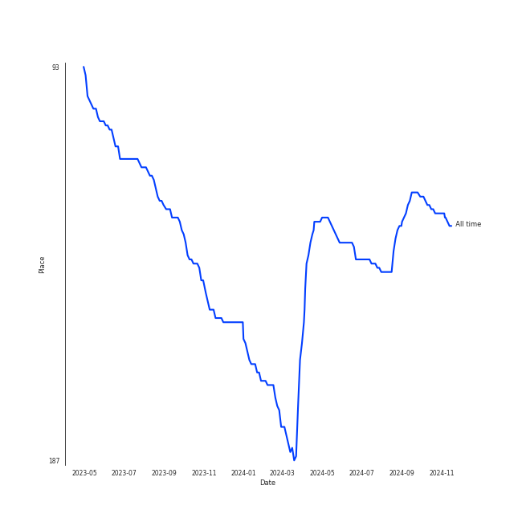
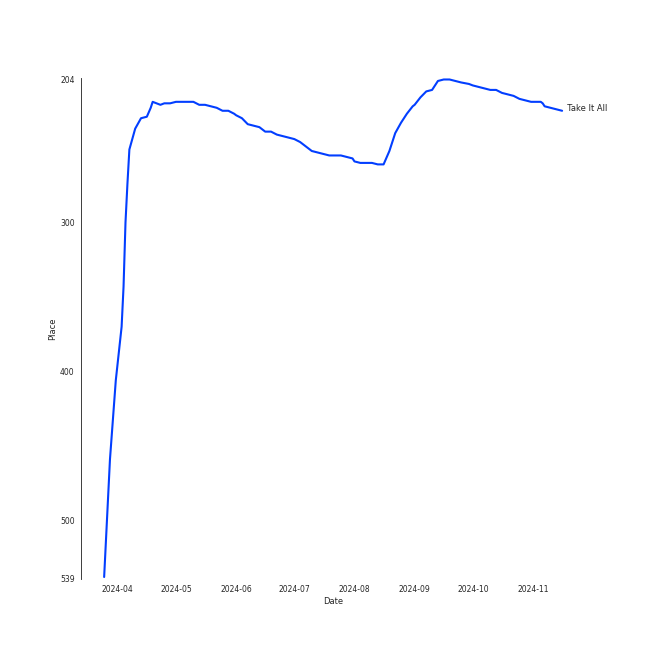
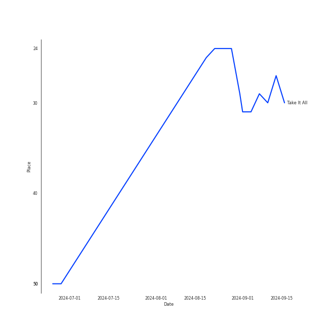
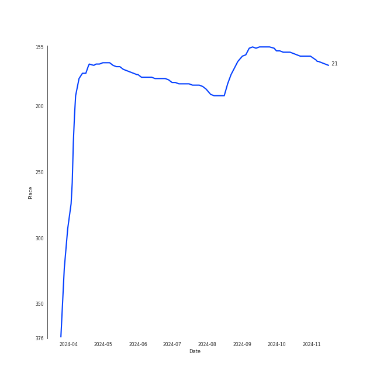

# Adele

## Artist Rank
- The #128 artist of all time

## Top Tracks

### Top tracks of all time

Top tracks of the last 6 months over time

## Top Albums

| Art | Rank | Tracks | 💚 | Album | Release Date | 🔗 |
|:---|---:|---:|---:|:---|:---|:---|
|  | 162 | 4 | 3 | 21 | 2011-01-24 | [🔗](https://open.spotify.com/album/0Lg1uZvI312TPqxNWShFXL) |
|  | 656 | 1 | 1 | Skyfall | 2012-10-04 | [🔗](https://open.spotify.com/album/6TwN6Lq9glwnG8kNp6chHY) |
|  | 656 | 1 | 1 | Easy On Me | 2021-10-14 | [🔗](https://open.spotify.com/album/224jZ4sUX7OhAuMwaxp86S) |
|  | 656 | 1 | 0 | 30 | 2021-11-19 | [🔗](https://open.spotify.com/album/21jF5jlMtzo94wbxmJ18aa) |
|  | 656 | 1 | 0 | 19 | 2008-01-28 | [🔗](https://open.spotify.com/album/1ydnyXPdmHrWXqXDgtQCPf) |

## Featured on Playlists
| Art | Tracks | Playlist |
|:---|---:|:---|
|  | 8 | [Pop](../../playlists/pop/overview.md) |
|  | 3 | [A-Pop Favorites](../../playlists/a-pop_favorites/overview.md) |
|  | 2 | [Karaoke](../../playlists/karaoke/overview.md) |
|  | 2 | [Tarps](../../playlists/tarps/overview.md) |
|  | 1 | [Relax](../../playlists/relax/overview.md) |

## Top Record Labels

| Tracks | 💚 | Label |
|---:|---:|:---|
| 6 | 4 | [XL Recordings](../../labels/xl_recordings/overview.md) |
| 3 | 2 | [Columbia](../../labels/columbia/overview.md) |

## Genres

- british soul
- [pop](../../genres/pop/overview.md)
- pop soul
- [uk pop](../../genres/uk_pop/overview.md)

## Credits

### Credits by Type

| Credit Type | Tracks |
|:---|---:|
| Producer | 1 |
| Songwriter | 6 |
| Vocal | 5 |

### Production Credits

| Art | Track | Credit Types |
|:---|:---|:---|
|  | Take It All | Songwriter |
|  | Someone Like You | Producer, Songwriter |
|  | Set Fire to the Rain | Songwriter |
|  | Skyfall | Songwriter |
|  | Alive | Songwriter |
|  | Easy On Me | Songwriter |

## Top Producers

| Art | Producer | Tracks | Credit Types |
|:---|:---|---:|:---|
|  | [Adele](overview.md) | 5 | Producer, Songwriter |
| | Tom Elmhirst | 3 | Producer |
| | Philip Allen | 1 | Producer |
| | Simon Rhodes | 1 | Producer |
| | Alex Pasco | 1 | Producer |
| | J.A.C. Redford | 1 | Arranger |
| | [Paul Epworth](../../producers/paul_epworth/overview.md) | 1 | Producer, Songwriter |
| | Dan Wilson | 1 | Producer, Songwriter |
| | Julian Burg | 1 | Producer |
| | David Campbell | 1 | Arranger |

View all

| Art | Producer | Tracks | Credit Types |
|:---|:---|---:|:---|
| | Fraser T. Smith | 1 | Songwriter |
| | Francis White | 1 | Songwriter |
| | Steve Churchyard | 1 | Producer |
| | [Greg Kurstin](../../producers/greg_kurstin/overview.md) | 1 | Producer, Songwriter |
| | Matthew Scatchell | 1 | Producer |

## Tracks

| Art | Track | Album | Artists | Label | Rank | 💚 | 🔗 |
|:---|:---|:---|:---|:---|---:|:---|:---|
|  | Take It All | 21 | [Adele](overview.md) | [XL Recordings](../../labels/xl_recordings) | 215 | 💚 | [🔗](https://open.spotify.com/track/08YJEcxGtYXwCGqXMZDiyQ) |
|  | Chasing Pavements | 19 | [Adele](overview.md) | [XL Recordings](../../labels/xl_recordings) | 1000 | | [🔗](https://open.spotify.com/track/71WAtDcWVYMoCsblD2uQXx) |
|  | Rolling in the Deep | 21 | [Adele](overview.md) | [XL Recordings](../../labels/xl_recordings) | 1000 | | [🔗](https://open.spotify.com/track/1c8gk2PeTE04A1pIDH9YMk) |
|  | Set Fire to the Rain | 21 | [Adele](overview.md) | [XL Recordings](../../labels/xl_recordings) | 1000 | 💚 | [🔗](https://open.spotify.com/track/73CMRj62VK8nUS4ezD2wvi) |
|  | Someone Like You | 21 | [Adele](overview.md) | [XL Recordings](../../labels/xl_recordings) | 1000 | 💚 | [🔗](https://open.spotify.com/track/1zwMYTA5nlNjZxYrvBB2pV) |
|  | Skyfall | Skyfall | [Adele](overview.md) | [Columbia](../../labels/columbia), [XL Recordings](../../labels/xl_recordings) | 1000 | 💚 | [🔗](https://open.spotify.com/track/6VObnIkLVruX4UVyxWhlqm) |
|  | Easy On Me | Easy On Me | [Adele](overview.md) | [Columbia](../../labels/columbia) | 1000 | 💚 | [🔗](https://open.spotify.com/track/0gplL1WMoJ6iYaPgMCL0gX) |
|  | Oh My God | 30 | [Adele](overview.md) | [Columbia](../../labels/columbia) | 1000 | | [🔗](https://open.spotify.com/track/3Kkjo3cT83cw09VJyrLNwX) |
