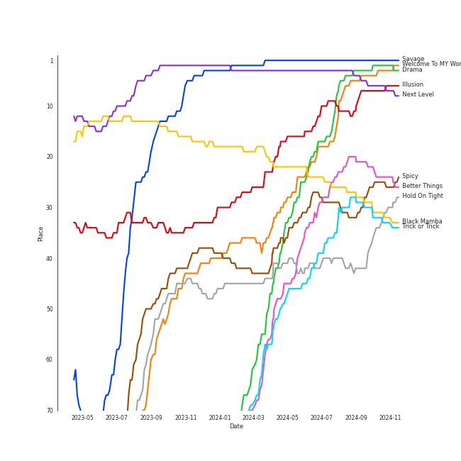
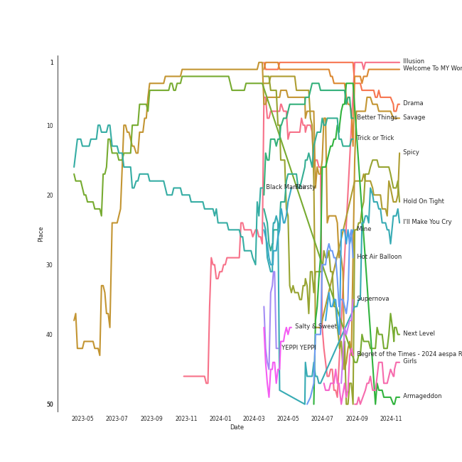
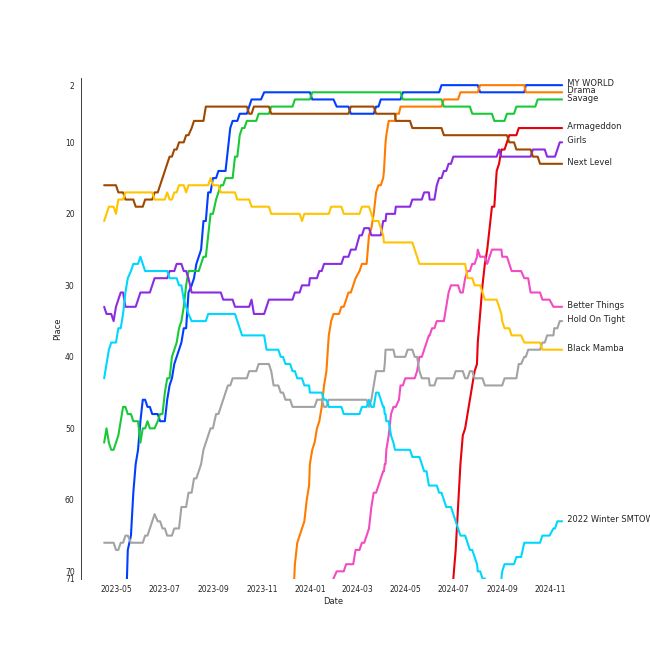

# aespa

[See Track Features](audio_features.md)

[See Clusters](clusters/overview.md)

## Relationships

aespa:
- has member GISELLE
- has member KARINA
- has member 宁艺卓 (Ning, Yizhuo)
- has member [WINTER](../winter/overview.md)

## Artist Rank
aespa is currently:
- The #1 artist of the last month
- The #1 artist of the last 6 months
- The #2 artist of the last year
- The #1 artist of all time

## Top Tracks

### Top tracks of all time

Top tracks of the last year over time

Top tracks of the last 6 months over time

## Top Albums

| Art | Rank | Tracks | 💚 | Album | Release Date | 🔗 |
|:---|---:|---:|---:|:---|:---|:---|
|  | 9 | 9 | 9 | Armageddon - The 1st Album | 2024-05-27 | [🔗](https://open.spotify.com/album/058hCti9Bupb5CJc6bd3VB) |
|  | 5 | 6 | 5 | Savage - The 1st Mini Album | 2021-10-05 | [🔗](https://open.spotify.com/album/3vyyDkvYWC36DwgZCYd3Wu) |
|  | 3 | 6 | 5 | MY WORLD - The 3rd Mini Album | 2023-05-08 | [🔗](https://open.spotify.com/album/69xF8jTd0c4Zoo7DT3Rwrn) |
|  | 12 | 6 | 5 | Girls - The 2nd Mini Album | 2022-07-08 | [🔗](https://open.spotify.com/album/4w1dbvUy1crv0knXQvcSeY) |
|  | 2 | 5 | 4 | Drama - The 4th Mini Album | 2023-11-10 | [🔗](https://open.spotify.com/album/5NMtxQJy4wq3mpo3ERVnLs) |
|  | 93 | 1 | 1 | Regret of the Times (2024 aespa Remake Version) - SM STATION | 2024-01-15 | [🔗](https://open.spotify.com/album/4Nav3JE8TIOFiuY5x95MIh) |
|  | 11 | 1 | 1 | Next Level | 2021-05-17 | [🔗](https://open.spotify.com/album/2CzbrboOLzeRoaaH1N5K0N) |
|  | 189 | 1 | 1 | Hot Mess | 2024-07-03 | [🔗](https://open.spotify.com/album/2PvpuCui1GVO8DkFcCHzYU) |
|  | 40 | 1 | 1 | Hold On Tight | 2023-03-30 | [🔗](https://open.spotify.com/album/4bWGRs1SqNwFXaRDXRAANN) |
|  | 185 | 1 | 1 | Fraggle Rock: Back To The Rock - Season 2 (Apple TV+ Original Series Soundtrack) | 2024-03-29 | [🔗](https://open.spotify.com/album/7ADS5WrhmIaFv9r1671yNh) |

See all albums

| Art | Rank | Tracks | 💚 | Album | Release Date | 🔗 |
|:---|---:|---:|---:|:---|:---|:---|
|  | 643 | 1 | 1 | Dreams Come True - SM STATION | 2021-12-20 | [🔗](https://open.spotify.com/album/4Jzx0XAORPKQ3v7EaL8Ful) |
|  | 315 | 1 | 1 | Djesse Vol. 4 | 2024-03-01 | [🔗](https://open.spotify.com/album/13r6eqjYlKELFQlNvVCBz1) |
|  | 205 | 1 | 1 | Die Trying | 2024-04-04 | [🔗](https://open.spotify.com/album/2Ov7bn3HyDgvAxtYPLosUR) |
|  | 37 | 1 | 1 | Black Mamba | 2020-11-17 | [🔗](https://open.spotify.com/album/3syEYrKIsgxaZMB5t1dVG7) |
|  | 29 | 1 | 1 | Better Things | 2023-08-18 | [🔗](https://open.spotify.com/album/1SHLOv0DDdRecK60z86Lth) |
|  | 68 | 1 | 1 | 2022 Winter SMTOWN : SMCU PALACE | 2022-12-26 | [🔗](https://open.spotify.com/album/1HwnXJfZx8N8qDfzwUbxcw) |
|  | 643 | 1 | 0 | ZOOM ZOOM | 2023-10-06 | [🔗](https://open.spotify.com/album/1A6g2ZDdb7ggiiTXUbEuMP) |
|  | 643 | 1 | 0 | Pokémon 2023 (Original TV Series Soundtrack, Korea) | 2023-08-23 | [🔗](https://open.spotify.com/album/2rTc5TdRP7hr7gE4h4lUR1) |
|  | 96 | 1 | 0 | Jingle Bell Rock | 2023-11-24 | [🔗](https://open.spotify.com/album/7dSaBwUid0hjWdJ5QzIKyu) |

## Featured on Playlists
| Art | Tracks | Playlist |
|:---|---:|:---|
|  | 45 | [K-Pop](../../playlists/k-pop/overview.md) |
|  | 14 | [K-Pop Favorites](../../playlists/k-pop_favorites/overview.md) |
|  | 13 | [Workout](../../playlists/workout/overview.md) |
|  | 12 | [Your Top Songs 2023](../../playlists/your_top_songs_2023/overview.md) |
|  | 10 | [Recent Comebacks](../../playlists/recent_comebacks/overview.md) |
|  | 8 | [Summer](../../playlists/summer/overview.md) |
|  | 7 | [On Repeat](../../playlists/on_repeat/overview.md) |
|  | 6 | [Recommendations for Chris](../../playlists/recommendations_for_chris/overview.md) |
|  | 5 | [Chill](../../playlists/chill/overview.md) |
|  | 5 | [Your Top Songs 2022](../../playlists/your_top_songs_2022/overview.md) |
|  | 4 | [K-OST](../../playlists/k-ost/overview.md) |
|  | 4 | [Repeat Rewind](../../playlists/repeat_rewind/overview.md) |
|  | 3 | [Halloween](../../playlists/halloween/overview.md) |
|  | 3 | [Sharon RPD](../../playlists/sharon_rpd/overview.md) |
|  | 3 | [애교！](../../playlists/애교！/overview.md) |
|  | 2 | [Christmas](../../playlists/christmas/overview.md) |
|  | 2 | [K-Memes](../../playlists/k-memes/overview.md) |
|  | 2 | [Beat Drop!](../../playlists/beat_drop!/overview.md) |
|  | 1 | [Relax](../../playlists/relax/overview.md) |
|  | 1 | [Recommendations for Jeff](../../playlists/recommendations_for_jeff/overview.md) |
|  | 1 | [Alt-Pop](../../playlists/alt-pop/overview.md) |
|  | 1 | [Cursed English](../../playlists/cursed_english/overview.md) |
|  | 1 | [K-Pop 101](../../playlists/k-pop_101/overview.md) |
|  | 1 | [Funk](../../playlists/funk/overview.md) |

## Top Record Labels

| Tracks | 💚 | Label |
|---:|---:|:---|
| 39 | 34 | [SM Entertainment](../../labels/sm_entertainment/overview.md) |
| 19 | 15 | [Warner Records](../../labels/warner_records/overview.md) |
| 2 | 1 | [WM Japan](../../labels/wm_japan/overview.md) |
| 1 | 1 | [Parlophone UK](../../labels/parlophone_uk/overview.md) |
| 1 | 1 | Netflix Music |
| 1 | 1 | Lakeshore Records |
| 1 | 1 | [Decca (UMO)](../../labels/decca_(umo)/overview.md) |
| 1 | 0 | ㈜포켓몬코리아 |

## Genres

- [k-pop girl group](../../genres/k-pop_girl_group/overview.md)

## Credits

### Credits by Type

| Credit Type | Tracks |
|:---|---:|
| Performer | 2 |
| Vocal | 7 |

### Member Credits

| | GISELLE | KARINA | [WINTER](../winter/overview.md) | 宁艺卓 (Ning, Yizhuo) |
|:---|---:|---:|---:|---:|
| Vocal | 2 | 2 | 3 | 2 |
## Top Producers

| Art | Producer | Tracks | Credit Types |
|:---|:---|---:|:---|
| | [유영진 (Yoo, Young-jin)](../../producers/유영진_(yoo,_young-jin)/overview.md) | 4 | Arranger, Lyricist, Producer, Songwriter |
| | 노민지 (Noh, Min-ji) | 4 | Producer |
| | 강은지 (Kang, Eun-ji) | 3 | Producer |
| | 이지홍 (Lee, Ji-hong) | 2 | Producer |
| | [이수만 (Lee, Soo-Man)](../../producers/이수만_(lee,_soo-man)/overview.md) | 2 | Producer |
| | 김철순 (Kim, Chul-Soon) | 2 | Producer |
| | IMLAY | 2 | Arranger |
| | Hautboi Rich | 2 | Songwriter |
| | Sophie Curtis | 2 | Songwriter |
| | Kirsten Collins | 2 | Songwriter |

View all

| Art | Producer | Tracks | Credit Types |
|:---|:---|---:|:---|
|  | [BoA](../boa/overview.md) | 1 | Arranger, Lyricist, Songwriter |
| | Tay Jasper | 1 | Songwriter |
| | Gabriela Geneva | 1 | Songwriter |
| | Brandon Green | 1 | Arranger, Songwriter |
| | 남궁진 (Nam Goong, Jin) | 1 | Producer |
| | COACH | 1 | Producer |
| | David Dahlquist | 1 | Arranger, Songwriter |
| | SAAY | 1 | Lyricist, Songwriter |
| | Patrick Morrissey | 1 | Arranger, Songwriter |
| | Shaun Kim | 1 | Arranger |
| | Paul Phamous | 1 | Songwriter |
| | [정의석 (Jung, Euisuk)](../../producers/정의석_(jung,_euisuk)/overview.md) | 1 | Producer |
| | Jia Lih | 1 | Arranger, Songwriter |
| | Risto Asikainen | 1 | Songwriter |
| | Ellie Suh | 1 | Lyricist |
| | 바다 (Bada) | 1 | Lyricist |
| | Tim Tan | 1 | Producer |
| | Omega | 1 | Arranger, Songwriter |
| | Coach & Sendo | 1 | Arranger, Songwriter |
| | Deez | 1 | Arranger, Lyricist, Songwriter |
| | Shaun Lopez | 1 | Arranger, Songwriter |
| | Adam McInnis | 1 | Arranger, Songwriter |
| | [Kenzie](../../producers/kenzie/overview.md) | 1 | Lyricist, Songwriter |
| | 강선영 (강선영) | 1 | Producer |
| | Marcus Lomax | 1 | Songwriter |
| | Mario Marchetti | 1 | Arranger, Songwriter |
| | Scott Chesak | 1 | Arranger, Songwriter |
| | Timothy Tan | 1 | Arranger, Songwriter |
| | Jordan Reyes | 1 | Arranger, Songwriter |
| | Hayley Kiyoko | 1 | Songwriter |
| | 장우영 (Jang, Woo-young) | 1 | Producer |
| | 황현 (Hwang, Hyeon) | 1 | Producer |
| | Valeria Del Prete | 1 | Songwriter |
| | Ella Isaacson | 1 | Songwriter |
| | Timothy "Bos" Bullock | 1 | Arranger, Songwriter |
| | BXN | 1 | Arranger |
| | [조윤경 (Jo, Yoon Kyung)](../../producers/조윤경_(jo,_yoon_kyung)/overview.md) | 1 | Lyricist |
| | SENDO | 1 | Producer |

## Tracks

| Art | Track | Album | Artists | Label | Rank | 💚 | 🔗 |
|:---|:---|:---|:---|:---|---:|:---|:---|
|  | Savage | Savage - The 1st Mini Album | [aespa](overview.md) | [SM Entertainment](../../labels/sm_entertainment) | 1 | 💚 | [🔗](https://open.spotify.com/track/3dbLT62Cvs46Ju7a8gpr36) |
|  | Drama | Drama - The 4th Mini Album | [aespa](overview.md) | [SM Entertainment](../../labels/sm_entertainment), [Warner Records](../../labels/warner_records) | 3 | 💚 | [🔗](https://open.spotify.com/track/5XWlyfo0kZ8LF7VSyfS4Ew) |
|  | Welcome To MY World (feat. nævis) | MY WORLD - The 3rd Mini Album | [aespa](overview.md), nævis | [SM Entertainment](../../labels/sm_entertainment), [Warner Records](../../labels/warner_records) | 4 | 💚 | [🔗](https://open.spotify.com/track/3q5qpprtugUIEPExuI7tRD) |
|  | Next Level | Next Level | [aespa](overview.md) | [SM Entertainment](../../labels/sm_entertainment) | 6 | 💚 | [🔗](https://open.spotify.com/track/2zrhoHlFKxFTRF5aMyxMoQ) |
|  | Illusion | Girls - The 2nd Mini Album | [aespa](overview.md) | [SM Entertainment](../../labels/sm_entertainment), [Warner Records](../../labels/warner_records) | 7 | 💚 | [🔗](https://open.spotify.com/track/396FqjKmViUZ92Wmm4rx3i) |
|  | Better Things | Better Things | [aespa](overview.md) | [SM Entertainment](../../labels/sm_entertainment), [Warner Records](../../labels/warner_records) | 23 | 💚 | [🔗](https://open.spotify.com/track/6zZWoHlF2zNSLUNLvx4GUl) |
|  | Spicy | MY WORLD - The 3rd Mini Album | [aespa](overview.md) | [SM Entertainment](../../labels/sm_entertainment), [Warner Records](../../labels/warner_records) | 27 | 💚 | [🔗](https://open.spotify.com/track/1ULdASrNy5rurl1TZfFaMP) |
|  | Black Mamba | Black Mamba | [aespa](overview.md) | [SM Entertainment](../../labels/sm_entertainment) | 29 | 💚 | [🔗](https://open.spotify.com/track/1t2qYCAjUAoGfeFeoBlK51) |
|  | Trick or Trick | Drama - The 4th Mini Album | [aespa](overview.md) | [SM Entertainment](../../labels/sm_entertainment), [Warner Records](../../labels/warner_records) | 30 | 💚 | [🔗](https://open.spotify.com/track/3EI3OLBeM89B0o0UsIGCOx) |
|  | Hold On Tight | Hold On Tight | [aespa](overview.md) | [Parlophone UK](../../labels/parlophone_uk) | 36 | 💚 | [🔗](https://open.spotify.com/track/1o844wI52S3TjXGBwvGcc7) |

See all tracks

| Art | Track | Album | Artists | Label | Rank | 💚 | 🔗 |
|:---|:---|:---|:---|:---|---:|:---|:---|
|  | Armageddon | Armageddon - The 1st Album | [aespa](overview.md) | [SM Entertainment](../../labels/sm_entertainment) | 59 | 💚 | [🔗](https://open.spotify.com/track/6i8MbzVn4nzyjUcSoVcz7B) |
|  | Thirsty | MY WORLD - The 3rd Mini Album | [aespa](overview.md) | [SM Entertainment](../../labels/sm_entertainment), [Warner Records](../../labels/warner_records) | 84 | 💚 | [🔗](https://open.spotify.com/track/6nICBdDevG4NZysIqDFPEa) |
|  | Hot Air Balloon | Drama - The 4th Mini Album | [aespa](overview.md) | [SM Entertainment](../../labels/sm_entertainment), [Warner Records](../../labels/warner_records) | 86 | 💚 | [🔗](https://open.spotify.com/track/1mdtLny0zugh89vokWGG80) |
|  | Mine | Armageddon - The 1st Album | [aespa](overview.md) | [SM Entertainment](../../labels/sm_entertainment) | 105 | 💚 | [🔗](https://open.spotify.com/track/1tDvNjVn4dRAMwp9nSpndC) |
|  | Supernova | Armageddon - The 1st Album | [aespa](overview.md) | [SM Entertainment](../../labels/sm_entertainment) | 106 | 💚 | [🔗](https://open.spotify.com/track/4sgMbwl9lXGyHcHmtFYGMm) |
|  | Regret of the Times - 2024 aespa Remake Version | Regret of the Times (2024 aespa Remake Version) - SM STATION | [aespa](overview.md) | [SM Entertainment](../../labels/sm_entertainment) | 114 | 💚 | [🔗](https://open.spotify.com/track/6WJTEsLxWtSIlXML3NVSzA) |
|  | Jingle Bell Rock | Jingle Bell Rock | [aespa](overview.md) | [SM Entertainment](../../labels/sm_entertainment), [Warner Records](../../labels/warner_records) | 117 | | [🔗](https://open.spotify.com/track/0ijCESscFXtRc0dtDgu1Uv) |
|  | I'll Make You Cry | Savage - The 1st Mini Album | [aespa](overview.md) | [SM Entertainment](../../labels/sm_entertainment) | 119 | 💚 | [🔗](https://open.spotify.com/track/6l1dTAhX7P6EKvA11NLNuW) |
|  | Don't Blink | Drama - The 4th Mini Album | [aespa](overview.md) | [SM Entertainment](../../labels/sm_entertainment), [Warner Records](../../labels/warner_records) | 124 | 💚 | [🔗](https://open.spotify.com/track/2uJEnyojuGg31VVlLTQFpp) |
|  | Long Chat (#♥) | Armageddon - The 1st Album | [aespa](overview.md) | [SM Entertainment](../../labels/sm_entertainment) | 132 | 💚 | [🔗](https://open.spotify.com/track/1l4aQeJKuPVUVtMVZw1fTf) |
|  | YEPPI YEPPI | Savage - The 1st Mini Album | [aespa](overview.md) | [SM Entertainment](../../labels/sm_entertainment) | 137 | 💚 | [🔗](https://open.spotify.com/track/3UKKwGrpWWamc0XNSKXjmz) |
|  | Salty & Sweet | MY WORLD - The 3rd Mini Album | [aespa](overview.md) | [SM Entertainment](../../labels/sm_entertainment), [Warner Records](../../labels/warner_records) | 139 | 💚 | [🔗](https://open.spotify.com/track/4wQDjZtXjsFtU3BLSiIH4t) |
|  | Prologue | Armageddon - The 1st Album | [aespa](overview.md) | [SM Entertainment](../../labels/sm_entertainment) | 203 | 💚 | [🔗](https://open.spotify.com/track/4stu4P8xHdm8ywpX1YpdFJ) |
|  | BAHAMA | Armageddon - The 1st Album | [aespa](overview.md) | [SM Entertainment](../../labels/sm_entertainment) | 206 | 💚 | [🔗](https://open.spotify.com/track/1dY5W7IZHUSpvTuCUWeXNE) |
|  | YOLO | Drama - The 4th Mini Album | [aespa](overview.md) | [SM Entertainment](../../labels/sm_entertainment), [Warner Records](../../labels/warner_records) | 210 | | [🔗](https://open.spotify.com/track/3OQWohbPUsvbXaH1AiRazX) |
|  | Beautiful Christmas | 2022 Winter SMTOWN : SMCU PALACE | [Red Velvet](../red_velvet/overview.md), [aespa](overview.md) | [SM Entertainment](../../labels/sm_entertainment) | 211 | 💚 | [🔗](https://open.spotify.com/track/1MsWVb6YW3AknP1EAZaKOQ) |
|  | Girls | Girls - The 2nd Mini Album | [aespa](overview.md) | [SM Entertainment](../../labels/sm_entertainment), [Warner Records](../../labels/warner_records) | 222 | 💚 | [🔗](https://open.spotify.com/track/2WTHLEVjfefbGoW7F3dXIg) |
|  | I'm Unhappy | MY WORLD - The 3rd Mini Album | [aespa](overview.md) | [SM Entertainment](../../labels/sm_entertainment), [Warner Records](../../labels/warner_records) | 225 | 💚 | [🔗](https://open.spotify.com/track/6fzio74FGqFFsenYkbGPzR) |
|  | Set The Tone | Armageddon - The 1st Album | [aespa](overview.md) | [SM Entertainment](../../labels/sm_entertainment) | 245 | 💚 | [🔗](https://open.spotify.com/track/1qVOxNk88HMDXteLce4fyD) |
|  | Get Goin' | Fraggle Rock: Back To The Rock - Season 2 (Apple TV+ Original Series Soundtrack) | [aespa](overview.md) | Lakeshore Records | 257 | 💚 | [🔗](https://open.spotify.com/track/5nv5aUcSKCogR7xMX3q0od) |
|  | Hot Mess | Hot Mess | [aespa](overview.md) | [WM Japan](../../labels/wm_japan) | 258 | 💚 | [🔗](https://open.spotify.com/track/1SaLI6o5GhfcaxPVAJoD3r) |
|  | Die Trying | Die Trying | [aespa](overview.md), TOKiMONSTA | Netflix Music | 280 | 💚 | [🔗](https://open.spotify.com/track/4ToOfelAD6oEqbeHyTTKMS) |
|  | 'Til We Meet Again | MY WORLD - The 3rd Mini Album | [aespa](overview.md) | [SM Entertainment](../../labels/sm_entertainment), [Warner Records](../../labels/warner_records) | 295 | | [🔗](https://open.spotify.com/track/60Uio68M57PwKEgZxSutL6) |
|  | Live My Life | Armageddon - The 1st Album | [aespa](overview.md) | [SM Entertainment](../../labels/sm_entertainment) | 310 | 💚 | [🔗](https://open.spotify.com/track/3ybJERCKs3Jf3aT7xU1Vs4) |
|  | Licorice | Armageddon - The 1st Album | [aespa](overview.md) | [SM Entertainment](../../labels/sm_entertainment) | 322 | 💚 | [🔗](https://open.spotify.com/track/2llGaRhftbXIr1UgbpQpWq) |
|  | Over You (feat. aespa & Chris Martin) | Djesse Vol. 4 | [Jacob Collier](../jacob_collier/overview.md), [aespa](overview.md), Chris Martin | [Decca (UMO)](../../labels/decca_(umo)) | 448 | 💚 | [🔗](https://open.spotify.com/track/7MSZg4Km8CM7NRXTeJoANZ) |
|  | Life's Too Short | Girls - The 2nd Mini Album | [aespa](overview.md) | [SM Entertainment](../../labels/sm_entertainment), [Warner Records](../../labels/warner_records) | 781 | 💚 | [🔗](https://open.spotify.com/track/1uIN3VCVKzMXqF2A2Qlw5q) |
|  | ICONIC | Savage - The 1st Mini Album | [aespa](overview.md) | [SM Entertainment](../../labels/sm_entertainment) | 974 | 💚 | [🔗](https://open.spotify.com/track/5bMHrigI1EAmZdiyRzKoQi) |
|  | Lucid Dream | Savage - The 1st Mini Album | [aespa](overview.md) | [SM Entertainment](../../labels/sm_entertainment) | 974 | 💚 | [🔗](https://open.spotify.com/track/285Bh5EkbxGGE76ge8JDbH) |
|  | aenergy | Savage - The 1st Mini Album | [aespa](overview.md) | [SM Entertainment](../../labels/sm_entertainment) | 974 | | [🔗](https://open.spotify.com/track/1iNvVaWmlKJns2LNTXN39Q) |
|  | Dreams Come True | Dreams Come True - SM STATION | [aespa](overview.md) | [SM Entertainment](../../labels/sm_entertainment) | 974 | 💚 | [🔗](https://open.spotify.com/track/6rVCUwfnuYTAsX4P9fIdIu) |
|  | ICU | Girls - The 2nd Mini Album | [aespa](overview.md) | [SM Entertainment](../../labels/sm_entertainment), [Warner Records](../../labels/warner_records) | 974 | | [🔗](https://open.spotify.com/track/11JpW4h96X4TlGt6LFpNCC) |
|  | Life's Too Short (English Version) | Girls - The 2nd Mini Album | [aespa](overview.md) | [SM Entertainment](../../labels/sm_entertainment), [Warner Records](../../labels/warner_records) | 974 | 💚 | [🔗](https://open.spotify.com/track/2ouguQxJZn4jXisuNREqe5) |
|  | Lingo | Girls - The 2nd Mini Album | [aespa](overview.md) | [SM Entertainment](../../labels/sm_entertainment), [Warner Records](../../labels/warner_records) | 974 | 💚 | [🔗](https://open.spotify.com/track/3tB10LUdisNWISpLw5gPCk) |
|  | We Go | Pokémon 2023 (Original TV Series Soundtrack, Korea) | [aespa](overview.md) | ㈜포켓몬코리아 | 974 | | [🔗](https://open.spotify.com/track/7hxvMTEUOXEKDZ3nnUqbdJ) |
|  | ZOOM ZOOM | ZOOM ZOOM | [aespa](overview.md) | [WM Japan](../../labels/wm_japan) | 974 | | [🔗](https://open.spotify.com/track/3DZwsHxTYjCcMUTcSkATPl) |

