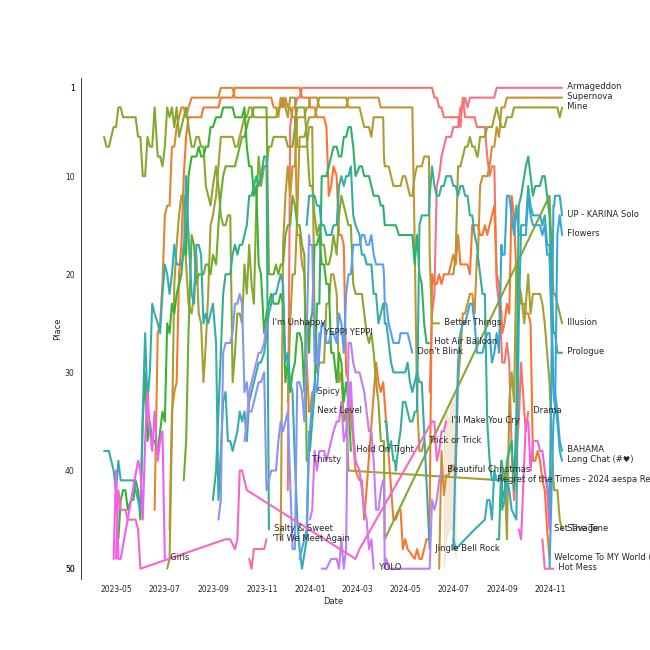

# aespa

[See Track Features](audio_features.md)

[See Clusters](clusters/overview.md)

## Artist Rank
aespa is currently:
- The #10 artist of all time
- The #5 artist of the last 6 months
- The #2 artist of the last month

## Top Tracks

- Black Mamba is:
    - the #14 track of all time
- Next Level is:
    - the #20 track of the last 6 months
    - the #15 track of all time
- Savage is:
    - the #37 track of the last month
    - the #50 track of the last 6 months
    - the #23 track of all time
- Illusion is:
    - the #9 track of the last month
    - the #3 track of the last 6 months
- Spicy is:
    - the #1 track of the last month
    - the #13 track of the last 6 months
- Hold On Tight is:
    - the #25 track of the last 6 months
- Thirsty is:
    - the #15 track of the last month
- Welcome To MY World (feat. nævis) is:
    - the #20 track of the last month

### Top tracks of all time over time

### Top tracks of the last 6 months over time

### Top tracks of the last month over time

## Featured on Playlists
| Art | Tracks | Playlist |
|:---|---:|:---|
|  | 23 | [K-Pop](../../playlists/k_pop/overview.md) |
|  | 12 | [K-Pop Favorites](../../playlists/k_pop_favorites/overview.md) |
|  | 10 | [Workout](../../playlists/workout/overview.md) |
|  | 7 | [Recent Comebacks](../../playlists/recent_comebacks/overview.md) |
|  | 7 | [Chill](../../playlists/chill/overview.md) |
|  | 3 | [Summer](../../playlists/summer/overview.md) |
|  | 2 | [Sharon RPD](../../playlists/sharon_rpd/overview.md) |
|  | 1 | [K-Pop 101](../../playlists/k_pop_101/overview.md) |
|  | 1 | [Cursed English](../../playlists/cursed_english/overview.md) |
|  | 1 | [Aegyo](../../playlists/aegyo/overview.md) |
|  | 1 | [Christmas](../../playlists/christmas/overview.md) |
## Top Albums

| Art | Tracks | 💚 | Album | Release Date | 🔗 |
|:---|---:|---:|:---|:---|:---|
|  | 6 | 6 | MY WORLD - The 3rd Mini Album | 2023-05-08 | [🔗](https://open.spotify.com/album/69xF8jTd0c4Zoo7DT3Rwrn) |
|  | 6 | 5 | Savage - The 1st Mini Album | 2021-10-05 | [🔗](https://open.spotify.com/album/3vyyDkvYWC36DwgZCYd3Wu) |
|  | 6 | 5 | Girls - The 2nd Mini Album | 2022-07-08 | [🔗](https://open.spotify.com/album/4w1dbvUy1crv0knXQvcSeY) |
|  | 1 | 1 | Next Level | 2021-05-17 | [🔗](https://open.spotify.com/album/2CzbrboOLzeRoaaH1N5K0N) |
|  | 1 | 1 | Hold On Tight | 2023-03-30 | [🔗](https://open.spotify.com/album/4bWGRs1SqNwFXaRDXRAANN) |
|  | 1 | 1 | Dreams Come True - SM STATION | 2021-12-20 | [🔗](https://open.spotify.com/album/4Jzx0XAORPKQ3v7EaL8Ful) |
|  | 1 | 1 | Black Mamba | 2020-11-17 | [🔗](https://open.spotify.com/album/3syEYrKIsgxaZMB5t1dVG7) |
|  | 1 | 1 | 2022 Winter SMTOWN : SMCU PALACE | 2022-12-26 | [🔗](https://open.spotify.com/album/1HwnXJfZx8N8qDfzwUbxcw) |

## Top Record Labels

| Tracks | 💚 | Label |
|---:|---:|:---|
| 12 | 11 | [Warner Records](../../labels/warner_records/overview.md) |
| 10 | 9 | [SM Entertainment](../../labels/sm_entertainment/overview.md) |
| 1 | 1 | Parlophone UK |

## Genres

- [k-pop](../../genres/k_pop)
- [k-pop girl group](../../genres/k_pop_girl_group)

## Tracks

| Art | Track | Album | Artists | Label | 💚 | 🔗 |
|:---|:---|:---|:---|:---|:---|:---|
|  | Beautiful Christmas | 2022 Winter SMTOWN : SMCU PALACE | [Red Velvet](../red_velvet/overview.md), [aespa](overview.md) | [SM Entertainment](../../labels/sm_entertainment) | 💚 | [🔗](https://open.spotify.com/track/1MsWVb6YW3AknP1EAZaKOQ) |
|  | Black Mamba | Black Mamba | [aespa](overview.md) | [SM Entertainment](../../labels/sm_entertainment) | 💚 | [🔗](https://open.spotify.com/track/1t2qYCAjUAoGfeFeoBlK51) |
|  | Next Level | Next Level | [aespa](overview.md) | [SM Entertainment](../../labels/sm_entertainment) | 💚 | [🔗](https://open.spotify.com/track/2zrhoHlFKxFTRF5aMyxMoQ) |
|  | I'll Make You Cry | Savage - The 1st Mini Album | [aespa](overview.md) | [SM Entertainment](../../labels/sm_entertainment) | 💚 | [🔗](https://open.spotify.com/track/6l1dTAhX7P6EKvA11NLNuW) |
|  | ICONIC | Savage - The 1st Mini Album | [aespa](overview.md) | [SM Entertainment](../../labels/sm_entertainment) | 💚 | [🔗](https://open.spotify.com/track/5bMHrigI1EAmZdiyRzKoQi) |
|  | Lucid Dream | Savage - The 1st Mini Album | [aespa](overview.md) | [SM Entertainment](../../labels/sm_entertainment) | 💚 | [🔗](https://open.spotify.com/track/285Bh5EkbxGGE76ge8JDbH) |
|  | Savage | Savage - The 1st Mini Album | [aespa](overview.md) | [SM Entertainment](../../labels/sm_entertainment) | 💚 | [🔗](https://open.spotify.com/track/3dbLT62Cvs46Ju7a8gpr36) |
|  | YEPPI YEPPI | Savage - The 1st Mini Album | [aespa](overview.md) | [SM Entertainment](../../labels/sm_entertainment) | 💚 | [🔗](https://open.spotify.com/track/3UKKwGrpWWamc0XNSKXjmz) |
|  | aenergy | Savage - The 1st Mini Album | [aespa](overview.md) | [SM Entertainment](../../labels/sm_entertainment) | | [🔗](https://open.spotify.com/track/1iNvVaWmlKJns2LNTXN39Q) |
|  | Dreams Come True | Dreams Come True - SM STATION | [aespa](overview.md) | [SM Entertainment](../../labels/sm_entertainment) | 💚 | [🔗](https://open.spotify.com/track/6rVCUwfnuYTAsX4P9fIdIu) |

See all tracks

| Art | Track | Album | Artists | Label | 💚 | 🔗 |
|:---|:---|:---|:---|:---|:---|:---|
|  | Girls | Girls - The 2nd Mini Album | [aespa](overview.md) | [Warner Records](../../labels/warner_records) | 💚 | [🔗](https://open.spotify.com/track/2WTHLEVjfefbGoW7F3dXIg) |
|  | ICU | Girls - The 2nd Mini Album | [aespa](overview.md) | [Warner Records](../../labels/warner_records) | | [🔗](https://open.spotify.com/track/11JpW4h96X4TlGt6LFpNCC) |
|  | Illusion | Girls - The 2nd Mini Album | [aespa](overview.md) | [Warner Records](../../labels/warner_records) | 💚 | [🔗](https://open.spotify.com/track/396FqjKmViUZ92Wmm4rx3i) |
|  | Life's Too Short | Girls - The 2nd Mini Album | [aespa](overview.md) | [Warner Records](../../labels/warner_records) | 💚 | [🔗](https://open.spotify.com/track/1uIN3VCVKzMXqF2A2Qlw5q) |
|  | Life's Too Short (English Version) | Girls - The 2nd Mini Album | [aespa](overview.md) | [Warner Records](../../labels/warner_records) | 💚 | [🔗](https://open.spotify.com/track/2ouguQxJZn4jXisuNREqe5) |
|  | Lingo | Girls - The 2nd Mini Album | [aespa](overview.md) | [Warner Records](../../labels/warner_records) | 💚 | [🔗](https://open.spotify.com/track/3tB10LUdisNWISpLw5gPCk) |
|  | Hold On Tight | Hold On Tight | [aespa](overview.md) | Parlophone UK | 💚 | [🔗](https://open.spotify.com/track/1o844wI52S3TjXGBwvGcc7) |
|  | 'Til We Meet Again | MY WORLD - The 3rd Mini Album | [aespa](overview.md) | [Warner Records](../../labels/warner_records) | 💚 | [🔗](https://open.spotify.com/track/60Uio68M57PwKEgZxSutL6) |
|  | I'm Unhappy | MY WORLD - The 3rd Mini Album | [aespa](overview.md) | [Warner Records](../../labels/warner_records) | 💚 | [🔗](https://open.spotify.com/track/6fzio74FGqFFsenYkbGPzR) |
|  | Salty & Sweet | MY WORLD - The 3rd Mini Album | [aespa](overview.md) | [Warner Records](../../labels/warner_records) | 💚 | [🔗](https://open.spotify.com/track/4wQDjZtXjsFtU3BLSiIH4t) |
|  | Spicy | MY WORLD - The 3rd Mini Album | [aespa](overview.md) | [Warner Records](../../labels/warner_records) | 💚 | [🔗](https://open.spotify.com/track/1ULdASrNy5rurl1TZfFaMP) |
|  | Thirsty | MY WORLD - The 3rd Mini Album | [aespa](overview.md) | [Warner Records](../../labels/warner_records) | 💚 | [🔗](https://open.spotify.com/track/6nICBdDevG4NZysIqDFPEa) |
|  | Welcome To MY World (feat. nævis) | MY WORLD - The 3rd Mini Album | [aespa](overview.md), nævis | [Warner Records](../../labels/warner_records) | 💚 | [🔗](https://open.spotify.com/track/3q5qpprtugUIEPExuI7tRD) |

