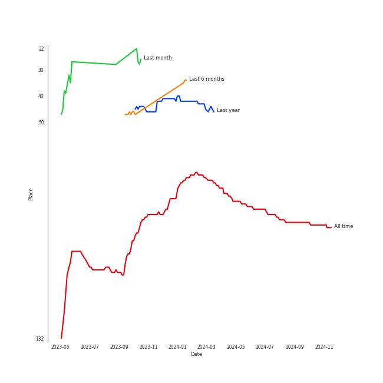
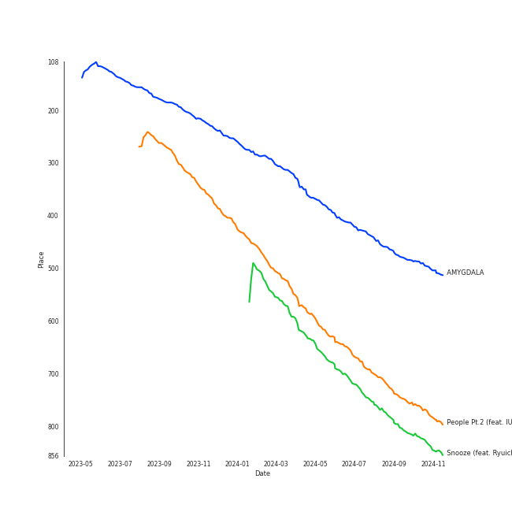
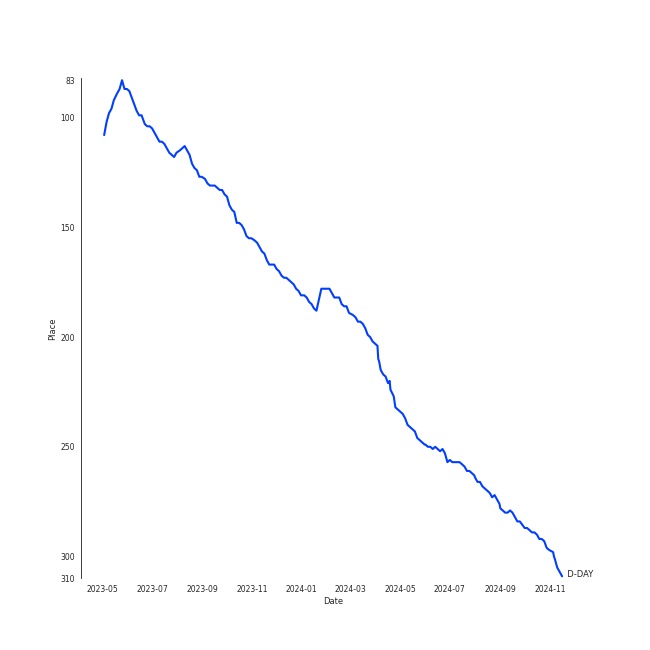

# Agust D

## Relationships

Agust D:
- is also known as 민윤기 (Min Yoon-gi)

## Artist Rank
- The #85 artist of all time

## Top Tracks

### Top tracks of all time

## Top Albums

| Art | Rank | Tracks | 💚 | Album | Release Date | 🔗 |
|:---|---:|---:|---:|:---|:---|:---|
|  | 599 | 5 | 3 | D-2 | 2020-05-22 | [🔗](https://open.spotify.com/album/1Pp8t7yn2E3rz3R7ZqPn1O) |
|  | 266 | 4 | 2 | D-DAY | 2023-04-21 | [🔗](https://open.spotify.com/album/446ROKmKfpEwkbi2SjELVX) |

## Featured on Playlists
| Art | Tracks | Playlist |
|:---|---:|:---|
|  | 9 | [K-Pop](../../playlists/k-pop/overview.md) |
|  | 1 | [Workout](../../playlists/workout/overview.md) |

## Top Record Labels

| Tracks | 💚 | Label |
|---:|---:|:---|
| 9 | 5 | [BIGHIT MUSIC](../../labels/bighit_music/overview.md) |

## Genres

- [k-rap](../../genres/k-rap/overview.md)

## Credits

### Credits by Type

| Credit Type | Tracks |
|:---|---:|
| Songwriter | 1 |

### Production Credits

| Art | Track | Credit Types |
|:---|:---|:---|
|  | Blueberry Eyes (feat. SUGA of BTS) | Songwriter |

## Tracks

| Art | Track | Album | Artists | Label | Rank | 💚 | 🔗 |
|:---|:---|:---|:---|:---|---:|:---|:---|
|  | AMYGDALA | D-DAY | [Agust D](overview.md) | [BIGHIT MUSIC](../../labels/bighit_music) | 438 | | [🔗](https://open.spotify.com/track/5fj32MKLHkut2Vod1UodcU) |
|  | People Pt.2 (feat. IU) | D-DAY | [Agust D](overview.md), [IU](../iu/overview.md) | [BIGHIT MUSIC](../../labels/bighit_music) | 694 | 💚 | [🔗](https://open.spotify.com/track/41JPN7pZMTp1sumBOHOzHd) |
|  | Snooze (feat. Ryuichi Sakamoto, WOOSUNG of The Rose) | D-DAY | [Agust D](overview.md), Ryuichi Sakamoto, WOOSUNG | [BIGHIT MUSIC](../../labels/bighit_music) | 745 | 💚 | [🔗](https://open.spotify.com/track/4j3M8NrbGSXdMPwEVsnfHE) |
|  | Burn It (feat. MAX) | D-2 | [Agust D](overview.md), MAX | [BIGHIT MUSIC](../../labels/bighit_music) | 894 | 💚 | [🔗](https://open.spotify.com/track/38iufYNK4hUzS649Oe2kZy) |
|  | Daechwita | D-2 | [Agust D](overview.md) | [BIGHIT MUSIC](../../labels/bighit_music) | 894 | 💚 | [🔗](https://open.spotify.com/track/1Y7AZ3akqDipAyo6mmOQTy) |
|  | Moonlight | D-2 | [Agust D](overview.md) | [BIGHIT MUSIC](../../labels/bighit_music) | 894 | | [🔗](https://open.spotify.com/track/057xGYST5exVyNevufrioZ) |
|  | People | D-2 | [Agust D](overview.md) | [BIGHIT MUSIC](../../labels/bighit_music) | 894 | 💚 | [🔗](https://open.spotify.com/track/4wDSEE082RPcnhXzPzFhCp) |
|  | Strange (feat. RM) | D-2 | [Agust D](overview.md), RM | [BIGHIT MUSIC](../../labels/bighit_music) | 894 | | [🔗](https://open.spotify.com/track/6x2arhzc99oGlqM82V0mnd) |
|  | Haegeum | D-DAY | [Agust D](overview.md) | [BIGHIT MUSIC](../../labels/bighit_music) | 894 | | [🔗](https://open.spotify.com/track/4bjN59DRXFRxBE1g5ne6B1) |
