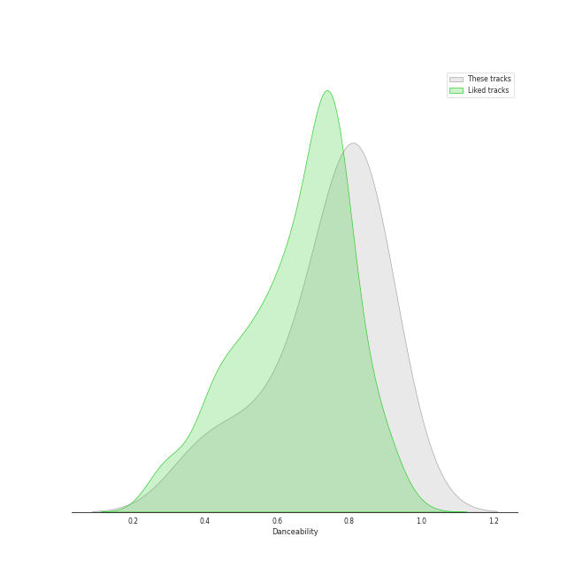
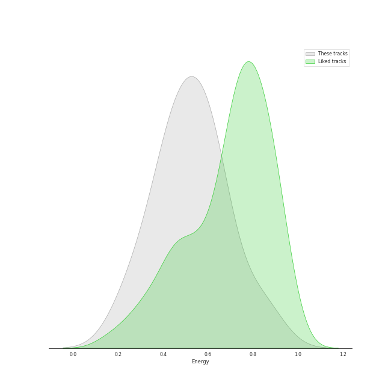
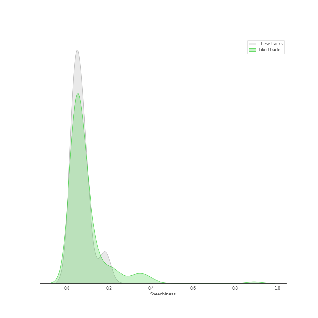
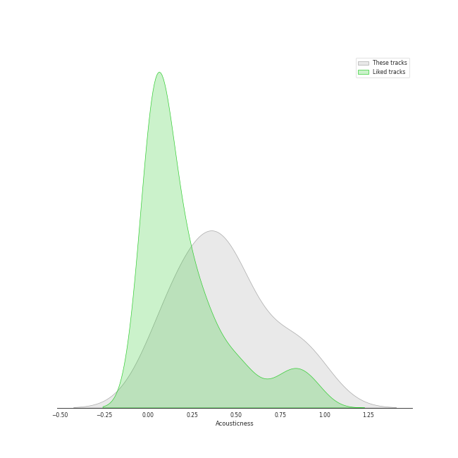
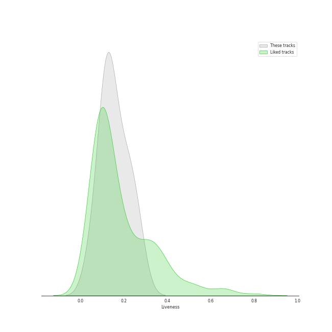
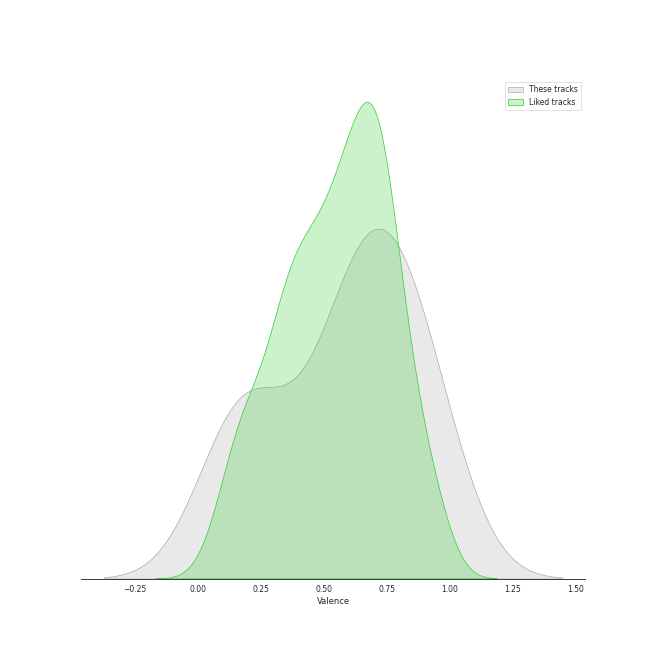
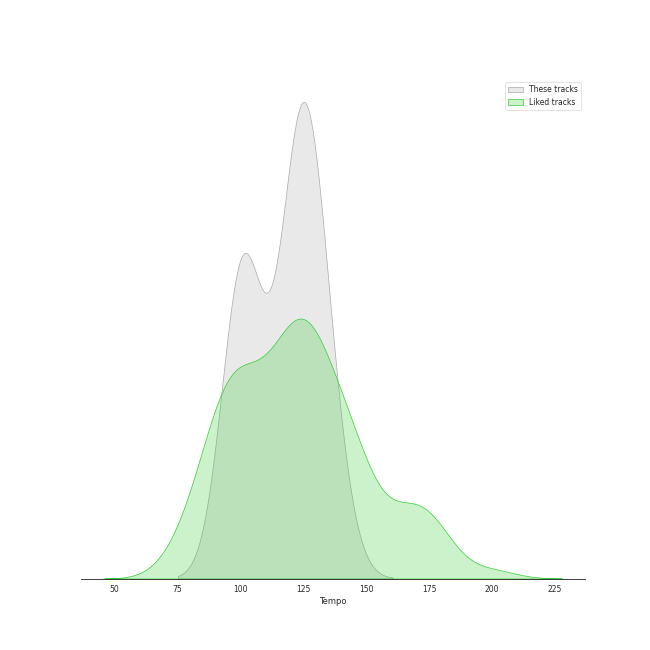

# Track Features for AKMU

## Danceability

| ​ | 10 most Danceable tracks | ​​ | 10 least Danceable tracks |
|:---|:---|:---|:---|
|  | Love Lee (0.914) |  | Melted (0.384) |
|  | 200% (0.853) |  | How can I love the heartbreak, you're the one I love (0.52) |
|  | Fry’s Dream (0.845) |  | Hero (0.655) |
|  | NAKKA (with IU) (0.816) |  | FREEDOM (0.692) |
|  | How People Move (0.813) |  | Whale (0.788) |
|  | RE-BYE (0.799) |  | RE-BYE (0.799) |
|  | Whale (0.788) |  | How People Move (0.813) |
|  | FREEDOM (0.692) |  | NAKKA (with IU) (0.816) |
|  | Hero (0.655) |  | Fry’s Dream (0.845) |
|  | How can I love the heartbreak, you're the one I love (0.52) |  | 200% (0.853) |

## Energy

| ​ | 10 most Energetic tracks | ​​ | 10 least Energetic tracks |
|:---|:---|:---|:---|
|  | How People Move (0.836) |  | How can I love the heartbreak, you're the one I love (0.248) |
|  | 200% (0.638) |  | Melted (0.361) |
|  | NAKKA (with IU) (0.636) |  | Hero (0.434) |
|  | RE-BYE (0.608) |  | Whale (0.447) |
|  | Fry’s Dream (0.557) |  | FREEDOM (0.463) |
|  | Love Lee (0.532) |  | Love Lee (0.532) |
|  | FREEDOM (0.463) |  | Fry’s Dream (0.557) |
|  | Whale (0.447) |  | RE-BYE (0.608) |
|  | Hero (0.434) |  | NAKKA (with IU) (0.636) |
|  | Melted (0.361) |  | 200% (0.638) |

## Speechiness

| ​ | 10 most Speechy tracks | ​​ | 10 least Speechy tracks |
|:---|:---|:---|:---|
|  | Whale (0.181) |  | Melted (0.0311) |
|  | NAKKA (with IU) (0.101) |  | FREEDOM (0.0347) |
|  | How People Move (0.0823) |  | How can I love the heartbreak, you're the one I love (0.0355) |
|  | Love Lee (0.0734) |  | Hero (0.0382) |
|  | RE-BYE (0.068) |  | Fry’s Dream (0.0423) |
|  | 200% (0.0536) |  | 200% (0.0536) |
|  | Fry’s Dream (0.0423) |  | RE-BYE (0.068) |
|  | Hero (0.0382) |  | Love Lee (0.0734) |
|  | How can I love the heartbreak, you're the one I love (0.0355) |  | How People Move (0.0823) |
|  | FREEDOM (0.0347) |  | NAKKA (with IU) (0.101) |

## Acousticness

| ​ | 10 most Acoustic tracks | ​​ | 10 least Acoustic tracks |
|:---|:---|:---|:---|
|  | How can I love the heartbreak, you're the one I love (0.91) |  | NAKKA (with IU) (0.0732) |
|  | Melted (0.832) |  | Fry’s Dream (0.138) |
|  | Hero (0.624) |  | Whale (0.201) |
|  | RE-BYE (0.476) |  | How People Move (0.311) |
|  | Love Lee (0.453) |  | 200% (0.379) |
|  | FREEDOM (0.388) |  | FREEDOM (0.388) |
|  | 200% (0.379) |  | Love Lee (0.453) |
|  | How People Move (0.311) |  | RE-BYE (0.476) |
|  | Whale (0.201) |  | Hero (0.624) |
|  | Fry’s Dream (0.138) |  | Melted (0.832) |

## Instrumentalness

| ​ | 10 most Instrumental tracks | ​​ | 10 least Instrumental tracks |
|:---|:---|:---|:---|
|  | Whale (0.00351) |  | How People Move (0.0) |
|  | FREEDOM (0.000966) |  | Hero (0.0) |
|  | NAKKA (with IU) (2.81e-05) |  | Melted (0.0) |
|  | Fry’s Dream (5.22e-06) |  | 200% (0.0) |
|  | Love Lee (4.57e-06) |  | RE-BYE (0.0) |
|  | How can I love the heartbreak, you're the one I love (1.36e-06) |  | How can I love the heartbreak, you're the one I love (1.36e-06) |
|  | RE-BYE (0.0) |  | Love Lee (4.57e-06) |
|  | 200% (0.0) |  | Fry’s Dream (5.22e-06) |
|  | Melted (0.0) |  | NAKKA (with IU) (2.81e-05) |
|  | Hero (0.0) |  | FREEDOM (0.000966) |

## Liveness

| ​ | 10 most Live tracks | ​​ | 10 least Live tracks |
|:---|:---|:---|:---|
|  | 200% (0.27) |  | How People Move (0.0511) |
|  | Fry’s Dream (0.23) |  | Melted (0.103) |
|  | Hero (0.221) |  | How can I love the heartbreak, you're the one I love (0.118) |
|  | FREEDOM (0.175) |  | NAKKA (with IU) (0.118) |
|  | Love Lee (0.169) |  | Whale (0.123) |
|  | RE-BYE (0.13) |  | RE-BYE (0.13) |
|  | Whale (0.123) |  | Love Lee (0.169) |
|  | NAKKA (with IU) (0.118) |  | FREEDOM (0.175) |
|  | How can I love the heartbreak, you're the one I love (0.118) |  | Hero (0.221) |
|  | Melted (0.103) |  | Fry’s Dream (0.23) |

## Valence

| ​ | 10 most Happy tracks | ​​ | 10 least Happy tracks |
|:---|:---|:---|:---|
|  | RE-BYE (0.924) |  | FREEDOM (0.152) |
|  | 200% (0.872) |  | Melted (0.169) |
|  | How People Move (0.848) |  | How can I love the heartbreak, you're the one I love (0.228) |
|  | Love Lee (0.706) |  | NAKKA (with IU) (0.499) |
|  | Whale (0.684) |  | Fry’s Dream (0.609) |
|  | Hero (0.663) |  | Hero (0.663) |
|  | Fry’s Dream (0.609) |  | Whale (0.684) |
|  | NAKKA (with IU) (0.499) |  | Love Lee (0.706) |
|  | How can I love the heartbreak, you're the one I love (0.228) |  | How People Move (0.848) |
|  | Melted (0.169) |  | 200% (0.872) |

## Tempo

| ​ | 10 most Fast tracks | ​​ | 10 least Fast tracks |
|:---|:---|:---|:---|
|  | Hero (135.723) |  | Love Lee (100.029) |
|  | How can I love the heartbreak, you're the one I love (129.214) |  | NAKKA (with IU) (100.923) |
|  | RE-BYE (127.995) |  | Whale (100.979) |
|  | Fry’s Dream (124.949) |  | 200% (102.064) |
|  | Melted (122.671) |  | FREEDOM (120.95) |
|  | How People Move (121.924) |  | How People Move (121.924) |
|  | FREEDOM (120.95) |  | Melted (122.671) |
|  | 200% (102.064) |  | Fry’s Dream (124.949) |
|  | Whale (100.979) |  | RE-BYE (127.995) |
|  | NAKKA (with IU) (100.923) |  | How can I love the heartbreak, you're the one I love (129.214) |
