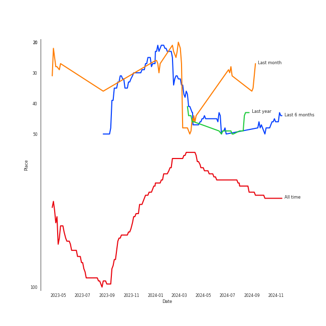

# AKMU

## Relationships

AKMU:
- has member LEE CHANHYUK
- has member 이찬혁 (Lee, Chanhyeok)
- has member 이수현 (Lee, Suhyun)

## Artist Rank
AKMU is currently:
- The #28 artist of the last 6 months

## Top Tracks

### Top tracks of the last month over time

## Featured on Playlists
| Art | Tracks | Playlist |
|:---|---:|:---|
|  | 9 | [K-R&B](../../playlists/k_r_b/overview.md) |
|  | 2 | [K-Pop](../../playlists/k_pop/overview.md) |
|  | 2 | [K-Pop Favorites](../../playlists/k_pop_favorites/overview.md) |
|  | 2 | [Recent Comebacks](../../playlists/recent_comebacks/overview.md) |
|  | 1 | [Summer](../../playlists/summer/overview.md) |
|  | 1 | [Workout](../../playlists/workout/overview.md) |
|  | 1 | [Recommendations for Jeff](../../playlists/recommendations_for_jeff/overview.md) |
|  | 1 | [Chill](../../playlists/chill/overview.md) |

## Top Albums

| Art | Tracks | 💚 | Album | Release Date | 🔗 |
|:---|---:|---:|:---|:---|:---|
|  | 3 | 3 | SAILING | 2019-09-25 | [🔗](https://open.spotify.com/album/7C0Ci0alKWwwXPIFYEdVcn) |
|  | 2 | 2 | SPRING | 2016-05-04 | [🔗](https://open.spotify.com/album/0HtbFp1B1WrbUr9mcBrAhN) |
|  | 2 | 2 | PLAY | 2014-04-07 | [🔗](https://open.spotify.com/album/1eu07xRE0vQfN5et0Y3DAy) |
|  | 2 | 2 | Love Lee | 2023-08-21 | [🔗](https://open.spotify.com/album/47xcjDSi1t6pQE2RvXKdUF) |
|  | 1 | 1 | NEXT EPISODE | 2021-07-26 | [🔗](https://open.spotify.com/album/0Pt0eGpyNO5dDN8PORypSy) |

## Top Record Labels

| Tracks | 💚 | Label |
|---:|---:|:---|
| 10 | 10 | [YG Entertainment](../../labels/yg_entertainment/overview.md) |

## Genres

- [k-pop](../../genres/k_pop/overview.md)

## Credits

### Member Credits

| | 이찬혁 (Lee, Chanhyeok) |
|:---|---:|
| Lyricist | 3 |
| Songwriter | 2 |
### Production Credits

| Art | Track | Members | Credit Types |
|:---|:---|:---|:---|
|  | Melted | 이찬혁 (Lee, Chanhyeok) | Lyricist, Songwriter |
|  | Ah puh | 이찬혁 (Lee, Chanhyeok) | Lyricist, Songwriter |
|  | BATTER UP | 이찬혁 (Lee, Chanhyeok) | Lyricist |

## Top Producers

| Art | Producer | Tracks | Credit Types |
|:---|:---|---:|:---|
| | 이찬혁 (Lee, Chanhyeok) | 1 | Lyricist, Songwriter |

## Tracks

| Art | Track | Album | Artists | Label | 💚 | 🔗 |
|:---|:---|:---|:---|:---|:---|:---|
|  | 200% | PLAY | [AKMU](overview.md) | [YG Entertainment](../../labels/yg_entertainment) | 💚 | [🔗](https://open.spotify.com/track/6qkx0tenDglbF21CU4wa1k) |
|  | Melted | PLAY | [AKMU](overview.md) | [YG Entertainment](../../labels/yg_entertainment) | 💚 | [🔗](https://open.spotify.com/track/2tYPFWrbGbsGKafe5pP64z) |
|  | How People Move | SPRING | [AKMU](overview.md) | [YG Entertainment](../../labels/yg_entertainment) | 💚 | [🔗](https://open.spotify.com/track/0c2Yg75sFgD0hWhRq4voAn) |
|  | RE-BYE | SPRING | [AKMU](overview.md) | [YG Entertainment](../../labels/yg_entertainment) | 💚 | [🔗](https://open.spotify.com/track/7pz1YzMwDxS9uuwAEp7MLk) |
|  | FREEDOM | SAILING | [AKMU](overview.md) | [YG Entertainment](../../labels/yg_entertainment) | 💚 | [🔗](https://open.spotify.com/track/3vu2YlsxVFIb8xz8ZBAwiX) |
|  | How can I love the heartbreak, you're the one I love | SAILING | [AKMU](overview.md) | [YG Entertainment](../../labels/yg_entertainment) | 💚 | [🔗](https://open.spotify.com/track/0hqj5JBnFt1BHEz2UCFwrl) |
|  | Whale | SAILING | [AKMU](overview.md) | [YG Entertainment](../../labels/yg_entertainment) | 💚 | [🔗](https://open.spotify.com/track/5OJ275pPDWTd2qWX4kbhXj) |
|  | NAKKA (with IU) | NEXT EPISODE | [AKMU](overview.md), [IU](../iu/overview.md) | [YG Entertainment](../../labels/yg_entertainment) | 💚 | [🔗](https://open.spotify.com/track/4t2FIqZJORKZGSKg30SShr) |
|  | Fry’s Dream | Love Lee | [AKMU](overview.md) | [YG Entertainment](../../labels/yg_entertainment) | 💚 | [🔗](https://open.spotify.com/track/6f4CAdAmrOfGH3FOfwHMSV) |
|  | Love Lee | Love Lee | [AKMU](overview.md) | [YG Entertainment](../../labels/yg_entertainment) | 💚 | [🔗](https://open.spotify.com/track/1qosh64U6CR5ki1g1Rf2dZ) |
