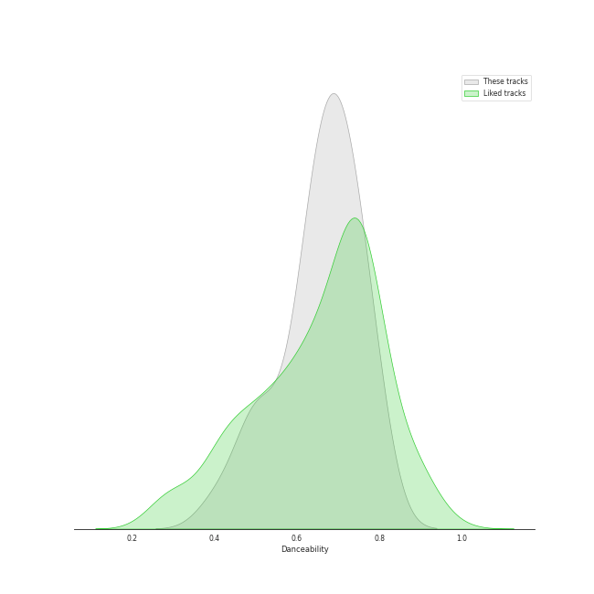
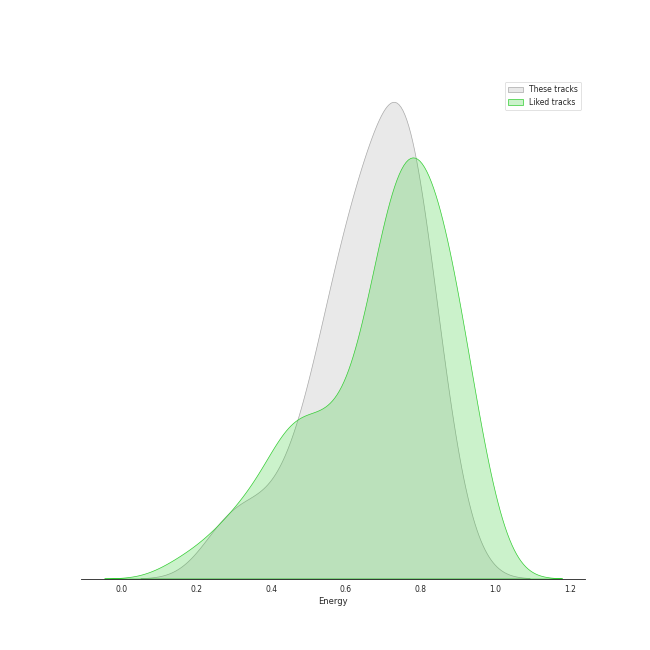
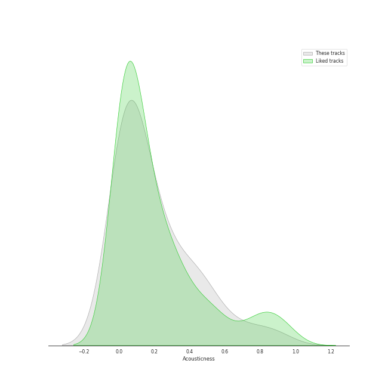
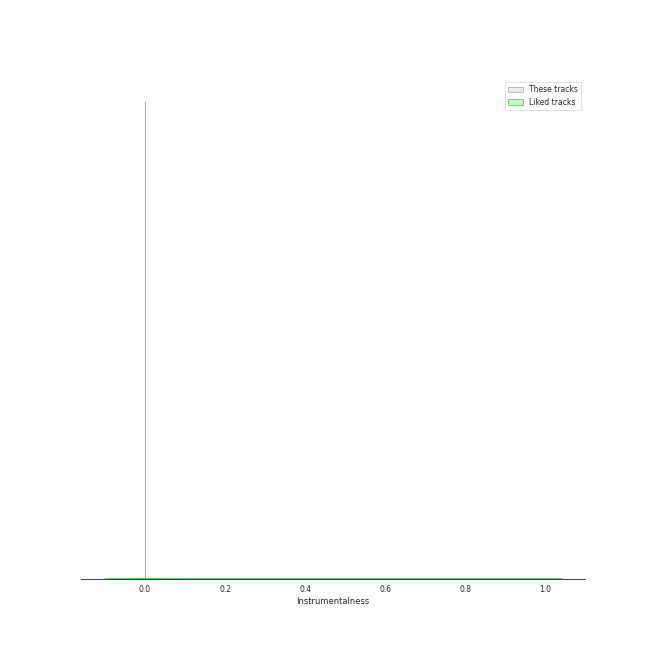
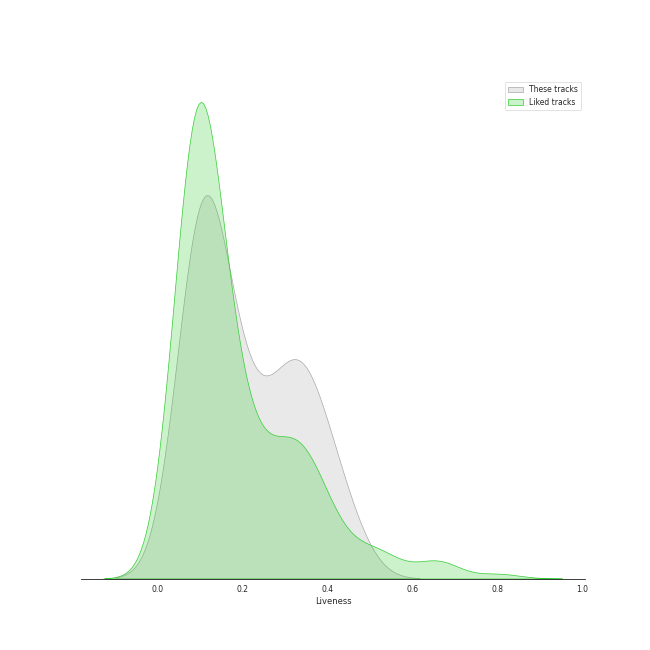
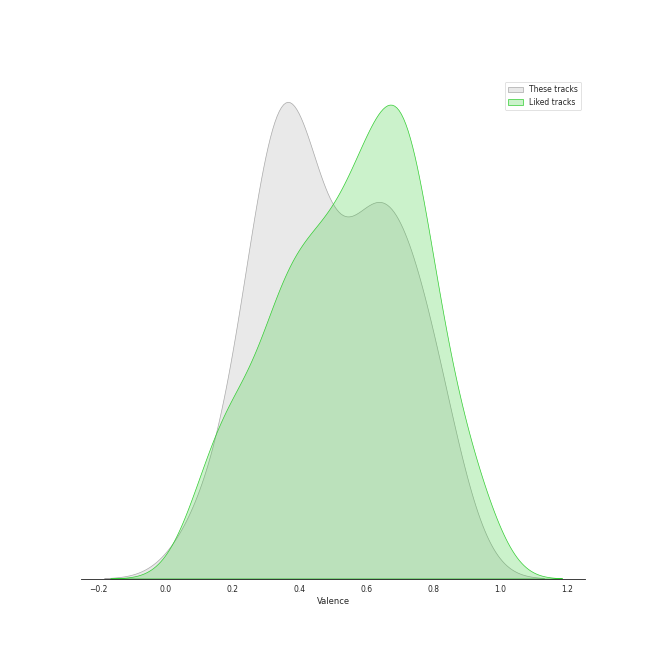

# Audio Features for Ariana Grande

## Danceability

| 10 most Danceable tracks | 10 least Danceable tracks |
|:---|:---|
| motive (with Doja Cat) (0.789) | boyfriend (with Social House) (0.4) |
| 7 rings (0.778) | pov (0.487) |
| Santa Baby (0.748) | Last Christmas (0.504) |
| positions (0.737) | Santa Tell Me (0.525) |
| imagine (0.729) | My Everything (0.54) |
| break up with your girlfriend, i'm bored (0.726) | breathin (0.568) |
| Baby I (0.725) | Stuck with U (with Justin Bieber) (0.597) |
| thank u, next (0.717) | Greedy (0.619) |
| Bang Bang (0.703) | Into You (0.623) |
| no tears left to cry (0.699) | One Last Time (0.628) |

## Energy

| 10 most Energetic tracks | 10 least Energetic tracks |
|:---|:---|
| Focus (0.876) | My Everything (0.265) |
| Rain On Me (with Ariana Grande) (0.855) | 7 rings (0.317) |
| Problem (0.805) | Stuck with U (with Justin Bieber) (0.45) |
| positions (0.802) | imagine (0.475) |
| Last Christmas (0.8) | pov (0.534) |
| Baby I (0.796) | break up with your girlfriend, i'm bored (0.554) |
| boyfriend (with Social House) (0.795) | One Last Time (0.593) |
| Santa Baby (0.778) | Dangerous Woman (0.602) |
| Don’t Call Me Angel (Charlie’s Angels) (with Miley Cyrus & Lana Del Rey) (0.755) | Honeymoon Avenue (0.608) |
| Bang Bang (0.747) | Santa Tell Me (0.621) |

## Speechiness

| 10 most Speechy tracks | 10 least Speechy tracks |
|:---|:---|
| boyfriend (with Social House) (0.461) | My Everything (0.0297) |
| 7 rings (0.334) | One Last Time (0.0323) |
| Focus (0.239) | Baby I (0.0326) |
| Side To Side (0.229) | imagine (0.0364) |
| Problem (0.153) | Last Christmas (0.0391) |
| Santa Baby (0.137) | Rain On Me (with Ariana Grande) (0.0397) |
| Santa Tell Me (0.116) | Honeymoon Avenue (0.041) |
| Into You (0.107) | Dangerous Woman (0.0412) |
| Greedy (0.099) | Stuck with U (with Justin Bieber) (0.0418) |
| break up with your girlfriend, i'm bored (0.0917) | breathin (0.0433) |

## Acousticness

| 10 most Acoustic tracks | 10 least Acoustic tracks |
|:---|:---|
| My Everything (0.88) | Don’t Call Me Angel (Charlie’s Angels) (with Miley Cyrus & Lana Del Rey) (0.00237) |
| 7 rings (0.592) | Break Free (0.0064) |
| positions (0.468) | Baby I (0.0154) |
| imagine (0.378) | Into You (0.0162) |
| pov (0.36) | Problem (0.0192) |
| Bang Bang (0.283) | Rain On Me (with Ariana Grande) (0.021) |
| Focus (0.266) | breathin (0.0211) |
| thank u, next (0.229) | Greedy (0.0323) |
| Stuck with U (with Justin Bieber) (0.223) | no tears left to cry (0.04) |
| Honeymoon Avenue (0.218) | break up with your girlfriend, i'm bored (0.0421) |

## Instrumentalness

| 10 most Instrumental tracks | 10 least Instrumental tracks |
|:---|:---|
| Break Free (4.35e-05) | boyfriend (with Social House) (0.0) |
| breathin (1.37e-05) | Santa Tell Me (0.0) |
| Problem (8.83e-06) | Greedy (0.0) |
| Don’t Call Me Angel (Charlie’s Angels) (with Miley Cyrus & Lana Del Rey) (7.64e-06) | Focus (0.0) |
| no tears left to cry (3.11e-06) | Honeymoon Avenue (0.0) |
| Into You (1.75e-06) | positions (0.0) |
| One Last Time (1.65e-06) | imagine (0.0) |
| Rain On Me (with Ariana Grande) (0.0) | pov (0.0) |
| 7 rings (0.0) | thank u, next (0.0) |
| Santa Baby (0.0) | Side To Side (0.0) |

## Liveness

| 10 most Live tracks | 10 least Live tracks |
|:---|:---|
| Focus (0.444) | Don’t Call Me Angel (Charlie’s Angels) (with Miley Cyrus & Lana Del Rey) (0.0859) |
| Bang Bang (0.396) | 7 rings (0.0881) |
| Stuck with U (with Justin Bieber) (0.382) | Greedy (0.0919) |
| Dangerous Woman (0.356) | positions (0.0931) |
| Baby I (0.354) | One Last Time (0.096) |
| Honeymoon Avenue (0.348) | pov (0.1) |
| Rain On Me (with Ariana Grande) (0.323) | thank u, next (0.101) |
| no tears left to cry (0.294) | break up with your girlfriend, i'm bored (0.106) |
| Santa Tell Me (0.294) | Last Christmas (0.109) |
| Santa Baby (0.284) | imagine (0.12) |

## Valence

| 10 most Happy tracks | 10 least Happy tracks |
|:---|:---|
| Greedy (0.844) | One Last Time (0.104) |
| Focus (0.8) | pov (0.173) |
| Last Christmas (0.789) | Break Free (0.284) |
| Santa Baby (0.777) | Dangerous Woman (0.289) |
| boyfriend (with Social House) (0.702) | 7 rings (0.327) |
| Bang Bang (0.7) | Don’t Call Me Angel (Charlie’s Angels) (with Miley Cyrus & Lana Del Rey) (0.334) |
| positions (0.682) | break up with your girlfriend, i'm bored (0.335) |
| motive (with Doja Cat) (0.661) | no tears left to cry (0.354) |
| Rain On Me (with Ariana Grande) (0.646) | breathin (0.364) |
| Problem (0.625) | Into You (0.37) |

## Tempo

| 10 most Fast tracks | 10 least Fast tracks |
|:---|:---|
| Last Christmas (205.945) | My Everything (61.975) |
| Santa Tell Me (191.9) | imagine (62.52) |
| boyfriend (with Social House) (190.097) | Santa Baby (95.989) |
| Stuck with U (with Justin Bieber) (178.765) | Focus (100.016) |
| break up with your girlfriend, i'm bored (169.999) | breathin (100.049) |
| Side To Side (159.173) | Baby I (101.976) |
| Bang Bang (149.974) | Don’t Call Me Angel (Charlie’s Angels) (with Miley Cyrus & Lana Del Rey) (102.861) |
| positions (144.015) | Problem (103.008) |
| 7 rings (140.048) | thank u, next (106.966) |
| Dangerous Woman (134.049) | Into You (107.853) |
