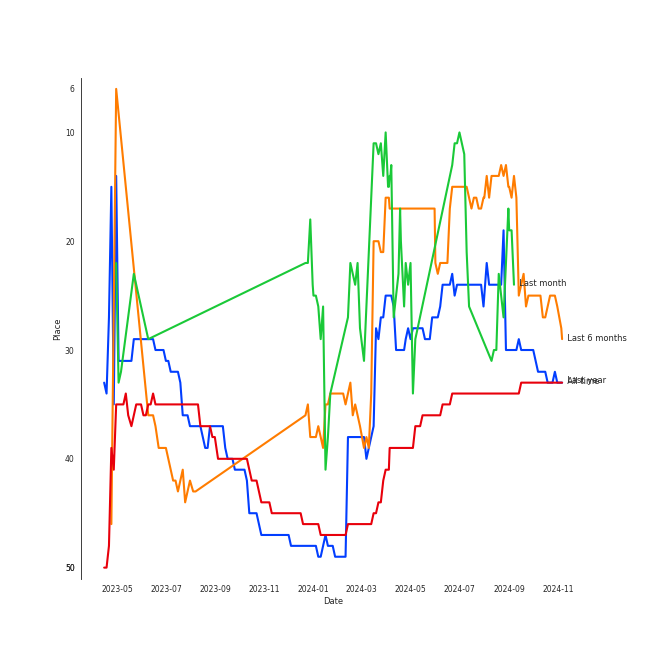
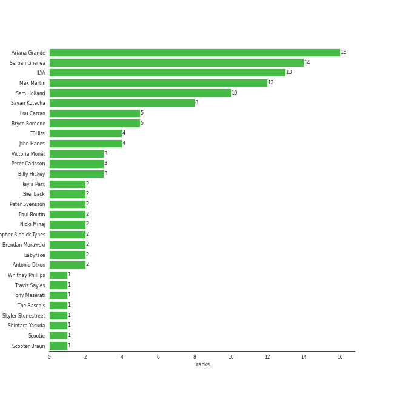

# Ariana Grande

[See Track Features](audio_features.md)

[See Clusters](clusters/overview.md)

## Artist Rank
Ariana Grande is currently:
- The #11 artist of the last month
- The #22 artist of the last 6 months
- The #28 artist of all time

## Featured on Playlists
| Art | Tracks | Playlist |
|:---|---:|:---|
|  | 31 | [Pop](../../playlists/pop/overview.md) |
|  | 7 | [Chill](../../playlists/chill/overview.md) |
|  | 4 | [Workout](../../playlists/workout/overview.md) |
|  | 3 | [Christmas](../../playlists/christmas/overview.md) |
|  | 1 | [Relax](../../playlists/relax/overview.md) |

## Top Albums

| Art | Tracks | 💚 | Album | Release Date | 🔗 |
|:---|---:|---:|:---|:---|:---|
|  | 6 | 3 | eternal sunshine | 2024-03-08 | [🔗](https://open.spotify.com/album/5EYKrEDnKhhcNxGedaRQeK) |
|  | 5 | 4 | My Everything (Deluxe) | 2014-08-25 | [🔗](https://open.spotify.com/album/6EVYTRG1drKdO8OnIQBeEj) |
|  | 4 | 3 | Dangerous Woman | 2016-05-20 | [🔗](https://open.spotify.com/album/3pdKKSqqLVIKmRTGw0x2N7) |
|  | 4 | 2 | thank u, next | 2019-02-08 | [🔗](https://open.spotify.com/album/2fYhqwDWXjbpjaIJPEfKFw) |
|  | 3 | 1 | Positions | 2020-10-30 | [🔗](https://open.spotify.com/album/3euz4vS7ezKGnNSwgyvKcd) |
|  | 2 | 2 | Yours Truly | 2013-01-01 | [🔗](https://open.spotify.com/album/5xSvNPstcxHtR4ap2vvN8A) |
|  | 2 | 2 | Sweetener | 2018-08-17 | [🔗](https://open.spotify.com/album/3tx8gQqWbGwqIGZHqDNrGe) |
|  | 2 | 0 | Christmas Kisses | 2013-01-01 | [🔗](https://open.spotify.com/album/5MfeQZrrNfMqcaq03U9qOr) |
|  | 1 | 1 | Stuck with U | 2020-05-08 | [🔗](https://open.spotify.com/album/5mUdh6YWnUvf0MfklEk1oi) |
|  | 1 | 1 | Focus | 2015-10-30 | [🔗](https://open.spotify.com/album/3IGM1sXYke2UGII2DORrof) |

See all albums

| Art | Tracks | 💚 | Album | Release Date | 🔗 |
|:---|---:|---:|:---|:---|:---|
|  | 1 | 0 | boyfriend | 2019-08-02 | [🔗](https://open.spotify.com/album/3zVB99XMdbP9HTVNg0GJwV) |
|  | 1 | 0 | Santa Tell Me | 2014-11-24 | [🔗](https://open.spotify.com/album/27MNgBEnLCKoafz1g2Zu97) |
|  | 1 | 0 | Chromatica | 2020-05-29 | [🔗](https://open.spotify.com/album/05c49JgPmL4Uz2ZeqRx5SP) |
|  | 1 | 0 | Charlie's Angels (Original Motion Picture Soundtrack) | 2019-11-01 | [🔗](https://open.spotify.com/album/4NBuascXb3uK0mFUYuJ63f) |

## Top Record Labels

| Tracks | 💚 | Label |
|---:|---:|:---|
| 15 | 10 | [Universal Music LLC](../../labels/universal_music_llc/overview.md) |
| 16 | 8 | [Republic Records](../../labels/republic_records/overview.md) |
| 1 | 1 | Ariana Grande & Justin Bieber "Stuck With U"- Charity |
| 1 | 0 | Silver Cloud |
| 1 | 0 | [Interscope Records](../../labels/interscope_records/overview.md) |
| 1 | 0 | Charlie's Angels |

## Genres

- [pop](../../genres/pop/overview.md)

## Credits

### Credits by Type

| Credit Type | Tracks |
|:---|---:|
| Arranger | 1 |
| Lyricist | 4 |
| Performer | 2 |
| Producer | 8 |
| Songwriter | 15 |
| Vocal | 9 |

### Production Credits

| Art | Track | Credit Types |
|:---|:---|:---|
|  | My Everything | Songwriter |
|  | Problem | Songwriter |
|  | Problem (Ariana Grande Cover) | Songwriter |
|  | Focus | Songwriter |
|  | Side To Side | Songwriter |
|  | no tears left to cry | Songwriter |
|  | breathin | Songwriter |
|  | imagine | Producer, Songwriter |
|  | 7 rings | Producer, Songwriter |
|  | Stuck with U (with Justin Bieber) | Producer, Songwriter |

View all

| Art | Track | Credit Types |
|:---|:---|:---|
|  | positions | Arranger, Producer, Songwriter |
|  | we can't be friends (wait for your love) | Lyricist, Producer, Songwriter |
|  | yes, and? | Lyricist, Producer, Songwriter |
|  | imperfect for you | Lyricist, Producer, Songwriter |
| | nan | Lyricist, Producer, Songwriter |

## Top Producers

| Art | Producer | Tracks | Credit Types |
|:---|:---|---:|:---|
|  | [Ariana Grande](overview.md) | 13 | Lyricist, Producer, Songwriter, Arranger |
| | [Serban Ghenea](../../producers/serban_ghenea/overview.md) | 11 | Producer |
| | [ILYA](../../producers/ilya/overview.md) | 10 | Producer, Arranger, Songwriter |
| | [Max Martin](../../producers/max_martin/overview.md) | 9 | Producer, Songwriter, Arranger, Lyricist |
| | Savan Kotecha | 7 | Songwriter, Producer |
| | [Sam Holland](../../producers/sam_holland/overview.md) | 7 | Producer |
| | TBHits | 4 | Producer, Songwriter |
| | [John Hanes](../../producers/john_hanes/overview.md) | 4 | Producer |
| | Billy Hickey | 3 | Producer |
| | Peter Carlsson | 3 | Producer |

View all

| Art | Producer | Tracks | Credit Types |
|:---|:---|---:|:---|
|  | Victoria Monét | 3 | Producer, Songwriter |
| | Lou Carrao | 3 | Producer |
| | Bryce Bordone | 3 | Producer |
| | [Shellback](../../producers/shellback/overview.md) | 2 | Producer |
| | Paul Boutin | 2 | Producer |
| | Brendan Morawski | 2 | Producer |
|  | Nicki Minaj | 2 | Songwriter |
| | Peter Svensson | 2 | Songwriter |
| | Tayla Parx | 2 | Songwriter |
| | Khristopher Riddick-Tynes | 2 | Producer, Songwriter |
| | Antonio Dixon | 2 | Arranger, Producer, Songwriter |
| | Babyface | 2 | Producer, Songwriter |
| | Noah Passovoy | 1 | Producer |
| | Lionel Crasta | 1 | Producer |
| | Rami | 1 | Producer, Songwriter |
| | Jameel Roberts | 1 | Songwriter |
| | Oscar Hammerstein II | 1 | Lyricist |
| | Alexander Kronlund | 1 | Songwriter |
| | Priscilla Renea | 1 | Songwriter |
| | Peter Kahm | 1 | Producer, Songwriter |
| | Dennis Jenkins | 1 | Songwriter |
| | Pop Wansel | 1 | Producer, Songwriter |
| | Randy Ellis | 1 | Arranger |
| | Giorgio Tuinfort | 1 | Producer, Songwriter |
|  | [Justin Bieber](../justin_bieber/overview.md) | 1 | Songwriter |
| | [Josh Gudwin](../../producers/josh_gudwin/overview.md) | 1 | Producer |
| | Angelina Barrett | 1 | Songwriter |
| | Jaycen Joshua | 1 | Producer |
| | Carl Falk | 1 | Producer, Songwriter |
| | Joe Gallagher | 1 | Producer |
| | Devin Nakao | 1 | Producer |
| | Scootie | 1 | Producer, Songwriter |
| | Gian Stone | 1 | Producer, Songwriter |
| | Kuk Harrell | 1 | Producer |
| | Ross Golan | 1 | Songwriter |
| | Gregg Rominiecki | 1 | Producer |
| | Eric Weaver | 1 | Producer |
| | Happy Perez | 1 | Producer, Songwriter |
| | Roahn Hylton | 1 | Songwriter |
| | Travis Sayles | 1 | Producer, Songwriter |
| | Michael "Mikey" Foster | 1 | Producer, Songwriter |
| | Nija | 1 | Songwriter |
| | Davide Rossi | 1 | Arranger |
| | Brian Vincent Bates | 1 | Songwriter |
| | Bill Meyers | 1 | Arranger |
| | Njomza | 1 | Songwriter |
| | Patrick "j.Que" Smith | 1 | Songwriter |
| | Scooter Braun | 1 | Songwriter |
|  | David Guetta | 1 | Songwriter |
| | Richard Rodgers | 1 | Songwriter |
|  | Iggy Azalea | 1 | Songwriter |
| | Skyler Stonestreet | 1 | Songwriter |
| | Leon Thomas | 1 | Songwriter |
| | Rickard Göransson (Göransson, Rickard) | 1 | Producer, Songwriter |
| | Whitney Phillips | 1 | Songwriter |
| | Mr. Franks | 1 | Producer, Songwriter |
| | Kaydence | 1 | Songwriter |
| | London on da Track | 1 | Producer, Songwriter |
| | Jason Evigan | 1 | Producer |
| | [Tony Maserati](../../producers/tony_maserati/overview.md) | 1 | Producer |
| | Rafael Fadul | 1 | Producer |
| | Freddy Wexler | 1 | Producer, Songwriter |
| | Matt Squire | 1 | Producer |
| | The Rascals | 1 | Producer |
| | Johan Carlsson | 1 | Songwriter |

## Tracks

| Art | Track | Album | Artists | Label | Score | 💚 | 🔗 |
|:---|:---|:---|:---|:---|---:|:---|:---|
|  | Santa Tell Me | Santa Tell Me | [Ariana Grande](overview.md) | [Universal Records](../../labels/universal_music_llc) | 112 | | [🔗](https://open.spotify.com/track/0lizgQ7Qw35od7CYaoMBZb) |
|  | imagine | thank u, next | [Ariana Grande](overview.md) | [Republic Records](../../labels/republic_records) | 58 | 💚 | [🔗](https://open.spotify.com/track/39LmTF9RgyakzSYX8txrow) |
|  | Last Christmas | Christmas Kisses | [Ariana Grande](overview.md) | [Universal Records](../../labels/universal_music_llc) | 0 | | [🔗](https://open.spotify.com/track/5xDrO9DEDJGUQGfyoHvgDJ) |
|  | Santa Baby | Christmas Kisses | [Ariana Grande](overview.md), Liz Gillies | [Universal Records](../../labels/universal_music_llc) | 0 | | [🔗](https://open.spotify.com/track/6YJdPrH3i2POzu7hdHIRrb) |
|  | Baby I | Yours Truly | [Ariana Grande](overview.md) | [Universal Records](../../labels/universal_music_llc) | 0 | 💚 | [🔗](https://open.spotify.com/track/6EIsMa5lbvljYxqCkjZVDi) |
|  | Honeymoon Avenue | Yours Truly | [Ariana Grande](overview.md) | [Universal Records](../../labels/universal_music_llc) | 0 | 💚 | [🔗](https://open.spotify.com/track/2ofOe2OaXFpZF5ETbsc7Qu) |
|  | Bang Bang | My Everything (Deluxe) | Jessie J, [Ariana Grande](overview.md), Nicki Minaj | [Universal Records](../../labels/universal_music_llc) | 0 | 💚 | [🔗](https://open.spotify.com/track/466s1BacUmiRdR3ISvNjyx) |
|  | Break Free | My Everything (Deluxe) | [Ariana Grande](overview.md), Zedd | [Universal Records](../../labels/universal_music_llc) | 0 | | [🔗](https://open.spotify.com/track/12KUFSHFgT0XCoiSlvdQi4) |
|  | My Everything | My Everything (Deluxe) | [Ariana Grande](overview.md) | [Universal Records](../../labels/universal_music_llc) | 0 | 💚 | [🔗](https://open.spotify.com/track/4eumFsTnduH3zRfaASoAPs) |
|  | One Last Time | My Everything (Deluxe) | [Ariana Grande](overview.md) | [Universal Records](../../labels/universal_music_llc) | 0 | 💚 | [🔗](https://open.spotify.com/track/7xoUc6faLbCqZO6fQEYprd) |

See all tracks

| Art | Track | Album | Artists | Label | Score | 💚 | 🔗 |
|:---|:---|:---|:---|:---|---:|:---|:---|
|  | Problem | My Everything (Deluxe) | [Ariana Grande](overview.md), Iggy Azalea | [Universal Records](../../labels/universal_music_llc) | 0 | 💚 | [🔗](https://open.spotify.com/track/7vS3Y0IKjde7Xg85LWIEdP) |
|  | Focus | Focus | [Ariana Grande](overview.md) | [Universal Records](../../labels/universal_music_llc) | 0 | 💚 | [🔗](https://open.spotify.com/track/1cdzfFjEbUbgTm5nv3FgXR) |
|  | Dangerous Woman | Dangerous Woman | [Ariana Grande](overview.md) | [Universal Records](../../labels/universal_music_llc) | 0 | 💚 | [🔗](https://open.spotify.com/track/6RUhbFEhrvGISaQ8u2j2JN) |
|  | Greedy | Dangerous Woman | [Ariana Grande](overview.md) | [Universal Records](../../labels/universal_music_llc) | 0 | | [🔗](https://open.spotify.com/track/1FFUXkoWIc9of8yOscGiaC) |
|  | Into You | Dangerous Woman | [Ariana Grande](overview.md) | [Universal Records](../../labels/universal_music_llc) | 0 | 💚 | [🔗](https://open.spotify.com/track/63y6xWR4gXz7bnUGOk8iI6) |
|  | Side To Side | Dangerous Woman | [Ariana Grande](overview.md), Nicki Minaj | [Universal Records](../../labels/universal_music_llc) | 0 | 💚 | [🔗](https://open.spotify.com/track/43bCmCI0nSgcT7QdMXY6LV) |
|  | breathin | Sweetener | [Ariana Grande](overview.md) | [Republic Records](../../labels/republic_records) | 0 | 💚 | [🔗](https://open.spotify.com/track/4OafepJy2teCjYJbvFE60J) |
|  | no tears left to cry | Sweetener | [Ariana Grande](overview.md) | [Republic Records](../../labels/republic_records) | 0 | 💚 | [🔗](https://open.spotify.com/track/2qT1uLXPVPzGgFOx4jtEuo) |
|  | 7 rings | thank u, next | [Ariana Grande](overview.md) | [Republic Records](../../labels/republic_records) | 0 | 💚 | [🔗](https://open.spotify.com/track/6ocbgoVGwYJhOv1GgI9NsF) |
|  | break up with your girlfriend, i'm bored | thank u, next | [Ariana Grande](overview.md) | [Republic Records](../../labels/republic_records) | 0 | | [🔗](https://open.spotify.com/track/4kV4N9D1iKVxx1KLvtTpjS) |
|  | thank u, next | thank u, next | [Ariana Grande](overview.md) | [Republic Records](../../labels/republic_records) | 0 | | [🔗](https://open.spotify.com/track/3e9HZxeyfWwjeyPAMmWSSQ) |
|  | boyfriend (with Social House) | boyfriend | [Ariana Grande](overview.md), Social House | [Republic Records](../../labels/republic_records) | 0 | | [🔗](https://open.spotify.com/track/0Ryd8975WihbObpp5cPW1t) |
|  | Don’t Call Me Angel (Charlie’s Angels) (with Miley Cyrus & Lana Del Rey) | Charlie's Angels (Original Motion Picture Soundtrack) | [Ariana Grande](overview.md), Miley Cyrus, [Lana Del Rey](../lana_del_rey/overview.md) | Silver Cloud/Charlie's Angels | 0 | | [🔗](https://open.spotify.com/track/6zegtH6XXd2PDPLvy1Y0n2) |
|  | Stuck with U (with Justin Bieber) | Stuck with U | [Ariana Grande](overview.md), [Justin Bieber](../justin_bieber/overview.md) | Ariana Grande & Justin Bieber "Stuck With U"- Charity | 0 | 💚 | [🔗](https://open.spotify.com/track/4HBZA5flZLE435QTztThqH) |
|  | Rain On Me (with Ariana Grande) | Chromatica | [Lady Gaga](../lady_gaga/overview.md), [Ariana Grande](overview.md) | [Interscope](../../labels/interscope_records) | 0 | | [🔗](https://open.spotify.com/track/7ju97lgwC2rKQ6wwsf9no9) |
|  | motive (with Doja Cat) | Positions | [Ariana Grande](overview.md), [Doja Cat](../doja_cat/overview.md) | [Republic Records](../../labels/republic_records) | 0 | | [🔗](https://open.spotify.com/track/5GkQIP5mWPi4KZLLXeuFTT) |
|  | positions | Positions | [Ariana Grande](overview.md) | [Republic Records](../../labels/republic_records) | 0 | 💚 | [🔗](https://open.spotify.com/track/35mvY5S1H3J2QZyna3TFe0) |
|  | pov | Positions | [Ariana Grande](overview.md) | [Republic Records](../../labels/republic_records) | 0 | | [🔗](https://open.spotify.com/track/3UoULw70kMsiVXxW0L3A33) |
|  | imperfect for you | eternal sunshine | [Ariana Grande](overview.md) | [Republic Records](../../labels/republic_records) | 0 | 💚 | [🔗](https://open.spotify.com/track/6XXKB32Om6WuXg3uEWwTob) |
|  | ordinary things (feat. Nonna) | eternal sunshine | [Ariana Grande](overview.md), Nonna | [Republic Records](../../labels/republic_records) | 0 | | [🔗](https://open.spotify.com/track/4mHM5d2fK3n8xgymjf92w2) |
|  | the boy is mine | eternal sunshine | [Ariana Grande](overview.md) | [Republic Records](../../labels/republic_records) | 0 | | [🔗](https://open.spotify.com/track/0Lmbke3KNVFXtoH2mMSHCw) |
|  | true story | eternal sunshine | [Ariana Grande](overview.md) | [Republic Records](../../labels/republic_records) | 0 | | [🔗](https://open.spotify.com/track/14kyXBpg91RVq8bNRDS1q2) |
|  | we can't be friends (wait for your love) | eternal sunshine | [Ariana Grande](overview.md) | [Republic Records](../../labels/republic_records) | 0 | 💚 | [🔗](https://open.spotify.com/track/51ZQ1vr10ffzbwIjDCwqm4) |
|  | yes, and? | eternal sunshine | [Ariana Grande](overview.md) | [Republic Records](../../labels/republic_records) | 0 | 💚 | [🔗](https://open.spotify.com/track/5D34wRmbFS29AjtTOP2QJe) |

