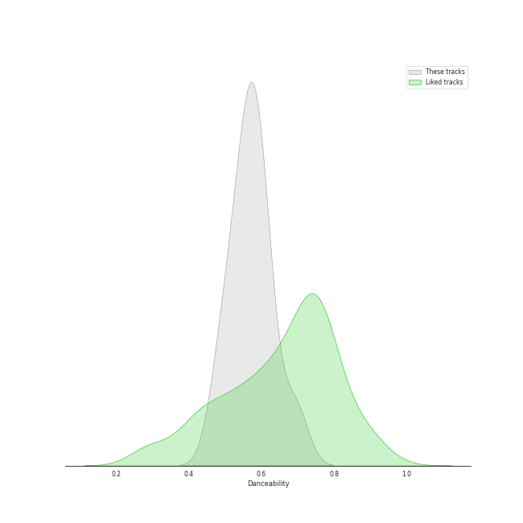
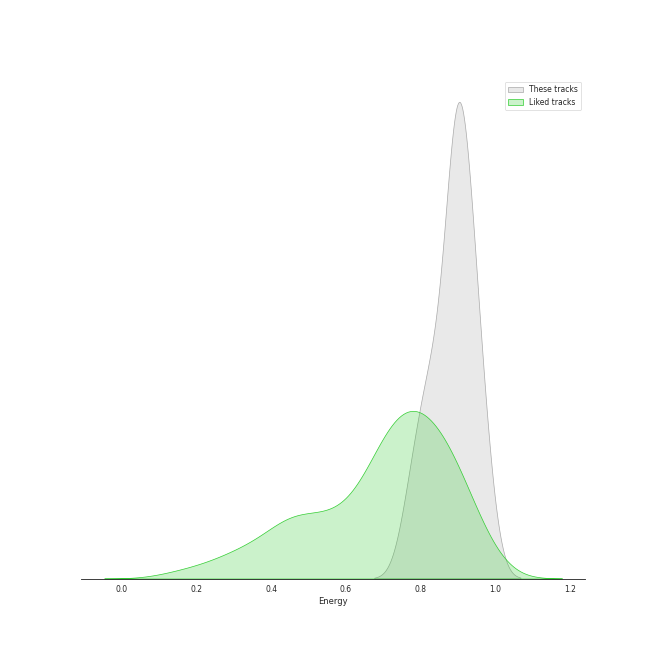
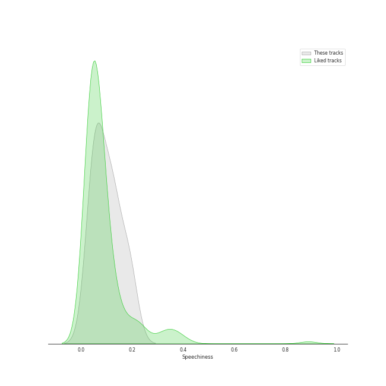
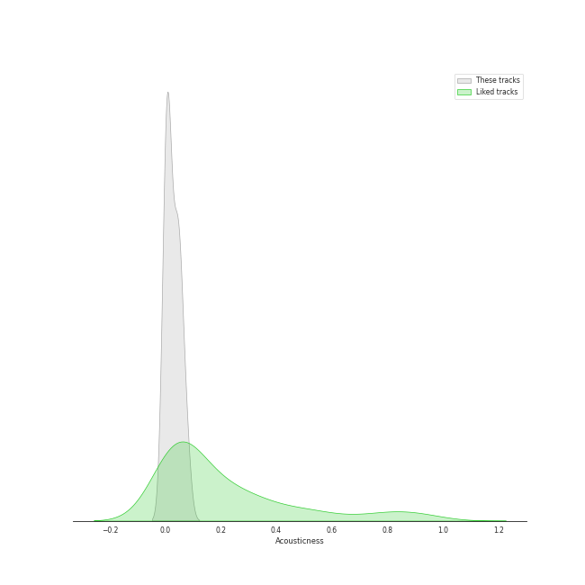
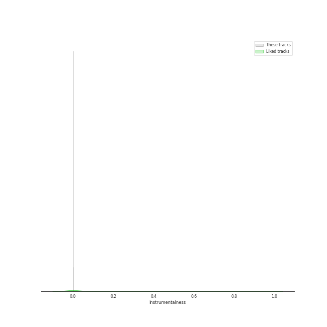
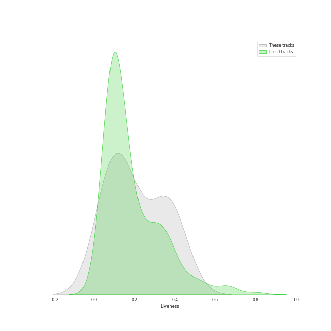
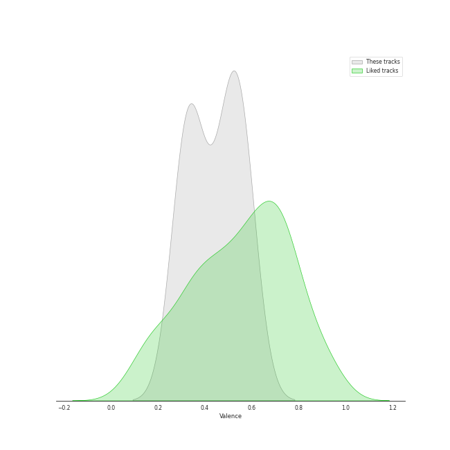
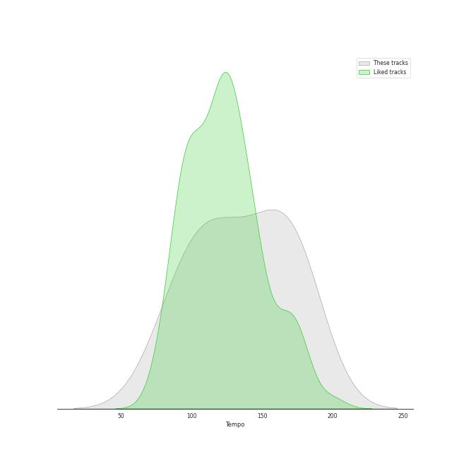

# Track Features for ATEEZ

## Danceability

| ​ | 10 most Danceable tracks | ​​ | 10 least Danceable tracks |
|:---|:---|:---|:---|
|  | Crazy Form (0.83) |  | HALAZIA (0.482) |
|  | Deja Vu (0.692) |  | Pirate King (0.508) |
|  | The Real (0.616) |  | BOUNCY (K-HOT CHILLI PEPPERS) (0.532) |
|  | The Black Cat Nero (0.604) |  | Guerrilla (0.555) |
|  | Cyberpunk (0.598) |  | Answer (0.565) |
|  | WONDERLAND (0.571) |  | HALA HALA (Hearts Awakened, Live Alive) (0.57) |
|  | HALA HALA (Hearts Awakened, Live Alive) (0.57) |  | WONDERLAND (0.571) |
|  | Answer (0.565) |  | Cyberpunk (0.598) |
|  | Guerrilla (0.555) |  | The Black Cat Nero (0.604) |
|  | BOUNCY (K-HOT CHILLI PEPPERS) (0.532) |  | The Real (0.616) |

## Energy

| ​ | 10 most Energetic tracks | ​​ | 10 least Energetic tracks |
|:---|:---|:---|:---|
|  | WONDERLAND (0.964) |  | HALA HALA (Hearts Awakened, Live Alive) (0.778) |
|  | Pirate King (0.947) |  | Crazy Form (0.791) |
|  | Cyberpunk (0.924) |  | The Real (0.821) |
|  | The Black Cat Nero (0.903) |  | Deja Vu (0.835) |
|  | Answer (0.903) |  | HALAZIA (0.884) |
|  | BOUNCY (K-HOT CHILLI PEPPERS) (0.896) |  | Guerrilla (0.89) |
|  | Guerrilla (0.89) |  | BOUNCY (K-HOT CHILLI PEPPERS) (0.896) |
|  | HALAZIA (0.884) |  | Answer (0.903) |
|  | Deja Vu (0.835) |  | The Black Cat Nero (0.903) |
|  | The Real (0.821) |  | Cyberpunk (0.924) |

## Speechiness

| ​ | 10 most Speechy tracks | ​​ | 10 least Speechy tracks |
|:---|:---|:---|:---|
|  | HALA HALA (Hearts Awakened, Live Alive) (0.191) |  | The Real (0.0349) |
|  | BOUNCY (K-HOT CHILLI PEPPERS) (0.184) |  | Crazy Form (0.049) |
|  | Guerrilla (0.132) |  | Answer (0.0499) |
|  | WONDERLAND (0.124) |  | Cyberpunk (0.0553) |
|  | Pirate King (0.123) |  | Deja Vu (0.0628) |
|  | The Black Cat Nero (0.091) |  | HALAZIA (0.0668) |
|  | HALAZIA (0.0668) |  | The Black Cat Nero (0.091) |
|  | Deja Vu (0.0628) |  | Pirate King (0.123) |
|  | Cyberpunk (0.0553) |  | WONDERLAND (0.124) |
|  | Answer (0.0499) |  | Guerrilla (0.132) |

## Acousticness

| ​ | 10 most Acoustic tracks | ​​ | 10 least Acoustic tracks |
|:---|:---|:---|:---|
|  | Answer (0.0746) |  | Cyberpunk (0.000265) |
|  | Deja Vu (0.0517) |  | HALAZIA (0.000677) |
|  | WONDERLAND (0.0503) |  | Guerrilla (0.00399) |
|  | Pirate King (0.0427) |  | The Black Cat Nero (0.00799) |
|  | The Real (0.0356) |  | BOUNCY (K-HOT CHILLI PEPPERS) (0.00869) |
|  | Crazy Form (0.027) |  | HALA HALA (Hearts Awakened, Live Alive) (0.0153) |
|  | HALA HALA (Hearts Awakened, Live Alive) (0.0153) |  | Crazy Form (0.027) |
|  | BOUNCY (K-HOT CHILLI PEPPERS) (0.00869) |  | The Real (0.0356) |
|  | The Black Cat Nero (0.00799) |  | Pirate King (0.0427) |
|  | Guerrilla (0.00399) |  | WONDERLAND (0.0503) |

## Instrumentalness

| ​ | 10 most Instrumental tracks | ​​ | 10 least Instrumental tracks |
|:---|:---|:---|:---|
|  | HALAZIA (0.000575) |  | Guerrilla (0.0) |
|  | Cyberpunk (2.05e-05) |  | Crazy Form (0.0) |
|  | Pirate King (3.57e-06) |  | Answer (0.0) |
|  | The Real (3.24e-06) |  | Deja Vu (0.0) |
|  | The Black Cat Nero (2.17e-06) |  | HALA HALA (Hearts Awakened, Live Alive) (0.0) |
|  | WONDERLAND (0.0) |  | BOUNCY (K-HOT CHILLI PEPPERS) (0.0) |
|  | BOUNCY (K-HOT CHILLI PEPPERS) (0.0) |  | WONDERLAND (0.0) |
|  | HALA HALA (Hearts Awakened, Live Alive) (0.0) |  | The Black Cat Nero (2.17e-06) |
|  | Deja Vu (0.0) |  | The Real (3.24e-06) |
|  | Answer (0.0) |  | Pirate King (3.57e-06) |

## Liveness

| ​ | 10 most Live tracks | ​​ | 10 least Live tracks |
|:---|:---|:---|:---|
|  | The Real (0.424) |  | Guerrilla (0.0506) |
|  | Answer (0.359) |  | The Black Cat Nero (0.0578) |
|  | WONDERLAND (0.356) |  | HALAZIA (0.0883) |
|  | Pirate King (0.344) |  | BOUNCY (K-HOT CHILLI PEPPERS) (0.106) |
|  | Crazy Form (0.343) |  | Deja Vu (0.134) |
|  | Cyberpunk (0.195) |  | HALA HALA (Hearts Awakened, Live Alive) (0.188) |
|  | HALA HALA (Hearts Awakened, Live Alive) (0.188) |  | Cyberpunk (0.195) |
|  | Deja Vu (0.134) |  | Crazy Form (0.343) |
|  | BOUNCY (K-HOT CHILLI PEPPERS) (0.106) |  | Pirate King (0.344) |
|  | HALAZIA (0.0883) |  | WONDERLAND (0.356) |

## Valence

| ​ | 10 most Happy tracks | ​​ | 10 least Happy tracks |
|:---|:---|:---|:---|
|  | Guerrilla (0.581) |  | HALA HALA (Hearts Awakened, Live Alive) (0.294) |
|  | Deja Vu (0.566) |  | The Black Cat Nero (0.317) |
|  | Answer (0.54) |  | Cyberpunk (0.334) |
|  | WONDERLAND (0.519) |  | The Real (0.343) |
|  | Pirate King (0.496) |  | HALAZIA (0.377) |
|  | BOUNCY (K-HOT CHILLI PEPPERS) (0.479) |  | Crazy Form (0.466) |
|  | Crazy Form (0.466) |  | BOUNCY (K-HOT CHILLI PEPPERS) (0.479) |
|  | HALAZIA (0.377) |  | Pirate King (0.496) |
|  | The Real (0.343) |  | WONDERLAND (0.519) |
|  | Cyberpunk (0.334) |  | Answer (0.54) |

## Tempo

| ​ | 10 most Fast tracks | ​​ | 10 least Fast tracks |
|:---|:---|:---|:---|
|  | Guerrilla (181.963) |  | Deja Vu (80.017) |
|  | Pirate King (173.004) |  | Answer (97.968) |
|  | HALAZIA (171.915) |  | The Real (104.953) |
|  | HALA HALA (Hearts Awakened, Live Alive) (159.905) |  | Cyberpunk (110.012) |
|  | BOUNCY (K-HOT CHILLI PEPPERS) (150.06) |  | Crazy Form (119.024) |
|  | The Black Cat Nero (130.982) |  | WONDERLAND (129.997) |
|  | WONDERLAND (129.997) |  | The Black Cat Nero (130.982) |
|  | Crazy Form (119.024) |  | BOUNCY (K-HOT CHILLI PEPPERS) (150.06) |
|  | Cyberpunk (110.012) |  | HALA HALA (Hearts Awakened, Live Alive) (159.905) |
|  | The Real (104.953) |  | HALAZIA (171.915) |
