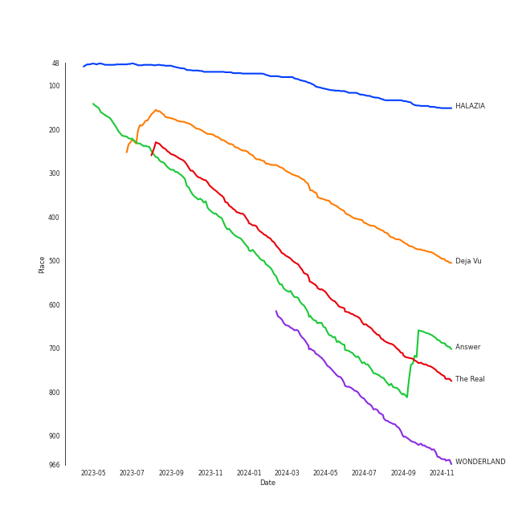
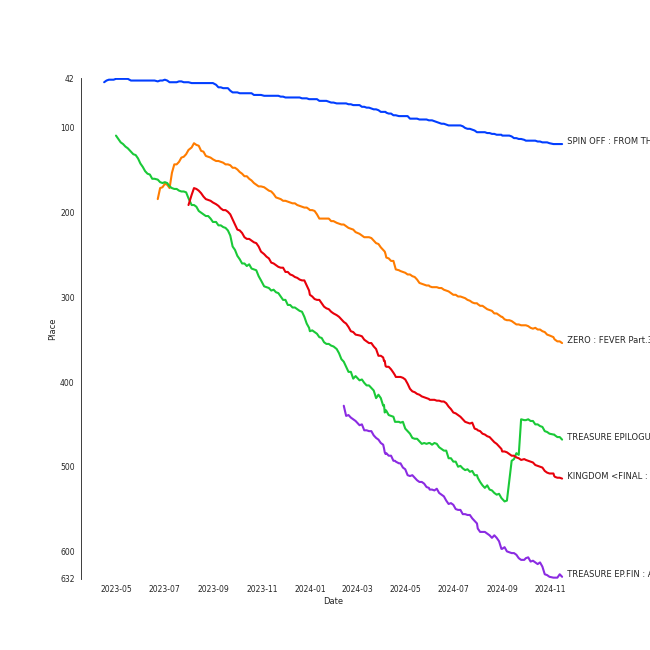

# ATEEZ

[See Track Features](audio_features.md)

[See Clusters](clusters/overview.md)

## Relationships

ATEEZ:
- has member 최종호 (Choi, Jongho)
- has member 최산 (Choi, San)
- has member 정윤호 (Jeong, Yun-ho)
- has member 정우영 (Jung, Wooyoung)
- has member 강여상 (Kang, Yeo-sang)
- has member 김홍중 (Kim, Hong Joong)
- has member 박성화 (Park, Seonghwa)
- has member 송민기 (Song, Mingi)

## Artist Rank
ATEEZ is currently:
- The #39 artist of the last 6 months
- The #38 artist of the last year
- The #45 artist of all time

## Top Tracks

### Top tracks of all time

Top tracks of the last 6 months over time

## Top Albums

| Art | Rank | Tracks | 💚 | Album | Release Date | 🔗 |
|:---|---:|---:|---:|:---|:---|:---|
|  | 665 | 2 | 1 | THE WORLD EP.1 : MOVEMENT | 2022-07-29 | [🔗](https://open.spotify.com/album/3fgDrbflffzvV3H3plG9e6) |
|  | 350 | 1 | 1 | ZERO : FEVER Part.3 | 2021-09-13 | [🔗](https://open.spotify.com/album/5ozaWoYQScjFzGODcJmy3G) |
|  | 463 | 1 | 1 | TREASURE EPILOGUE : Action To Answer | 2020-01-06 | [🔗](https://open.spotify.com/album/3TTkDOcSzRQCvGMT7VmmPE) |
|  | 633 | 1 | 1 | TREASURE EP.FIN : All To Action | 2019-10-08 | [🔗](https://open.spotify.com/album/4HGhzqQEY1X6WWZw6MhjlO) |
|  | 119 | 1 | 1 | SPIN OFF : FROM THE WITNESS | 2022-12-30 | [🔗](https://open.spotify.com/album/0NQQk6vo9LOOwKjZc2iUwm) |
|  | 511 | 1 | 1 | KINGDOM <FINAL : WHO IS THE KING?> | 2021-05-28 | [🔗](https://open.spotify.com/album/3n1NaviPQXfiVQ0TarnAf4) |
|  | 665 | 1 | 0 | TREASURE EP.2 : Zero To One | 2019-01-15 | [🔗](https://open.spotify.com/album/2PQ8cQ8WzAJJkWYT2Ydmhw) |
|  | 665 | 1 | 0 | TREASURE EP.1 : All to Zero | 2018-10-24 | [🔗](https://open.spotify.com/album/4ayTucmOGwLd0WrJddrUwx) |
|  | 665 | 1 | 0 | THE WORLD EP.2 : OUTLAW | 2023-06-16 | [🔗](https://open.spotify.com/album/5DxixnuklLg28S7UMeGC9H) |
|  | 665 | 1 | 0 | Season Songs | 2021-08-16 | [🔗](https://open.spotify.com/album/7o5jeWeyGW3Nb77WhmVPwJ) |

## Featured on Playlists
| Art | Tracks | Playlist |
|:---|---:|:---|
|  | 11 | [K-Pop](../../playlists/k-pop/overview.md) |
|  | 2 | [K-Pop Favorites](../../playlists/k-pop_favorites/overview.md) |
|  | 2 | [Workout](../../playlists/workout/overview.md) |
|  | 1 | [K-Pop 101](../../playlists/k-pop_101/overview.md) |
|  | 1 | [Your Top Songs 2023](../../playlists/your_top_songs_2023/overview.md) |
|  | 1 | [Halloween](../../playlists/halloween/overview.md) |
|  | 1 | [Classical Samples](../../playlists/classical_samples/overview.md) |

## Top Record Labels

| Tracks | 💚 | Label |
|---:|---:|:---|
| 10 | 5 | [KQ Entertainment](../../labels/kq_entertainment/overview.md) |
| 1 | 1 | [Stone Music Entertainment](../../labels/stone_music_entertainment/overview.md) |
| 1 | 1 | [Genie Music Corporation](../../labels/genie_music_corporation/overview.md) |
| 1 | 0 | TURBO JK Company |

## Genres

- [k-pop](../../genres/k-pop/overview.md)
- [k-pop boy group](../../genres/k-pop_boy_group/overview.md)

## Credits

### Credits by Type

| Credit Type | Tracks |
|:---|---:|
| Performer | 6 |
| Premiere | 4 |

### Member Credits

| | 김홍중 (Kim, Hong Joong) | 송민기 (Song, Mingi) |
|:---|---:|---:|
| Lyricist | 6 | 4 |
| Songwriter | 2 | 1 |
| Vocal | 1 | 0 |
### Production Credits

| Art | Track | Members | Credit Types |
|:---|:---|:---|:---|
|  | WONDERLAND | 김홍중 (Kim, Hong Joong), 송민기 (Song, Mingi) | Lyricist |
|  | Answer | 김홍중 (Kim, Hong Joong), 송민기 (Song, Mingi) | Lyricist |
|  | The Black Cat Nero | 김홍중 (Kim, Hong Joong) | Lyricist |
|  | Deja Vu | 김홍중 (Kim, Hong Joong), 송민기 (Song, Mingi) | Songwriter |
|  | Guerrilla | 김홍중 (Kim, Hong Joong), 송민기 (Song, Mingi) | Lyricist |
|  | HALAZIA | 김홍중 (Kim, Hong Joong), 송민기 (Song, Mingi) | Lyricist |
|  | EENIE MEENIE (Feat. Hongjoong of ATEEZ) | 김홍중 (Kim, Hong Joong) | Lyricist, Songwriter |

## Top Producers

| Art | Producer | Tracks | Credit Types |
|:---|:---|---:|:---|
| | 김홍중 (Kim, Hong Joong) | 6 | Songwriter, Lyricist |
| | [Ollounder](../../producers/ollounder/overview.md) | 6 | Arranger, Songwriter, Lyricist |
| | 송민기 (Song, Mingi) | 5 | Songwriter, Lyricist |
| | [EDEN](../../producers/eden/overview.md) | 5 | Arranger, Songwriter, Lyricist |
| | [LEEZ](../../producers/leez/overview.md) | 5 | Arranger, Songwriter, Lyricist |
| | [BUDDY](../../producers/buddy/overview.md) | 4 | Arranger, Lyricist, Songwriter |
| | [정은경 (Jung, Eun-Kyung)](../../producers/정은경_(jung,_eun-kyung)/overview.md) | 4 | Producer |
| | Oliv | 2 | Arranger, Songwriter, Lyricist |
| | [구종필 (Koo, Jong-Pil)](../../producers/구종필_(koo,_jong-pil)/overview.md) | 2 | Producer |
| | Peperoni | 2 | Arranger, Songwriter, Lyricist |

View all

| Art | Producer | Tracks | Credit Types |
|:---|:---|---:|:---|
| | Maddox | 2 | Arranger, Lyricist, Songwriter |
| | [양영은 (Yang, Young-eun)](../../producers/양영은_(yang,_young-eun)/overview.md) | 1 | Producer |
| | 홍현걸 (Hong, Hyeon-Geol) | 1 | Lyricist |
| | Tom Norris | 1 | Producer |
| | NEKO | 1 | Arranger, Songwriter |
| | 김수정 (김수정) | 1 | Producer |
| | 정소리 (Jeong, So-ri) | 1 | Arranger |

## Tracks

| Art | Track | Album | Artists | Label | Rank | 💚 | 🔗 |
|:---|:---|:---|:---|:---|---:|:---|:---|
|  | HALAZIA | SPIN OFF : FROM THE WITNESS | [ATEEZ](overview.md) | [KQ Entertainment](../../labels/kq_entertainment) | 151 | 💚 | [🔗](https://open.spotify.com/track/5cTnKClHyczcUhFT8MKBZe) |
|  | Deja Vu | ZERO : FEVER Part.3 | [ATEEZ](overview.md) | [KQ Entertainment](../../labels/kq_entertainment) | 496 | 💚 | [🔗](https://open.spotify.com/track/3zmrdOtnOogqLllz26WLZ3) |
|  | Answer | TREASURE EPILOGUE : Action To Answer | [ATEEZ](overview.md) | [KQ Entertainment](../../labels/kq_entertainment) | 692 | 💚 | [🔗](https://open.spotify.com/track/3IdPtyJHB1WVPM4eCiCAKM) |
|  | The Real | KINGDOM <FINAL : WHO IS THE KING?> | [ATEEZ](overview.md) | [Genie Music Corporation](../../labels/genie_music_corporation), [Stone Music Entertainment](../../labels/stone_music_entertainment) | 769 | 💚 | [🔗](https://open.spotify.com/track/1uk5fYLx1f88DLte84Hl5j) |
|  | WONDERLAND | TREASURE EP.FIN : All To Action | [ATEEZ](overview.md) | [KQ Entertainment](../../labels/kq_entertainment) | 964 | 💚 | [🔗](https://open.spotify.com/track/6k67RdkVjTZj79c1cRz7IQ) |
|  | Pirate King | TREASURE EP.1 : All to Zero | [ATEEZ](overview.md) | [KQ Entertainment](../../labels/kq_entertainment) | 1015 | | [🔗](https://open.spotify.com/track/5Jl2i6LR3Socm4TYqRzZw3) |
|  | HALA HALA (Hearts Awakened, Live Alive) | TREASURE EP.2 : Zero To One | [ATEEZ](overview.md) | [KQ Entertainment](../../labels/kq_entertainment) | 1015 | | [🔗](https://open.spotify.com/track/4v2BLMhWtVvBnZwuoiKxja) |
|  | The Black Cat Nero | Season Songs | [ATEEZ](overview.md) | [KQ Entertainment, TURBO JK Company](../../labels/kq_entertainment) | 1015 | | [🔗](https://open.spotify.com/track/5GCkHlq2lxmtSlAhiLpnjq) |
|  | Cyberpunk | THE WORLD EP.1 : MOVEMENT | [ATEEZ](overview.md) | [KQ Entertainment](../../labels/kq_entertainment) | 1015 | | [🔗](https://open.spotify.com/track/2Ax4rdLenBhULX7nRbhful) |
|  | Guerrilla | THE WORLD EP.1 : MOVEMENT | [ATEEZ](overview.md) | [KQ Entertainment](../../labels/kq_entertainment) | 1015 | 💚 | [🔗](https://open.spotify.com/track/0tYZo2UhV1lrUez5CA0Iyw) |

See all tracks

| Art | Track | Album | Artists | Label | Rank | 💚 | 🔗 |
|:---|:---|:---|:---|:---|---:|:---|:---|
|  | BOUNCY (K-HOT CHILLI PEPPERS) | THE WORLD EP.2 : OUTLAW | [ATEEZ](overview.md) | [KQ Entertainment](../../labels/kq_entertainment) | 1015 | | [🔗](https://open.spotify.com/track/5KyOUICJIvO0z71MBdPGiX) |

