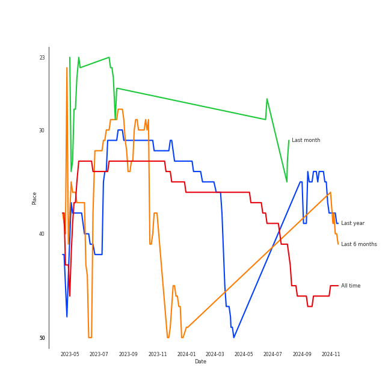
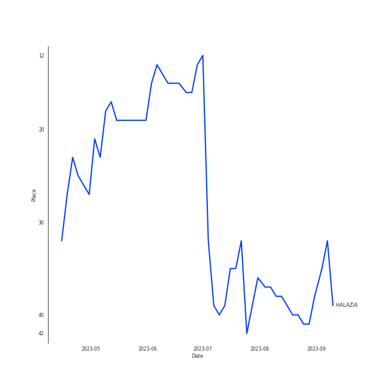

# ATEEZ

## Artist Rank
ATEEZ is currently:
- The #42 artist of all time
- The #32 artist of the last 6 months

## Top Tracks

- HALAZIA is:
    - the #32 track of the last 6 months

### Top tracks of the last 6 months over time

### Top tracks of the last month over time

## Featured on Playlists
| Art | Tracks | Playlist |
|:---|---:|:---|
|  | 10 | [K-Pop](../../playlists/k_pop/overview.md) |
|  | 2 | [K-Pop Favorites](../../playlists/k_pop_favorites/overview.md) |
|  | 2 | [Workout](../../playlists/workout/overview.md) |
|  | 1 | [K-Pop 101](../../playlists/k_pop_101/overview.md) |
|  | 1 | [Recent Comebacks](../../playlists/recent_comebacks/overview.md) |
## Top Albums

| Art | Tracks | 💚 | Album | Release Date | 🔗 |
|:---|---:|---:|:---|:---|:---|
|  | 2 | 1 | THE WORLD EP.1 : MOVEMENT | 2022-07-29 | [🔗](https://open.spotify.com/album/3fgDrbflffzvV3H3plG9e6) |
|  | 1 | 1 | ZERO : FEVER Part.3 | 2021-09-13 | [🔗](https://open.spotify.com/album/5ozaWoYQScjFzGODcJmy3G) |
|  | 1 | 1 | TREASURE EPILOGUE : Action To Answer | 2020-01-06 | [🔗](https://open.spotify.com/album/3TTkDOcSzRQCvGMT7VmmPE) |
|  | 1 | 1 | TREASURE EP.FIN: All To Action | 2019-10-08 | [🔗](https://open.spotify.com/album/4HGhzqQEY1X6WWZw6MhjlO) |
|  | 1 | 1 | SPIN OFF : FROM THE WITNESS | 2022-12-30 | [🔗](https://open.spotify.com/album/0NQQk6vo9LOOwKjZc2iUwm) |
|  | 1 | 1 | KINGDOM <FINAL : WHO IS THE KING?> | 2021-05-28 | [🔗](https://open.spotify.com/album/3n1NaviPQXfiVQ0TarnAf4) |
|  | 1 | 0 | TREASURE EP.2: Zero To One | 2019-01-15 | [🔗](https://open.spotify.com/album/2PQ8cQ8WzAJJkWYT2Ydmhw) |
|  | 1 | 0 | TREASURE EP.1: All to Zero | 2018-10-24 | [🔗](https://open.spotify.com/album/4ayTucmOGwLd0WrJddrUwx) |
|  | 1 | 0 | THE WORLD EP.2 : OUTLAW | 2023-06-16 | [🔗](https://open.spotify.com/album/5DxixnuklLg28S7UMeGC9H) |

## Top Record Labels

| Tracks | 💚 | Label |
|---:|---:|:---|
| 9 | 5 | KQ Entertainment |
| 1 | 1 | [Stone Music Entertainment](../../labels/stone_music_entertainment/overview.md) |
| 1 | 1 | [Genie Music Corporation](../../labels/genie_music_corporation/overview.md) |

## Genres

- [k-pop](../../genres/k_pop)
- [k-pop boy group](../../genres/k_pop_boy_group)

## Tracks

| Art | Track | Album | Artists | Label | 💚 | 🔗 |
|:---|:---|:---|:---|:---|:---|:---|
|  | Pirate King | TREASURE EP.1: All to Zero | [ATEEZ](overview.md) | KQ Entertainment | | [🔗](https://open.spotify.com/track/5Jl2i6LR3Socm4TYqRzZw3) |
|  | HALA HALA (Hearts Awakened, Live Alive) | TREASURE EP.2: Zero To One | [ATEEZ](overview.md) | KQ Entertainment | | [🔗](https://open.spotify.com/track/4v2BLMhWtVvBnZwuoiKxja) |
|  | WONDERLAND | TREASURE EP.FIN: All To Action | [ATEEZ](overview.md) | KQ Entertainment | 💚 | [🔗](https://open.spotify.com/track/6k67RdkVjTZj79c1cRz7IQ) |
|  | Answer | TREASURE EPILOGUE : Action To Answer | [ATEEZ](overview.md) | KQ Entertainment | 💚 | [🔗](https://open.spotify.com/track/3IdPtyJHB1WVPM4eCiCAKM) |
|  | The Real | KINGDOM <FINAL : WHO IS THE KING?> | [ATEEZ](overview.md) | [Genie Music Corporation](../../labels/genie_music_corporation), [Stone Music Entertainment](../../labels/stone_music_entertainment) | 💚 | [🔗](https://open.spotify.com/track/1uk5fYLx1f88DLte84Hl5j) |
|  | Deja Vu | ZERO : FEVER Part.3 | [ATEEZ](overview.md) | KQ Entertainment | 💚 | [🔗](https://open.spotify.com/track/3zmrdOtnOogqLllz26WLZ3) |
|  | Cyberpunk | THE WORLD EP.1 : MOVEMENT | [ATEEZ](overview.md) | KQ Entertainment | | [🔗](https://open.spotify.com/track/2Ax4rdLenBhULX7nRbhful) |
|  | Guerrilla | THE WORLD EP.1 : MOVEMENT | [ATEEZ](overview.md) | KQ Entertainment | 💚 | [🔗](https://open.spotify.com/track/0tYZo2UhV1lrUez5CA0Iyw) |
|  | HALAZIA | SPIN OFF : FROM THE WITNESS | [ATEEZ](overview.md) | KQ Entertainment | 💚 | [🔗](https://open.spotify.com/track/5cTnKClHyczcUhFT8MKBZe) |
|  | BOUNCY (K-HOT CHILLI PEPPERS) | THE WORLD EP.2 : OUTLAW | [ATEEZ](overview.md) | KQ Entertainment | | [🔗](https://open.spotify.com/track/5KyOUICJIvO0z71MBdPGiX) |