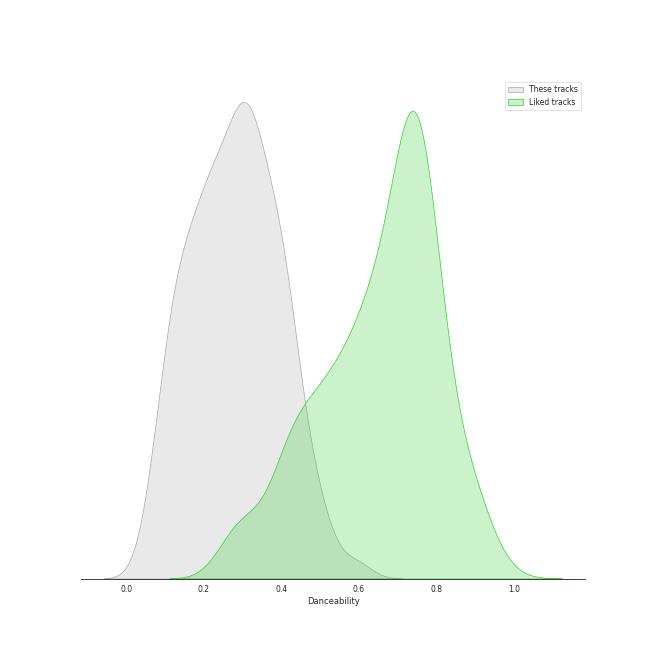
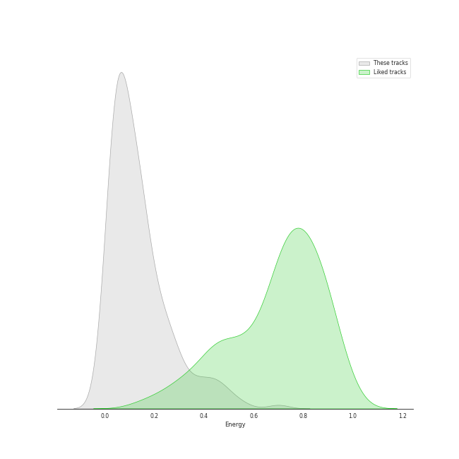
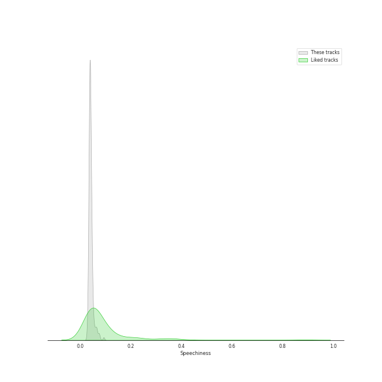
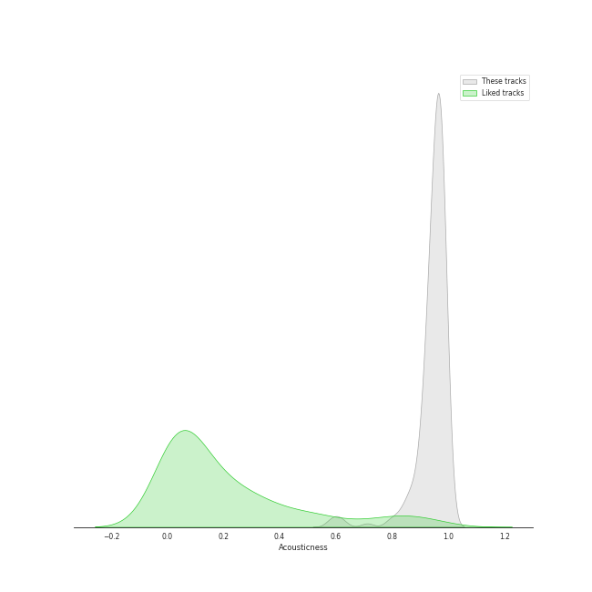
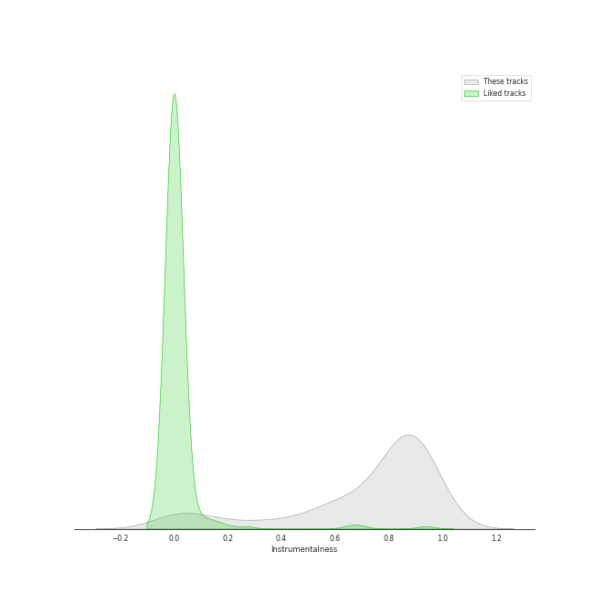

# Track Features for Berliner Philharmoniker

## Danceability

| ​ | 10 most Danceable tracks | ​​ | 10 least Danceable tracks |
|:---|:---|:---|:---|
|  | Divertimento No. 11 in D, K.251 "Nannerl-Septett": Menuetto (Tema con variazioni) (0.593) |  | The Planets, Op. 32: 7. Neptune, the Mystic (0.0601) |
|  | The Rite of Spring, K15, Pt. 2: XIV. Sacrificial Dance (0.59) |  | Symphony No. 9 In D Minor, Op. 125 - "Choral": 3. Adagio molto e cantabile (0.062) |
|  | The Rite of Spring, K15, Pt. 2: XII. Evocation of the Ancestors (0.539) |  | Die Zauberflöte, K.620 / Act 2: "O Isis und Osiris, welche Wonne!" (0.0663) |
|  | The Rite of Spring, K15, Pt. 1: II. The Augurs of Spring (0.508) |  | Horn Concerto No. 4 in E-Flat Major, K. 495: II. Romanza. Andante (0.0683) |
|  | Violin Concerto No. 3 in G Major, K. 216: III. Rondo (Allegro) (0.507) |  | Brahms: Symphony No. 2 in D Major, Op. 73: II. Adagio non troppo (0.0817) |
|  | The Rite of Spring, K15, Pt. 2: XI. Glorification of the Chosen One (0.507) |  | Brahms: Symphony No. 1 in C Minor, Op. 68: II. Andante sostenuto (0.0853) |
|  | Die Zauberflöte, K.620 / Act 2: "Pa-Pa-Pa-Pa-Pa-Pa-Papagena!" (0.504) |  | The Planets, Op. 32: 2. Venus, the Bringer of Peace (0.0864) |
|  | Die Zauberflöte, K.620 / Act 2: Alles fühlt der Liebe Freuden (Monostatos) (0.499) |  | Symphony No. 3 In E Flat, Op. 55 -"Eroica": 2. Marcia funebre (Adagio assai) (0.0871) |
|  | Serenade In G, K.525 "Eine kleine Nachtmusik": 4. Rondo (Allegro) (0.478) |  | Divertimento No. 15 in B Flat Major, K. 287: IV. Adagio (0.0898) |
|  | Divertimento No. 15 in B-Flat Major, K. 287: 5. Menuetto (0.476) |  | Horn Concerto No. 2 in E-Flat Major, K. 417: II. Andante (0.099) |

## Energy

| ​ | 10 most Energetic tracks | ​​ | 10 least Energetic tracks |
|:---|:---|:---|:---|
|  | The Rite of Spring, K15, Pt. 1: VI. Procession of the Sage (0.7) |  | The Rite of Spring, K15, Pt. 1: VII. Adoration of the Earth (The Sage) (0.000239) |
|  | The Rite of Spring, K15, Pt. 1: III. Ritual of Abduction (0.555) |  | Die Zauberflöte, K.620 / Act 2: "Seid uns zum zweiten Mal willkommen" (0.00404) |
|  | The Rite of Spring, K15, Pt. 1: VIII. Dance of the Earth (0.509) |  | Tchaikovsky: The Nutcracker, Op. 71, Act II: No. 12b, Divertissement. Coffee, Arabian Dance (0.00478) |
|  | Tchaikovsky: The Nutcracker, Op. 71, Act II: No. 12d, Divertissement. Trepak, Russian Dance (0.5) |  | The Planets, Op. 32: 7. Neptune, the Mystic (0.00757) |
|  | The Planets, Op. 32: 1. Mars, the Bringer of War (0.478) |  | The Planets, Op. 32: 2. Venus, the Bringer of Peace (0.00922) |
|  | The Rite of Spring, K15, Pt. 2: XIV. Sacrificial Dance (0.46) |  | The Planets, Op. 32: 5. Saturn, the Bringer of Old Age (0.0136) |
|  | The Rite of Spring, K15, Pt. 2: XI. Glorification of the Chosen One (0.447) |  | Divertimento No. 15 in B-Flat Major, K. 287: 5. Menuetto (0.0183) |
|  | Symphony No. 39 in E flat, K.543: 4. Finale (Allegro) (0.441) |  | Tchaikovsky: The Nutcracker, Op. 71, Act 2: No. 14c, Pas de deux. Variation II "Dance of the Sugar Plum Fairy" (0.0205) |
|  | The Rite of Spring, K15, Pt. 1: V. Games of the Rival Tribes (0.435) |  | Symphony No. 2 In D, Op. 36: 2. Larghetto (0.0205) |
|  | Mass In C, K.317 "Coronation": 3. Credo (0.433) |  | Divertimento No. 15 in B-Flat Major, K. 287: 3. Menuetto (0.0207) |

## Speechiness

| ​ | 10 most Speechy tracks | ​​ | 10 least Speechy tracks |
|:---|:---|:---|:---|
|  | The Rite of Spring, K15, Pt. 2: XI. Glorification of the Chosen One (0.0935) |  | The Rite of Spring, K15, Pt. 1: VIII. Dance of the Earth (0.0292) |
|  | Symphony No. 1 In C, Op. 21: 3. Menuetto (Allegro molto e vivace) (0.0779) |  | The Rite of Spring, K15, Pt. 1: II. The Augurs of Spring (0.0293) |
|  | The Rite of Spring, K15, Pt. 2: XIV. Sacrificial Dance (0.0741) |  | Symphony No. 39 in E flat, K.543: 3. Menuetto (Allegretto) (0.0297) |
|  | Symphony No. 9 In D Minor, Op. 125 - "Choral" / 4.: "O Freunde nicht diese Töne" - (0.0736) |  | The Rite of Spring, K15, Pt. 2: XIII. Ritual of the Ancestors (0.0319) |
|  | Divertimento No. 11 in D, K.251 "Nannerl-Septett": Menuetto (Tema con variazioni) (0.068) |  | Mass In C, K.317 "Coronation": 4. Sanctus (0.0321) |
|  | Tchaikovsky: The Nutcracker, Op. 71, Act I, Scene 1: No. 7, The Battle (0.0664) |  | Brahms: Symphony No. 2 in D Major, Op. 73: IV. Allegro con spirito (0.0325) |
|  | Die Zauberflöte, K.620 / Act 2: Alles fühlt der Liebe Freuden (Monostatos) (0.0662) |  | Tchaikovsky: The Nutcracker, Op. 71, Act II: No. 14b, Pas de deux. Variation I "Tarantella" (0.0332) |
|  | Symphony No. 3 In E Flat, Op. 55 -"Eroica": 3. Scherzo (Allegro vivace) (0.0634) |  | Symphony No. 8 in F Major, Op. 93: III. Tempo di menuetto (0.0332) |
|  | The Planets, Op. 32: 6. Uranus, the Magician (0.0633) |  | Divertimento No. 11 in D, K.251 "Nannerl-Septett": Marcia alla francese (0.0334) |
|  | Die Zauberflöte, K.620 / Act 1: "Bei Männern, welche Liebe fühlen" (0.0611) |  | Divertimento No. 11 in D Major, K. 251 "Nannerl-Septett": Menuetto (III) (0.0335) |

## Acousticness

| ​ | 10 most Acoustic tracks | ​​ | 10 least Acoustic tracks |
|:---|:---|:---|:---|
|  | Horn Concerto No. 4 in E-Flat Major, K. 495: III. Rondo. Allegro vivace (0.992) |  | Tchaikovsky: The Nutcracker, Op. 71, Act II: No. 12a, Divertissement. Chocolate, Spanish Dance (0.583) |
|  | Horn Concerto No. 2 in E-Flat Major, K. 417: III. Rondo (0.991) |  | The Rite of Spring, K15, Pt. 1: VII. Adoration of the Earth (The Sage) (0.591) |
|  | Horn Concerto No. 2 in E-Flat Major, K. 417: II. Andante (0.991) |  | The Rite of Spring, K15, Pt. 1: VI. Procession of the Sage (0.612) |
|  | Horn Concerto No. 3 in E-Flat Major, K. 447: I. Allegro - Cadenza: Manfred Klier (0.989) |  | Die Zauberflöte, K.620 / Act 2: Ein Mädchen oder Weibchen (Papageno) (0.623) |
|  | Horn Concerto No. 2 in E-Flat Major, K. 417: I. Allegro maestoso (0.989) |  | The Rite of Spring, K15, Pt. 1: VIII. Dance of the Earth (0.712) |
|  | Horn Concerto No. 1 in D Major, K. 386b (K. 412 & 514): II. Rondò. Allegro K. 514 (0.988) |  | Symphony No. 6 In F, Op. 68 -"Pastoral": 4. Gewitter, Sturm (Allegro) (0.792) |
|  | Horn Concerto No. 4 in E-Flat Major, K. 495: II. Romanza. Andante (0.988) |  | The Rite of Spring, K15, Pt. 2: XIV. Sacrificial Dance (0.802) |
|  | Horn Concerto No. 3 in E-Flat Major, K. 447: III. Allegro (0.988) |  | Serenade In G, K.525 "Eine kleine Nachtmusik": 3. Menuetto (Allegretto) (0.828) |
|  | Die Zauberflöte, K.620 / Act 2: O Isis und Osiris (Sarastro, Chor) (0.988) |  | The Planets, Op. 32: 1. Mars, the Bringer of War (0.83) |
|  | Brahms: Symphony No. 3 in F Major, Op. 90: III. Poco allegretto (0.987) |  | Symphony No. 7 In A, Op. 92: 4. Allegro con brio (0.847) |

## Instrumentalness

| ​ | 10 most Instrumental tracks | ​​ | 10 least Instrumental tracks |
|:---|:---|:---|:---|
|  | The Rite of Spring, K15, Pt. 1: I. Introduction (0.972) |  | Die Zauberflöte, K.620 / Act 2: Ein Mädchen oder Weibchen (Papageno) (0.0) |
|  | Divertimento No. 11 in D, K.251 "Nannerl-Septett": Menuetto (Tema con variazioni) (0.958) |  | Die Zauberflöte, K.620 / Act 1: "Bei Männern, welche Liebe fühlen" (0.0) |
|  | Tchaikovsky: The Nutcracker, Op. 71, Act II: No. 14a, Pas de deux. Andante maestoso (0.954) |  | Die Zauberflöte, K.620 / Act 1: Der Vogelfänger bin ich ja (Papageno) (1.03e-05) |
|  | Horn Concerto No. 2 in E-Flat Major, K. 417: II. Andante (0.954) |  | Die Zauberflöte, K.620 / Act 2: "Seid uns zum zweiten Mal willkommen" (1.46e-05) |
|  | Horn Concerto No. 1 in D Major, K. 386b (K. 412 & 514): I. (Allegro) K. 412 (0.95) |  | Die Zauberflöte, K.620 / Act 1: Zu Hilfe! Zu Hilfe! (Tamino, Die drei Damen) (5.54e-05) |
|  | Horn Concerto No. 4 in E-Flat Major, K. 495: II. Romanza. Andante (0.949) |  | Die Zauberflöte, K.620 / Act 2: Alles fühlt der Liebe Freuden (Monostatos) (5.9e-05) |
|  | The Rite of Spring, K15, Pt. 1: III. Ritual of Abduction (0.945) |  | The Rite of Spring, K15, Pt. 1: VII. Adoration of the Earth (The Sage) (0.000308) |
|  | Tchaikovsky: The Nutcracker, Op. 71, Act II: No. 15, Final Waltz and Apotheosis (0.944) |  | Die Zauberflöte, K.620 / Act 1: Dies Bildnis ist bezaubernd schön (Tamino) (0.00077) |
|  | Symphony No. 40 In G Minor, K.550: 4. Finale (Allegro assai) (0.941) |  | Die Zauberflöte, K.620 / Act 1: "O zittre nicht, mein lieber Sohn" (0.00379) |
|  | Tchaikovsky: The Nutcracker, Op. 71, Act II: No. 12e, Divertissement. Dance of the Reed-Flutes (0.94) |  | Die Zauberflöte, K.620 / Act 2: "Pa-Pa-Pa-Pa-Pa-Pa-Papagena!" (0.00678) |

## Liveness

| ​ | 10 most Live tracks | ​​ | 10 least Live tracks |
|:---|:---|:---|:---|
|  | The Rite of Spring, K15, Pt. 1: II. The Augurs of Spring (0.669) |  | Symphony No. 1 In C, Op. 21: 3. Menuetto (Allegro molto e vivace) (0.0554) |
|  | Symphony No. 5 In C Minor, Op. 67: 3. Allegro (0.614) |  | Tchaikovsky: The Nutcracker, Op. 71: Miniature Overture (0.0557) |
|  | Symphony No. 36 in C Major, K. 425 "Linz": 3. Menuetto (0.594) |  | The Planets, Op. 32: 7. Neptune, the Mystic (0.0614) |
|  | Tchaikovsky: The Nutcracker, Op. 71, Act I, Scene 1: No. 3, Children's Galop and Entry of the Parents (0.578) |  | Divertimento in D, K.334 - Orchestral Version: 2. Thema mit Variationen (Andante) (0.0641) |
|  | Symphony No. 9 In D Minor, Op. 125 - "Choral" - Excerpt From 4th Movement: 4. Presto (0.535) |  | Violin Concerto No. 5 in A Major, K. 219: III. Rondeau (Tempo di minuetto) (0.0665) |
|  | Die Zauberflöte, K.620 / Act 2: Alles fühlt der Liebe Freuden (Monostatos) (0.508) |  | The Rite of Spring, K15, Pt. 1: I. Introduction (0.0674) |
|  | Die Zauberflöte, K.620 / Act 1: Der Vogelfänger bin ich ja (Papageno) (0.421) |  | Violin Concerto No. 5 in A Major, K. 219: I. Allegro aperto (0.0674) |
|  | Divertimento In F, K.247: Menuetto (0.412) |  | Tchaikovsky: The Nutcracker, Op. 71, Act II: No. 13, Waltz of the Flowers (0.0703) |
|  | Symphony No. 33 in B flat, K.319: 3. Menuetto (0.409) |  | Tchaikovsky: The Nutcracker, Op. 71, Act I, Scene 1: No. 6, Clara and the Nutcracker (0.0719) |
|  | Divertimento No. 11 in D, K.251 "Nannerl-Septett": Marcia alla francese (0.392) |  | Die Zauberflöte, K.620 / Act 2: Der Hölle Rache kocht in meinem Herzen (Königin der Nacht) (0.0743) |

## Valence

| ​ | 10 most Happy tracks | ​​ | 10 least Happy tracks |
|:---|:---|:---|:---|
|  | Tchaikovsky: The Nutcracker, Op. 71, Act II: No. 12a, Divertissement. Chocolate, Spanish Dance (0.879) |  | The Rite of Spring, K15, Pt. 1: VII. Adoration of the Earth (The Sage) (0.0) |
|  | Tchaikovsky: The Nutcracker, Op. 71, Act II: No. 12d, Divertissement. Trepak, Russian Dance (0.851) |  | The Planets, Op. 32: 2. Venus, the Bringer of Peace (0.0301) |
|  | Tchaikovsky: The Nutcracker, Op. 71, Act II: No. 12c, Divertissement. Tea, Chinese Dance (0.832) |  | The Planets, Op. 32: 7. Neptune, the Mystic (0.0305) |
|  | Die Zauberflöte, K.620 / Act 2: Alles fühlt der Liebe Freuden (Monostatos) (0.792) |  | Concerto for Orchestra, Sz. 116: 3. Elegia (Andante, non troppo) (0.0312) |
|  | Serenade In G, K.525 "Eine kleine Nachtmusik": 4. Rondo (Allegro) (0.64) |  | The Planets, Op. 32: 5. Saturn, the Bringer of Old Age (0.0316) |
|  | Tchaikovsky: The Nutcracker, Op. 71, Act I, Scene 1: No. 3, Children's Galop and Entry of the Parents (0.639) |  | Brahms: Symphony No. 3 in F Major, Op. 90: II. Andante (0.0345) |
|  | Tchaikovsky: The Nutcracker, Op. 71, Act II: No. 12f, Divertissement. Mother Gigogne and the Clowns (0.597) |  | Die Zauberflöte, K.620 / Act 2: O Isis und Osiris (Sarastro, Chor) (0.0353) |
|  | The Rite of Spring, K15, Pt. 1: II. The Augurs of Spring (0.587) |  | Brahms: Symphony No. 2 in D Major, Op. 73: II. Adagio non troppo (0.0353) |
|  | Divertimento No. 11 in D, K.251 "Nannerl-Septett": Menuetto (Tema con variazioni) (0.57) |  | Brahms: Symphony No. 1 in C Minor, Op. 68: II. Andante sostenuto (0.0358) |
|  | Divertimento No. 11 in D, K.251 "Nannerl-Septett": Marcia alla francese (0.56) |  | Symphony No. 3 In E Flat, Op. 55 -"Eroica": 2. Marcia funebre (Adagio assai) (0.0366) |

## Tempo

| ​ | 10 most Fast tracks | ​​ | 10 least Fast tracks |
|:---|:---|:---|:---|
|  | Divertimento in D, K.334 - Orchestral Version: 4. Adagio (168.802) |  | Tchaikovsky: The Nutcracker, Op. 71, Act II: No. 13, Waltz of the Flowers (47.362) |
|  | Symphony No. 33 in B flat, K.319: 2. Andante moderato (165.957) |  | Divertimento No. 15 in B Flat Major, K. 287: IV. Adagio (56.647) |
|  | Symphony No. 33 in B flat, K.319: 1. Allegro assai (165.933) |  | Mass In C, K.317 "Coronation": 5. Benedictus (57.355) |
|  | Symphony No. 8 in F Major, Op. 93: II. Allegretto scherzando (164.384) |  | The Planets, Op. 32: 7. Neptune, the Mystic (57.624) |
|  | Symphony No. 3 In E Flat, Op. 55 -"Eroica": 3. Scherzo (Allegro vivace) (163.062) |  | Symphony No. 7 In A, Op. 92: 3. Presto - Assai meno presto (59.821) |
|  | Tchaikovsky: The Nutcracker, Op. 71, Act II: No. 12d, Divertissement. Trepak, Russian Dance (157.195) |  | Brahms: Symphony No. 3 in F Major, Op. 90: II. Andante (60.218) |
|  | Divertimento No. 15 in B Flat Major, K. 287: I. Allegro (153.666) |  | Tchaikovsky: The Nutcracker, Op. 71, Act I, Scene 1: No. 3, Children's Galop and Entry of the Parents (62.102) |
|  | Serenade In G, K.525 "Eine kleine Nachtmusik": 2. Romance (Andante) (153.555) |  | Music To Goethe's Tragedy "Egmont" Op. 84: Ouverture - Sostenuto, ma non troppo - Allegro (62.227) |
|  | Symphony No. 39 in E flat, K.543: 1. Adagio - Allegro (153.184) |  | Symphony No. 3 In E Flat, Op. 55 -"Eroica": 2. Marcia funebre (Adagio assai) (62.976) |
|  | Mass In C, K.317 "Coronation": 2. Gloria (152.459) |  | Horn Concerto No. 4 in E-Flat Major, K. 495: III. Rondo. Allegro vivace (63.172) |
