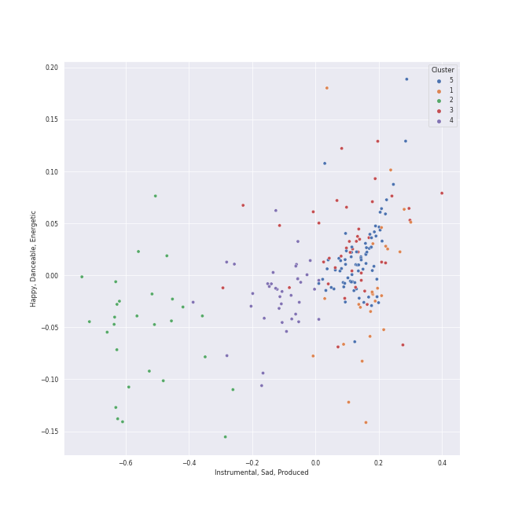

# Clusters in Berliner Philharmoniker

## Cluster #1

26 tracks

| Art | Track | Album | Artists | Label | Rank | 💚 | 🔗 |
|:---|:---|:---|:---|:---|---:|:---|:---|
|  | Symphony No. 38 In D, K.504 "Prague": 1. Adagio - Allegro | Karajan - Mozart | [Wolfgang Amadeus Mozart](../../../wolfgang_amadeus_mozart/overview.md), [Berliner Philharmoniker](../../overview.md), [Herbert von Karajan](../../../herbert_von_karajan/overview.md) | [UME - Global Clearing House](../../../../labels/ume_-_global_clearing_house) | 841 | | [🔗](https://open.spotify.com/track/0O4z53DGR2JSAKOsaudGpW) |
|  | Symphony No. 35 in D Major, K. 385 "Haffner": 1. Allegro con spirito | Karajan - Mozart | [Wolfgang Amadeus Mozart](../../../wolfgang_amadeus_mozart/overview.md), [Berliner Philharmoniker](../../overview.md), [Herbert von Karajan](../../../herbert_von_karajan/overview.md) | [UME - Global Clearing House](../../../../labels/ume_-_global_clearing_house) | 841 | | [🔗](https://open.spotify.com/track/3PA9yseGQxoFniDfsSgko0) |
|  | Horn Concerto No. 3 in E-Flat Major, K. 447: I. Allegro - Cadenza: Manfred Klier | Karajan - Mozart | [Wolfgang Amadeus Mozart](../../../wolfgang_amadeus_mozart/overview.md), Manfred Klier, Gerd Seifert, [Berliner Philharmoniker](../../overview.md), [Herbert von Karajan](../../../herbert_von_karajan/overview.md) | [UME - Global Clearing House](../../../../labels/ume_-_global_clearing_house) | 841 | | [🔗](https://open.spotify.com/track/3udcO1HldTWgJkzP0ZGqbT) |
|  | Symphony No. 41 In C, K.551 - "Jupiter": 3. Menuetto (Allegretto) | Karajan - Mozart | [Wolfgang Amadeus Mozart](../../../wolfgang_amadeus_mozart/overview.md), [Berliner Philharmoniker](../../overview.md), [Herbert von Karajan](../../../herbert_von_karajan/overview.md) | [UME - Global Clearing House](../../../../labels/ume_-_global_clearing_house) | 841 | | [🔗](https://open.spotify.com/track/64G71tpW7kAQOJs7UT57rH) |
|  | Die Zauberflöte, K.620: Overture | Karajan - Mozart | [Wolfgang Amadeus Mozart](../../../wolfgang_amadeus_mozart/overview.md), [Berliner Philharmoniker](../../overview.md), [Herbert von Karajan](../../../herbert_von_karajan/overview.md) | [UME - Global Clearing House](../../../../labels/ume_-_global_clearing_house) | 841 | | [🔗](https://open.spotify.com/track/6Rxcuz3B4CFLwqsZuSZIeF) |
|  | Symphony No. 3 In E Flat, Op. 55 -"Eroica": 4. Finale (Allegro molto) | Beethoven: 9 Symphonies; Overtures | [Ludwig van Beethoven](../../../ludwig_van_beethoven/overview.md), [Berliner Philharmoniker](../../overview.md), [Herbert von Karajan](../../../herbert_von_karajan/overview.md) | [Deutsche Grammophon (DG)](../../../../labels/deutsche_grammophon_(dg)) | 841 | | [🔗](https://open.spotify.com/track/2OjI1SmN65FdQ1wEBkuo4v) |
|  | Symphony No. 9 In D Minor, Op. 125 - "Choral": 1. Allegro ma non troppo, un poco maestoso | Beethoven: 9 Symphonies; Overtures | [Ludwig van Beethoven](../../../ludwig_van_beethoven/overview.md), [Berliner Philharmoniker](../../overview.md), [Herbert von Karajan](../../../herbert_von_karajan/overview.md) | [Deutsche Grammophon (DG)](../../../../labels/deutsche_grammophon_(dg)) | 841 | | [🔗](https://open.spotify.com/track/2YSyPAFezzPL0ySmQA9g7W) |
|  | Symphony No. 5 In C Minor, Op. 67: 4. Allegro | Beethoven: 9 Symphonies; Overtures | [Ludwig van Beethoven](../../../ludwig_van_beethoven/overview.md), [Berliner Philharmoniker](../../overview.md), [Herbert von Karajan](../../../herbert_von_karajan/overview.md) | [Deutsche Grammophon (DG)](../../../../labels/deutsche_grammophon_(dg)) | 841 | | [🔗](https://open.spotify.com/track/3HyePLZIEdQQSmJnGuTxNP) |
|  | Symphony No. 8 in F Major, Op. 93: I. Allegro vivace e con brio | Beethoven: 9 Symphonies; Overtures | [Ludwig van Beethoven](../../../ludwig_van_beethoven/overview.md), [Berliner Philharmoniker](../../overview.md), [Herbert von Karajan](../../../herbert_von_karajan/overview.md) | [Deutsche Grammophon (DG)](../../../../labels/deutsche_grammophon_(dg)) | 841 | | [🔗](https://open.spotify.com/track/3pmLgmjUUe2iCzNIYN0ail) |
|  | Fidelio Op. 72: Overture | Beethoven: 9 Symphonies; Overtures | [Ludwig van Beethoven](../../../ludwig_van_beethoven/overview.md), [Berliner Philharmoniker](../../overview.md), [Herbert von Karajan](../../../herbert_von_karajan/overview.md) | [Deutsche Grammophon (DG)](../../../../labels/deutsche_grammophon_(dg)) | 841 | | [🔗](https://open.spotify.com/track/72Gj2PlP6eI1IsZwwxQfGR) |
## Cluster #2

28 tracks

| Art | Track | Album | Artists | Label | Rank | 💚 | 🔗 |
|:---|:---|:---|:---|:---|---:|:---|:---|
|  | Die Zauberflöte, K.620 / Act 2: Der Hölle Rache kocht in meinem Herzen (Königin der Nacht) | Karajan - Mozart | [Wolfgang Amadeus Mozart](../../../wolfgang_amadeus_mozart/overview.md), Karin Ott, [Berliner Philharmoniker](../../overview.md), [Herbert von Karajan](../../../herbert_von_karajan/overview.md) | [UME - Global Clearing House](../../../../labels/ume_-_global_clearing_house) | 841 | | [🔗](https://open.spotify.com/track/0B6iCn4MMDxJcITauM59XQ) |
|  | Mass In C, K.317 "Coronation": 2. Gloria | Karajan - Mozart | [Wolfgang Amadeus Mozart](../../../wolfgang_amadeus_mozart/overview.md), Anna Tomowa-Sintow, Agnes Baltsa, Werner Krenn, José van Dam, [Berliner Philharmoniker](../../overview.md), [Herbert von Karajan](../../../herbert_von_karajan/overview.md), Wiener Singverein | [UME - Global Clearing House](../../../../labels/ume_-_global_clearing_house) | 841 | | [🔗](https://open.spotify.com/track/0nN6oNjnxZ9yUfNP3Vq5VY) |
|  | Die Zauberflöte, K.620 / Act 2: "Seid uns zum zweiten Mal willkommen" | Karajan - Mozart | [Wolfgang Amadeus Mozart](../../../wolfgang_amadeus_mozart/overview.md), Wolfgang Bünten, Christian Schulz, Tobias Pfulb, [Berliner Philharmoniker](../../overview.md), [Herbert von Karajan](../../../herbert_von_karajan/overview.md) | [UME - Global Clearing House](../../../../labels/ume_-_global_clearing_house) | 841 | | [🔗](https://open.spotify.com/track/3JIno6JgE7mhYuYke4Fs6p) |
|  | Divertimento in D, K.334 - Orchestral Version: 3. Menuetto - Trio - Menuetto | Karajan - Mozart | [Wolfgang Amadeus Mozart](../../../wolfgang_amadeus_mozart/overview.md), [Berliner Philharmoniker](../../overview.md), [Herbert von Karajan](../../../herbert_von_karajan/overview.md) | [UME - Global Clearing House](../../../../labels/ume_-_global_clearing_house) | 841 | | [🔗](https://open.spotify.com/track/3ctljk3sbkkNUztuLcAekT) |
|  | Die Zauberflöte, K.620 / Act 1: Zu Hilfe! Zu Hilfe! (Tamino, Die drei Damen) | Karajan - Mozart | [Wolfgang Amadeus Mozart](../../../wolfgang_amadeus_mozart/overview.md), Francisco Araiza, Anna Tomowa-Sintow, Agnes Baltsa, Hanna Schwarz, [Berliner Philharmoniker](../../overview.md), [Herbert von Karajan](../../../herbert_von_karajan/overview.md) | [UME - Global Clearing House](../../../../labels/ume_-_global_clearing_house) | 841 | | [🔗](https://open.spotify.com/track/3dFThyBhorrpp8sOOUIS0o) |
|  | Die Zauberflöte, K.620 / Act 2: Ein Mädchen oder Weibchen (Papageno) | Karajan - Mozart | [Wolfgang Amadeus Mozart](../../../wolfgang_amadeus_mozart/overview.md), Gottfried Hornik, [Berliner Philharmoniker](../../overview.md), [Herbert von Karajan](../../../herbert_von_karajan/overview.md) | [UME - Global Clearing House](../../../../labels/ume_-_global_clearing_house) | 841 | | [🔗](https://open.spotify.com/track/4CiRjMy096b9LjZYRCGO9x) |
|  | Serenade In G, K.525 "Eine kleine Nachtmusik": 3. Menuetto (Allegretto) | Karajan - Mozart | [Wolfgang Amadeus Mozart](../../../wolfgang_amadeus_mozart/overview.md), [Berliner Philharmoniker](../../overview.md), [Herbert von Karajan](../../../herbert_von_karajan/overview.md) | [UME - Global Clearing House](../../../../labels/ume_-_global_clearing_house) | 841 | | [🔗](https://open.spotify.com/track/5TOkiqYKjFiwiE7biXo9GF) |
|  | Mass In C, K.317 "Coronation": 7. Agnus Dei. Dona nobis pacem - Allegro con spirito | Karajan - Mozart | [Wolfgang Amadeus Mozart](../../../wolfgang_amadeus_mozart/overview.md), Anna Tomowa-Sintow, Agnes Baltsa, Werner Krenn, José van Dam, [Berliner Philharmoniker](../../overview.md), [Herbert von Karajan](../../../herbert_von_karajan/overview.md), Wiener Singverein | [UME - Global Clearing House](../../../../labels/ume_-_global_clearing_house) | 841 | | [🔗](https://open.spotify.com/track/5xoJs5tSHWZ0u8Y3GkRvem) |
|  | Symphony No. 6 In F, Op. 68 -"Pastoral": 3. Lustiges Zusammensein der Landleute (Allegro) | Beethoven: 9 Symphonies; Overtures | [Ludwig van Beethoven](../../../ludwig_van_beethoven/overview.md), [Berliner Philharmoniker](../../overview.md), [Herbert von Karajan](../../../herbert_von_karajan/overview.md) | [Deutsche Grammophon (DG)](../../../../labels/deutsche_grammophon_(dg)) | 841 | | [🔗](https://open.spotify.com/track/1rClQ3viDyCkJVC2yealEp) |
|  | Symphony No. 3 In E Flat, Op. 55 -"Eroica": 3. Scherzo (Allegro vivace) | Beethoven: 9 Symphonies; Overtures | [Ludwig van Beethoven](../../../ludwig_van_beethoven/overview.md), [Berliner Philharmoniker](../../overview.md), [Herbert von Karajan](../../../herbert_von_karajan/overview.md) | [Deutsche Grammophon (DG)](../../../../labels/deutsche_grammophon_(dg)) | 841 | | [🔗](https://open.spotify.com/track/5b3322i4oAchfQQfcwZcxV) |
## Cluster #3

42 tracks

| Art | Track | Album | Artists | Label | Rank | 💚 | 🔗 |
|:---|:---|:---|:---|:---|---:|:---|:---|
|  | Horn Concerto No. 3 in E-Flat Major, K. 447: III. Allegro | Karajan - Mozart | [Wolfgang Amadeus Mozart](../../../wolfgang_amadeus_mozart/overview.md), Manfred Klier, Gerd Seifert, [Berliner Philharmoniker](../../overview.md), [Herbert von Karajan](../../../herbert_von_karajan/overview.md) | [UME - Global Clearing House](../../../../labels/ume_-_global_clearing_house) | 841 | | [🔗](https://open.spotify.com/track/1UPNWzHNtv70waHBGDTQxq) |
|  | Horn Concerto No. 1 in D Major, K. 386b (K. 412 & 514): II. Rondò. Allegro K. 514 | Karajan - Mozart | [Wolfgang Amadeus Mozart](../../../wolfgang_amadeus_mozart/overview.md), Gerd Seifert, [Berliner Philharmoniker](../../overview.md), [Herbert von Karajan](../../../herbert_von_karajan/overview.md) | [UME - Global Clearing House](../../../../labels/ume_-_global_clearing_house) | 841 | | [🔗](https://open.spotify.com/track/4sHYPGjXXhFpJB1DMVc14A) |
|  | Symphony No. 36 in C Major, K. 425 "Linz": 4. Finale (Presto) | Karajan - Mozart | [Wolfgang Amadeus Mozart](../../../wolfgang_amadeus_mozart/overview.md), [Berliner Philharmoniker](../../overview.md), [Herbert von Karajan](../../../herbert_von_karajan/overview.md) | [UME - Global Clearing House](../../../../labels/ume_-_global_clearing_house) | 841 | | [🔗](https://open.spotify.com/track/5Oa5fHeWafevTSD8kTlabU) |
|  | Symphony No. 38 In D, K.504 "Prague": 3. Finale (Presto) | Karajan - Mozart | [Wolfgang Amadeus Mozart](../../../wolfgang_amadeus_mozart/overview.md), [Berliner Philharmoniker](../../overview.md), [Herbert von Karajan](../../../herbert_von_karajan/overview.md) | [UME - Global Clearing House](../../../../labels/ume_-_global_clearing_house) | 841 | | [🔗](https://open.spotify.com/track/5OlBFvqwbhQcoihA42rIdk) |
|  | Horn Concerto No. 1 in D Major, K. 386b (K. 412 & 514): I. (Allegro) K. 412 | Karajan - Mozart | [Wolfgang Amadeus Mozart](../../../wolfgang_amadeus_mozart/overview.md), Gerd Seifert, [Berliner Philharmoniker](../../overview.md), [Herbert von Karajan](../../../herbert_von_karajan/overview.md) | [UME - Global Clearing House](../../../../labels/ume_-_global_clearing_house) | 841 | | [🔗](https://open.spotify.com/track/5xZOR5ykKAvXmGT4Hp8Nl0) |
|  | Symphony No. 35 in D Major, K. 385 "Haffner": 4. Finale (Presto) | Karajan - Mozart | [Wolfgang Amadeus Mozart](../../../wolfgang_amadeus_mozart/overview.md), [Berliner Philharmoniker](../../overview.md), [Herbert von Karajan](../../../herbert_von_karajan/overview.md) | [UME - Global Clearing House](../../../../labels/ume_-_global_clearing_house) | 841 | | [🔗](https://open.spotify.com/track/6AG3DgiQijfQStdoPQxyKO) |
|  | Symphony No. 33 in B flat, K.319: 4. Finale (Allegro assai) | Karajan - Mozart | [Wolfgang Amadeus Mozart](../../../wolfgang_amadeus_mozart/overview.md), [Berliner Philharmoniker](../../overview.md), [Herbert von Karajan](../../../herbert_von_karajan/overview.md) | [UME - Global Clearing House](../../../../labels/ume_-_global_clearing_house) | 841 | | [🔗](https://open.spotify.com/track/6tx5pjn919UXtGD80ElBa9) |
|  | Divertimento No. 11 in D, K.251 "Nannerl-Septett": Allegro molto | Karajan - Mozart | [Wolfgang Amadeus Mozart](../../../wolfgang_amadeus_mozart/overview.md), [Berliner Philharmoniker](../../overview.md), [Herbert von Karajan](../../../herbert_von_karajan/overview.md) | [UME - Global Clearing House](../../../../labels/ume_-_global_clearing_house) | 841 | | [🔗](https://open.spotify.com/track/7hxpr5ejSeH3RSdrtxk5P3) |
|  | Tchaikovsky: The Nutcracker, Op. 71, Act I: No. 2, March | Tchaikovsky: The Nutcracker | [Pyotr Ilyich Tchaikovsky](../../../pyotr_ilyich_tchaikovsky/overview.md), Sir Simon Rattle, [Berliner Philharmoniker](../../overview.md) | [Warner Classics](../../../../labels/warner_classics) | 841 | | [🔗](https://open.spotify.com/track/06am46cX3Z6YlSsg0TyVHA) |
|  | Tchaikovsky: The Nutcracker, Op. 71, Act II: No. 14b, Pas de deux. Variation I "Tarantella" | Tchaikovsky: The Nutcracker | [Pyotr Ilyich Tchaikovsky](../../../pyotr_ilyich_tchaikovsky/overview.md), Sir Simon Rattle, [Berliner Philharmoniker](../../overview.md) | [Warner Classics](../../../../labels/warner_classics) | 841 | | [🔗](https://open.spotify.com/track/0HbpdVxJlwPDRqsY3TmkTQ) |
## Cluster #4

38 tracks

| Art | Track | Album | Artists | Label | Rank | 💚 | 🔗 |
|:---|:---|:---|:---|:---|---:|:---|:---|
|  | Symphony No. 39 in E flat, K.543: 2. Andante con moto | Karajan - Mozart | [Wolfgang Amadeus Mozart](../../../wolfgang_amadeus_mozart/overview.md), [Berliner Philharmoniker](../../overview.md), [Herbert von Karajan](../../../herbert_von_karajan/overview.md) | [UME - Global Clearing House](../../../../labels/ume_-_global_clearing_house) | 841 | | [🔗](https://open.spotify.com/track/1NSzl0NwDRMhIZGG03Lyq9) |
|  | Symphony No. 40 In G Minor, K.550: 2. Andante | Karajan - Mozart | [Wolfgang Amadeus Mozart](../../../wolfgang_amadeus_mozart/overview.md), [Berliner Philharmoniker](../../overview.md), [Herbert von Karajan](../../../herbert_von_karajan/overview.md) | [UME - Global Clearing House](../../../../labels/ume_-_global_clearing_house) | 841 | | [🔗](https://open.spotify.com/track/29bQUuhTSioMlbYlDv4qXf) |
|  | Violin Concerto No. 5 in A Major, K. 219: II. Adagio | Karajan - Mozart | [Wolfgang Amadeus Mozart](../../../wolfgang_amadeus_mozart/overview.md), Joseph Joachim, Ossip Schnirlin, Anne-Sophie Mutter, [Berliner Philharmoniker](../../overview.md), [Herbert von Karajan](../../../herbert_von_karajan/overview.md) | [UME - Global Clearing House](../../../../labels/ume_-_global_clearing_house) | 841 | | [🔗](https://open.spotify.com/track/3G4djnsfzYUYDBTvAMnT1x) |
|  | Divertimento in D, K.334 - Orchestral Version: 5. Menuetto - Trio I - Menuetto - Trio II - Menuetto | Karajan - Mozart | [Wolfgang Amadeus Mozart](../../../wolfgang_amadeus_mozart/overview.md), [Berliner Philharmoniker](../../overview.md), [Herbert von Karajan](../../../herbert_von_karajan/overview.md) | [UME - Global Clearing House](../../../../labels/ume_-_global_clearing_house) | 841 | | [🔗](https://open.spotify.com/track/5phw6XQOu6RDW4g2zDOArt) |
|  | The Rite of Spring, K15, Pt. 2: XIII. Ritual of the Ancestors | Stravinsky: The Rite of Spring / Bartók: Concerto for Orchestra | Igor Stravinsky, [Berliner Philharmoniker](../../overview.md), [Herbert von Karajan](../../../herbert_von_karajan/overview.md) | [Deutsche Grammophon (DG)](../../../../labels/deutsche_grammophon_(dg)) | 841 | | [🔗](https://open.spotify.com/track/41g1p1wDLuNnZNDLa13QIR) |
|  | Symphony No. 6 In F, Op. 68 -"Pastoral": 1. Erwachen heiterer Empfindungen bei der Ankunft auf dem Lande: Allegro ma non troppo | Beethoven: 9 Symphonies; Overtures | [Ludwig van Beethoven](../../../ludwig_van_beethoven/overview.md), [Berliner Philharmoniker](../../overview.md), [Herbert von Karajan](../../../herbert_von_karajan/overview.md) | [Deutsche Grammophon (DG)](../../../../labels/deutsche_grammophon_(dg)) | 841 | | [🔗](https://open.spotify.com/track/11YigXaFNjzST4L0HAaFv3) |
|  | Overture "Leonore No. 3", Op. 72b | Beethoven: 9 Symphonies; Overtures | [Ludwig van Beethoven](../../../ludwig_van_beethoven/overview.md), [Berliner Philharmoniker](../../overview.md), [Herbert von Karajan](../../../herbert_von_karajan/overview.md) | [Deutsche Grammophon (DG)](../../../../labels/deutsche_grammophon_(dg)) | 841 | | [🔗](https://open.spotify.com/track/1qP4L90ZORZad6pqdLMyci) |
|  | Symphony No. 6 In F, Op. 68 -"Pastoral": 4. Gewitter, Sturm (Allegro) | Beethoven: 9 Symphonies; Overtures | [Ludwig van Beethoven](../../../ludwig_van_beethoven/overview.md), [Berliner Philharmoniker](../../overview.md), [Herbert von Karajan](../../../herbert_von_karajan/overview.md) | [Deutsche Grammophon (DG)](../../../../labels/deutsche_grammophon_(dg)) | 841 | | [🔗](https://open.spotify.com/track/2ApZ6x9XISWdn9eIu8SDCO) |
|  | Overture "Coriolan", Op. 62 | Beethoven: 9 Symphonies; Overtures | [Ludwig van Beethoven](../../../ludwig_van_beethoven/overview.md), [Berliner Philharmoniker](../../overview.md), [Herbert von Karajan](../../../herbert_von_karajan/overview.md) | [Deutsche Grammophon (DG)](../../../../labels/deutsche_grammophon_(dg)) | 841 | | [🔗](https://open.spotify.com/track/3JMmtvBklNEhWY9TfhKTw9) |
|  | Symphony No. 4 In B Flat, Op. 60: 3. Allegro vivace | Beethoven: 9 Symphonies; Overtures | [Ludwig van Beethoven](../../../ludwig_van_beethoven/overview.md), [Berliner Philharmoniker](../../overview.md), [Herbert von Karajan](../../../herbert_von_karajan/overview.md) | [Deutsche Grammophon (DG)](../../../../labels/deutsche_grammophon_(dg)) | 841 | | [🔗](https://open.spotify.com/track/7a7kRoZbf61WJgqA2CMCfP) |
## Cluster #5

75 tracks

| Art | Track | Album | Artists | Label | Rank | 💚 | 🔗 |
|:---|:---|:---|:---|:---|---:|:---|:---|
|  | Symphony No. 32 in G Major, K. 318: 1. Allegro - 2. Andante - 3. Tempo I | Karajan - Mozart | [Wolfgang Amadeus Mozart](../../../wolfgang_amadeus_mozart/overview.md), [Berliner Philharmoniker](../../overview.md), [Herbert von Karajan](../../../herbert_von_karajan/overview.md) | [UME - Global Clearing House](../../../../labels/ume_-_global_clearing_house) | 841 | | [🔗](https://open.spotify.com/track/21cATdRkPAVU27StFK9Zfo) |
|  | Divertimento No. 15 in B-Flat Major, K. 287: 4. Adagio | Karajan - Mozart | [Wolfgang Amadeus Mozart](../../../wolfgang_amadeus_mozart/overview.md), [Berliner Philharmoniker](../../overview.md), [Herbert von Karajan](../../../herbert_von_karajan/overview.md) | [UME - Global Clearing House](../../../../labels/ume_-_global_clearing_house) | 841 | | [🔗](https://open.spotify.com/track/2ACtFsRgeQGC5db37wMhEN) |
|  | Divertimento No. 15 in B Flat Major, K. 287: III. Menuetto (I) | Karajan - Mozart | [Wolfgang Amadeus Mozart](../../../wolfgang_amadeus_mozart/overview.md), [Berliner Philharmoniker](../../overview.md), [Herbert von Karajan](../../../herbert_von_karajan/overview.md) | [UME - Global Clearing House](../../../../labels/ume_-_global_clearing_house) | 841 | | [🔗](https://open.spotify.com/track/6TQjyU0bNyhYwSBfqJUm6O) |
|  | The Rite of Spring, K15, Pt. 1: IV. Spring Rounds | Stravinsky: The Rite of Spring / Bartók: Concerto for Orchestra | Igor Stravinsky, [Berliner Philharmoniker](../../overview.md), [Herbert von Karajan](../../../herbert_von_karajan/overview.md) | [Deutsche Grammophon (DG)](../../../../labels/deutsche_grammophon_(dg)) | 841 | | [🔗](https://open.spotify.com/track/04l27PkpdTLSNXE1ZHtlkA) |
|  | Brahms: Symphony No. 2 in D Major, Op. 73: I. Allegro non troppo | Brahms: The Symphonies | Johannes Brahms, Sir Simon Rattle, [Berliner Philharmoniker](../../overview.md) | [Warner Classics UK](../../../../labels/warner_classics_uk) | 841 | | [🔗](https://open.spotify.com/track/43cLCzOqxYJOZMgpxdTcRt) |
|  | Brahms: Symphony No. 1 in C Minor, Op. 68: I. Un poco sostenuto - Allegro | Brahms: The Symphonies | Johannes Brahms, Sir Simon Rattle, [Berliner Philharmoniker](../../overview.md) | [Warner Classics UK](../../../../labels/warner_classics_uk) | 841 | | [🔗](https://open.spotify.com/track/5Z54n5ngPbZbwDBQdKdKp8) |
|  | Symphony No. 6 In F, Op. 68 -"Pastoral": 5. Hirtengesang. Frohe und dankbare Gefühle nach dem Sturm: Allegretto | Beethoven: 9 Symphonies; Overtures | [Ludwig van Beethoven](../../../ludwig_van_beethoven/overview.md), [Berliner Philharmoniker](../../overview.md), [Herbert von Karajan](../../../herbert_von_karajan/overview.md) | [Deutsche Grammophon (DG)](../../../../labels/deutsche_grammophon_(dg)) | 841 | | [🔗](https://open.spotify.com/track/70E993QEzhQSWILEzDliaV) |
|  | Tchaikovsky: The Nutcracker, Op. 71, Act I, Scene 2: No. 9, Waltz of the Snowflakes | Tchaikovsky: The Nutcracker | [Pyotr Ilyich Tchaikovsky](../../../pyotr_ilyich_tchaikovsky/overview.md), Sir Simon Rattle, [Berliner Philharmoniker](../../overview.md), Libera | [Warner Classics](../../../../labels/warner_classics) | 841 | | [🔗](https://open.spotify.com/track/5jXB4p8pQu9Ahv10ibU8fG) |
|  | Tchaikovsky: The Nutcracker, Op. 71, Act I, Scene 1: No. 1, Decoration of the Christmas Tree | Tchaikovsky: The Nutcracker | [Pyotr Ilyich Tchaikovsky](../../../pyotr_ilyich_tchaikovsky/overview.md), Sir Simon Rattle, [Berliner Philharmoniker](../../overview.md) | [Warner Classics](../../../../labels/warner_classics) | 841 | | [🔗](https://open.spotify.com/track/7hVsNjrvtfXZlzxW5vxsAi) |
|  | The Planets, Op. 32: 3. Mercury, the Winged Messenger | Holst: The Planets | Gustav Holst, [Berliner Philharmoniker](../../overview.md), [Herbert von Karajan](../../../herbert_von_karajan/overview.md) | [Deutsche Grammophon (DG)](../../../../labels/deutsche_grammophon_(dg)) | 841 | | [🔗](https://open.spotify.com/track/4rehJ6QJSNLQCK3Rav7pAe) |