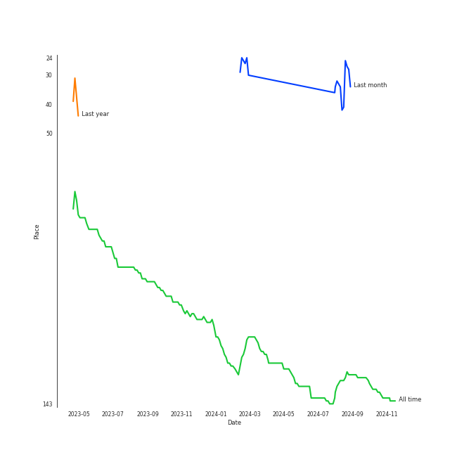

# Beyoncé

[See Track Features](audio_features.md)

[See Clusters](clusters/overview.md)

## Artist Rank
Beyoncé is currently:
- The #27 artist of the last month
- The #131 artist of all time

## Top Albums

| Art | Rank | Tracks | 💚 | Album | Release Date | 🔗 |
|:---|---:|---:|---:|:---|:---|:---|
|  | 619 | 5 | 2 | I AM...SASHA FIERCE | 2008-11-14 | [🔗](https://open.spotify.com/album/23Y5wdyP5byMFktZf8AcWU) |
|  | 619 | 4 | 3 | 4 | 2011-06-24 | [🔗](https://open.spotify.com/album/1gIC63gC3B7o7FfpPACZQJ) |
|  | 619 | 2 | 2 | Dangerously In Love | 2003-06-24 | [🔗](https://open.spotify.com/album/6oxVabMIqCMJRYN1GqR3Vf) |
|  | 619 | 2 | 1 | Lemonade | 2016-04-23 | [🔗](https://open.spotify.com/album/7dK54iZuOxXFarGhXwEXfF) |
|  | 619 | 2 | 1 | B'Day Deluxe Edition | 2007-05-29 | [🔗](https://open.spotify.com/album/0Zd10MKN5j9KwUST0TdBBB) |
|  | 619 | 1 | 1 | The Fame Monster (Deluxe Edition) | 2009-11-05 | [🔗](https://open.spotify.com/album/6rePArBMb5nLWEaY9aQqL4) |
|  | 619 | 1 | 1 | Music From The Motion Picture Cadillac Records | 2008-11-28 | [🔗](https://open.spotify.com/album/4b2zuwf7CPesdiTg1kFDjU) |
|  | 619 | 1 | 1 | COWBOY CARTER | 2024-03-29 | [🔗](https://open.spotify.com/album/6BzxX6zkDsYKFJ04ziU5xQ) |
|  | 619 | 1 | 0 | The Lion King (Original Motion Picture Soundtrack) | 2019-07-11 | [🔗](https://open.spotify.com/album/7e8y48Z2fkJNGBOKSECCeS) |
|  | 619 | 1 | 0 | RENAISSANCE | 2022-07-29 | [🔗](https://open.spotify.com/album/6FJxoadUE4JNVwWHghBwnb) |

See all albums

| Art | Rank | Tracks | 💚 | Album | Release Date | 🔗 |
|:---|---:|---:|---:|:---|:---|:---|
|  | 619 | 1 | 0 | BEYONCÉ [Platinum Edition] | 2014-11-24 | [🔗](https://open.spotify.com/album/2UJwKSBUz6rtW4QLK74kQu) |

## Featured on Playlists
| Art | Tracks | Playlist |
|:---|---:|:---|
|  | 17 | [R&B](../../playlists/r_b/overview.md) |
|  | 5 | [A-Pop Favorites](../../playlists/a-pop_favorites/overview.md) |
|  | 4 | [Pop](../../playlists/pop/overview.md) |
|  | 1 | [Summer](../../playlists/summer/overview.md) |
|  | 1 | [Not K-Pop](../../playlists/not_k-pop/overview.md) |
|  | 1 | [Country/Folk](../../playlists/country_folk/overview.md) |
|  | 1 | [Disney](../../playlists/disney/overview.md) |
|  | 1 | [Karaoke](../../playlists/karaoke/overview.md) |

## Top Record Labels

| Tracks | 💚 | Label |
|---:|---:|:---|
| 19 | 11 | [Columbia](../../labels/columbia/overview.md) |
| 9 | 5 | [Parkwood Entertainment](../../labels/parkwood_entertainment/overview.md) |
| 6 | 3 | Music World Music |
| 1 | 1 | [Interscope Records](../../labels/interscope_records/overview.md) |
| 1 | 0 | [Walt Disney Records](../../labels/walt_disney_records/overview.md) |

## Genres

- [pop](../../genres/pop/overview.md)
- [r&b](../../genres/r_b/overview.md)

## Credits

### Credits by Type

| Credit Type | Tracks |
|:---|---:|
| Performer | 1 |
| Producer | 9 |
| Songwriter | 10 |
| Vocal | 10 |

### Production Credits

| Art | Track | Credit Types |
|:---|:---|:---|
|  | Naughty Girl | Songwriter |
|  | Crazy In Love (feat. Jay-Z) | Producer, Songwriter |
|  | Listen (From the Motion Picture "Dreamgirls") | Songwriter |
|  | If I Were a Boy | Producer |
|  | Halo | Producer, Songwriter |
|  | Telephone | Songwriter |
|  | Love On Top | Producer, Songwriter |
|  | Countdown | Producer, Songwriter |
|  | I Was Here | Producer |
|  | Daddy Lessons | Producer, Songwriter |

View all

| Art | Track | Credit Types |
|:---|:---|:---|
|  | JA ARA E | Producer, Songwriter |
|  | TEXAS HOLD 'EM | Producer, Songwriter |

## Top Producers

| Art | Producer | Tracks | Credit Types |
|:---|:---|---:|:---|
|  | [Beyoncé](overview.md) | 11 | Producer, Songwriter |
| | [John Hanes](../../producers/john_hanes/overview.md) | 3 | Producer |
| | [Mark "Spike" Stent](../../producers/mark__spike__stent/overview.md) | 3 | Producer |
| | Jim Caruana | 3 | Producer |
| | [Serban Ghenea](../../producers/serban_ghenea/overview.md) | 3 | Producer |
| | DJ Swivel | 2 | Producer |
| | [Tony Maserati](../../producers/tony_maserati/overview.md) | 2 | Producer |
| | The-Dream | 2 | Songwriter |
| | Shea Taylor | 2 | Producer, Songwriter |
| | Stuart White | 2 | Producer |

View all

| Art | Producer | Tracks | Credit Types |
|:---|:---|---:|:---|
| | [Ryan Tedder](../../producers/ryan_tedder/overview.md) | 2 | Arranger, Producer, Songwriter |
| | BC Jean | 1 | Songwriter |
| | Toby Gad | 1 | Arranger, Producer, Songwriter |
| | Andrea Roberts | 1 | Producer |
|  | JAY-Z | 1 | Songwriter |
| | Kuk Harrell | 1 | Producer |
| | Lowell | 1 | Songwriter |
| | Lazonate Franklin | 1 | Songwriter |
| | Raphael Saadiq | 1 | Producer, Songwriter |
| | Anne Preven | 1 | Songwriter |
| | Diana Gordon | 1 | Songwriter |
| | Rich Harrison | 1 | Producer, Songwriter |
| | Derek Dixie | 1 | Producer |
| | Donna Summer | 1 | Songwriter |
| | Robert Waller | 1 | Songwriter |
| | Michael Bivins | 1 | Songwriter |
| | Pat Thrall | 1 | Producer |
| | Hit-Boy | 1 | Producer |
| | Paul Foley | 1 | Producer |
| | Scott Cutler | 1 | Songwriter |
| | David Campbell | 1 | Arranger |
| | Hotae Alexander Jang | 1 | Producer |
| | Brent Kutzle | 1 | Producer |
| | Nate Ferraro | 1 | Producer, Songwriter |
| | Kevin Cossom | 1 | Songwriter |
| | E. Kidd Bogart | 1 | Songwriter |
| | Cainon Lamb | 1 | Songwriter |
| | bülow (bülow) | 1 | Songwriter |
| | Jolie Levine | 1 | Arranger |
| | John Silas Cranfield | 1 | Producer |
| | Giorgio Moroder | 1 | Songwriter |
| | Alex Nibley | 1 | Producer |
| | Ester Dean | 1 | Songwriter |
| | Dabling Harward | 1 | Producer |
| | Aaron Renner | 1 | Producer |
| | Angela Beyince | 1 | Songwriter |
| | Alex Delicata | 1 | Producer, Songwriter |
| | The Underdogs | 1 | Producer |
| | Eugene Record | 1 | Songwriter |
| | Henry Krieger | 1 | Songwriter |
| | Brian Vincent Bates | 1 | Producer, Songwriter |
| | Pete Bellotte | 1 | Songwriter |
| | Scott Storch | 1 | Producer, Songwriter |
| | Mariel Gomerez | 1 | Producer |
| | LaShawn Daniels | 1 | Songwriter |
| | Matheus Braz | 1 | Producer |
| | Julie Frost | 1 | Songwriter |
| | Mike "Handz" Donaldson | 1 | Producer |
| | [Manny Marroquin](../../producers/manny_marroquin/overview.md) | 1 | Producer |
| | Rodney Jerkins | 1 | Producer, Songwriter |
| | Wanya Morris | 1 | Songwriter |
|  | [Lady Gaga](../lady_gaga/overview.md) | 1 | Producer, Songwriter |
| | Diane Warren | 1 | Songwriter |
| | Carlos Bedoya | 1 | Producer |
| | Rommel Nino Villanueva | 1 | Producer |
| | Chris Spilfogel | 1 | Producer |
| | Hisashi Mizoguchi | 1 | Producer |
| | Nathan Morris | 1 | Songwriter |

## Tracks

| Art | Track | Album | Artists | Label | Rank | 💚 | 🔗 |
|:---|:---|:---|:---|:---|---:|:---|:---|
|  | Crazy In Love (feat. Jay-Z) | Dangerously In Love | [Beyoncé](overview.md), JAY-Z | [Columbia](../../labels/columbia) | 934 | 💚 | [🔗](https://open.spotify.com/track/5IVuqXILoxVWvWEPm82Jxr) |
|  | Naughty Girl | Dangerously In Love | [Beyoncé](overview.md) | [Columbia](../../labels/columbia) | 934 | 💚 | [🔗](https://open.spotify.com/track/0YGQ3hZcRLC5YX7o0hdmHg) |
|  | Irreplaceable | B'Day Deluxe Edition | [Beyoncé](overview.md) | [Columbia](../../labels/columbia) | 934 | | [🔗](https://open.spotify.com/track/6RX5iL93VZ5fKmyvNXvF1r) |
|  | Listen (From the Motion Picture "Dreamgirls") | B'Day Deluxe Edition | [Beyoncé](overview.md) | [Columbia](../../labels/columbia) | 934 | 💚 | [🔗](https://open.spotify.com/track/4z7Ja0RNran3XpIvc1PIQz) |
|  | Ave Maria | I AM...SASHA FIERCE | [Beyoncé](overview.md) | [Music World Music/Columbia](../../labels/columbia) | 934 | | [🔗](https://open.spotify.com/track/1j9HwUMSkRUeVFRWlHcFsy) |
|  | Halo | I AM...SASHA FIERCE | [Beyoncé](overview.md) | [Music World Music/Columbia](../../labels/columbia) | 934 | 💚 | [🔗](https://open.spotify.com/track/3ERa3mEeOnrh2Mc47qM6T1) |
|  | If I Were a Boy | I AM...SASHA FIERCE | [Beyoncé](overview.md) | [Music World Music/Columbia](../../labels/columbia) | 934 | 💚 | [🔗](https://open.spotify.com/track/26NX1wPt1TRCH536yocd6i) |
|  | Single Ladies (Put a Ring on It) | I AM...SASHA FIERCE | [Beyoncé](overview.md) | [Music World Music/Columbia](../../labels/columbia) | 934 | | [🔗](https://open.spotify.com/track/2ZBNclC5wm4GtiWaeh0DMx) |
|  | Sweet Dreams | I AM...SASHA FIERCE | [Beyoncé](overview.md) | [Music World Music/Columbia](../../labels/columbia) | 934 | | [🔗](https://open.spotify.com/track/1FKxKGONukVFXWVJxAKmlz) |
|  | I'd Rather Go Blind | Music From The Motion Picture Cadillac Records | [Beyoncé](overview.md) | [Music World Music/Columbia](../../labels/columbia) | 934 | 💚 | [🔗](https://open.spotify.com/track/45eZSR0jA15KPI2HXVSifw) |

See all tracks

| Art | Track | Album | Artists | Label | Rank | 💚 | 🔗 |
|:---|:---|:---|:---|:---|---:|:---|:---|
|  | Telephone | The Fame Monster (Deluxe Edition) | [Lady Gaga](../lady_gaga/overview.md), [Beyoncé](overview.md) | [Interscope](../../labels/interscope_records) | 934 | 💚 | [🔗](https://open.spotify.com/track/4TCL0qqKyqsMZml0G3M9IM) |
|  | Best Thing I Never Had | 4 | [Beyoncé](overview.md) | [Columbia](../../labels/columbia), [Parkwood Entertainment](../../labels/parkwood_entertainment) | 934 | | [🔗](https://open.spotify.com/track/3lBRNqXjPp2j3JMTCXDTNO) |
|  | Countdown | 4 | [Beyoncé](overview.md) | [Columbia](../../labels/columbia), [Parkwood Entertainment](../../labels/parkwood_entertainment) | 934 | 💚 | [🔗](https://open.spotify.com/track/3axkNosdVQLZiq1HakuGhc) |
|  | I Was Here | 4 | [Beyoncé](overview.md) | [Columbia](../../labels/columbia), [Parkwood Entertainment](../../labels/parkwood_entertainment) | 934 | 💚 | [🔗](https://open.spotify.com/track/64Tp4KN5U5rtqrasP5a7FH) |
|  | Love On Top | 4 | [Beyoncé](overview.md) | [Columbia](../../labels/columbia), [Parkwood Entertainment](../../labels/parkwood_entertainment) | 934 | 💚 | [🔗](https://open.spotify.com/track/1z6WtY7X4HQJvzxC4UgkSf) |
|  | Partition | BEYONCÉ [Platinum Edition] | [Beyoncé](overview.md) | [Columbia](../../labels/columbia), [Parkwood Entertainment](../../labels/parkwood_entertainment) | 934 | | [🔗](https://open.spotify.com/track/5hgnY0mVcVetszbb85qeDg) |
|  | Daddy Lessons | Lemonade | [Beyoncé](overview.md) | [Columbia](../../labels/columbia), [Parkwood Entertainment](../../labels/parkwood_entertainment) | 934 | 💚 | [🔗](https://open.spotify.com/track/71OvX5NNLrmz7rpq1ANTQn) |
|  | Hold Up | Lemonade | [Beyoncé](overview.md) | [Columbia](../../labels/columbia), [Parkwood Entertainment](../../labels/parkwood_entertainment) | 934 | | [🔗](https://open.spotify.com/track/0rzNMzZsubFcXSEh7dnem7) |
|  | Can You Feel the Love Tonight | The Lion King (Original Motion Picture Soundtrack) | [Beyoncé](overview.md), Childish Gambino, Billy Eichner, Seth Rogen | [Walt Disney Records](../../labels/walt_disney_records) | 934 | | [🔗](https://open.spotify.com/track/1zSKtBze2IReYU44W0lDzd) |
|  | CUFF IT | RENAISSANCE | [Beyoncé](overview.md) | [Columbia](../../labels/columbia), [Parkwood Entertainment](../../labels/parkwood_entertainment) | 934 | | [🔗](https://open.spotify.com/track/1xzi1Jcr7mEi9K2RfzLOqS) |
|  | TEXAS HOLD 'EM | COWBOY CARTER | [Beyoncé](overview.md) | [Columbia](../../labels/columbia), [Parkwood Entertainment](../../labels/parkwood_entertainment) | 934 | 💚 | [🔗](https://open.spotify.com/track/7wLShogStyDeZvL0a6daN5) |

