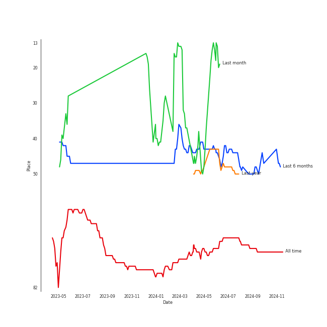
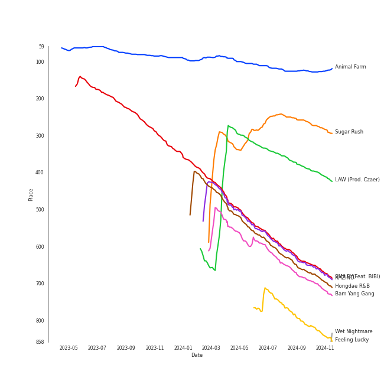
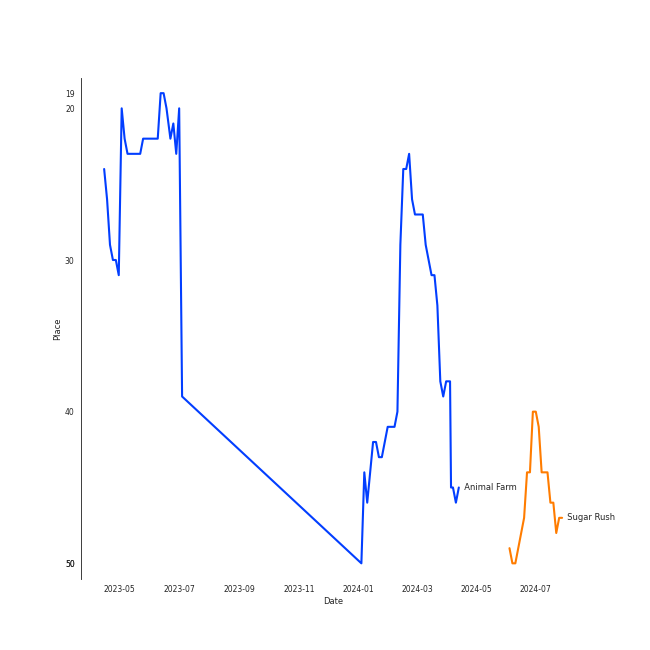
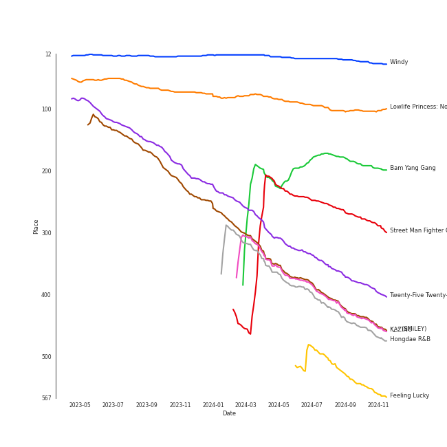
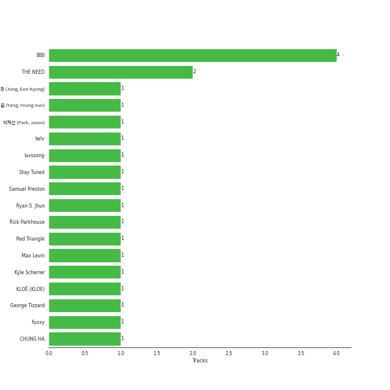

# BIBI

[See Track Features](audio_features.md)

[See Clusters](clusters/overview.md)

## Artist Rank
- The #71 artist of all time

## Top Tracks

### Top tracks of all time

Top tracks of the last 6 months over time

## Top Albums

| Art | Rank | Tracks | 💚 | Album | Release Date | 🔗 |
|:---|---:|---:|---:|:---|:---|:---|
|  | 101 | 3 | 3 | Lowlife Princess: Noir | 2022-11-18 | [🔗](https://open.spotify.com/album/0AwCgoJKJUOgLp1imhnxuH) |
|  | 173 | 2 | 2 | Bam Yang Gang | 2024-02-13 | [🔗](https://open.spotify.com/album/4QJZzFdGz2YlPZEHAlAJ6O) |
|  | 414 | 1 | 1 | ˣ‿ˣ (SMiLEY) | 2022-01-17 | [🔗](https://open.spotify.com/album/7qldKtsOWklzmwgll5NjCw) |
|  | 19 | 1 | 1 | Windy | 2021-07-05 | [🔗](https://open.spotify.com/album/1lv92CIVZbB2BsHmIx7qJf) |
|  | 364 | 1 | 1 | Twenty-Five Twenty-One OST | 2022-04-03 | [🔗](https://open.spotify.com/album/77NPr874WU941XZhjO43dR) |
|  | 264 | 1 | 1 | Street Man Fighter Original Vol.3 (Mission by Rank) | 2022-09-06 | [🔗](https://open.spotify.com/album/54UUQN3j32n8TA2OJxTcHP) |
|  | 417 | 1 | 1 | KAZINO | 2020-04-29 | [🔗](https://open.spotify.com/album/1f9cws6SZ0iKoHrcmn39ZY) |
|  | 430 | 1 | 1 | Hongdae R&B | 2023-08-31 | [🔗](https://open.spotify.com/album/7v7uC2wkD1Jh95G9Y5gbJb) |
|  | 520 | 1 | 1 | Feeling Lucky | 2024-04-26 | [🔗](https://open.spotify.com/album/4bc9PfPyv60qCh5S5g5eMb) |
|  | 616 | 1 | 1 | FEVER | 2019-12-01 | [🔗](https://open.spotify.com/album/1AF9DPA6J8zveFttZ247O0) |

See all albums

| Art | Rank | Tracks | 💚 | Album | Release Date | 🔗 |
|:---|---:|---:|---:|:---|:---|:---|
|  | 616 | 1 | 1 | Bare&Rare, Pt. 1 | 2022-07-11 | [🔗](https://open.spotify.com/album/0fgLDYoqdQw5bhzPFWvclR) |
|  | 616 | 1 | 1 | Amigos (with Becky G) | 2023-11-17 | [🔗](https://open.spotify.com/album/3HtYZEKcsbFqEzKX8xntam) |
|  | 616 | 1 | 0 | Second | 2021-08-09 | [🔗](https://open.spotify.com/album/0Nck83Sjn5RfHsITpO8GuZ) |

## Featured on Playlists
| Art | Tracks | Playlist |
|:---|---:|:---|
|  | 13 | [K-Pop](../../playlists/k-pop/overview.md) |
|  | 6 | [K-Pop-Adjacent](../../playlists/k-pop-adjacent/overview.md) |
|  | 2 | [Summer](../../playlists/summer/overview.md) |
|  | 2 | [K-Memes](../../playlists/k-memes/overview.md) |
|  | 2 | [Halloween](../../playlists/halloween/overview.md) |
|  | 1 | [Retro Kpop](../../playlists/retro_kpop/overview.md) |
|  | 1 | [K-Pop Favorites](../../playlists/k-pop_favorites/overview.md) |
|  | 1 | [Recent Comebacks](../../playlists/recent_comebacks/overview.md) |
|  | 1 | [International Pop](../../playlists/international_pop/overview.md) |
|  | 1 | [Your Top Songs 2023](../../playlists/your_top_songs_2023/overview.md) |
|  | 1 | [Workout](../../playlists/workout/overview.md) |
|  | 1 | [Relax](../../playlists/relax/overview.md) |
|  | 1 | [K-OST](../../playlists/k-ost/overview.md) |
|  | 1 | [Chill](../../playlists/chill/overview.md) |

## Top Record Labels

| Tracks | 💚 | Label |
|---:|---:|:---|
| 5 | 5 | [88rising Music](../../labels/88rising_music/overview.md) |
| 4 | 4 | FeelGhoodMusic |
| 4 | 4 | Feel Ghood Music |
| 2 | 2 | [Genie Music Corporation](../../labels/genie_music_corporation/overview.md) |
| 1 | 1 | [Universal Music LLC](../../labels/universal_music_llc/overview.md) |
| 1 | 1 | Studio MaumC |
| 1 | 1 | [Stone Music Entertainment](../../labels/stone_music_entertainment/overview.md) |
| 1 | 1 | [Republic Records](../../labels/republic_records/overview.md) |
| 1 | 1 | [MNH ENTERTAINMENT](../../labels/mnh_entertainment/overview.md) |
| 1 | 1 | Hwa&Dam pictures |
| 1 | 0 | [SM Entertainment](../../labels/sm_entertainment/overview.md) |

## Genres

- [k-pop](../../genres/k-pop/overview.md)
- [korean r&b](../../genres/korean_r_b/overview.md)

## Credits

### Credits by Type

| Credit Type | Tracks |
|:---|---:|
| Lyricist | 5 |
| Songwriter | 2 |

### Production Credits

| Art | Track | Credit Types |
|:---|:---|:---|
|  | MORE & MORE | Lyricist |
|  | Crazy Like You (feat. BIBI) | Lyricist |
|  | Wet Nightmare | Lyricist |
|  | Animal Farm | Lyricist, Songwriter |
|  | BIBI Vengeance | Lyricist, Songwriter |

## Top Producers

| Art | Producer | Tracks | Credit Types |
|:---|:---|---:|:---|
|  | [BIBI](overview.md) | 4 | Lyricist, Songwriter |
| | THE NEED | 2 | Arranger, Songwriter |
| | luvssong | 1 | Lyricist |
| | Rick Parkhouse | 1 | Lyricist, Songwriter |
| | KLOË (KLOE) | 1 | Lyricist, Songwriter |
| | Stay Tuned | 1 | Producer |
| | twlv | 1 | Songwriter |
| | [정은경 (Jung, Eun-Kyung)](../../producers/정은경_(jung,_eun-kyung)/overview.md) | 1 | Producer |
| | [Fuxxy](../../producers/fuxxy/overview.md) | 1 | Arranger |
| | Kyle Scherrer | 1 | Arranger, Songwriter |

View all

| Art | Producer | Tracks | Credit Types |
|:---|:---|---:|:---|
| | Samuel Preston | 1 | Lyricist, Songwriter |
| | [Ryan S. Jhun](../../producers/ryan_s__jhun/overview.md) | 1 | Arranger, Lyricist, Songwriter |
| | [양영은 (Yang, Young-eun)](../../producers/양영은_(yang,_young-eun)/overview.md) | 1 | Producer |
| | George Tizzard | 1 | Lyricist, Songwriter |
| | Max Levin | 1 | Arranger, Songwriter |
| | Red Triangle | 1 | Arranger |
|  | [CHUNG HA](../chung_ha/overview.md) | 1 | Lyricist |
| | 박재선 (Park, Jason) | 1 | Producer |

## Tracks

| Art | Track | Album | Artists | Label | Rank | 💚 | 🔗 |
|:---|:---|:---|:---|:---|---:|:---|:---|
|  | Animal Farm | Lowlife Princess: Noir | [BIBI](overview.md) | [Feel Ghood Music/88risingMusic](../../labels/88rising_music) | 125 | 💚 | [🔗](https://open.spotify.com/track/4g6ZT8vgKNq4iyEbezr3yI) |
|  | Sugar Rush | Bam Yang Gang | [BIBI](overview.md) | FeelGhoodMusic | 242 | 💚 | [🔗](https://open.spotify.com/track/5FJqpWkacWPUrXtJ5waI1j) |
|  | LAW (Prod. Czaer) | Street Man Fighter Original Vol.3 (Mission by Rank) | YOON MIRAE, [BIBI](overview.md) | [Genie Music Corporation](../../labels/genie_music_corporation) | 370 | 💚 | [🔗](https://open.spotify.com/track/0VES0jpNQEdRpD31gYDIMe) |
|  | SMILEY(Feat. BIBI) | ˣ‿ˣ (SMiLEY) | [YENA](../yena/overview.md), [BIBI](overview.md) | [Genie Music Corporation](../../labels/genie_music_corporation), [Stone Music Entertainment](../../labels/stone_music_entertainment) | 614 | 💚 | [🔗](https://open.spotify.com/track/4zCIxSnVWpGNghERX4uWZF) |
|  | KAZINO | KAZINO | [BIBI](overview.md) | FeelGhoodMusic | 619 | 💚 | [🔗](https://open.spotify.com/track/245onUPHGD1DYuiacxTuW0) |
|  | Hongdae R&B | Hongdae R&B | [BIBI](overview.md) | FeelGhoodMusic | 638 | 💚 | [🔗](https://open.spotify.com/track/5TIwTvdD7OpJBt0tqIWLH3) |
|  | Bam Yang Gang | Bam Yang Gang | [BIBI](overview.md) | FeelGhoodMusic | 659 | 💚 | [🔗](https://open.spotify.com/track/5juCu4WFTFRZ2XilopAMTy) |
|  | Feeling Lucky | Feeling Lucky | [BIBI](overview.md), [Jackson Wang](../jackson_wang/overview.md) | [88rising Music](../../labels/88rising_music) | 778 | 💚 | [🔗](https://open.spotify.com/track/53x0Yk1qOyurd2MefyF3Ny) |
|  | FEVER | FEVER | J.Y. Park, SUPERBEE, [BIBI](overview.md) | [Republic Records](../../labels/republic_records) | 929 | 💚 | [🔗](https://open.spotify.com/track/3XXLPdFK8PzlmRwwIsdxpe) |
|  | Is this bad b****** number? | Windy | [JEON SOYEON](../jeon_soyeon/overview.md), [BIBI](overview.md), Lee Young Ji | [Universal Music LLC](../../labels/universal_music_llc) | 929 | 💚 | [🔗](https://open.spotify.com/track/5xTy9p0IXI8lRaU6iLGikC) |

See all tracks

| Art | Track | Album | Artists | Label | Rank | 💚 | 🔗 |
|:---|:---|:---|:---|:---|---:|:---|:---|
|  | Second | Second | HYO, [BIBI](overview.md) | [SM Entertainment](../../labels/sm_entertainment) | 929 | | [🔗](https://open.spotify.com/track/4ghTyKLeMMTZQ85LwRbej0) |
|  | Very, Slowly | Twenty-Five Twenty-One OST | [BIBI](overview.md) | Studio MaumC, Hwa&Dam pictures | 929 | 💚 | [🔗](https://open.spotify.com/track/1dpLjawAb5PhlDr1w1diEe) |
|  | Crazy Like You (feat. BIBI) | Bare&Rare, Pt. 1 | [CHUNG HA](../chung_ha/overview.md), [BIBI](overview.md) | [MNH ENTERTAINMENT](../../labels/mnh_entertainment) | 929 | 💚 | [🔗](https://open.spotify.com/track/0oUK4m2wNIBPfejlcB1N9k) |
|  | BIBI Vengeance | Lowlife Princess: Noir | [BIBI](overview.md) | [Feel Ghood Music/88risingMusic](../../labels/88rising_music) | 929 | 💚 | [🔗](https://open.spotify.com/track/6vq6B6ENjap5Ea1T4GkrFA) |
|  | Wet Nightmare | Lowlife Princess: Noir | [BIBI](overview.md) | [Feel Ghood Music/88risingMusic](../../labels/88rising_music) | 929 | 💚 | [🔗](https://open.spotify.com/track/1MCRRGM8G6papoKnE7xtLN) |
|  | Amigos (with Becky G) | Amigos (with Becky G) | [BIBI](overview.md), Becky G | [Feel Ghood Music/88rising Music](../../labels/88rising_music) | 929 | 💚 | [🔗](https://open.spotify.com/track/60DPrTJRHzpGPSJXLiSdDX) |

