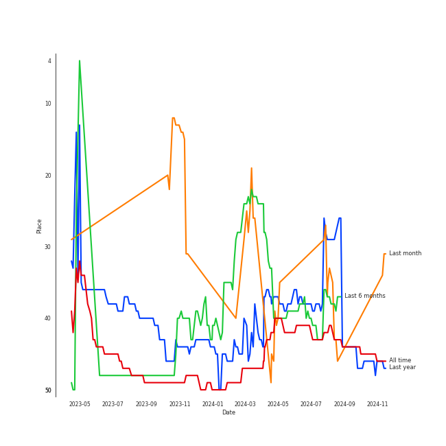
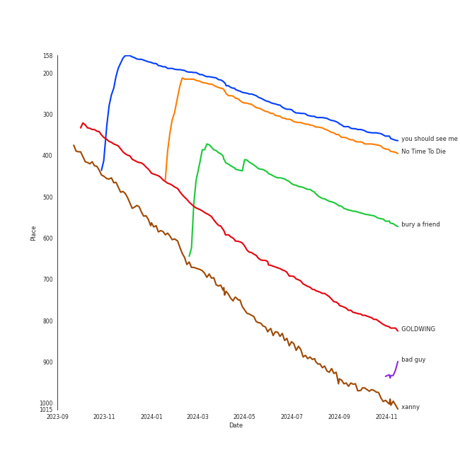
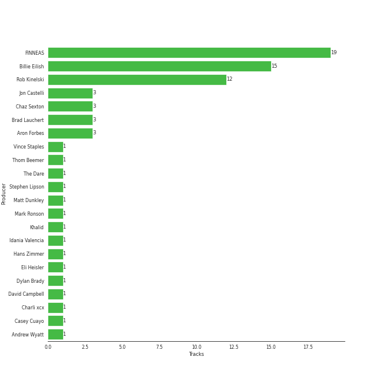

# Billie Eilish

[See Track Features](audio_features.md)

[See Clusters](clusters/overview.md)

## Artist Rank
Billie Eilish is currently:
- The #39 artist of the last 6 months
- The #36 artist of all time
- The #42 artist overall

## Top Tracks

### Top tracks, aggregated

## Featured on Playlists
| Art | Tracks | Playlist |
|:---|---:|:---|
|  | 15 | [Pop](../../playlists/pop/overview.md) |
|  | 15 | [Alt-Pop](../../playlists/alt-pop/overview.md) |
|  | 5 | [Halloween](../../playlists/halloween/overview.md) |
|  | 3 | [Chill](../../playlists/chill/overview.md) |
|  | 2 | [A-Pop Favorites](../../playlists/a-pop_favorites/overview.md) |
|  | 1 | [Beat Drop!](../../playlists/beat_drop!/overview.md) |

## Top Albums

| Art | Tracks | 💚 | Album | Release Date | 🔗 |
|:---|---:|---:|:---|:---|:---|
|  | 5 | 5 | WHEN WE ALL FALL ASLEEP, WHERE DO WE GO? | 2019-03-29 | [🔗](https://open.spotify.com/album/0S0KGZnfBGSIssfF54WSJh) |
|  | 3 | 2 | Happier Than Ever | 2021-07-30 | [🔗](https://open.spotify.com/album/0JGOiO34nwfUdDrD612dOp) |
|  | 2 | 2 | dont smile at me | 2017-12-22 | [🔗](https://open.spotify.com/album/7fRrTyKvE4Skh93v97gtcU) |
|  | 1 | 1 | lovely (with Khalid) | 2018-04-19 | [🔗](https://open.spotify.com/album/2sBB17RXTamvj7Ncps15AK) |
|  | 1 | 1 | everything i wanted | 2019-11-13 | [🔗](https://open.spotify.com/album/4i3rAwPw7Ln2YrKDusaWyT) |
|  | 1 | 1 | What Was I Made For? [From The Motion Picture "Barbie"] | 2023-07-13 | [🔗](https://open.spotify.com/album/3AafSrFIbJPH6BJHiJm1Cd) |
|  | 1 | 1 | No Time To Die | 2020-02-13 | [🔗](https://open.spotify.com/album/5sXSHscDjBez8VF20cSyad) |
|  | 1 | 1 | HIT ME HARD AND SOFT | 2024-05-17 | [🔗](https://open.spotify.com/album/7aJuG4TFXa2hmE4z1yxc3n) |
|  | 1 | 0 | Guitar Songs | 2022-07-21 | [🔗](https://open.spotify.com/album/1YPWxMpQEC8kcOuefgXbhj) |

## Top Record Labels

| Tracks | 💚 | Label |
|---:|---:|:---|
| 16 | 14 | [Darkroom](../../labels/darkroom/overview.md) |
| 13 | 11 | [Interscope Records](../../labels/interscope_records/overview.md) |

## Genres

- [art pop](../../genres/art_pop/overview.md)
- [pop](../../genres/pop/overview.md)

## Credits

### Credits by Type

| Credit Type | Tracks |
|:---|---:|
| Instrument | 2 |
| Lyricist | 2 |
| Producer | 3 |
| Songwriter | 11 |
| Vocal | 9 |

### Production Credits

| Art | Track | Credit Types |
|:---|:---|:---|
|  | lovely (with Khalid) | Lyricist, Songwriter |
|  | bad guy | Songwriter |
|  | you should see me in a crown | Songwriter |
|  | xanny | Songwriter |
|  | bury a friend | Songwriter |
|  | everything i wanted | Songwriter |
|  | No Time To Die | Songwriter |
|  | GOLDWING | Producer, Songwriter |
|  | Therefore I Am | Lyricist, Songwriter |
|  | What Was I Made For? [From The Motion Picture "Barbie"] | Producer, Songwriter |

View all

| Art | Track | Credit Types |
|:---|:---|:---|
|  | LUNCH | Producer, Songwriter |

## Top Producers

| Art | Producer | Tracks | Credit Types |
|:---|:---|---:|:---|
| | [FINNEAS](../../producers/finneas/overview.md) | 14 | Lyricist, Producer, Songwriter, Arranger |
|  | [Billie Eilish](overview.md) | 11 | Lyricist, Songwriter, Producer |
| | Rob Kinelski | 10 | Producer |
| | Casey Cuayo | 1 | Producer |
|  | Khalid | 1 | Lyricist, Songwriter |
| | Chaz Sexton | 1 | Producer |
| | Andrew Wyatt | 1 | Arranger, Producer |
| | Jon Castelli | 1 | Producer |
| | Stephen Lipson | 1 | Producer |
|  | Mark Ronson | 1 | Arranger, Producer |

View all

| Art | Producer | Tracks | Credit Types |
|:---|:---|---:|:---|
| | Brad Lauchert | 1 | Producer |
| | Aron Forbes | 1 | Producer |
| | Matt Dunkley | 1 | Arranger |
| | Eli Heisler | 1 | Producer |
| | Hans Zimmer | 1 | Arranger |

## Tracks

| Art | Track | Album | Artists | Label | Rank | 💚 | 🔗 |
|:---|:---|:---|:---|:---|---:|:---|:---|
|  | you should see me in a crown | WHEN WE ALL FALL ASLEEP, WHERE DO WE GO? | [Billie Eilish](overview.md) | [Darkroom](../../labels/darkroom), [Interscope Records](../../labels/interscope_records) | 437 | 💚 | [🔗](https://open.spotify.com/track/3XF5xLJHOQQRbWya6hBp7d) |
|  | No Time To Die | No Time To Die | [Billie Eilish](overview.md) | [Darkroom](../../labels/darkroom), [Interscope Records](../../labels/interscope_records) | 439 | 💚 | [🔗](https://open.spotify.com/track/73SpzrcaHk0RQPFP73vqVR) |
|  | bury a friend | WHEN WE ALL FALL ASLEEP, WHERE DO WE GO? | [Billie Eilish](overview.md) | [Darkroom](../../labels/darkroom), [Interscope Records](../../labels/interscope_records) | 444 | 💚 | [🔗](https://open.spotify.com/track/4SSnFejRGlZikf02HLewEF) |
|  | GOLDWING | Happier Than Ever | [Billie Eilish](overview.md) | [Darkroom](../../labels/darkroom), [Interscope Records](../../labels/interscope_records) | 447 | 💚 | [🔗](https://open.spotify.com/track/0FfqyjhB6Kspvit1oOo7ax) |
|  | xanny | WHEN WE ALL FALL ASLEEP, WHERE DO WE GO? | [Billie Eilish](overview.md) | [Darkroom](../../labels/darkroom), [Interscope Records](../../labels/interscope_records) | 449 | 💚 | [🔗](https://open.spotify.com/track/4QIo4oxwzzafcBWkKjDpXY) |
|  | lovely (with Khalid) | lovely (with Khalid) | [Billie Eilish](overview.md), Khalid | [Darkroom](../../labels/darkroom) | 1023 | 💚 | [🔗](https://open.spotify.com/track/0u2P5u6lvoDfwTYjAADbn4) |
|  | Therefore I Am | Happier Than Ever | [Billie Eilish](overview.md) | [Darkroom](../../labels/darkroom), [Interscope Records](../../labels/interscope_records) | 1268 | 💚 | [🔗](https://open.spotify.com/track/20R4HfKloPKgXDqU7UKk3x) |
|  | bad guy | WHEN WE ALL FALL ASLEEP, WHERE DO WE GO? | [Billie Eilish](overview.md) | [Darkroom](../../labels/darkroom), [Interscope Records](../../labels/interscope_records) | 1328 | 💚 | [🔗](https://open.spotify.com/track/2Fxmhks0bxGSBdJ92vM42m) |
|  | TV | Guitar Songs | [Billie Eilish](overview.md) | [Darkroom](../../labels/darkroom), [Interscope Records](../../labels/interscope_records) | 1548 | | [🔗](https://open.spotify.com/track/3GYlZ7tbxLOxe6ewMNVTkw) |
|  | everything i wanted | everything i wanted | [Billie Eilish](overview.md) | [Darkroom](../../labels/darkroom), [Interscope Records](../../labels/interscope_records) | 1618 | 💚 | [🔗](https://open.spotify.com/track/3ZCTVFBt2Brf31RLEnCkWJ) |

See all tracks

| Art | Track | Album | Artists | Label | Rank | 💚 | 🔗 |
|:---|:---|:---|:---|:---|---:|:---|:---|
|  | when the party's over | WHEN WE ALL FALL ASLEEP, WHERE DO WE GO? | [Billie Eilish](overview.md) | [Darkroom](../../labels/darkroom), [Interscope Records](../../labels/interscope_records) | 1729 | 💚 | [🔗](https://open.spotify.com/track/43zdsphuZLzwA9k4DJhU0I) |
|  | Happier Than Ever | Happier Than Ever | [Billie Eilish](overview.md) | [Darkroom](../../labels/darkroom), [Interscope Records](../../labels/interscope_records) | 1819 | | [🔗](https://open.spotify.com/track/4RVwu0g32PAqgUiJoXsdF8) |
|  | LUNCH | HIT ME HARD AND SOFT | [Billie Eilish](overview.md) | [Darkroom](../../labels/darkroom), [Interscope Records](../../labels/interscope_records) | 2189 | 💚 | [🔗](https://open.spotify.com/track/629DixmZGHc7ILtEntuiWE) |
|  | What Was I Made For? [From The Motion Picture "Barbie"] | What Was I Made For? [From The Motion Picture "Barbie"] | [Billie Eilish](overview.md) | [Darkroom](../../labels/darkroom), [Interscope Records](../../labels/interscope_records) | 2406 | 💚 | [🔗](https://open.spotify.com/track/6wf7Yu7cxBSPrRlWeSeK0Q) |
|  | watch | dont smile at me | [Billie Eilish](overview.md) | [Darkroom](../../labels/darkroom) | 2527 | 💚 | [🔗](https://open.spotify.com/track/7eB1V5LvAdxCc7brfGhRRo) |
|  | ocean eyes | dont smile at me | [Billie Eilish](overview.md) | [Darkroom](../../labels/darkroom) | 2537 | 💚 | [🔗](https://open.spotify.com/track/7hDVYcQq6MxkdJGweuCtl9) |

