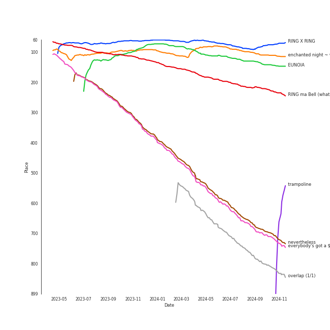
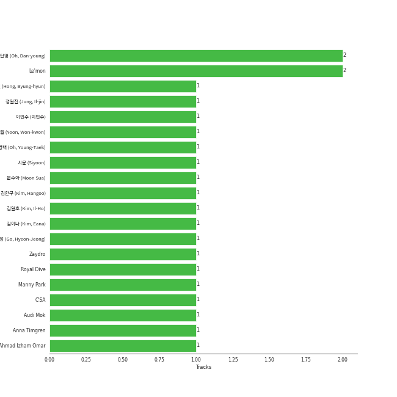

# Billlie

[See Track Features](audio_features.md)

[See Clusters](clusters/overview.md)

## Relationships

Billlie:
- has member 하람 (Haram)
- has member 하루나 (Haruna)
- has member 문수아 (Moon Sua)
- has member 션 (Sheon)
- has member 시윤 (Siyoon)
- has member 수현 (Suhyeon)
- has member 츠키 (Tsuki)

## Artist Rank
Billlie is currently:
- The #42 artist of the last month
- The #37 artist of the last 6 months
- The #26 artist of all time

## Top Tracks

- RING X RING is the #23 track of all time
- enchanted night ~ white night is the #27 track of all time

### Top tracks, aggregated

### Top tracks of all time over time

### Top tracks of the last 6 months over time

## Featured on Playlists
| Art | Tracks | Playlist |
|:---|---:|:---|
|  | 14 | [K-Pop](../../playlists/k-pop/overview.md) |
|  | 4 | [K-Pop Favorites](../../playlists/k-pop_favorites/overview.md) |
|  | 3 | [Your Top Songs 2023](../../playlists/your_top_songs_2023/overview.md) |
|  | 3 | [Chill](../../playlists/chill/overview.md) |
|  | 2 | [Funk](../../playlists/funk/overview.md) |
|  | 1 | [Workout](../../playlists/workout/overview.md) |
|  | 1 | [Recommendations for Jeff](../../playlists/recommendations_for_jeff/overview.md) |
|  | 1 | [Halloween](../../playlists/halloween/overview.md) |
|  | 1 | [Classical Samples](../../playlists/classical_samples/overview.md) |
|  | 1 | [Christmas](../../playlists/christmas/overview.md) |

## Top Albums

| Art | Tracks | 💚 | Album | Release Date | 🔗 |
|:---|---:|---:|:---|:---|:---|
|  | 4 | 3 | the Billage of perception: chapter three | 2023-03-28 | [🔗](https://open.spotify.com/album/5bt0sTLia4il2rIlpqUo5g) |
|  | 4 | 3 | the Billage of perception : chapter one | 2021-11-10 | [🔗](https://open.spotify.com/album/1kp4txZsSpDNR4EoDFi2LD) |
|  | 3 | 3 | the collective soul and unconscious: chapter one | 2022-02-23 | [🔗](https://open.spotify.com/album/4ophrgcnwWi1I5nWYImyhw) |
|  | 3 | 2 | the Billage of perception: chapter two | 2022-08-31 | [🔗](https://open.spotify.com/album/0NuM7kwh6u6fIRjn7Zh7Ss) |
|  | 1 | 0 | the collective soul and unconscious: snowy night | 2021-12-14 | [🔗](https://open.spotify.com/album/1wFkvpm5VhzNDNo8xqdBV1) |

## Top Record Labels

| Tracks | 💚 | Label |
|---:|---:|:---|
| 15 | 11 | [MYSTIC STORY](../../labels/mystic_story/overview.md) |

## Genres

- [k-pop](../../genres/k-pop/overview.md)

## Credits

### Member Credits

| | 문수아 (Moon Sua) | 시윤 (Siyoon) |
|:---|---:|---:|
| Lyricist | 1 | 1 |
### Production Credits

| Art | Track | Members | Credit Types |
|:---|:---|:---|:---|
|  | RING X RING | 문수아 (Moon Sua), 시윤 (Siyoon) | Lyricist |

## Top Producers

| Art | Producer | Tracks | Credit Types |
|:---|:---|---:|:---|
| | 오단영 (Oh, Dan-young) | 2 | Producer |
| | 문수아 (Moon Sua) | 1 | Lyricist |
| | Ahmad Izham Omar | 1 | Songwriter |
| | [김이나 (Kim, Eana)](../../producers/김이나_(kim,_eana)/overview.md) | 1 | Lyricist |
| | Anna Timgren | 1 | Songwriter |
| | Le'mon | 1 | Lyricist |
| | 시윤 (Siyoon) | 1 | Lyricist |
| | Zaydro | 1 | Songwriter |
| | [이민수 (이민수)](../../producers/이민수_(이민수)/overview.md) | 1 | Arranger, Songwriter |
| | 고현정 (Go, Hyeon-Jeong) | 1 | Producer |

View all

| Art | Producer | Tracks | Credit Types |
|:---|:---|---:|:---|
| | Audi Mok | 1 | Songwriter |
| | 김일호 (Kim, Il-Ho) | 1 | Producer |

## Tracks

| Art | Track | Album | Artists | Label | Rank | 💚 | 🔗 |
|:---|:---|:---|:---|:---|---:|:---|:---|
|  | RING X RING | the Billage of perception : chapter one | [Billlie](overview.md) | [MYSTIC STORY](../../labels/mystic_story) | 62 | 💚 | [🔗](https://open.spotify.com/track/4hfF0FOFcaiOtwY3NP5hnv) |
|  | enchanted night ~ white night | the Billage of perception: chapter three | [Billlie](overview.md) | [MYSTIC STORY](../../labels/mystic_story) | 88 | 💚 | [🔗](https://open.spotify.com/track/0rTXn4ovXalJGkJMx5hsnX) |
|  | EUNOIA | the Billage of perception: chapter three | [Billlie](overview.md) | [MYSTIC STORY](../../labels/mystic_story) | 101 | 💚 | [🔗](https://open.spotify.com/track/5ICowHre7VraSKaRw3do8N) |
|  | RING ma Bell (what a wonderful world) | the Billage of perception: chapter two | [Billlie](overview.md) | [MYSTIC STORY](../../labels/mystic_story) | 171 | 💚 | [🔗](https://open.spotify.com/track/2b2Nibg3lTUTKctwwb7bEv) |
|  | nevertheless | the Billage of perception: chapter three | [Billlie](overview.md) | [MYSTIC STORY](../../labels/mystic_story) | 523 | 💚 | [🔗](https://open.spotify.com/track/26fVl2CYeXXxD4yEqmhrpM) |
|  | everybody's got a $ECRET | the Billage of perception : chapter one | [Billlie](overview.md) | [MYSTIC STORY](../../labels/mystic_story) | 533 | 💚 | [🔗](https://open.spotify.com/track/490hT7WcJnqR69Tgb7uY2U) |
|  | overlap (1/1) | the collective soul and unconscious: chapter one | [Billlie](overview.md) | [MYSTIC STORY](../../labels/mystic_story) | 612 | 💚 | [🔗](https://open.spotify.com/track/3VMbll8GQGlE1WuWaTPtxJ) |
|  | flipp!ng a coin | the Billage of perception : chapter one | [Billlie](overview.md) | [MYSTIC STORY](../../labels/mystic_story) | nan | | [🔗](https://open.spotify.com/track/2UQLDRnG7IwlXrdmYTA6sv) |
|  | the eleventh day | the Billage of perception : chapter one | [Billlie](overview.md) | [MYSTIC STORY](../../labels/mystic_story) | nan | 💚 | [🔗](https://open.spotify.com/track/4YldhqpCghwJalBtiCRtl1) |
|  | snowy night | the collective soul and unconscious: snowy night | [Billlie](overview.md) | [MYSTIC STORY](../../labels/mystic_story) | nan | | [🔗](https://open.spotify.com/track/7ajApbhtm75giJ9Sj6qRnO) |

See all tracks

| Art | Track | Album | Artists | Label | Rank | 💚 | 🔗 |
|:---|:---|:---|:---|:---|---:|:---|:---|
|  | GingaMingaYo (the strange world) | the collective soul and unconscious: chapter one | [Billlie](overview.md) | [MYSTIC STORY](../../labels/mystic_story) | nan | 💚 | [🔗](https://open.spotify.com/track/3jHg6QE70y2FTdnsxSrCbv) |
|  | a sign ~ anonymous | the collective soul and unconscious: chapter one | [Billlie](overview.md) | [MYSTIC STORY](../../labels/mystic_story) | nan | 💚 | [🔗](https://open.spotify.com/track/3PBgdAFxOThx0srS6VkS0F) |
|  | B’rave ~ a song for Matilda | the Billage of perception: chapter two | [Billlie](overview.md) | [MYSTIC STORY](../../labels/mystic_story) | nan | | [🔗](https://open.spotify.com/track/78Kr4lzSgXyE11fq4ncILK) |
|  | Mcguffins ~ who’s the Joker? | the Billage of perception: chapter two | [Billlie](overview.md) | [MYSTIC STORY](../../labels/mystic_story) | nan | 💚 | [🔗](https://open.spotify.com/track/1MtbRyRbGe4qXMSNN999iI) |
|  | lionheart (the real me) | the Billage of perception: chapter three | [Billlie](overview.md) | [MYSTIC STORY](../../labels/mystic_story) | nan | | [🔗](https://open.spotify.com/track/1ztAWoArE8k4zLunYD8IXa) |

