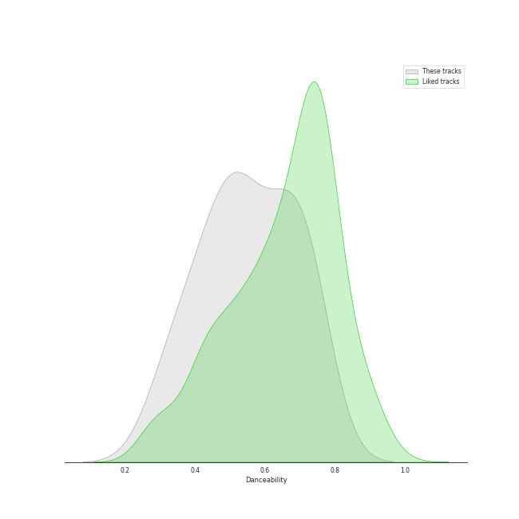
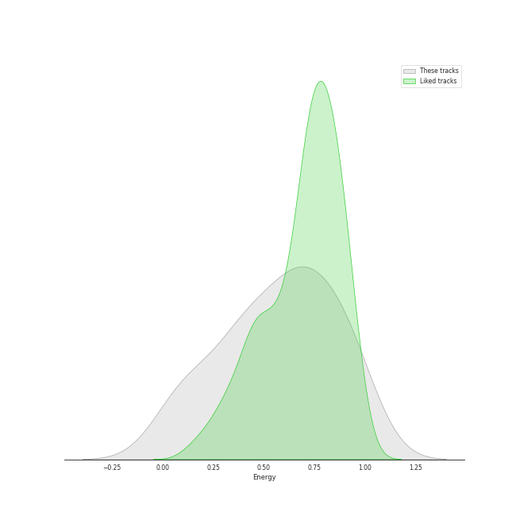
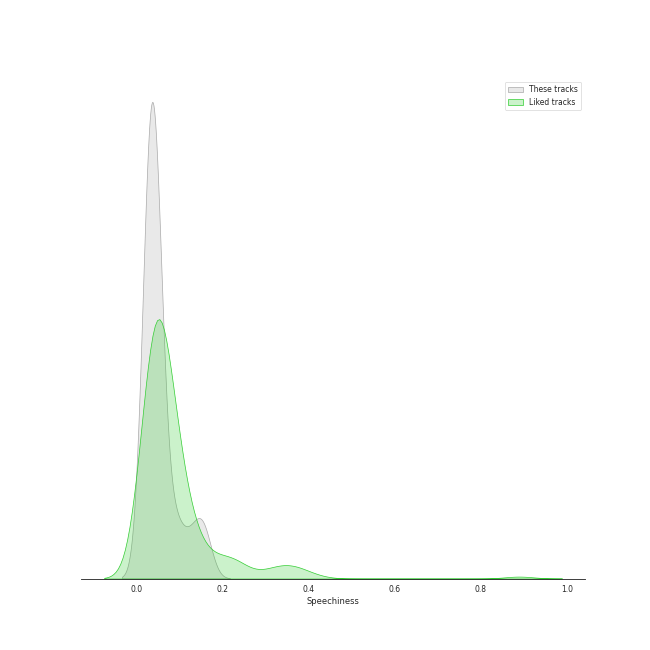
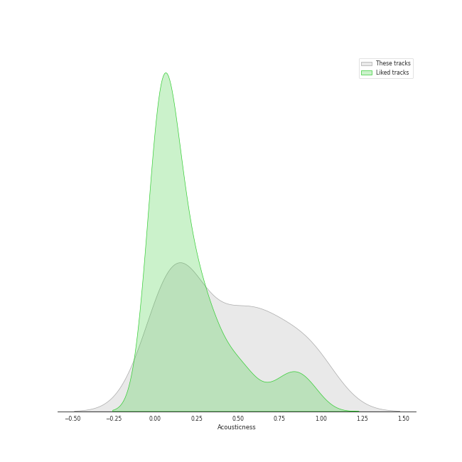
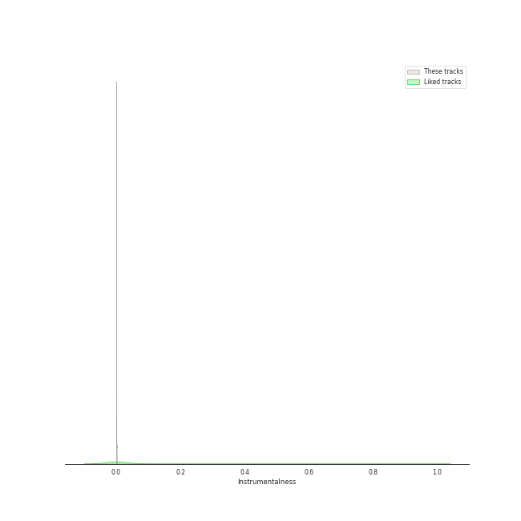
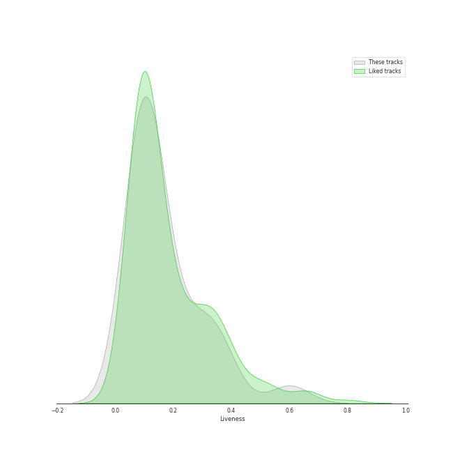
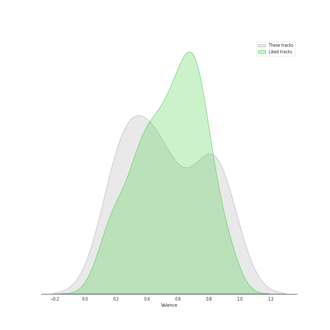
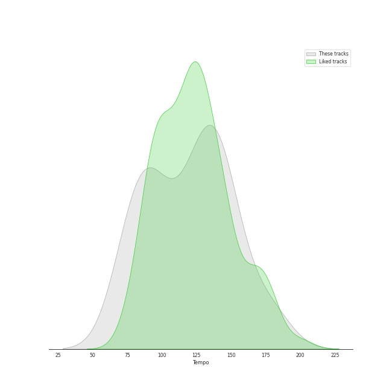

# Track Features for Billy Joel

## Danceability

| ​ | 10 most Danceable tracks | ​​ | 10 least Danceable tracks |
|:---|:---|:---|:---|
|  | My Life (0.741) |  | She's Always a Woman (0.292) |
|  | A Matter of Trust (0.738) |  | Piano Man (0.334) |
|  | We Didn't Start the Fire (0.712) |  | And So It Goes (0.351) |
|  | Uptown Girl (0.701) |  | Captain Jack (0.392) |
|  | Don't Ask Me Why (0.691) |  | Scenes from an Italian Restaurant (0.415) |
|  | The Stranger (0.664) |  | And So It Goes (0.433) |
|  | Movin' Out (Anthony's Song) (0.664) |  | Lullabye (Goodnight, My Angel) (0.442) |
|  | The Longest Time (0.637) |  | Light As the Breeze (0.485) |
|  | The River of Dreams (0.631) |  | She's Got a Way (0.495) |
|  | Just the Way You Are (0.589) |  | Turn the Lights Back On (0.502) |

## Energy

| ​ | 10 most Energetic tracks | ​​ | 10 least Energetic tracks |
|:---|:---|:---|:---|
|  | We Didn't Start the Fire (0.967) |  | And So It Goes (0.0387) |
|  | Uptown Girl (0.944) |  | And So It Goes (0.0871) |
|  | Scenes from an Italian Restaurant (0.931) |  | She's Got a Way (0.142) |
|  | Movin' Out (Anthony's Song) (0.88) |  | Lullabye (Goodnight, My Angel) (0.157) |
|  | The Stranger (0.878) |  | She's Always a Woman (0.324) |
|  | Only the Good Die Young (0.872) |  | The Longest Time (0.333) |
|  | The River of Dreams (0.749) |  | New York State of Mind (0.373) |
|  | Big Shot (0.737) |  | Light As the Breeze (0.398) |
|  | Don't Ask Me Why (0.726) |  | Just the Way You Are (0.453) |
|  | Pressure (0.68) |  | Turn the Lights Back On (0.469) |

## Speechiness

| ​ | 10 most Speechy tracks | ​​ | 10 least Speechy tracks |
|:---|:---|:---|:---|
|  | Only the Good Die Young (0.159) |  | The Longest Time (0.0262) |
|  | Scenes from an Italian Restaurant (0.126) |  | Turn the Lights Back On (0.0264) |
|  | Big Shot (0.0972) |  | A Matter of Trust (0.0268) |
|  | The Stranger (0.0837) |  | Piano Man (0.0276) |
|  | The River of Dreams (0.0576) |  | Light As the Breeze (0.0295) |
|  | Don't Ask Me Why (0.0543) |  | Lullabye (Goodnight, My Angel) (0.0324) |
|  | Pressure (0.0474) |  | Movin' Out (Anthony's Song) (0.0326) |
|  | We Didn't Start the Fire (0.047) |  | And So It Goes (0.0341) |
|  | Uptown Girl (0.0455) |  | Vienna (0.0343) |
|  | Captain Jack (0.0447) |  | She's Always a Woman (0.0346) |

## Acousticness

| ​ | 10 most Acoustic tracks | ​​ | 10 least Acoustic tracks |
|:---|:---|:---|:---|
|  | She's Got a Way (0.97) |  | Pressure (0.0148) |
|  | Lullabye (Goodnight, My Angel) (0.948) |  | A Matter of Trust (0.0589) |
|  | And So It Goes (0.941) |  | Uptown Girl (0.0755) |
|  | And So It Goes (0.91) |  | We Didn't Start the Fire (0.0771) |
|  | She's Always a Woman (0.797) |  | My Life (0.108) |
|  | Just the Way You Are (0.703) |  | Don't Ask Me Why (0.138) |
|  | Vienna (0.659) |  | Big Shot (0.156) |
|  | Turn the Lights Back On (0.643) |  | Only the Good Die Young (0.159) |
|  | Piano Man (0.618) |  | The Stranger (0.165) |
|  | Captain Jack (0.562) |  | The Longest Time (0.181) |

## Instrumentalness

| ​ | 10 most Instrumental tracks | ​​ | 10 least Instrumental tracks |
|:---|:---|:---|:---|
|  | My Life (0.00139) |  | Turn the Lights Back On (0.0) |
|  | Pressure (0.000949) |  | And So It Goes (0.0) |
|  | Scenes from an Italian Restaurant (0.000501) |  | Only the Good Die Young (0.0) |
|  | She's Always a Woman (0.000473) |  | We Didn't Start the Fire (0.0) |
|  | Captain Jack (6.12e-05) |  | Lullabye (Goodnight, My Angel) (0.0) |
|  | A Matter of Trust (4.54e-05) |  | The Longest Time (0.0) |
|  | New York State of Mind (4.05e-05) |  | Uptown Girl (0.0) |
|  | Just the Way You Are (2.54e-05) |  | Don't Ask Me Why (0.0) |
|  | And So It Goes (1.98e-05) |  | Vienna (0.0) |
|  | Light As the Breeze (1.76e-05) |  | She's Got a Way (1.93e-06) |

## Liveness

| ​ | 10 most Live tracks | ​​ | 10 least Live tracks |
|:---|:---|:---|:---|
|  | Uptown Girl (0.601) |  | My Life (0.0555) |
|  | Captain Jack (0.374) |  | Movin' Out (Anthony's Song) (0.0591) |
|  | We Didn't Start the Fire (0.356) |  | The River of Dreams (0.0667) |
|  | New York State of Mind (0.323) |  | Vienna (0.0754) |
|  | Piano Man (0.312) |  | The Stranger (0.0812) |
|  | A Matter of Trust (0.306) |  | Big Shot (0.0866) |
|  | Turn the Lights Back On (0.271) |  | Pressure (0.0877) |
|  | Lullabye (Goodnight, My Angel) (0.224) |  | Only the Good Die Young (0.0935) |
|  | The Longest Time (0.147) |  | Don't Ask Me Why (0.11) |
|  | And So It Goes (0.139) |  | And So It Goes (0.113) |

## Valence

| ​ | 10 most Happy tracks | ​​ | 10 least Happy tracks |
|:---|:---|:---|:---|
|  | Movin' Out (Anthony's Song) (0.895) |  | Light As the Breeze (0.19) |
|  | We Didn't Start the Fire (0.895) |  | New York State of Mind (0.194) |
|  | A Matter of Trust (0.88) |  | She's Got a Way (0.196) |
|  | Don't Ask Me Why (0.868) |  | Lullabye (Goodnight, My Angel) (0.22) |
|  | Pressure (0.851) |  | The Stranger (0.222) |
|  | My Life (0.804) |  | And So It Goes (0.24) |
|  | Uptown Girl (0.792) |  | Vienna (0.308) |
|  | Only the Good Die Young (0.761) |  | And So It Goes (0.336) |
|  | Big Shot (0.728) |  | Scenes from an Italian Restaurant (0.339) |
|  | The Longest Time (0.588) |  | She's Always a Woman (0.384) |

## Tempo

| ​ | 10 most Fast tracks | ​​ | 10 least Fast tracks |
|:---|:---|:---|:---|
|  | Piano Man (179.239) |  | She's Got a Way (75.859) |
|  | She's Always a Woman (176.631) |  | Only the Good Die Young (76.214) |
|  | Big Shot (149.861) |  | Lullabye (Goodnight, My Angel) (76.48) |
|  | Pressure (148.494) |  | Turn the Lights Back On (83.123) |
|  | Captain Jack (146.657) |  | The Longest Time (84.347) |
|  | We Didn't Start the Fire (145.024) |  | The River of Dreams (89.646) |
|  | Just the Way You Are (139.148) |  | The Stranger (91.881) |
|  | And So It Goes (135.498) |  | Light As the Breeze (95.65) |
|  | Movin' Out (Anthony's Song) (133.898) |  | Scenes from an Italian Restaurant (97.953) |
|  | My Life (131.097) |  | Don't Ask Me Why (98.418) |
