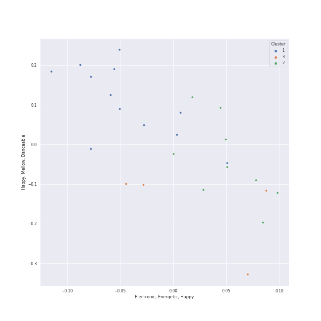

# Clusters in Billy Joel

## Cluster #1

16 tracks

| Art | Track | Album | Artists | Label | Rank | 💚 | 🔗 |
|:---|:---|:---|:---|:---|---:|:---|:---|
|  | Just the Way You Are | The Stranger | [Billy Joel](../../overview.md) | [Columbia](../../../../labels/columbia) | 756 | 💚 | [🔗](https://open.spotify.com/track/06RdYCp0UxsBtWsonHfSZz) |
|  | She's Always a Woman | The Stranger | [Billy Joel](../../overview.md) | [Columbia](../../../../labels/columbia) | nan | | [🔗](https://open.spotify.com/track/3ILLSvTYvFjjEdbxvQumOb) |
|  | Just the Way You Are | The Stranger (Legacy Edition) | [Billy Joel](../../overview.md) | [Columbia](../../../../labels/columbia), [Legacy](../../../../labels/legacy) | nan | 💚 | [🔗](https://open.spotify.com/track/49MHCPzvMLXhRjDantBMVH) |
|  | Vienna | The Stranger (Legacy Edition) | [Billy Joel](../../overview.md) | [Columbia](../../../../labels/columbia), [Legacy](../../../../labels/legacy) | 536 | 💚 | [🔗](https://open.spotify.com/track/4U45aEWtQhrm8A5mxPaFZ7) |
|  | She's Always a Woman | The Stranger (Legacy Edition) | [Billy Joel](../../overview.md) | [Columbia](../../../../labels/columbia), [Legacy](../../../../labels/legacy) | nan | 💚 | [🔗](https://open.spotify.com/track/5RgFlk1fcClZd0Y4SGYhqH) |
|  | Turn the Lights Back On | Turn the Lights Back On | [Billy Joel](../../overview.md) | [Columbia](../../../../labels/columbia) | nan | 💚 | [🔗](https://open.spotify.com/track/1KTemUlHzS0SvVtTjY1NTw) |
|  | Light As the Breeze | Greatest Hits Vol. III | [Billy Joel](../../overview.md) | [Columbia](../../../../labels/columbia) | nan | 💚 | [🔗](https://open.spotify.com/track/1irDnW4t5Ph52hR2xuNtmF) |
|  | And So It Goes | Storm Front | [Billy Joel](../../overview.md) | [Columbia](../../../../labels/columbia) | nan | 💚 | [🔗](https://open.spotify.com/track/1u7kQUb3lQcpHaYRfia13A) |
|  | And So It Goes | Good Vibrations | [Billy Joel](../../overview.md), The King's Singers | RCA Victor | nan | | [🔗](https://open.spotify.com/track/1v8w3Ve0EYhy8cMlRR92QM) |
|  | The River of Dreams | River Of Dreams | [Billy Joel](../../overview.md) | [Columbia](../../../../labels/columbia) | nan | | [🔗](https://open.spotify.com/track/30qVCFYKBtAENjTIBA8FPZ) |
## Cluster #2

8 tracks

| Art | Track | Album | Artists | Label | Rank | 💚 | 🔗 |
|:---|:---|:---|:---|:---|---:|:---|:---|
|  | Movin' Out (Anthony's Song) | The Stranger (Legacy Edition) | [Billy Joel](../../overview.md) | [Columbia](../../../../labels/columbia), [Legacy](../../../../labels/legacy) | 497 | 💚 | [🔗](https://open.spotify.com/track/16GUMo6u3D2qo9a19AkYct) |
|  | Only the Good Die Young | The Stranger (Legacy Edition) | [Billy Joel](../../overview.md) | [Columbia](../../../../labels/columbia), [Legacy](../../../../labels/legacy) | 612 | 💚 | [🔗](https://open.spotify.com/track/1xOXXYh6lTW8laxlW7JP2J) |
|  | We Didn't Start the Fire | Storm Front | [Billy Joel](../../overview.md) | [Columbia](../../../../labels/columbia) | nan | | [🔗](https://open.spotify.com/track/3Cx4yrFaX8CeHwBMReOWXI) |
|  | Big Shot | 52nd Street | [Billy Joel](../../overview.md) | [Columbia](../../../../labels/columbia) | nan | 💚 | [🔗](https://open.spotify.com/track/22wxe2Yc9JzihICXYLGAQ7) |
|  | My Life | 52nd Street | [Billy Joel](../../overview.md) | [Columbia](../../../../labels/columbia) | nan | 💚 | [🔗](https://open.spotify.com/track/4ZoBC5MhSEzuknIgAkBaoT) |
|  | Pressure | The Nylon Curtain | [Billy Joel](../../overview.md) | [Columbia](../../../../labels/columbia) | nan | | [🔗](https://open.spotify.com/track/3LqvmDtXWXjF7fg8mh8iZh) |
|  | Don't Ask Me Why | Glass Houses | [Billy Joel](../../overview.md) | [Columbia](../../../../labels/columbia) | nan | 💚 | [🔗](https://open.spotify.com/track/6g4vHtdGqD5eEgpf7nKISk) |
|  | A Matter of Trust | The Bridge | [Billy Joel](../../overview.md) | [Columbia](../../../../labels/columbia) | 548 | 💚 | [🔗](https://open.spotify.com/track/6J212smZzpeOCYQ9DITMSC) |
## Cluster #3

5 tracks

| Art | Track | Album | Artists | Label | Rank | 💚 | 🔗 |
|:---|:---|:---|:---|:---|---:|:---|:---|
|  | Scenes from an Italian Restaurant | The Stranger | [Billy Joel](../../overview.md) | [Columbia](../../../../labels/columbia) | nan | 💚 | [🔗](https://open.spotify.com/track/2rhFaau65TFMv4mACtE9it) |
|  | Scenes from an Italian Restaurant | The Stranger (Legacy Edition) | [Billy Joel](../../overview.md) | [Columbia](../../../../labels/columbia), [Legacy](../../../../labels/legacy) | nan | 💚 | [🔗](https://open.spotify.com/track/3utq2FgD1pkmIoaWfjXWAU) |
|  | Captain Jack | Piano Man | [Billy Joel](../../overview.md) | [Columbia](../../../../labels/columbia) | nan | 💚 | [🔗](https://open.spotify.com/track/3igkLltDaiFiMl83IdDBfm) |
|  | Uptown Girl | An Innocent Man | [Billy Joel](../../overview.md) | [Columbia](../../../../labels/columbia) | nan | 💚 | [🔗](https://open.spotify.com/track/5zA8vzDGqPl2AzZkEYQGKh) |
|  | Piano Man | Piano Man (Legacy Edition) | [Billy Joel](../../overview.md) | [Columbia](../../../../labels/columbia), [Legacy](../../../../labels/legacy) | nan | 💚 | [🔗](https://open.spotify.com/track/70C4NyhjD5OZUMzvWZ3njJ) |