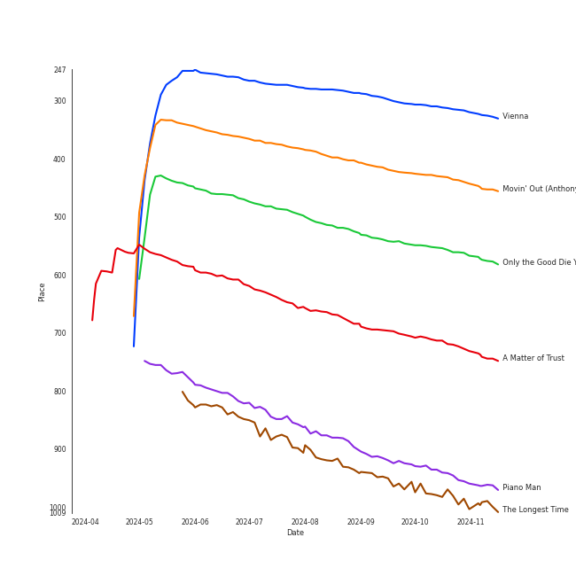
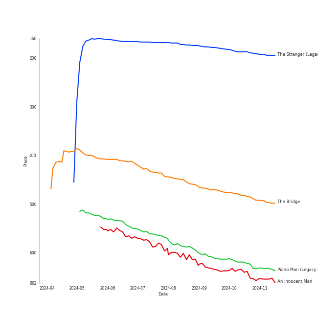

# Billy Joel

[See Track Features](audio_features.md)

[See Clusters](clusters/overview.md)

## Artist Rank
Billy Joel is currently:
- The #27 artist of the last 6 months
- The #29 artist of the last year
- The #57 artist of all time

## Top Tracks

### Top tracks of all time

## Top Albums

| Art | Rank | Tracks | 💚 | Album | Release Date | 🔗 |
|:---|---:|---:|---:|:---|:---|:---|
|  | 171 | 7 | 7 | The Stranger (Legacy Edition) | 1977 | [🔗](https://open.spotify.com/album/1Mhn9VosyjtWn4dMPFlna6) |
|  | 592 | 2 | 2 | Glass Houses | 1980-03-12 | [🔗](https://open.spotify.com/album/5sztejERqpktXEdemlUvU5) |
|  | 586 | 2 | 2 | An Innocent Man | 1983-08-08 | [🔗](https://open.spotify.com/album/3R3x4zIabsvpD3yxqLaUpc) |
|  | 592 | 2 | 2 | 52nd Street | 1978-10-13 | [🔗](https://open.spotify.com/album/1HmCO8VK98AU6EXPOjGYyI) |
|  | 592 | 2 | 1 | Storm Front | 1989-10-17 | [🔗](https://open.spotify.com/album/1Vw2uoVkLAJFVViJ1QyK1D) |
|  | 592 | 2 | 1 | River Of Dreams | 1993-08-10 | [🔗](https://open.spotify.com/album/4HPnwQJAEvTY910q4RNeOu) |
|  | 592 | 1 | 1 | Turnstiles | 1976-05-19 | [🔗](https://open.spotify.com/album/7GiLfxL1su3MSqz7pmKMZi) |
|  | 592 | 1 | 1 | Turn the Lights Back On | 2024-02-01 | [🔗](https://open.spotify.com/album/4csPGLYTb7kt85U377UCuC) |
|  | 429 | 1 | 1 | The Bridge | 1986-07-28 | [🔗](https://open.spotify.com/album/2fRxSC6FtiAkhEDVZr2seH) |
|  | 562 | 1 | 1 | Piano Man (Legacy Edition) | 1973-11-07 | [🔗](https://open.spotify.com/album/69wjSAZXZiD2EBia3b3gxL) |

See all albums

| Art | Rank | Tracks | 💚 | Album | Release Date | 🔗 |
|:---|---:|---:|---:|:---|:---|:---|
|  | 592 | 1 | 1 | Piano Man | 1973-11-09 | [🔗](https://open.spotify.com/album/77ErLrVvYETIlQJHAwhfIH) |
|  | 592 | 1 | 1 | Greatest Hits Vol. III | 1997-06-13 | [🔗](https://open.spotify.com/album/3cJ6ZymbUcNGe1T8YZtGyE) |
|  | 592 | 1 | 0 | The Nylon Curtain | 1982-06-23 | [🔗](https://open.spotify.com/album/50bajZpetfL5T0iRCOR74J) |
|  | 592 | 1 | 0 | Good Vibrations | 1993 | [🔗](https://open.spotify.com/album/10IUKCLZPs9onPwXfQVxfv) |
|  | 592 | 1 | 0 | Cold Spring Harbor | 1971-11-01 | [🔗](https://open.spotify.com/album/274rMlKrr22086ohmwAJZA) |

## Featured on Playlists
| Art | Tracks | Playlist |
|:---|---:|:---|
|  | 25 | [Singer-Songwriter](../../playlists/singer-songwriter/overview.md) |
|  | 8 | [A-Pop Favorites](../../playlists/a-pop_favorites/overview.md) |
|  | 4 | [Karaoke](../../playlists/karaoke/overview.md) |
|  | 3 | [Repeat Rewind](../../playlists/repeat_rewind/overview.md) |
|  | 3 | [Tarps](../../playlists/tarps/overview.md) |
|  | 1 | [Summer](../../playlists/summer/overview.md) |
|  | 1 | [A Cappella](../../playlists/a_cappella/overview.md) |

## Top Record Labels

| Tracks | 💚 | Label |
|---:|---:|:---|
| 25 | 21 | [Columbia](../../labels/columbia/overview.md) |
| 8 | 8 | [Legacy](../../labels/legacy/overview.md) |
| 1 | 0 | RCA Victor |

## Genres

- [album rock](../../genres/album_rock/overview.md)
- [classic rock](../../genres/classic_rock/overview.md)
- [mellow gold](../../genres/mellow_gold/overview.md)
- [piano rock](../../genres/piano_rock/overview.md)
- [rock](../../genres/rock/overview.md)
- [singer-songwriter](../../genres/singer-songwriter/overview.md)
- [soft rock](../../genres/soft_rock/overview.md)

## Credits

### Credits by Type

| Credit Type | Tracks |
|:---|---:|
| Arranger | 1 |
| Instrument | 23 |
| Lyricist | 26 |
| Producer | 2 |
| Songwriter | 26 |
| Vocal | 26 |

### Production Credits

| Art | Track | Credit Types |
|:---|:---|:---|
|  | Piano Man | Lyricist, Songwriter |
|  | Captain Jack | Lyricist, Songwriter |
|  | New York State of Mind | Arranger, Lyricist, Producer, Songwriter |
|  | Movin' Out (Anthony's Song) | Lyricist, Songwriter |
|  | Only the Good Die Young | Lyricist, Songwriter |
|  | Vienna | Lyricist, Songwriter |
|  | The Stranger | Lyricist, Songwriter |
|  | She's Always a Woman | Lyricist, Songwriter |
|  | Big Shot | Lyricist, Songwriter |
|  | My Life | Lyricist, Songwriter |

View all

| Art | Track | Credit Types |
|:---|:---|:---|
|  | It's Still Rock and Roll to Me | Lyricist, Songwriter |
|  | Don't Ask Me Why | Lyricist, Songwriter |
|  | The Longest Time | Lyricist, Songwriter |
|  | Uptown Girl | Lyricist, Songwriter |
|  | A Matter of Trust | Lyricist, Songwriter |
|  | And So It Goes | Lyricist, Producer, Songwriter |
|  | Lullabye (Goodnight, My Angel) | Lyricist, Songwriter |
| | nan | Lyricist, Songwriter |
| | nan | Lyricist, Songwriter |

## Top Producers

| Art | Producer | Tracks | Credit Types |
|:---|:---|---:|:---|
|  | [Billy Joel](overview.md) | 19 | Lyricist, Producer, Songwriter, Arranger |
| | [Phil Ramone](../../producers/phil_ramone/overview.md) | 13 | Producer |
| | [Jim Boyer](../../producers/jim_boyer/overview.md) | 13 | Producer |
| | Michael Omartian | 2 | Arranger |
| | Michael Stewart | 2 | Producer |
| | Ron Malo | 2 | Producer |
| | Justin Niebank | 1 | Producer |
| | Jim Horn | 1 | Arranger |
| | Liberty DeVitto | 1 | Arranger |
| | Kenny Ascher | 1 | Arranger |

View all

| Art | Producer | Tracks | Credit Types |
|:---|:---|---:|:---|
| | Fred Tenny | 1 | Producer |
| | Steve Lindsey | 1 | Arranger, Producer |
| | John Hendrickson | 1 | Producer |
| | Doug Stegmeyer | 1 | Arranger |
| | Leanne Ungar | 1 | Producer |
| | Tony Brown | 1 | Producer |
| | Leonard Cohen | 1 | Lyricist, Songwriter |
| | Ed Cherney | 1 | Producer |
| | Ira Newborn | 1 | Arranger |
| | Niko Bolas | 1 | Producer |
| | Danny Kortchmar | 1 | Producer |
| | Jim DeMain | 1 | Producer |
| | Mick Jones | 1 | Producer |
| | Jay Healy | 1 | Producer |
| | Bradshaw Leigh | 1 | Producer |
| | Bill Schnee | 1 | Producer |
| | John Bradley | 1 | Producer |
| | David Dickson | 1 | Producer |
| | Robert Charles | 1 | Producer |
| | Don Puluse | 1 | Producer |
| | Lou Waxman | 1 | Producer |
| | Steve Boyer | 1 | Producer |
| | Bruce Botnick | 1 | Producer |

## Tracks

| Art | Track | Album | Artists | Label | Rank | 💚 | 🔗 |
|:---|:---|:---|:---|:---|---:|:---|:---|
|  | Vienna | The Stranger (Legacy Edition) | [Billy Joel](overview.md) | [Columbia](../../labels/columbia), [Legacy](../../labels/legacy) | 276 | 💚 | [🔗](https://open.spotify.com/track/4U45aEWtQhrm8A5mxPaFZ7) |
|  | Movin' Out (Anthony's Song) | The Stranger (Legacy Edition) | [Billy Joel](overview.md) | [Columbia](../../labels/columbia), [Legacy](../../labels/legacy) | 375 | 💚 | [🔗](https://open.spotify.com/track/16GUMo6u3D2qo9a19AkYct) |
|  | Only the Good Die Young | The Stranger (Legacy Edition) | [Billy Joel](overview.md) | [Columbia](../../labels/columbia), [Legacy](../../labels/legacy) | 482 | 💚 | [🔗](https://open.spotify.com/track/1xOXXYh6lTW8laxlW7JP2J) |
|  | A Matter of Trust | The Bridge | [Billy Joel](overview.md) | [Columbia](../../labels/columbia) | 632 | 💚 | [🔗](https://open.spotify.com/track/6J212smZzpeOCYQ9DITMSC) |
|  | Piano Man | Piano Man (Legacy Edition) | [Billy Joel](overview.md) | [Columbia](../../labels/columbia), [Legacy](../../labels/legacy) | 837 | 💚 | [🔗](https://open.spotify.com/track/70C4NyhjD5OZUMzvWZ3njJ) |
|  | The Longest Time | An Innocent Man | [Billy Joel](overview.md) | [Columbia](../../labels/columbia) | 869 | 💚 | [🔗](https://open.spotify.com/track/5DH7nDryMhpixm4G4B7RP9) |
|  | She's Got a Way | Cold Spring Harbor | [Billy Joel](overview.md) | [Columbia](../../labels/columbia) | 882 | | [🔗](https://open.spotify.com/track/3Ie2eLOIj2IhKnzPwXrLbJ) |
|  | Captain Jack | Piano Man | [Billy Joel](overview.md) | [Columbia](../../labels/columbia) | 882 | 💚 | [🔗](https://open.spotify.com/track/3igkLltDaiFiMl83IdDBfm) |
|  | New York State of Mind | Turnstiles | [Billy Joel](overview.md) | [Columbia](../../labels/columbia) | 882 | 💚 | [🔗](https://open.spotify.com/track/6yjKlmm7vOszkXEUku1EM1) |
|  | Just the Way You Are | The Stranger (Legacy Edition) | [Billy Joel](overview.md) | [Columbia](../../labels/columbia), [Legacy](../../labels/legacy) | 882 | 💚 | [🔗](https://open.spotify.com/track/49MHCPzvMLXhRjDantBMVH) |

See all tracks

| Art | Track | Album | Artists | Label | Rank | 💚 | 🔗 |
|:---|:---|:---|:---|:---|---:|:---|:---|
|  | Scenes from an Italian Restaurant | The Stranger (Legacy Edition) | [Billy Joel](overview.md) | [Columbia](../../labels/columbia), [Legacy](../../labels/legacy) | 882 | 💚 | [🔗](https://open.spotify.com/track/3utq2FgD1pkmIoaWfjXWAU) |
|  | She's Always a Woman | The Stranger (Legacy Edition) | [Billy Joel](overview.md) | [Columbia](../../labels/columbia), [Legacy](../../labels/legacy) | 882 | 💚 | [🔗](https://open.spotify.com/track/5RgFlk1fcClZd0Y4SGYhqH) |
|  | The Stranger | The Stranger (Legacy Edition) | [Billy Joel](overview.md) | [Columbia](../../labels/columbia), [Legacy](../../labels/legacy) | 882 | 💚 | [🔗](https://open.spotify.com/track/54xbcKFYv2PC6ujERHppRj) |
|  | Big Shot | 52nd Street | [Billy Joel](overview.md) | [Columbia](../../labels/columbia) | 882 | 💚 | [🔗](https://open.spotify.com/track/22wxe2Yc9JzihICXYLGAQ7) |
|  | My Life | 52nd Street | [Billy Joel](overview.md) | [Columbia](../../labels/columbia) | 882 | 💚 | [🔗](https://open.spotify.com/track/4ZoBC5MhSEzuknIgAkBaoT) |
|  | Don't Ask Me Why | Glass Houses | [Billy Joel](overview.md) | [Columbia](../../labels/columbia) | 882 | 💚 | [🔗](https://open.spotify.com/track/6g4vHtdGqD5eEgpf7nKISk) |
|  | It's Still Rock and Roll to Me | Glass Houses | [Billy Joel](overview.md) | [Columbia](../../labels/columbia) | 882 | 💚 | [🔗](https://open.spotify.com/track/64UioB4Nmwgn2f4cbIpAkl) |
|  | Pressure | The Nylon Curtain | [Billy Joel](overview.md) | [Columbia](../../labels/columbia) | 882 | | [🔗](https://open.spotify.com/track/3LqvmDtXWXjF7fg8mh8iZh) |
|  | Uptown Girl | An Innocent Man | [Billy Joel](overview.md) | [Columbia](../../labels/columbia) | 882 | 💚 | [🔗](https://open.spotify.com/track/5zA8vzDGqPl2AzZkEYQGKh) |
|  | And So It Goes | Storm Front | [Billy Joel](overview.md) | [Columbia](../../labels/columbia) | 882 | 💚 | [🔗](https://open.spotify.com/track/1u7kQUb3lQcpHaYRfia13A) |
|  | We Didn't Start the Fire | Storm Front | [Billy Joel](overview.md) | [Columbia](../../labels/columbia) | 882 | | [🔗](https://open.spotify.com/track/3Cx4yrFaX8CeHwBMReOWXI) |
|  | And So It Goes | Good Vibrations | [Billy Joel](overview.md), The King's Singers | RCA Victor | 882 | | [🔗](https://open.spotify.com/track/1v8w3Ve0EYhy8cMlRR92QM) |
|  | Lullabye (Goodnight, My Angel) | River Of Dreams | [Billy Joel](overview.md) | [Columbia](../../labels/columbia) | 882 | 💚 | [🔗](https://open.spotify.com/track/4cURHmiuYii52BVbhrGbv0) |
|  | The River of Dreams | River Of Dreams | [Billy Joel](overview.md) | [Columbia](../../labels/columbia) | 882 | | [🔗](https://open.spotify.com/track/30qVCFYKBtAENjTIBA8FPZ) |
|  | Light As the Breeze | Greatest Hits Vol. III | [Billy Joel](overview.md) | [Columbia](../../labels/columbia) | 882 | 💚 | [🔗](https://open.spotify.com/track/1irDnW4t5Ph52hR2xuNtmF) |
|  | Turn the Lights Back On | Turn the Lights Back On | [Billy Joel](overview.md) | [Columbia](../../labels/columbia) | 882 | 💚 | [🔗](https://open.spotify.com/track/1KTemUlHzS0SvVtTjY1NTw) |

