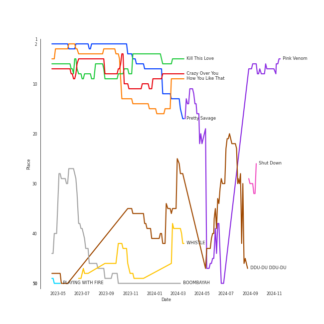

# BLACKPINK

[See Track Features](audio_features.md)

[See Clusters](clusters/overview.md)

## Artist Rank
BLACKPINK is currently:
- The #2 artist of all time
- The #9 artist of the last 6 months
- The #12 artist of the last month

## Top Tracks

- Pretty Savage is:
    - the #2 track of all time
- How You Like That is:
    - the #4 track of all time
- Crazy Over You is:
    - the #5 track of all time
- Kill This Love is:
    - the #8 track of all time
- BOOMBAYAH is:
    - the #43 track of all time
- WHISTLE is:
    - the #38 track of the last month
    - the #48 track of all time
- Pink Venom is:
    - the #8 track of the last month
    - the #2 track of the last 6 months
- Shut Down is:
    - the #46 track of the last 6 months

### Top tracks of all time over time

### Top tracks of the last 6 months over time

### Top tracks of the last month over time

## Featured on Playlists
| Art | Tracks | Playlist |
|:---|---:|:---|
|  | 30 | [K-Pop](../../playlists/k_pop/overview.md) |
|  | 10 | [K-Pop Favorites](../../playlists/k_pop_favorites/overview.md) |
|  | 6 | [Sharon RPD](../../playlists/sharon_rpd/overview.md) |
|  | 6 | [Workout](../../playlists/workout/overview.md) |
|  | 5 | [Summer](../../playlists/summer/overview.md) |
|  | 4 | [Chill](../../playlists/chill/overview.md) |
|  | 2 | [Pop](../../playlists/pop/overview.md) |
|  | 1 | [K-Pop 101](../../playlists/k_pop_101/overview.md) |
## Top Albums

| Art | Tracks | 💚 | Album | Release Date | 🔗 |
|:---|---:|---:|:---|:---|:---|
|  | 8 | 7 | BORN PINK | 2022-09-16 | [🔗](https://open.spotify.com/album/7jaSNQUBJbvfbZHLNFrV7P) |
|  | 7 | 7 | THE ALBUM | 2020-10-02 | [🔗](https://open.spotify.com/album/71O60S5gIJSIAhdnrDIh3N) |
|  | 4 | 3 | SQUARE UP | 2018-06-15 | [🔗](https://open.spotify.com/album/0wOiWrujRbxlKEGWRQpKYc) |
|  | 4 | 2 | KILL THIS LOVE | 2019-04-05 | [🔗](https://open.spotify.com/album/3PNxZ3BELbUXJ1XLktXiHz) |
|  | 2 | 2 | SQUARE ONE | 2016-08-08 | [🔗](https://open.spotify.com/album/0FOOodYRlj7gzh7q7IjmNZ) |
|  | 2 | 1 | SQUARE TWO | 2016-11-01 | [🔗](https://open.spotify.com/album/2Fna4Tb7fme5aHsNMJtVtp) |
|  | 1 | 1 | Dua Lipa (Complete Edition) | 2018-10-19 | [🔗](https://open.spotify.com/album/0obMz8EHnr3dg6NCUK4xWp) |
|  | 1 | 1 | Chromatica | 2020-05-29 | [🔗](https://open.spotify.com/album/05c49JgPmL4Uz2ZeqRx5SP) |
|  | 1 | 1 | As If It's Your Last | 2017-06-22 | [🔗](https://open.spotify.com/album/7ikmjsvRzDRzxHN0KXSQdv) |

## Top Record Labels

| Tracks | 💚 | Label |
|---:|---:|:---|
| 28 | 23 | [YG Entertainment](../../labels/yg_entertainment/overview.md) |
| 24 | 20 | [Interscope Records](../../labels/interscope_records/overview.md) |
| 1 | 1 | [Warner Records](../../labels/warner_records/overview.md) |

## Genres

- [k-pop](../../genres/k_pop)
- [k-pop girl group](../../genres/k_pop_girl_group)
- [pop](../../genres/pop)

## Tracks

| Art | Track | Album | Artists | Label | 💚 | 🔗 |
|:---|:---|:---|:---|:---|:---|:---|
|  | BOOMBAYAH | SQUARE ONE | [BLACKPINK](overview.md) | [YG Entertainment](../../labels/yg_entertainment) | 💚 | [🔗](https://open.spotify.com/track/13MF2TYuyfITClL1R2ei6e) |
|  | WHISTLE | SQUARE ONE | [BLACKPINK](overview.md) | [YG Entertainment](../../labels/yg_entertainment) | 💚 | [🔗](https://open.spotify.com/track/6NEoeBLQbOMw92qMeLfI40) |
|  | PLAYING WITH FIRE | SQUARE TWO | [BLACKPINK](overview.md) | [YG Entertainment](../../labels/yg_entertainment) | 💚 | [🔗](https://open.spotify.com/track/7qmvLmX9tyaTiBAVNI6YEn) |
|  | STAY | SQUARE TWO | [BLACKPINK](overview.md) | [YG Entertainment](../../labels/yg_entertainment) | | [🔗](https://open.spotify.com/track/3tP6QKbXvtrxiDI7QwKyUf) |
|  | As If It's Your Last | As If It's Your Last | [BLACKPINK](overview.md) | [YG Entertainment](../../labels/yg_entertainment) | 💚 | [🔗](https://open.spotify.com/track/4ZxOuNHhpyOj4gv52MtQpT) |
|  | DDU-DU DDU-DU | SQUARE UP | [BLACKPINK](overview.md) | [Interscope Records](../../labels/interscope_records), [YG Entertainment](../../labels/yg_entertainment) | 💚 | [🔗](https://open.spotify.com/track/4lQsB3ERTWSNaAN1IkuNRl) |
|  | Forever Young | SQUARE UP | [BLACKPINK](overview.md) | [Interscope Records](../../labels/interscope_records), [YG Entertainment](../../labels/yg_entertainment) | 💚 | [🔗](https://open.spotify.com/track/6veFyjNycn6EaNCKhkPXUY) |
|  | Really | SQUARE UP | [BLACKPINK](overview.md) | [Interscope Records](../../labels/interscope_records), [YG Entertainment](../../labels/yg_entertainment) | 💚 | [🔗](https://open.spotify.com/track/2URMA0ap6SAI8wFmcY1yta) |
|  | See U Later | SQUARE UP | [BLACKPINK](overview.md) | [Interscope Records](../../labels/interscope_records), [YG Entertainment](../../labels/yg_entertainment) | | [🔗](https://open.spotify.com/track/2REoTZjaB3jyAt5dgkV5GK) |
|  | Don't Know What To Do | KILL THIS LOVE | [BLACKPINK](overview.md) | [Interscope Records](../../labels/interscope_records), [YG Entertainment](../../labels/yg_entertainment) | 💚 | [🔗](https://open.spotify.com/track/38SKB7UfhL6Sd6Joxex5yK) |

See all tracks

| Art | Track | Album | Artists | Label | 💚 | 🔗 |
|:---|:---|:---|:---|:---|:---|:---|
|  | Hope Not | KILL THIS LOVE | [BLACKPINK](overview.md) | [Interscope Records](../../labels/interscope_records), [YG Entertainment](../../labels/yg_entertainment) | | [🔗](https://open.spotify.com/track/3eZD5DZGibwxMAOaCMBg3k) |
|  | Kick It | KILL THIS LOVE | [BLACKPINK](overview.md) | [Interscope Records](../../labels/interscope_records), [YG Entertainment](../../labels/yg_entertainment) | | [🔗](https://open.spotify.com/track/4rsoLz7ZY1Ldz8dpm4Lqtg) |
|  | Kill This Love | KILL THIS LOVE | [BLACKPINK](overview.md) | [Interscope Records](../../labels/interscope_records), [YG Entertainment](../../labels/yg_entertainment) | 💚 | [🔗](https://open.spotify.com/track/6hvczQ05jc1yGlp9zhb95V) |
|  | Crazy Over You | THE ALBUM | [BLACKPINK](overview.md) | [Interscope Records](../../labels/interscope_records), [YG Entertainment](../../labels/yg_entertainment) | 💚 | [🔗](https://open.spotify.com/track/7qq0EOPW4RRlqdvMBmdd73) |
|  | How You Like That | THE ALBUM | [BLACKPINK](overview.md) | [Interscope Records](../../labels/interscope_records), [YG Entertainment](../../labels/yg_entertainment) | 💚 | [🔗](https://open.spotify.com/track/4SFknyjLcyTLJFPKD2m96o) |
|  | Ice Cream (with Selena Gomez) | THE ALBUM | [BLACKPINK](overview.md), Selena Gomez | [Interscope Records](../../labels/interscope_records), [YG Entertainment](../../labels/yg_entertainment) | 💚 | [🔗](https://open.spotify.com/track/4JUPEh2DVSXFGExu4Uxevz) |
|  | Love To Hate Me | THE ALBUM | [BLACKPINK](overview.md) | [Interscope Records](../../labels/interscope_records), [YG Entertainment](../../labels/yg_entertainment) | 💚 | [🔗](https://open.spotify.com/track/7iKDsPfLT0d5mu2htfMKBZ) |
|  | Lovesick Girls | THE ALBUM | [BLACKPINK](overview.md) | [Interscope Records](../../labels/interscope_records), [YG Entertainment](../../labels/yg_entertainment) | 💚 | [🔗](https://open.spotify.com/track/4Ws314Ylb27BVsvlZOy30C) |
|  | Pretty Savage | THE ALBUM | [BLACKPINK](overview.md) | [Interscope Records](../../labels/interscope_records), [YG Entertainment](../../labels/yg_entertainment) | 💚 | [🔗](https://open.spotify.com/track/1XnpzbOGptRwfJhZgLbmSr) |
|  | You Never Know | THE ALBUM | [BLACKPINK](overview.md) | [Interscope Records](../../labels/interscope_records), [YG Entertainment](../../labels/yg_entertainment) | 💚 | [🔗](https://open.spotify.com/track/39kzWAiVPpycdMpr745oPj) |
|  | Hard to Love | BORN PINK | [BLACKPINK](overview.md) | [Interscope Records](../../labels/interscope_records), [YG Entertainment](../../labels/yg_entertainment) | 💚 | [🔗](https://open.spotify.com/track/3MJhPqL2IgGs7gHEB2M35q) |
|  | Pink Venom | BORN PINK | [BLACKPINK](overview.md) | [Interscope Records](../../labels/interscope_records), [YG Entertainment](../../labels/yg_entertainment) | 💚 | [🔗](https://open.spotify.com/track/6stcJnJHPO8RrYx5LLz5OP) |
|  | Ready For Love | BORN PINK | [BLACKPINK](overview.md) | [Interscope Records](../../labels/interscope_records), [YG Entertainment](../../labels/yg_entertainment) | | [🔗](https://open.spotify.com/track/7Dq4YNgsltQuTmhYz1wJzq) |
|  | Shut Down | BORN PINK | [BLACKPINK](overview.md) | [Interscope Records](../../labels/interscope_records), [YG Entertainment](../../labels/yg_entertainment) | 💚 | [🔗](https://open.spotify.com/track/0ARKW62l9uWIDYMZTUmJHF) |
|  | Tally | BORN PINK | [BLACKPINK](overview.md) | [Interscope Records](../../labels/interscope_records), [YG Entertainment](../../labels/yg_entertainment) | 💚 | [🔗](https://open.spotify.com/track/0bYVPJvXr8ACmw313cVvhB) |
|  | The Happiest Girl | BORN PINK | [BLACKPINK](overview.md) | [Interscope Records](../../labels/interscope_records), [YG Entertainment](../../labels/yg_entertainment) | 💚 | [🔗](https://open.spotify.com/track/1XoY4WZrvPIphBaikXGjF8) |
|  | Typa Girl | BORN PINK | [BLACKPINK](overview.md) | [Interscope Records](../../labels/interscope_records), [YG Entertainment](../../labels/yg_entertainment) | 💚 | [🔗](https://open.spotify.com/track/0L8LOav65XwLjCLS11gNPD) |
|  | Yeah Yeah Yeah | BORN PINK | [BLACKPINK](overview.md) | [Interscope Records](../../labels/interscope_records), [YG Entertainment](../../labels/yg_entertainment) | 💚 | [🔗](https://open.spotify.com/track/5TfKoQg9AjmDIWYKFoDqMN) |
|  | Kiss and Make Up | Dua Lipa (Complete Edition) | [Dua Lipa](../dua_lipa/overview.md), [BLACKPINK](overview.md) | [Warner Records](../../labels/warner_records) | 💚 | [🔗](https://open.spotify.com/track/7jr3iPu4O4bTCVwLMbdU2i) |
|  | Sour Candy (with BLACKPINK) | Chromatica | [Lady Gaga](../lady_gaga/overview.md), [BLACKPINK](overview.md) | [Interscope](../../labels/interscope_records) | 💚 | [🔗](https://open.spotify.com/track/1IWNylpZ477gIVUDpJL66u) |

