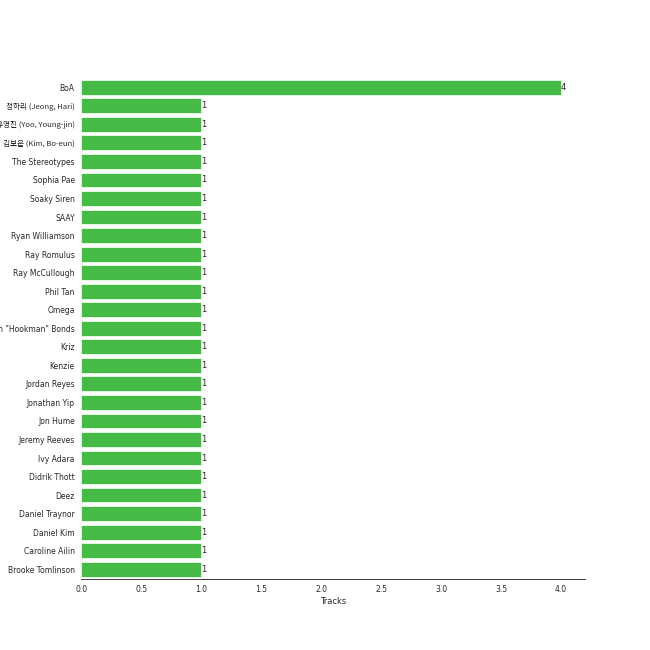

# BoA

[See Track Features](audio_features.md)

[See Clusters](clusters/overview.md)

## Relationships

BoA:
- is a member of [GOT the beat](../got_the_beat/overview.md)
- is a member of SMTOWN

## Artist Rank
BoA is currently:
- The #30 artist of all time
- The #14 artist of the last 6 months

## Top Tracks

- THE CHRISTMAS SONG is:
    - the #11 track of the last month

### Top tracks of the last 6 months over time

## Featured on Playlists
| Art | Tracks | Playlist |
|:---|---:|:---|
|  | 12 | [K-Pop](../../playlists/k-pop/overview.md) |
|  | 3 | [K-Pop Favorites](../../playlists/k-pop_favorites/overview.md) |
|  | 2 | [Christmas](../../playlists/christmas/overview.md) |
|  | 1 | [Classical Samples](../../playlists/classical_samples/overview.md) |

## Top Albums

| Art | Tracks | 💚 | Album | Release Date | 🔗 |
|:---|---:|---:|:---|:---|:---|
|  | 3 | 3 | Forgive Me - The 3rd Mini Album | 2022-11-22 | [🔗](https://open.spotify.com/album/0vufEpmNpfB9NUPLkbIBN7) |
|  | 1 | 1 | WOMAN - The 9th Album | 2018-10-24 | [🔗](https://open.spotify.com/album/68AStxkvhmfQv3A1qdW8CP) |
|  | 1 | 1 | ONE SHOT, TWO SHOT - The 1st Mini Album | 2018-02-20 | [🔗](https://open.spotify.com/album/04gRvDvXy6ctlFxI3G7Wd5) |
|  | 1 | 1 | Kiss My Lips - The 8th Album | 2015-05-12 | [🔗](https://open.spotify.com/album/0SmJjNGEXCMp5bTGbxmjyy) |
|  | 1 | 1 | Eat You Up | 2008-10-21 | [🔗](https://open.spotify.com/album/1lXXKmt06BzHY1GhfY836k) |
|  | 1 | 1 | 2022 Winter SMTOWN : SMCU PALACE | 2022-12-26 | [🔗](https://open.spotify.com/album/1HwnXJfZx8N8qDfzwUbxcw) |
|  | 1 | 0 | メリクリ | 2004-12-01 | [🔗](https://open.spotify.com/album/082g95CJ0YhcNAjxf2MMgT) |
|  | 1 | 0 | TRI-ANGLE - 1st Album | 2004-10-01 | [🔗](https://open.spotify.com/album/1013imXHa490acqEZkQpeX) |
|  | 1 | 0 | No.1 - The 2nd Album | 2002-01-04 | [🔗](https://open.spotify.com/album/4Se5tmG7Dc1WKJYr4o5gXz) |
|  | 1 | 0 | Merry-Chri | 2004-12-01 | [🔗](https://open.spotify.com/album/4oqQrLd2zP701hWtcGx0Vr) |

See all albums

| Art | Tracks | 💚 | Album | Release Date | 🔗 |
|:---|---:|---:|:---|:---|:---|
|  | 1 | 0 | Girls On Top | 2005-06-24 | [🔗](https://open.spotify.com/album/67YeE0goB48IGXMrlv50D6) |
|  | 1 | 0 | BETTER - The 10th Album | 2020-12-01 | [🔗](https://open.spotify.com/album/3YXfuI3E6OxcrtXnjAgNkM) |

## Top Record Labels

| Tracks | 💚 | Label |
|---:|---:|:---|
| 12 | 7 | [SM Entertainment](../../labels/sm_entertainment/overview.md) |
| 1 | 1 | Fontana South |
| 1 | 0 | [avex trax](../../labels/avex_trax/overview.md) |

## Genres

- [k-pop](../../genres/k-pop/overview.md)

## Credits

### Credits by Type

| Credit Type | Tracks |
|:---|---:|
| Arranger | 1 |
| Lyricist | 3 |
| Songwriter | 2 |

### Production Credits

| Art | Track | Credit Types |
|:---|:---|:---|
|  | Woman | Lyricist |
|  | Dreams Come True | Arranger, Lyricist, Songwriter |
|  | Forgive Me | Lyricist, Songwriter |

## Top Producers

| Art | Producer | Tracks | Credit Types |
|:---|:---|---:|:---|
|  | [BoA](overview.md) | 2 | Lyricist, Songwriter |
| | Didrik Thott | 1 | Songwriter |
| | Jordan Reyes | 1 | Songwriter |
| | SAAY | 1 | Songwriter |
| | Brooke Tomlinson | 1 | Songwriter |
| | Daniel Kim | 1 | Songwriter |
| | Ivy Adara | 1 | Songwriter |
| | 김보은 (Kim, Bo-eun) | 1 | Lyricist |
| | 유영진 (Yoo, Young-jin) | 1 | Arranger, Producer |
| | Omega | 1 | Songwriter |

View all

| Art | Producer | Tracks | Credit Types |
|:---|:---|---:|:---|
| | 정하리 (Jeong, Hari) | 1 | Lyricist |
| | Soaky Siren | 1 | Songwriter |
| | Kriz | 1 | Songwriter |
| | Deez | 1 | Songwriter |
| | Phil Tan | 1 | Producer |
| | Jon Hume | 1 | Arranger, Songwriter |
| | Marlin "Hookman" Bonds | 1 | Songwriter |
| | Ryan Williamson | 1 | Songwriter |

## Tracks

| Art | Track | Album | Artists | Label | 💚 | 🔗 |
|:---|:---|:---|:---|:---|:---|:---|
|  | No.1 | No.1 - The 2nd Album | [BoA](overview.md) | [SM Entertainment](../../labels/sm_entertainment) | | [🔗](https://open.spotify.com/track/4RtHEggWfFWknuAsRdkyku) |
|  | Merry-Chri | Merry-Chri | [BoA](overview.md) | [SM Entertainment](../../labels/sm_entertainment) | | [🔗](https://open.spotify.com/track/3yVUAgXBPozhKKeXphiTY3) |
|  | THE CHRISTMAS SONG | メリクリ | [BoA](overview.md) | [avex trax](../../labels/avex_trax) | | [🔗](https://open.spotify.com/track/5K7s4e0uakvrNmBxclGhDZ) |
|  | Girls On Top | Girls On Top | [BoA](overview.md) | [SM Entertainment](../../labels/sm_entertainment) | | [🔗](https://open.spotify.com/track/5AjjiajghftDZd5qO5YRCQ) |
|  | Eat You Up | Eat You Up | [BoA](overview.md) | Fontana South | 💚 | [🔗](https://open.spotify.com/track/3lrwnoggORNfLs0jiGqBhA) |
|  | Kiss My Lips | Kiss My Lips - The 8th Album | [BoA](overview.md) | [SM Entertainment](../../labels/sm_entertainment) | 💚 | [🔗](https://open.spotify.com/track/0T3uL8inslJIxiQyLlMenl) |
|  | ONE SHOT, TWO SHOT | ONE SHOT, TWO SHOT - The 1st Mini Album | [BoA](overview.md) | [SM Entertainment](../../labels/sm_entertainment) | 💚 | [🔗](https://open.spotify.com/track/1OWxlgwPtWuEvGkH8uS1Tj) |
|  | Woman | WOMAN - The 9th Album | [BoA](overview.md) | [SM Entertainment](../../labels/sm_entertainment) | 💚 | [🔗](https://open.spotify.com/track/14rpBBTV0qi60Ex4jonuNi) |
|  | Better | BETTER - The 10th Album | [BoA](overview.md) | [SM Entertainment](../../labels/sm_entertainment) | | [🔗](https://open.spotify.com/track/2k44rKotfi2k55hwwiCImN) |
|  | Breathe | Forgive Me - The 3rd Mini Album | [BoA](overview.md) | [SM Entertainment](../../labels/sm_entertainment) | 💚 | [🔗](https://open.spotify.com/track/2Y79S1WsgBZbCC3BJi1Z01) |

See all tracks

| Art | Track | Album | Artists | Label | 💚 | 🔗 |
|:---|:---|:---|:---|:---|:---|:---|
|  | Forgive Me | Forgive Me - The 3rd Mini Album | [BoA](overview.md) | [SM Entertainment](../../labels/sm_entertainment) | 💚 | [🔗](https://open.spotify.com/track/4TXo3KpvdwHSdrPJlWDfgn) |
|  | ZIP | Forgive Me - The 3rd Mini Album | [BoA](overview.md) | [SM Entertainment](../../labels/sm_entertainment) | 💚 | [🔗](https://open.spotify.com/track/0IaT9XnG72sPXvUAsYdEzC) |
|  | Time After Time | 2022 Winter SMTOWN : SMCU PALACE | [BoA](overview.md), [WENDY](../wendy/overview.md), NINGNING | [SM Entertainment](../../labels/sm_entertainment) | 💚 | [🔗](https://open.spotify.com/track/6LGcOydwjfaquaRgJwlPkK) |
|  | TRI-ANGLE - Extended Version | TRI-ANGLE - 1st Album | [TVXQ!](../tvxq!/overview.md), [BoA](overview.md), TRAX | [SM Entertainment](../../labels/sm_entertainment) | | [🔗](https://open.spotify.com/track/4Wkw62rPTP1v37vdwUJ1Yg) |

