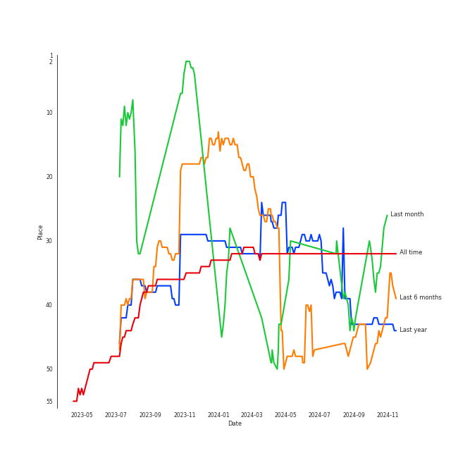
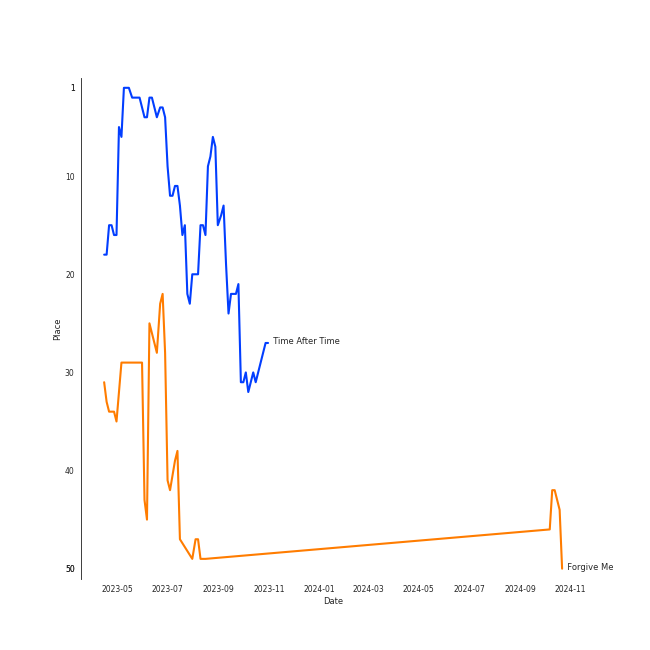

# BoA

## Artist Rank
BoA is currently:
- The #40 artist of all time
- The #39 artist of the last 6 months
- The #11 artist of the last month

## Top Tracks

- Time After Time is:
    - the #22 track of the last 6 months
- Sketch is:
    - the #32 track of the last month

### Top tracks of the last 6 months over time

### Top tracks of the last month over time

## Featured on Playlists
| Art | Tracks | Playlist |
|:---|---:|:---|
|  | 6 | [K-Pop](../../playlists/k_pop/overview.md) |
|  | 2 | [K-Pop Favorites](../../playlists/k_pop_favorites/overview.md) |
|  | 2 | [Christmas](../../playlists/christmas/overview.md) |
|  | 1 | [Check Out Later](../../playlists/check_out_later/overview.md) |
## Top Albums

| Art | Tracks | 💚 | Album | Release Date | 🔗 |
|:---|---:|---:|:---|:---|:---|
|  | 4 | 3 | Forgive Me - The 3rd Mini Album | 2022-11-22 | [🔗](https://open.spotify.com/album/0vufEpmNpfB9NUPLkbIBN7) |
|  | 1 | 1 | ONE SHOT, TWO SHOT - The 1st Mini Album | 2018-02-20 | [🔗](https://open.spotify.com/album/04gRvDvXy6ctlFxI3G7Wd5) |
|  | 1 | 1 | 2022 Winter SMTOWN : SMCU PALACE | 2022-12-26 | [🔗](https://open.spotify.com/album/1HwnXJfZx8N8qDfzwUbxcw) |
|  | 1 | 0 | メリクリ | 2004-12-01 | [🔗](https://open.spotify.com/album/082g95CJ0YhcNAjxf2MMgT) |
|  | 1 | 0 | No.1 - The 2nd Album | 2002-01-04 | [🔗](https://open.spotify.com/album/4Se5tmG7Dc1WKJYr4o5gXz) |
|  | 1 | 0 | Merry-Chri | 2004-12-01 | [🔗](https://open.spotify.com/album/4oqQrLd2zP701hWtcGx0Vr) |
|  | 1 | 0 | BETTER - The 10th Album | 2020-12-01 | [🔗](https://open.spotify.com/album/3YXfuI3E6OxcrtXnjAgNkM) |

## Top Record Labels

| Tracks | 💚 | Label |
|---:|---:|:---|
| 9 | 5 | [SM Entertainment](../../labels/sm_entertainment/overview.md) |
| 1 | 0 | avex trax |

## Genres

- [k-pop](../../genres/k_pop)

## Tracks

| Art | Track | Album | Artists | Label | 💚 | 🔗 |
|:---|:---|:---|:---|:---|:---|:---|
|  | No.1 | No.1 - The 2nd Album | [BoA](overview.md) | [SM Entertainment](../../labels/sm_entertainment) | | [🔗](https://open.spotify.com/track/4RtHEggWfFWknuAsRdkyku) |
|  | Merry-Chri | Merry-Chri | [BoA](overview.md) | [SM Entertainment](../../labels/sm_entertainment) | | [🔗](https://open.spotify.com/track/3yVUAgXBPozhKKeXphiTY3) |
|  | THE CHRISTMAS SONG | メリクリ | [BoA](overview.md) | avex trax | | [🔗](https://open.spotify.com/track/5K7s4e0uakvrNmBxclGhDZ) |
|  | ONE SHOT, TWO SHOT | ONE SHOT, TWO SHOT - The 1st Mini Album | [BoA](overview.md) | [SM Entertainment](../../labels/sm_entertainment) | 💚 | [🔗](https://open.spotify.com/track/1OWxlgwPtWuEvGkH8uS1Tj) |
|  | Better | BETTER - The 10th Album | [BoA](overview.md) | [SM Entertainment](../../labels/sm_entertainment) | | [🔗](https://open.spotify.com/track/2k44rKotfi2k55hwwiCImN) |
|  | Breathe | Forgive Me - The 3rd Mini Album | [BoA](overview.md) | [SM Entertainment](../../labels/sm_entertainment) | 💚 | [🔗](https://open.spotify.com/track/2Y79S1WsgBZbCC3BJi1Z01) |
|  | Forgive Me | Forgive Me - The 3rd Mini Album | [BoA](overview.md) | [SM Entertainment](../../labels/sm_entertainment) | 💚 | [🔗](https://open.spotify.com/track/4TXo3KpvdwHSdrPJlWDfgn) |
|  | Sketch | Forgive Me - The 3rd Mini Album | [BoA](overview.md) | [SM Entertainment](../../labels/sm_entertainment) | | [🔗](https://open.spotify.com/track/2DTHncAFgwkjthX1TOvvzX) |
|  | ZIP | Forgive Me - The 3rd Mini Album | [BoA](overview.md) | [SM Entertainment](../../labels/sm_entertainment) | 💚 | [🔗](https://open.spotify.com/track/0IaT9XnG72sPXvUAsYdEzC) |
|  | Time After Time | 2022 Winter SMTOWN : SMCU PALACE | [BoA](overview.md), [WENDY](../wendy/overview.md), NINGNING | [SM Entertainment](../../labels/sm_entertainment) | 💚 | [🔗](https://open.spotify.com/track/6LGcOydwjfaquaRgJwlPkK) |