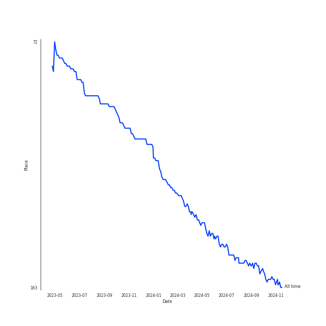

# Britney Spears

## Artist Rank
- The #161 artist of all time

## Top Albums

| Art | Rank | Tracks | 💚 | Album | Release Date | 🔗 |
|:---|---:|---:|---:|:---|:---|:---|
|  | 650 | 2 | 1 | In The Zone | 2003-11-13 | [🔗](https://open.spotify.com/album/0z7pVBGOD7HCIB7S8eLkLI) |
|  | 650 | 2 | 0 | Circus (Deluxe Version) | 2008-12-02 | [🔗](https://open.spotify.com/album/2tve5DGwub1TtbX1khPX5j) |
|  | 650 | 1 | 1 | Oops!... I Did It Again | 2000-05-16 | [🔗](https://open.spotify.com/album/5PmgtkodFl2Om3hMXONDll) |
|  | 650 | 1 | 1 | Britney Jean (Deluxe Version) | 2013-11-30 | [🔗](https://open.spotify.com/album/5rlB2HPoNHg2m1wmmh0TRv) |
|  | 650 | 1 | 1 | Britney (Digital Deluxe Version) | 2001-10-31 | [🔗](https://open.spotify.com/album/5ax3GTsfX5uCUaNgnJsSG5) |
|  | 650 | 1 | 1 | ...Baby One More Time (Digital Deluxe Version) | 1999-01-12 | [🔗](https://open.spotify.com/album/3WNxdumkSMGMJRhEgK80qx) |

## Featured on Playlists
| Art | Tracks | Playlist |
|:---|---:|:---|
|  | 8 | [Pop](../../playlists/pop/overview.md) |
|  | 2 | [A-Pop Favorites](../../playlists/a-pop_favorites/overview.md) |

## Top Record Labels

| Tracks | 💚 | Label |
|---:|---:|:---|
| 7 | 4 | [Jive](../../labels/jive/overview.md) |
| 1 | 1 | [RCA Records Label](../../labels/rca_records_label/overview.md) |

## Genres

- [dance pop](../../genres/dance_pop/overview.md)
- [pop](../../genres/pop/overview.md)

## Credits

### Credits by Type

| Credit Type | Tracks |
|:---|---:|
| Songwriter | 1 |
| Vocal | 5 |

### Production Credits

| Art | Track | Credit Types |
|:---|:---|:---|
|  | Work Bitch | Songwriter |

## Top Producers

| Art | Producer | Tracks | Credit Types |
|:---|:---|---:|:---|
| | [Max Martin](../../producers/max_martin/overview.md) | 2 | Producer, Songwriter, Lyricist |
| | Rami | 2 | Producer, Songwriter |
|  | Pharrell Williams | 1 | Songwriter |
| | Andrew Coleman | 1 | Producer |
| | Otto Jettman | 1 | Songwriter |
| | Otto Knows | 1 | Producer |
| | Sebastian Ingrosso | 1 | Producer, Songwriter |
| | Anthony Preston | 1 | Producer, Songwriter |
| | Steve Lunt | 1 | Arranger |
| | will.i.am | 1 | Producer, Songwriter |

View all

| Art | Producer | Tracks | Credit Types |
|:---|:---|---:|:---|
| | [Serban Ghenea](../../producers/serban_ghenea/overview.md) | 1 | Producer |
| | Janson+Janson | 1 | Arranger |
| | Jacob Dennis | 1 | Producer |
| | RuthAnne | 1 | Songwriter |
| | Cathy Dennis | 1 | Songwriter |
| | Pontus Winnberg | 1 | Songwriter |
| | Chris Kahn | 1 | Producer |
| | Julian Prindle | 1 | Producer |
| | Padraic Kerin | 1 | Producer |
| | Chad Hugo | 1 | Songwriter |
| | Bloodshy and Avant | 1 | Arranger, Producer |
| | Niklas Flyckt | 1 | Producer |
| | Brian Garten | 1 | Producer |
|  | [Britney Spears](overview.md) | 1 | Songwriter |
| | John Amatiello | 1 | Producer |
| | The Neptunes | 1 | Producer |
| | Christian Karlsson | 1 | Songwriter |
| | Henrik Jonback | 1 | Songwriter |
| | Joe Peluso | 1 | Producer |

## Tracks

| Art | Track | Album | Artists | Label | Rank | 💚 | 🔗 |
|:---|:---|:---|:---|:---|---:|:---|:---|
|  | ...Baby One More Time | ...Baby One More Time (Digital Deluxe Version) | [Britney Spears](overview.md) | [Jive](../../labels/jive) | 984 | 💚 | [🔗](https://open.spotify.com/track/3MjUtNVVq3C8Fn0MP3zhXa) |
|  | Oops!...I Did It Again | Oops!... I Did It Again | [Britney Spears](overview.md) | [Jive](../../labels/jive) | 984 | 💚 | [🔗](https://open.spotify.com/track/6naxalmIoLFWR0siv8dnQQ) |
|  | I'm a Slave 4 U | Britney (Digital Deluxe Version) | [Britney Spears](overview.md) | [Jive](../../labels/jive) | 984 | 💚 | [🔗](https://open.spotify.com/track/6ldwfK0yWgTAlmIfuQkTYN) |
|  | (I Got That) Boom Boom (feat. Ying Yang Twins) | In The Zone | [Britney Spears](overview.md), Ying Yang Twins | [Jive](../../labels/jive) | 984 | | [🔗](https://open.spotify.com/track/5epx5YtoMbV0GrL9qx9kVY) |
|  | Toxic | In The Zone | [Britney Spears](overview.md) | [Jive](../../labels/jive) | 984 | 💚 | [🔗](https://open.spotify.com/track/6I9VzXrHxO9rA9A5euc8Ak) |
|  | If U Seek Amy | Circus (Deluxe Version) | [Britney Spears](overview.md) | [Jive](../../labels/jive) | 984 | | [🔗](https://open.spotify.com/track/2hdy9Wt9qp7M7d0U3ossu2) |
|  | Womanizer | Circus (Deluxe Version) | [Britney Spears](overview.md) | [Jive](../../labels/jive) | 984 | | [🔗](https://open.spotify.com/track/4fixebDZAVToLbUCuEloa2) |
|  | Work Bitch | Britney Jean (Deluxe Version) | [Britney Spears](overview.md) | [RCA Records Label](../../labels/rca_records_label) | 984 | 💚 | [🔗](https://open.spotify.com/track/3KliPMvk1EvFZu9cvkj8p1) |
