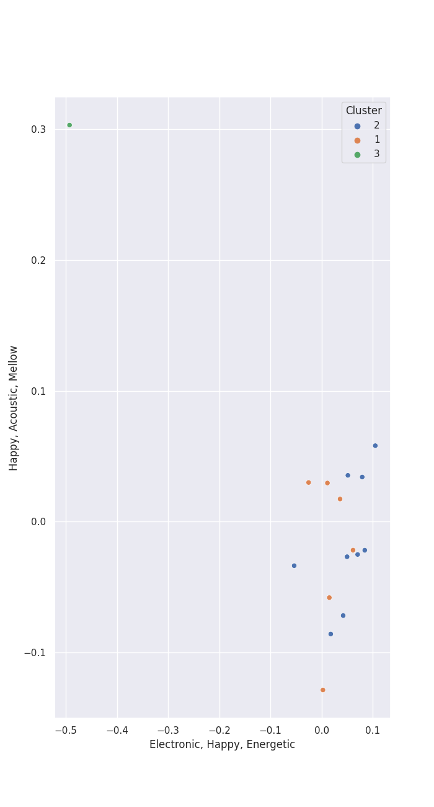

# Clusters in Bruno Mars

## Cluster #1

6 tracks

| Art | Track | Album | Artists | Label | 💚 | 🔗 |
|:---|:---|:---|:---|:---|:---|:---|
|  | Grenade | Doo-Wops & Hooligans | [Bruno Mars](../../overview.md) | [Atlantic Records](../../../../labels/atlantic_records) | 💚 | [🔗](https://open.spotify.com/track/2tJulUYLDKOg9XrtVkMgcJ) |
|  | The Other Side (feat. CeeLo Green and B.o.B) | Doo-Wops & Hooligans | [Bruno Mars](../../overview.md), CeeLo Green, B.o.B | [Atlantic Records](../../../../labels/atlantic_records) | 💚 | [🔗](https://open.spotify.com/track/0HasfWMrNxTjycDy9TkRtA) |
|  | 24K Magic | 24K Magic | [Bruno Mars](../../overview.md) | [Atlantic Records](../../../../labels/atlantic_records) | | [🔗](https://open.spotify.com/track/6b8Be6ljOzmkOmFslEb23P) |
|  | After Last Night (with Thundercat & Bootsy Collins) | An Evening With Silk Sonic | [Bruno Mars](../../overview.md), Anderson .Paak, Thundercat, Bootsy Collins, Silk Sonic | [Aftermath Entertainment/Atlantic](../../../../labels/atlantic_records) | 💚 | [🔗](https://open.spotify.com/track/6jGAh1bFnXt1Muj9zeHveZ) |
|  | Fly As Me | An Evening With Silk Sonic | [Bruno Mars](../../overview.md), Anderson .Paak, Silk Sonic | [Aftermath Entertainment/Atlantic](../../../../labels/atlantic_records) | 💚 | [🔗](https://open.spotify.com/track/7suB6D6uKX5DfPukdGaz0W) |
|  | Please Me | Please Me | [Bruno Mars](../../overview.md), Cardi B | [Atlantic/KSR](../../../../labels/atlantic_records) | 💚 | [🔗](https://open.spotify.com/track/0PG9fbaaHFHfre2gUVo7AN) |
## Cluster #2

10 tracks

| Art | Track | Album | Artists | Label | 💚 | 🔗 |
|:---|:---|:---|:---|:---|:---|:---|
|  | Locked out of Heaven | Unorthodox Jukebox | [Bruno Mars](../../overview.md) | [Atlantic Records](../../../../labels/atlantic_records) | 💚 | [🔗](https://open.spotify.com/track/3w3y8KPTfNeOKPiqUTakBh) |
|  | Finesse | 24K Magic | [Bruno Mars](../../overview.md) | [Atlantic Records](../../../../labels/atlantic_records) | 💚 | [🔗](https://open.spotify.com/track/5XMkENs3GfeRza8MfVAhjK) |
|  | That's What I Like | 24K Magic | [Bruno Mars](../../overview.md) | [Atlantic Records](../../../../labels/atlantic_records) | 💚 | [🔗](https://open.spotify.com/track/0KKkJNfGyhkQ5aFogxQAPU) |
|  | Finesse - Remix; feat. Cardi B | Finesse (Remix) [feat. Cardi B] | [Bruno Mars](../../overview.md), Cardi B | [Atlantic Records](../../../../labels/atlantic_records) | 💚 | [🔗](https://open.spotify.com/track/3Vo4wInECJQuz9BIBMOu8i) |
|  | Leave The Door Open | An Evening With Silk Sonic | [Bruno Mars](../../overview.md), Anderson .Paak, Silk Sonic | [Aftermath Entertainment/Atlantic](../../../../labels/atlantic_records) | | [🔗](https://open.spotify.com/track/02VBYrHfVwfEWXk5DXyf0T) |
|  | 777 | An Evening With Silk Sonic | [Bruno Mars](../../overview.md), Anderson .Paak, Silk Sonic | [Aftermath Entertainment/Atlantic](../../../../labels/atlantic_records) | | [🔗](https://open.spotify.com/track/2K6vUau7bnZUamjbRSOOvJ) |
|  | Leave The Door Open | An Evening With Silk Sonic | [Bruno Mars](../../overview.md), Anderson .Paak, Silk Sonic | [Aftermath Entertainment/Atlantic](../../../../labels/atlantic_records) | 💚 | [🔗](https://open.spotify.com/track/4pryE6cN2gFL1FVF5fYINl) |
|  | Smokin Out The Window | An Evening With Silk Sonic | [Bruno Mars](../../overview.md), Anderson .Paak, Silk Sonic | [Aftermath Entertainment/Atlantic](../../../../labels/atlantic_records) | 💚 | [🔗](https://open.spotify.com/track/1oERlssLrpssCAY6Yqqs6c) |
|  | Love's Train | Love's Train | [Bruno Mars](../../overview.md), Anderson .Paak, Silk Sonic | [Aftermath Entertainment/Atlantic](../../../../labels/atlantic_records) | | [🔗](https://open.spotify.com/track/60gTdTwaNtGAzIxKfeGVfJ) |
|  | Uptown Funk (feat. Bruno Mars) | Uptown Special | [Bruno Mars](../../overview.md), Mark Ronson | [Columbia](../../../../labels/columbia) | 💚 | [🔗](https://open.spotify.com/track/32OlwWuMpZ6b0aN2RZOeMS) |
## Cluster #3

1 tracks

| Art | Track | Album | Artists | Label | 💚 | 🔗 |
|:---|:---|:---|:---|:---|:---|:---|
|  | When I Was Your Man | Unorthodox Jukebox | [Bruno Mars](../../overview.md) | [Atlantic Records](../../../../labels/atlantic_records) | 💚 | [🔗](https://open.spotify.com/track/0nJW01T7XtvILxQgC5J7Wh) |