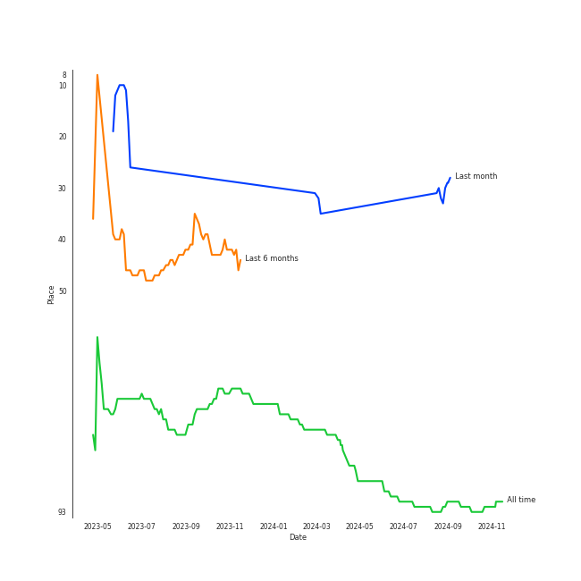
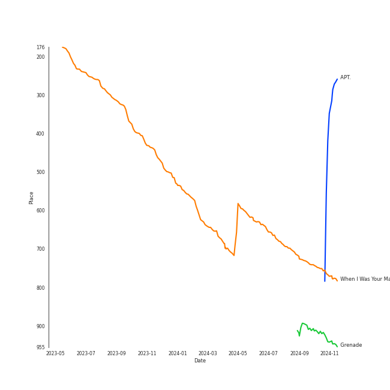
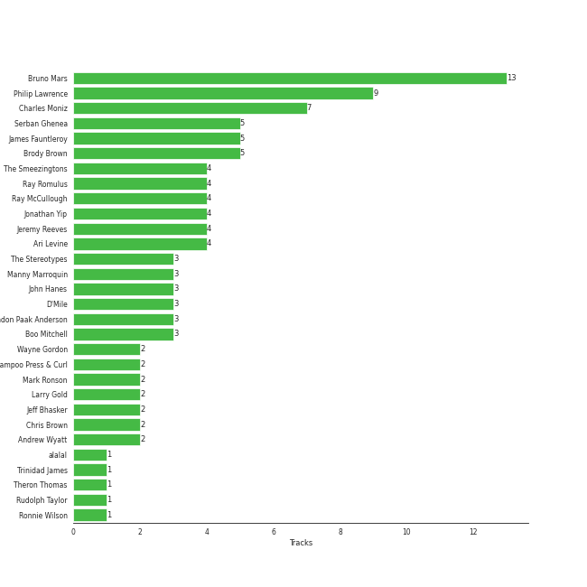

# Bruno Mars

[See Track Features](audio_features.md)

[See Clusters](clusters/overview.md)

## Relationships

Bruno Mars:
- is a member of Shampoo Press & Curl
- is a member of Silk Sonic
- is a member of The Smeezingtons

## Artist Rank
- The #87 artist overall

## Top Tracks

### Top tracks, aggregated

## Featured on Playlists
| Art | Tracks | Playlist |
|:---|---:|:---|
|  | 16 | [Pop](../../playlists/pop/overview.md) |
|  | 14 | [R&B](../../playlists/r_b/overview.md) |
|  | 4 | [A-Pop Favorites](../../playlists/a-pop_favorites/overview.md) |
|  | 3 | [Workout](../../playlists/workout/overview.md) |
|  | 2 | [Summer](../../playlists/summer/overview.md) |
|  | 2 | [Karaoke](../../playlists/karaoke/overview.md) |
|  | 1 | [Funk](../../playlists/funk/overview.md) |
|  | 1 | [Alt-Pop](../../playlists/alt-pop/overview.md) |
|  | 1 | [Chill](../../playlists/chill/overview.md) |

## Top Albums

| Art | Tracks | 💚 | Album | Release Date | 🔗 |
|:---|---:|---:|:---|:---|:---|
|  | 5 | 3 | An Evening With Silk Sonic | 2021-11-11 | [🔗](https://open.spotify.com/album/1YgekJJTEueWDaMr7BYqPk) |
|  | 3 | 2 | 24K Magic | 2016-11-17 | [🔗](https://open.spotify.com/album/4PgleR09JVnm3zY1fW3XBA) |
|  | 2 | 2 | Unorthodox Jukebox | 2012-12-07 | [🔗](https://open.spotify.com/album/58ufpQsJ1DS5kq4hhzQDiI) |
|  | 2 | 2 | Doo-Wops & Hooligans | 2010-10-05 | [🔗](https://open.spotify.com/album/1uyf3l2d4XYwiEqAb7t7fX) |
|  | 1 | 1 | Uptown Special | 2015-01-12 | [🔗](https://open.spotify.com/album/3vLaOYCNCzngDf8QdBg2V1) |
|  | 1 | 1 | Please Me | 2019-02-15 | [🔗](https://open.spotify.com/album/5a4sJJ3qjn6hqRsvm0Veso) |
|  | 1 | 1 | Finesse (Remix) [feat. Cardi B] | 2017-12-20 | [🔗](https://open.spotify.com/album/3mumK2ar9b4JPhVOZR0V2p) |
|  | 1 | 0 | Love's Train | 2022-02-14 | [🔗](https://open.spotify.com/album/6QKXGIgwWmWBMmIktMOchR) |

## Top Record Labels

| Tracks | 💚 | Label |
|---:|---:|:---|
| 15 | 11 | [Atlantic Records](../../labels/atlantic_records/overview.md) |
| 6 | 3 | Aftermath Entertainment |
| 1 | 1 | KSR |
| 1 | 1 | [Columbia](../../labels/columbia/overview.md) |

## Genres

- [dance pop](../../genres/dance_pop/overview.md)
- [pop](../../genres/pop/overview.md)

## Credits

### Credits by Type

| Credit Type | Tracks |
|:---|---:|
| Instrument | 8 |
| Producer | 5 |
| Songwriter | 13 |
| Vocal | 8 |

### Production Credits

| Art | Track | Credit Types |
|:---|:---|:---|
|  | The Other Side (feat. CeeLo Green and B.o.B) | Songwriter |
|  | Grenade | Songwriter |
|  | Fuck You | Songwriter |
|  | When I Was Your Man | Songwriter |
|  | Locked out of Heaven | Songwriter |
|  | Uptown Funk (feat. Bruno Mars) | Producer, Songwriter |
|  | That's What I Like | Songwriter |
|  | Finesse | Songwriter |
|  | Finesse - Remix; feat. Cardi B | Songwriter |
|  | Please Me | Producer, Songwriter |

View all

| Art | Track | Credit Types |
|:---|:---|:---|
|  | Leave The Door Open | Producer, Songwriter |
|  | Fly As Me | Producer, Songwriter |
|  | Smokin Out The Window | Producer, Songwriter |

## Top Producers

| Art | Producer | Tracks | Credit Types |
|:---|:---|---:|:---|
|  | [Bruno Mars](overview.md) | 12 | Songwriter, Producer |
| | Philip Lawrence | 8 | Songwriter |
| | Charles Moniz | 7 | Producer |
| | [Serban Ghenea](../../producers/serban_ghenea/overview.md) | 5 | Producer |
| | James Fauntleroy | 5 | Songwriter |
| | Ray McCullough | 4 | Songwriter |
| | Brody Brown | 4 | Songwriter |
| | The Smeezingtons | 4 | Producer |
| | Ari Levine | 4 | Producer, Songwriter |
| | Jonathan Yip | 4 | Songwriter |

View all

| Art | Producer | Tracks | Credit Types |
|:---|:---|---:|:---|
| | Jeremy Reeves | 4 | Songwriter |
| | Ray Romulus | 4 | Songwriter |
| | [Manny Marroquin](../../producers/manny_marroquin/overview.md) | 3 | Producer |
| | [John Hanes](../../producers/john_hanes/overview.md) | 3 | Producer |
| | Brandon Paak Anderson | 3 | Songwriter |
| | D'Mile | 3 | Producer, Songwriter |
| | The Stereotypes | 3 | Producer |
| | Boo Mitchell | 3 | Producer |
|  | Mark Ronson | 2 | Producer, Songwriter |
| | Jeff Bhasker | 2 | Producer, Songwriter |
| | Wayne Gordon | 2 | Producer |
| | Andrew Wyatt | 2 | Songwriter |
|  | Chris Brown | 2 | Songwriter |
| | Shampoo Press & Curl | 2 | Producer |
| | Larry Gold | 2 | Arranger |
| | Devin Nakao | 1 | Producer |
| | Jens Jungkurth | 1 | Producer |
| | Matthew Stevens | 1 | Producer |
|  | B.o.B | 1 | Songwriter |
| | Mike Caren | 1 | Songwriter |
| | Joshua Lopez | 1 | Songwriter |
| | Emile Haynie | 1 | Producer |
| | Lonnie Simmons | 1 | Songwriter |
| | Charlie Wilson | 1 | Songwriter |
| | Riccardo Damian | 1 | Producer |
| | Big Sean | 1 | Songwriter |
| | Inaam Haq | 1 | Producer |
| | Devon Gallaspy | 1 | Songwriter |
| | Ken Lewis | 1 | Producer |
| | Jeremy Ruzumna | 1 | Songwriter |
|  | Cardi B | 1 | Songwriter |
| | Kaveh Rastegar | 1 | Songwriter |
| | Claude Kelly | 1 | Songwriter |
| | Jeff Chestek | 1 | Producer |
| | Trinidad James | 1 | Songwriter |
| | Patrick Stump | 1 | Songwriter |
| | Rudolph Taylor | 1 | Songwriter |
| | John Wicks | 1 | Songwriter |
| | alalal | 1 | Producer |
| | Josh Blair | 1 | Producer |
| | Cody Cichowski | 1 | Producer |
| | Robert Wilson | 1 | Songwriter |
| | Ronnie Wilson | 1 | Songwriter |

## Tracks

| Art | Track | Album | Artists | Label | Rank | 💚 | 🔗 |
|:---|:---|:---|:---|:---|---:|:---|:---|
|  | When I Was Your Man | Unorthodox Jukebox | [Bruno Mars](overview.md) | [Atlantic Records](../../labels/atlantic_records) | 633 | 💚 | [🔗](https://open.spotify.com/track/0nJW01T7XtvILxQgC5J7Wh) |
|  | Grenade | Doo-Wops & Hooligans | [Bruno Mars](overview.md) | [Atlantic Records](../../labels/atlantic_records) | 841 | 💚 | [🔗](https://open.spotify.com/track/2tJulUYLDKOg9XrtVkMgcJ) |
|  | The Other Side (feat. CeeLo Green and B.o.B) | Doo-Wops & Hooligans | [Bruno Mars](overview.md), B.o.B, CeeLo Green | [Atlantic Records](../../labels/atlantic_records) | 841 | 💚 | [🔗](https://open.spotify.com/track/0HasfWMrNxTjycDy9TkRtA) |
|  | Locked out of Heaven | Unorthodox Jukebox | [Bruno Mars](overview.md) | [Atlantic Records](../../labels/atlantic_records) | 841 | 💚 | [🔗](https://open.spotify.com/track/3w3y8KPTfNeOKPiqUTakBh) |
|  | Uptown Funk (feat. Bruno Mars) | Uptown Special | Mark Ronson, [Bruno Mars](overview.md) | [Columbia](../../labels/columbia) | 841 | 💚 | [🔗](https://open.spotify.com/track/32OlwWuMpZ6b0aN2RZOeMS) |
|  | 24K Magic | 24K Magic | [Bruno Mars](overview.md) | [Atlantic Records](../../labels/atlantic_records) | 841 | | [🔗](https://open.spotify.com/track/6b8Be6ljOzmkOmFslEb23P) |
|  | Finesse | 24K Magic | [Bruno Mars](overview.md) | [Atlantic Records](../../labels/atlantic_records) | 841 | 💚 | [🔗](https://open.spotify.com/track/5XMkENs3GfeRza8MfVAhjK) |
|  | That's What I Like | 24K Magic | [Bruno Mars](overview.md) | [Atlantic Records](../../labels/atlantic_records) | 841 | 💚 | [🔗](https://open.spotify.com/track/0KKkJNfGyhkQ5aFogxQAPU) |
|  | Finesse - Remix; feat. Cardi B | Finesse (Remix) [feat. Cardi B] | [Bruno Mars](overview.md), Cardi B | [Atlantic Records](../../labels/atlantic_records) | 841 | 💚 | [🔗](https://open.spotify.com/track/3Vo4wInECJQuz9BIBMOu8i) |
|  | Please Me | Please Me | Cardi B, [Bruno Mars](overview.md) | [Atlantic/KSR](../../labels/atlantic_records) | 841 | 💚 | [🔗](https://open.spotify.com/track/0PG9fbaaHFHfre2gUVo7AN) |

See all tracks

| Art | Track | Album | Artists | Label | Rank | 💚 | 🔗 |
|:---|:---|:---|:---|:---|---:|:---|:---|
|  | 777 | An Evening With Silk Sonic | [Bruno Mars](overview.md), Anderson .Paak, Silk Sonic | [Aftermath Entertainment/Atlantic](../../labels/atlantic_records) | 841 | | [🔗](https://open.spotify.com/track/67BOjO8BESXYNU5E6qDcUv) |
|  | After Last Night (with Thundercat & Bootsy Collins) | An Evening With Silk Sonic | [Bruno Mars](overview.md), Anderson .Paak, Silk Sonic, Thundercat, Bootsy Collins | [Aftermath Entertainment/Atlantic](../../labels/atlantic_records) | 841 | | [🔗](https://open.spotify.com/track/3jiKUMXqwEodB7gVv1RMZU) |
|  | Fly As Me | An Evening With Silk Sonic | [Bruno Mars](overview.md), Anderson .Paak, Silk Sonic | [Aftermath Entertainment/Atlantic](../../labels/atlantic_records) | 841 | 💚 | [🔗](https://open.spotify.com/track/3a6FcTyvSf0ED3VXeH3PJ5) |
|  | Leave The Door Open | An Evening With Silk Sonic | [Bruno Mars](overview.md), Anderson .Paak, Silk Sonic | [Aftermath Entertainment/Atlantic](../../labels/atlantic_records) | 841 | 💚 | [🔗](https://open.spotify.com/track/02VBYrHfVwfEWXk5DXyf0T) |
|  | Smokin Out The Window | An Evening With Silk Sonic | [Bruno Mars](overview.md), Anderson .Paak, Silk Sonic | [Aftermath Entertainment/Atlantic](../../labels/atlantic_records) | 841 | 💚 | [🔗](https://open.spotify.com/track/3xVZYkcuWalGudeKl861wb) |
|  | Love's Train | Love's Train | [Bruno Mars](overview.md), Anderson .Paak, Silk Sonic | [Aftermath Entertainment/Atlantic](../../labels/atlantic_records) | 841 | | [🔗](https://open.spotify.com/track/60gTdTwaNtGAzIxKfeGVfJ) |

