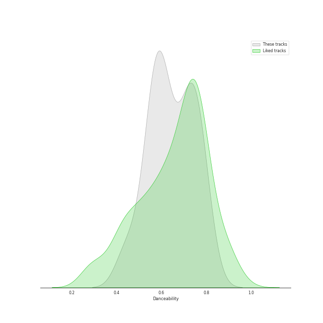
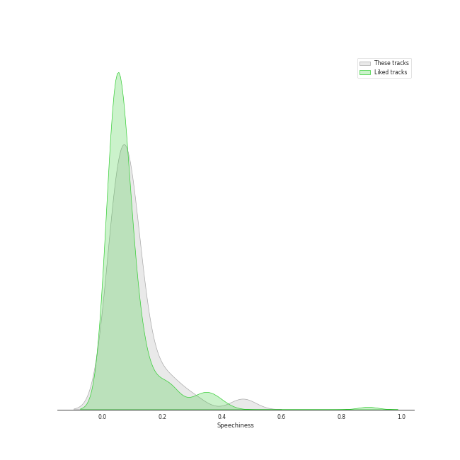
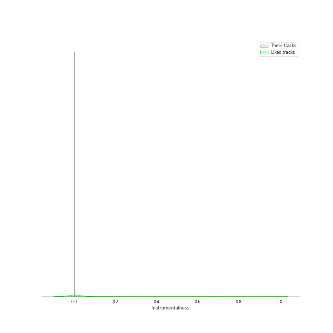
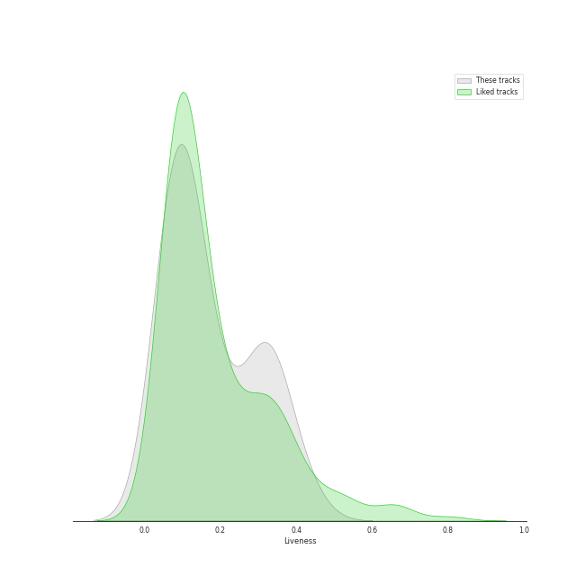
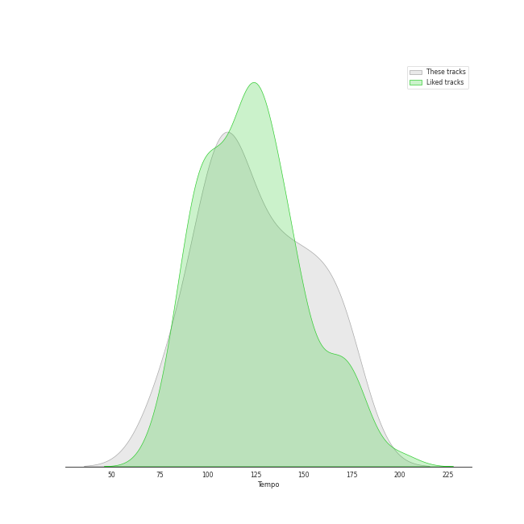

# Audio Features for BTS

## Danceability

| 10 most Danceable tracks | 10 least Danceable tracks |
|:---|:---|
| Anpanman (0.813) | No More Dream (0.436) |
| Telepathy (0.787) | Butterfly (0.448) |
| Filter (0.779) | Boy in Luv (0.491) |
| Singularity (0.775) | Spring Day (0.539) |
| Airplane pt.2 (0.77) | Lie (0.541) |
| Butter (0.759) | SUGA's Interlude (0.55) |
| Savage Love (Laxed – Siren Beat) [BTS Remix] (0.758) | FAKE LOVE (0.557) |
| Dynamite (0.746) | Life Goes On (0.566) |
| Danger (0.738) | The Truth Untold (feat. Steve Aoki) (0.571) |
| IDOL (0.733) | Mikrokosmos (0.579) |

## Energy

| 10 most Energetic tracks | 10 least Energetic tracks |
|:---|:---|
| War of Hormone (0.993) | Singularity (0.272) |
| Boy in Luv (0.947) | The Truth Untold (feat. Steve Aoki) (0.422) |
| Dope (0.896) | Butter (0.459) |
| MIC Drop (0.889) | Savage Love (Laxed – Siren Beat) [BTS Remix] (0.598) |
| Blood Sweat & Tears (0.885) | Stay Gold (0.634) |
| Anpanman (0.876) | Telepathy (0.669) |
| Dynamite - Holiday Remix (0.873) | Life Goes On (0.716) |
| No More Dream (0.869) | FAKE LOVE (0.719) |
| Danger (0.868) | Like (0.726) |
| Boy With Luv (feat. Halsey) (0.862) | SUGA's Interlude (0.732) |

## Speechiness

| 10 most Speechy tracks | 10 least Speechy tracks |
|:---|:---|
| No More Dream (0.472) | Lie (0.033) |
| Boy in Luv (0.306) | Airplane pt.2 (0.0339) |
| War of Hormone (0.24) | Spring Day (0.0354) |
| Dope (0.225) | FAKE LOVE (0.0371) |
| MIC Drop (Steve Aoki Remix) - Full Length Edition (0.183) | The Truth Untold (feat. Steve Aoki) (0.0422) |
| Run BTS (0.168) | Life Goes On (0.0424) |
| IDOL (0.118) | HOME (0.0427) |
| Like (0.116) | Telepathy (0.0428) |
| Mikrokosmos (0.114) | Butter (Holiday Remix) (0.0529) |
| SUGA's Interlude (0.105) | Stay Gold (0.0542) |

## Acousticness

| 10 most Acoustic tracks | 10 least Acoustic tracks |
|:---|:---|
| Singularity (0.56) | Danger (0.000907) |
| The Truth Untold (feat. Steve Aoki) (0.374) | Butter (Holiday Remix) (0.00188) |
| Like (0.271) | Boy in Luv (0.00261) |
| Savage Love (Laxed – Siren Beat) [BTS Remix] (0.16) | FAKE LOVE (0.00267) |
| dimple (0.142) | Butter (0.00323) |
| Black Swan (0.137) | Lie (0.00338) |
| Mikrokosmos (0.125) | IDOL (0.00481) |
| ON (0.118) | Spring Day (0.00631) |
| War of Hormone (0.116) | Life Goes On (0.00691) |
| Boy With Luv (feat. Halsey) (0.0933) | Telepathy (0.00782) |

## Instrumentalness

| 10 most Instrumental tracks | 10 least Instrumental tracks |
|:---|:---|
| Singularity (0.00278) | ON (0.0) |
| Danger (0.000215) | Mikrokosmos (0.0) |
| Airplane pt.2 (0.000103) | Like (0.0) |
| Spring Day (1.71e-06) | IDOL (0.0) |
| No More Dream (1.6e-06) | Lie (0.0) |
| Dope (1.02e-06) | Black Swan (0.0) |
| MIC Drop (Steve Aoki Remix) - Full Length Edition (1.01e-06) | MIC Drop (0.0) |
| Save Me (0.0) | Blood Sweat & Tears (0.0) |
| The Truth Untold (feat. Steve Aoki) (0.0) | Anpanman (0.0) |
| FAKE LOVE (0.0) | War of Hormone (0.0) |

## Liveness

| 10 most Live tracks | 10 least Live tracks |
|:---|:---|
| No More Dream (0.494) | Run BTS (0.0358) |
| Life Goes On (0.37) | SUGA's Interlude (0.0425) |
| Blood Sweat & Tears (0.357) | Mikrokosmos (0.0502) |
| Dope (0.352) | Dynamite - Holiday Remix (0.0526) |
| Boy in Luv (0.34) | DNA (0.0677) |
| ON (0.338) | Save Me (0.0783) |
| War of Hormone (0.307) | Stay Gold (0.0787) |
| FAKE LOVE (0.306) | MIC Drop (0.0816) |
| Savage Love (Laxed – Siren Beat) [BTS Remix] (0.295) | Airplane pt.2 (0.084) |
| dimple (0.287) | Butter (0.0906) |

## Valence

| 10 most Happy tracks | 10 least Happy tracks |
|:---|:---|
| Butter (Holiday Remix) (0.87) | The Truth Untold (feat. Steve Aoki) (0.169) |
| Airplane pt.2 (0.866) | Singularity (0.198) |
| Filter (0.859) | SUGA's Interlude (0.246) |
| Boy With Luv (feat. Halsey) (0.803) | Butterfly (0.294) |
| Like (0.768) | FAKE LOVE (0.345) |
| Anpanman (0.757) | Danger (0.378) |
| Dynamite (0.737) | IDOL (0.42) |
| Run BTS (0.696) | ON (0.437) |
| Butter (0.695) | Life Goes On (0.45) |
| DNA (0.687) | Spring Day (0.462) |

## Tempo

| 10 most Fast tracks | 10 least Fast tracks |
|:---|:---|
| Mikrokosmos (174.043) | Run BTS (77.004) |
| MIC Drop (Steve Aoki Remix) - Full Length Edition (170.01) | FAKE LOVE (77.502) |
| MIC Drop (169.959) | Life Goes On (81.068) |
| No More Dream (167.766) | Blood Sweat & Tears (92.9) |
| Boy in Luv (166.236) | Lie (94.069) |
| Dope (153.991) | War of Hormone (98.004) |
| SUGA's Interlude (153.836) | Anpanman (98.989) |
| Savage Love (Laxed – Siren Beat) [BTS Remix] (149.836) | Like (100.45) |
| Butterfly (149.806) | Singularity (103.991) |
| Black Swan (147.024) | Telepathy (104.994) |
