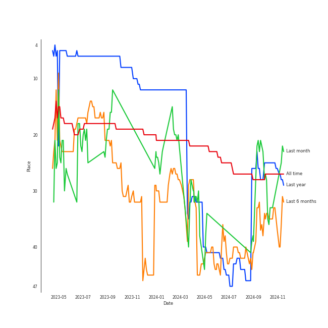
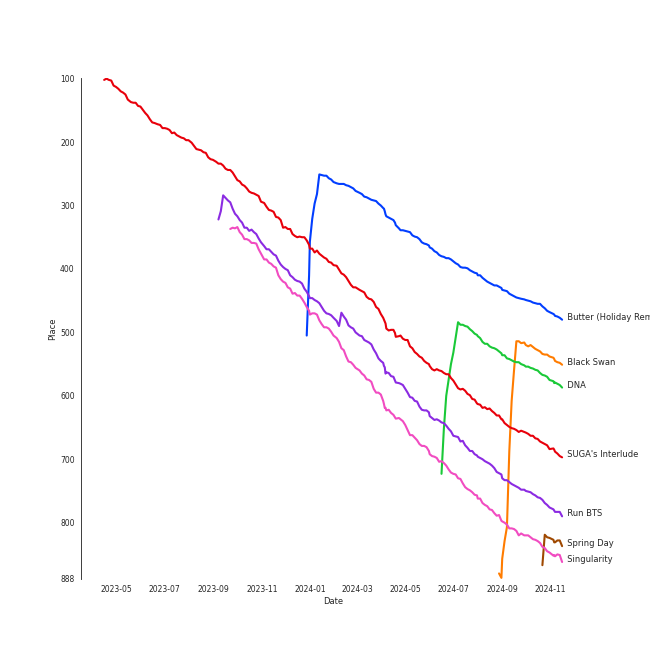
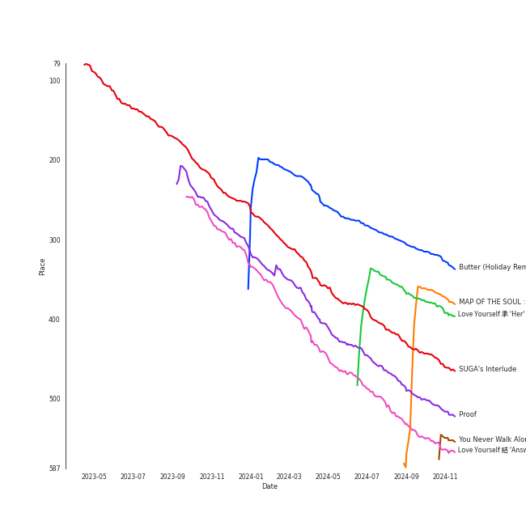
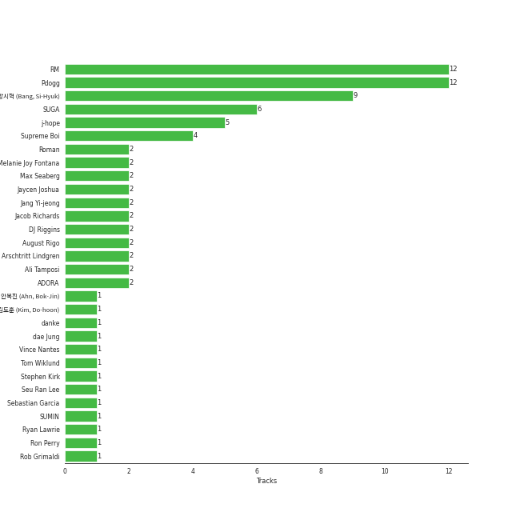

# BTS

[See Track Features](audio_features.md)

[See Clusters](clusters/overview.md)

## Relationships

BTS:
- has member JIN
- has member Jimin
- has member Jung Kook
- has member RM
- has member SUGA
- has member V
- has member [j-hope](../j-hope/overview.md)

## Artist Rank
BTS is currently:
- The #40 artist of the last 6 months
- The #43 artist of the last year
- The #26 artist of all time

## Top Tracks

### Top tracks of all time

## Top Albums

| Art | Rank | Tracks | 💚 | Album | Release Date | 🔗 |
|:---|---:|---:|---:|:---|:---|:---|
|  | 598 | 4 | 3 | MAP OF THE SOUL : 7 | 2020-02-21 | [🔗](https://open.spotify.com/album/5W1XY5ucNATjTULERvXx9j) |
|  | 598 | 4 | 3 | Love Yourself 轉 'Tear' | 2018-05-18 | [🔗](https://open.spotify.com/album/4NIqCxqP9o8Tp6tGLBqd8O) |
|  | 598 | 3 | 3 | BE | 2020-11-20 | [🔗](https://open.spotify.com/album/6nYfHQnvkvOTNHnOhDT3sr) |
|  | 598 | 3 | 2 | The Most Beautiful Moment in Life: Young Forever | 2016-05-02 | [🔗](https://open.spotify.com/album/1k5bJ8l5oL5xxVBVHjil09) |
|  | 505 | 3 | 2 | Love Yourself 結 'Answer' | 2018-08-24 | [🔗](https://open.spotify.com/album/43wFM1HquliY3iwKWzPN4y) |
|  | 340 | 3 | 2 | Love Yourself 承 'Her' | 2017-09-18 | [🔗](https://open.spotify.com/album/07Rq17GzCnIdWJcyVHb57G) |
|  | 598 | 3 | 1 | MAP OF THE SOUL : PERSONA | 2019-04-12 | [🔗](https://open.spotify.com/album/2KqlAl1Kl5fZvbFgJ0qFB6) |
|  | 598 | 2 | 2 | Wings | 2016-10-10 | [🔗](https://open.spotify.com/album/1vhNGBTFoaSTLbHjPGFIlF) |
|  | 463 | 2 | 2 | Proof | 2022-06-10 | [🔗](https://open.spotify.com/album/6al2VdKbb6FIz9d7lU7WRB) |
|  | 598 | 2 | 0 | Dark & Wild | 2014-08-20 | [🔗](https://open.spotify.com/album/35voVqYGkotyJ945O9egDY) |

See all albums

| Art | Rank | Tracks | 💚 | Album | Release Date | 🔗 |
|:---|---:|---:|---:|:---|:---|:---|
|  | 598 | 1 | 1 | You Never Walk Alone | 2017-02-13 | [🔗](https://open.spotify.com/album/6THpewjqJ15ORBJkh5CEYb) |
|  | 598 | 1 | 1 | Skool Luv Affair | 2014-02-12 | [🔗](https://open.spotify.com/album/5r35iS0uSSoQBKzQj0IeI3) |
|  | 402 | 1 | 1 | SUGA's Interlude | 2019-12-06 | [🔗](https://open.spotify.com/album/0JfaSjTaej3QB27ofjnbQV) |
|  | 598 | 1 | 0 | MAP OF THE SOUL : 7 ~ THE JOURNEY ~ | 2020-07-14 | [🔗](https://open.spotify.com/album/1nScVw87kRJiT2bg2Kswhp) |
|  | 598 | 1 | 0 | Dynamite (Holiday Remix) | 2020-12-11 | [🔗](https://open.spotify.com/album/3HVNK5OxW9qfkySXjHWehH) |
|  | 291 | 1 | 0 | Butter (Holiday Remix) | 2021-12-03 | [🔗](https://open.spotify.com/album/4cmHvSMDrSRe2sLodew8sV) |
|  | 598 | 1 | 0 | 2 Cool 4 Skool | 2013-06-12 | [🔗](https://open.spotify.com/album/6egaEe9JaULuUCkihSnYlH) |

## Featured on Playlists
| Art | Tracks | Playlist |
|:---|---:|:---|
|  | 33 | [K-Pop](../../playlists/k-pop/overview.md) |
|  | 6 | [Workout](../../playlists/workout/overview.md) |
|  | 5 | [K-Pop Favorites](../../playlists/k-pop_favorites/overview.md) |
|  | 5 | [Sharon RPD](../../playlists/sharon_rpd/overview.md) |
|  | 4 | [K-Memes](../../playlists/k-memes/overview.md) |
|  | 4 | [Chill](../../playlists/chill/overview.md) |
|  | 2 | [Your Top Songs 2022](../../playlists/your_top_songs_2022/overview.md) |
|  | 2 | [Christmas](../../playlists/christmas/overview.md) |
|  | 1 | [K-Pop 101](../../playlists/k-pop_101/overview.md) |
|  | 1 | [Pop](../../playlists/pop/overview.md) |
|  | 1 | [Classical Samples](../../playlists/classical_samples/overview.md) |
|  | 1 | [Recommendations for Chris](../../playlists/recommendations_for_chris/overview.md) |

## Top Record Labels

| Tracks | 💚 | Label |
|---:|---:|:---|
| 34 | 22 | [BIGHIT MUSIC](../../labels/bighit_music/overview.md) |
| 1 | 1 | [Capitol Records](../../labels/capitol_records/overview.md) |
| 1 | 0 | [Universal Music LLC](../../labels/universal_music_llc/overview.md) |
| 1 | 0 | HYBE |

## Genres

- [k-pop](../../genres/k-pop/overview.md)
- [k-pop boy group](../../genres/k-pop_boy_group/overview.md)
- [pop](../../genres/pop/overview.md)

## Credits

### Credits by Type

| Credit Type | Tracks |
|:---|---:|
| Vocal | 2 |

### Member Credits

| | JIN | Jimin | Jung Kook | RM | SUGA | V | [j-hope](../j-hope/overview.md) |
|:---|---:|---:|---:|---:|---:|---:|---:|
| Arranger | 0 | 0 | 0 | 1 | 2 | 0 | 0 |
| Instrument | 0 | 0 | 0 | 0 | 2 | 0 | 0 |
| Lyricist | 0 | 0 | 0 | 1 | 2 | 0 | 0 |
| Producer | 0 | 0 | 0 | 2 | 3 | 0 | 0 |
| Songwriter | 0 | 1 | 0 | 14 | 9 | 0 | 6 |
| Vocal | 1 | 3 | 6 | 2 | 4 | 2 | 2 |
### Production Credits

| Art | Track | Members | Credit Types |
|:---|:---|:---|:---|
|  | Lie | Jimin | Songwriter |
|  | Blood Sweat & Tears | RM, SUGA, [j-hope](../../j-hope/overview.md) | Songwriter |
|  | MIC Drop | RM, [j-hope](../../j-hope/overview.md) | Songwriter |
|  | DNA | RM, SUGA | Songwriter |
|  | Anpanman | RM, SUGA | Songwriter |
|  | Airplane pt.2 | RM, SUGA, [j-hope](../../j-hope/overview.md) | Songwriter |
|  | FAKE LOVE | RM | Songwriter |
|  | IDOL | RM | Songwriter |
|  | Singularity | RM | Lyricist |
|  | Mikrokosmos | RM, SUGA, [j-hope](../../j-hope/overview.md) | Producer, Songwriter |

View all

| Art | Track | Members | Credit Types |
|:---|:---|:---|:---|
|  | ON | RM, SUGA, [j-hope](../../j-hope/overview.md) | Arranger, Producer, Songwriter |
|  | Black Swan | RM | Songwriter |
|  | eight(Prod.&Feat. SUGA of BTS) | SUGA | Producer |
| | nan | RM | Songwriter |
| | nan | SUGA | Arranger, Lyricist, Producer, Songwriter |

## Top Producers

| Art | Producer | Tracks | Credit Types |
|:---|:---|---:|:---|
|  | RM | 12 | Songwriter, Arranger, Producer, Lyricist |
| | [Pdogg](../../producers/pdogg/overview.md) | 12 | Producer, Songwriter, Arranger |
| | [방시혁 (Bang, Si-Hyuk)](../../producers/방시혁_(bang,_si-hyuk)/overview.md) | 9 | Songwriter |
|  | SUGA | 6 | Songwriter |
|  | [j-hope](../j-hope/overview.md) | 5 | Songwriter |
| | [Supreme Boi](../../producers/supreme_boi/overview.md) | 4 | Songwriter |
| | Ali Tamposi | 2 | Songwriter |
| | Melanie Joy Fontana | 2 | Songwriter |
| | Jaycen Joshua | 2 | Producer |
| | Max Seaberg | 2 | Producer |

View all

| Art | Producer | Tracks | Credit Types |
|:---|:---|---:|:---|
| | Jang Yi-jeong | 2 | Producer |
| | DJ Riggins | 2 | Producer |
| | [Arschtritt Lindgren](../../producers/arschtritt_lindgren/overview.md) | 2 | Songwriter |
|  | ADORA | 2 | Producer |
| | Jacob Richards | 2 | Producer |
| | Roman | 2 | Songwriter |
| | August Rigo | 2 | Songwriter |
| | [danke](../../producers/danke/overview.md) | 1 | Songwriter |
| | Camilla Anne Stewart | 1 | Songwriter |
| | Charlie J. Perry | 1 | Producer, Songwriter |
| | Julia Ross | 1 | Songwriter |
| | Frants | 1 | Producer |
| | Krysta Youngs | 1 | Songwriter |
| | Erik Reichers | 1 | Producer |
| | Hiss noise | 1 | Producer |
|  | Jimin | 1 | Songwriter |
| | Hilda Stenmalm | 1 | Songwriter |
| | Ryan Lawrie | 1 | Songwriter |
| | Marcus McCoan | 1 | Producer, Songwriter |
| | Arcades | 1 | Producer |
|  | SUMIN | 1 | Songwriter |
| | Lutra | 1 | Songwriter |
| | Antonina Armato | 1 | Songwriter |
| | Clyde Kelly | 1 | Songwriter |
| | Matt Thomson | 1 | Songwriter |
| | dae Jung | 1 | Songwriter |
| | Kass | 1 | Songwriter |
| | DOCSKIM | 1 | Songwriter |
| | Tom Wiklund | 1 | Producer, Songwriter |
| | DJ Swivel | 1 | Producer, Songwriter |
| | Alex Williams | 1 | Producer |
| | Neon Boy | 1 | Songwriter |
| | Candace Sosa | 1 | Songwriter |
| | David Stewart | 1 | Songwriter |
| | Jessica Agombar | 1 | Songwriter |
| | Vince Nantes | 1 | Songwriter |
| | Jenna Andrews | 1 | Songwriter |
| | [김도훈 (Kim, Do-hoon)](../../producers/김도훈_(kim,_do-hoon)/overview.md) | 1 | Songwriter |
| | Sebastian Garcia | 1 | Songwriter |
| | Fallin' Dild | 1 | Songwriter |
| | Liza Owen | 1 | Songwriter |
| | Max Graham | 1 | Songwriter |
| | Stephen Kirk | 1 | Songwriter |
| | [Phil Tan](../../producers/phil_tan/overview.md) | 1 | Producer |
| | 안복진 (Ahn, Bok-Jin) | 1 | Songwriter |
| | Jinbo | 1 | Songwriter |
| | Bill Zimmerman | 1 | Producer |
| | Ron Perry | 1 | Songwriter |
| | Rob Grimaldi | 1 | Songwriter |
| | Alex Bilowitz | 1 | Songwriter |
| | Seu Ran Lee | 1 | Songwriter |

## Tracks

| Art | Track | Album | Artists | Label | Rank | 💚 | 🔗 |
|:---|:---|:---|:---|:---|---:|:---|:---|
|  | Butter (Holiday Remix) | Butter (Holiday Remix) | [BTS](overview.md) | [BIGHIT MUSIC](../../labels/bighit_music) | 401 | | [🔗](https://open.spotify.com/track/3IA9LkBEVhJDOxOnh1nf8a) |
|  | DNA | Love Yourself 承 'Her' | [BTS](overview.md) | [BIGHIT MUSIC](../../labels/bighit_music) | 491 | 💚 | [🔗](https://open.spotify.com/track/3uRLwBjI2TahxslcMTvpFs) |
|  | SUGA's Interlude | SUGA's Interlude | Halsey, SUGA, [BTS](overview.md) | [Capitol Records](../../labels/capitol_records) | 596 | 💚 | [🔗](https://open.spotify.com/track/5a0nHa7F4S9hb0Zi0zLS8w) |
|  | Run BTS | Proof | [BTS](overview.md) | [BIGHIT MUSIC](../../labels/bighit_music) | 682 | 💚 | [🔗](https://open.spotify.com/track/69xohKu8C1fsflYAiSNbwM) |
|  | Singularity | Love Yourself 結 'Answer' | [BTS](overview.md) | [BIGHIT MUSIC](../../labels/bighit_music) | 746 | 💚 | [🔗](https://open.spotify.com/track/2ApfJvLr7RbhJl6NOVhEu6) |
|  | No More Dream | 2 Cool 4 Skool | [BTS](overview.md) | [BIGHIT MUSIC](../../labels/bighit_music) | 892 | | [🔗](https://open.spotify.com/track/089PFeXotzDLNQz9NCk6pF) |
|  | Boy in Luv | Skool Luv Affair | [BTS](overview.md) | [BIGHIT MUSIC](../../labels/bighit_music) | 892 | 💚 | [🔗](https://open.spotify.com/track/3FnDv33WrrMtuEr7hNR3ev) |
|  | Danger | Dark & Wild | [BTS](overview.md) | [BIGHIT MUSIC](../../labels/bighit_music) | 892 | | [🔗](https://open.spotify.com/track/0zzRxtfO5FGxKdqq4OKmlw) |
|  | War of Hormone | Dark & Wild | [BTS](overview.md) | [BIGHIT MUSIC](../../labels/bighit_music) | 892 | | [🔗](https://open.spotify.com/track/29SjtKzBoJDgyIBusHylIS) |
|  | Butterfly | The Most Beautiful Moment in Life: Young Forever | [BTS](overview.md) | [BIGHIT MUSIC](../../labels/bighit_music) | 892 | 💚 | [🔗](https://open.spotify.com/track/2QP1vvLPtAVOVAFabpqypA) |

See all tracks

| Art | Track | Album | Artists | Label | Rank | 💚 | 🔗 |
|:---|:---|:---|:---|:---|---:|:---|:---|
|  | Dope | The Most Beautiful Moment in Life: Young Forever | [BTS](overview.md) | [BIGHIT MUSIC](../../labels/bighit_music) | 892 | 💚 | [🔗](https://open.spotify.com/track/4o3Ao6wY5fbJR32fQKabfQ) |
|  | Save Me | The Most Beautiful Moment in Life: Young Forever | [BTS](overview.md) | [BIGHIT MUSIC](../../labels/bighit_music) | 892 | | [🔗](https://open.spotify.com/track/7bxGcILuAjkZzaveU28ZJS) |
|  | Blood Sweat & Tears | Wings | [BTS](overview.md) | [BIGHIT MUSIC](../../labels/bighit_music) | 892 | 💚 | [🔗](https://open.spotify.com/track/2u54HNQamwFuOMLSuhSRom) |
|  | Lie | Wings | [BTS](overview.md) | [BIGHIT MUSIC](../../labels/bighit_music) | 892 | 💚 | [🔗](https://open.spotify.com/track/1nWB8isqs2tviWk20G5pow) |
|  | Spring Day | You Never Walk Alone | [BTS](overview.md) | [BIGHIT MUSIC](../../labels/bighit_music) | 892 | 💚 | [🔗](https://open.spotify.com/track/2j1fFjWHCI9KJSwcuYAOyF) |
|  | MIC Drop | Love Yourself 承 'Her' | [BTS](overview.md) | [BIGHIT MUSIC](../../labels/bighit_music) | 892 | 💚 | [🔗](https://open.spotify.com/track/4gZGAVECoiutzp64KSHNjE) |
|  | dimple | Love Yourself 承 'Her' | [BTS](overview.md) | [BIGHIT MUSIC](../../labels/bighit_music) | 892 | | [🔗](https://open.spotify.com/track/6pp6xf9zS55GD4nr318XUH) |
|  | Airplane pt.2 | Love Yourself 轉 'Tear' | [BTS](overview.md) | [BIGHIT MUSIC](../../labels/bighit_music) | 892 | 💚 | [🔗](https://open.spotify.com/track/4lAE47gj539h8R1yxPhhGG) |
|  | Anpanman | Love Yourself 轉 'Tear' | [BTS](overview.md) | [BIGHIT MUSIC](../../labels/bighit_music) | 892 | 💚 | [🔗](https://open.spotify.com/track/34OSqW5ULWxmCEMjJ1ZgVW) |
|  | FAKE LOVE | Love Yourself 轉 'Tear' | [BTS](overview.md) | [BIGHIT MUSIC](../../labels/bighit_music) | 892 | 💚 | [🔗](https://open.spotify.com/track/6m1TWFMeon7ai9XLOzdbiR) |
|  | The Truth Untold (feat. Steve Aoki) | Love Yourself 轉 'Tear' | [BTS](overview.md), Steve Aoki | [BIGHIT MUSIC](../../labels/bighit_music) | 892 | | [🔗](https://open.spotify.com/track/7DEKa5Z7Cl8s3Y7imb88OM) |
|  | IDOL | Love Yourself 結 'Answer' | [BTS](overview.md) | [BIGHIT MUSIC](../../labels/bighit_music) | 892 | 💚 | [🔗](https://open.spotify.com/track/1e8J3XClxZbFmvIHLI8CE4) |
|  | MIC Drop (Steve Aoki Remix) (Full Length Edition) | Love Yourself 結 'Answer' | [BTS](overview.md), Steve Aoki | [BIGHIT MUSIC](../../labels/bighit_music) | 892 | | [🔗](https://open.spotify.com/track/01380RE6UfsPSdiUIwrCoH) |
|  | Boy With Luv (feat. Halsey) | MAP OF THE SOUL : PERSONA | [BTS](overview.md), Halsey | [BIGHIT MUSIC](../../labels/bighit_music) | 892 | | [🔗](https://open.spotify.com/track/4a9tbd947vo9K8Vti9JwcI) |
|  | HOME | MAP OF THE SOUL : PERSONA | [BTS](overview.md) | [BIGHIT MUSIC](../../labels/bighit_music) | 892 | | [🔗](https://open.spotify.com/track/6Yc3tjFCVR2bfAQFRTZBef) |
|  | Mikrokosmos | MAP OF THE SOUL : PERSONA | [BTS](overview.md) | [BIGHIT MUSIC](../../labels/bighit_music) | 892 | 💚 | [🔗](https://open.spotify.com/track/0jSccBRnhNU4KtACMQPvco) |
|  | Black Swan | MAP OF THE SOUL : 7 | [BTS](overview.md) | [BIGHIT MUSIC](../../labels/bighit_music) | 892 | 💚 | [🔗](https://open.spotify.com/track/2EmcTFQ1rM11wp2ztsXTHa) |
|  | Filter | MAP OF THE SOUL : 7 | [BTS](overview.md) | [BIGHIT MUSIC](../../labels/bighit_music) | 892 | 💚 | [🔗](https://open.spotify.com/track/4bZZVcgWWMWPBwzTTp642w) |
|  | ON | MAP OF THE SOUL : 7 | [BTS](overview.md) | [BIGHIT MUSIC](../../labels/bighit_music) | 892 | 💚 | [🔗](https://open.spotify.com/track/0fZRNhPJ4AGmwY7rkpdbqK) |
|  | UGH! | MAP OF THE SOUL : 7 | [BTS](overview.md) | [BIGHIT MUSIC](../../labels/bighit_music) | 892 | | [🔗](https://open.spotify.com/track/2QZe2H1f03t5PJWEMg2Mbe) |
|  | Stay Gold | MAP OF THE SOUL : 7 ~ THE JOURNEY ~ | [BTS](overview.md) | [Universal Music LLC](../../labels/universal_music_llc) | 892 | | [🔗](https://open.spotify.com/track/3Ys2PYl1wyPKQIwyqhP9cQ) |
|  | Dynamite | BE | [BTS](overview.md) | [BIGHIT MUSIC](../../labels/bighit_music) | 892 | 💚 | [🔗](https://open.spotify.com/track/5QDLhrAOJJdNAmCTJ8xMyW) |
|  | Life Goes On | BE | [BTS](overview.md) | [BIGHIT MUSIC](../../labels/bighit_music) | 892 | 💚 | [🔗](https://open.spotify.com/track/5FVbvttjEvQ8r2BgUcJgNg) |
|  | Telepathy | BE | [BTS](overview.md) | [BIGHIT MUSIC](../../labels/bighit_music) | 892 | 💚 | [🔗](https://open.spotify.com/track/6Fnvi5QnVkTskSzeRvvQds) |
|  | Dynamite - Holiday Remix | Dynamite (Holiday Remix) | [BTS](overview.md) | [BIGHIT MUSIC / HYBE](../../labels/bighit_music) | 892 | | [🔗](https://open.spotify.com/track/6SM3TJaWkmT8Iq8l9J0BIS) |
|  | Butter | Proof | [BTS](overview.md) | [BIGHIT MUSIC](../../labels/bighit_music) | 892 | 💚 | [🔗](https://open.spotify.com/track/6jjYDGxVJsWS0a5wlVF5vS) |

