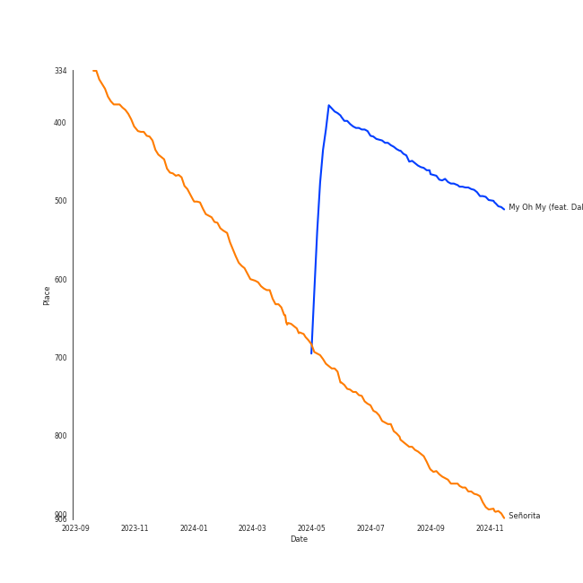
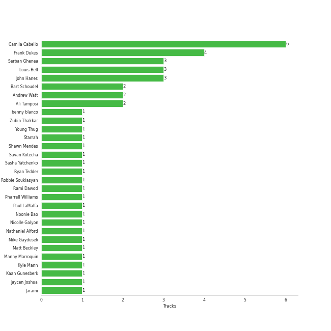

# Camila Cabello

## Relationships

Camila Cabello:
- is a member of Fifth Harmony

## Artist Rank

## Top Tracks

### Top tracks, aggregated

## Featured on Playlists
| Art | Tracks | Playlist |
|:---|---:|:---|
|  | 8 | [Pop](../../playlists/pop/overview.md) |
|  | 2 | [A-Pop Favorites](../../playlists/a-pop_favorites/overview.md) |
|  | 1 | [Summer](../../playlists/summer/overview.md) |
|  | 1 | [K-Pop-Adjacent](../../playlists/k-pop-adjacent/overview.md) |

## Top Albums

| Art | Tracks | 💚 | Album | Release Date | 🔗 |
|:---|---:|---:|:---|:---|:---|
|  | 3 | 3 | Camila | 2018-01-12 | [🔗](https://open.spotify.com/album/2vD3zSQr8hNlg0obNel4TE) |
|  | 3 | 2 | Romance | 2019-12-06 | [🔗](https://open.spotify.com/album/3Vsbl0diFGw8HNSjG8ue9m) |
|  | 1 | 1 | bloom | 2017-05-12 | [🔗](https://open.spotify.com/album/3yWRq9Dd2UO5xyqxTjLDmp) |
|  | 1 | 1 | Cry for Me | 2019-10-04 | [🔗](https://open.spotify.com/album/2dq4ae5hiyxlFPG1s8rlq5) |

## Top Record Labels

| Tracks | 💚 | Label |
|---:|---:|:---|
| 7 | 6 | [Syco Music](../../labels/syco_music/overview.md) |
| 7 | 6 | [Epic](../../labels/epic/overview.md) |
| 1 | 1 | [Interscope Records](../../labels/interscope_records/overview.md) |
| 1 | 1 | [Bad Boy](../../labels/bad_boy/overview.md) |

## Genres

- [dance pop](../../genres/dance_pop/overview.md)
- [pop](../../genres/pop/overview.md)

## Credits

### Credits by Type

| Credit Type | Tracks |
|:---|---:|
| Songwriter | 7 |
| Vocal | 3 |

### Production Credits

| Art | Track | Credit Types |
|:---|:---|:---|
|  | Havana (feat. Young Thug) | Songwriter |
|  | Never Be the Same | Songwriter |
|  | Consequences | Songwriter |
|  | Havana | Songwriter |
|  | Cry for Me | Songwriter |
|  | Señorita | Songwriter |
|  | My Oh My (feat. DaBaby) | Songwriter |

## Top Producers

| Art | Producer | Tracks | Credit Types |
|:---|:---|---:|:---|
|  | [Camila Cabello](overview.md) | 6 | Songwriter |
| | Frank Dukes | 4 | Songwriter, Producer |
| | [John Hanes](../../producers/john_hanes/overview.md) | 3 | Producer |
| | [Serban Ghenea](../../producers/serban_ghenea/overview.md) | 3 | Producer |
| | Louis Bell | 3 | Songwriter, Producer |
| | Bart Schoudel | 2 | Producer |
| | Andrew Watt | 2 | Producer, Songwriter |
| | Ali Tamposi | 2 | Songwriter |
|  | Charli XCX | 1 | Songwriter |
| | Jarami | 1 | Producer |

View all

| Art | Producer | Tracks | Credit Types |
|:---|:---|---:|:---|
| | Jaycen Joshua | 1 | Producer |
| | Starrah | 1 | Songwriter |
| | Amy Wadge | 1 | Songwriter |
| | Emily Weisband | 1 | Songwriter |
| | Noonie Bao | 1 | Songwriter |
| | [Savan Kotecha](../../producers/savan_kotecha/overview.md) | 1 | Songwriter |
| | Mike Gaydusek | 1 | Producer |
| | Alejandro Guillermo Marambio Altamirano | 1 | Songwriter |
| | Ant Clemons | 1 | Songwriter |
| | Matt Beckley | 1 | Producer |
|  | Shawn Mendes | 1 | Songwriter |
| | [Ryan Tedder](../../producers/ryan_tedder/overview.md) | 1 | Songwriter |
| | Jacob Olofsson | 1 | Songwriter |
| | Robbie Soukiasyan | 1 | Producer |
| | Zubin Thakkar | 1 | Producer |
| | Sasha Yatchenko | 1 | Songwriter |
| | Kaan Gunesberk | 1 | Songwriter |
|  | Pharrell Williams | 1 | Songwriter |
| | Kyle Mann | 1 | Producer |
|  | DaBaby | 1 | Songwriter |
| | Nicolle Galyon | 1 | Songwriter |
|  | Young Thug | 1 | Songwriter |
| | Brian Lee | 1 | Songwriter |
| | Nathaniel Alford | 1 | Producer |
|  | benny blanco | 1 | Producer, Songwriter |
| | Rami Dawod | 1 | Songwriter |
| | [Manny Marroquin](../../producers/manny_marroquin/overview.md) | 1 | Producer |
| | Jack Patterson | 1 | Songwriter |
| | Paul LaMalfa | 1 | Producer |
| | Cashmere Cat | 1 | Producer, Songwriter |

## Tracks

| Art | Track | Album | Artists | Label | Rank | 💚 | 🔗 |
|:---|:---|:---|:---|:---|---:|:---|:---|
|  | Señorita | Romance | Shawn Mendes, [Camila Cabello](overview.md) | [Epic](../../labels/epic), [Syco Music](../../labels/syco_music) | 672 | 💚 | [🔗](https://open.spotify.com/track/3BVgrFWuH01GmCUy9Y2EE8) |
|  | Bad Things (with Camila Cabello) | bloom | mgk, [Camila Cabello](overview.md) | [Bad Boy](../../labels/bad_boy), [Interscope Records](../../labels/interscope_records) | nan | 💚 | [🔗](https://open.spotify.com/track/1PSBzsahR2AKwLJgx8ehBj) |
|  | Consequences | Camila | [Camila Cabello](overview.md) | [Epic](../../labels/epic), [Syco Music](../../labels/syco_music) | nan | 💚 | [🔗](https://open.spotify.com/track/7sTtHHrD0zDpmzQzH3zegz) |
|  | Havana (feat. Young Thug) | Camila | [Camila Cabello](overview.md), Young Thug | [Epic](../../labels/epic), [Syco Music](../../labels/syco_music) | nan | 💚 | [🔗](https://open.spotify.com/track/1rfofaqEpACxVEHIZBJe6W) |
|  | Never Be the Same | Camila | [Camila Cabello](overview.md) | [Epic](../../labels/epic), [Syco Music](../../labels/syco_music) | nan | 💚 | [🔗](https://open.spotify.com/track/4eWQlBRaTjPPUlzacqEeoQ) |
|  | Cry for Me | Cry for Me | [Camila Cabello](overview.md) | [Epic](../../labels/epic), [Syco Music](../../labels/syco_music) | nan | 💚 | [🔗](https://open.spotify.com/track/40nPimvmG05WYS7983bawZ) |
|  | Living Proof | Romance | [Camila Cabello](overview.md) | [Epic](../../labels/epic), [Syco Music](../../labels/syco_music) | nan | | [🔗](https://open.spotify.com/track/4jFD7byoPdGkEdjHLMduR9) |
|  | My Oh My (feat. DaBaby) | Romance | [Camila Cabello](overview.md), DaBaby | [Epic](../../labels/epic), [Syco Music](../../labels/syco_music) | nan | 💚 | [🔗](https://open.spotify.com/track/3yOlyBJuViE2YSGn3nVE1K) |
