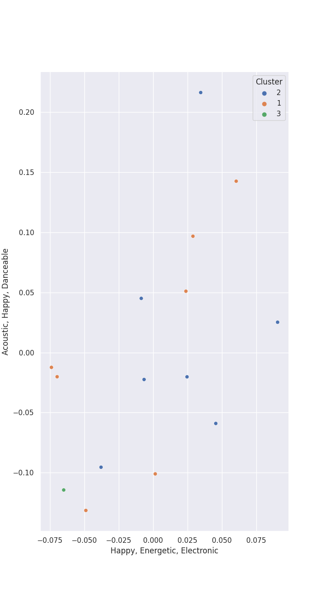

# Clusters in CHUNG HA

## Cluster #1

9 tracks

| Art | Track | Album | Artists | Label | Rank | 💚 | 🔗 |
|:---|:---|:---|:---|:---|---:|:---|:---|
|  | Masquerade | Querencia | [CHUNG HA](../../overview.md) | [MNH ENTERTAINMENT](../../../../labels/mnh_entertainment) | nan | 💚 | [🔗](https://open.spotify.com/track/0AABiBAIYQCMpLI0ODbDDL) |
|  | Demente (feat. Guaynaa) | Querencia | [CHUNG HA](../../overview.md), Guaynaa | [MNH ENTERTAINMENT](../../../../labels/mnh_entertainment) | 293 | 💚 | [🔗](https://open.spotify.com/track/0NhHFXC06r5kK1rTUuOjxM) |
|  | Flying on Faith | Querencia | [CHUNG HA](../../overview.md) | [MNH ENTERTAINMENT](../../../../labels/mnh_entertainment) | nan | 💚 | [🔗](https://open.spotify.com/track/34v3Sm3KEc7DtGPP50jyrl) |
|  | PLAY (feat. Changmo) | Querencia | [CHUNG HA](../../overview.md), CHANGMO | [MNH ENTERTAINMENT](../../../../labels/mnh_entertainment) | nan | 💚 | [🔗](https://open.spotify.com/track/6UM5HKVVm1cjOQhUJB4Ft3) |
|  | Bicycle | Querencia | [CHUNG HA](../../overview.md) | [MNH ENTERTAINMENT](../../../../labels/mnh_entertainment) | 454 | 💚 | [🔗](https://open.spotify.com/track/7wDVvxMUdW5MtJUqFtuXUz) |
|  | Sparkling | Bare&Rare, Pt. 1 | [CHUNG HA](../../overview.md) | [MNH ENTERTAINMENT](../../../../labels/mnh_entertainment) | nan | 💚 | [🔗](https://open.spotify.com/track/6TzU11huC8Hz4FVEsvCeE7) |
|  | Killing Me | Killing Me | [CHUNG HA](../../overview.md) | [MNH ENTERTAINMENT](../../../../labels/mnh_entertainment) | nan | 💚 | [🔗](https://open.spotify.com/track/3QD0Y1tTngihByjdWC99lG) |
|  | EENIE MEENIE (Feat. Hongjoong of ATEEZ) | EENIE MEENIE | [CHUNG HA](../../overview.md), Hongjoong of ATEEZ | MORE VISION | 397 | 💚 | [🔗](https://open.spotify.com/track/3WFTUAPrXvqg3SXC0bsukz) |
|  | Wow Thing | Wow Thing | [SEULGI](../../../seulgi/overview.md), [CHUNG HA](../../overview.md), SinB, [JEON SOYEON](../../../jeon_soyeon/overview.md) | [SM Entertainment](../../../../labels/sm_entertainment) | 748 | 💚 | [🔗](https://open.spotify.com/track/5MwfxCtqMFGYp9Nc1BkTrS) |
## Cluster #2

7 tracks

| Art | Track | Album | Artists | Label | Rank | 💚 | 🔗 |
|:---|:---|:---|:---|:---|---:|:---|:---|
|  | Dream of You (with R3HAB) | Querencia | [CHUNG HA](../../overview.md), R3HAB | [MNH ENTERTAINMENT](../../../../labels/mnh_entertainment) | 226 | 💚 | [🔗](https://open.spotify.com/track/1d8Arh7PushRWWJRs41rSa) |
|  | Stay Tonight | Querencia | [CHUNG HA](../../overview.md) | [MNH ENTERTAINMENT](../../../../labels/mnh_entertainment) | 583 | 💚 | [🔗](https://open.spotify.com/track/7Cn6R7YB4EjQkfci9DdceG) |
|  | Crazy Like You (feat. BIBI) | Bare&Rare, Pt. 1 | [CHUNG HA](../../overview.md), [BIBI](../../../bibi/overview.md) | [MNH ENTERTAINMENT](../../../../labels/mnh_entertainment) | nan | 💚 | [🔗](https://open.spotify.com/track/0oUK4m2wNIBPfejlcB1N9k) |
|  | Bad Boy | Bad Boy | [CHUNG HA](../../overview.md), Christopher | Parlophone Denmark | nan | | [🔗](https://open.spotify.com/track/1WCOna34eEMPgjfOOZkGQc) |
|  | Gotta Go | Gotta Go | [CHUNG HA](../../overview.md) | [Genie Music Corporation](../../../../labels/genie_music_corporation), [Stone Music Entertainment](../../../../labels/stone_music_entertainment) | 10 | 💚 | [🔗](https://open.spotify.com/track/1exnDFdC34GyBcaLt9ZJfX) |
|  | Snapping | Flourishing | [CHUNG HA](../../overview.md) | [Genie Music Corporation](../../../../labels/genie_music_corporation), [Stone Music Entertainment](../../../../labels/stone_music_entertainment) | nan | 💚 | [🔗](https://open.spotify.com/track/4IOxk5ep5ONrdlL0ZIy64v) |
|  | When I Get Old | When I Get Old | Christopher, [CHUNG HA](../../overview.md) | Parlophone Denmark | 109 | 💚 | [🔗](https://open.spotify.com/track/5f2CcxzZoW7hNs1O8NhG6y) |
## Cluster #3

1 tracks

| Art | Track | Album | Artists | Label | Rank | 💚 | 🔗 |
|:---|:---|:---|:---|:---|---:|:---|:---|
|  | Good Night My Princess | Bare&Rare, Pt. 1 | [CHUNG HA](../../overview.md) | [MNH ENTERTAINMENT](../../../../labels/mnh_entertainment) | nan | | [🔗](https://open.spotify.com/track/12QoF5mIoZ1ZrVZFoc2Nwl) |