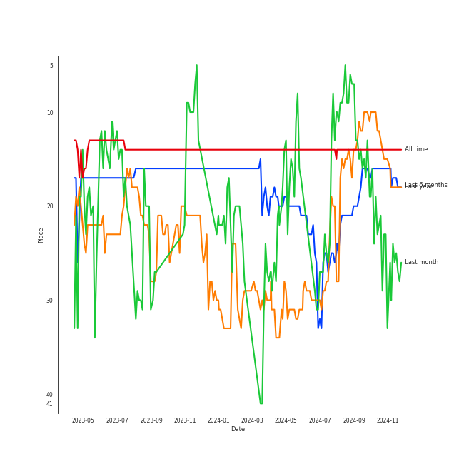
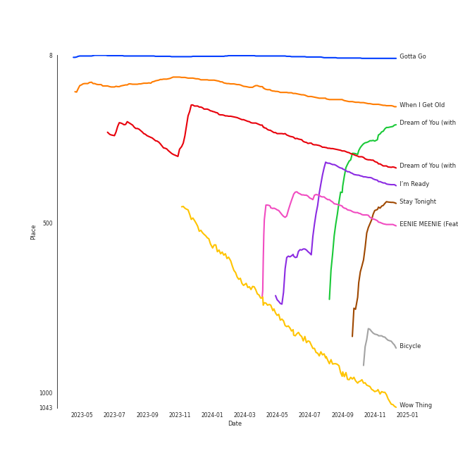
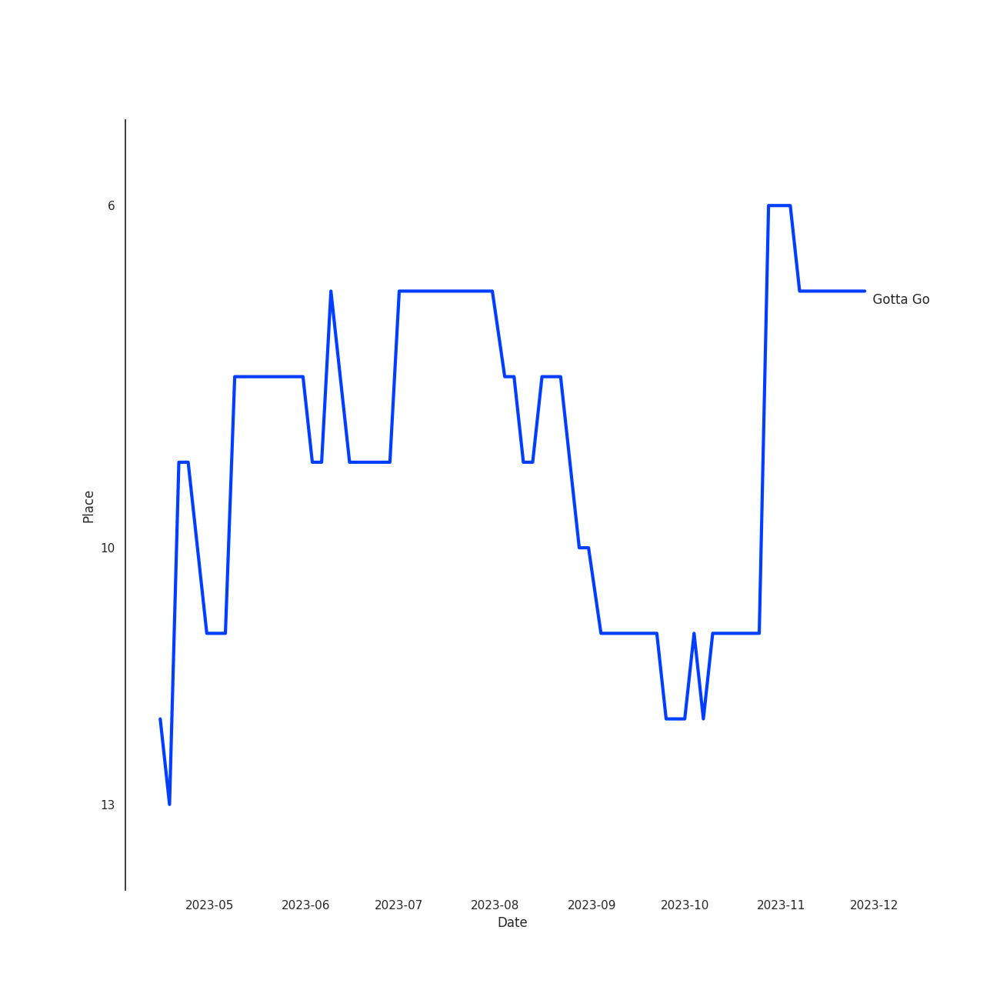
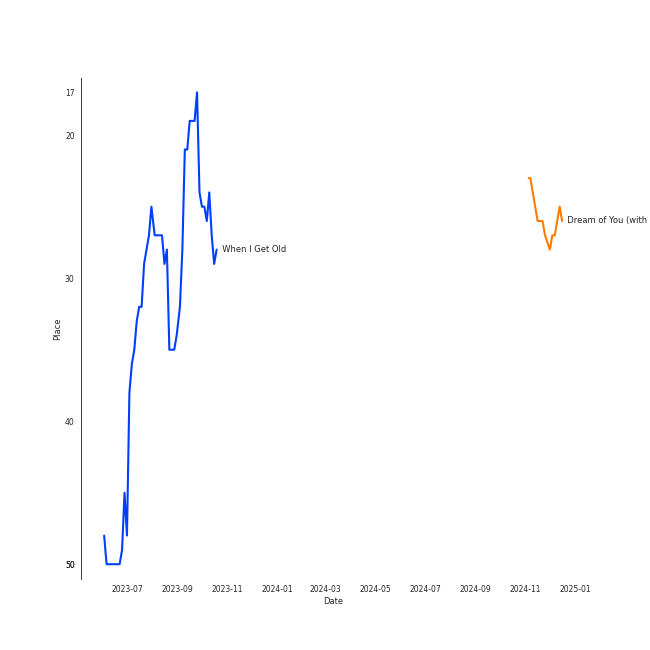
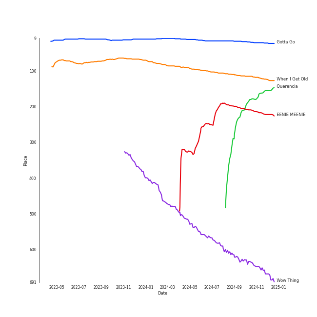
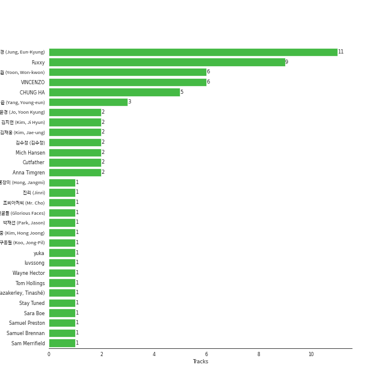

# CHUNG HA

## Relationships

CHUNG HA:
- is a member of I.O.I

## Artist Rank
CHUNG HA is currently:
- The #22 artist of the last month
- The #18 artist of the last 6 months
- The #16 artist of the last year
- The #14 artist of all time

## Top Tracks

### Top tracks of all time

Top tracks of the last year over time

Top tracks of the last 6 months over time

## Top Albums

| Art | Rank | Tracks | 💚 | Album | Release Date | 🔗 |
|:---|---:|---:|---:|:---|:---|:---|
|  | 156 | 7 | 7 | Querencia | 2021-02-15 | [🔗](https://open.spotify.com/album/3ZifpmJjOEkpYCNSIq352p) |
|  | 684 | 3 | 2 | Bare&Rare, Pt. 1 | 2022-07-11 | [🔗](https://open.spotify.com/album/0fgLDYoqdQw5bhzPFWvclR) |
|  | 223 | 2 | 2 | EENIE MEENIE | 2024-03-11 | [🔗](https://open.spotify.com/album/1q2RNzz09Vx3bOKK1yTyyg) |
|  | 684 | 2 | 1 | Flourishing | 2019-06-24 | [🔗](https://open.spotify.com/album/5rHnbSUBaflJgCLlZfDnzt) |
|  | 679 | 1 | 1 | Wow Thing | 2018-09-28 | [🔗](https://open.spotify.com/album/3xEPyp7h78uULpDPuKvokH) |
|  | 125 | 1 | 1 | When I Get Old | 2022-10-20 | [🔗](https://open.spotify.com/album/3mJMHqT2w0HwjQkneNVE14) |
|  | 23 | 1 | 1 | Gotta Go | 2019-01-02 | [🔗](https://open.spotify.com/album/3WgHekDElv10Kam9aCMwnx) |
|  | 684 | 1 | 0 | Street Woman Fighter(SWF) Special | 2021-10-27 | [🔗](https://open.spotify.com/album/3iW6rZmhiSLNveTOrX26z6) |
|  | 684 | 1 | 0 | Bad Boy | 2020-09-23 | [🔗](https://open.spotify.com/album/4IRuxkSbw7iZZmnr6Rly2Q) |

## Featured on Playlists
| Art | Tracks | Playlist |
|:---|---:|:---|
|  | 19 | [K-Pop](../../playlists/k-pop/overview.md) |
|  | 6 | [K-Pop Favorites](../../playlists/k-pop_favorites/overview.md) |
|  | 2 | [Workout](../../playlists/workout/overview.md) |
|  | 1 | [Summer](../../playlists/summer/overview.md) |
|  | 1 | [K-Pop 101](../../playlists/k-pop_101/overview.md) |
|  | 1 | [Sharon RPD](../../playlists/sharon_rpd/overview.md) |
|  | 1 | [Recommendations for Chris](../../playlists/recommendations_for_chris/overview.md) |

## Top Record Labels

| Tracks | 💚 | Label |
|---:|---:|:---|
| 10 | 9 | [MNH ENTERTAINMENT](../../labels/mnh_entertainment/overview.md) |
| 4 | 2 | [Genie Music Corporation](../../labels/genie_music_corporation/overview.md) |
| 3 | 2 | [Stone Music Entertainment](../../labels/stone_music_entertainment/overview.md) |
| 2 | 2 | MORE VISION |
| 2 | 1 | Parlophone Denmark |
| 1 | 1 | [SM Entertainment](../../labels/sm_entertainment/overview.md) |

## Genres

- [k-pop](../../genres/k-pop/overview.md)

## Credits

### Credits by Type

| Credit Type | Tracks |
|:---|---:|
| Lyricist | 14 |
| Vocal | 38 |

### Production Credits

| Art | Track | Credit Types |
|:---|:---|:---|
|  | Bicycle | Lyricist |
|  | Killing Me | Lyricist |
|  | Crazy Like You (feat. BIBI) | Lyricist |
|  | Sparkling | Lyricist |
|  | I’m Ready | Lyricist |
|  | EENIE MEENIE (Feat. Hongjoong of ATEEZ) | Lyricist |

## Top Producers

| Art | Producer | Tracks | Credit Types |
|:---|:---|---:|:---|
| | [정은경 (Jung, Eun-Kyung)](../../producers/정은경_(jung,_eun-kyung)/overview.md) | 11 | Producer |
| | [Fuxxy](../../producers/fuxxy/overview.md) | 9 | Lyricist, Songwriter, Arranger |
| | [윤원권 (Yoon, Won-kwon)](../../producers/윤원권_(yoon,_won-kwon)/overview.md) | 6 | Producer |
| | [VINCENZO](../../producers/vincenzo/overview.md) | 6 | Arranger, Lyricist, Songwriter |
|  | [CHUNG HA](overview.md) | 5 | Lyricist |
| | 김지현 (Kim, Ji Hyun) | 2 | Producer |
| | 김재웅 (Kim, Jae-ung) | 2 | Arranger, Lyricist, Songwriter |
| | 김수정 (김수정) | 2 | Producer |
| | [구종필 (Koo, Jong-Pil)](../../producers/구종필_(koo,_jong-pil)/overview.md) | 2 | Producer |
| | Anna Timgren | 2 | Lyricist, Songwriter |

View all

| Art | Producer | Tracks | Credit Types |
|:---|:---|---:|:---|
| | [양영은 (Yang, Young-eun)](../../producers/양영은_(yang,_young-eun)/overview.md) | 2 | Producer |
| | 홍장미 (Hong, Jangmi) | 2 | Producer |
| | Sara Boe | 1 | Songwriter |
| | Jeremy Glinoga | 1 | Songwriter |
| | Roberto Vazquez | 1 | Producer |
| | Tom Hollings | 1 | Songwriter |
| | Stay Tuned | 1 | Producer |
| | Daniel Davidsen | 1 | Arranger, Lyricist, Songwriter |
| | 진리 (Jinri) | 1 | Lyricist, Songwriter |
| | KLOË (KLOE) | 1 | Lyricist, Songwriter |
| | Samuel Preston | 1 | Lyricist, Songwriter |
| | Rick Parkhouse | 1 | Lyricist, Songwriter |
| | Daniel Mirza Salcedo | 1 | Arranger, Lyricist, Songwriter |
| | Daniel Kim | 1 | Arranger, Songwriter |
| | Jeremy G | 1 | Songwriter |
| | Cutfather | 1 | Arranger, Lyricist, Songwriter |
| | Michael Fatkin | 1 | Arranger, Songwriter |
|  | Anne-Marie | 1 | Songwriter |
| | Digital Farm Animals | 1 | Arranger, Lyricist, Songwriter |
| | DRK | 1 | Producer |
|  | R3HAB | 1 | Producer |
| | Jack Harvey | 1 | Arranger, Lyricist, Songwriter |
| | 박재선 (Park, Jason) | 1 | Producer |
| | Lao Ra | 1 | Lyricist, Songwriter |
| | luvssong | 1 | Lyricist |
|  | CHANGMO | 1 | Lyricist, Producer, Songwriter |
| | Wayne Hector | 1 | Lyricist, Songwriter |
| | Maryjane | 1 | Lyricist |
| | Lucas | 1 | Lyricist, Songwriter |
| | Joe Harvey | 1 | Arranger, Lyricist, Songwriter |
|  | [BIBI](../bibi/overview.md) | 1 | Lyricist |
| | Red Triangle | 1 | Arranger |
| | 영광의 얼굴들 (Glorious Faces) | 1 | Arranger, Songwriter |
| | George Tizzard | 1 | Lyricist, Songwriter |
| | Samuel Brennan | 1 | Songwriter |
| | Prime Time | 1 | Songwriter |
| | Dawn Elektra | 1 | Songwriter |
| | Tinashé Fazakerley (Fazakerley, Tinashé) | 1 | Arranger, Lyricist, Songwriter |
| | 조씨아저씨 (Mr. Cho) | 1 | Producer |
| | Rebecca King | 1 | Lyricist |
| | Billen Ted | 1 | Arranger |
| | Rebecca King | 1 | Lyricist |
|  | Guaynaa | 1 | Lyricist |
| | Jeremy Stack | 1 | Arranger |
| | 김홍중 (Kim, Hong Joong) | 1 | Lyricist, Songwriter |
| | [Ryan S. Jhun](../../producers/ryan_s__jhun/overview.md) | 1 | Arranger, Lyricist, Songwriter |
| | BXN | 1 | Arranger, Lyricist, Songwriter |
| | [조윤경 (Jo, Yoon Kyung)](../../producers/조윤경_(jo,_yoon_kyung)/overview.md) | 1 | Lyricist |
| | yuka | 1 | Arranger, Songwriter |
| | Conor Blake | 1 | Arranger, Songwriter |
| | Peter Hanna | 1 | Lyricist |
| | Mich Hansen | 1 | Lyricist, Songwriter |

## Tracks

| Art | Track | Album | Artists | Label | Rank | 💚 | 🔗 |
|:---|:---|:---|:---|:---|---:|:---|:---|
|  | Gotta Go | Gotta Go | [CHUNG HA](overview.md) | [Genie Music Corporation](../../labels/genie_music_corporation), [Stone Music Entertainment](../../labels/stone_music_entertainment) | 17 | 💚 | [🔗](https://open.spotify.com/track/1exnDFdC34GyBcaLt9ZJfX) |
|  | When I Get Old | When I Get Old | Christopher, [CHUNG HA](overview.md) | Parlophone Denmark | 156 | 💚 | [🔗](https://open.spotify.com/track/5f2CcxzZoW7hNs1O8NhG6y) |
|  | Dream of You (with R3hab) | Querencia | [CHUNG HA](overview.md), R3HAB | [MNH ENTERTAINMENT](../../labels/mnh_entertainment) | 218 | 💚 | [🔗](https://open.spotify.com/track/5avjngfV5MZAmEVPytbMqT) |
|  | I’m Ready | EENIE MEENIE | [CHUNG HA](overview.md) | MORE VISION | 388 | 💚 | [🔗](https://open.spotify.com/track/1uHAvl4MdI8zbobFG9FueP) |
|  | Stay Tonight | Querencia | [CHUNG HA](overview.md) | [MNH ENTERTAINMENT](../../labels/mnh_entertainment) | 440 | 💚 | [🔗](https://open.spotify.com/track/5KRY2UxuFPXmQNMmKwj5aW) |
|  | EENIE MEENIE (Feat. Hongjoong of ATEEZ) | EENIE MEENIE | [CHUNG HA](overview.md), Hongjoong of ATEEZ | MORE VISION | 506 | 💚 | [🔗](https://open.spotify.com/track/3WFTUAPrXvqg3SXC0bsukz) |
|  | Bicycle | Querencia | [CHUNG HA](overview.md) | [MNH ENTERTAINMENT](../../labels/mnh_entertainment) | 851 | 💚 | [🔗](https://open.spotify.com/track/1KcazK9joq1rbdQUlr4NBj) |
|  | Wow Thing | Wow Thing | [SEULGI](../seulgi/overview.md), [CHUNG HA](overview.md), SinB, [JEON SOYEON](../jeon_soyeon/overview.md) | [SM Entertainment](../../labels/sm_entertainment) | 1025 | 💚 | [🔗](https://open.spotify.com/track/5MwfxCtqMFGYp9Nc1BkTrS) |
|  | Chica | Flourishing | [CHUNG HA](overview.md) | [Genie Music Corporation](../../labels/genie_music_corporation), [Stone Music Entertainment](../../labels/stone_music_entertainment) | 1039 | | [🔗](https://open.spotify.com/track/7Bt5HMVKtBOC5OaE7s3tym) |
|  | Snapping | Flourishing | [CHUNG HA](overview.md) | [Genie Music Corporation](../../labels/genie_music_corporation), [Stone Music Entertainment](../../labels/stone_music_entertainment) | 1039 | 💚 | [🔗](https://open.spotify.com/track/4IOxk5ep5ONrdlL0ZIy64v) |

See all tracks

| Art | Track | Album | Artists | Label | Rank | 💚 | 🔗 |
|:---|:---|:---|:---|:---|---:|:---|:---|
|  | Bad Boy | Bad Boy | [CHUNG HA](overview.md), Christopher | Parlophone Denmark | 1039 | | [🔗](https://open.spotify.com/track/1WCOna34eEMPgjfOOZkGQc) |
|  | Demente (feat. Guaynaa) | Querencia | [CHUNG HA](overview.md), Guaynaa | [MNH ENTERTAINMENT](../../labels/mnh_entertainment) | 1039 | 💚 | [🔗](https://open.spotify.com/track/1flevwUylgHPrFtLFQbukx) |
|  | Flying on Faith | Querencia | [CHUNG HA](overview.md) | [MNH ENTERTAINMENT](../../labels/mnh_entertainment) | 1039 | 💚 | [🔗](https://open.spotify.com/track/6GTN8y0pvTJpFaNzSy469N) |
|  | Masquerade | Querencia | [CHUNG HA](overview.md) | [MNH ENTERTAINMENT](../../labels/mnh_entertainment) | 1039 | 💚 | [🔗](https://open.spotify.com/track/7IGe32Cs03oyIoKQ8Ug9OM) |
|  | PLAY (feat. Changmo) | Querencia | [CHUNG HA](overview.md), CHANGMO | [MNH ENTERTAINMENT](../../labels/mnh_entertainment) | 1039 | 💚 | [🔗](https://open.spotify.com/track/4gJLkQRcGRJRoHJAavP9iN) |
|  | BAD GIRL (Prod. Czaer) | Street Woman Fighter(SWF) Special | LACHICA, [CHUNG HA](overview.md) | [Genie Music Corporation](../../labels/genie_music_corporation) | 1039 | | [🔗](https://open.spotify.com/track/4yCQYX8eKL1XYJmGglSV1A) |
|  | Crazy Like You (feat. BIBI) | Bare&Rare, Pt. 1 | [CHUNG HA](overview.md), [BIBI](../bibi/overview.md) | [MNH ENTERTAINMENT](../../labels/mnh_entertainment) | 1039 | 💚 | [🔗](https://open.spotify.com/track/0oUK4m2wNIBPfejlcB1N9k) |
|  | Good Night My Princess | Bare&Rare, Pt. 1 | [CHUNG HA](overview.md) | [MNH ENTERTAINMENT](../../labels/mnh_entertainment) | 1039 | | [🔗](https://open.spotify.com/track/12QoF5mIoZ1ZrVZFoc2Nwl) |
|  | Sparkling | Bare&Rare, Pt. 1 | [CHUNG HA](overview.md) | [MNH ENTERTAINMENT](../../labels/mnh_entertainment) | 1039 | 💚 | [🔗](https://open.spotify.com/track/6TzU11huC8Hz4FVEsvCeE7) |

