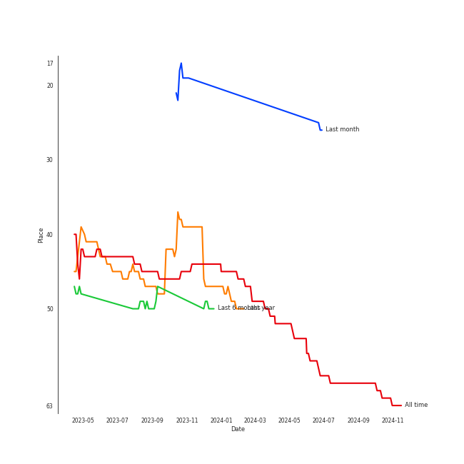
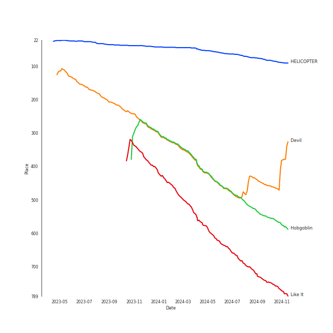
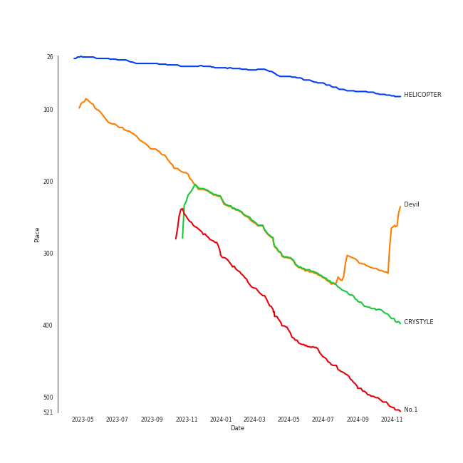
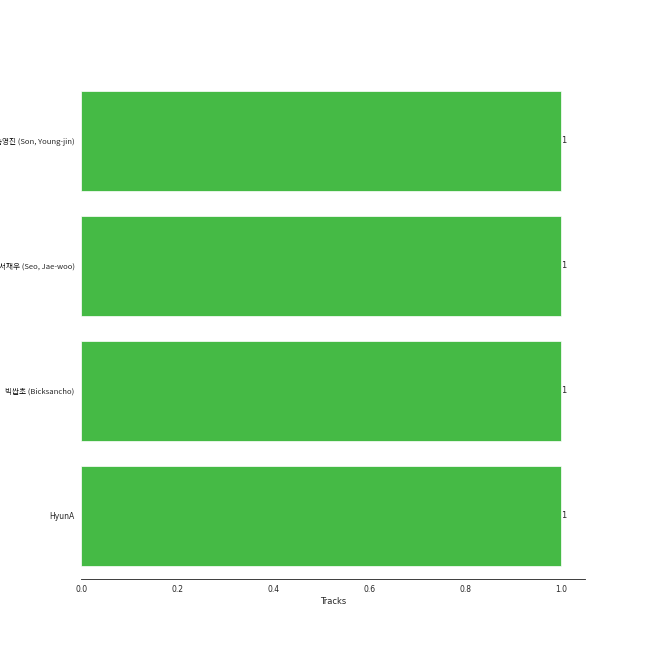

# CLC

## Relationships

CLC:
- has member 장승연 (Chang, Seung-yeon)
- has member 최유진 (Choi, Yu-jin)
- has member ELKIE
- has member 권은빈 (Kwon, Eun-bin)
- has member 오승희 (Oh, Seung-hee)
- has member Sorn
- has member Yeeun

## Artist Rank
- The #60 artist of all time

## Top Tracks

### Top tracks of all time

Top tracks of the last year over time

## Top Albums

| Art | Rank | Tracks | 💚 | Album | Release Date | 🔗 |
|:---|---:|---:|---:|:---|:---|:---|
|  | 488 | 2 | 1 | No.1 | 2019-01-30 | [🔗](https://open.spotify.com/album/6xSUUpa9LBZYwJFMJOr8M6) |
|  | 75 | 2 | 1 | HELICOPTER | 2020-09-02 | [🔗](https://open.spotify.com/album/1uwfxRAhW1hxclCVkzku8d) |
|  | 315 | 1 | 1 | Devil | 2019-09-06 | [🔗](https://open.spotify.com/album/1HpLXN8RRy1lHO3jckCTkN) |
|  | 369 | 1 | 1 | CRYSTYLE | 2017-01-17 | [🔗](https://open.spotify.com/album/74VP5VvY2CISEqfEkH9Wuc) |
|  | 631 | 1 | 1 | BLACK DRESS | 2018-02-22 | [🔗](https://open.spotify.com/album/3I3c4rkP6v5LtjMrgbD6d0) |
|  | 631 | 1 | 0 | First Love | 2015-03-19 | [🔗](https://open.spotify.com/album/1s0NkdUXMRPJvgWV1kEEbP) |

## Featured on Playlists
| Art | Tracks | Playlist |
|:---|---:|:---|
|  | 7 | [K-Pop](../../playlists/k-pop/overview.md) |
|  | 2 | [K-Pop Favorites](../../playlists/k-pop_favorites/overview.md) |
|  | 2 | [Workout](../../playlists/workout/overview.md) |
|  | 2 | [Halloween](../../playlists/halloween/overview.md) |
|  | 1 | [Cursed English](../../playlists/cursed_english/overview.md) |
|  | 1 | [Your Top Songs 2022](../../playlists/your_top_songs_2022/overview.md) |

## Top Record Labels

| Tracks | 💚 | Label |
|---:|---:|:---|
| 5 | 3 | [CUBE ENTERTAINMENT](../../labels/cube_entertainment/overview.md) |
| 3 | 2 | [Universal Music LLC](../../labels/universal_music_llc/overview.md) |

## Genres

- [k-pop](../../genres/k-pop/overview.md)
- [k-pop girl group](../../genres/k-pop_girl_group/overview.md)
- korean city pop

## Top Producers

| Art | Producer | Tracks | Credit Types |
|:---|:---|---:|:---|
| | 빅싼초 (Bicksancho) | 1 | Arranger, Lyricist, Songwriter |
|  | HyunA | 1 | Lyricist |
| | 서재우 (Seo, Jae-woo) | 1 | Arranger, Lyricist, Songwriter |
| | 손영진 (Son, Young-jin) | 1 | Arranger, Lyricist, Songwriter |

## Tracks

| Art | Track | Album | Artists | Label | Rank | 💚 | 🔗 |
|:---|:---|:---|:---|:---|---:|:---|:---|
|  | HELICOPTER | HELICOPTER | [CLC](overview.md) | [Universal Music LLC](../../labels/universal_music_llc) | 75 | 💚 | [🔗](https://open.spotify.com/track/2hJS7BdEaH9Jo8MeJujsHT) |
|  | Devil | Devil | [CLC](overview.md) | [Universal Music LLC](../../labels/universal_music_llc) | 446 | 💚 | [🔗](https://open.spotify.com/track/3aG0gbuvZ1VeVm68d4J6Yq) |
|  | Hobgoblin | CRYSTYLE | [CLC](overview.md) | [CUBE ENTERTAINMENT](../../labels/cube_entertainment) | 539 | 💚 | [🔗](https://open.spotify.com/track/2pSOUHBQXkN3fS2TAJHhfR) |
|  | Like It | No.1 | [CLC](overview.md) | [CUBE ENTERTAINMENT](../../labels/cube_entertainment) | 731 | 💚 | [🔗](https://open.spotify.com/track/6ioP0snRYjhfWKNMMLKOde) |
|  | Pepe | First Love | [CLC](overview.md) | [CUBE ENTERTAINMENT](../../labels/cube_entertainment) | 954 | | [🔗](https://open.spotify.com/track/2rO1OMbLrfKIkqrqcATv3u) |
|  | BLACK DRESS | BLACK DRESS | [CLC](overview.md) | [CUBE ENTERTAINMENT](../../labels/cube_entertainment) | 954 | 💚 | [🔗](https://open.spotify.com/track/4g73tmQQc6pSfe4NMXKrZD) |
|  | No | No.1 | [CLC](overview.md) | [CUBE ENTERTAINMENT](../../labels/cube_entertainment) | 954 | | [🔗](https://open.spotify.com/track/3sygLAUhHsJsQ0cBk6fxRd) |
|  | HELICOPTER - English Version | HELICOPTER | [CLC](overview.md) | [Universal Music LLC](../../labels/universal_music_llc) | 954 | | [🔗](https://open.spotify.com/track/3yHAVLtQy5ppBbuTUUhrlu) |
