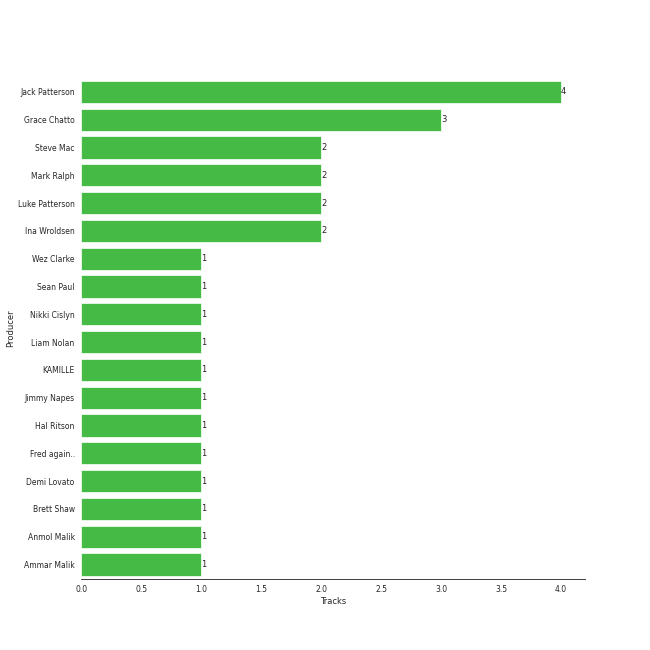

# Clean Bandit

## Relationships

Clean Bandit:
- has member Neil Amin-Smith
- has member Stephanie Benedetti
- has member Grace Chatto
- has member Jack Patterson
- has member Luke Patterson

## Artist Rank

## Featured on Playlists
| Art | Tracks | Playlist |
|:---|---:|:---|
|  | 5 | [Pop](../../playlists/pop/overview.md) |
|  | 5 | [Alt-Pop](../../playlists/alt-pop/overview.md) |
|  | 1 | [Summer](../../playlists/summer/overview.md) |

## Top Albums

| Art | Tracks | 💚 | Album | Release Date | 🔗 |
|:---|---:|---:|:---|:---|:---|
|  | 2 | 2 | What Is Love? (Deluxe Edition) | 2018-11-30 | [🔗](https://open.spotify.com/album/1MvF4ulZKH7SaDQs9rE5nc) |
|  | 1 | 1 | Tick Tock (feat. 24kGoldn) | 2020-08-21 | [🔗](https://open.spotify.com/album/3tuAs968COA2vxKjiLvmxr) |
|  | 1 | 1 | Solo (feat. Demi Lovato) | 2018-05-17 | [🔗](https://open.spotify.com/album/1q7a5wZeti0neU2jDn8Dz3) |
|  | 1 | 1 | New Eyes | 2014-06-02 | [🔗](https://open.spotify.com/album/4a6DxkhmMvvEdPXxm4ergN) |

## Top Record Labels

| Tracks | 💚 | Label |
|---:|---:|:---|
| 4 | 4 | Atlantic Records UK |
| 1 | 1 | Big Beat Records |
| 1 | 1 | [Atlantic Records](../../labels/atlantic_records/overview.md) |

## Genres

- [pop](../../genres/pop/overview.md)
- uk dance
- uk funky

## Credits

### Credits by Type

| Credit Type | Tracks |
|:---|---:|
| Performer | 2 |

### Member Credits

| | Grace Chatto | Jack Patterson | Luke Patterson | Neil Amin-Smith | Stephanie Benedetti |
|:---|---:|---:|---:|---:|---:|
| Instrument | 3 | 3 | 3 | 1 | 1 |
| Producer | 2 | 3 | 2 | 0 | 0 |
| Songwriter | 3 | 6 | 0 | 0 | 0 |
| Vocal | 1 | 0 | 0 | 0 | 0 |
### Production Credits

| Art | Track | Members | Credit Types |
|:---|:---|:---|:---|
|  | Rather Be (feat. Jess Glynne) | Jack Patterson, Grace Chatto | Producer, Songwriter |
|  | Rather Be (Clean Bandit Cover) | Jack Patterson, Grace Chatto | Songwriter |
|  | Solo (feat. Demi Lovato) | Jack Patterson, Grace Chatto | Songwriter |
|  | Rockabye (feat. Sean Paul & Anne-Marie) | Luke Patterson, Jack Patterson | Producer, Songwriter |
|  | Symphony (feat. Zara Larsson) | Luke Patterson, Jack Patterson, Grace Chatto | Producer, Songwriter |
|  | Señorita | Jack Patterson | Songwriter |

## Top Producers

| Art | Producer | Tracks | Credit Types |
|:---|:---|---:|:---|
| | Jack Patterson | 4 | Producer, Songwriter |
| | Grace Chatto | 3 | Producer, Songwriter |
| | Ina Wroldsen | 2 | Songwriter |
| | Mark Ralph | 2 | Producer |
| | Steve Mac | 2 | Songwriter, Producer |
| | Luke Patterson | 2 | Producer |
| | Liam Nolan | 1 | Producer |
| | Anmol Malik | 1 | Songwriter |
| | Hal Ritson | 1 | Producer |
| | KAMILLE | 1 | Songwriter |

View all

| Art | Producer | Tracks | Credit Types |
|:---|:---|---:|:---|
|  | Sean Paul | 1 | Songwriter |
| | Jimmy Napes | 1 | Songwriter |
| | Fred again.. | 1 | Songwriter |
| | Nikki Cislyn | 1 | Songwriter |
| | Wez Clarke | 1 | Producer |
| | Ammar Malik | 1 | Songwriter |
| | Brett Shaw | 1 | Producer |
|  | Demi Lovato | 1 | Songwriter |

## Tracks

| Art | Track | Album | Artists | Label | 💚 | 🔗 |
|:---|:---|:---|:---|:---|:---|:---|
|  | Rather Be (feat. Jess Glynne) | New Eyes | [Clean Bandit](overview.md), Jess Glynne | [Big Beat Records/Atlantic](../../labels/atlantic_records) | 💚 | [🔗](https://open.spotify.com/track/0am001WwFBVGDGLwRh3ixi) |
|  | Solo (feat. Demi Lovato) | Solo (feat. Demi Lovato) | [Clean Bandit](overview.md), Demi Lovato | Atlantic Records UK | 💚 | [🔗](https://open.spotify.com/track/6kPJZM97LwdG9QIsT7khp6) |
|  | Rockabye (feat. Sean Paul & Anne-Marie) | What Is Love? (Deluxe Edition) | [Clean Bandit](overview.md), Sean Paul, Anne-Marie | Atlantic Records UK | 💚 | [🔗](https://open.spotify.com/track/2hrUO4drrO63i7FYbCLBl2) |
|  | Symphony (feat. Zara Larsson) | What Is Love? (Deluxe Edition) | [Clean Bandit](overview.md), Zara Larsson | Atlantic Records UK | 💚 | [🔗](https://open.spotify.com/track/72gv4zhNvRVdQA0eOenCal) |
|  | Tick Tock (feat. 24kGoldn) | Tick Tock (feat. 24kGoldn) | [Clean Bandit](overview.md), Mabel, 24kGoldn | Atlantic Records UK | 💚 | [🔗](https://open.spotify.com/track/27u7t9d7ZQoyjsCROHuZJ3) |
