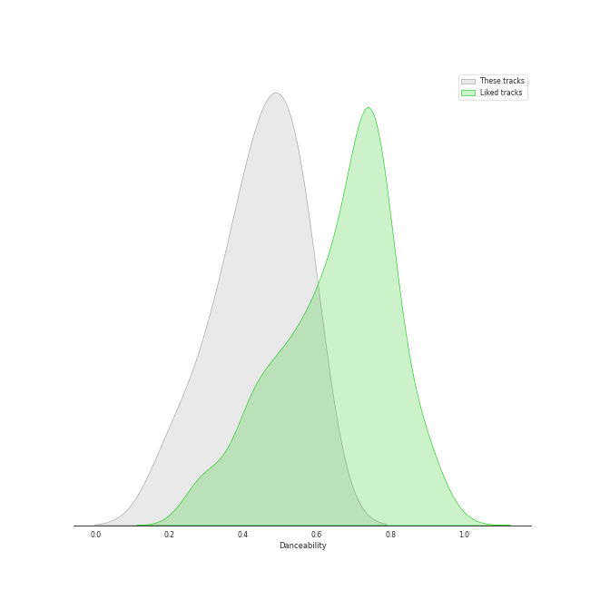
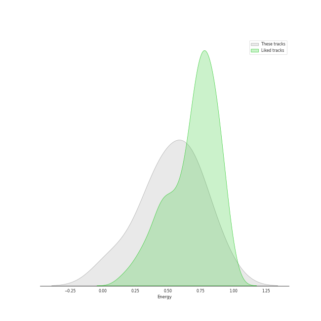
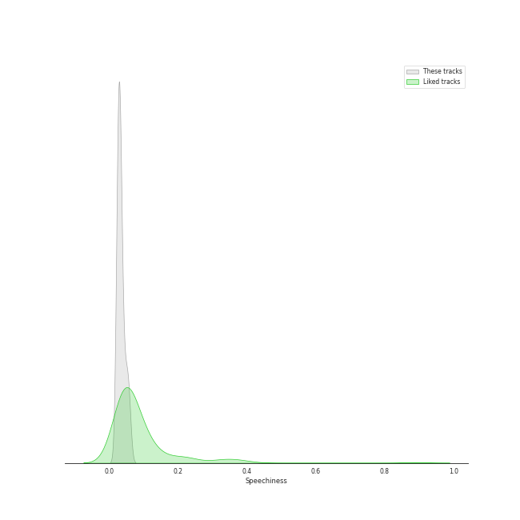
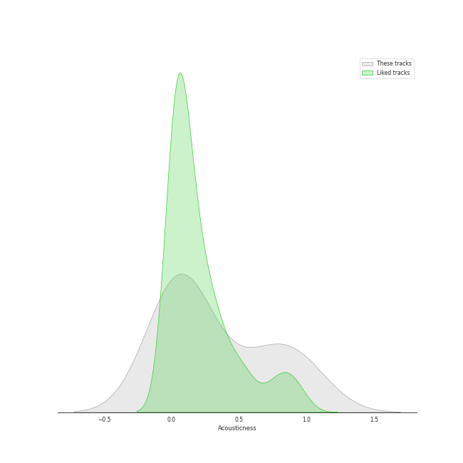
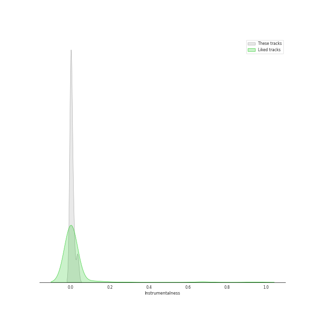
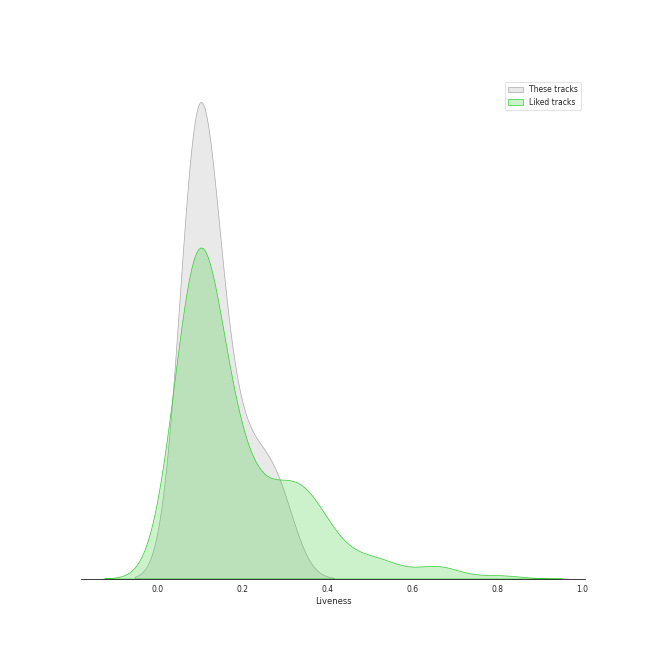
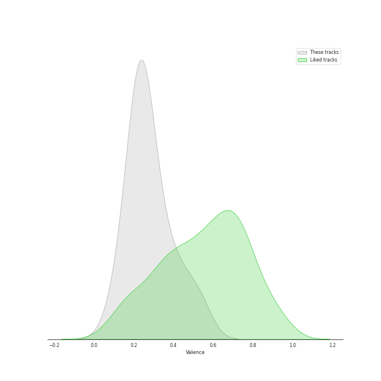
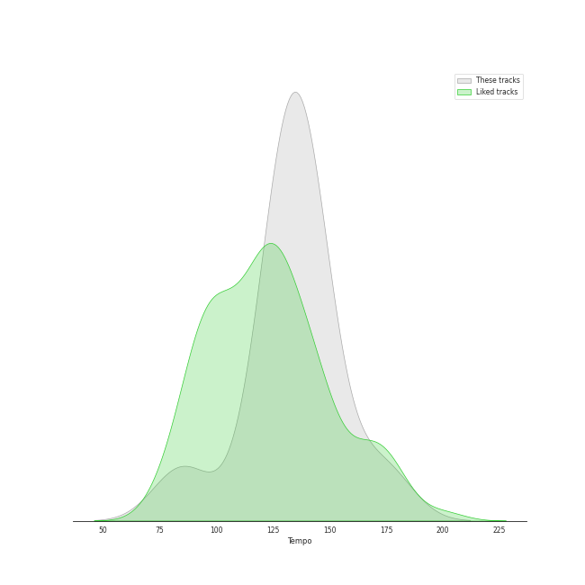

# Track Features for Coldplay

## Danceability

| ​ | 10 most Danceable tracks | ​​ | 10 least Danceable tracks |
|:---|:---|:---|:---|
|  | Clocks (0.577) |  | Fix You (0.209) |
|  | The Scientist (0.557) |  | Christmas Lights (0.315) |
|  | BrokEn (0.55) |  | ❤️ (0.348) |
|  | Speed of Sound (0.514) |  | Princess of China (0.42) |
|  | Viva La Vida (0.486) |  | Yellow (0.429) |
|  | Paradise (0.449) |  | Paradise (0.449) |
|  | Yellow (0.429) |  | Viva La Vida (0.486) |
|  | Princess of China (0.42) |  | Speed of Sound (0.514) |
|  | ❤️ (0.348) |  | BrokEn (0.55) |
|  | Christmas Lights (0.315) |  | The Scientist (0.557) |

## Energy

| ​ | 10 most Energetic tracks | ​​ | 10 least Energetic tracks |
|:---|:---|:---|:---|
|  | Speed of Sound (0.898) |  | ❤️ (0.0491) |
|  | Clocks (0.749) |  | BrokEn (0.271) |
|  | Princess of China (0.69) |  | Fix You (0.417) |
|  | Yellow (0.661) |  | Christmas Lights (0.418) |
|  | Viva La Vida (0.617) |  | The Scientist (0.442) |
|  | Paradise (0.585) |  | Paradise (0.585) |
|  | The Scientist (0.442) |  | Viva La Vida (0.617) |
|  | Christmas Lights (0.418) |  | Yellow (0.661) |
|  | Fix You (0.417) |  | Princess of China (0.69) |
|  | BrokEn (0.271) |  | Clocks (0.749) |

## Speechiness

| ​ | 10 most Speechy tracks | ​​ | 10 least Speechy tracks |
|:---|:---|:---|:---|
|  | Speed of Sound (0.0577) |  | The Scientist (0.0243) |
|  | BrokEn (0.0495) |  | Paradise (0.0268) |
|  | ❤️ (0.0404) |  | Clocks (0.0279) |
|  | Princess of China (0.0347) |  | Yellow (0.0281) |
|  | Fix You (0.0338) |  | Viva La Vida (0.0287) |
|  | Christmas Lights (0.0299) |  | Christmas Lights (0.0299) |
|  | Viva La Vida (0.0287) |  | Fix You (0.0338) |
|  | Yellow (0.0281) |  | Princess of China (0.0347) |
|  | Clocks (0.0279) |  | ❤️ (0.0404) |
|  | Paradise (0.0268) |  | BrokEn (0.0495) |

## Acousticness

| ​ | 10 most Acoustic tracks | ​​ | 10 least Acoustic tracks |
|:---|:---|:---|:---|
|  | ❤️ (0.97) |  | Yellow (0.00239) |
|  | BrokEn (0.923) |  | Princess of China (0.00385) |
|  | The Scientist (0.731) |  | Speed of Sound (0.00488) |
|  | Clocks (0.599) |  | Paradise (0.0509) |
|  | Fix You (0.164) |  | Viva La Vida (0.0954) |
|  | Christmas Lights (0.131) |  | Christmas Lights (0.131) |
|  | Viva La Vida (0.0954) |  | Fix You (0.164) |
|  | Paradise (0.0509) |  | Clocks (0.599) |
|  | Speed of Sound (0.00488) |  | The Scientist (0.731) |
|  | Princess of China (0.00385) |  | BrokEn (0.923) |

## Instrumentalness

| ​ | 10 most Instrumental tracks | ​​ | 10 least Instrumental tracks |
|:---|:---|:---|:---|
|  | Speed of Sound (0.0345) |  | BrokEn (0.0) |
|  | Princess of China (0.015) |  | Viva La Vida (3.23e-06) |
|  | Clocks (0.0115) |  | The Scientist (1.46e-05) |
|  | Fix You (0.00196) |  | Paradise (8.75e-05) |
|  | Christmas Lights (0.000679) |  | Yellow (0.000121) |
|  | ❤️ (0.000186) |  | ❤️ (0.000186) |
|  | Yellow (0.000121) |  | Christmas Lights (0.000679) |
|  | Paradise (8.75e-05) |  | Fix You (0.00196) |
|  | The Scientist (1.46e-05) |  | Clocks (0.0115) |
|  | Viva La Vida (3.23e-06) |  | Princess of China (0.015) |

## Liveness

| ​ | 10 most Live tracks | ​​ | 10 least Live tracks |
|:---|:---|:---|:---|
|  | Princess of China (0.287) |  | Speed of Sound (0.0746) |
|  | Yellow (0.234) |  | Paradise (0.0833) |
|  | Clocks (0.183) |  | Christmas Lights (0.0836) |
|  | BrokEn (0.147) |  | ❤️ (0.0918) |
|  | Fix You (0.113) |  | Viva La Vida (0.109) |
|  | The Scientist (0.11) |  | The Scientist (0.11) |
|  | Viva La Vida (0.109) |  | Fix You (0.113) |
|  | ❤️ (0.0918) |  | BrokEn (0.147) |
|  | Christmas Lights (0.0836) |  | Clocks (0.183) |
|  | Paradise (0.0833) |  | Yellow (0.234) |

## Valence

| ​ | 10 most Happy tracks | ​​ | 10 least Happy tracks |
|:---|:---|:---|:---|
|  | BrokEn (0.521) |  | Fix You (0.124) |
|  | Viva La Vida (0.417) |  | Paradise (0.212) |
|  | Speed of Sound (0.353) |  | The Scientist (0.213) |
|  | Yellow (0.285) |  | ❤️ (0.232) |
|  | Clocks (0.255) |  | Princess of China (0.237) |
|  | Christmas Lights (0.237) |  | Christmas Lights (0.237) |
|  | Princess of China (0.237) |  | Clocks (0.255) |
|  | ❤️ (0.232) |  | Yellow (0.285) |
|  | The Scientist (0.213) |  | Speed of Sound (0.353) |
|  | Paradise (0.212) |  | Viva La Vida (0.417) |

## Tempo

| ​ | 10 most Fast tracks | ​​ | 10 least Fast tracks |
|:---|:---|:---|:---|
|  | Yellow (173.372) |  | Princess of China (85.014) |
|  | The Scientist (146.277) |  | Speed of Sound (123.067) |
|  | Paradise (139.631) |  | Christmas Lights (129.116) |
|  | Fix You (138.178) |  | BrokEn (130.151) |
|  | Viva La Vida (138.015) |  | Clocks (130.97) |
|  | ❤️ (136.68) |  | ❤️ (136.68) |
|  | Clocks (130.97) |  | Viva La Vida (138.015) |
|  | BrokEn (130.151) |  | Fix You (138.178) |
|  | Christmas Lights (129.116) |  | Paradise (139.631) |
|  | Speed of Sound (123.067) |  | The Scientist (146.277) |
