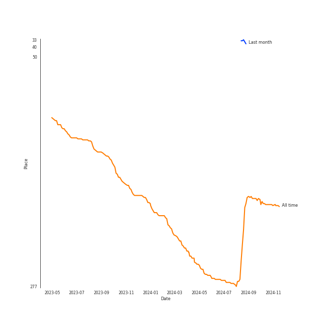

# Coldplay

[See Track Features](audio_features.md)

[See Clusters](clusters/overview.md)

## Relationships

Coldplay:
- has member Guy Berryman
- has member Jonny Buckland
- has member Will Champion
- has member Chris Martin

## Artist Rank
- The #237 artist overall

## Featured on Playlists
| Art | Tracks | Playlist |
|:---|---:|:---|
|  | 9 | [Modern Rock](../../playlists/modern_rock/overview.md) |
|  | 5 | [Pop](../../playlists/pop/overview.md) |
|  | 3 | [Chill](../../playlists/chill/overview.md) |
|  | 2 | [Karaoke](../../playlists/karaoke/overview.md) |
|  | 2 | [A-Pop Favorites](../../playlists/a-pop_favorites/overview.md) |
|  | 1 | [Alt-Pop](../../playlists/alt-pop/overview.md) |
|  | 1 | [Christmas](../../playlists/christmas/overview.md) |
|  | 1 | [Tarps](../../playlists/tarps/overview.md) |

## Top Albums

| Art | Tracks | 💚 | Album | Release Date | 🔗 |
|:---|---:|---:|:---|:---|:---|
|  | 2 | 2 | A Rush of Blood to the Head | 2002-08-08 | [🔗](https://open.spotify.com/album/0RHX9XECH8IVI3LNgWDpmQ) |
|  | 2 | 1 | X&Y | 2005-06-07 | [🔗](https://open.spotify.com/album/4E7bV0pzG0LciBSWTszra6) |
|  | 2 | 0 | Mylo Xyloto | 2011-10-24 | [🔗](https://open.spotify.com/album/2R7iJz5uaHjLEVnMkloO18) |
|  | 1 | 1 | Viva La Vida or Death and All His Friends | 2008-05-26 | [🔗](https://open.spotify.com/album/1CEODgTmTwLyabvwd7HBty) |
|  | 1 | 1 | Parachutes | 2000-07-10 | [🔗](https://open.spotify.com/album/6ZG5lRT77aJ3btmArcykra) |
|  | 1 | 0 | Music Of The Spheres | 2021-10-15 | [🔗](https://open.spotify.com/album/06mXfvDsRZNfnsGZvX2zpb) |
|  | 1 | 0 | Everyday Life | 2019-11-22 | [🔗](https://open.spotify.com/album/2FeyIYDDAQqcOJKOKhvHdr) |
|  | 1 | 0 | Christmas Lights | 2010-12-01 | [🔗](https://open.spotify.com/album/06CvxUVwS8h2aJYcCtApgy) |

## Top Record Labels

| Tracks | 💚 | Label |
|---:|---:|:---|
| 4 | 3 | Parlophone Records Limited |
| 7 | 2 | [Parlophone UK](../../labels/parlophone_uk/overview.md) |

## Genres

- [permanent wave](../../genres/permanent_wave/overview.md)
- [pop](../../genres/pop/overview.md)

## Credits

### Credits by Type

| Credit Type | Tracks |
|:---|---:|
| Producer | 4 |

### Member Credits

| | Chris Martin | Guy Berryman | Jonny Buckland | Will Champion |
|:---|---:|---:|---:|---:|
| Instrument | 2 | 2 | 2 | 2 |
| Songwriter | 5 | 5 | 5 | 5 |
| Vocal | 2 | 1 | 2 | 2 |
### Production Credits

| Art | Track | Members | Credit Types |
|:---|:---|:---|:---|
|  | Yellow | [Coldplay](.), Guy Berryman, Will Champion, Chris Martin, Jonny Buckland | Producer, Songwriter |
|  | Clocks | [Coldplay](.), Guy Berryman, Will Champion, Chris Martin, Jonny Buckland | Producer, Songwriter |
|  | The Scientist | [Coldplay](.), Guy Berryman, Will Champion, Chris Martin, Jonny Buckland | Producer, Songwriter |
|  | Fix You | [Coldplay](.), Guy Berryman, Will Champion, Chris Martin, Jonny Buckland | Producer, Songwriter |
|  | Viva La Vida | Guy Berryman, Will Champion, Chris Martin, Jonny Buckland | Songwriter |

## Top Producers

| Art | Producer | Tracks | Credit Types |
|:---|:---|---:|:---|
| | Guy Berryman | 5 | Songwriter |
| | Jonny Buckland | 5 | Songwriter |
| | Will Champion | 5 | Songwriter |
|  | Chris Martin | 5 | Songwriter |
|  | [Coldplay](overview.md) | 4 | Producer |
| | Ken Nelson | 4 | Producer |
| | Rik Simpson | 3 | Producer |
| | Michael Brauer | 3 | Producer |
| | Mark Phythian | 2 | Producer |
| | Andy Wallace | 1 | Producer |

View all

| Art | Producer | Tracks | Credit Types |
|:---|:---|---:|:---|
| | Audrey Riley | 1 | Arranger |
| | Markus Dravs | 1 | Producer |
| | Jon Coles | 1 | Producer |
| | Jon Hopkins | 1 | Producer |
| | Paul Read | 1 | Producer |
| | Andrea Wright | 1 | Producer |
| | Simon "Barny" Barnicott | 1 | Producer |
| | Brian Eno | 1 | Producer |

## Tracks

| Art | Track | Album | Artists | Label | Rank | 💚 | 🔗 |
|:---|:---|:---|:---|:---|---:|:---|:---|
|  | Yellow | Parachutes | [Coldplay](overview.md) | [Parlophone UK](../../labels/parlophone_uk) | 840 | 💚 | [🔗](https://open.spotify.com/track/3AJwUDP919kvQ9QcozQPxg) |
|  | Clocks | A Rush of Blood to the Head | [Coldplay](overview.md) | Parlophone Records Limited | 840 | 💚 | [🔗](https://open.spotify.com/track/0BCPKOYdS2jbQ8iyB56Zns) |
|  | The Scientist | A Rush of Blood to the Head | [Coldplay](overview.md) | Parlophone Records Limited | 840 | 💚 | [🔗](https://open.spotify.com/track/75JFxkI2RXiU7L9VXzMkle) |
|  | Fix You | X&Y | [Coldplay](overview.md) | Parlophone Records Limited | 840 | 💚 | [🔗](https://open.spotify.com/track/7LVHVU3tWfcxj5aiPFEW4Q) |
|  | Speed of Sound | X&Y | [Coldplay](overview.md) | Parlophone Records Limited | 840 | | [🔗](https://open.spotify.com/track/7clUVcSOtkNWa58Gw5RfD4) |
|  | Viva La Vida | Viva La Vida or Death and All His Friends | [Coldplay](overview.md) | [Parlophone UK](../../labels/parlophone_uk) | 840 | 💚 | [🔗](https://open.spotify.com/track/1mea3bSkSGXuIRvnydlB5b) |
|  | Christmas Lights | Christmas Lights | [Coldplay](overview.md) | [Parlophone UK](../../labels/parlophone_uk) | 840 | | [🔗](https://open.spotify.com/track/4fzyvSu73BhGvi96p2zwjL) |
|  | Paradise | Mylo Xyloto | [Coldplay](overview.md) | [Parlophone UK](../../labels/parlophone_uk) | 840 | | [🔗](https://open.spotify.com/track/6nek1Nin9q48AVZcWs9e9D) |
|  | Princess of China | Mylo Xyloto | [Coldplay](overview.md), [Rihanna](../rihanna/overview.md) | [Parlophone UK](../../labels/parlophone_uk) | 840 | | [🔗](https://open.spotify.com/track/4HXOBjwv2RnLpGG4xWOO6N) |
|  | BrokEn | Everyday Life | [Coldplay](overview.md) | [Parlophone UK](../../labels/parlophone_uk) | 840 | | [🔗](https://open.spotify.com/track/1cXXhzPnbrXjNQYbLdUJdy) |

See all tracks

| Art | Track | Album | Artists | Label | Rank | 💚 | 🔗 |
|:---|:---|:---|:---|:---|---:|:---|:---|
|  | ❤️ | Music Of The Spheres | [Coldplay](overview.md), We Are KING, [Jacob Collier](../jacob_collier/overview.md) | [Parlophone UK](../../labels/parlophone_uk) | 840 | | [🔗](https://open.spotify.com/track/3oTYv0yShT4sjuPncoUXfK) |

