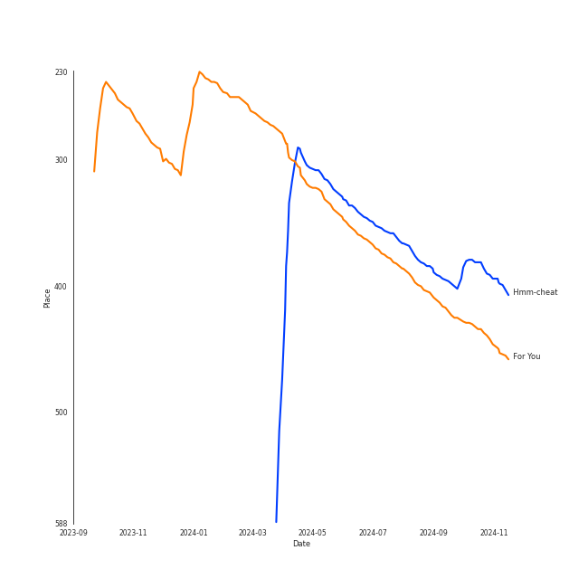

# Crush

## Artist Rank

## Top Tracks

- Hmm-cheat is the #13 track of the last month

### Top tracks, aggregated

## Featured on Playlists
| Art | Tracks | Playlist |
|:---|---:|:---|
|  | 4 | [K-R&B](../../playlists/k-r_b/overview.md) |
|  | 2 | [K-Pop](../../playlists/k-pop/overview.md) |
|  | 2 | [K-Pop Favorites](../../playlists/k-pop_favorites/overview.md) |
|  | 2 | [Chill](../../playlists/chill/overview.md) |
|  | 1 | [Sharon RPD](../../playlists/sharon_rpd/overview.md) |
|  | 1 | [Relax](../../playlists/relax/overview.md) |

## Top Albums

| Art | Tracks | 💚 | Album | Release Date | 🔗 |
|:---|---:|---:|:---|:---|:---|
|  | 1 | 1 | wonderego | 2023-11-14 | [🔗](https://open.spotify.com/album/7ikvq6MB2VhB2IPCDO6RnP) |
|  | 1 | 1 | Sun And Moon | 2018-11-22 | [🔗](https://open.spotify.com/album/0AsQlY5YENtlvd8SLnrSxX) |
|  | 1 | 1 | Rush Hour | 2022-09-22 | [🔗](https://open.spotify.com/album/7egcy2gtlyoUUl1OlQrY3R) |
|  | 1 | 1 | Love Story | 2017-11-10 | [🔗](https://open.spotify.com/album/0H9qbHCWJRmKAhERqM5X9G) |
|  | 1 | 1 | For You | 2020-12-16 | [🔗](https://open.spotify.com/album/6hiwkmlOoNm8F3UkAZJcEz) |
|  | 1 | 0 | Street Woman Fighter2 (SWF2) Class Mission | 2023-09-05 | [🔗](https://open.spotify.com/album/3fifgTm6PcVhHE9v72nlCb) |
|  | 1 | 0 | PSY 9th | 2022-04-29 | [🔗](https://open.spotify.com/album/0v4swbfO7N9WyJkUo465C4) |

## Top Record Labels

| Tracks | 💚 | Label |
|---:|---:|:---|
| 2 | 1 | P NATION |
| 1 | 1 | 피네이션 |
| 1 | 1 | Million Market |
| 1 | 1 | Antenna |
| 1 | 1 | AOMG |
| 1 | 0 | [Genie Music Corporation](../../labels/genie_music_corporation/overview.md) |

## Genres

- [k-pop](../../genres/k-pop/overview.md)
- [korean r&b](../../genres/korean_r_b/overview.md)

## Tracks

| Art | Track | Album | Artists | Label | Rank | 💚 | 🔗 |
|:---|:---|:---|:---|:---|---:|:---|:---|
|  | For You | For You | [LeeHi](../leehi/overview.md), [Crush](overview.md) | AOMG | 290 | 💚 | [🔗](https://open.spotify.com/track/0JL7DoEqAUcOntWmBuOSdh) |
|  | Hmm-cheat | wonderego | [Crush](overview.md) | P NATION | 386 | 💚 | [🔗](https://open.spotify.com/track/7hYGWflgiI2aa25jOgL6eg) |
|  | Love Story (Feat. CRUSH) | Love Story | SURAN, [Crush](overview.md) | Million Market,Inc | nan | 💚 | [🔗](https://open.spotify.com/track/5rUZeNNC4R65U6UeElMoss) |
|  | Make Up (Feat. Crush) | Sun And Moon | Sam Kim, [Crush](overview.md) | Antenna | nan | 💚 | [🔗](https://open.spotify.com/track/19zsSUEuJNzNA6eqInqyF9) |
|  | Happier (feat. Crush) | PSY 9th | PSY, [Crush](overview.md) | P NATION | nan | | [🔗](https://open.spotify.com/track/6idH1Qz9jcXzKcZeNIa9uU) |
|  | Rush Hour (Feat. j-hope of BTS) | Rush Hour | [Crush](overview.md), [j-hope](../j-hope/overview.md) | 피네이션 | nan | 💚 | [🔗](https://open.spotify.com/track/5aucVLKiumD89mxVCB4zvS) |
|  | Click Like (Prod. Crush) (Feat. Paul Blanco) | Street Woman Fighter2 (SWF2) Class Mission | [Crush](overview.md), Paul Blanco | [Genie Music Corporation](../../labels/genie_music_corporation) | nan | | [🔗](https://open.spotify.com/track/3uzUBVCNTdVnmJMumFA4Ce) |
