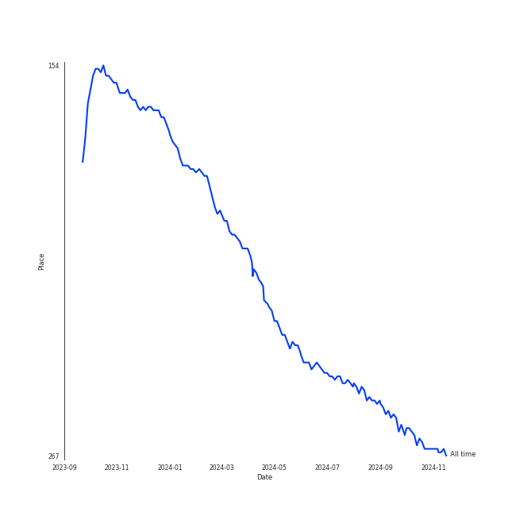
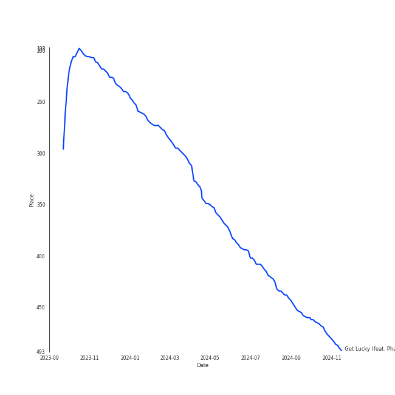
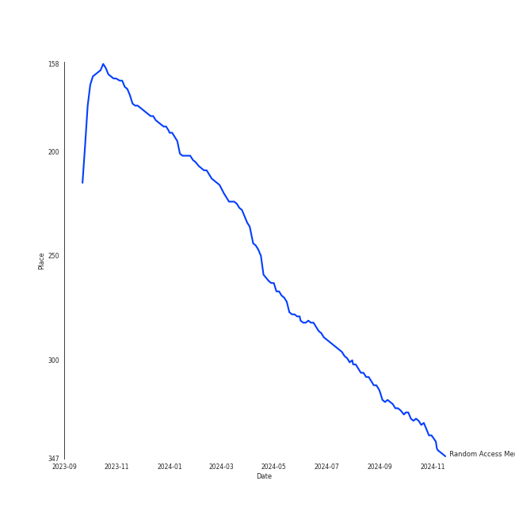

# Daft Punk

## Relationships

Daft Punk:
- has member Thomas Bangalter
- has member Guy-Manuel de Homem-Christo

## Artist Rank
- The #261 artist of all time

## Top Tracks

### Top tracks of all time

## Top Albums

| Art | Rank | Tracks | 💚 | Album | Release Date | 🔗 |
|:---|---:|---:|---:|:---|:---|:---|
|  | 642 | 3 | 2 | Discovery | 2001-03-12 | [🔗](https://open.spotify.com/album/2noRn2Aes5aoNVsU6iWThc) |
|  | 325 | 2 | 2 | Random Access Memories | 2013-05-20 | [🔗](https://open.spotify.com/album/4m2880jivSbbyEGAKfITCa) |
|  | 642 | 1 | 1 | Human After All | 2005-03-14 | [🔗](https://open.spotify.com/album/1A2GTWGtFfWp7KSQTwWOyo) |
|  | 642 | 1 | 0 | Starboy | 2016-11-25 | [🔗](https://open.spotify.com/album/2ODvWsOgouMbaA5xf0RkJe) |

## Featured on Playlists
| Art | Tracks | Playlist |
|:---|---:|:---|
|  | 7 | [Electronic](../../playlists/electronic/overview.md) |
|  | 3 | [Summer](../../playlists/summer/overview.md) |
|  | 3 | [Pop](../../playlists/pop/overview.md) |
|  | 2 | [A-Pop Favorites](../../playlists/a-pop_favorites/overview.md) |

## Top Record Labels

| Tracks | 💚 | Label |
|---:|---:|:---|
| 4 | 3 | Daft Life Ltd. |
| 4 | 3 | ADA France |
| 2 | 2 | [Columbia](../../labels/columbia/overview.md) |
| 1 | 0 | Universal Republic Records |

## Genres

- electro
- filter house
- [rock](../../genres/rock/overview.md)

## Credits

### Credits by Type

| Credit Type | Tracks |
|:---|---:|
| Instrument | 2 |
| Producer | 1 |
| Vocal | 4 |

### Member Credits

| | Guy-Manuel de Homem-Christo | Thomas Bangalter |
|:---|---:|---:|
| Producer | 5 | 5 |
| Songwriter | 5 | 5 |
### Production Credits

| Art | Track | Members | Credit Types |
|:---|:---|:---|:---|
|  | Digital Love | Thomas Bangalter, Guy-Manuel de Homem-Christo | Producer, Songwriter |
|  | Harder, Better, Faster, Stronger | [Daft Punk](.), Thomas Bangalter, Guy-Manuel de Homem-Christo | Producer, Songwriter |
|  | Technologic | Thomas Bangalter, Guy-Manuel de Homem-Christo | Producer, Songwriter |
|  | Instant Crush (feat. Julian Casablancas) | Thomas Bangalter, Guy-Manuel de Homem-Christo | Producer, Songwriter |
|  | Get Lucky (feat. Pharrell Williams and Nile Rodgers) | Thomas Bangalter, Guy-Manuel de Homem-Christo | Producer, Songwriter |

## Top Producers

| Art | Producer | Tracks | Credit Types |
|:---|:---|---:|:---|
| | Thomas Bangalter | 5 | Producer, Songwriter |
| | Guy-Manuel de Homem-Christo | 5 | Producer, Songwriter |
|  | [Daft Punk](overview.md) | 1 | Producer |
|  | Pharrell Williams | 1 | Songwriter |
| | Edwin Birdsong | 1 | Songwriter |
|  | Julian Casablancas | 1 | Producer, Songwriter |
|  | Nile Rodgers | 1 | Songwriter |
| | Carlos Sosa | 1 | Songwriter |
| | George Duke | 1 | Songwriter |

## Tracks

| Art | Track | Album | Artists | Label | Rank | 💚 | 🔗 |
|:---|:---|:---|:---|:---|---:|:---|:---|
|  | Get Lucky (feat. Pharrell Williams and Nile Rodgers) | Random Access Memories | [Daft Punk](overview.md), Pharrell Williams, Nile Rodgers | [Columbia](../../labels/columbia) | 461 | 💚 | [🔗](https://open.spotify.com/track/69kOkLUCkxIZYexIgSG8rq) |
|  | Digital Love | Discovery | [Daft Punk](overview.md) | Daft Life Ltd./ADA France | 971 | 💚 | [🔗](https://open.spotify.com/track/2VEZx7NWsZ1D0eJ4uv5Fym) |
|  | Harder, Better, Faster, Stronger | Discovery | [Daft Punk](overview.md) | Daft Life Ltd./ADA France | 971 | 💚 | [🔗](https://open.spotify.com/track/5W3cjX2J3tjhG8zb6u0qHn) |
|  | One More Time | Discovery | [Daft Punk](overview.md) | Daft Life Ltd./ADA France | 971 | | [🔗](https://open.spotify.com/track/0DiWol3AO6WpXZgp0goxAV) |
|  | Technologic | Human After All | [Daft Punk](overview.md) | Daft Life Ltd./ADA France | 971 | 💚 | [🔗](https://open.spotify.com/track/0LSLM0zuWRkEYemF7JcfEE) |
|  | Instant Crush (feat. Julian Casablancas) | Random Access Memories | [Daft Punk](overview.md), Julian Casablancas | [Columbia](../../labels/columbia) | 971 | 💚 | [🔗](https://open.spotify.com/track/2cGxRwrMyEAp8dEbuZaVv6) |
|  | I Feel It Coming | Starboy | The Weeknd, [Daft Punk](overview.md) | Universal Republic Records | 971 | | [🔗](https://open.spotify.com/track/3dhjNA0jGA8vHBQ1VdD6vV) |
