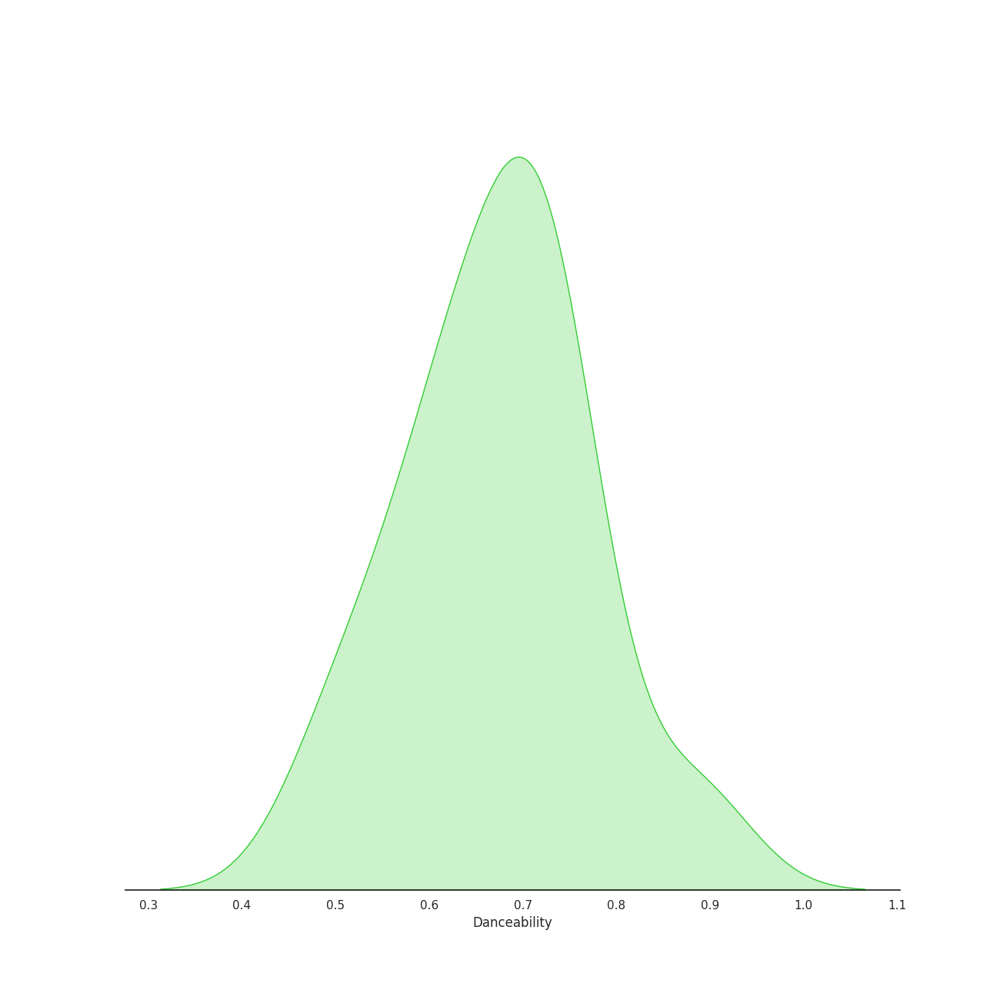
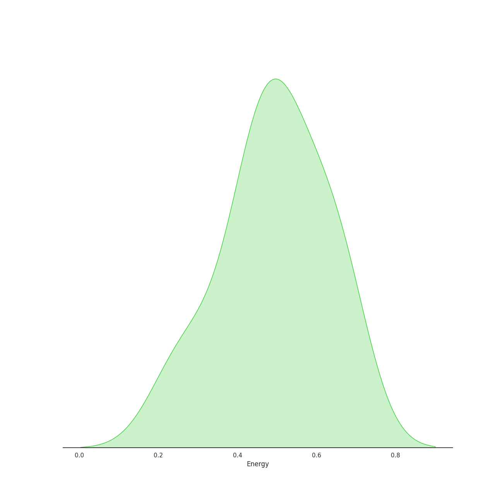
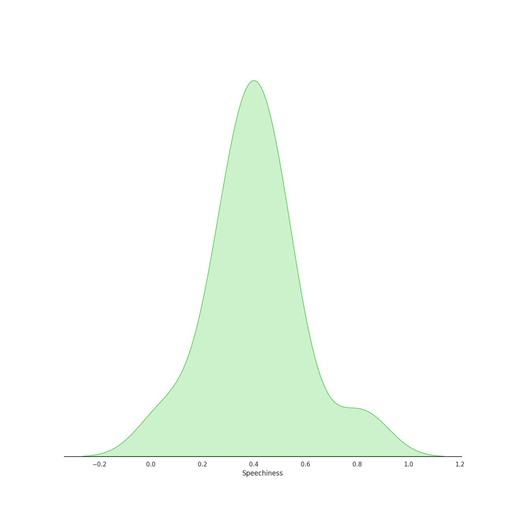
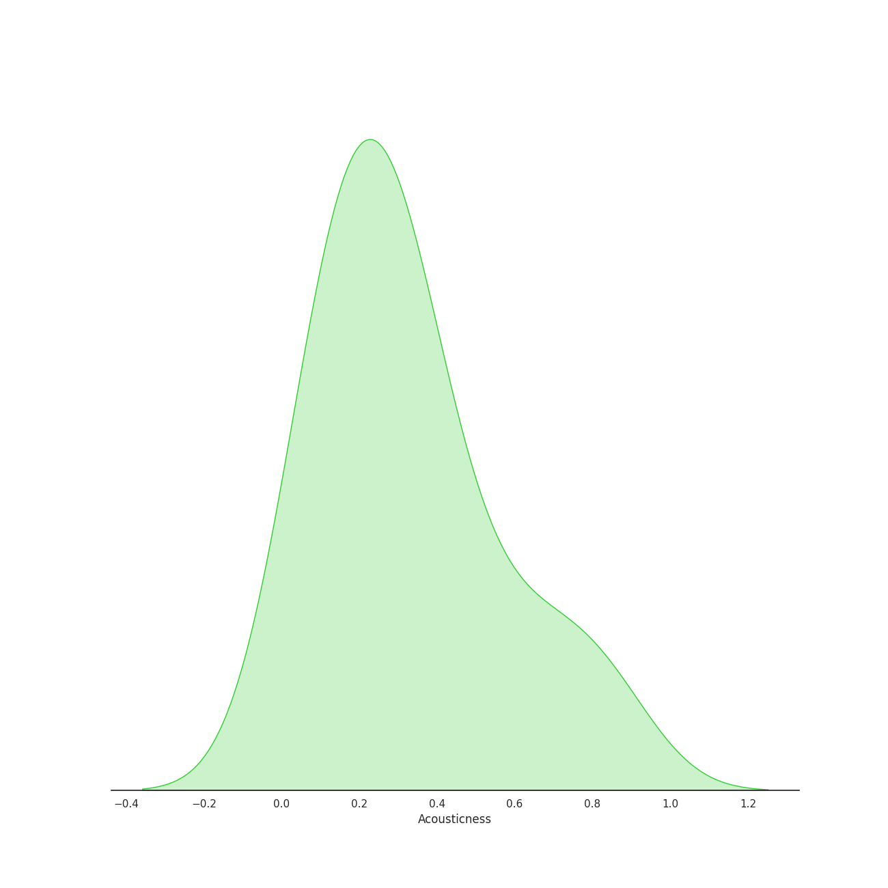
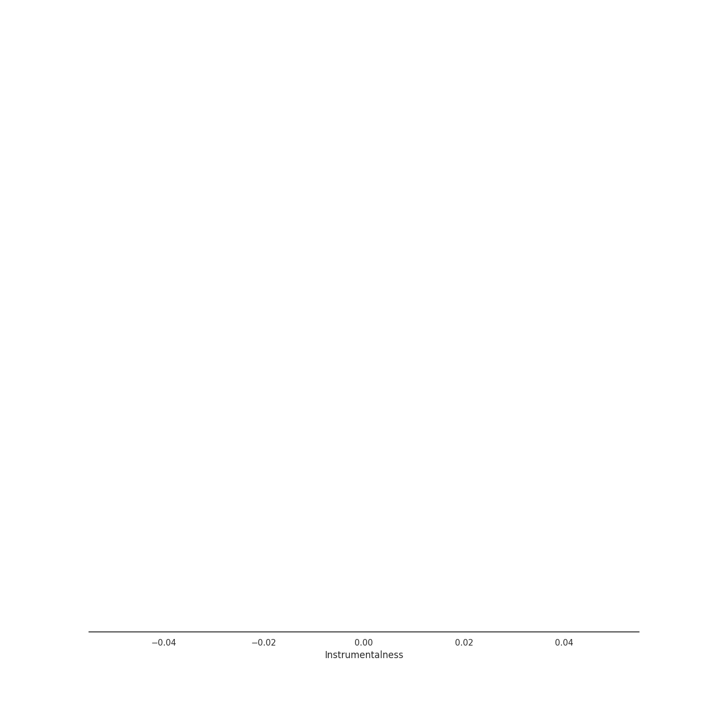
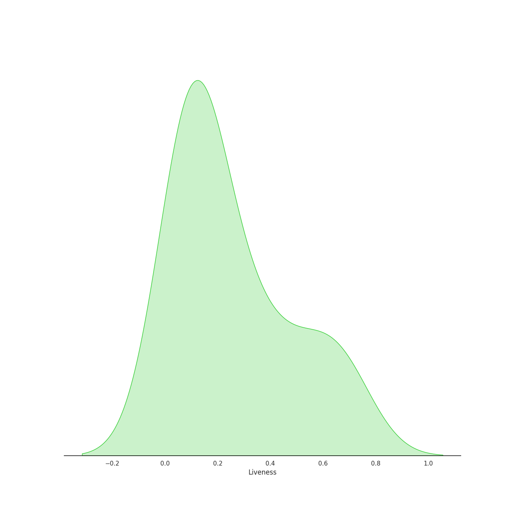
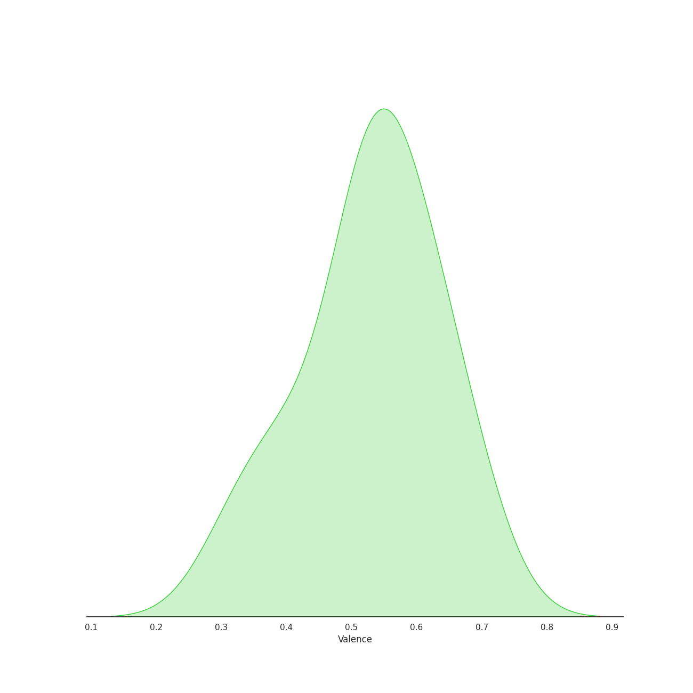
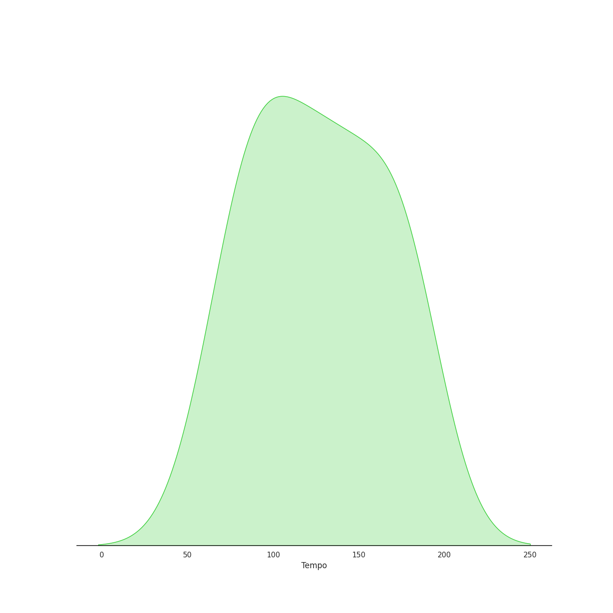

# Audio Features for Daveed Diggs

## Danceability

| 10 most Danceable tracks | 10 least Danceable tracks |
|:---|:---|
| Washington on Your Side (0.884) | The Story of Tonight (0.494) |
| Cabinet Battle #2 (0.753) | What'd I Miss (0.539) |
| The Election of 1800 (0.731) | Cabinet Battle #1 (0.607) |
| The Story of Tonight - Reprise (0.724) | Alexander Hamilton (0.609) |
| Guns and Ships (0.72) | The Room Where It Happens (0.638) |
| We Know (0.718) | Aaron Burr, Sir (0.646) |
| My Shot (0.698) | My Shot (0.698) |
| Aaron Burr, Sir (0.646) | We Know (0.718) |
| The Room Where It Happens (0.638) | Guns and Ships (0.72) |
| Alexander Hamilton (0.609) | The Story of Tonight - Reprise (0.724) |

## Energy

| 10 most Energetic tracks | 10 least Energetic tracks |
|:---|:---|
| Guns and Ships (0.666) | The Story of Tonight (0.237) |
| Cabinet Battle #1 (0.658) | The Story of Tonight - Reprise (0.305) |
| My Shot (0.649) | The Election of 1800 (0.42) |
| What'd I Miss (0.577) | Alexander Hamilton (0.435) |
| Cabinet Battle #2 (0.539) | Aaron Burr, Sir (0.439) |
| Washington on Your Side (0.521) | We Know (0.484) |
| The Room Where It Happens (0.49) | The Room Where It Happens (0.49) |
| We Know (0.484) | Washington on Your Side (0.521) |
| Aaron Burr, Sir (0.439) | Cabinet Battle #2 (0.539) |
| Alexander Hamilton (0.435) | What'd I Miss (0.577) |

## Speechiness

| 10 most Speechy tracks | 10 least Speechy tracks |
|:---|:---|
| Aaron Burr, Sir (0.818) | The Story of Tonight (0.0517) |
| Cabinet Battle #2 (0.537) | The Story of Tonight - Reprise (0.257) |
| We Know (0.523) | Alexander Hamilton (0.285) |
| The Election of 1800 (0.462) | Guns and Ships (0.328) |
| The Room Where It Happens (0.426) | Washington on Your Side (0.348) |
| Cabinet Battle #1 (0.423) | What'd I Miss (0.386) |
| My Shot (0.415) | My Shot (0.415) |
| What'd I Miss (0.386) | Cabinet Battle #1 (0.423) |
| Washington on Your Side (0.348) | The Room Where It Happens (0.426) |
| Guns and Ships (0.328) | The Election of 1800 (0.462) |

## Acousticness

| 10 most Acoustic tracks | 10 least Acoustic tracks |
|:---|:---|
| The Story of Tonight (0.835) | Cabinet Battle #2 (0.0582) |
| The Story of Tonight - Reprise (0.68) | Cabinet Battle #1 (0.0859) |
| Alexander Hamilton (0.522) | My Shot (0.15) |
| Guns and Ships (0.399) | Washington on Your Side (0.165) |
| The Election of 1800 (0.319) | What'd I Miss (0.169) |
| We Know (0.312) | The Room Where It Happens (0.271) |
| Aaron Burr, Sir (0.272) | Aaron Burr, Sir (0.272) |
| The Room Where It Happens (0.271) | We Know (0.312) |
| What'd I Miss (0.169) | The Election of 1800 (0.319) |
| Washington on Your Side (0.165) | Guns and Ships (0.399) |

## Instrumentalness

| 10 most Instrumental tracks | 10 least Instrumental tracks |
|:---|:---|
| Guns and Ships (0.0) | The Election of 1800 (0.0) |
| Aaron Burr, Sir (0.0) | The Story of Tonight (0.0) |
| Cabinet Battle #2 (0.0) | The Story of Tonight - Reprise (0.0) |
| My Shot (0.0) | We Know (0.0) |
| Alexander Hamilton (0.0) | Washington on Your Side (0.0) |
| Cabinet Battle #1 (0.0) | The Room Where It Happens (0.0) |
| What'd I Miss (0.0) | What'd I Miss (0.0) |
| The Room Where It Happens (0.0) | Cabinet Battle #1 (0.0) |
| Washington on Your Side (0.0) | Alexander Hamilton (0.0) |
| We Know (0.0) | My Shot (0.0) |

## Liveness

| 10 most Live tracks | 10 least Live tracks |
|:---|:---|
| The Room Where It Happens (0.664) | Washington on Your Side (0.0756) |
| The Story of Tonight (0.648) | Guns and Ships (0.0844) |
| Cabinet Battle #1 (0.489) | My Shot (0.0903) |
| Cabinet Battle #2 (0.353) | Aaron Burr, Sir (0.0945) |
| The Election of 1800 (0.306) | Alexander Hamilton (0.118) |
| What'd I Miss (0.14) | We Know (0.127) |
| The Story of Tonight - Reprise (0.128) | The Story of Tonight - Reprise (0.128) |
| We Know (0.127) | What'd I Miss (0.14) |
| Alexander Hamilton (0.118) | The Election of 1800 (0.306) |
| Aaron Burr, Sir (0.0945) | Cabinet Battle #2 (0.353) |

## Valence

| 10 most Happy tracks | 10 least Happy tracks |
|:---|:---|
| We Know (0.692) | What'd I Miss (0.319) |
| The Election of 1800 (0.645) | Guns and Ships (0.383) |
| The Story of Tonight (0.625) | Washington on Your Side (0.425) |
| The Story of Tonight - Reprise (0.594) | The Room Where It Happens (0.511) |
| My Shot (0.568) | Cabinet Battle #1 (0.513) |
| Alexander Hamilton (0.552) | Cabinet Battle #2 (0.519) |
| Aaron Burr, Sir (0.528) | Aaron Burr, Sir (0.528) |
| Cabinet Battle #2 (0.519) | Alexander Hamilton (0.552) |
| Cabinet Battle #1 (0.513) | My Shot (0.568) |
| The Room Where It Happens (0.511) | The Story of Tonight - Reprise (0.594) |

## Tempo

| 10 most Fast tracks | 10 least Fast tracks |
|:---|:---|
| My Shot (180.466) | The Election of 1800 (67.426) |
| What'd I Miss (177.787) | The Story of Tonight - Reprise (81.874) |
| The Room Where It Happens (173.552) | Cabinet Battle #1 (87.043) |
| Aaron Burr, Sir (160.387) | The Story of Tonight (95.219) |
| Guns and Ships (138.03) | Cabinet Battle #2 (99.455) |
| Washington on Your Side (134.051) | We Know (113.855) |
| Alexander Hamilton (131.995) | Alexander Hamilton (131.995) |
| We Know (113.855) | Washington on Your Side (134.051) |
| Cabinet Battle #2 (99.455) | Guns and Ships (138.03) |
| The Story of Tonight (95.219) | Aaron Burr, Sir (160.387) |
