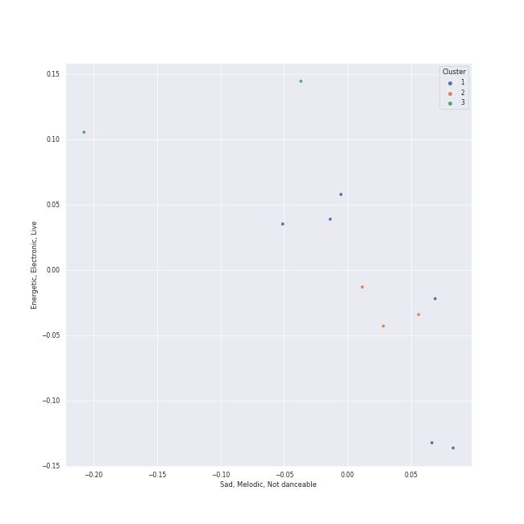

# Clusters in Doja Cat

## Cluster #1

6 tracks

| Art | Track | Album | Artists | Label | Score | 💚 | 🔗 |
|:---|:---|:---|:---|:---|---:|:---|:---|
|  | motive (with Doja Cat) | Positions | [Ariana Grande](../../../ariana_grande/overview.md), [Doja Cat](../../overview.md) | [Republic Records](../../../../labels/republic_records) | 0 | | [🔗](https://open.spotify.com/track/5GkQIP5mWPi4KZLLXeuFTT) |
|  | Woman | Planet Her | [Doja Cat](../../overview.md) | [Kemosabe Records/RCA Records](../../../../labels/rca_records_label) | 0 | | [🔗](https://open.spotify.com/track/6Uj1ctrBOjOas8xZXGqKk4) |
|  | Paint The Town Red | Paint The Town Red | [Doja Cat](../../overview.md) | [Kemosabe Records/RCA Records](../../../../labels/rca_records_label) | 0 | 💚 | [🔗](https://open.spotify.com/track/2IGMVunIBsBLtEQyoI1Mu7) |
|  | Say So | Hot Pink | [Doja Cat](../../overview.md) | [Kemosabe Records/RCA Records](../../../../labels/rca_records_label) | 7 | 💚 | [🔗](https://open.spotify.com/track/3Dv1eDb0MEgF93GpLXlucZ) |
|  | Vegas | ELVIS (Original Motion Picture Soundtrack) | [Doja Cat](../../overview.md) | [House of Iona/RCA Records](../../../../labels/rca_records_label) | 236 | 💚 | [🔗](https://open.spotify.com/track/3FWwi61OP7vXEikwqhZCPZ) |
|  | Kiss Me More (feat. SZA) | Kiss Me More (feat. SZA) | [Doja Cat](../../overview.md), SZA | [Kemosabe Records/RCA Records](../../../../labels/rca_records_label) | 0 | 💚 | [🔗](https://open.spotify.com/track/748mdHapucXQri7IAO8yFK) |
## Cluster #2

3 tracks

| Art | Track | Album | Artists | Label | Score | 💚 | 🔗 |
|:---|:---|:---|:---|:---|---:|:---|:---|
|  | You Right | Planet Her | [Doja Cat](../../overview.md), The Weeknd | [Kemosabe Records/RCA Records](../../../../labels/rca_records_label) | 0 | 💚 | [🔗](https://open.spotify.com/track/0k4d5YPDr1r7FX77VdqWez) |
|  | Need to Know | Planet Her | [Doja Cat](../../overview.md) | [Kemosabe Records/RCA Records](../../../../labels/rca_records_label) | 0 | 💚 | [🔗](https://open.spotify.com/track/3Vi5XqYrmQgOYBajMWSvCi) |
|  | Freaky Deaky | Freaky Deaky | Tyga, [Doja Cat](../../overview.md) | [Kemosabe / RCA Records / Last Kings Music / EMPIRE](../../../../labels/rca_records_label) | 0 | 💚 | [🔗](https://open.spotify.com/track/3vySEUpD0tc801F2WZDLYw) |
## Cluster #3

2 tracks

| Art | Track | Album | Artists | Label | Score | 💚 | 🔗 |
|:---|:---|:---|:---|:---|---:|:---|:---|
|  | Boss Bitch | Boss Bitch | [Doja Cat](../../overview.md) | [Atlantic Records](../../../../labels/atlantic_records) | 0 | 💚 | [🔗](https://open.spotify.com/track/78qd8dvwea0Gosb6Fe6j3k) |
|  | Baby, I'm Jealous (feat. Doja Cat) | Baby, I'm Jealous (feat. Doja Cat) | Bebe Rexha, [Doja Cat](../../overview.md) | [Warner Records](../../../../labels/warner_records) | 0 | 💚 | [🔗](https://open.spotify.com/track/2fTdRdN73RgIgcUZN33dvt) |