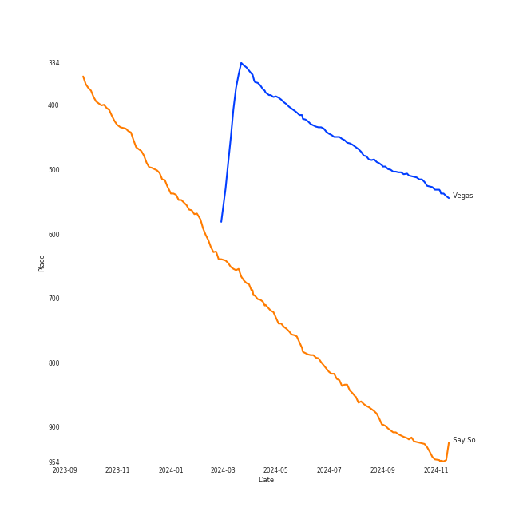
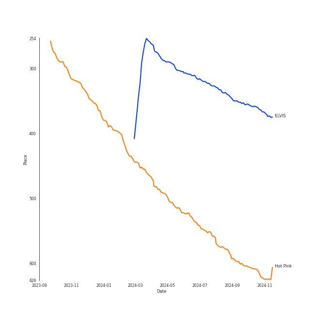

# Doja Cat

[See Track Features](audio_features.md)

[See Clusters](clusters/overview.md)

## Artist Rank
- The #201 artist of all time

## Top Tracks

### Top tracks of all time

## Top Albums

| Art | Rank | Tracks | 💚 | Album | Release Date | 🔗 |
|:---|---:|---:|---:|:---|:---|:---|
|  | 652 | 3 | 2 | Planet Her | 2021-06-25 | [🔗](https://open.spotify.com/album/1nAQbHeOWTfQzbOoFrvndW) |
|  | 652 | 1 | 1 | Paint The Town Red | 2023-08-04 | [🔗](https://open.spotify.com/album/54dZypaXHAIDzBe9ujAZ63) |
|  | 652 | 1 | 1 | Kiss Me More (feat. SZA) | 2021-04-09 | [🔗](https://open.spotify.com/album/1OnzqJTL9bwe4kvaLxRYxt) |
|  | 616 | 1 | 1 | Hot Pink | 2019-11-07 | [🔗](https://open.spotify.com/album/1MmVkhiwTH0BkNOU3nw5d3) |
|  | 652 | 1 | 1 | Freaky Deaky | 2022-02-25 | [🔗](https://open.spotify.com/album/05oVghsqITa33yHnbW7uPz) |
|  | 361 | 1 | 1 | ELVIS (Original Motion Picture Soundtrack) | 2022-06-24 | [🔗](https://open.spotify.com/album/74g0V2gxEA5MCSaivAwZyb) |
|  | 652 | 1 | 1 | Boss Bitch | 2020-01-23 | [🔗](https://open.spotify.com/album/4pmyFpGicLLIgNPc1TQXKc) |
|  | 652 | 1 | 1 | Baby, I'm Jealous (feat. Doja Cat) | 2020-10-09 | [🔗](https://open.spotify.com/album/2N367tN1eIXrHNVe86aVy4) |
|  | 652 | 1 | 0 | Positions | 2020-10-30 | [🔗](https://open.spotify.com/album/3euz4vS7ezKGnNSwgyvKcd) |

## Featured on Playlists
| Art | Tracks | Playlist |
|:---|---:|:---|
|  | 11 | [Pop](../../playlists/pop/overview.md) |
|  | 3 | [Summer](../../playlists/summer/overview.md) |
|  | 3 | [R&B](../../playlists/r_b/overview.md) |
|  | 2 | [A-Pop Favorites](../../playlists/a-pop_favorites/overview.md) |
|  | 2 | [Hip Hop](../../playlists/hip_hop/overview.md) |
|  | 1 | [Workout](../../playlists/workout/overview.md) |

## Top Record Labels

| Tracks | 💚 | Label |
|---:|---:|:---|
| 8 | 7 | [RCA Records Label](../../labels/rca_records_label/overview.md) |
| 7 | 6 | Kemosabe Records |
| 1 | 1 | [Warner Records](../../labels/warner_records/overview.md) |
| 1 | 1 | Last Kings Music |
| 1 | 1 | House of Iona |
| 1 | 1 | EMPIRE |
| 1 | 1 | [Atlantic Records](../../labels/atlantic_records/overview.md) |
| 1 | 0 | [Republic Records](../../labels/republic_records/overview.md) |

## Genres

- [dance pop](../../genres/dance_pop/overview.md)
- [pop](../../genres/pop/overview.md)

## Credits

### Credits by Type

| Credit Type | Tracks |
|:---|---:|
| Songwriter | 8 |
| Vocal | 4 |

### Production Credits

| Art | Track | Credit Types |
|:---|:---|:---|
|  | Say So | Songwriter |
|  | Boss Bitch | Songwriter |
|  | Baby, I'm Jealous (feat. Doja Cat) | Songwriter |
|  | Kiss Me More (feat. SZA) | Songwriter |
|  | You Right | Songwriter |
|  | Need to Know | Songwriter |
|  | Vegas | Songwriter |
|  | Paint The Town Red | Songwriter |

## Top Producers

| Art | Producer | Tracks | Credit Types |
|:---|:---|---:|:---|
|  | [Doja Cat](overview.md) | 8 | Songwriter |
| | [Serban Ghenea](../../producers/serban_ghenea/overview.md) | 5 | Producer |
| | [Łukasz Gottwald (Gottwald, Łukasz)](../../producers/łukasz_gottwald_(gottwald,_łukasz)/overview.md) | 4 | Songwriter |
| | Yeti Beats | 3 | Producer, Songwriter |
| | [John Hanes](../../producers/john_hanes/overview.md) | 3 | Producer |
| | [Bryce Bordone](../../producers/bryce_bordone/overview.md) | 2 | Producer |
| | Dr. Luke | 2 | Producer |
| | Rian Lewis | 2 | Producer |
| | Rogét Chahayed (Chahayed, Rogét) | 2 | Producer, Songwriter |
| | Jason Gill | 1 | Producer, Songwriter |

View all

| Art | Producer | Tracks | Credit Types |
|:---|:---|---:|:---|
| | Joe Visciano | 1 | Producer |
| | Mike Stoller | 1 | Songwriter |
| | Tyson Trax | 1 | Producer |
|  | The Weeknd | 1 | Songwriter |
| | Lydia Asrat | 1 | Songwriter |
| | Terry Shaddick | 1 | Songwriter |
|  | Bebe Rexha | 1 | Songwriter |
| | Isaac Earl Bynum | 1 | Songwriter |
| | Jaycen Joshua | 1 | Producer |
| | Jean-Baptiste Kouame | 1 | Songwriter |
|  | Ashnikko | 1 | Songwriter |
| | Karl Rubin | 1 | Songwriter |
| | tizhimself | 1 | Producer, Songwriter |
| | Ryan Buendia | 1 | Songwriter |
| | Jerry Leiber | 1 | Songwriter |
| | Carter Lang | 1 | Producer, Songwriter |
|  | SZA | 1 | Songwriter |
| | Burt Bacharach | 1 | Songwriter |
| | Jussifer | 1 | Producer, Songwriter |
| | Sky Adams | 1 | Producer, Songwriter |
| | Steve Kipner | 1 | Songwriter |
| | Justin Tranter | 1 | Songwriter |
| | Clint Gibbs | 1 | Producer |
| | Hal David | 1 | Songwriter |
| | Pablo Bowman | 1 | Songwriter |
| | [Manny Marroquin](../../producers/manny_marroquin/overview.md) | 1 | Producer |
| | Earl on the Beat | 1 | Producer |
| | Imad Royal | 1 | Producer, Songwriter |

## Tracks

| Art | Track | Album | Artists | Label | Rank | 💚 | 🔗 |
|:---|:---|:---|:---|:---|---:|:---|:---|
|  | Vegas | ELVIS (Original Motion Picture Soundtrack) | [Doja Cat](overview.md) | [House of Iona/RCA Records](../../labels/rca_records_label) | 520 | 💚 | [🔗](https://open.spotify.com/track/3FWwi61OP7vXEikwqhZCPZ) |
|  | Say So | Hot Pink | [Doja Cat](overview.md) | [Kemosabe Records/RCA Records](../../labels/rca_records_label) | 940 | 💚 | [🔗](https://open.spotify.com/track/3Dv1eDb0MEgF93GpLXlucZ) |
|  | Boss Bitch | Boss Bitch | [Doja Cat](overview.md) | [Atlantic Records](../../labels/atlantic_records) | 996 | 💚 | [🔗](https://open.spotify.com/track/78qd8dvwea0Gosb6Fe6j3k) |
|  | Baby, I'm Jealous (feat. Doja Cat) | Baby, I'm Jealous (feat. Doja Cat) | Bebe Rexha, [Doja Cat](overview.md) | [Warner Records](../../labels/warner_records) | 996 | 💚 | [🔗](https://open.spotify.com/track/2fTdRdN73RgIgcUZN33dvt) |
|  | motive (with Doja Cat) | Positions | [Ariana Grande](../ariana_grande/overview.md), [Doja Cat](overview.md) | [Republic Records](../../labels/republic_records) | 996 | | [🔗](https://open.spotify.com/track/5GkQIP5mWPi4KZLLXeuFTT) |
|  | Kiss Me More (feat. SZA) | Kiss Me More (feat. SZA) | [Doja Cat](overview.md), SZA | [Kemosabe Records/RCA Records](../../labels/rca_records_label) | 996 | 💚 | [🔗](https://open.spotify.com/track/748mdHapucXQri7IAO8yFK) |
|  | Need to Know | Planet Her | [Doja Cat](overview.md) | [Kemosabe Records/RCA Records](../../labels/rca_records_label) | 996 | 💚 | [🔗](https://open.spotify.com/track/3Vi5XqYrmQgOYBajMWSvCi) |
|  | Woman | Planet Her | [Doja Cat](overview.md) | [Kemosabe Records/RCA Records](../../labels/rca_records_label) | 996 | | [🔗](https://open.spotify.com/track/6Uj1ctrBOjOas8xZXGqKk4) |
|  | You Right | Planet Her | [Doja Cat](overview.md), The Weeknd | [Kemosabe Records/RCA Records](../../labels/rca_records_label) | 996 | 💚 | [🔗](https://open.spotify.com/track/0k4d5YPDr1r7FX77VdqWez) |
|  | Freaky Deaky | Freaky Deaky | Tyga, [Doja Cat](overview.md) | [Kemosabe / RCA Records / Last Kings Music / EMPIRE](../../labels/rca_records_label) | 996 | 💚 | [🔗](https://open.spotify.com/track/3vySEUpD0tc801F2WZDLYw) |

See all tracks

| Art | Track | Album | Artists | Label | Rank | 💚 | 🔗 |
|:---|:---|:---|:---|:---|---:|:---|:---|
|  | Paint The Town Red | Paint The Town Red | [Doja Cat](overview.md) | [Kemosabe Records/RCA Records](../../labels/rca_records_label) | 996 | 💚 | [🔗](https://open.spotify.com/track/2IGMVunIBsBLtEQyoI1Mu7) |

