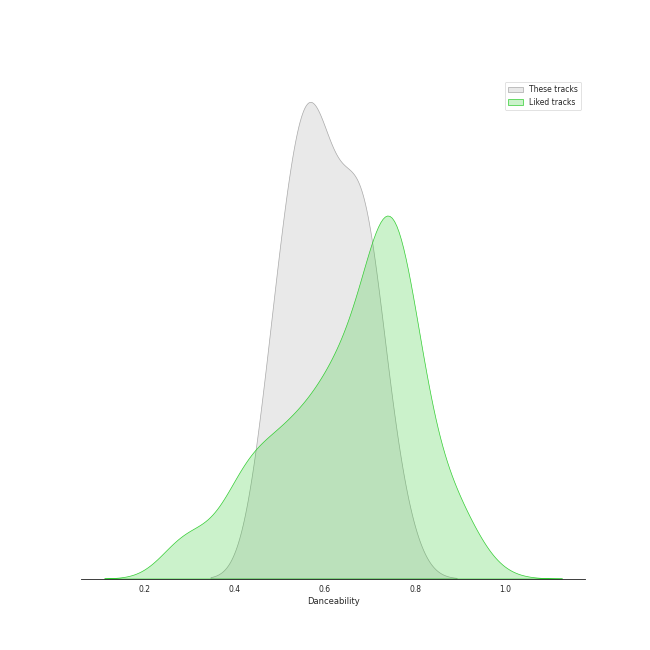
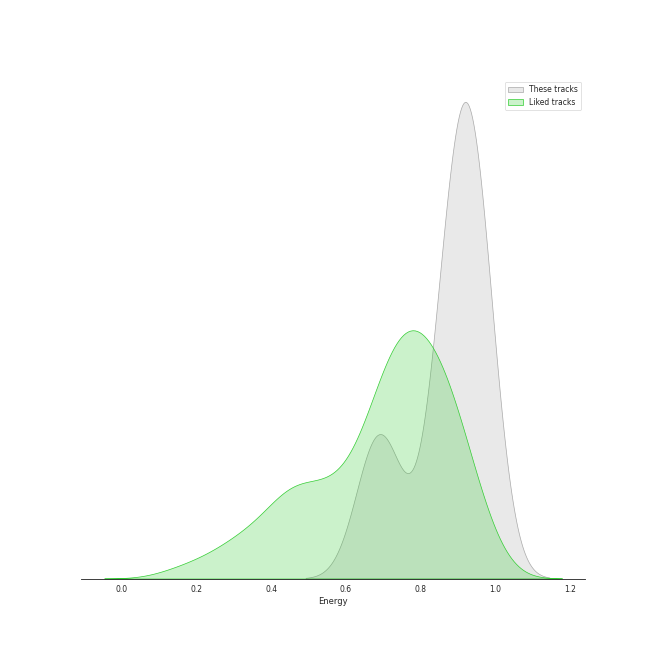
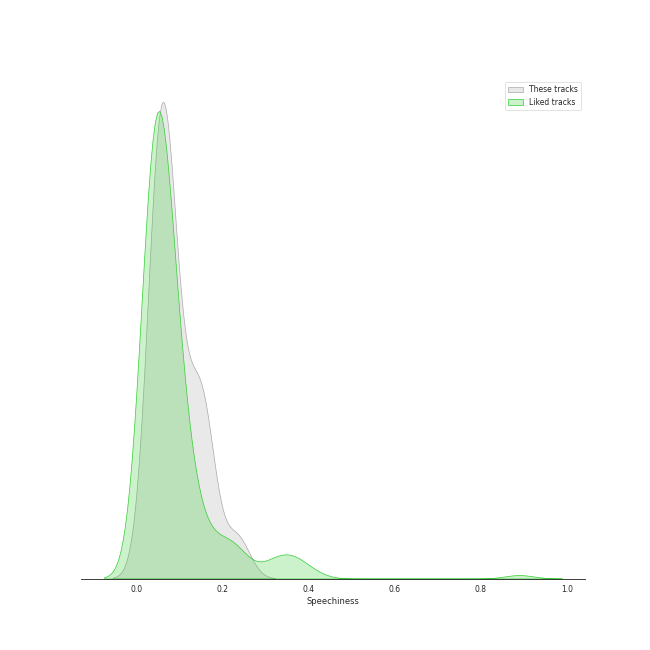
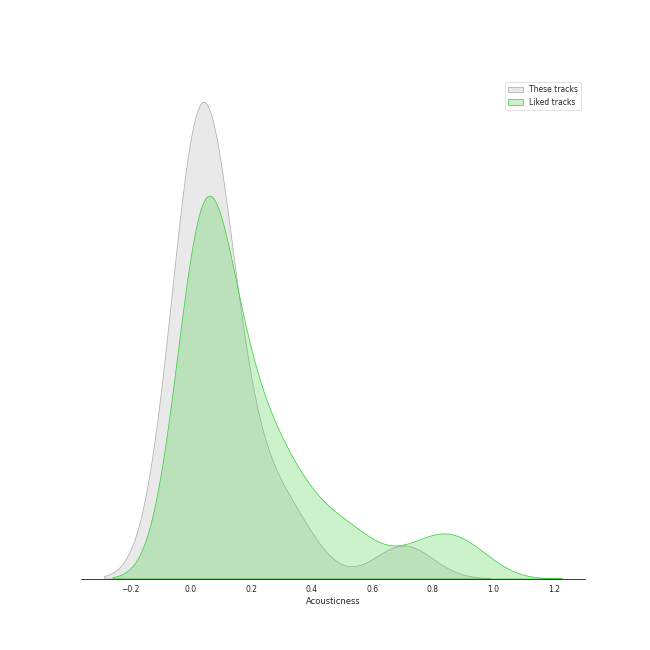
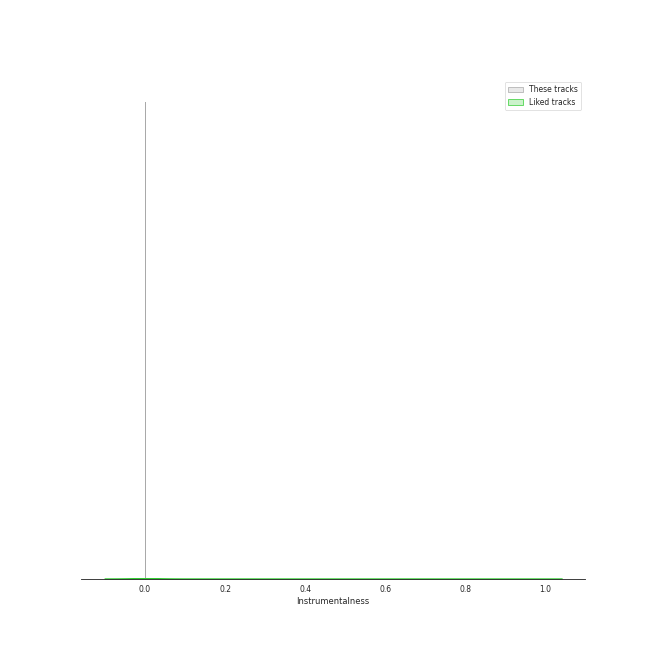
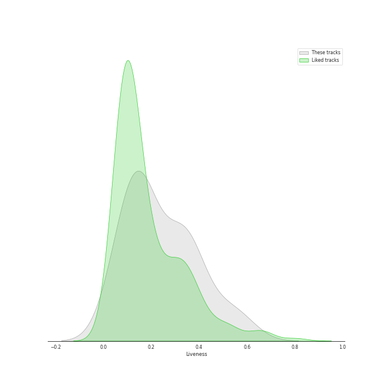
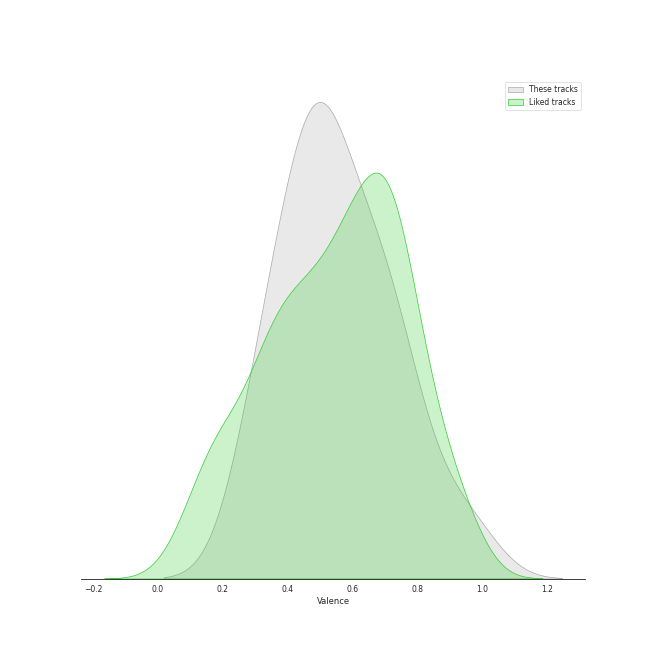
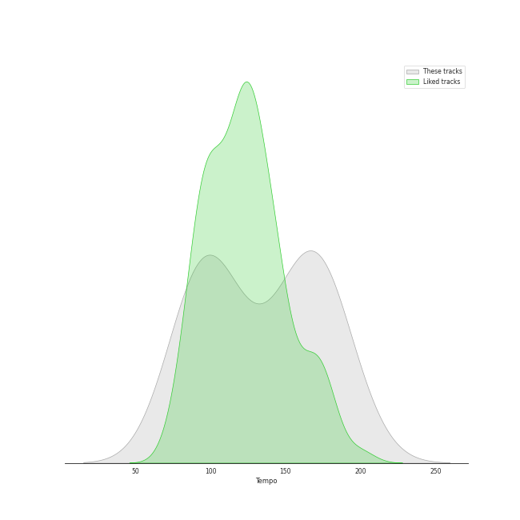

# Audio Features for Dreamcatcher

## Danceability

| 10 most Danceable tracks | 10 least Danceable tracks |
|:---|:---|
| Locked Inside A Door (0.757) | REASON (0.474) |
| Black Or White (0.746) | PIRI (0.507) |
| Scream (0.704) | Odd Eye (0.534) |
| Red Sun (0.701) | Starlight (0.548) |
| MAISON (0.686) | BEcause (0.55) |
| Jazz Bar (0.683) | VISION (0.582) |
| Deja Vu (0.613) | Silent Night (0.594) |
| Silent Night (0.594) | Deja Vu (0.613) |
| VISION (0.582) | Jazz Bar (0.683) |
| BEcause (0.55) | MAISON (0.686) |

## Energy

| 10 most Energetic tracks | 10 least Energetic tracks |
|:---|:---|
| MAISON (0.955) | Locked Inside A Door (0.661) |
| Scream (0.94) | Deja Vu (0.667) |
| Odd Eye (0.933) | Jazz Bar (0.707) |
| BEcause (0.932) | Black Or White (0.793) |
| Red Sun (0.92) | VISION (0.855) |
| REASON (0.901) | PIRI (0.869) |
| Starlight (0.898) | Silent Night (0.875) |
| Silent Night (0.875) | Starlight (0.898) |
| PIRI (0.869) | REASON (0.901) |
| VISION (0.855) | Red Sun (0.92) |

## Speechiness

| 10 most Speechy tracks | 10 least Speechy tracks |
|:---|:---|
| REASON (0.254) | Deja Vu (0.0394) |
| MAISON (0.159) | Starlight (0.0484) |
| Scream (0.158) | Locked Inside A Door (0.0518) |
| Red Sun (0.157) | VISION (0.0561) |
| Jazz Bar (0.128) | Silent Night (0.0584) |
| Odd Eye (0.11) | PIRI (0.0594) |
| BEcause (0.0855) | Black Or White (0.0794) |
| Black Or White (0.0794) | BEcause (0.0855) |
| PIRI (0.0594) | Odd Eye (0.11) |
| Silent Night (0.0584) | Jazz Bar (0.128) |

## Acousticness

| 10 most Acoustic tracks | 10 least Acoustic tracks |
|:---|:---|
| Jazz Bar (0.704) | Starlight (0.00244) |
| Red Sun (0.351) | REASON (0.00513) |
| Locked Inside A Door (0.276) | BEcause (0.0183) |
| PIRI (0.18) | VISION (0.0308) |
| MAISON (0.129) | Scream (0.0312) |
| Black Or White (0.125) | Odd Eye (0.049) |
| Deja Vu (0.0627) | Silent Night (0.0552) |
| Silent Night (0.0552) | Deja Vu (0.0627) |
| Odd Eye (0.049) | Black Or White (0.125) |
| Scream (0.0312) | MAISON (0.129) |

## Instrumentalness

| 10 most Instrumental tracks | 10 least Instrumental tracks |
|:---|:---|
| Silent Night (0.000148) | Black Or White (0.0) |
| Deja Vu (0.0) | MAISON (0.0) |
| PIRI (0.0) | VISION (0.0) |
| Red Sun (0.0) | Odd Eye (0.0) |
| Starlight (0.0) | REASON (0.0) |
| Jazz Bar (0.0) | BEcause (0.0) |
| Scream (0.0) | Locked Inside A Door (0.0) |
| Locked Inside A Door (0.0) | Scream (0.0) |
| BEcause (0.0) | Jazz Bar (0.0) |
| REASON (0.0) | Starlight (0.0) |

## Liveness

| 10 most Live tracks | 10 least Live tracks |
|:---|:---|
| PIRI (0.474) | Locked Inside A Door (0.0717) |
| BEcause (0.344) | MAISON (0.0782) |
| REASON (0.343) | Black Or White (0.0839) |
| Jazz Bar (0.335) | VISION (0.144) |
| Scream (0.29) | Red Sun (0.149) |
| Odd Eye (0.195) | Silent Night (0.149) |
| Deja Vu (0.169) | Starlight (0.165) |
| Starlight (0.165) | Deja Vu (0.169) |
| Silent Night (0.149) | Odd Eye (0.195) |
| Red Sun (0.149) | Scream (0.29) |

## Valence

| 10 most Happy tracks | 10 least Happy tracks |
|:---|:---|
| Locked Inside A Door (0.815) | Scream (0.311) |
| Jazz Bar (0.72) | Starlight (0.346) |
| Black Or White (0.686) | VISION (0.355) |
| Red Sun (0.567) | REASON (0.404) |
| Odd Eye (0.529) | BEcause (0.45) |
| PIRI (0.507) | Silent Night (0.477) |
| MAISON (0.496) | Deja Vu (0.486) |
| Deja Vu (0.486) | MAISON (0.496) |
| Silent Night (0.477) | PIRI (0.507) |
| BEcause (0.45) | Odd Eye (0.529) |

## Tempo

| 10 most Fast tracks | 10 least Fast tracks |
|:---|:---|
| REASON (176.083) | Red Sun (79.454) |
| PIRI (170.043) | Deja Vu (89.946) |
| BEcause (170.012) | Jazz Bar (93.936) |
| Odd Eye (160.061) | VISION (94.958) |
| Silent Night (160.008) | Locked Inside A Door (97.968) |
| Starlight (149.97) | Black Or White (99.983) |
| Scream (137.909) | MAISON (120.007) |
| MAISON (120.007) | Scream (137.909) |
| Black Or White (99.983) | Starlight (149.97) |
| Locked Inside A Door (97.968) | Silent Night (160.008) |
