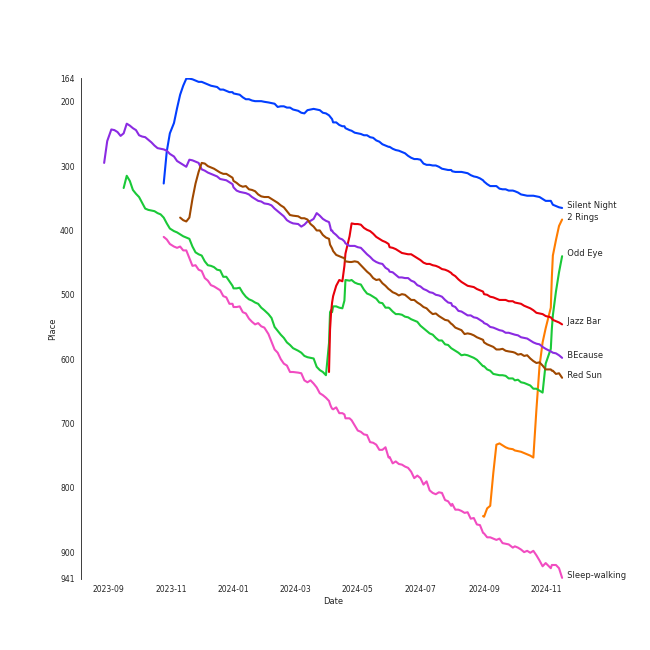
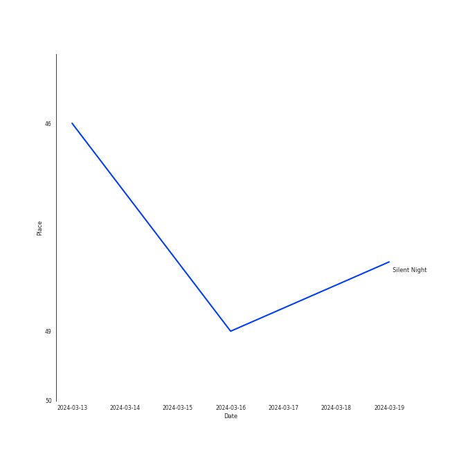
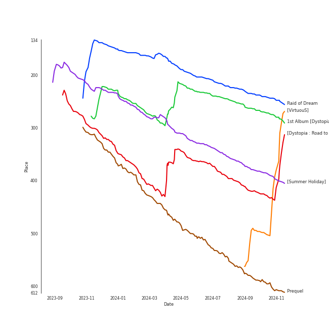

# Dreamcatcher

[See Track Features](audio_features.md)

[See Clusters](clusters/overview.md)

## Relationships

Dreamcatcher:
- has member DAMI
- has member GAHYEON
- has member HANDONG
- has member JI U
- has member SIYEON
- has member SU A
- has member YOOHYEON

## Artist Rank
Dreamcatcher is currently:
- The #29 artist of the last month
- The #33 artist of the last 6 months
- The #20 artist of the last year
- The #29 artist of all time

## Top Tracks

### Top tracks of all time

Top tracks of the last 6 months over time

## Top Albums

| Art | Rank | Tracks | 💚 | Album | Release Date | 🔗 |
|:---|---:|---:|---:|:---|:---|:---|
|  | 254 | 3 | 3 | 1st Album [Dystopia : The Tree of Language] | 2020-02-18 | [🔗](https://open.spotify.com/album/6m5pDOafdvIKxNRxx5hVbr) |
|  | 612 | 3 | 2 | [Apocalypse : Save us] | 2022-04-12 | [🔗](https://open.spotify.com/album/42mMFBIWT599FmtWK5op4a) |
|  | 224 | 3 | 2 | Raid of Dream | 2019-09-18 | [🔗](https://open.spotify.com/album/7jvAjSM0NOSwJYsLzHQ9KZ) |
|  | 612 | 1 | 1 | [VirtuouS] | 2024-07-10 | [🔗](https://open.spotify.com/album/4PkR73YJKj5RGkC7QZVpM2) |
|  | 364 | 1 | 1 | [Summer Holiday] | 2021-07-30 | [🔗](https://open.spotify.com/album/3dD0qCBPe7eYeaftyIKwa5) |
|  | 400 | 1 | 1 | [Dystopia : Road to Utopia] | 2021-01-26 | [🔗](https://open.spotify.com/album/1EyLcB9R1KfUV45AxtRR3V) |
|  | 612 | 1 | 1 | [Dystopia : Lose Myself] | 2020-08-17 | [🔗](https://open.spotify.com/album/0cDPkovaIsxLcIghyT9LKz) |
|  | 612 | 1 | 1 | [Apocalypse : Follow us] | 2022-10-11 | [🔗](https://open.spotify.com/album/10PIYVB08sIQbGNpWk3fXj) |
|  | 560 | 1 | 1 | Prequel | 2017-07-27 | [🔗](https://open.spotify.com/album/7dwF0tRN3awkAyYEdLJic3) |
|  | 612 | 1 | 0 | [REASON] | 2023-01-13 | [🔗](https://open.spotify.com/album/6TJ3N82EGtf7Gu8QEFAT8t) |

See all albums

| Art | Rank | Tracks | 💚 | Album | Release Date | 🔗 |
|:---|---:|---:|---:|:---|:---|:---|
|  | 612 | 1 | 0 | [Apocalypse : From us] | 2023-05-24 | [🔗](https://open.spotify.com/album/7D2DrBRs922elDgsyNrqjA) |
|  | 612 | 1 | 0 | The End of Nightmare | 2019-02-13 | [🔗](https://open.spotify.com/album/5GWbkX0bjGcv9bRPVOPZVg) |

## Featured on Playlists
| Art | Tracks | Playlist |
|:---|---:|:---|
|  | 18 | [K-Pop](../../playlists/k-pop/overview.md) |
|  | 8 | [Halloween](../../playlists/halloween/overview.md) |
|  | 3 | [K-Pop Favorites](../../playlists/k-pop_favorites/overview.md) |
|  | 1 | [Retro Kpop](../../playlists/retro_kpop/overview.md) |
|  | 1 | [K-Pop 101](../../playlists/k-pop_101/overview.md) |
|  | 1 | [Recent Comebacks](../../playlists/recent_comebacks/overview.md) |
|  | 1 | [Your Top Songs 2022](../../playlists/your_top_songs_2022/overview.md) |
|  | 1 | [Workout](../../playlists/workout/overview.md) |

## Top Record Labels

| Tracks | 💚 | Label |
|---:|---:|:---|
| 17 | 12 | [DREAMCATCHER COMPANY](../../labels/dreamcatcher_company/overview.md) |
| 1 | 1 | 해피페이스 엔터테인먼트 |

## Genres

- [k-pop](../../genres/k-pop/overview.md)
- [k-pop girl group](../../genres/k-pop_girl_group/overview.md)

## Credits

### Member Credits

| | DAMI | GAHYEON | HANDONG | JI U | SIYEON | SU A | YOOHYEON |
|:---|---:|---:|---:|---:|---:|---:|---:|
| Lyricist | 3 | 0 | 0 | 3 | 3 | 0 | 2 |
| Vocal | 15 | 15 | 8 | 15 | 20 | 15 | 17 |
### Production Credits

| Art | Track | Members | Credit Types |
|:---|---:|:---|:---|
| | nan | SIYEON, YOOHYEON, JI U, DAMI | Lyricist |
| | nan | SIYEON, JI U, DAMI | Lyricist |

## Top Producers

| Art | Producer | Tracks | Credit Types |
|:---|:---|---:|:---|
| | [Ollounder](../../producers/ollounder/overview.md) | 11 | Arranger, Lyricist, Producer, Songwriter |
| | [LEEZ](../../producers/leez/overview.md) | 11 | Arranger, Lyricist, Songwriter, Producer |
| | 김석민 (Kim Seog-min) | 9 | Producer |
| | 정창현 (Jung, Chang-hyun) | 6 | Producer |
| | 주선교 (주선교) | 2 | Producer |
| | 김보은 (Kim, Bo-eun) | 2 | Lyricist |
| | YOOHYEON | 1 | Lyricist |
| | 김정미 (Kim Jung-mi) | 1 | Lyricist |
| | JI U | 1 | Lyricist |
| | SIYEON | 1 | Lyricist |

View all

| Art | Producer | Tracks | Credit Types |
|:---|:---|---:|:---|
| | 김준혁 (Kim Joonhyuk) | 1 | Lyricist, Producer, Songwriter |
| | 주상경 (Ju, Sang-kyung) | 1 | Producer |
| | 황선정 (Hwang Sun-jung) | 1 | Lyricist |
| | 김준원 (Kim, June-One) | 1 | Arranger, Songwriter |
| | 전지은 (Jeon Ji-eun) | 1 | Lyricist |
| | Maddox | 1 | Lyricist |
| | DAMI | 1 | Lyricist |

## Tracks

| Art | Track | Album | Artists | Label | Rank | 💚 | 🔗 |
|:---|:---|:---|:---|:---|---:|:---|:---|
|  | Silent Night | Raid of Dream | [Dreamcatcher](overview.md) | [DREAMCATCHER COMPANY](../../labels/dreamcatcher_company) | 304 | 💚 | [🔗](https://open.spotify.com/track/6OrYF7BHkbsfhxEMQfwBvV) |
|  | Jazz Bar | 1st Album [Dystopia : The Tree of Language] | [Dreamcatcher](overview.md) | [Dreamcatcher Company](../../labels/dreamcatcher_company) | 484 | 💚 | [🔗](https://open.spotify.com/track/5XVjj6hJTWgYiDx72Wo5QS) |
|  | BEcause | [Summer Holiday] | [Dreamcatcher](overview.md) | [DREAMCATCHER COMPANY](../../labels/dreamcatcher_company) | 531 | 💚 | [🔗](https://open.spotify.com/track/0ufYP4HLjzVSLUsGKCIQJH) |
|  | Red Sun | 1st Album [Dystopia : The Tree of Language] | [Dreamcatcher](overview.md) | [Dreamcatcher Company](../../labels/dreamcatcher_company) | 560 | 💚 | [🔗](https://open.spotify.com/track/0WXmPCkeeLjpTddcBI98GV) |
|  | Odd Eye | [Dystopia : Road to Utopia] | [Dreamcatcher](overview.md) | [DREAMCATCHER COMPANY](../../labels/dreamcatcher_company) | 595 | 💚 | [🔗](https://open.spotify.com/track/1RtlbxsPpDBsHHmGTb7ah2) |
|  | Sleep-walking | Prequel | [Dreamcatcher](overview.md) | 해피페이스 엔터테인먼트 | 843 | 💚 | [🔗](https://open.spotify.com/track/5PYR7g3AmuYE5Yaay7s3us) |
|  | PIRI | The End of Nightmare | [Dreamcatcher](overview.md) | [DREAMCATCHER COMPANY](../../labels/dreamcatcher_company) | 922 | | [🔗](https://open.spotify.com/track/38dgtl73zn8VYh7VOCvs69) |
|  | Deja Vu | Raid of Dream | [Dreamcatcher](overview.md) | [DREAMCATCHER COMPANY](../../labels/dreamcatcher_company) | 922 | 💚 | [🔗](https://open.spotify.com/track/3qvfE7DGsIlkWzKMOS4gAm) |
|  | The curse of the Spider | Raid of Dream | [Dreamcatcher](overview.md) | [DREAMCATCHER COMPANY](../../labels/dreamcatcher_company) | 922 | | [🔗](https://open.spotify.com/track/2j8m29w5AzF9P6b0sYI6H4) |
|  | Scream | 1st Album [Dystopia : The Tree of Language] | [Dreamcatcher](overview.md) | [Dreamcatcher Company](../../labels/dreamcatcher_company) | 922 | 💚 | [🔗](https://open.spotify.com/track/7FxshQAsTWmogWU959hz3T) |

See all tracks

| Art | Track | Album | Artists | Label | Rank | 💚 | 🔗 |
|:---|:---|:---|:---|:---|---:|:---|:---|
|  | BOCA | [Dystopia : Lose Myself] | [Dreamcatcher](overview.md) | [DREAMCATCHER COMPANY](../../labels/dreamcatcher_company) | 922 | 💚 | [🔗](https://open.spotify.com/track/2u7p3Bzkv8h0Yx7w7R370n) |
|  | Locked Inside A Door | [Apocalypse : Save us] | [Dreamcatcher](overview.md) | [DREAMCATCHER COMPANY](../../labels/dreamcatcher_company) | 922 | | [🔗](https://open.spotify.com/track/6qz5Cc8zFGCMfqKQXs1taj) |
|  | MAISON | [Apocalypse : Save us] | [Dreamcatcher](overview.md) | [DREAMCATCHER COMPANY](../../labels/dreamcatcher_company) | 922 | 💚 | [🔗](https://open.spotify.com/track/2fyhv2ThM2PDqlc8HVs32e) |
|  | Starlight | [Apocalypse : Save us] | [Dreamcatcher](overview.md) | [DREAMCATCHER COMPANY](../../labels/dreamcatcher_company) | 922 | 💚 | [🔗](https://open.spotify.com/track/5D9ooWK4X7TryJoqS6IuS3) |
|  | VISION | [Apocalypse : Follow us] | [Dreamcatcher](overview.md) | [DREAMCATCHER COMPANY](../../labels/dreamcatcher_company) | 922 | 💚 | [🔗](https://open.spotify.com/track/2pSxnhsiSDiqgtWclRUxHt) |
|  | REASON | [REASON] | [Dreamcatcher](overview.md) | [DREAMCATCHER COMPANY](../../labels/dreamcatcher_company) | 922 | | [🔗](https://open.spotify.com/track/2oljPlhOzzWrqkTuAhKwzi) |
|  | DEMIAN | [Apocalypse : From us] | [Dreamcatcher](overview.md) | [DREAMCATCHER COMPANY](../../labels/dreamcatcher_company) | 922 | | [🔗](https://open.spotify.com/track/2k2stGWMSU85UayvEGlm5W) |
|  | 2 Rings | [VirtuouS] | [Dreamcatcher](overview.md) | [DREAMCATCHER COMPANY](../../labels/dreamcatcher_company) | 922 | 💚 | [🔗](https://open.spotify.com/track/2jIkG2xRXVuXUNpPANMhVu) |

