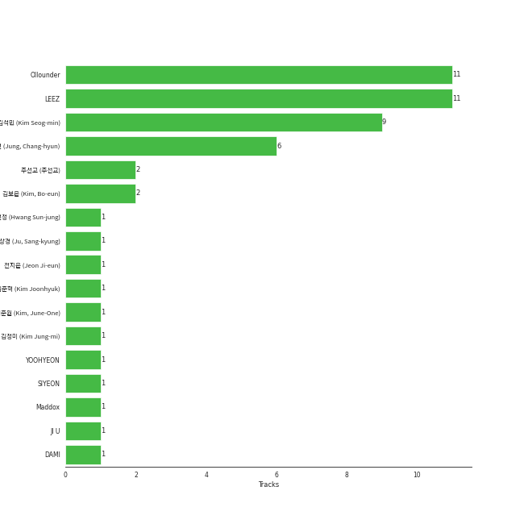

# Dreamcatcher

[See Track Features](audio_features.md)

[See Clusters](clusters/overview.md)

## Relationships

Dreamcatcher:
- has member DAMI
- has member GAHYEON
- has member HANDONG
- has member JI U
- has member SIYEON
- has member SU A
- has member YOOHYEON

## Artist Rank
Dreamcatcher is currently:
- The #27 artist of all time
- The #13 artist of the last 6 months

## Top Tracks

### Top tracks of the last month over time

## Featured on Playlists
| Art | Tracks | Playlist |
|:---|---:|:---|
|  | 15 | [K-Pop](../../playlists/k_pop/overview.md) |
|  | 7 | [Halloween](../../playlists/halloween/overview.md) |
|  | 3 | [K-Pop Favorites](../../playlists/k_pop_favorites/overview.md) |
|  | 2 | [Workout](../../playlists/workout/overview.md) |
|  | 1 | [K-Pop 101](../../playlists/k_pop_101/overview.md) |
|  | 1 | [Recent Comebacks](../../playlists/recent_comebacks/overview.md) |

## Top Albums

| Art | Tracks | 💚 | Album | Release Date | 🔗 |
|:---|---:|---:|:---|:---|:---|
|  | 4 | 4 | 1st Album [Dystopia : The Tree of Language] | 2020-02-18 | [🔗](https://open.spotify.com/album/7no7EZnKgoRWBbGMjZo9gB) |
|  | 3 | 2 | [Apocalypse : Save us] | 2022-04-12 | [🔗](https://open.spotify.com/album/1ONjVRtxAqiTivu0EiEBm5) |
|  | 2 | 2 | Raid of Dream | 2019-09-18 | [🔗](https://open.spotify.com/album/4Y5YucmQPgaCJOkmRshYGs) |
|  | 1 | 1 | ［Dystopia : Road to Utopia］ | 2021-01-26 | [🔗](https://open.spotify.com/album/6ECUAXThxlRHQ1JPUQJQJG) |
|  | 1 | 1 | [VillainS] | 2023-11-22 | [🔗](https://open.spotify.com/album/1GWC45tJrcKctt6qtFQHB7) |
|  | 1 | 1 | [Summer Holiday] | 2021-07-30 | [🔗](https://open.spotify.com/album/1JOpx5eL6Rb3vRC9epERQD) |
|  | 1 | 1 | [Apocalypse : Follow us] | 2022-10-11 | [🔗](https://open.spotify.com/album/7MQXcfzHmWjQAAIFhdy1mY) |
|  | 1 | 1 | Prequel | 2017-07-27 | [🔗](https://open.spotify.com/album/7dwF0tRN3awkAyYEdLJic3) |
|  | 1 | 0 | [REASON] | 2023-01-13 | [🔗](https://open.spotify.com/album/0VZzJkiIK51ygHS5n1qRnZ) |
|  | 1 | 0 | The End of Nightmare | 2019-02-13 | [🔗](https://open.spotify.com/album/02YL02Pjk6moxi5iuYsIPC) |

## Top Record Labels

| Tracks | 💚 | Label |
|---:|---:|:---|
| 15 | 12 | [DREAMCATCHER COMPANY](../../labels/dreamcatcher_company/overview.md) |
| 1 | 1 | 해피페이스 엔터테인먼트 |

## Genres

- [k-pop](../../genres/k_pop/overview.md)
- [k-pop girl group](../../genres/k_pop_girl_group/overview.md)

## Credits

### Member Credits

| | DAMI | GAHYEON | HANDONG | JI U | SIYEON | SU A | YOOHYEON |
|:---|---:|---:|---:|---:|---:|---:|---:|
| Lyricist | 2 | 0 | 0 | 2 | 2 | 0 | 1 |
| Vocal | 8 | 8 | 4 | 8 | 10 | 8 | 9 |
### Production Credits

| Art | Track | Members | Credit Types |
|:---|:---|:---|:---|
|  | Black Or White | SIYEON, JI U, DAMI | Lyricist |
|  | Jazz Bar | SIYEON, YOOHYEON, JI U, DAMI | Lyricist |

## Top Producers

| Art | Producer | Tracks | Credit Types |
|:---|:---|---:|:---|
| | Ollounder | 11 | Arranger, Lyricist, Songwriter |
| | LEEZ | 11 | Arranger, Lyricist, Songwriter, Producer |
| | 김석민 (Kim Seog-min) | 9 | Producer |
| | 정창현 (Jung, Chang-hyun) | 6 | Producer |
| | 주선교 (주선교) | 2 | Producer |
| | JI U | 2 | Lyricist |
| | SIYEON | 2 | Lyricist |
| | 김준혁 (Kim Joonhyuk) | 2 | Songwriter, Lyricist, Producer |
| | 김보은 (Kim, Bo-eun) | 2 | Lyricist |
| | DAMI | 2 | Lyricist |

View all

| Art | Producer | Tracks | Credit Types |
|:---|:---|---:|:---|
| | 주상경 (Ju, Sang-kyung) | 1 | Producer |
| | 황선정 (Hwang Sun-jung) | 1 | Lyricist |
| | YOOHYEON | 1 | Lyricist |
| | 김준원 (Kim, June-One) | 1 | Arranger, Songwriter |
| | 전지은 (Jeon Ji-eun) | 1 | Lyricist |
| | 0to1 | 1 | Songwriter |
| | Maddox | 1 | Lyricist |
| | 김정미 (Kim Jung-mi) | 1 | Lyricist |

## Tracks

| Art | Track | Album | Artists | Label | 💚 | 🔗 |
|:---|:---|:---|:---|:---|:---|:---|
|  | Sleep-walking | Prequel | [Dreamcatcher](overview.md) | 해피페이스 엔터테인먼트 | 💚 | [🔗](https://open.spotify.com/track/5PYR7g3AmuYE5Yaay7s3us) |
|  | PIRI | The End of Nightmare | [Dreamcatcher](overview.md) | [DREAMCATCHER COMPANY](../../labels/dreamcatcher_company) | | [🔗](https://open.spotify.com/track/6vHyPhg8fgclBiY8QN68wp) |
|  | Silent Night | Raid of Dream | [Dreamcatcher](overview.md) | [DREAMCATCHER COMPANY](../../labels/dreamcatcher_company) | 💚 | [🔗](https://open.spotify.com/track/6WtBCTeMrTC9oKQ8dgSWcM) |
|  | 데자부 (Deja Vu) | Raid of Dream | [Dreamcatcher](overview.md) | [DREAMCATCHER COMPANY](../../labels/dreamcatcher_company) | 💚 | [🔗](https://open.spotify.com/track/7uvW1F97LfVbOF6bzHs3nO) |
|  | Black Or White | 1st Album [Dystopia : The Tree of Language] | [Dreamcatcher](overview.md) | [Dreamcatcher Company](../../labels/dreamcatcher_company) | 💚 | [🔗](https://open.spotify.com/track/11wbEfF8uFBY6T2gNH7cI5) |
|  | Jazz Bar | 1st Album [Dystopia : The Tree of Language] | [Dreamcatcher](overview.md) | [Dreamcatcher Company](../../labels/dreamcatcher_company) | 💚 | [🔗](https://open.spotify.com/track/4dIZBPtKfOvo8YuundgcwH) |
|  | Red Sun | 1st Album [Dystopia : The Tree of Language] | [Dreamcatcher](overview.md) | [Dreamcatcher Company](../../labels/dreamcatcher_company) | 💚 | [🔗](https://open.spotify.com/track/5lwWpQ71GKN3sWmk8zZr9g) |
|  | Scream | 1st Album [Dystopia : The Tree of Language] | [Dreamcatcher](overview.md) | [Dreamcatcher Company](../../labels/dreamcatcher_company) | 💚 | [🔗](https://open.spotify.com/track/3vPHCKu5UhbGLe9rs8dBGr) |
|  | Odd Eye | ［Dystopia : Road to Utopia］ | [Dreamcatcher](overview.md) | [DREAMCATCHER COMPANY](../../labels/dreamcatcher_company) | 💚 | [🔗](https://open.spotify.com/track/28Jwll1H52Hr4JzQ6vMoul) |
|  | BEcause | [Summer Holiday] | [Dreamcatcher](overview.md) | [DREAMCATCHER COMPANY](../../labels/dreamcatcher_company) | 💚 | [🔗](https://open.spotify.com/track/3L74uwShK0JqEUZ5Y2JoDW) |

See all tracks

| Art | Track | Album | Artists | Label | 💚 | 🔗 |
|:---|:---|:---|:---|:---|:---|:---|
|  | Locked Inside A Door | [Apocalypse : Save us] | [Dreamcatcher](overview.md) | [DREAMCATCHER COMPANY](../../labels/dreamcatcher_company) | | [🔗](https://open.spotify.com/track/3MIXS3voZb2QFTnjKeYVT6) |
|  | MAISON | [Apocalypse : Save us] | [Dreamcatcher](overview.md) | [DREAMCATCHER COMPANY](../../labels/dreamcatcher_company) | 💚 | [🔗](https://open.spotify.com/track/1fdlTXD7obDyqOpx96BEL9) |
|  | Starlight | [Apocalypse : Save us] | [Dreamcatcher](overview.md) | [DREAMCATCHER COMPANY](../../labels/dreamcatcher_company) | 💚 | [🔗](https://open.spotify.com/track/5i5WNh302rkoveunUdZwG2) |
|  | VISION | [Apocalypse : Follow us] | [Dreamcatcher](overview.md) | [DREAMCATCHER COMPANY](../../labels/dreamcatcher_company) | 💚 | [🔗](https://open.spotify.com/track/1nmc8ngLcvccw7Lay5v5SP) |
|  | REASON | [REASON] | [Dreamcatcher](overview.md) | [DREAMCATCHER COMPANY](../../labels/dreamcatcher_company) | | [🔗](https://open.spotify.com/track/2RqjrPwWWk6MOo6YzqYJ6U) |
|  | OOTD | [VillainS] | [Dreamcatcher](overview.md) | [DREAMCATCHER COMPANY](../../labels/dreamcatcher_company) | 💚 | [🔗](https://open.spotify.com/track/2PSqR2dQWllqSPHeUdCp1S) |

