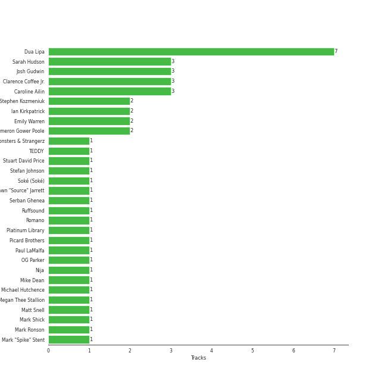

# Dua Lipa

[See Track Features](audio_features.md)

[See Clusters](clusters/overview.md)

## Artist Rank
- The #84 artist of all time

## Top Albums

| Art | Rank | Tracks | 💚 | Album | Release Date | 🔗 |
|:---|---:|---:|---:|:---|:---|:---|
|  | 606 | 6 | 3 | Future Nostalgia | 2020-03-27 | [🔗](https://open.spotify.com/album/5lKlFlReHOLShQKyRv6AL9) |
|  | 606 | 2 | 2 | Dua Lipa (Complete Edition) | 2018-10-19 | [🔗](https://open.spotify.com/album/0obMz8EHnr3dg6NCUK4xWp) |
|  | 606 | 1 | 1 | Sweetest Pie | 2022-03-11 | [🔗](https://open.spotify.com/album/4qw41n8iWrdR70Ui3hYBPv) |
|  | 606 | 1 | 1 | Physical (feat. Hwa Sa) | 2020-01-28 | [🔗](https://open.spotify.com/album/6apIJi4hf7U6cBOFwIqq1b) |
|  | 606 | 1 | 1 | Dance The Night (From Barbie The Album) | 2023-05-25 | [🔗](https://open.spotify.com/album/5cH7FqB7JD5q1tJXJ7FHYu) |
|  | 606 | 1 | 0 | UN DIA (ONE DAY) (Feat. Tainy) | 2020-07-24 | [🔗](https://open.spotify.com/album/6aqSlutLYNpzSsK4dV5jTr) |
|  | 606 | 1 | 0 | One Kiss (with Dua Lipa) | 2018-04-06 | [🔗](https://open.spotify.com/album/7GEzhoTiqcPYkOprWQu581) |
|  | 606 | 1 | 0 | Dua Lipa | 2017-06-02 | [🔗](https://open.spotify.com/album/2vlhlrgMaXqcnhRqIEV9AP) |

## Featured on Playlists
| Art | Tracks | Playlist |
|:---|---:|:---|
|  | 13 | [Pop](../../playlists/pop/overview.md) |
|  | 5 | [Summer](../../playlists/summer/overview.md) |
|  | 3 | [A-Pop Favorites](../../playlists/a-pop_favorites/overview.md) |
|  | 2 | [K-Pop](../../playlists/k-pop/overview.md) |
|  | 1 | [Workout](../../playlists/workout/overview.md) |
|  | 1 | [Not K-Pop](../../playlists/not_k-pop/overview.md) |
|  | 1 | [Karaoke](../../playlists/karaoke/overview.md) |

## Top Record Labels

| Tracks | 💚 | Label |
|---:|---:|:---|
| 10 | 6 | [Warner Records](../../labels/warner_records/overview.md) |
| 1 | 1 | [Atlantic Records](../../labels/atlantic_records/overview.md) |
| 1 | 1 | 300 Entertainment |
| 1 | 0 | Universal Music Latino |
| 1 | 0 | Sony Music UK |
| 1 | 0 | NEON16 |

## Genres

- [dance pop](../../genres/dance_pop/overview.md)
- [pop](../../genres/pop/overview.md)
- [uk pop](../../genres/uk_pop/overview.md)

## Credits

### Credits by Type

| Credit Type | Tracks |
|:---|---:|
| Songwriter | 7 |
| Vocal | 6 |

### Production Credits

| Art | Track | Credit Types |
|:---|:---|:---|
|  | Kiss and Make Up | Songwriter |
|  | Physical (feat. Hwa Sa) | Songwriter |
|  | Don't Start Now | Songwriter |
|  | Break My Heart | Songwriter |
|  | Levitating (feat. DaBaby) | Songwriter |
|  | Sweetest Pie | Songwriter |
|  | Dance The Night - From Barbie The Album | Songwriter |

## Top Producers

| Art | Producer | Tracks | Credit Types |
|:---|:---|---:|:---|
|  | [Dua Lipa](overview.md) | 7 | Songwriter |
| | Clarence Coffee Jr. | 3 | Songwriter |
| | Sarah Hudson | 3 | Songwriter |
| | Caroline Ailin | 3 | Songwriter, Producer |
| | [Josh Gudwin](../../producers/josh_gudwin/overview.md) | 3 | Producer |
| | Emily Warren | 2 | Songwriter |
| | Ian Kirkpatrick | 2 | Producer, Songwriter |
| | Cameron Gower Poole | 2 | Producer |
| | Stephen Kozmeniuk | 2 | Producer, Songwriter |
| | Andrew Watt | 1 | Producer, Songwriter |

View all

| Art | Producer | Tracks | Credit Types |
|:---|:---|---:|:---|
| | Michael Hutchence | 1 | Songwriter |
|  | DaBaby | 1 | Songwriter |
| | Lorna Blackwood | 1 | Producer |
| | Andrew Farriss | 1 | Songwriter |
|  | Mark Ronson | 1 | Producer, Songwriter |
| | Ruffsound | 1 | Songwriter |
| | Mike Dean | 1 | Producer |
| | [Serban Ghenea](../../producers/serban_ghenea/overview.md) | 1 | Producer |
| | KNY Factory | 1 | Songwriter |
| | Platinum Library | 1 | Producer |
| | Matt Snell | 1 | Producer |
|  | Megan Thee Stallion | 1 | Songwriter |
| | KOZ | 1 | Producer |
| | Jordan Johnson | 1 | Songwriter |
| | Mark Shick | 1 | Producer |
| | Stuart David Price | 1 | Producer |
| | Andrew Wyatt | 1 | Producer, Songwriter |
| | Drew Jurecka | 1 | Arranger, Producer |
| | Ali Tamposi | 1 | Songwriter |
| | The Monsters & Strangerz | 1 | Producer |
| | Shawn "Source" Jarrett | 1 | Producer |
| | [Mark "Spike" Stent](../../producers/mark__spike__stent/overview.md) | 1 | Producer |
| | Nija | 1 | Songwriter |
| | Brandon Bost | 1 | Producer |
| | Paul LaMalfa | 1 | Producer |
| | Billboard | 1 | Songwriter |
| | Jason Evigan | 1 | Songwriter |
| | OG Parker | 1 | Producer, Songwriter |
| | Stefan Johnson | 1 | Songwriter |
| | Picard Brothers | 1 | Producer |
| | Soké (Soké) | 1 | Songwriter |
| | Alex Venguer | 1 | Producer |
| | Chelcee Grimes | 1 | Songwriter |
| | Romano | 1 | Producer |
| | [TEDDY](../../producers/teddy/overview.md) | 1 | Songwriter |

## Tracks

| Art | Track | Album | Artists | Label | Rank | 💚 | 🔗 |
|:---|:---|:---|:---|:---|---:|:---|:---|
|  | Hotter Than Hell | Dua Lipa | [Dua Lipa](overview.md) | [Warner Records](../../labels/warner_records) | 911 | | [🔗](https://open.spotify.com/track/7G8bmgKbwPQdwsGXC9QWcL) |
|  | One Kiss (with Dua Lipa) | One Kiss (with Dua Lipa) | Calvin Harris, [Dua Lipa](overview.md) | Sony Music UK | 911 | | [🔗](https://open.spotify.com/track/7ef4DlsgrMEH11cDZd32M6) |
|  | Kiss and Make Up | Dua Lipa (Complete Edition) | [Dua Lipa](overview.md), [BLACKPINK](../blackpink/overview.md) | [Warner Records](../../labels/warner_records) | 911 | 💚 | [🔗](https://open.spotify.com/track/7jr3iPu4O4bTCVwLMbdU2i) |
|  | New Rules | Dua Lipa (Complete Edition) | [Dua Lipa](overview.md) | [Warner Records](../../labels/warner_records) | 911 | 💚 | [🔗](https://open.spotify.com/track/43oK4OAWUsRZUDVeHtKI4U) |
|  | Physical (feat. Hwa Sa) | Physical (feat. Hwa Sa) | [Dua Lipa](overview.md), [HWASA](../hwasa/overview.md) | [Warner Records](../../labels/warner_records) | 911 | 💚 | [🔗](https://open.spotify.com/track/23jEeXRyrjFbfs2Q8tBwdI) |
|  | Break My Heart | Future Nostalgia | [Dua Lipa](overview.md) | [Warner Records](../../labels/warner_records) | 911 | 💚 | [🔗](https://open.spotify.com/track/59CrwNtNqzOmODXRxwaknc) |
|  | Don't Start Now | Future Nostalgia | [Dua Lipa](overview.md) | [Warner Records](../../labels/warner_records) | 911 | 💚 | [🔗](https://open.spotify.com/track/1AVtceapuF36oZqI9gzp0o) |
|  | Hallucinate | Future Nostalgia | [Dua Lipa](overview.md) | [Warner Records](../../labels/warner_records) | 911 | | [🔗](https://open.spotify.com/track/2MUKw7zEirXqdZZ3xC4hOf) |
|  | Levitating (feat. DaBaby) | Future Nostalgia | [Dua Lipa](overview.md), DaBaby | [Warner Records](../../labels/warner_records) | 911 | 💚 | [🔗](https://open.spotify.com/track/5nujrmhLynf4yMoMtj8AQF) |
|  | Physical | Future Nostalgia | [Dua Lipa](overview.md) | [Warner Records](../../labels/warner_records) | 911 | | [🔗](https://open.spotify.com/track/7toYVidBIpAmM8Ife3LGrP) |

See all tracks

| Art | Track | Album | Artists | Label | Rank | 💚 | 🔗 |
|:---|:---|:---|:---|:---|---:|:---|:---|
|  | Pretty Please | Future Nostalgia | [Dua Lipa](overview.md) | [Warner Records](../../labels/warner_records) | 911 | | [🔗](https://open.spotify.com/track/5Pc594FhDA2Fa2prE75GT0) |
|  | UN DIA (ONE DAY) (Feat. Tainy) | UN DIA (ONE DAY) (Feat. Tainy) | J Balvin, [Dua Lipa](overview.md), Bad Bunny, Tainy | Universal Music Latino/ NEON16 | 911 | | [🔗](https://open.spotify.com/track/0EhpEsp4L0oRGM0vmeaN5e) |
|  | Sweetest Pie | Sweetest Pie | Megan Thee Stallion, [Dua Lipa](overview.md) | 300 Entertainment | 911 | 💚 | [🔗](https://open.spotify.com/track/7mFj0LlWtEJaEigguaWqYh) |
|  | Dance The Night - From Barbie The Album | Dance The Night (From Barbie The Album) | [Dua Lipa](overview.md) | [Atlantic Records](../../labels/atlantic_records) | 911 | 💚 | [🔗](https://open.spotify.com/track/1vYXt7VSjH9JIM5oRRo7vA) |

