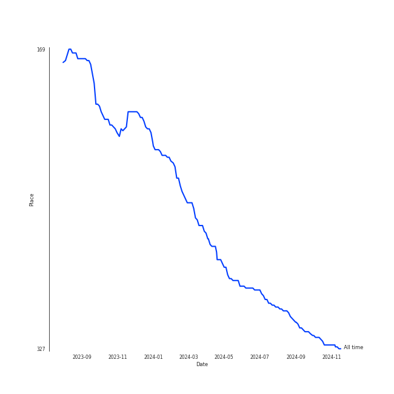
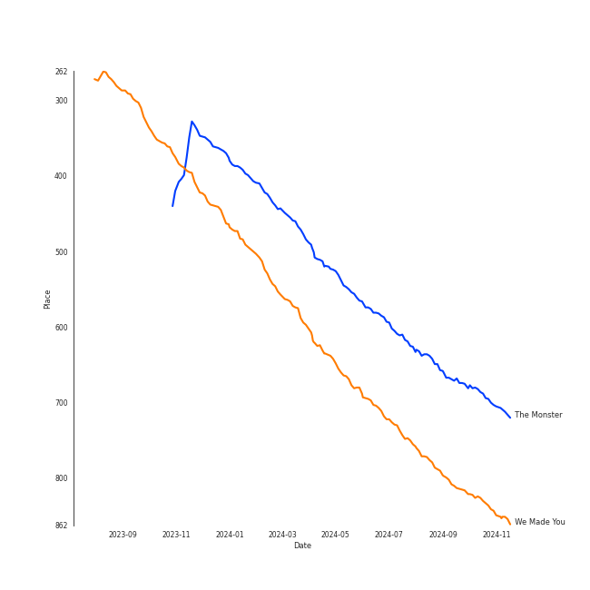
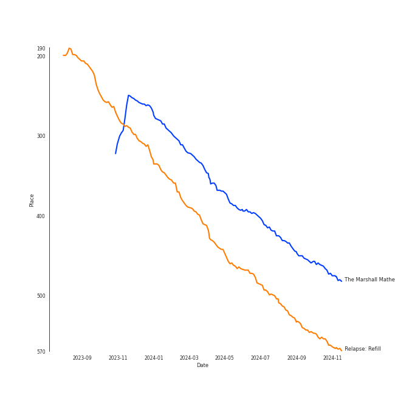

# Eminem

## Artist Rank
- The #317 artist of all time

## Top Tracks

### Top tracks of all time

## Top Albums

| Art | Rank | Tracks | 💚 | Album | Release Date | 🔗 |
|:---|---:|---:|---:|:---|:---|:---|
|  | 452 | 1 | 1 | The Marshall Mathers LP2 | 2013-11-05 | [🔗](https://open.spotify.com/album/3vOgbDjgsZBAPwV2M3bNOj) |
|  | 535 | 1 | 1 | Relapse: Refill | 2009-05-15 | [🔗](https://open.spotify.com/album/7MZzYkbHL9Tk3O6WeD4Z0Z) |
|  | 633 | 1 | 1 | Recovery | 2010-06-18 | [🔗](https://open.spotify.com/album/47BiFcV59TQi2s9SkBo2pb) |
|  | 633 | 1 | 1 | Curtain Call: The Hits (Deluxe Edition) | 2005-12-06 | [🔗](https://open.spotify.com/album/5qENHeCSlwWpEzb25peRmQ) |
|  | 633 | 1 | 0 | Confessions of a Dangerous Mind | 2019-05-10 | [🔗](https://open.spotify.com/album/0XLwImzaZEtqHE4NHAepDz) |

## Featured on Playlists
| Art | Tracks | Playlist |
|:---|---:|:---|
|  | 5 | [Hip Hop](../../playlists/hip_hop/overview.md) |
|  | 1 | [Halloween](../../playlists/halloween/overview.md) |

## Top Record Labels

| Tracks | 💚 | Label |
|---:|---:|:---|
| 4 | 4 | [Aftermath](../../labels/aftermath/overview.md) |
| 1 | 0 | [Def Jam Recordings](../../labels/def_jam_recordings/overview.md) |

## Genres

- detroit hip hop
- [hip hop](../../genres/hip_hop/overview.md)
- [rap](../../genres/rap/overview.md)

## Credits

### Credits by Type

| Credit Type | Tracks |
|:---|---:|
| Producer | 4 |
| Songwriter | 4 |
| Vocal | 3 |

### Production Credits

| Art | Track | Credit Types |
|:---|:---|:---|
|  | Lose Yourself | Producer, Songwriter |
|  | We Made You | Producer |
|  | Love The Way You Lie | Producer, Songwriter |
|  | The Monster | Songwriter |

## Top Producers

| Art | Producer | Tracks | Credit Types |
|:---|:---|---:|:---|
|  | [Eminem](overview.md) | 4 | Producer, Songwriter |
| | Mike Strange | 3 | Producer |
| | Alex da Kid | 1 | Producer, Songwriter |
| | [Marcos Tovar](../../producers/marcos_tovar/overview.md) | 1 | Producer |
|  | Bebe Rexha | 1 | Songwriter |
| | Frequency | 1 | Producer, Songwriter |
| | Skylar Grey | 1 | Songwriter |
| | Luis Resto | 1 | Producer, Songwriter |
| | Doc Ish | 1 | Producer |
|  | [Rihanna](../rihanna/overview.md) | 1 | Songwriter |

View all

| Art | Producer | Tracks | Credit Types |
|:---|:---|---:|:---|
| | Jeff Bass | 1 | Producer, Songwriter |
| | Makeba | 1 | Producer |
| | Maki Athanasiou | 1 | Songwriter |
| | Aalias | 1 | Songwriter |
| | Dr. Dre | 1 | Producer |
| | Steve King | 1 | Producer |
| | Jon Bellion | 1 | Songwriter |
| | Mauricio "Veto" Iragorri | 1 | Producer |

## Tracks

| Art | Track | Album | Artists | Label | Rank | 💚 | 🔗 |
|:---|:---|:---|:---|:---|---:|:---|:---|
|  | The Monster | The Marshall Mathers LP2 | [Eminem](overview.md), [Rihanna](../rihanna/overview.md) | [Aftermath](../../labels/aftermath) | 668 | 💚 | [🔗](https://open.spotify.com/track/48RrDBpOSSl1aLVCalGl5C) |
|  | We Made You | Relapse: Refill | [Eminem](overview.md) | [Aftermath](../../labels/aftermath) | 801 | 💚 | [🔗](https://open.spotify.com/track/4UMTp91LHhvW33ol9ZQH0Q) |
|  | Lose Yourself | Curtain Call: The Hits (Deluxe Edition) | [Eminem](overview.md) | [Aftermath](../../labels/aftermath) | 957 | 💚 | [🔗](https://open.spotify.com/track/5Z01UMMf7V1o0MzF86s6WJ) |
|  | Love The Way You Lie | Recovery | [Eminem](overview.md), [Rihanna](../rihanna/overview.md) | [Aftermath](../../labels/aftermath) | 957 | 💚 | [🔗](https://open.spotify.com/track/15JINEqzVMv3SvJTAXAKED) |
|  | Homicide (feat. Eminem) | Confessions of a Dangerous Mind | Logic, [Eminem](overview.md) | [Def Jam Recordings](../../labels/def_jam_recordings) | 957 | | [🔗](https://open.spotify.com/track/7M2tXmeS15NAzEn7ABFeBg) |
